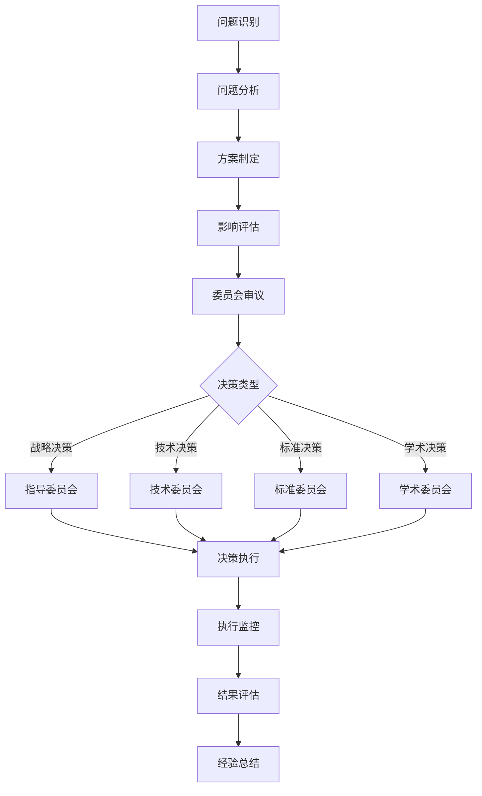

# OpenTelemetry 2025年学术研究项目治理框架

## 📋 治理框架概述

本治理框架基于国际2025年最新项目管理标准和最佳实践，结合CMMI能力成熟度模型和PRINCE2项目管理方法论，为OpenTelemetry学术研究项目提供完整的治理结构。

## 🏛️ 治理结构

### 1. 项目指导委员会（Project Steering Committee）

#### 职责

- 制定项目战略方向和长期目标
- 审批重大决策和资源分配
- 监督项目整体进展和风险
- 确保项目与组织战略对齐

#### 组成

- **主席**：项目发起人/学术机构代表
- **成员**：
  - 学术机构代表（2名）
  - 行业企业代表（2名）
  - 标准组织代表（1名）
  - 开源社区代表（1名）
  - 技术专家代表（1名）

#### 决策机制

- 重大决策需要2/3多数通过
- 每月召开一次会议
- 紧急决策可通过电子投票

### 2. 技术委员会（Technical Committee）

#### 职责2

- 制定技术架构和标准
- 审批技术方案和实现
- 监督技术质量和创新
- 协调技术团队工作

#### 组成2

- **主席**：首席技术官/技术负责人
- **成员**：
  - 架构师（2名）
  - 开发专家（2名）
  - 测试专家（1名）
  - 运维专家（1名）
  - 安全专家（1名）

#### 决策机制2

- 技术决策需要一致通过
- 每两周召开一次会议
- 技术争议通过技术评审解决

### 3. 标准委员会（Standards Committee）

#### 职责3

- 跟踪国际标准发展
- 制定标准对齐策略
- 参与国际标准制定
- 确保合规性要求

#### 组成3

- **主席**：标准专家/合规负责人
- **成员**：
  - ISO标准专家（1名）
  - IEEE标准专家（1名）
  - ITU标准专家（1名）
  - CMMI专家（1名）
  - PRINCE2专家（1名）

#### 决策机制3

- 标准决策需要一致通过
- 每月召开一次会议
- 标准变更需要详细影响分析

### 4. 学术委员会（Academic Committee）

#### 职责4

- 制定学术研究策略
- 管理大学合作关系
- 监督学术论文质量
- 组织学术活动

#### 组成4

- **主席**：学术负责人/大学教授
- **成员**：
  - 大学教授（3名）
  - 研究专家（2名）
  - 博士生代表（1名）
  - 博士后代表（1名）

#### 决策机制4

- 学术决策需要一致通过
- 每月召开一次会议
- 学术争议通过同行评议解决

## 📊 治理流程

### 1. 决策流程

### 2. 变更管理流程

#### 变更请求流程

1. **变更申请**：提交变更请求表
2. **初步评估**：评估变更影响和风险
3. **委员会审议**：相关委员会审议变更
4. **决策批准**：委员会批准或拒绝变更
5. **变更实施**：执行批准的变更
6. **变更验证**：验证变更效果
7. **文档更新**：更新相关文档

#### 变更分类

- **重大变更**：影响项目范围、时间、成本
- **重要变更**：影响技术架构或标准
- **一般变更**：影响实施细节或流程
- **紧急变更**：需要立即处理的变更

### 3. 风险管理流程

#### 风险识别

- 定期风险评估会议
- 利益相关者风险识别
- 历史项目经验分析
- 外部环境变化监控

#### 风险分析

- 风险概率评估
- 风险影响评估
- 风险优先级排序
- 风险应对策略制定

#### 风险监控

- 风险状态跟踪
- 风险指标监控
- 风险报告生成
- 风险应对效果评估

## 📋 治理文档

### 1. 治理政策

- **项目治理政策**：定义治理原则和框架
- **决策管理政策**：定义决策流程和权限
- **变更管理政策**：定义变更管理流程
- **风险管理政策**：定义风险管理流程
- **质量管理政策**：定义质量保证流程

### 2. 治理程序

- **委员会运作程序**：定义委员会运作规则
- **决策程序**：定义决策流程和标准
- **变更程序**：定义变更管理程序
- **风险程序**：定义风险管理程序
- **质量程序**：定义质量保证程序

### 3. 治理模板

- **决策记录模板**：记录决策过程和结果
- **变更请求模板**：提交变更请求
- **风险评估模板**：评估项目风险
- **质量检查模板**：进行质量检查
- **会议记录模板**：记录会议内容

## 🎯 治理指标

### 1. 决策效率指标

- 决策时间：从问题识别到决策完成的时间
- 决策质量：决策实施后的效果评估
- 决策一致性：决策与项目目标的一致性
- 决策透明度：决策过程的透明度

### 2. 变更管理指标

- 变更频率：项目变更的频率
- 变更成功率：变更实施的成功率
- 变更影响：变更对项目的影响
- 变更成本：变更实施的成本

### 3. 风险管理指标

- 风险识别率：识别的风险数量
- 风险应对率：应对的风险比例
- 风险影响：风险对项目的影响
- 风险成本：风险应对的成本

### 4. 质量保证指标

- 质量检查频率：质量检查的频率
- 质量问题数量：发现的质量问题数量
- 质量改进率：质量改进的比例
- 质量成本：质量保证的成本

## 📈 治理改进

### 1. 持续改进机制

- 定期治理评估
- 利益相关者反馈
- 最佳实践学习
- 治理流程优化

### 2. 改进方法

- PDCA循环：计划-执行-检查-行动
- 根本原因分析：分析问题根本原因
- 标杆对比：与最佳实践对比
- 创新思维：探索新的治理方法

### 3. 改进成果

- 治理效率提升
- 决策质量改善
- 风险控制加强
- 质量保证完善

## 🔄 治理审查

### 1. 审查频率

- **月度审查**：每月审查治理指标
- **季度审查**：每季度审查治理流程
- **年度审查**：每年审查治理框架

### 2. 审查内容

- 治理指标分析
- 治理流程评估
- 治理效果评价
- 治理改进建议

### 3. 审查结果

- 审查报告生成
- 改进计划制定
- 治理框架更新
- 经验教训总结

## 📞 治理联系

### 委员会联系方式

- **指导委员会**：<steering@otlp-academic.org>
- **技术委员会**：<technical@otlp-academic.org>
- **标准委员会**：<standards@otlp-academic.org>
- **学术委员会**：<academic@otlp-academic.org>

### 治理支持

- **治理办公室**：<governance@otlp-academic.org>
- **项目管理办公室**：<pmo@otlp-academic.org>
- **质量保证办公室**：<qa@otlp-academic.org>

---

*本文档版本：v1.0*  
*最后更新：2025年1月20日*  
*下次审查：2025年2月20日*
