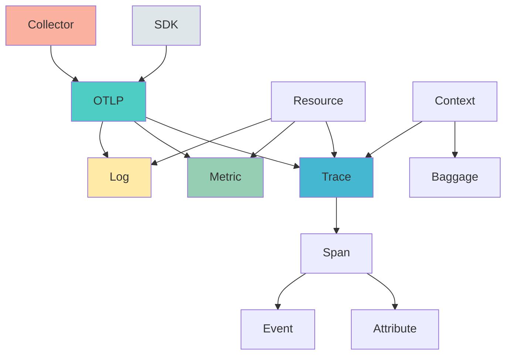

# 📖 OTLP基础概念定义

> **用途**: OTLP协议核心基础概念的权威定义  
> **难度**: ⭐ 入门级  
> **最后更新**: 2025年10月26日  
> **概念数**: 15+

---

## 🎯 概念分类

本文档包含OTLP协议的**核心基础概念**，分为4大类：

1. **数据信号** (4个) - Trace, Span, Metric, Log
2. **协议相关** (3个) - OTLP, gRPC, Protobuf
3. **数据模型** (4个) - Resource, Attribute, Context, Baggage
4. **组件相关** (4个) - SDK, Collector, Exporter, Processor

---

## 1. 数据信号概念

### 1.1 Trace (追踪)

**英文**: Trace  
**中文**: 追踪 / 调用链  
**类型**: 数据信号

**定义**:
Trace是分布式系统中一次完整请求的执行路径记录，由多个Span组成的有向无环图(DAG)。

**核心属性**:

- `trace_id`: 追踪的唯一标识符 (16字节)
- `root_span`: 根Span
- `child_spans`: 子Span集合
- `duration`: 总耗时

**关键特征**:

- ✅ 跨服务边界
- ✅ 保持因果关系
- ✅ 完整的请求生命周期
- ✅ 支持采样

**使用场景**:

- 分布式系统的请求追踪
- 性能瓶颈定位
- 服务依赖分析
- 错误传播追踪

**示例**:

```text
Trace: 一次用户下单请求
├─ Span 1: API Gateway (100ms)
│  ├─ Span 2: Auth Service (20ms)
│  └─ Span 3: Order Service (60ms)
│     ├─ Span 4: Inventory Check (15ms)
│     └─ Span 5: Payment Process (30ms)
└─ Total Duration: 100ms
```

**标准引用**:

- OTLP Specification v1.3.0 - Trace Protocol
- W3C Trace Context

---

### 1.2 Span (跨度)

**英文**: Span  
**中文**: 跨度 / 操作单元  
**类型**: 数据信号

**定义**:
Span是Trace中的最小工作单元，代表一个独立的操作，包含操作名称、开始/结束时间、属性等。

**核心属性**:

- `span_id`: Span唯一标识 (8字节)
- `trace_id`: 所属Trace标识
- `parent_span_id`: 父Span标识
- `name`: 操作名称
- `kind`: Span类型 (CLIENT/SERVER/INTERNAL等)
- `start_time`: 开始时间 (纳秒精度)
- `end_time`: 结束时间
- `attributes`: 键值对属性
- `events`: 事件列表
- `links`: 关联其他Span
- `status`: 状态 (OK/ERROR/UNSET)

**Span类型 (SpanKind)**:

1. **INTERNAL**: 内部操作
2. **SERVER**: 服务端处理
3. **CLIENT**: 客户端调用
4. **PRODUCER**: 消息生产者
5. **CONSUMER**: 消息消费者

**生命周期**:

```text
Created → Started → [Events] → Ended → Exported
```

**示例**:

```json
{
  "trace_id": "5b8aa5a2d2c872e8321cf37308d69df2",
  "span_id": "051581bf3cb55c13",
  "parent_span_id": "5fb15e641dc9f67e",
  "name": "GET /api/orders/{id}",
  "kind": "SERVER",
  "start_time_unix_nano": 1635953280000000000,
  "end_time_unix_nano": 1635953280050000000,
  "attributes": [
    {"key": "http.method", "value": "GET"},
    {"key": "http.status_code", "value": 200}
  ],
  "status": {"code": "OK"}
}
```

**标准引用**:

- OTLP Specification - TracesData
- OpenTelemetry Span Specification

---

### 1.3 Metric (指标)

**英文**: Metric  
**中文**: 指标 / 度量  
**类型**: 数据信号

**定义**:
Metric是系统在特定时间点的数值度量，用于监控系统健康状况和性能趋势。

**指标类型**:

1. **Counter (计数器)**
   - 单调递增
   - 示例: 请求总数、错误总数

2. **Gauge (仪表)**
   - 可增可减
   - 示例: CPU使用率、内存占用

3. **Histogram (直方图)**
   - 值的分布统计
   - 示例: 请求延迟分布、响应大小分布

4. **Summary (摘要)**
   - 分位数统计
   - 示例: P50/P90/P99延迟

**核心属性**:

- `name`: 指标名称
- `description`: 描述
- `unit`: 单位
- `data_points`: 数据点集合
- `aggregation_temporality`: 聚合时序性

**示例**:

```text
http_requests_total{method="GET", status="200"} 1547
http_request_duration_seconds{quantile="0.99"} 0.156
memory_usage_bytes 4294967296
```

**标准引用**:

- OTLP Specification - MetricsData
- OpenMetrics Standard

---

### 1.4 Log (日志)

**英文**: Log  
**中文**: 日志  
**类型**: 数据信号

**定义**:
Log是系统在特定时间点发生的事件的文本记录，包含时间戳、严重性级别和消息内容。

**核心属性**:

- `timestamp`: 时间戳 (纳秒精度)
- `severity_number`: 严重性数值 (1-24)
- `severity_text`: 严重性文本 (TRACE/DEBUG/INFO/WARN/ERROR/FATAL)
- `body`: 日志主体内容
- `attributes`: 属性
- `trace_id`: 关联的Trace (可选)
- `span_id`: 关联的Span (可选)

**严重性级别**:

```text
TRACE (1-4)    → 详细追踪
DEBUG (5-8)    → 调试信息
INFO (9-12)    → 一般信息
WARN (13-16)   → 警告
ERROR (17-20)  → 错误
FATAL (21-24)  → 致命错误
```

**与Trace关联**:

```text
Log + trace_id + span_id → 关联到具体Span
好处: 从日志跳转到完整调用链
```

**示例**:

```json
{
  "timestamp": 1635953280000000000,
  "severity_number": 17,
  "severity_text": "ERROR",
  "body": "Database connection timeout",
  "attributes": [
    {"key": "db.type", "value": "postgresql"},
    {"key": "db.host", "value": "localhost:5432"}
  ],
  "trace_id": "5b8aa5a2d2c872e8321cf37308d69df2",
  "span_id": "051581bf3cb55c13"
}
```

**标准引用**:

- OTLP Specification - LogsData
- OpenTelemetry Logs Data Model

---

## 2. 协议相关概念

### 2.1 OTLP (OpenTelemetry Protocol)

**英文**: OTLP (OpenTelemetry Protocol)  
**中文**: 开放遥测协议  
**类型**: 传输协议

**定义**:
OTLP是OpenTelemetry定义的统一遥测数据传输协议，用于在SDK、Collector和后端之间传输Traces、Metrics和Logs。

**核心特性**:

- ✅ **统一协议**: 三种信号使用同一协议
- ✅ **双传输**: gRPC (4317) + HTTP/Protobuf (4318)
- ✅ **高效**: Protocol Buffers序列化
- ✅ **可扩展**: 支持自定义属性
- ✅ **版本兼容**: 向后兼容保证

**协议版本**:

- v0.x: 实验阶段 (2020-2021)
- **v1.0.0**: 稳定版本 (2023-02) ⭐
- v1.3.0: 当前最新 (2025) ⭐

**传输模式**:

| 模式 | 端口 | 协议 | 优势 |
|-----|------|------|------|
| **gRPC** | 4317 | HTTP/2 | 高性能、流控、双向流 |
| **HTTP** | 4318 | HTTP/1.1 | 易集成、防火墙友好 |

**数据流向**:

```text
App SDK → OTLP → Collector → OTLP → Backend
         (gRPC/HTTP)        (任意协议)
```

**标准引用**:

- OTLP Specification v1.3.0
- OpenTelemetry Protocol Documentation

---

### 2.2 gRPC

**英文**: gRPC (gRPC Remote Procedure Call)  
**中文**: gRPC远程过程调用  
**类型**: 传输协议

**定义**:
gRPC是Google开源的高性能RPC框架，基于HTTP/2，是OTLP的默认传输协议。

**核心特性**:

- ✅ HTTP/2多路复用
- ✅ 二进制协议 (Protobuf)
- ✅ 流式传输 (双向流)
- ✅ 内置负载均衡
- ✅ 自动代码生成

**在OTLP中的使用**:

```text
Service定义:
- TraceService.Export(ExportTraceServiceRequest)
- MetricsService.Export(ExportMetricsServiceRequest)
- LogsService.Export(ExportLogsServiceRequest)

默认端口: 4317
压缩: gzip (可选)
```

**优势**:

- 高性能 (比HTTP/1.1快2-5倍)
- 低延迟 (二进制+多路复用)
- 流控能力 (背压机制)

---

### 2.3 Protobuf (Protocol Buffers)

**英文**: Protocol Buffers  
**中文**: 协议缓冲区  
**类型**: 序列化格式

**定义**:
Protobuf是Google开发的语言中立、平台中立的结构化数据序列化机制，是OTLP的数据编码格式。

**核心特性**:

- ✅ 二进制格式 (比JSON小3-10倍)
- ✅ 强类型定义
- ✅ 向前/向后兼容
- ✅ 自动代码生成
- ✅ 跨语言支持

**OTLP中的Protobuf定义**:

```protobuf
message Span {
  bytes trace_id = 1;
  bytes span_id = 2;
  bytes parent_span_id = 3;
  string name = 4;
  SpanKind kind = 5;
  fixed64 start_time_unix_nano = 6;
  fixed64 end_time_unix_nano = 7;
  repeated KeyValue attributes = 8;
  // ...
}
```

**性能对比**:

- Protobuf: 100 bytes
- JSON: 300-500 bytes
- 压缩比: 3-5倍

---

## 3. 数据模型概念

### 3.1 Resource (资源)

**英文**: Resource  
**中文**: 资源  
**类型**: 数据模型

**定义**:
Resource表示产生遥测数据的实体，如服务、容器、主机等，包含一组描述该实体的属性。

**核心属性** (Semantic Conventions):

```text
service.name         → 服务名称 (必需)
service.version      → 服务版本
service.namespace    → 服务命名空间
host.name           → 主机名
container.id        → 容器ID
k8s.pod.name        → K8s Pod名称
cloud.provider      → 云提供商 (aws/gcp/azure)
cloud.region        → 云区域
```

**层次结构**:

```text
Cloud Provider
  └─ Region
      └─ Cluster
          └─ Host
              └─ Container
                  └─ Process
                      └─ Service
```

**示例**:

```json
{
  "attributes": [
    {"key": "service.name", "value": "order-service"},
    {"key": "service.version", "value": "1.2.3"},
    {"key": "host.name", "value": "prod-server-01"},
    {"key": "container.id", "value": "abc123..."},
    {"key": "k8s.pod.name", "value": "order-service-5f7d8-xz9mn"}
  ]
}
```

---

### 3.2 Attribute (属性)

**英文**: Attribute  
**中文**: 属性  
**类型**: 数据模型

**定义**:
Attribute是键值对形式的元数据，用于描述和标注遥测数据。

**数据类型**:

1. **String**: 字符串
2. **Boolean**: 布尔值
3. **Int64**: 64位整数
4. **Double**: 双精度浮点数
5. **Array**: 数组 (同类型元素)

**命名规范** (Semantic Conventions):

```text
命名空间.对象.属性

例子:
http.method             → HTTP方法
http.status_code        → HTTP状态码
db.system              → 数据库系统
db.statement           → SQL语句
messaging.destination  → 消息目标
```

**最佳实践**:

- ✅ 使用小写和下划线
- ✅ 遵循语义约定
- ✅ 避免高基数 (如用户ID)
- ✅ 控制数量 (建议<50个/Span)

**示例**:

```json
{
  "attributes": [
    {"key": "http.method", "value": {"string_value": "GET"}},
    {"key": "http.status_code", "value": {"int_value": 200}},
    {"key": "http.response_size", "value": {"int_value": 1024}},
    {"key": "custom.user_tier", "value": {"string_value": "premium"}}
  ]
}
```

---

### 3.3 Context (上下文)

**英文**: Context  
**中文**: 上下文  
**类型**: 数据模型

**定义**:
Context是在分布式系统中跨服务边界传播的元数据容器，用于关联和追踪请求。

**核心内容**:

1. **Trace Context** (W3C标准):
   - `traceparent`: trace-id + span-id + flags
   - `tracestate`: 厂商特定状态

2. **Baggage** (W3C标准):
   - 用户自定义键值对
   - 跨服务传播

**传播机制**:

```text
HTTP Headers:
  traceparent: 00-trace_id-span_id-flags
  tracestate: vendor1=value1,vendor2=value2
  baggage: key1=value1,key2=value2

gRPC Metadata:
  grpc-trace-bin: [binary context]
```

**示例**:

```http
GET /api/orders HTTP/1.1
traceparent: 00-5b8aa5a2d2c872e8321cf37308d69df2-051581bf3cb55c13-01
tracestate: congo=t61rcWkgMzE
baggage: userId=12345,experiment=feature-x
```

**标准引用**:

- W3C Trace Context
- W3C Baggage

---

### 3.4 Baggage (行李)

**英文**: Baggage  
**中文**: 行李 / 上下文传播数据  
**类型**: 数据模型

**定义**:
Baggage是跨服务传播的用户自定义键值对，用于在整个请求链路中共享业务上下文。

**使用场景**:

- **A/B测试标识**: `experiment=new-ui`
- **用户标识**: `user-tier=premium`
- **租户ID**: `tenant-id=corp-123`
- **功能开关**: `feature-flag=beta-enabled`

**核心特性**:

- ✅ 自动跨服务传播
- ✅ 低开销 (HTTP Header)
- ✅ 语言无关
- ⚠️ 有大小限制 (推荐<1KB)

**与Attribute区别**:

| 特性 | Attribute | Baggage |
|-----|-----------|---------|
| **传播** | 不传播 | 自动传播 |
| **用途** | 描述当前操作 | 共享业务上下文 |
| **生命周期** | 单个Span | 整个Trace |

**示例**:

```go
// 设置Baggage
baggage.Set(ctx, "user-tier", "premium")
baggage.Set(ctx, "experiment", "new-checkout")

// 下游服务自动获取
tier := baggage.GetValue(ctx, "user-tier") // "premium"
```

**最佳实践**:

- ✅ 控制大小 (<1KB)
- ✅ 避免敏感信息
- ✅ 使用稳定的键名
- ❌ 不要存储大量数据

---

## 4. 组件相关概念

### 4.1 SDK (Software Development Kit)

**英文**: SDK  
**中文**: 软件开发工具包  
**类型**: 组件

**定义**:
SDK是集成到应用程序中的库，用于生成、收集和导出遥测数据。

**核心组件**:

```text
SDK
├── API Layer        → 用户接口
├── Tracer          → 生成Trace
├── Meter           → 生成Metric
├── Logger          → 生成Log
├── Context         → 上下文传播
├── Processor       → 数据处理
└── Exporter        → 数据导出
```

**生命周期**:

```text
1. 初始化配置
2. 创建Provider
3. 埋点生成数据
4. 批处理
5. 导出到Collector/Backend
```

**官方支持语言**:

- ✅ Java
- ✅ Go
- ✅ Python
- ✅ JavaScript/Node.js
- ✅ .NET
- ✅ Ruby
- ✅ PHP
- ✅ Rust
- ✅ C++

**示例** (Go):

```go
// 初始化
provider := sdktrace.NewTracerProvider(
    sdktrace.WithBatcher(exporter),
)

// 创建Tracer
tracer := provider.Tracer("my-service")

// 创建Span
ctx, span := tracer.Start(ctx, "operation-name")
defer span.End()
```

---

### 4.2 Collector (收集器)

**英文**: Collector  
**中文**: 收集器  
**类型**: 组件

**定义**:
Collector是独立的代理服务，用于接收、处理和导出遥测数据，解耦SDK和后端。

**核心架构**:

```text
Receiver → Processor → Exporter
   ↓           ↓           ↓
 接收数据   处理数据   导出数据
```

**主要功能**:

1. **接收** (Receiver): 接收多种格式数据
   - OTLP (gRPC/HTTP)
   - Jaeger
   - Zipkin
   - Prometheus

2. **处理** (Processor): 数据处理
   - Batch: 批处理
   - Memory Limiter: 内存限制
   - Attributes: 属性处理
   - Tail Sampling: 尾部采样

3. **导出** (Exporter): 导出到后端
   - OTLP
   - Jaeger
   - Prometheus
   - Kafka
   - S3

**部署模式**:

```text
1. Agent模式: 每台主机一个Collector
2. Gateway模式: 集中式Collector集群
3. 混合模式: Agent → Gateway → Backend
```

**配置示例**:

```yaml
receivers:
  otlp:
    protocols:
      grpc:
        endpoint: 0.0.0.0:4317

processors:
  batch:
    timeout: 1s
  memory_limiter:
    limit_mib: 512

exporters:
  otlp:
    endpoint: backend:4317

service:
  pipelines:
    traces:
      receivers: [otlp]
      processors: [memory_limiter, batch]
      exporters: [otlp]
```

---

### 4.3 Exporter (导出器)

**英文**: Exporter  
**中文**: 导出器  
**类型**: 组件

**定义**:
Exporter负责将遥测数据发送到后端存储或分析系统。

**类型**:

1. **OTLP Exporter**: 发送到支持OTLP的后端
2. **Jaeger Exporter**: 发送到Jaeger
3. **Prometheus Exporter**: 暴露Prometheus指标
4. **Zipkin Exporter**: 发送到Zipkin
5. **Console Exporter**: 打印到控制台 (调试用)
6. **File Exporter**: 写入文件

**配置选项**:

```text
endpoint       → 后端地址
timeout        → 超时时间
compression    → 压缩方式 (gzip)
headers        → 自定义头
retry_config   → 重试配置
```

**示例** (Go):

```go
exporter, err := otlptracegrpc.New(
    context.Background(),
    otlptracegrpc.WithEndpoint("localhost:4317"),
    otlptracegrpc.WithInsecure(),
    otlptracegrpc.WithTimeout(5*time.Second),
)
```

---

### 4.4 Processor (处理器)

**英文**: Processor  
**中文**: 处理器  
**类型**: 组件

**定义**:
Processor在遥测数据导出前对其进行处理、转换或过滤。

**常用Processor**:

1. **Batch Processor**
   - 批量聚合数据
   - 减少网络请求
   - 配置: timeout, send_batch_size

2. **Memory Limiter**
   - 限制内存使用
   - 防止OOM
   - 配置: limit_mib, check_interval

3. **Attributes Processor**
   - 添加/删除/修改属性
   - 示例: 添加环境标签

4. **Span Processor**
   - 修改Span名称
   - 过滤敏感数据

5. **Tail Sampling Processor**
   - 基于完整Trace的智能采样
   - 保留所有错误Trace

**处理流程**:

```text
Receive → Process 1 → Process 2 → ... → Export
           (batch)    (filter)         (transform)
```

**示例配置**:

```yaml
processors:
  batch:
    timeout: 1s
    send_batch_size: 1024
    
  attributes:
    actions:
      - key: environment
        value: production
        action: insert
        
  filter:
    traces:
      span:
        - 'attributes["http.status_code"] >= 400'
```

---

## 📊 概念关系总结

### 核心关系图



---

## 🔗 相关资源

### 标准文档

- [OTLP Specification v1.3.0](https://opentelemetry.io/docs/specs/otlp/)
- [OpenTelemetry Specification](https://opentelemetry.io/docs/specs/otel/)
- [Semantic Conventions v1.29.0](https://opentelemetry.io/docs/specs/semconv/)

### 下一步阅读

- [02_形式化概念.md](./02_形式化概念.md) - 形式化理论概念
- [03_实现概念.md](./03_实现概念.md) - 技术实现概念
- [04_概念关系图.md](./04_概念关系图.md) - 概念关联可视化

---

**版本**: v1.0.0  
**创建日期**: 2025年10月26日  
**维护团队**: OTLP项目团队
