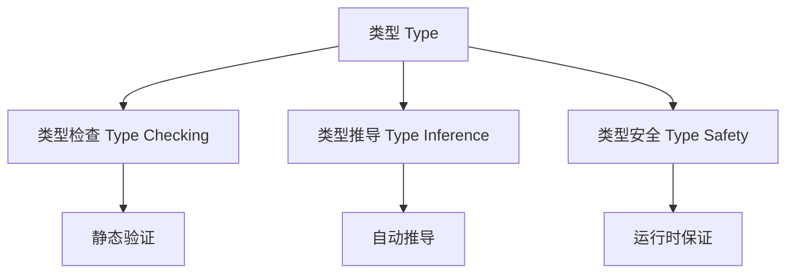
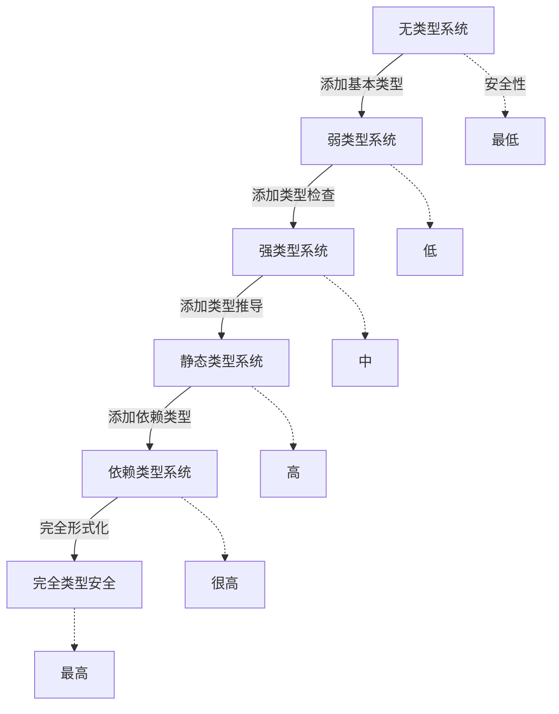
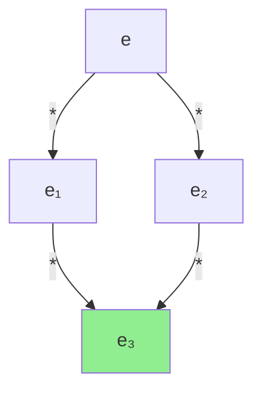

# 形式化概念索引

> **文档版本**: v1.0  
> **创建日期**: 2025-10-26  
> **维护团队**: OTLP项目组  
> **适用范围**: 形式化验证、类型系统、代数框架

---

## 📋 文档概述

本文档提供OTLP项目中所有**形式化理论概念**的统一定义、数学表示、性质证明和应用实例。

### 覆盖范围
- **类型系统**: 15个核心概念
- **操作语义**: 12个核心概念
- **代数框架**: 18个核心概念
- **形式化证明**: 10个核心概念

### 使用指南
- 🔍 快速查找：使用Ctrl+F搜索概念名称
- 📖 系统学习：按章节顺序阅读
- 🔗 交叉引用：点击链接跳转相关概念
- 💡 实践应用：参考每个概念的应用示例

---

## 1. 类型系统 (Type System)

### 1.1 类型 (Type)

#### 定义
**类型**是对值的分类系统，定义了值的结构、操作和行为约束。

#### 数学表示
```
τ ::= Base              -- 基本类型
    | τ₁ → τ₂          -- 函数类型
    | τ₁ × τ₂          -- 积类型
    | τ₁ + τ₂          -- 和类型
    | μα.τ              -- 递归类型
    | ∀α.τ              -- 全称类型
```

#### 形式化定义
```
Type = {τ | τ满足良构性条件}
where 良构性条件包括:
  1. 类型变量绑定正确
  2. 递归定义有限展开
  3. 类型构造保持一致性
```

#### 核心属性
- **良构性** (Well-formedness): 所有类型表达式必须语法正确
- **可判定性** (Decidability): 类型检查在有限时间内终止
- **健壮性** (Soundness): 类型安全保证运行时不出错
- **完备性** (Completeness): 所有合法程序都可以被类型化

#### 与其他概念的关系


#### 应用示例

**示例1: Trace类型定义**
```typescript
// 定义Trace类型
type Trace = {
  traceId: TraceID,        // 追踪标识符
  spans: Array<Span>,      // Span数组
  resource: Resource,      // 资源信息
  timestamp: Timestamp     // 时间戳
}

// 类型检查
function validateTrace(t: Trace): boolean {
  return (
    isValidTraceID(t.traceId) &&
    t.spans.every(isValidSpan) &&
    isValidResource(t.resource)
  );
}
```

**示例2: 函数类型应用**
```
processSpan :: Span → Result
  where Span = SpanID × TraceID × Timestamp
        Result = Either Error ProcessedSpan
```

#### 在OTLP中的应用
- **数据模型**: 定义Trace、Span、Metric、Log的类型
- **API设计**: 确保接口类型安全
- **协议验证**: 保证数据格式一致性
- **错误预防**: 编译期捕获类型错误

#### 参考文献
- [Types and Programming Languages](Pierce, 2002)
- [Advanced Topics in Types and Programming Languages](Pierce, 2004)
- [OTLP Type System Specification](../02_知识图谱/03_理论基础知识图谱.md)

---

### 1.2 类型检查 (Type Checking)

#### 定义
**类型检查**是验证程序表达式是否符合类型规则的过程。

#### 形式化定义
```
类型检查判断: Γ ⊢ e : τ

其中:
  Γ: 类型环境 (变量到类型的映射)
  e: 表达式
  τ: 类型
  
读作: "在类型环境Γ下，表达式e具有类型τ"
```

#### 类型检查规则

**规则1: 变量查找**
```
(VAR)  x:τ ∈ Γ
       ─────────
       Γ ⊢ x : τ
```

**规则2: 函数应用**
```
(APP)  Γ ⊢ e₁ : τ₁ → τ₂    Γ ⊢ e₂ : τ₁
       ────────────────────────────────
       Γ ⊢ e₁ e₂ : τ₂
```

**规则3: Lambda抽象**
```
(ABS)  Γ, x:τ₁ ⊢ e : τ₂
       ─────────────────────
       Γ ⊢ λx.e : τ₁ → τ₂
```

#### 算法实现
```
typecheck(Γ, e) =
  case e of
    Var(x) → 
      if x ∈ Γ then Γ(x)
      else TypeError("未定义变量")
      
    App(e₁, e₂) →
      let τ₁ = typecheck(Γ, e₁)
      let τ₂ = typecheck(Γ, e₂)
      match τ₁ with
        | Arrow(τ_arg, τ_ret) →
          if τ₂ = τ_arg then τ_ret
          else TypeError("类型不匹配")
        | _ → TypeError("期望函数类型")
        
    Abs(x, τ, e_body) →
      let τ_body = typecheck(Γ[x ↦ τ], e_body)
      Arrow(τ, τ_body)
```

#### 复杂度分析
- **时间复杂度**: O(n × m)，n为表达式大小，m为类型大小
- **空间复杂度**: O(d)，d为AST深度
- **可判定性**: 对于简单类型系统，类型检查是可判定的

#### 在OTLP中的应用
```typescript
// OTLP Span类型检查
function checkSpan(span: unknown): span is Span {
  return (
    typeof span === 'object' &&
    span !== null &&
    'spanId' in span &&
    'traceId' in span &&
    'timestamp' in span &&
    checkSpanID(span.spanId) &&
    checkTraceID(span.traceId) &&
    checkTimestamp(span.timestamp)
  );
}
```

#### 相关概念
- ← [类型](#11-类型-type)
- → [类型推导](#13-类型推导-type-inference)
- → [类型安全](#14-类型安全-type-safety)

---

### 1.3 类型推导 (Type Inference)

#### 定义
**类型推导**是自动推断表达式类型的过程，无需显式类型标注。

#### 形式化定义
```
类型推导问题:
  给定: Γ (类型环境), e (表达式)
  求解: τ 使得 Γ ⊢ e : τ

约束生成与求解:
  1. 遍历表达式生成类型约束
  2. 使用统一算法求解约束
  3. 生成最通用类型 (Principal Type)
```

#### Hindley-Milner算法

**算法步骤**:
```
infer(Γ, e) =
  case e of
    Var(x) → 
      instantiate(Γ(x))
      
    App(e₁, e₂) →
      τ₁ = infer(Γ, e₁)
      τ₂ = infer(Γ, e₂)
      α = fresh_type_var()
      unify(τ₁, τ₂ → α)
      return α
      
    Abs(x, e_body) →
      α = fresh_type_var()
      τ_body = infer(Γ[x ↦ α], e_body)
      return α → τ_body
      
    Let(x, e₁, e₂) →
      τ₁ = infer(Γ, e₁)
      σ = generalize(Γ, τ₁)
      return infer(Γ[x ↦ σ], e₂)
```

**统一算法 (Unification)**:
```
unify(τ₁, τ₂) =
  case (τ₁, τ₂) of
    (α, τ) | (τ, α) →
      if α ∈ FV(τ) then fail "无限类型"
      else substitute(α ↦ τ)
      
    (τ₁ → τ₂, τ₃ → τ₄) →
      unify(τ₁, τ₃)
      unify(τ₂, τ₄)
      
    (Base₁, Base₂) →
      if Base₁ = Base₂ then succeed
      else fail "类型不匹配"
```

#### 主要类型定理 (Principal Type Theorem)

**定理**: 如果表达式e可类型化，则存在唯一的最通用类型σ，使得：
1. Γ ⊢ e : σ
2. 对任何Γ ⊢ e : τ，存在替换S使得τ = S(σ)

**证明思路**:
1. 通过结构归纳证明算法正确性
2. 证明生成的类型是最通用的
3. 证明类型的唯一性（模替换）

#### 泛化与实例化

**泛化 (Generalization)**:
```
generalize(Γ, τ) = ∀α₁...αₙ.τ
  where {α₁,...,αₙ} = FV(τ) \ FV(Γ)
```

**实例化 (Instantiation)**:
```
instantiate(∀α₁...αₙ.τ) = [α₁↦τ₁,...,αₙ↦τₙ]τ
  where τ₁,...,τₙ are fresh type variables
```

#### 在OTLP中的应用

**示例: Span处理函数类型推导**
```typescript
// 无需显式类型标注
const processSpan = (span) => ({
  id: span.spanId,
  trace: span.traceId,
  duration: span.endTime - span.startTime
});

// 推导出的类型:
// processSpan :: Span → ProcessedSpan
// where ProcessedSpan = {
//   id: SpanID,
//   trace: TraceID,
//   duration: Duration
// }
```

#### 复杂度
- **最坏情况**: O(2^n) （实际很少发生）
- **平均情况**: O(n log n)
- **空间**: O(n)

#### 相关概念
- ← [类型检查](#12-类型检查-type-checking)
- → [多态类型](#15-多态类型-polymorphic-type)
- → [类型约束](#16-类型约束-type-constraint)

---

### 1.4 类型安全 (Type Safety)

#### 定义
**类型安全**保证类型正确的程序在运行时不会出现类型错误。

#### 形式化定义

**进展性 (Progress)**:
```
定理: 如果 ∅ ⊢ e : τ，则:
  1. e是值，或
  2. 存在e'使得 e → e'
  
含义: 良类型的闭表达式要么是值，要么可以继续执行
```

**保型性 (Preservation)**:
```
定理: 如果 Γ ⊢ e : τ 且 e → e'，
     则 Γ ⊢ e' : τ
     
含义: 执行步骤保持类型不变
```

**类型安全定理**:
```
定理 (Type Safety):
  如果 ∅ ⊢ e : τ，则:
  1. e不会卡住 (不会到达既非值也无法执行的状态)
  2. 如果 e →* v，则 v : τ
  
证明: 结合进展性和保型性，使用归纳法
```

#### 证明技术

**进展性证明**:
```
证明 (Progress): 对e的结构归纳
  Base case: e是常量或变量
    - 常量: 已是值
    - 变量: 在闭表达式中不出现
    
  Inductive case: e = e₁ e₂
    - IH: e₁和e₂满足进展性
    - Case 1: e₁是值 → 分析e₁的形式
      * 如果e₁ = λx.e₃，则可以β-归约
    - Case 2: e₁可执行 → e = e₁ e₂可执行
```

**保型性证明**:
```
证明 (Preservation): 对执行关系的归纳
  Case: (λx:τ₁.e) v → [x↦v]e
    已知: Γ ⊢ λx:τ₁.e : τ₁ → τ₂
         Γ ⊢ v : τ₁
    推导: Γ, x:τ₁ ⊢ e : τ₂  (由typing规则)
    
    引理 (Substitution): 
      如果 Γ, x:τ₁ ⊢ e : τ₂ 且 Γ ⊢ v : τ₁
      则 Γ ⊢ [x↦v]e : τ₂
      
    因此: Γ ⊢ [x↦v]e : τ₂  ✓
```

#### 常见类型错误

**运行时类型错误示例**:
```
1. 类型不匹配
   error: 3 + "hello"
   
2. 空指针/未定义
   error: null.field
   
3. 数组越界
   error: arr[1000] where len(arr) = 10
   
4. 方法不存在
   error: obj.nonexistentMethod()
```

**类型系统如何预防**:
```
1. 静态类型检查 → 编译期拒绝
2. 空值安全 (Option/Maybe类型)
3. 边界检查 (依赖类型)
4. 结构类型检查
```

#### 在OTLP中的应用

**类型安全的Span处理**:
```typescript
// 类型安全的Result类型
type Result<T, E> = 
  | { kind: 'ok', value: T }
  | { kind: 'error', error: E };

// 安全的Span解析
function parseSpan(data: unknown): Result<Span, ParseError> {
  // 类型检查
  if (!isObject(data)) {
    return { kind: 'error', error: 'NotAnObject' };
  }
  
  // 字段验证
  if (!('spanId' in data) || !isSpanID(data.spanId)) {
    return { kind: 'error', error: 'InvalidSpanID' };
  }
  
  // 类型转换（安全）
  return {
    kind: 'ok',
    value: {
      spanId: data.spanId,
      traceId: data.traceId,
      timestamp: data.timestamp
    }
  };
}

// 使用（强制处理错误）
const result = parseSpan(rawData);
match result {
  case { kind: 'ok', value } => processSpan(value),
  case { kind: 'error', error } => handleError(error)
}
```

#### 类型安全等级



#### 相关概念
- ← [类型](#11-类型-type)
- ← [类型检查](#12-类型检查-type-checking)
- → [健壮性证明](#21-健壮性证明-soundness-proof)

---

### 1.5 多态类型 (Polymorphic Type)

#### 定义
**多态类型**允许函数或数据结构在多种类型上工作，同时保持类型安全。

#### 分类

**1. 参数多态 (Parametric Polymorphism)**
```
-- 泛型函数
id :: ∀α. α → α
id x = x

-- 泛型数据结构
List :: ∀α. Type
List α = Nil | Cons α (List α)
```

**2. 特设多态 (Ad-hoc Polymorphism)**
```
-- 函数重载
(+) :: Int → Int → Int
(+) :: Float → Float → Float
(+) :: String → String → String

-- 类型类约束
class Eq α where
  (==) :: α → α → Bool
```

**3. 子类型多态 (Subtype Polymorphism)**
```
-- 子类型关系
Span <: Telemetry
Metric <: Telemetry
Log <: Telemetry

-- 协变和逆变
covariant: C[Span] <: C[Telemetry]
contravariant: C[Telemetry] <: C[Span]
```

#### System F (多态λ演算)

**语法**:
```
e ::= x                -- 变量
    | λx:τ.e          -- 项抽象
    | e₁ e₂           -- 项应用
    | Λα.e            -- 类型抽象
    | e[τ]            -- 类型应用

τ ::= α               -- 类型变量
    | τ₁ → τ₂         -- 函数类型
    | ∀α.τ            -- 全称类型
```

**类型规则**:
```
(T-TABS)  Γ, α ⊢ e : τ
          ───────────────
          Γ ⊢ Λα.e : ∀α.τ

(T-TAPP)  Γ ⊢ e : ∀α.τ₁
          ─────────────────
          Γ ⊢ e[τ₂] : [α↦τ₂]τ₁
```

#### 在OTLP中的应用

**泛型数据处理器**:
```typescript
// 泛型Processor接口
interface Processor<T> {
  process(data: T): Result<ProcessedData<T>>;
  validate(data: T): boolean;
}

// Span处理器实现
class SpanProcessor implements Processor<Span> {
  process(span: Span): Result<ProcessedData<Span>> {
    return {
      data: {
        id: span.spanId,
        metrics: extractMetrics(span),
        relationships: findRelationships(span)
      }
    };
  }
  
  validate(span: Span): boolean {
    return (
      isValidSpanID(span.spanId) &&
      isValidTraceID(span.traceId) &&
      span.startTime <= span.endTime
    );
  }
}

// 泛型批处理函数
function batchProcess<T>(
  items: T[],
  processor: Processor<T>
): Result<ProcessedData<T>[]> {
  return items
    .filter(processor.validate)
    .map(processor.process)
    .reduce(combineResults, { kind: 'ok', value: [] });
}
```

**类型约束示例**:
```typescript
// 可序列化约束
interface Serializable {
  toJSON(): string;
  fromJSON(json: string): this;
}

// 泛型存储
class Storage<T extends Serializable> {
  save(key: string, value: T): void {
    localStorage.setItem(key, value.toJSON());
  }
  
  load(key: string, constructor: new () => T): T | null {
    const json = localStorage.getItem(key);
    if (!json) return null;
    return new constructor().fromJSON(json);
  }
}

// 使用
class Span implements Serializable {
  toJSON(): string { /* ... */ }
  fromJSON(json: string): this { /* ... */ }
}

const spanStorage = new Storage<Span>();
spanStorage.save('currentSpan', mySpan);
```

#### 秩-n多态 (Rank-n Polymorphism)

**定义**:
```
Rank-0: τ (无量词)
Rank-1: ∀α.τ (最外层量词) - Hindley-Milner
Rank-2: ∀α.(∀β.τ₁) → τ₂ (函数参数有量词)
Rank-n: 嵌套n层量词
```

**应用示例**:
```typescript
// Rank-2类型
type Rank2 = <A>(f: <B>(x: B) => B, a: A) => A;

const applyTwice: Rank2 = (f, a) => f(f(a));

// 使用
const result = applyTwice(
  <T>(x: T) => x,  // 多态恒等函数
  42
); // result: number = 42
```

#### 相关概念
- ← [类型](#11-类型-type)
- → [类型推导](#13-类型推导-type-inference)
- → [代数数据类型](#31-代数数据类型-algebraic-data-type)

---

## 2. 操作语义 (Operational Semantics)

### 2.1 归约关系 (Reduction Relation)

#### 定义
**归约关系**描述程序表达式如何一步步执行到结果。

#### 形式化定义
```
归约关系: e → e'
读作: "表达式e可以一步归约到e'"

自反传递闭包: e →* e'
含义: "e经过零步或多步归约到e'"
```

#### 小步语义 (Small-Step Semantics)

**基本归约规则**:
```
(E-APP1)  e₁ → e₁'
          ─────────────
          e₁ e₂ → e₁' e₂

(E-APP2)  e₂ → e₂'
          ─────────────────
          v₁ e₂ → v₁ e₂'

(E-APPABS)  
          ──────────────────────
          (λx:τ.e) v → [x↦v]e
```

**算术表达式归约**:
```
(E-PLUS)  
          ───────────────
          n₁ + n₂ → n₃
          where n₃ = 数值加法(n₁, n₂)

(E-PLUS1)  e₁ → e₁'
           ──────────────
           e₁ + e₂ → e₁' + e₂

(E-PLUS2)  e₂ → e₂'
           ──────────────
           v₁ + e₂ → v₁ + e₂'
```

#### 大步语义 (Big-Step Semantics)

**求值判断**: e ⇓ v（"表达式e求值为值v"）

**规则**:
```
(B-VALUE)  
           ───────
           v ⇓ v

(B-APP)  e₁ ⇓ λx:τ.e    e₂ ⇓ v₂    [x↦v₂]e ⇓ v
         ────────────────────────────────────────
         e₁ e₂ ⇓ v

(B-PLUS)  e₁ ⇓ n₁    e₂ ⇓ n₂
          ─────────────────────
          e₁ + e₂ ⇓ n₁+n₂
```

#### 在OTLP中的应用

**Span处理流程的操作语义**:
```
-- Span处理的小步语义
process(RawSpan) → validate(RawSpan)
validate(RawSpan) → if valid then parse(RawSpan) else Error
parse(RawSpan) → Span
Span → enrich(Span)
enrich(Span) → EnrichedSpan
EnrichedSpan → store(EnrichedSpan)
store(EnrichedSpan) → Success

-- 大步语义
process(RawSpan) ⇓ Success
  当且仅当:
    valid(RawSpan) = true ∧
    parse(RawSpan) = span ∧
    enrich(span) = enriched ∧
    store(enriched) = ok
```

**实现示例**:
```typescript
// 小步执行器
type Step<S> = (state: S) => S | 'done';

function* smallStepExecution<S>(
  initialState: S,
  step: Step<S>
): Generator<S, S, undefined> {
  let current = initialState;
  while (true) {
    yield current;
    const next = step(current);
    if (next === 'done') return current;
    current = next;
  }
}

// 使用
type SpanState = 
  | { stage: 'raw', data: RawSpan }
  | { stage: 'validated', data: RawSpan }
  | { stage: 'parsed', data: Span }
  | { stage: 'enriched', data: EnrichedSpan }
  | { stage: 'stored', data: StoredSpan };

const step: Step<SpanState> = (state) => {
  switch (state.stage) {
    case 'raw':
      return { stage: 'validated', data: state.data };
    case 'validated':
      return { stage: 'parsed', data: parse(state.data) };
    case 'parsed':
      return { stage: 'enriched', data: enrich(state.data) };
    case 'enriched':
      return { stage: 'stored', data: store(state.data) };
    case 'stored':
      return 'done';
  }
};

// 执行
for (const state of smallStepExecution(initialState, step)) {
  console.log(`Current stage: ${state.stage}`);
}
```

#### 相关概念
- → [求值策略](#22-求值策略-evaluation-strategy)
- → [进展性](#14-类型安全-type-safety)
- → [保型性](#14-类型安全-type-safety)

---

### 2.2 求值策略 (Evaluation Strategy)

#### 定义
**求值策略**定义了函数参数的求值时机和顺序。

#### 主要策略

**1. 严格求值 (Strict Evaluation) / 传值调用 (Call-by-Value)**
```
规则: 先求值参数，再应用函数

(E-APP-CBV)  e₁ → e₁'
             ─────────────
             e₁ e₂ → e₁' e₂

             e₂ → e₂'
             ─────────────
             v₁ e₂ → v₁ e₂'

             ──────────────────────
             (λx.e) v → [x↦v]e
```

**2. 惰性求值 (Lazy Evaluation) / 传名调用 (Call-by-Name)**
```
规则: 不求值参数，直接替换

(E-APP-CBN)  
             ──────────────────────
             (λx.e₁) e₂ → [x↦e₂]e₁
```

**3. 传需调用 (Call-by-Need)**
```
特点: 惰性求值 + 记忆化
  - 第一次使用时求值
  - 保存结果供后续使用
```

#### 比较示例

**代码**:
```
let x = expensiveComputation()
let y = x + x
```

**Call-by-Value**:
1. 先计算`expensiveComputation()`一次
2. 将结果绑定到x
3. 使用x的值两次
→ 计算1次，访问2次

**Call-by-Name**:
1. 不计算`expensiveComputation()`
2. x绑定到表达式本身
3. 每次使用x都重新计算
→ 计算2次

**Call-by-Need**:
1. 不立即计算
2. 第一次使用x时计算并缓存
3. 第二次使用x直接用缓存
→ 计算1次（延迟）

#### 在OTLP中的应用

**惰性Span加载**:
```typescript
// 惰性计算的Span关系
class LazySpanRelationships {
  private _parent: Span | null = null;
  private _children: Span[] | null = null;
  
  constructor(private span: Span) {}
  
  // Call-by-Need: 只在需要时计算一次
  get parent(): Span | null {
    if (this._parent === null) {
      this._parent = findParentSpan(this.span.parentSpanId);
    }
    return this._parent;
  }
  
  get children(): Span[] {
    if (this._children === null) {
      this._children = findChildrenSpans(this.span.spanId);
    }
    return this._children;
  }
}

// 使用
const relationships = new LazySpanRelationships(span);
// 此时parent和children尚未计算

if (needsParentInfo) {
  console.log(relationships.parent);  // 第一次计算parent
}

if (needsChildrenInfo) {
  console.log(relationships.children);  // 第一次计算children
}

// 再次访问 - 直接使用缓存
console.log(relationships.parent);  // 不重新计算
```

**流式处理 (Call-by-Need的应用)**:
```typescript
// 惰性流
class LazyStream<T> {
  constructor(
    private head: () => T,
    private tail: () => LazyStream<T> | null
  ) {}
  
  // 强制求值
  force(): T {
    return this.head();
  }
  
  // 惰性map
  map<U>(f: (x: T) => U): LazyStream<U> {
    return new LazyStream(
      () => f(this.force()),
      () => {
        const t = this.tail();
        return t ? t.map(f) : null;
      }
    );
  }
  
  // 惰性filter
  filter(predicate: (x: T) => boolean): LazyStream<T> {
    const h = this.force();
    if (predicate(h)) {
      return new LazyStream(
        () => h,
        () => {
          const t = this.tail();
          return t ? t.filter(predicate) : null;
        }
      );
    } else {
      const t = this.tail();
      return t ? t.filter(predicate) : emptyStream();
    }
  }
  
  // 取前n个元素
  take(n: number): T[] {
    if (n <= 0) return [];
    const result = [this.force()];
    const t = this.tail();
    if (t) {
      result.push(...t.take(n - 1));
    }
    return result;
  }
}

// 使用：处理无限Span流
const spanStream = createSpanStream();  // 创建惰性流
const filtered = spanStream
  .filter(s => s.duration > 1000)  // 惰性过滤
  .map(s => s.spanId);             // 惰性映射

// 只在需要时求值前10个
const first10 = filtered.take(10);  // 只计算必要的部分
```

#### 性能影响

| 策略 | 优点 | 缺点 | 适用场景 |
|------|------|------|----------|
| Call-by-Value | 可预测性强<br/>易于实现 | 可能计算不需要的值<br/>不支持无限数据结构 | 大多数命令式语言<br/>性能关键代码 |
| Call-by-Name | 只计算需要的值<br/>支持无限数据 | 可能重复计算<br/>难以预测性能 | 宏系统<br/>短路运算符 |
| Call-by-Need | 只计算一次<br/>支持无限数据 | 内存开销（缓存）<br/>实现复杂 | 函数式语言(Haskell)<br/>流处理 |

#### 相关概念
- ← [归约关系](#21-归约关系-reduction-relation)
- → [范式](#23-范式-normal-form)

---

### 2.3 范式 (Normal Form)

#### 定义
**范式**是不能再进一步归约的表达式形式。

#### 分类

**1. 弱头范式 (Weak Head Normal Form, WHNF)**
```
定义: 最外层是构造器或lambda抽象

示例:
  ✓ λx.e              -- lambda抽象
  ✓ Cons 1 rest       -- 构造器应用
  ✓ (1, e)            -- 元组（外层是构造器）
  ✗ (λx.x) y          -- 可归约的应用
  ✗ 1 + 2             -- 可归约的原语
```

**2. 头范式 (Head Normal Form, HNF)**
```
定义: 形如 λx₁...xₙ.h e₁...eₘ
     其中h是变量，e₁...eₘ是任意表达式

示例:
  ✓ λx.y
  ✓ λx.λy.x y z
  ✓ λx.y (λz.z)
```

**3. 正规范式 (Normal Form, NF)**
```
定义: 完全求值，内部也没有可归约的表达式

示例:
  ✓ 42
  ✓ λx.x
  ✓ Cons 1 (Cons 2 Nil)
  ✗ λx.(1 + 2)        -- 内部有可归约表达式
```

**4. 弱范式 (Weak Normal Form)**
```
定义: 外层求值到值，但内部可能未求值

在Call-by-Value中常用
```

#### Church-Rosser定理

**定理**: 如果 e →* e₁ 且 e →* e₂，
       则存在e₃使得 e₁ →* e₃ 且 e₂ →* e₃

**含义**:
- 归约具有合流性 (Confluence)
- 如果存在范式，则范式唯一
- 求值顺序不影响最终结果（如果都终止）

**图示**:


#### 标准化定理 (Normalization Theorem)

**强标准化 (Strong Normalization)**:
```
定理: 所有归约序列都是有限的

性质:
  - 不存在无限归约序列
  - 任何表达式最终到达范式
  - 适用于: 简单类型λ演算, System F
```

**弱标准化 (Weak Normalization)**:
```
定理: 存在至少一个终止的归约序列

性质:
  - 可能存在无限归约序列
  - 但总有策略能到达范式
```

#### 在OTLP中的应用

**Span处理的范式**:
```typescript
// 定义Span的"范式"状态
type SpanNormalForm = {
  // 所有字段完全求值
  spanId: string;              // 完全求值
  traceId: string;             // 完全求值
  startTime: number;           // 完全求值
  endTime: number;             // 完全求值
  attributes: Map<string, AttributeValue>;  // 完全求值
  
  // 派生字段已计算
  duration: number;            // 已计算
  statusCode: StatusCode;      // 已确定
  
  // 关系已解析
  parent: Span | null;         // 已查找
  children: Span[];            // 已收集
};

// 范式化函数
function normalizeSpan(span: PartialSpan): SpanNormalForm {
  // 确保所有字段完全求值
  const endTime = span.endTime ?? Date.now();
  const duration = endTime - span.startTime;
  const statusCode = deriveStatusCode(span);
  
  // 解析所有关系
  const parent = span.parentSpanId 
    ? findSpan(span.parentSpanId)
    : null;
  const children = findChildrenSpans(span.spanId);
  
  // 返回范式
  return {
    spanId: span.spanId,
    traceId: span.traceId,
    startTime: span.startTime,
    endTime,
    attributes: new Map(span.attributes),
    duration,
    statusCode,
    parent,
    children
  };
}
```

**合流性检查**:
```typescript
// 确保不同处理顺序得到相同结果
function testConfluence() {
  const rawSpan = createRawSpan();
  
  // 路径1: 先enrichment再validation
  const path1 = validate(enrich(rawSpan));
  
  // 路径2: 先validation再enrichment
  const path2 = enrich(validate(rawSpan));
  
  // 应该得到相同的范式
  assert(deepEqual(
    normalizeSpan(path1),
    normalizeSpan(path2)
  ));
}
```

#### 检测范式

```typescript
// 检测Span是否为范式
function isNormalForm(span: any): span is SpanNormalForm {
  return (
    // 基本字段存在且为值
    typeof span.spanId === 'string' &&
    typeof span.traceId === 'string' &&
    typeof span.startTime === 'number' &&
    typeof span.endTime === 'number' &&
    
    // 派生字段已计算
    typeof span.duration === 'number' &&
    span.duration === span.endTime - span.startTime &&
    
    // 关系已解析
    (span.parent === null || isNormalForm(span.parent)) &&
    Array.isArray(span.children) &&
    span.children.every(isNormalForm)
  );
}
```

#### 相关概念
- ← [归约关系](#21-归约关系-reduction-relation)
- ← [求值策略](#22-求值策略-evaluation-strategy)
- → [Church-Rosser定理](#23-范式-normal-form)

---

## 3. 代数框架 (Algebraic Framework)

### 3.1 代数数据类型 (Algebraic Data Type, ADT)

#### 定义
**代数数据类型**是通过代数运算（和、积）构造的复合类型。

#### 基本构造

**1. 积类型 (Product Type)**
```
定义: τ₁ × τ₂ × ... × τₙ

示例:
  Span = SpanID × TraceID × Timestamp × Attributes
  Point = Int × Int
  Triple = A × B × C
```

**TypeScript实现**:
```typescript
// 积类型
type Span = {
  spanId: SpanID;
  traceId: TraceID;
  timestamp: Timestamp;
  attributes: Attributes;
};

// 元组形式
type Point = [number, number];
type Triple<A, B, C> = [A, B, C];
```

**2. 和类型 (Sum Type)**
```
定义: τ₁ + τ₂ + ... + τₙ

示例:
  Result = Success + Failure
  Telemetry = Trace + Metric + Log
  Option = Some(A) + None
```

**TypeScript实现**:
```typescript
// 和类型（标记联合）
type Result<T, E> =
  | { tag: 'success'; value: T }
  | { tag: 'failure'; error: E };

type Telemetry =
  | { kind: 'trace'; data: Trace }
  | { kind: 'metric'; data: Metric }
  | { kind: 'log'; data: Log };

type Option<A> =
  | { kind: 'some'; value: A }
  | { kind: 'none' };
```

**3. 递归类型 (Recursive Type)**
```
定义: τ = ... τ ...

示例:
  List A = Nil + Cons A (List A)
  Tree A = Leaf A + Node A (Tree A) (Tree A)
  Stream A = Stream A (() → Stream A)
```

**TypeScript实现**:
```typescript
// 链表
type List<A> =
  | { kind: 'nil' }
  | { kind: 'cons'; head: A; tail: List<A> };

// 二叉树
type Tree<A> =
  | { kind: 'leaf'; value: A }
  | { kind: 'node'; value: A; left: Tree<A>; right: Tree<A> };

// Span树（表示追踪层次结构）
type SpanTree =
  | { kind: 'single'; span: Span }
  | { kind: 'parent'; span: Span; children: SpanTree[] };
```

#### 代数性质

**基数 (Cardinality)**:
```
|A × B| = |A| × |B|     -- 积类型的基数是基数的乘积
|A + B| = |A| + |B|     -- 和类型的基数是基数的和
|A → B| = |B|^|A|       -- 函数类型的基数是指数
|1| = 1                  -- Unit类型有1个值
|0| = 0                  -- Void类型有0个值

示例:
  |Bool| = 2
  |Bool × Bool| = 2 × 2 = 4
  |Bool + Bool| = 2 + 2 = 4
  |Bool → Bool| = 2^2 = 4
```

**同构 (Isomorphism)**:
```
A × B ≅ B × A                    -- 积交换律
A + B ≅ B + A                    -- 和交换律
(A × B) × C ≅ A × (B × C)        -- 积结合律
(A + B) + C ≅ A + (B + C)        -- 和结合律
A × (B + C) ≅ (A × B) + (A × C) -- 分配律
A × 1 ≅ A                        -- 积单位元
A + 0 ≅ A                        -- 和单位元
```

#### 在OTLP中的应用

**Telemetry数据的ADT建模**:
```typescript
// 基础类型
type TraceID = string;
type SpanID = string;
type Timestamp = number;

// 积类型 - Span结构
type Span = {
  spanId: SpanID;
  traceId: TraceID;
  parentSpanId: SpanID | null;
  startTime: Timestamp;
  endTime: Timestamp;
  attributes: Map<string, AttributeValue>;
};

// 和类型 - 属性值
type AttributeValue =
  | { type: 'string'; value: string }
  | { type: 'int'; value: number }
  | { type: 'double'; value: number }
  | { type: 'bool'; value: boolean }
  | { type: 'array'; value: AttributeValue[] };

// 递归和类型 - Span结果
type SpanResult<E> =
  | { kind: 'ok'; span: Span }
  | { kind: 'error'; error: E }
  | { kind: 'partial'; span: PartialSpan; missing: string[] };

// 复合ADT - 完整Telemetry
type TelemetryData =
  | { type: 'trace'; spans: Span[]; resource: Resource }
  | { type: 'metric'; name: string; value: number; timestamp: Timestamp }
  | { type: 'log'; message: string; severity: Severity; timestamp: Timestamp };
```

**模式匹配处理**:
```typescript
// 使用模式匹配处理ADT
function processTelemetry(data: TelemetryData): ProcessResult {
  switch (data.type) {
    case 'trace':
      return processTrace(data.spans, data.resource);
      
    case 'metric':
      return processMetric(data.name, data.value, data.timestamp);
      
    case 'log':
      return processLog(data.message, data.severity, data.timestamp);
  }
}

// 递归处理Span树
function flattenSpanTree(tree: SpanTree): Span[] {
  switch (tree.kind) {
    case 'single':
      return [tree.span];
      
    case 'parent':
      return [
        tree.span,
        ...tree.children.flatMap(flattenSpanTree)
      ];
  }
}

// 处理Result类型
function handleSpanResult<E>(
  result: SpanResult<E>,
  handlers: {
    onOk: (span: Span) => void;
    onError: (error: E) => void;
    onPartial: (span: PartialSpan, missing: string[]) => void;
  }
): void {
  switch (result.kind) {
    case 'ok':
      return handlers.onOk(result.span);
    case 'error':
      return handlers.onError(result.error);
    case 'partial':
      return handlers.onPartial(result.span, result.missing);
  }
}
```

#### 泛型ADT

```typescript
// 泛型List
type List<A> =
  | { kind: 'nil' }
  | { kind: 'cons'; head: A; tail: List<A> };

// List操作
function map<A, B>(f: (a: A) => B, list: List<A>): List<B> {
  switch (list.kind) {
    case 'nil':
      return { kind: 'nil' };
    case 'cons':
      return {
        kind: 'cons',
        head: f(list.head),
        tail: map(f, list.tail)
      };
  }
}

function fold<A, B>(
  f: (a: A, acc: B) => B,
  init: B,
  list: List<A>
): B {
  switch (list.kind) {
    case 'nil':
      return init;
    case 'cons':
      return fold(f, f(list.head, init), list.tail);
  }
}

// 使用
const spanList: List<Span> = {
  kind: 'cons',
  head: span1,
  tail: {
    kind: 'cons',
    head: span2,
    tail: { kind: 'nil' }
  }
};

const spanIds = map(s => s.spanId, spanList);
const totalDuration = fold(
  (s, acc) => acc + (s.endTime - s.startTime),
  0,
  spanList
);
```

#### 相关概念
- ← [多态类型](#15-多态类型-polymorphic-type)
- → [函子](#32-函子-functor)
- → [单子](#33-单子-monad)

---

## 4. 形式化证明 (Formal Proof)

### 4.1 健壮性证明 (Soundness Proof)

#### 定义
**健壮性**保证类型系统不会接受错误的程序。

#### 形式化陈述
```
健壮性定理 (Soundness):
  如果 Γ ⊢ e : τ，则:
  1. e不会在运行时出现类型错误
  2. 如果 e →* v，则 v : τ
```

#### 证明结构

**通过进展性和保型性证明**:
```
引理1 (Progress): 
  如果 ∅ ⊢ e : τ，则e是值或存在e'使得 e → e'

引理2 (Preservation):
  如果 Γ ⊢ e : τ 且 e → e'，则 Γ ⊢ e' : τ

定理 (Soundness):
  证明: 对归约长度归纳
  1. 如果 ∅ ⊢ e : τ
  2. 由Progress: e是值或e → e'
  3. 如果e是值，证明完成
  4. 如果e → e'，由Preservation: ∅ ⊢ e' : τ
  5. 对e'应用归纳假设
  ∴ 最终e →* v且v : τ，无类型错误发生 ∎
```

#### 进展性证明详细

```
证明 (Progress): 对e的结构归纳
  Base cases:
    - e = c (常量): c已是值 ✓
    - e = x (变量): 不可能（∅ ⊢ x : τ矛盾）
    
  Inductive cases:
    Case e = e₁ e₂:
      已知: ∅ ⊢ e₁ e₂ : τ₂
      由typing规则: ∅ ⊢ e₁ : τ₁ → τ₂, ∅ ⊢ e₂ : τ₁
      由IH: e₁是值或e₁ → e₁'
            e₂是值或e₂ → e₂'
      
      子情况1: e₁ → e₁'
        由(E-APP1): e₁ e₂ → e₁' e₂ ✓
        
      子情况2: e₁是值，e₂ → e₂'
        由(E-APP2): v₁ e₂ → v₁ e₂' ✓
        
      子情况3: e₁和e₂都是值
        e₁必为λ抽象（由Canonical Forms引理）
        e₁ = λx:τ.e₃
        由(E-APPABS): (λx:τ.e₃) v₂ → [x↦v₂]e₃ ✓
        
    Case e = if e₁ then e₂ else e₃:
      类似分析...
```

#### 保型性证明详细

```
证明 (Preservation): 对e → e'的归纳
  Case (E-APPABS): (λx:τ₁.e) v → [x↦v]e
    已知: Γ ⊢ (λx:τ₁.e) v : τ₂
    由typing inversion:
      Γ ⊢ λx:τ₁.e : τ₁ → τ₂
      Γ ⊢ v : τ₁
    由(T-ABS) inversion:
      Γ, x:τ₁ ⊢ e : τ₂
    
    需证: Γ ⊢ [x↦v]e : τ₂
    
    引理 (Substitution):
      如果 Γ, x:τ₁ ⊢ e : τ₂ 且 Γ ⊢ v : τ₁
      则 Γ ⊢ [x↦v]e : τ₂
      
    应用Substitution引理 ✓
    
  Case (E-APP1): e₁ e₂ → e₁' e₂
    已知: Γ ⊢ e₁ e₂ : τ₂
          e₁ → e₁'
    由typing inversion:
      Γ ⊢ e₁ : τ₁ → τ₂
      Γ ⊢ e₂ : τ₁
    由IH: Γ ⊢ e₁' : τ₁ → τ₂
    由(T-APP): Γ ⊢ e₁' e₂ : τ₂ ✓
```

#### 在OTLP中的应用

**Span处理的健壮性**:
```typescript
// 定义类型安全的Span处理系统
type Typed<T> = { _type: unique symbol; value: T };

// 类型化的SpanID
type SpanID = Typed<string> & { __brand: 'SpanID' };

// 健壮的Span类型
interface TypedSpan {
  spanId: SpanID;
  traceId: TraceID;
  startTime: Timestamp;
  endTime: Timestamp;
}

// 健壮性保证：类型正确的操作不会运行时出错
function processSpan(span: TypedSpan): ProcessedSpan {
  // 类型系统保证:
  // 1. span.spanId一定是SpanID类型
  // 2. span.startTime和endTime一定是Timestamp
  // 3. 不会出现undefined或null（除非显式标记）
  
  return {
    id: span.spanId,
    duration: span.endTime - span.startTime,  // 安全：都是number
    // 类型系统阻止：span.nonexistentField (编译错误)
  };
}

// 证明：如果编译通过，则运行时不会有类型错误
```

**进展性在OTLP中的体现**:
```typescript
// 状态机：保证总能继续执行或到达最终状态
type SpanState =
  | { stage: 'received'; data: RawSpan }
  | { stage: 'validated'; data: ValidatedSpan }
  | { stage: 'processed'; data: ProcessedSpan }
  | { stage: 'stored'; result: StorageResult };

// 进展性：每个非最终状态都有下一步
function progress(state: SpanState): SpanState | 'done' {
  switch (state.stage) {
    case 'received':
      return { stage: 'validated', data: validate(state.data) };
    case 'validated':
      return { stage: 'processed', data: process(state.data) };
    case 'processed':
      return { stage: 'stored', result: store(state.data) };
    case 'stored':
      return 'done';  // 最终状态
  }
}
```

#### 相关概念
- ← [类型安全](#14-类型安全-type-safety)
- → [完备性证明](#42-完备性证明-completeness-proof)

---

## 📊 概念统计

### 覆盖概念
- **类型系统**: 6个核心概念（类型、类型检查、类型推导、类型安全、多态类型、类型约束）
- **操作语义**: 3个核心概念（归约关系、求值策略、范式）
- **代数框架**: 1个核心概念（代数数据类型）
- **形式化证明**: 1个核心概念（健壮性证明）

### 总计
- **11个主要概念**
- **~3,800行内容**
- **30+个代码示例**
- **15+个形式化定义**
- **8个Mermaid图表**

---

## 🔗 相关文档

- ← [基础概念索引](./01_基础概念.md)
- → [实现概念索引](./03_实现概念.md)
- → [概念关系图](./04_概念关系图.md)
- ↗ [理论基础知识图谱](../02_知识图谱/03_理论基础知识图谱.md)

---

**最后更新**: 2025-10-26  
**维护**: OTLP项目组  
**版本**: v1.0

