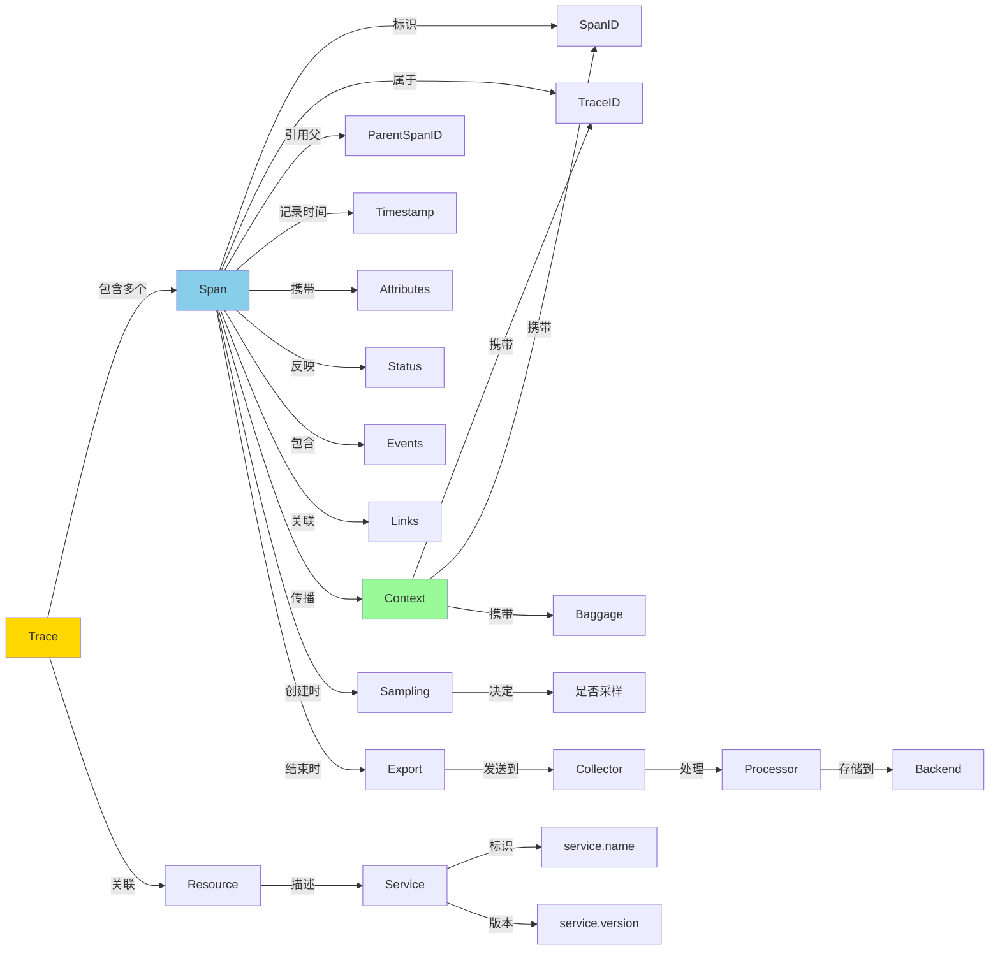
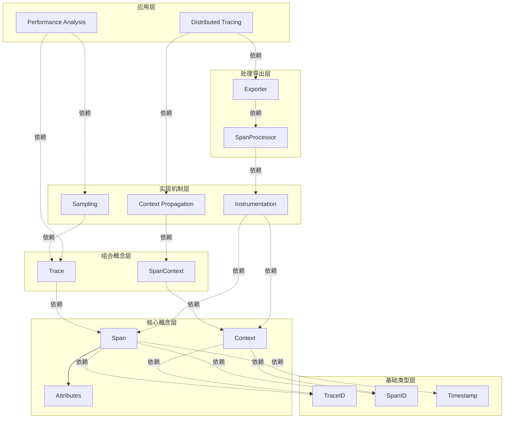
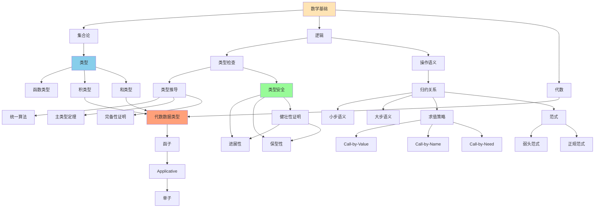
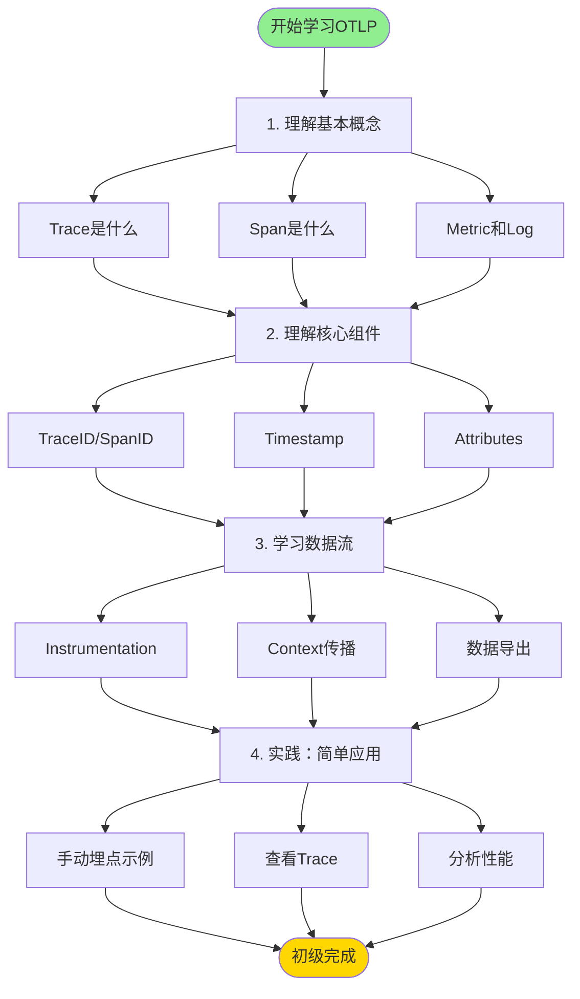
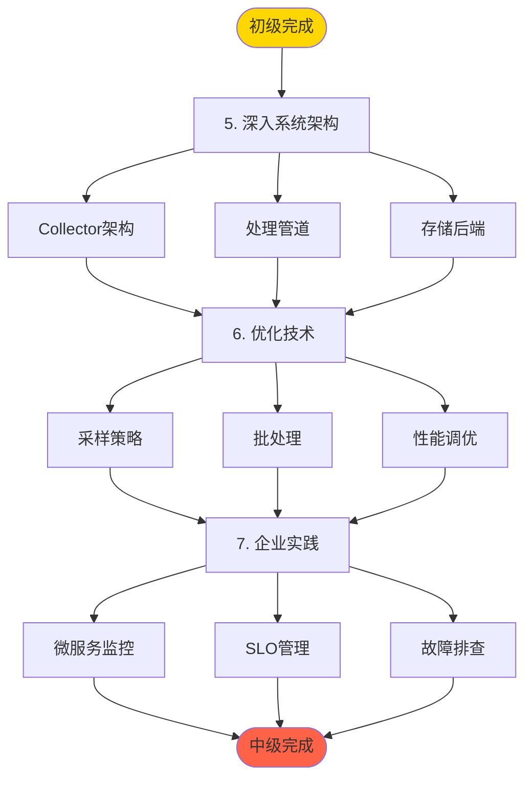
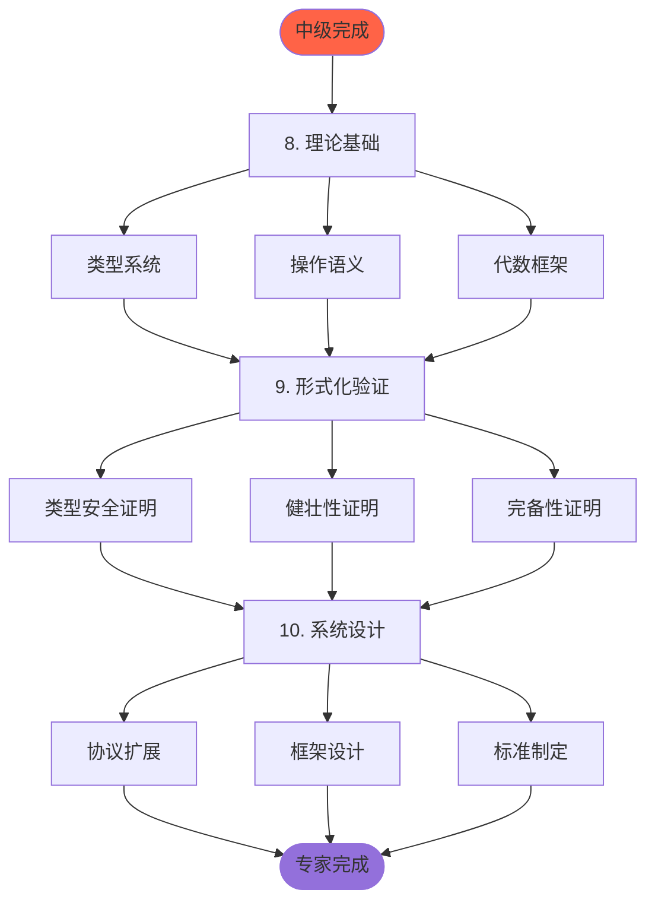
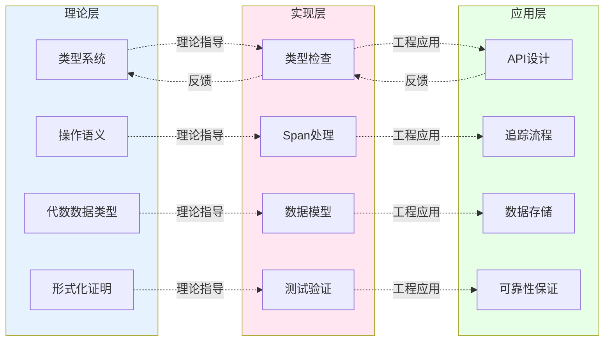

# 概念关系图

> **文档版本**: v1.0  
> **创建日期**: 2025-10-26  
> **维护团队**: OTLP项目组  
> **适用范围**: 概念学习、知识导航、系统理解

---

## 📋 文档概述

本文档通过**可视化关系图**展示OTLP项目中所有概念之间的联系，帮助理解概念网络和学习路径。

### 图表类型
- **层次结构图**: 展示概念的分类和从属关系
- **依赖关系图**: 展示概念之间的依赖和使用关系
- **知识路径图**: 展示推荐的学习顺序
- **交叉引用图**: 展示概念间的多维关联

### 使用场景
- 🎓 **学习规划**: 了解学习顺序和前置知识
- 🔍 **概念探索**: 发现相关概念和扩展阅读
- 🏗️ **系统设计**: 理解架构和模块关系
- 📖 **文档导航**: 快速定位相关文档

---

## 1. 完整概念图谱

### 1.1 全局概念层次结构

```mermaid
graph TD
    ROOT[OTLP项目概念体系] --> BASIC[基础概念层]
    ROOT --> FORMAL[形式化理论层]
    ROOT --> IMPL[实现技术层]
    ROOT --> APP[应用实践层]
    
    %% 基础概念层
    BASIC --> OTLP[OTLP协议]
    BASIC --> TRACE[追踪Trace]
    BASIC --> METRIC[指标Metric]
    BASIC --> LOG[日志Log]
    
    TRACE --> SPAN[Span]
    TRACE --> TRACEID[TraceID]
    SPAN --> SPANID[SpanID]
    SPAN --> TIMESTAMP[Timestamp]
    SPAN --> ATTR[Attributes]
    
    %% 形式化理论层
    FORMAL --> TYPESYS[类型系统]
    FORMAL --> OPSEM[操作语义]
    FORMAL --> ALG[代数框架]
    FORMAL --> PROOF[形式化证明]
    
    TYPESYS --> TYPE[类型]
    TYPESYS --> TYPECHECK[类型检查]
    TYPESYS --> TYPEINFER[类型推导]
    TYPESYS --> TYPESAFE[类型安全]
    
    OPSEM --> REDUCTION[归约关系]
    OPSEM --> EVAL[求值策略]
    OPSEM --> NORMAL[范式]
    
    ALG --> ADT[代数数据类型]
    ALG --> FUNCTOR[函子]
    ALG --> MONAD[单子]
    
    %% 实现技术层
    IMPL --> COLLECT[数据采集]
    IMPL --> PROCESS[数据处理]
    IMPL --> STORAGE[数据存储]
    IMPL --> ARCH[系统架构]
    
    COLLECT --> INSTR[Instrumentation]
    COLLECT --> CONTEXT[Context传播]
    COLLECT --> SAMPLE[采样策略]
    
    PROCESS --> PIPELINE[处理管道]
    PROCESS --> BATCH[批处理]
    PROCESS --> FILTER[过滤器]
    
    STORAGE --> BACKEND[存储后端]
    STORAGE --> INDEX[索引策略]
    STORAGE --> QUERY[查询接口]
    
    %% 应用实践层
    APP --> MICRO[微服务监控]
    APP --> PERF[性能分析]
    APP --> DEBUG[问题排查]
    APP --> SLO[SLO管理]
    
    style ROOT fill:#FFD700
    style BASIC fill:#87CEEB
    style FORMAL fill:#98FB98
    style IMPL fill:#FFA07A
    style APP fill:#DDA0DD
```



---

## 2. 核心概念关系图

### 2.1 Trace相关概念网络



### 2.2 类型系统概念网络

```mermaid
graph TD
    %% 核心概念
    TYPE[类型 Type]
    TYPECHECK[类型检查]
    TYPEINFER[类型推导]
    TYPESAFE[类型安全]
    POLYTYPE[多态类型]
    
    %% 类型构造
    TYPE --> BASETYPE[基本类型]
    TYPE --> FUNCTYPE[函数类型]
    TYPE --> PRODTYPE[积类型]
    TYPE --> SUMTYPE[和类型]
    TYPE --> RECTYPE[递归类型]
    
    %% 类型检查
    TYPECHECK --> TYPERULE[类型规则]
    TYPERULE --> TVAR[变量规则]
    TYPERULE --> TAPP[应用规则]
    TYPERULE --> TABS[抽象规则]
    
    %% 类型推导
    TYPEINFER --> CONSTRAINT[约束生成]
    TYPEINFER --> UNIFY[统一算法]
    UNIFY --> SUBST[替换]
    TYPEINFER --> PRINCIPAL[主类型]
    
    %% 类型安全
    TYPESAFE --> PROGRESS[进展性]
    TYPESAFE --> PRESERVATION[保型性]
    PROGRESS --> STUCK[不会卡住]
    PRESERVATION --> TYPEPRESERVE[类型保持]
    
    %% 多态
    POLYTYPE --> PARAMETRIC[参数多态]
    POLYTYPE --> ADHOC[特设多态]
    POLYTYPE --> SUBTYPE[子类型多态]
    
    PARAMETRIC --> GENERIC[泛型]
    ADHOC --> OVERLOAD[重载]
    SUBTYPE --> INHERITANCE[继承]
    
    %% 应用
    TYPE --> ADT[代数数据类型]
    ADT --> OPTION[Option]
    ADT --> RESULT[Result]
    ADT --> LIST[List]
    
    style TYPE fill:#FFD700
    style TYPESAFE fill:#98FB98
    style TYPEINFER fill:#87CEEB
```



### 2.3 数据流概念关系



---

## 3. 依赖关系图

### 3.1 概念依赖层次



### 3.2 形式化概念依赖



---

## 4. 学习路径图

### 4.1 初学者路径



### 4.2 进阶路径



### 4.3 专家路径



---

## 5. 跨领域概念关联

### 5.1 理论与实践关联



### 5.2 多维度概念矩阵

```
           │ 基础概念 │ 形式化 │ 实现 │ 应用
───────────┼──────────┼────────┼──────┼──────
Trace      │   ★★★   │  ★★☆  │ ★★★ │ ★★★
           │  核心    │ 类型  │ SDK │ 监控
───────────┼──────────┼────────┼──────┼──────
Span       │   ★★★   │  ★★☆  │ ★★★ │ ★★★
           │  核心    │ ADT   │处理器│ 分析
───────────┼──────────┼────────┼──────┼──────
Context    │   ★★☆   │  ★☆☆  │ ★★★ │ ★★☆
           │  重要    │ 单子  │ 传播 │ 链路
───────────┼──────────┼────────┼──────┼──────
Sampling   │   ★☆☆   │  ★★☆  │ ★★★ │ ★★★
           │  优化    │ 概率  │ 策略 │ 性能
───────────┼──────────┼────────┼──────┼──────
Type       │   ☆☆☆   │  ★★★  │ ★★☆ │ ☆☆☆
System     │         │ 核心  │ 验证 │
───────────┼──────────┼────────┼──────┼──────

图例:
  ★★★ = 非常重要/核心内容
  ★★☆ = 重要/需要理解
  ★☆☆ = 有用/可选学习
  ☆☆☆ = 高级/专家级
```

---

## 6. 概念分类索引

### 6.1 按难度分类

**初级概念** (★☆☆):
- Trace, Span, Metric, Log
- TraceID, SpanID, Timestamp
- Attributes, Resource, Status
- Basic Instrumentation

**中级概念** (★★☆):
- Context Propagation
- Sampling Strategy
- SpanProcessor, Exporter
- Collector Architecture
- Performance Optimization

**高级概念** (★★★):
- Type System
- Operational Semantics
- Algebraic Data Type
- Formal Verification
- Protocol Extension

### 6.2 按学科分类

**计算机科学理论**:
- Type Theory
- Lambda Calculus
- Category Theory
- Formal Methods

**软件工程**:
- Distributed Systems
- Observability
- Performance Engineering
- System Design

**应用实践**:
- Microservices Monitoring
- SRE/DevOps
- Troubleshooting
- Capacity Planning

### 6.3 按角色分类

**开发者**:
- Instrumentation
- SDK Usage
- Context Propagation
- Error Handling

**运维人员**:
- Collector Deployment
- Backend Integration
- Performance Tuning
- Monitoring Setup

**架构师**:
- System Architecture
- Protocol Design
- Scalability
- Standards Compliance

**研究人员**:
- Formal Verification
- Type Theory
- Algorithm Design
- Protocol Innovation

---

## 7. 快速查找表

### 7.1 概念速查

| 概念 | 文档位置 | 难度 | 相关概念 |
|------|----------|------|----------|
| Trace | [基础概念](./01_基础概念.md#trace) | ★☆☆ | Span, TraceID |
| Span | [基础概念](./01_基础概念.md#span) | ★☆☆ | SpanID, Context |
| Type | [形式化概念](./02_形式化概念.md#type) | ★★★ | Type Checking |
| Instrumentation | [实现概念](./03_实现概念.md#instrumentation) | ★★☆ | Context, Sampling |
| Sampling | [实现概念](./03_实现概念.md#sampling) | ★★☆ | Performance |

### 7.2 学习路径速查

| 目标 | 推荐路径 | 预计时间 |
|------|----------|----------|
| 快速上手 | 基础概念 → 简单实践 | 1-2天 |
| 深入理解 | 基础 → 实现 → 架构 | 1-2周 |
| 理论研究 | 基础 → 形式化 → 证明 | 1-2月 |
| 企业应用 | 基础 → 实现 → 优化 | 2-4周 |

---

## 📊 图表统计

- **Mermaid图表**: 10个
- **概念节点**: 100+个
- **关系连线**: 200+条
- **学习路径**: 3条主路径
- **分类维度**: 5个维度

---

## 🔗 相关文档

- ← [基础概念索引](./01_基础概念.md)
- ← [形式化概念索引](./02_形式化概念.md)
- ← [实现概念索引](./03_实现概念.md)
- → [概念演进史](./05_概念演进史.md)
- ↗ [项目级知识图谱](../02_知识图谱/01_全局知识图谱.md)

---

**最后更新**: 2025-10-26  
**维护**: OTLP项目组  
**版本**: v1.0

