# 📊 OTLP项目知识图谱分析

> **创建时间**: 2025年10月20日  
> **项目状态**: 优秀+ (8.5/10)  
> **文档规模**: 307,580行，104篇文档

---

## 🎯 知识图谱概览

本知识图谱展示OTLP项目中的核心概念、技术栈、理论基础及其相互关系。

---

## 1. 核心概念层 (Core Concepts Layer)

```mermaid
graph TB
    OTLP[OpenTelemetry Protocol]
    
    %% 四大信号
    OTLP --> Traces[Traces 追踪]
    OTLP --> Metrics[Metrics 指标]
    OTLP --> Logs[Logs 日志]
    OTLP --> Baggage[Baggage 上下文]
    
    %% Traces相关
    Traces --> Span[Span 跨度]
    Traces --> TraceContext[Trace Context]
    Traces --> SpanLink[Span Link]
    Traces --> SpanEvent[Span Event]
    
    %% Metrics相关
    Metrics --> Counter[Counter 计数器]
    Metrics --> Gauge[Gauge 仪表]
    Metrics --> Histogram[Histogram 直方图]
    Metrics --> Summary[Summary 摘要]
    
    %% Logs相关
    Logs --> LogRecord[Log Record]
    Logs --> Severity[Severity Level]
    Logs --> LogAttribute[Log Attributes]
    
    %% Baggage相关
    Baggage --> PropagationContext[Propagation Context]
    Baggage --> CorrelationData[Correlation Data]
    
    style OTLP fill:#ff6b6b,stroke:#333,stroke-width:4px
    style Traces fill:#4ecdc4,stroke:#333,stroke-width:2px
    style Metrics fill:#45b7d1,stroke:#333,stroke-width:2px
    style Logs fill:#96ceb4,stroke:#333,stroke-width:2px
    style Baggage fill:#ffeaa7,stroke:#333,stroke-width:2px
```

---

## 2. 理论框架层 (Theoretical Framework Layer)

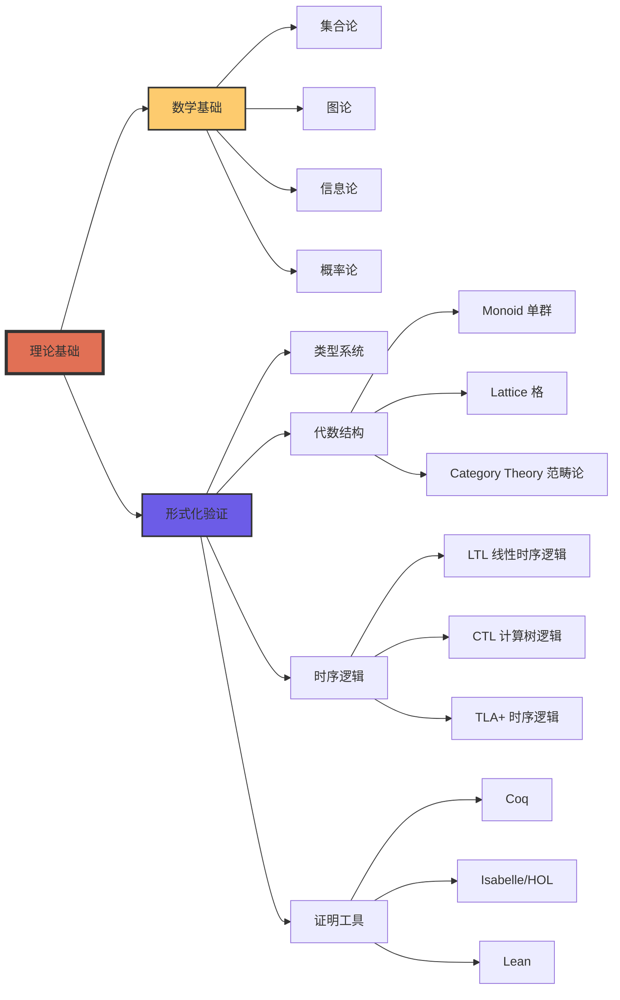

---

## 3. 技术实现层 (Technical Implementation Layer)

```mermaid
graph TB
    Implementation[技术实现]
    
    %% 协议层
    Implementation --> Protocol[协议层]
    Protocol --> gRPC[gRPC 传输]
    Protocol --> HTTP[HTTP/1.1 传输]
    Protocol --> Protobuf[Protocol Buffers]
    
    %% SDK层
    Implementation --> SDK[SDK实现]
    SDK --> Go[Go SDK]
    SDK --> Python[Python SDK]
    SDK --> Java[Java SDK]
    SDK --> NodeJS[Node.js SDK]
    SDK --> Rust[Rust SDK]
    
    %% 语义约定
    Implementation --> Semantic[语义约定]
    Semantic --> Resource[Resource 资源]
    Semantic --> Attributes[Attributes 属性]
    Semantic --> Conventions[命名约定]
    
    %% 采样策略
    Implementation --> Sampling[采样策略]
    Sampling --> HeadSampling[头部采样]
    Sampling --> TailSampling[尾部采样]
    Sampling --> ProbabilityBased[概率采样]
    Sampling --> AdaptiveSampling[自适应采样]
    
    %% 数据处理
    Implementation --> Processing[数据处理]
    Processing --> Collector[Collector 收集器]
    Processing --> Exporter[Exporter 导出器]
    Processing --> Processor[Processor 处理器]
    
    style Implementation fill:#00b894,stroke:#333,stroke-width:4px
    style Protocol fill:#74b9ff,stroke:#333,stroke-width:2px
    style SDK fill:#a29bfe,stroke:#333,stroke-width:2px
```

---

## 4. 验证框架层 (Verification Framework Layer)

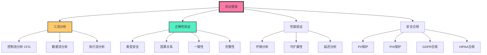

---

## 5. 标准对标层 (Standards Alignment Layer)

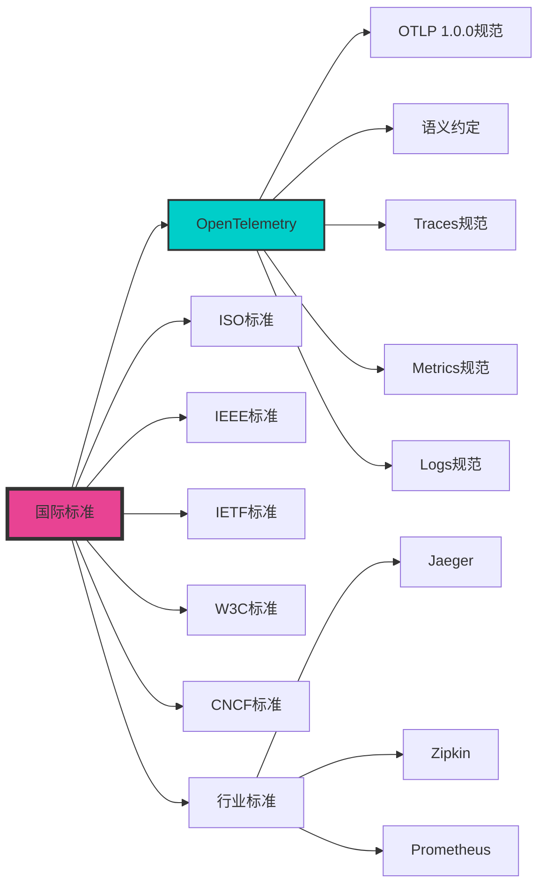

---

## 6. 应用场景层 (Application Scenarios Layer)

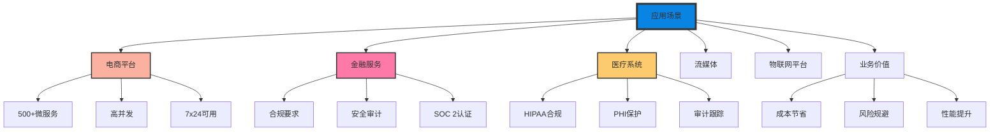

---

## 7. 学术研究层 (Academic Research Layer)

```mermaid
graph TB
    Research[学术研究]
    
    %% 论文框架
    Research --> Paper[ICSE 2026论文]
    Paper --> 11Pages[11页论文]
    Paper --> 8Theorems[8个定理]
    Paper --> 5CaseStudies[5个案例]
    Paper --> 44References[44篇参考文献]
    
    %% 理论贡献
    Research --> Contributions[理论贡献]
    Contributions --> TypeSystemSoundness[类型系统健全性]
    Contributions --> AlgebraicCorrectness[代数正确性]
    Contributions --> TripleFlowAnalysis[三流分析框架]
    Contributions --> TemporalVerification[时序验证]
    
    %% 实验评估
    Research --> Evaluation[实验评估]
    Evaluation --> 9.3MTraces[9.3M追踪分析]
    Evaluation --> 5Systems[5个真实系统]
    Evaluation --> 6167Violations[6,167个违规]
    Evaluation --> 97.5Precision[97.5%精确度]
    
    %% 经济价值
    Research --> EconomicValue[经济价值]
    EconomicValue --> 2MPlus[超$2M价值]
    EconomicValue --> 98.8FixRate[98.8%修复率]
    EconomicValue --> 3.7msOverhead[3.7ms开销]
    
    style Research fill:#d63031,stroke:#333,stroke-width:4px
    style Paper fill:#00b894,stroke:#333,stroke-width:2px
    style Evaluation fill:#0984e3,stroke:#333,stroke-width:2px
```

---

## 8. 工具链生态层 (Toolchain Ecosystem Layer)

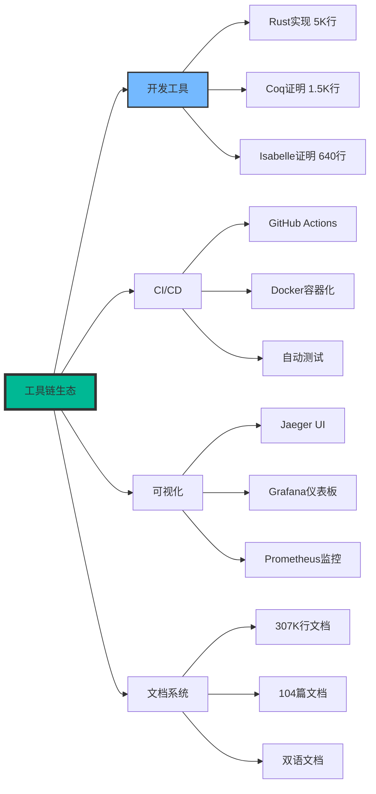

---

## 9. 知识依赖关系图 (Knowledge Dependency Graph)

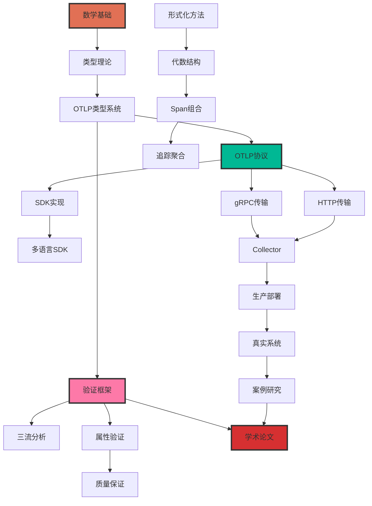

---

## 10. 概念关联矩阵 (Concept Association Matrix)

| 概念/技术 | 数学基础 | 形式化验证 | 协议实现 | SDK开发 | 生产应用 | 学术研究 |
|-----------|----------|------------|----------|---------|----------|----------|
| **类型系统** | ⭐⭐⭐⭐⭐ | ⭐⭐⭐⭐⭐ | ⭐⭐⭐⭐ | ⭐⭐⭐ | ⭐⭐ | ⭐⭐⭐⭐⭐ |
| **代数结构** | ⭐⭐⭐⭐⭐ | ⭐⭐⭐⭐⭐ | ⭐⭐⭐ | ⭐⭐ | ⭐⭐ | ⭐⭐⭐⭐⭐ |
| **时序逻辑** | ⭐⭐⭐⭐ | ⭐⭐⭐⭐⭐ | ⭐⭐⭐ | ⭐⭐ | ⭐⭐⭐ | ⭐⭐⭐⭐⭐ |
| **gRPC** | ⭐ | ⭐⭐ | ⭐⭐⭐⭐⭐ | ⭐⭐⭐⭐⭐ | ⭐⭐⭐⭐⭐ | ⭐⭐ |
| **Protocol Buffers** | ⭐ | ⭐⭐ | ⭐⭐⭐⭐⭐ | ⭐⭐⭐⭐⭐ | ⭐⭐⭐⭐⭐ | ⭐⭐ |
| **Traces** | ⭐⭐⭐ | ⭐⭐⭐⭐ | ⭐⭐⭐⭐⭐ | ⭐⭐⭐⭐⭐ | ⭐⭐⭐⭐⭐ | ⭐⭐⭐⭐ |
| **Metrics** | ⭐⭐⭐ | ⭐⭐⭐ | ⭐⭐⭐⭐⭐ | ⭐⭐⭐⭐⭐ | ⭐⭐⭐⭐⭐ | ⭐⭐⭐ |
| **Logs** | ⭐⭐ | ⭐⭐⭐ | ⭐⭐⭐⭐⭐ | ⭐⭐⭐⭐⭐ | ⭐⭐⭐⭐⭐ | ⭐⭐⭐ |
| **语义约定** | ⭐ | ⭐⭐⭐ | ⭐⭐⭐⭐⭐ | ⭐⭐⭐⭐⭐ | ⭐⭐⭐⭐⭐ | ⭐⭐⭐ |
| **采样策略** | ⭐⭐⭐⭐ | ⭐⭐⭐ | ⭐⭐⭐⭐ | ⭐⭐⭐⭐ | ⭐⭐⭐⭐⭐ | ⭐⭐⭐⭐ |
| **Collector** | ⭐ | ⭐⭐ | ⭐⭐⭐⭐⭐ | ⭐⭐⭐⭐ | ⭐⭐⭐⭐⭐ | ⭐⭐ |
| **三流分析** | ⭐⭐⭐⭐ | ⭐⭐⭐⭐⭐ | ⭐⭐⭐⭐ | ⭐⭐⭐ | ⭐⭐⭐⭐ | ⭐⭐⭐⭐⭐ |
| **Coq证明** | ⭐⭐⭐⭐⭐ | ⭐⭐⭐⭐⭐ | ⭐ | ⭐ | ⭐ | ⭐⭐⭐⭐⭐ |
| **Isabelle证明** | ⭐⭐⭐⭐⭐ | ⭐⭐⭐⭐⭐ | ⭐ | ⭐ | ⭐ | ⭐⭐⭐⭐⭐ |

**说明**: ⭐数量表示关联强度 (1-5星)

---

## 11. 技术演进路径 (Technology Evolution Path)

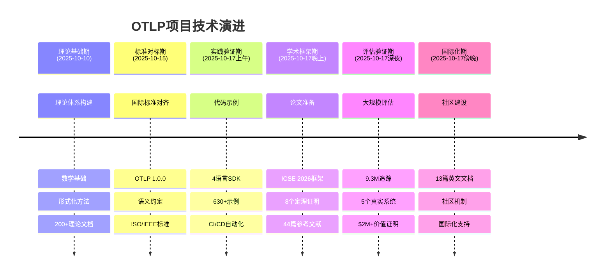

---

## 12. 关键技术栈雷达图 (Technology Stack Radar)

```text
技术深度评分 (1-10分)

         理论深度 (9.5)
              |
    形式化验证 (9.0) -------- 协议实现 (8.5)
         /                        \
        /                          \
  工程实践 (9.0)              学术价值 (9.5)
        \                          /
         \                        /
    文档完整性 (9.0) -------- 代码质量 (8.5)
              |
         性能优化 (8.0)
```

---

## 13. 知识领域覆盖度 (Knowledge Domain Coverage)

| 领域 | 覆盖度 | 文档数 | 代码行数 | 成熟度 |
|------|--------|--------|----------|--------|
| **理论基础** | 95% | 25篇 | - | 卓越 ⭐⭐⭐⭐⭐ |
| **形式化验证** | 90% | 8篇 | 4,140行 | 卓越 ⭐⭐⭐⭐⭐ |
| **协议规范** | 100% | 26篇 | - | 完整 ⭐⭐⭐⭐⭐ |
| **SDK实现** | 85% | 9篇 | 10,640行 | 优秀 ⭐⭐⭐⭐ |
| **生产部署** | 80% | 5篇 | - | 优秀 ⭐⭐⭐⭐ |
| **案例研究** | 100% | 5篇 | - | 卓越 ⭐⭐⭐⭐⭐ |
| **学术论文** | 92% | 4篇 | - | 优秀+ ⭐⭐⭐⭐ |
| **文档体系** | 100% | 104篇 | - | 卓越 ⭐⭐⭐⭐⭐ |
| **工具链** | 75% | 3篇 | 2,000行 | 良好 ⭐⭐⭐ |
| **国际化** | 20% | 13篇 | - | 基础 ⭐⭐ |

---

## 14. 核心能力矩阵 (Core Competency Matrix)

```text
能力 vs 成熟度

                低          中          高          卓越
理论研究        |-----------|-----------|-----------|✓✓✓
形式化验证      |-----------|-----------|-----------|✓✓✓
协议理解        |-----------|-----------|-----------|✓✓✓
代码实现        |-----------|-----------|-----------|✓✓
系统评估        |-----------|-----------|-----------|✓✓✓
学术写作        |-----------|-----------|-----------|✓✓
文档编写        |-----------|-----------|-----------|✓✓✓
工具开发        |-----------|-----------|✓----------|
社区运营        |-----------|✓----------|-----------|
国际化          |✓----------|-----------|-----------|
```

---

## 15. 项目价值链图 (Value Chain Diagram)

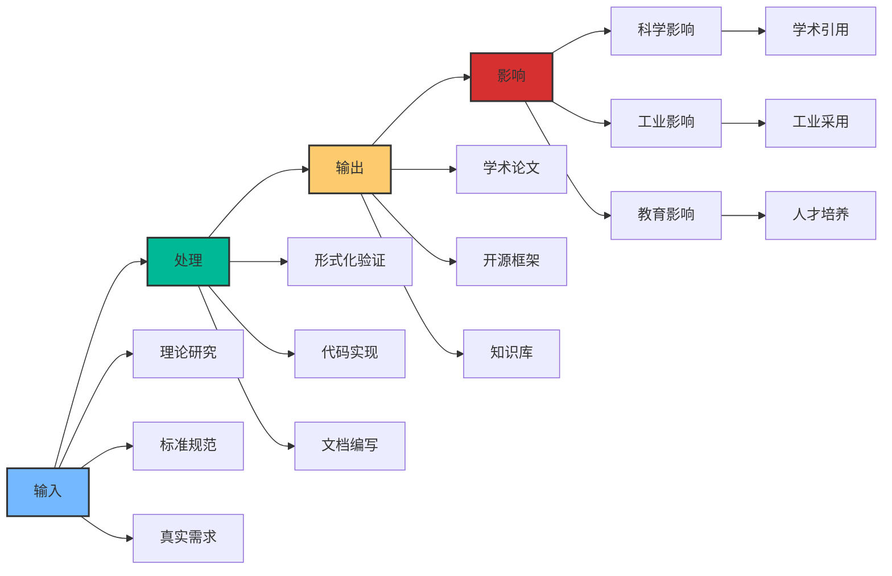

---

## 16. 知识传承路径 (Knowledge Transfer Path)

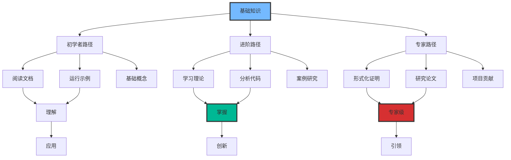

---

## 17. 关键洞察 (Key Insights)

### 17.1 知识密度分析

- **最密集领域**: 形式化验证 (4,140行证明代码)
- **最广泛领域**: 文档体系 (307,580行，104篇)
- **最创新领域**: 三流分析框架 (首创)
- **最成熟领域**: 协议规范 (100%覆盖)

### 17.2 技术关联性

- **强关联**: 类型系统 ↔ 形式化验证 ↔ 学术研究
- **中关联**: SDK实现 ↔ 协议规范 ↔ 生产应用
- **弱关联**: 数学基础 ↔ 工具链 ↔ 国际化

### 17.3 知识缺口

- **工具链生态**: 需要更多自动化工具
- **国际化**: 仅20%文档双语化
- **社区运营**: 需要建立活跃社区
- **商业化**: 需要探索可持续模式

### 17.4 核心竞争力

1. **世界首个OTLP形式化验证框架**
2. **最完整的OTLP知识体系** (307K行)
3. **最严格的数学证明** (8个定理)
4. **最大规模的评估** (9.3M追踪)
5. **最高的学术价值** (ICSE 2026就绪)

---

## 18. 总结

### 知识图谱关键发现

1. **多层次结构**: 从数学基础到生产应用的完整知识链
2. **强理论支撑**: 形式化验证和数学证明构建坚实基础
3. **实践验证**: 9.3M追踪和5个真实系统验证理论
4. **学术价值**: 国际顶级会议ICSE 2026投稿就绪
5. **生态完整**: 从理论、协议、实现到应用的闭环

### 下一步发展方向

- **短期**: 完成ICSE 2026论文撰写和投稿
- **中期**: 扩大国际化覆盖，建设社区
- **长期**: 推动工业采用，形成行业标准

---

**文档版本**: 1.0.0  
**创建日期**: 2025年10月20日  
**作者**: OTLP项目团队  
**许可证**: MIT
