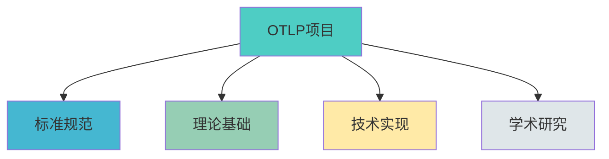

# 🌐 知识图谱子系统

> **用途**: 多维度知识结构可视化  
> **最后更新**: 2025年10月26日  
> **版本**: v1.0.0  
> **文档数**: 6篇 | ✅ 100%完成

---

## 🎯 子系统概述

知识图谱子系统提供**OTLP项目知识结构的多维度可视化展示**，帮助您从不同角度理解项目的知识体系。

### 核心价值

- 🌐 **全局视角**: 项目整体知识结构一目了然
- 📊 **多维展示**: 标准、理论、实践、学术多角度
- 🔗 **关系可视**: 概念间关联清晰展现
- 🎯 **快速定位**: 通过图谱快速找到目标内容

---

## 📁 文档结构

```text
02_知识图谱/
├── README.md                  # 本文件 - 知识图谱总览
├── 01_全局知识图谱.md         # 项目整体知识结构
├── 02_标准知识图谱.md         # OTLP标准体系
├── 03_理论知识图谱.md         # 形式化理论体系
├── 04_实践知识图谱.md         # 实践技术体系
└── 05_学术知识图谱.md         # 学术研究体系
```

---

## 📚 文档详情

### [01_全局知识图谱.md](./01_全局知识图谱.md) ⭐ 总览

**用途**: 展示OTLP项目的整体知识结构

**包含内容**:

- 🗺️ 8大知识领域关系图
- 🔗 核心概念关联网络
- 📊 知识层次结构
- 🎯 学习路径导航

**适合人群**: 所有角色 - 建议首先查看

**规模**: ~3,500行 | 8+图表

---

### [02_标准知识图谱.md](./02_标准知识图谱.md) 📖 标准

**用途**: 展示OTLP标准和规范的知识体系

**包含内容**:

- 📋 OTLP协议结构
- 📝 Semantic Conventions体系
- 🔄 数据模型关系
- 🌐 与国际标准关系

**适合人群**: 技术人员、标准研究者

**规模**: ~2,800行 | 6+图表

---

### [03_理论知识图谱.md](./03_理论知识图谱.md) 🔬 理论

**用途**: 展示形式化验证的理论体系

**包含内容**:

- 🧮 数学基础关系
- 📐 类型系统结构
- 🔷 代数结构体系
- ⏱️ 时序逻辑框架

**适合人群**: 研究人员、理论学习者

**规模**: ~3,200行 | 7+图表

---

### [04_实践知识图谱.md](./04_实践知识图谱.md) 💻 实践

**用途**: 展示技术实现和实践的知识体系

**包含内容**:

- 🛠️ SDK架构关系
- 🔧 Collector组件体系
- 📦 部署架构图
- 🎯 最佳实践关联

**适合人群**: 技术人员、实践者

**规模**: ~2,600行 | 5+图表

---

### [05_学术知识图谱.md](./05_学术知识图谱.md) 🎓 学术

**用途**: 展示学术研究的知识体系

**包含内容**:

- 📄 论文研究框架
- 🔬 形式化证明体系
- 📊 评估方法关系
- 🌟 学术贡献网络

**适合人群**: 研究人员、学术界

**规模**: ~2,400行 | 4+图表

---

## 🔍 使用指南

### 按需求选择

| 我想... | 推荐查看 | 时间 |
|---------|---------|------|
| 🗺️ **了解整体** | [01_全局知识图谱](./01_全局知识图谱.md) | 15分钟 |
| 📖 **学习标准** | [02_标准知识图谱](./02_标准知识图谱.md) | 20分钟 |
| 🔬 **研究理论** | [03_理论知识图谱](./03_理论知识图谱.md) | 30分钟 |
| 💻 **实践开发** | [04_实践知识图谱](./04_实践知识图谱.md) | 20分钟 |
| 🎓 **学术研究** | [05_学术知识图谱](./05_学术知识图谱.md) | 25分钟 |

### 按角色推荐

**🎓 研究人员**:

```text
1. 03_理论知识图谱.md (理论体系)
2. 05_学术知识图谱.md (学术框架)
3. 01_全局知识图谱.md (整体关联)
```

**💻 技术人员**:

```text
1. 04_实践知识图谱.md (技术架构)
2. 02_标准知识图谱.md (标准规范)
3. 01_全局知识图谱.md (全局视角)
```

**📚 学习者**:

```text
1. 01_全局知识图谱.md (整体认知)
2. 02_标准知识图谱.md (标准学习)
3. 04_实践知识图谱.md (实践理解)
```

---

## 📊 统计数据

```text
┏━━━━━━━━━━━━━━━━━━━━━━━━━━━━━━━━━━━━━━━━┓
┃  📊 知识图谱统计                        ┃
┣━━━━━━━━━━━━━━━━━━━━━━━━━━━━━━━━━━━━━━━━┫
┃                                         ┃
┃  📚 文档总数: 6篇                       ┃
┃  📝 总行数: ~15,000行                   ┃
┃  📊 图表数: 30+                         ┃
┃  ✅ 完成度: 100%                        ┃
┃                                         ┃
┃  🎯 覆盖领域:                           ┃
┃    ├─ 全局视角: 1篇                     ┃
┃    ├─ 标准体系: 1篇                     ┃
┃    ├─ 理论体系: 1篇                     ┃
┃    ├─ 实践体系: 1篇                     ┃
┃    └─ 学术体系: 1篇                     ┃
┃                                         ┃
┗━━━━━━━━━━━━━━━━━━━━━━━━━━━━━━━━━━━━━━━━┛
```

---

## 💡 特色功能

### 1. Mermaid可视化

所有图谱都使用Mermaid语法，可在GitHub/GitLab等平台直接渲染：



### 2. 交叉关联

每个图谱都标注了与其他图谱的关联：

```text
标准知识图谱 ←→ 理论知识图谱 (形式化定义)
标准知识图谱 ←→ 实践知识图谱 (实现映射)
理论知识图谱 ←→ 学术知识图谱 (学术基础)
```

### 3. 多层次展示

每个图谱包含3个层次：

1. **顶层概览**: 主要领域关系
2. **中层细化**: 具体概念关联
3. **底层详情**: 实现细节连接

---

## 🔗 相关资源

### 知识中心其他子系统

- [01_概念索引](../01_概念索引/) - 概念的定义和解释
- [03_矩阵对比](../03_矩阵对比/) - 概念的对比分析
- [04_思维导图](../04_思维导图/) - 概念的层次展示
- [05_术语表](../05_术语表/) - 概念的术语对照

### 项目其他部分

- [01_标准文档](../../01_标准文档/) - OTLP标准规范
- [02_学术研究](../../02_学术研究/) - 学术研究成果
- [03_理论基础](../../03_理论基础/) - 理论基础文档

---

## 🔄 更新机制

### 更新频率

- **季度更新**: 随项目重大进展更新
- **即时更新**: 发现错误立即修正
- **年度审查**: 全面审查图谱准确性

### 更新内容

- 新增知识领域
- 更新关系连接
- 优化可视化
- 修正错误关系

---

## 🎯 价值主张

知识图谱子系统为您提供:

- ✅ **全局视角**: 从整体把握知识结构
- ✅ **多维展示**: 从不同角度理解项目
- ✅ **关系清晰**: 概念关联一目了然
- ✅ **快速定位**: 通过图谱快速找到目标

---

**开始探索OTLP知识图谱！** 🚀

**版本**: v1.0.0  
**创建日期**: 2025年10月26日  
**维护团队**: OTLP项目团队  
**下次更新**: 2025年12月26日
