# 📊 docs文件夹思维导图

> **创建时间**: 2025年10月20日
> **文档规模**: 89+核心文档，279,000+行
> **导图数量**: 12个核心思维导图

---

## 🎯 思维导图概览

本文档通过思维导图形式展示 `docs/` 文件夹的层次结构、学习路径和关键知识点。

---

## 1. docs文件夹总体架构图


---

## 2. 核心协议层思维导图


---

## 3. 前沿技术思维导图


---

## 4. 学习路径思维导图


---

## 5. 按角色导航思维导图


---

## 6. 模块完成度思维导图


---

## 7. 文档质量思维导图


---

## 8. 技术栈思维导图


---

## 9. 应用场景思维导图


---

## 10. 工具生态思维导图


---

## 11. 价值链思维导图


---

## 12. 改进路线思维导图

```mermaid
mindmap
  root((改进路线))
    短期<br/>Q4 2025
      P1任务
        API文档生成
        交互式示例
        移动端完善
        IoT完善
      预计投入
        60小时
      预期产出
        +10K行
        完成度98%

    中期<br/>Q1-Q2 2026
      P2任务
        英文翻译
        视频教程
        社区建设
      预计投入
        200小时
      预期产出
        +30K行
        用户20K+

    长期<br/>2026+
      P3任务
        完整国际化
        商业模式
        行业标准推广
      预计投入
        持续
      预期影响
        国际认可
        行业标准
```



---

## 📊 总结性视图

### 核心数据卡片

```text
┌──────────────────────────────────┐
│  📚 docs文件夹核心数据            │
├──────────────────────────────────┤
│  文档数: 89+                      │
│  总行数: 279,000+                 │
│  模块数: 26                       │
│  完成度: 96.5%                    │
│  质量: ⭐⭐⭐⭐⭐                   │
│                                   │
│  重点亮点:                        │
│  • 前沿技术 8篇                   │
│  • 工具完善 完整                  │
│  • 理论扎实 深入                  │
│  • 实战丰富 15+案例               │
└──────────────────────────────────┘
```

### 三大核心优势

1. **规模领先**
   - 279K行,行业5-9倍
   - 26个模块,系统完整
   - 3,600+行可运行代码

2. **技术前沿**
   - AI/ML: AIOps、日志分析、异常检测
   - eBPF: 零侵入追踪、性能<1%
   - 服务网格: Istio/Linkerd完整集成

3. **工具完善**
   - 测试框架: 4,351行
   - 配置生成器: 1,343行
   - 可视化工具: Mermaid完整

### 学习路径建议

**新手** (30小时):

- 快速开始 → 核心协议 → 第一个案例

**进阶** (60小时):

- 深入协议 → 语义约定 → 性能优化 → 云平台

**专家** (120小时):

- 前沿技术 → 理论框架 → 工具开发 → 生产实践

---

**文档版本**: 1.0.0
**创建日期**: 2025年10月20日
**作者**: OTLP项目团队
**许可证**: MIT
