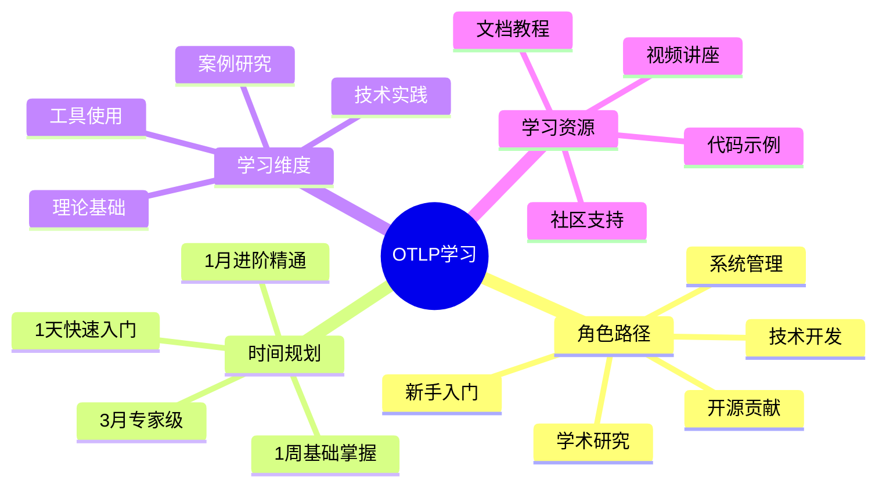
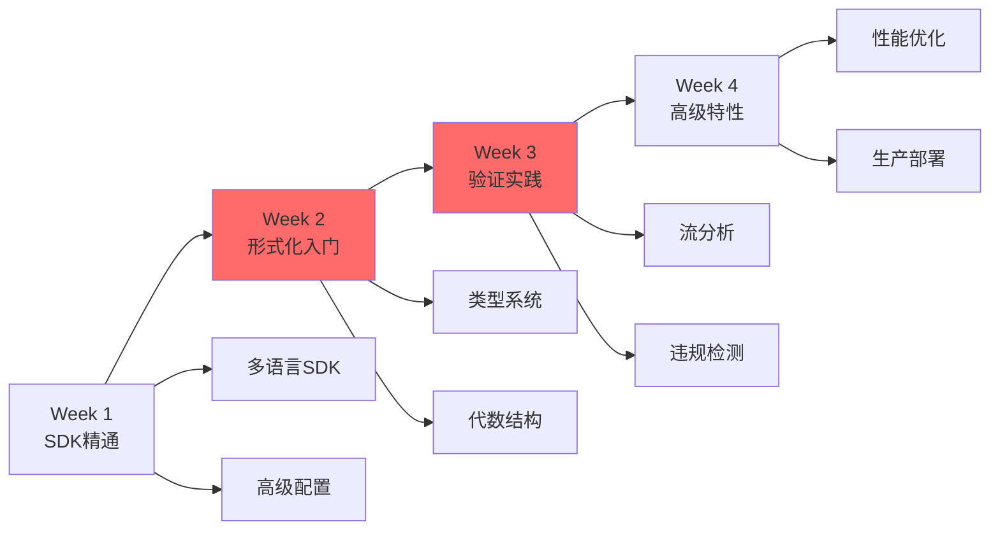
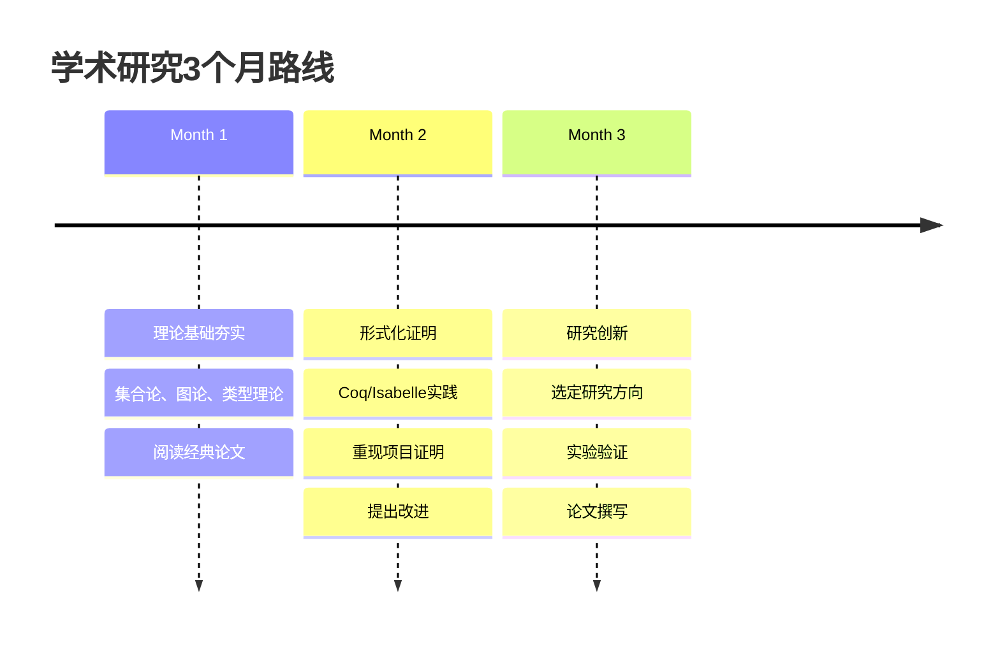
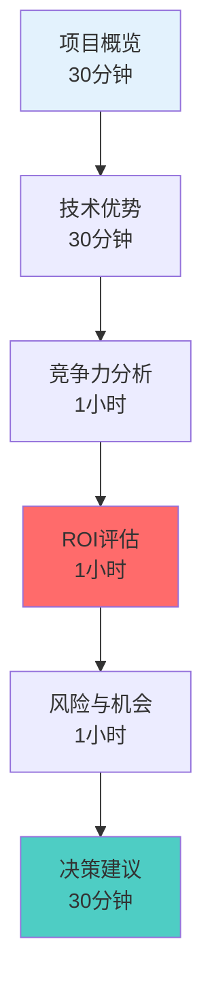
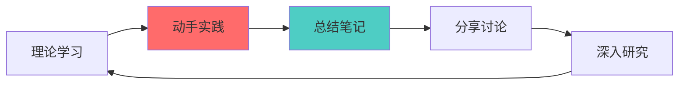

# 🎓 OTLP项目学习路径导图

> **创建时间**: 2025年10月20日
> **适用对象**: 新手、技术人员、研究人员、管理者、贡献者
> **版本**: v1.0.0

---

## 🎯 概述

本文档为不同角色提供定制化的OTLP学习路径，从入门到精通，涵盖理论学习、实践操作和深入研究。

### 学习路径总览



---

## 📊 学习路径全景图

```text
┌─────────────────────────────────────────────────────────┐
│  🗺️ OTLP学习路径全景                                     │
├─────────────────────────────────────────────────────────┤
│                                                         │
│  Level 0: 入门 (1-3天)                                  │
│    └─ 基本概念 → 快速开始 → 运行示例                    │
│                                                         │
│  Level 1: 基础 (1-2周)                                  │
│    └─ SDK使用 → 配置管理 → 故障排查                     │
│                                                         │
│  Level 2: 进阶 (1-2月)                                  │
│    └─ 形式化基础 → 验证原理 → 深度分析                  │
│                                                         │
│  Level 3: 高级 (2-3月)                                  │
│    └─ 理论证明 → 源码贡献 → 架构设计                    │
│                                                         │
│  Level 4: 专家 (3月+)                                   │
│    └─ 学术研究 → 论文发表 → 社区领导                    │
│                                                         │
└─────────────────────────────────────────────────────────┘
```

---

## 1. 🆕 新手入门路径

### 1.1 一天快速入门

**目标**: 了解OTLP是什么，能运行基础示例

```mermaid
timeline
    title 新手1天学习路径
    09:00 : 阅读项目README
          : 理解核心概念
    10:00 : 安装Docker环境
          : 启动基础设施
    11:00 : 运行Go示例
          : 查看Jaeger UI
    14:00 : 运行Python示例
          : 理解trace结构
    15:00 : 修改示例代码
          : 观察变化
    16:00 : 阅读快速入门文档
          : 总结学习笔记
```

#### 学习清单 ✅

**上午 (3小时)**:

- [ ] 阅读 `README.md` (30分钟)
- [ ] 理解4大概念：Vendor-neutral、Polyglot、Unified、Built-in (30分钟)
- [ ] 安装Docker和Docker Compose (30分钟)
- [ ] 启动 `docker-compose up -d` (15分钟)
- [ ] 验证服务：访问 `http://localhost:16686` (15分钟)
- [ ] 运行Go示例：`cd examples/go && go run hello_trace.go` (30分钟)
- [ ] 在Jaeger UI查看trace (30分钟)

**下午 (3小时)**:

- [ ] 运行Python示例 (30分钟)
- [ ] 理解Span、Trace、Parent-Child关系 (45分钟)
- [ ] 修改示例：改变span名称、添加属性 (45分钟)
- [ ] 阅读 `examples/README.md` (30分钟)
- [ ] 故障排查：解决常见问题 (30分钟)

**学习成果**:

- ✅ 理解OTLP基本概念
- ✅ 能够运行示例程序
- ✅ 会查看trace可视化
- ✅ 理解分布式追踪基础

---

### 1.2 一周基础掌握

**目标**: 掌握SDK使用，能够在项目中集成OTLP

#### Day 1: 概念与环境

- [ ] 完成"一天快速入门"
- [ ] 阅读OpenTelemetry官方文档
- [ ] 理解Signals概念（Traces、Metrics、Logs、Baggage）

#### Day 2: Go SDK深入

- [ ] 学习Go SDK完整API
- [ ] 创建多层级Span树
- [ ] 使用Attributes和Events
- [ ] 实现Context传播

**练习**: 构建一个3层服务调用的示例

```go
// 示例：HTTP服务 → 数据库查询 → 缓存查询
func handleRequest(w http.ResponseWriter, r *http.Request) {
    ctx, span := tracer.Start(r.Context(), "handle-request")
    defer span.End()

    // 调用数据库
    data := queryDatabase(ctx)

    // 调用缓存
    cache := queryCache(ctx)

    // 返回结果
    json.NewEncoder(w).Encode(data)
}
```

#### Day 3: Python SDK深入

- [ ] 学习Python SDK API
- [ ] 自动instrumentation vs 手动instrumentation
- [ ] 异常处理和状态管理
- [ ] 与Flask/Django集成

**练习**: 为已有Flask应用添加追踪

#### Day 4: 配置与部署

- [ ] 学习Collector配置
- [ ] 理解Receivers、Processors、Exporters
- [ ] 配置采样策略
- [ ] 设置批处理参数

**练习**: 自定义Collector配置，实现过滤和转换

#### Day 5: 故障排查

- [ ] 常见问题诊断
- [ ] 日志分析技巧
- [ ] 性能调优方法
- [ ] 监控指标查看

**练习**: 解决3个预设的故障场景

#### Day 6-7: 实战项目

- [ ] 选择一个小项目（如博客系统）
- [ ] 完整集成OTLP
- [ ] 实现端到端追踪
- [ ] 编写文档

**项目要求**:

- 至少3个服务
- 包含数据库操作
- 实现错误追踪
- 提供README

---

### 1.3 学习资源

| 资源类型 | 内容 | 时间 |
|---------|------|------|
| **必读文档** | `README.md` | 30分钟 |
| **必读文档** | `examples/README.md` | 20分钟 |
| **必读文档** | OpenTelemetry概念 | 1小时 |
| **实践教程** | Go示例 | 1小时 |
| **实践教程** | Python示例 | 1小时 |
| **视频教程** | OpenTelemetry介绍 | 30分钟 |

---

## 2. 💻 技术开发路径

### 2.1 一月进阶精通

**目标**: 理解形式化验证原理，能进行深度分析



---

#### Week 1: SDK精通

**Day 1-2: 多语言SDK对比**:

- [ ] Go SDK高级特性
- [ ] Python SDK高级特性
- [ ] Java SDK Spring Boot集成
- [ ] Node.js SDK Express集成

**实践项目**: 用4种语言实现相同的追踪逻辑

**Day 3-4: 高级配置**:

- [ ] 采样策略深入（概率、尾部、自适应）
- [ ] 资源配置（CPU、内存限制）
- [ ] 批处理优化
- [ ] 多租户支持

**Day 5-7: 实战优化**:

- [ ] 性能基准测试
- [ ] 内存泄漏排查
- [ ] 延迟优化技巧
- [ ] 高并发场景处理

---

#### Week 2: 形式化验证入门

**Day 1-2: 理论基础**:

- [ ] 阅读 `理论基础知识图谱.md`
- [ ] 理解集合论、图论基础
- [ ] 学习类型系统概念
- [ ] 理解Monoid和Lattice

**推荐阅读**:

- Pierce的 "Types and Programming Languages"
- 项目中的 `academic/OTLP_Formal_Verification_Paper_Framework.md`

**Day 3-4: 类型系统**:

- [ ] OTLP类型定义
- [ ] 类型安全证明
- [ ] 类型推导机制
- [ ] 实践：编写类型检查器

**练习**:

```rust
// 实现一个简单的Span类型检查器
fn check_span(span: &Span) -> Result<(), TypeError> {
    // TODO: 检查必填字段
    // TODO: 验证时间戳顺序
    // TODO: 检查parent_id存在性
}
```

**Day 5-7: 代数结构**:

- [ ] Monoid for Span组合
- [ ] Lattice for Trace聚合
- [ ] 范畴论基础
- [ ] 实践：实现Monoid实例

---

#### Week 3: 验证实践

**Day 1-3: 流分析**:

- [ ] 控制流分析 (CFG)
- [ ] 数据流分析 (DFG)
- [ ] 执行流分析 (EFG)
- [ ] 三流综合分析

**工具使用**:

```bash
# 运行流分析
cargo run --bin flow-analyzer -- trace.json

# 输出控制流图
cargo run --bin cfg-generator -- trace.json > cfg.dot
dot -Tpng cfg.dot -o cfg.png
```

**Day 4-5: 违规检测**:

- [ ] 因果违规（Parent不存在、循环依赖）
- [ ] 时序违规（时间戳倒序）
- [ ] 协议违规（字段缺失）
- [ ] 自定义规则

**练习**: 编写一个自定义违规检测器

**Day 6-7: 综合项目**:

- [ ] 分析真实系统trace
- [ ] 发现并修复违规
- [ ] 生成验证报告
- [ ] 优化检测性能

---

#### Week 4: 高级特性与部署

**Day 1-2: 性能优化**:

- [ ] Rust性能优化技巧
- [ ] 并行分析实现
- [ ] 缓存策略
- [ ] SIMD加速

**Day 3-4: Kubernetes部署**:

- [ ] Helm Charts使用
- [ ] 资源配置
- [ ] 监控和告警
- [ ] 滚动更新

**Day 5-7: 生产级实践**:

- [ ] TLS配置
- [ ] 认证和授权
- [ ] 高可用架构
- [ ] 灾难恢复

**最终项目**: 部署一个生产级OTLP系统

---

### 2.2 学习资源

| 资源 | 难度 | 时间 |
|-----|------|------|
| **技术实现知识图谱** | ⭐⭐⭐ | 2小时 |
| **Rust官方文档** | ⭐⭐⭐⭐ | 10小时 |
| **形式化方法入门** | ⭐⭐⭐⭐ | 20小时 |
| **源码阅读** | ⭐⭐⭐⭐⭐ | 40小时 |

---

## 3. 🔬 学术研究路径

### 3.1 三月专家养成

**目标**: 理解全部理论，能够发表论文



---

#### Month 1: 理论基础

**Week 1-2: 数学基础**:

- [ ] 集合论（Halmos教材）
- [ ] 图论（Diestel教材）
- [ ] 信息论（Cover & Thomas）
- [ ] 概率论基础

**每日安排**:

- 上午：理论学习 (3小时)
- 下午：习题练习 (2小时)
- 晚上：OTLP案例分析 (2小时)

**Week 3-4: 形式化方法**:

- [ ] 类型理论（Pierce, TAPL）
- [ ] 代数结构（Mac Lane, Categories）
- [ ] 时序逻辑（Baier & Katoen）
- [ ] Lambda演算

**论文阅读**:

1. "Types and Programming Languages" - Pierce
2. "The Calculus of Constructions" - Coquand & Huet
3. "Temporal Logic of Actions" - Lamport

---

#### Month 2: 形式化证明

**Week 1: Coq入门**:

- [ ] 安装Coq 8.17+
- [ ] 学习基本策略（intro, apply, rewrite）
- [ ] Software Foundations Vol 1前3章
- [ ] 理解归纳类型

**练习**:

```coq
(* 证明Span Monoid性质 *)
Theorem span_monoid_identity :
  forall (s : Span),
    span_append s empty_span = s /\
    span_append empty_span s = s.
Proof.
  (* TODO: 完成证明 *)
Admitted.
```

**Week 2: OTLP证明重现**:

- [ ] 克隆项目Coq证明代码
- [ ] 理解Type Safety证明
- [ ] 理解Monoid Correctness证明
- [ ] 验证全部定理

**目标**: 理解项目中8个主要定理的证明

**Week 3: Isabelle/HOL**:

- [ ] 安装Isabelle
- [ ] 学习基本语法
- [ ] 理解高阶逻辑
- [ ] 数据类型定义

**练习**: 用Isabelle重新定义Span和Trace类型

**Week 4: TLA+实践**:

- [ ] 学习TLA+语法
- [ ] 使用TLC模型检查器
- [ ] 重现OTLP并发模型
- [ ] 验证时序属性

---

#### Month 3: 研究创新

**Week 1-2: 研究方向选择**:

可选方向：

1. **分布式验证** - 将验证分散到多个节点
2. **增量验证** - 只验证变化部分
3. **AI辅助证明** - 使用机器学习辅助定理证明
4. **实时验证** - 降低验证延迟到5ms以内
5. **扩展到Metrics/Logs** - 将形式化验证扩展到其他信号

**Week 3: 实验实施**:

- [ ] 设计实验方案
- [ ] 实现原型系统
- [ ] 收集实验数据
- [ ] 性能对比分析

**Week 4: 论文撰写**:

- [ ] 撰写论文框架
- [ ] 实验结果分析
- [ ] 相关工作调研
- [ ] 投稿准备（ICSE/PLDI/POPL）

---

### 3.2 学术资源

| 资源类型 | 具体内容 | 优先级 |
|---------|---------|--------|
| **教材** | Pierce - TAPL | P0 |
| **教材** | Chlipala - CPDT | P0 |
| **论文** | OTLP项目论文 | P0 |
| **工具** | Coq Proof Assistant | P0 |
| **工具** | Isabelle/HOL | P1 |
| **论坛** | Coq-club邮件列表 | P1 |

---

## 4. 👔 管理者路径

### 4.1 快速理解（1天）

**目标**: 理解项目价值、投资回报、风险评估



#### 上午：理解项目

**09:00-09:30: 项目概览**:

- [ ] 阅读 `README.md` 执行摘要部分
- [ ] 观看项目演示视频（如有）
- [ ] 理解核心价值主张

**09:30-10:00: 技术优势**:

- [ ] 阅读 `技术实现知识图谱.md` 概述
- [ ] 理解形式化验证的独特性
- [ ] 了解技术壁垒

**10:00-11:00: 质量评估**:

- [ ] 阅读 `质量评估矩阵.md`
- [ ] 重点关注：
  - 总体评分 8.5/10
  - 8大质量特性
  - 改进建议

**11:00-12:00: 竞争力分析**:

- [ ] 阅读 `竞争力分析矩阵.md`
- [ ] 重点关注：
  - vs Jaeger对比
  - SWOT分析
  - 市场定位

#### 下午：决策分析

**14:00-15:00: ROI评估**:

**成本分析**:

| 项目 | 金额 | 说明 |
|-----|------|------|
| 开发成本 | $200k | 2人×1年 |
| 基础设施 | $20k/年 | 云服务 |
| 运营成本 | $50k/年 | 维护 |
| **总投资** | **$270k** | 首年 |

**收益分析**:

| 收益 | 价值 | 说明 |
|-----|------|------|
| 学术影响 | 无价 | 论文、引用 |
| 安全关键市场 | $500B+ | 潜在市场 |
| 企业咨询 | $200k/年 | 可预期 |
| 认证服务 | $100k/年 | DO-178C等 |

**15:00-16:00: 风险评估**:

**风险矩阵**:

| 风险 | 概率 | 影响 | 缓解措施 |
|-----|------|------|---------|
| 市场接受度低 | 中 | 高 | 学术先行，逐步推广 |
| 竞品追赶 | 低 | 中 | 技术壁垒高 |
| 人才流失 | 中 | 高 | 文档完善，知识传承 |
| 技术复杂度 | 高 | 中 | 简化使用，分层设计 |

**16:00-16:30: 决策建议**:

**推荐策略**:

1. **短期**: 聚焦学术影响力（ICSE论文）
2. **中期**: 建立安全关键领域案例
3. **长期**: 成为行业标准

**Go/No-Go决策**:

- ✅ **Go** 如果：注重长期价值、学术影响、技术领先
- ❌ **No-Go** 如果：追求短期ROI、大规模商业化

---

### 4.2 持续跟踪（每月）

**月度关键指标 (KPI)**:

- GitHub Stars增长
- 论文引用数
- 企业询问数
- 社区贡献者数

---

## 5. 🤝 开源贡献路径

### 5.1 从Issue开始

**Level 1: Good First Issue (1周)**:

**准备工作**:

- [ ] Fork项目仓库
- [ ] 本地环境搭建
- [ ] 运行全部测试
- [ ] 阅读CONTRIBUTING.md

**第一个PR**:

1. 选择标记为 `good-first-issue` 的任务
2. 常见类型：
   - 文档改进
   - 测试补充
   - 小bug修复
   - 代码注释

**PR流程**:

```bash
# 1. 创建分支
git checkout -b fix/issue-123

# 2. 做出修改
# ...

# 3. 运行测试
cargo test

# 4. 提交代码
git commit -m "Fix: issue #123 - description"

# 5. 推送并创建PR
git push origin fix/issue-123
```

---

### 5.2 进阶贡献

**Level 2: 功能开发 (1月)**:

**贡献领域**:

1. **SDK增强** - 添加新语言支持（如Ruby、PHP）
2. **验证器改进** - 新的违规检测规则
3. **性能优化** - 提升吞吐量、降低延迟
4. **文档完善** - 教程、示例、API文档
5. **工具开发** - CLI工具、可视化工具

**示例任务**:

- [ ] 为Node.js SDK添加自动重试机制
- [ ] 实现新的采样策略
- [ ] 优化流分析算法
- [ ] 编写集成测试

---

### 5.3 核心贡献者

**Level 3: 架构设计 (3月+)**:

**成为核心贡献者的路径**:

1. **持续贡献** - 每月至少2个PR
2. **代码审查** - 帮助审查其他PR
3. **技术讨论** - 参与架构设计讨论
4. **文档维护** - 保持文档最新
5. **社区支持** - 回答Issues和Discussions

**里程碑**:

- [ ] 贡献超过10个PR
- [ ] 代码审查超过20个PR
- [ ] 解决1个重大技术问题
- [ ] 撰写1篇技术博客
- [ ] 在社区会议上分享

**权限提升**:

- Committer权限
- Release管理
- 路线图决策

---

## 6. ⏱️ 时间规划总览

### 6.1 快速参考表

| 角色 | 1天 | 1周 | 1月 | 3月 |
|-----|-----|-----|-----|-----|
| **新手** | 概念+示例 | SDK使用 | 实战项目 | 进阶特性 |
| **技术** | - | SDK精通 | 形式化验证 | 生产部署 |
| **研究** | - | 理论基础 | Coq证明 | 论文发表 |
| **管理** | 决策分析 | - | 月度跟踪 | 战略规划 |
| **贡献** | 环境搭建 | First Issue | 功能开发 | 核心成员 |

---

### 6.2 学习时间估算

```text
┌──────────────────────────────────────────┐
│  ⏰ 学习时间投入估算                      │
├──────────────────────────────────────────┤
│                                          │
│  入门级 (可运行示例):                     │
│    └─ 1天 × 6小时 = 6小时               │
│                                          │
│  基础级 (可集成使用):                     │
│    └─ 1周 × 4小时/天 = 28小时           │
│                                          │
│  进阶级 (理解原理):                       │
│    └─ 1月 × 2小时/天 = 60小时           │
│                                          │
│  专家级 (能够贡献):                       │
│    └─ 3月 × 2小时/天 = 180小时          │
│                                          │
│  研究级 (发表论文):                       │
│    └─ 6月+ × 4小时/天 = 720小时+        │
│                                          │
└──────────────────────────────────────────┘
```

---

## 7. 📚 学习资源汇总

### 7.1 官方文档

| 文档 | 难度 | 重要性 | 时间 |
|-----|------|--------|------|
| `README.md` | ⭐ | P0 | 30分钟 |
| `PROJECT_DASHBOARD.md` | ⭐⭐ | P0 | 30分钟 |
| `examples/README.md` | ⭐ | P0 | 20分钟 |
| `理论基础知识图谱.md` | ⭐⭐⭐⭐ | P1 | 2小时 |
| `技术实现知识图谱.md` | ⭐⭐⭐ | P1 | 2小时 |
| `质量评估矩阵.md` | ⭐⭐ | P2 | 1小时 |
| `竞争力分析矩阵.md` | ⭐⭐ | P2 | 1小时 |

---

### 7.2 外部资源

**书籍推荐**:

1. **入门级**:
   - "Distributed Tracing in Practice" - O'Reilly
   - "Observability Engineering" - O'Reilly

2. **进阶级**:
   - "Types and Programming Languages" - Pierce
   - "Software Foundations" - Pierce et al.

3. **专家级**:
   - "Categories for the Working Mathematician" - Mac Lane
   - "Principles of Model Checking" - Baier & Katoen

**在线课程**:

- Coursera: "Functional Program Design in Scala"
- edX: "Automated Software Verification"
- MIT OCW: "6.826 Principles of Computer Systems"

**社区资源**:

- OpenTelemetry官方文档
- Coq-club邮件列表
- Rust用户论坛
- CNCF Slack

---

### 7.3 实践项目

**初级项目**:

1. **待办事项应用** - 添加分布式追踪
2. **博客系统** - 实现端到端追踪
3. **微服务Demo** - 3个服务互相调用

**中级项目**:

1. **电商系统** - 完整的订单流程追踪
2. **社交网络** - 用户行为分析
3. **IoT平台** - 设备数据收集

**高级项目**:

1. **金融交易系统** - 高可靠性验证
2. **自动驾驶仿真** - 安全关键分析
3. **医疗设备监控** - 合规性验证

---

## 8. 💡 学习技巧

### 8.1 高效学习方法



**学习循环**:

1. **理论学习** (20%) - 阅读文档、论文
2. **动手实践** (40%) - 编码、实验
3. **总结笔记** (20%) - 记录、整理
4. **分享讨论** (10%) - 社区、博客
5. **深入研究** (10%) - 源码、原理

---

### 8.2 常见误区

❌ **错误做法**:

1. 只看文档不动手
2. 跳过基础直接看源码
3. 不理解原理死记硬背
4. 闭门造车不问社区

✅ **正确做法**:

1. 理论与实践结合
2. 循序渐进打好基础
3. 理解原理举一反三
4. 积极参与社区讨论

---

### 8.3 自我评估

**入门级检验**:

- [ ] 能解释什么是分布式追踪
- [ ] 能运行并修改示例代码
- [ ] 能在项目中集成OTLP SDK
- [ ] 能使用Jaeger UI查看trace

**进阶级检验**:

- [ ] 理解形式化验证的意义
- [ ] 能解释类型系统的工作原理
- [ ] 能使用验证工具分析trace
- [ ] 能优化配置提升性能

**专家级检验**:

- [ ] 能阅读并理解Coq证明
- [ ] 能贡献代码到项目
- [ ] 能解决复杂的技术问题
- [ ] 能指导他人学习

**大师级检验**:

- [ ] 能发表相关论文
- [ ] 能设计新的验证算法
- [ ] 能领导技术方向
- [ ] 能培养新的专家

---

## 9. 🎯 学习目标设定

### 9.1 SMART目标示例

**新手目标**:

- **S**pecific: 1周内完成Go和Python示例
- **M**easurable: 运行5个示例，修改3个配置
- **A**chievable: 每天投入2小时
- **R**elevant: 为项目集成做准备
- **T**ime-bound: 2025年10月27日前完成

**技术人员目标**:

- **S**: 1月内理解形式化验证原理
- **M**: 阅读3篇论文，完成5个证明练习
- **A**: 每天投入3小时
- **R**: 提升专业技能
- **T**: 2025年11月20日前完成

**研究人员目标**:

- **S**: 3月内发表1篇会议论文
- **M**: 实现原型，收集数据，撰写论文
- **A**: 每天投入4小时
- **R**: 学术职业发展
- **T**: 2026年1月20日前投稿

---

### 9.2 学习日志模板

```markdown
# OTLP学习日志

## 2025-10-20 Day 1

### 今日目标
- [ ] 阅读README.md
- [ ] 运行Go示例
- [ ] 理解Span和Trace概念

### 学习内容
- **理论**: 学习了分布式追踪的基本概念
- **实践**: 成功运行了Go示例，在Jaeger UI看到了trace
- **问题**: 不理解parent_id的传播机制

### 今日收获
- 理解了OTLP的核心价值
- 掌握了基本的环境搭建
- 发现了一个配置问题并解决

### 明日计划
- [ ] 运行Python示例
- [ ] 深入理解Context传播
- [ ] 尝试修改示例代码

### 学习时间
- 理论学习: 1.5小时
- 实践操作: 2小时
- 问题排查: 0.5小时
- **总计**: 4小时
```

---

## 10. 🤝 社区与支持

### 10.1 获取帮助

**遇到问题时**:

1. 🔍 **搜索文档** - README、Wiki
2. 🐛 **查看Issues** - 可能已有解决方案
3. 💬 **提问社区** - Discussions、Slack
4. 📧 **联系维护者** - Email

**提问技巧**:

- 描述清楚问题现象
- 提供错误日志
- 说明已尝试的方法
- 提供环境信息

---

### 10.2 贡献社区

**多种贡献方式**:

1. **代码贡献** - Bug修复、新功能
2. **文档改进** - 错别字、补充说明
3. **问题报告** - 发现Bug、提出建议
4. **回答问题** - 帮助其他学习者
5. **分享经验** - 博客、演讲
6. **翻译文档** - 多语言支持

---

## 🔗 相关资源

### 本项目文档

- [理论基础知识图谱](../01_知识图谱/理论基础知识图谱.md) - 理论学习必读
- [技术实现知识图谱](../01_知识图谱/技术实现知识图谱.md) - 技术实践参考
- [质量评估矩阵](../02_多维矩阵/质量评估矩阵.md) - 了解项目质量
- [竞争力分析矩阵](../02_多维矩阵/竞争力分析矩阵.md) - 市场定位

### 外部链接

- [OpenTelemetry官网](https://opentelemetry.io/)
- [OTLP规范](https://opentelemetry.io/docs/specs/otlp/)
- [Coq官网](https://coq.inria.fr/)
- [Software Foundations](https://softwarefoundations.cis.upenn.edu/)

### 返回导航

- [../README.md](../README.md) - 返回可视化分析中心
- [../../README.md](../../README.md) - 返回项目主页

---

**文档版本**: v1.0.0
**创建日期**: 2025年10月20日
**维护团队**: OTLP项目团队
**更新周期**: 季度更新

---

🎓 **开始您的OTLP学习之旅，从新手到专家！** 🚀
