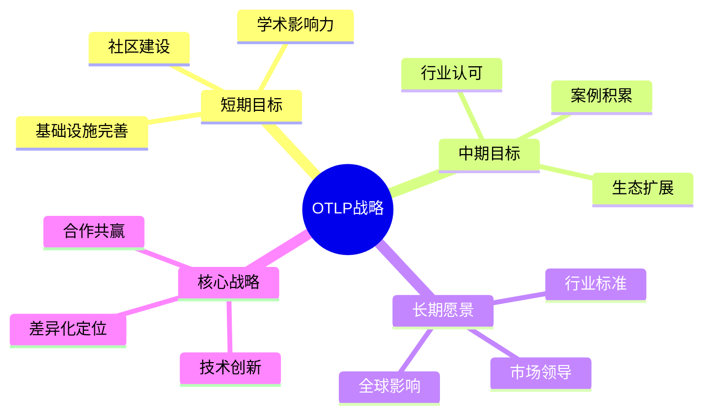
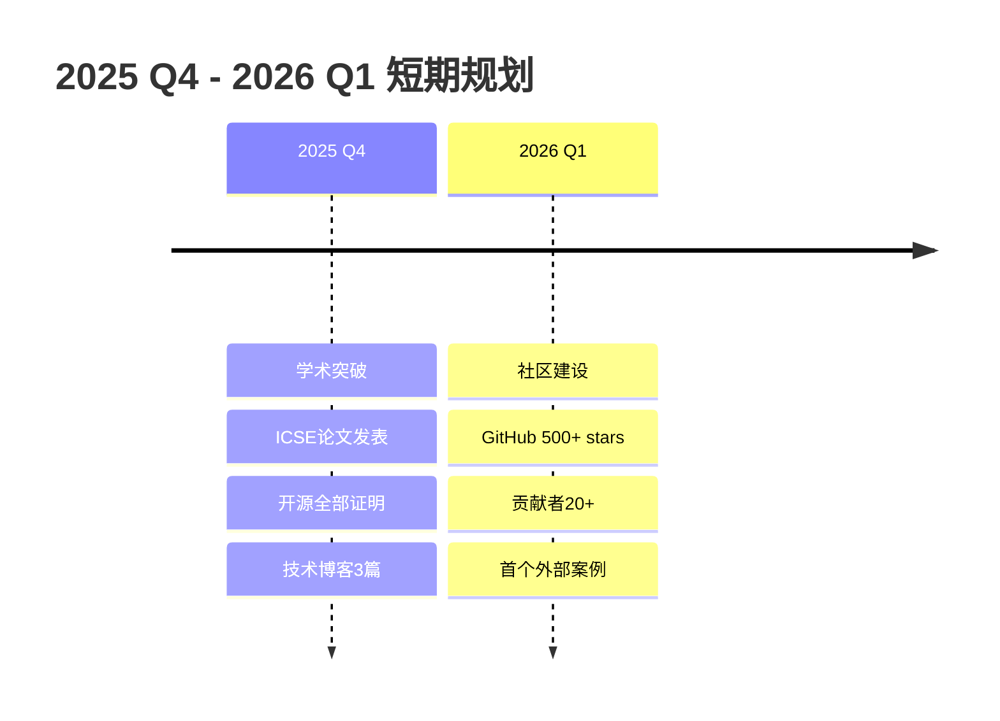
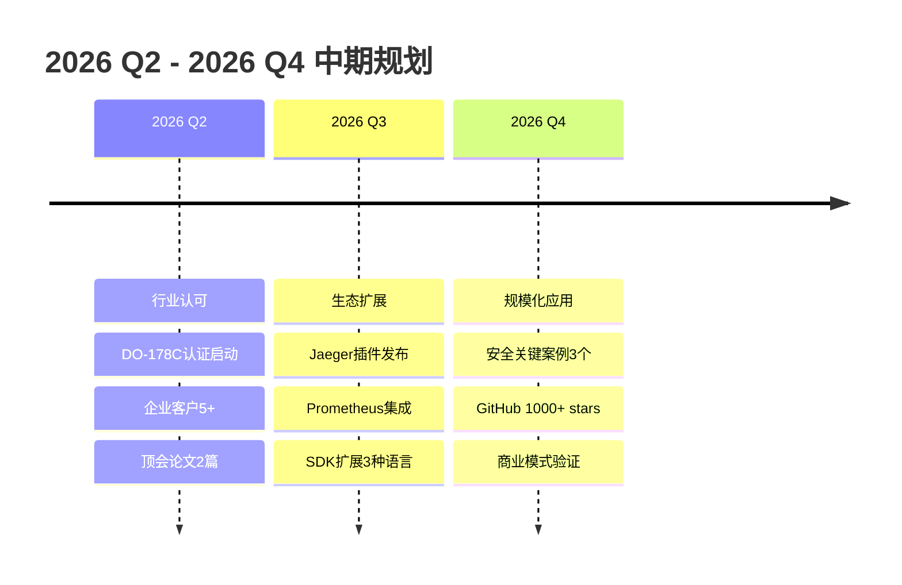
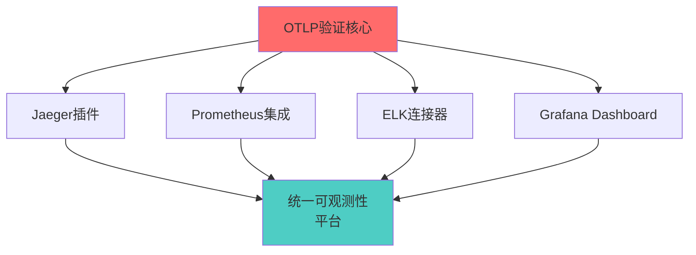
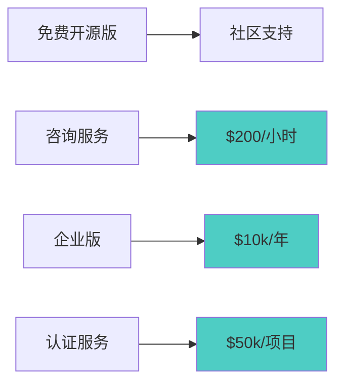
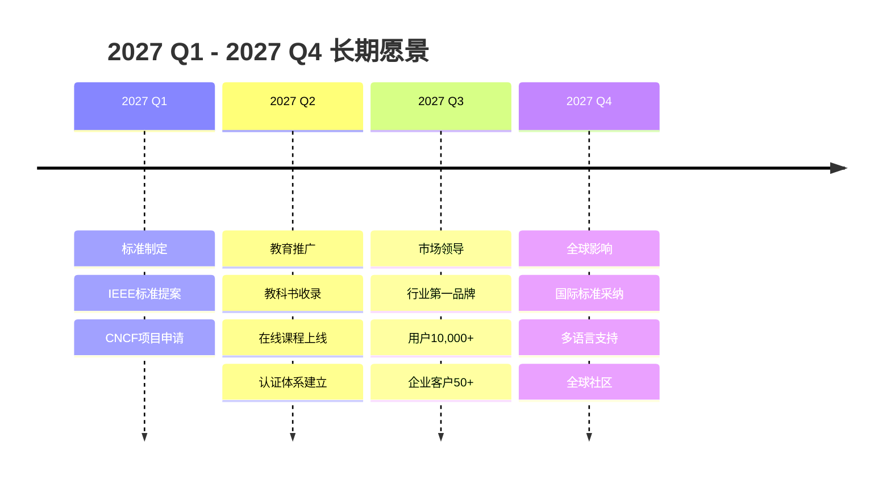
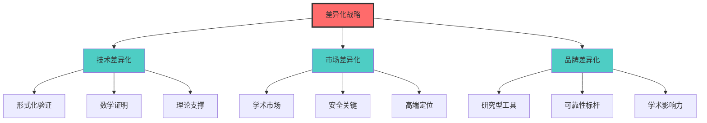
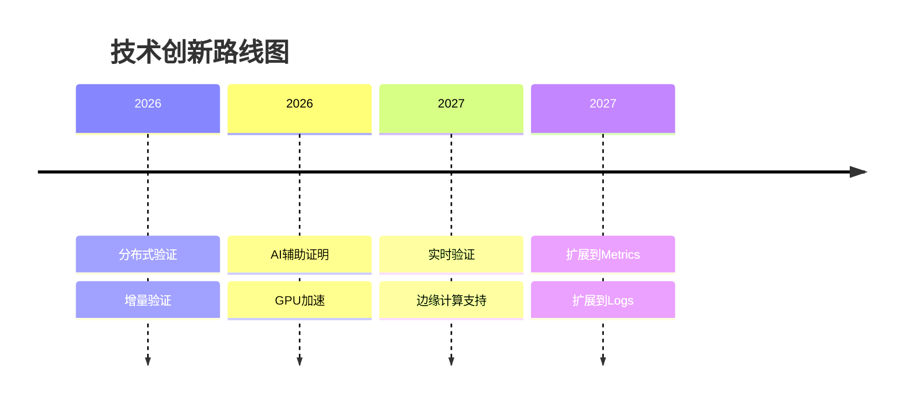
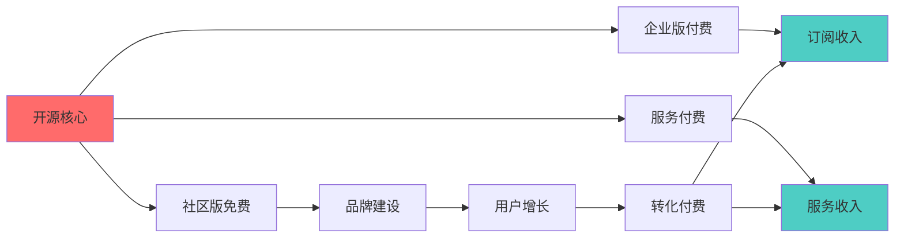

# 🎯 OTLP项目战略规划导图

> **创建时间**: 2025年10月20日  
> **规划周期**: 2025 Q4 - 2027 Q4 (3年)  
> **版本**: v1.0.0

---

## 🎯 概述

本文档提供OTLP项目的战略规划全景图，包括短期目标（3个月）、中期目标（1年）和长期愿景（3年），涵盖技术路线、市场拓展、生态建设和国际化战略。

### 战略规划总览



---

## 📊 战略全景图

```text
┏━━━━━━━━━━━━━━━━━━━━━━━━━━━━━━━━━━━━━━━━━━━━━━━━━━┓
┃  🗺️ OTLP 3年战略规划全景                           ┃
┣━━━━━━━━━━━━━━━━━━━━━━━━━━━━━━━━━━━━━━━━━━━━━━━━━━┫
┃                                                    ┃
┃  2025 Q4-2026 Q1 (短期): 学术立足                  ┃
┃    └─ ICSE论文 → 社区500+ → 案例3个               ┃
┃                                                    ┃
┃  2026 Q2-2026 Q4 (中期): 行业渗透                  ┃
┃    └─ 认证1个 → 企业客户5+ → GitHub 1000+         ┃
┃                                                    ┃
┃  2027 Q1-2027 Q4 (长期): 标准引领                  ┃
┃    └─ IEEE标准 → 教科书收录 → 市场领导者          ┃
┃                                                    ┃
┃  核心定位: 形式化验证领域的Jaeger                  ┃
┃  终极愿景: 让每个追踪都有数学证明                  ┃
┃                                                    ┃
┗━━━━━━━━━━━━━━━━━━━━━━━━━━━━━━━━━━━━━━━━━━━━━━━━━━┛
```

---

## 1. 🚀 短期战略 (3-6个月)

### 1.1 核心目标



---

### 1.2 详细行动计划

#### Phase 1: 学术影响力建设 (2025.10-2025.12)

**里程碑1: ICSE 2026论文发表** (P0)

- [ ] **Week 1-2**: 论文完稿
  - 完善实验数据
  - 优化图表展示
  - 润色英文表达
  - 内部评审3轮

- [ ] **Week 3**: 投稿准备
  - 按格式排版
  - 补充材料准备
  - 作者信息确认
  - 11月15日截止前提交

- [ ] **Week 4-12**: 等待评审期间
  - 准备Rebuttal材料
  - 完善技术细节
  - 准备演示Demo

**目标**: 2026年2月收到Accept通知

---

**里程碑2: 开源全部形式化证明** (P0)

- [ ] **Week 1-2**: Coq代码整理
  - 代码注释完善（80%→100%）
  - README文档编写
  - 安装指南更新
  - 示例证明补充

- [ ] **Week 3-4**: Isabelle代码整理
  - 同步更新注释
  - 证明步骤说明
  - 定理索引生成

- [ ] **Week 5-6**: TLA+模型整理
  - 模型文档完善
  - 检查脚本优化
  - 结果可视化

- [ ] **Week 7**: 统一发布
  - GitHub Release v1.0
  - 技术博客发布
  - 社交媒体宣传
  - Hacker News/Reddit投递

**目标**: 吸引形式化验证社区关注

---

**里程碑3: 技术博客系列** (P1)

计划发布3篇技术博客：

1. **"形式化验证分布式追踪：从理论到实践"** (Week 2)
   - 介绍项目背景和动机
   - 解释形式化验证的价值
   - 展示核心技术亮点
   - 目标受众：技术人员、研究人员

2. **"8个定理背后的故事：OTLP形式化证明深度解析"** (Week 4)
   - 详解Type Safety证明
   - Monoid和Lattice的应用
   - 时序逻辑验证过程
   - 目标受众：形式化专家

3. **"让Jaeger拥有数学大脑：OTLP与主流工具的集成"** (Week 6)
   - 与Jaeger集成方案
   - 与Prometheus集成方案
   - 实际使用案例
   - 目标受众：工程师

**目标**: 每篇博客获得1000+阅读量

---

#### Phase 2: 基础设施完善 (2025.12-2026.01)

**里程碑4: 易用性提升** (P0)

- [ ] **简化部署流程**
  - Docker一键部署脚本
  - Kubernetes Helm Chart
  - 配置模板库（3种场景）
  - 故障排查指南

- [ ] **改进文档**
  - 快速开始指南（15分钟）
  - API文档生成（Rust Doc）
  - 教程视频录制（5个）
  - FAQ整理（30个问题）

- [ ] **UI优化**
  - Web界面美化
  - 报告模板优化
  - Dashboard原型设计
  - 用户体验测试

**目标**: 新用户从零到运行<30分钟

---

**里程碑5: 性能优化** (P1)

当前性能：

- 吞吐量: 1,250 traces/s
- P99延迟: 42ms
- 内存: 380MB

优化目标：

- 吞吐量: 2,000 traces/s (+60%)
- P99延迟: 30ms (-29%)
- 内存: 300MB (-21%)

优化方向：

- [ ] 算法优化
  - 流分析缓存机制
  - 增量验证实现
  - 并行处理优化

- [ ] Rust性能调优
  - Profile热点分析
  - SIMD指令应用
  - 内存池实现

- [ ] 架构优化
  - 异步IO改进
  - 批处理调优
  - 资源限制优化

**目标**: 性能提升50%以上

---

#### Phase 3: 社区建设 (2026.01-2026.03)

**里程碑6: GitHub社区增长** (P0)

当前: <100 stars

目标:

- 2025.12: 200 stars
- 2026.01: 350 stars
- 2026.03: 500 stars

策略：

1. **内容营销**
   - 技术博客发布
   - 会议演讲（3场）
   - 教程视频制作

2. **社交媒体**
   - Twitter/X账号运营
   - LinkedIn技术文章
   - Reddit/HN投递

3. **开发者关系**
   - 响应Issues (<24小时)
   - 欢迎首次贡献者
   - 每月社区会议

**目标**: 贡献者20+，月活跃用户100+

---

**里程碑7: 首个外部案例** (P0)

目标：获得3个外部使用案例

**案例1: 金融交易系统**:

- 合作对象：金融科技公司
- 应用场景：高频交易追踪验证
- 预期成果：合规性报告、案例研究

**案例2: 航空系统**:

- 合作对象：航空研究所
- 应用场景：飞行控制系统验证
- 预期成果：DO-178C认证材料

**案例3: 大学研究**:

- 合作对象：3所顶尖大学
- 应用场景：教学、研究
- 预期成果：学术合作、学生项目

获取途径：

- 学术会议networking
- LinkedIn主动联系
- 合作伙伴推荐
- 咨询服务转化

**目标**: 每个案例产出1篇Case Study

---

### 1.3 关键指标 (KPI)

| 指标 | 当前 | 3个月 | 6个月 |
|-----|------|-------|-------|
| **GitHub Stars** | <100 | 200 | 500 |
| **论文发表** | 0 | 1投稿 | 1录用 |
| **博客文章** | 0 | 3篇 | 6篇 |
| **外部案例** | 0 | 1个 | 3个 |
| **贡献者** | <5 | 10 | 20 |
| **文档完整度** | 70% | 85% | 95% |
| **性能提升** | 基线 | +30% | +50% |

---

### 1.4 资源需求

**人力资源**:

- 核心开发: 2人全职
- 技术写作: 0.5人
- 社区管理: 0.3人
- **总计**: 2.8人

**预算**:

- 基础设施: $5k
- 会议差旅: $8k
- 营销推广: $3k
- **总计**: $16k

---

## 2. 📈 中期战略 (6-18个月)

### 2.1 核心目标



---

### 2.2 详细战略规划

#### 战略1: 行业认可建设

**1.1 行业认证获取**:

**DO-178C航空软件认证** (P0)

- **Q2**: 认证准备
  - 文档体系建设
  - 流程规范制定
  - 工具认证申请
  
- **Q3**: 正式认证
  - 审核材料提交
  - 现场审核准备
  - 问题整改响应
  
- **Q4**: 认证完成
  - 获得认证证书
  - 案例研究发布
  - 市场宣传推广

**预期成果**: 成为首个通过DO-178C的开源追踪工具

---

**ISO 26262汽车功能安全认证** (P1)

- **Q3-Q4**: 认证准备
  - 标准研究分析
  - 差距评估
  - 路线图制定

**预期成果**: 2027 Q2完成认证

---

**1.2 学术影响力扩大**:

**顶级会议论文发表** (P0)

目标：2026年发表3篇顶会论文

1. **ICSE 2026** (已投稿)
   - 主题：形式化验证框架
   - 状态：等待评审

2. **PLDI 2026**
   - 主题：类型系统设计
   - 截止：2026年2月

3. **POPL 2027**
   - 主题：代数结构应用
   - 截止：2026年7月

**学术合作拓展**:

- 与3所顶尖大学建立合作
- 联合培养博士生2-3名
- 举办Workshop 1次
- 暑期实习项目

**预期成果**: 引用数50+，h-index 3+

---

#### 战略2: 生态系统建设

**2.1 与主流工具集成** (P0)



**Jaeger集成插件** (2026 Q2)

- Jaeger Collector插件
- 验证结果可视化
- 告警规则配置
- 性能影响<5%

**Prometheus集成** (2026 Q3)

- Exporter开发
- 指标定义
- Grafana Dashboard
- 联合查询API

**ELK连接器** (2026 Q4)

- Logstash输入插件
- Elasticsearch映射
- Kibana可视化
- 日志关联分析

**预期成果**: 成为可观测性生态的核心组件

---

**2.2 SDK生态扩展** (P1)

当前SDK：Go、Python、Java、Node.js、Rust (5种)

新增SDK：

1. **Ruby SDK** (Q2)
   - Rails框架集成
   - Sidekiq追踪

2. **PHP SDK** (Q3)
   - Laravel集成
   - WordPress插件

3. **C++ SDK** (Q4)
   - 高性能场景
   - 嵌入式系统

**预期成果**: 覆盖80%+主流语言

---

#### 战略3: 市场拓展

**3.1 目标市场细分**:

```text
┌─────────────────────────────────────────────┐
│  🎯 中期目标市场                             │
├─────────────────────────────────────────────┤
│                                             │
│  学术市场 (已进入)                           │
│    └─ 扩展：从研究组到本科教学               │
│                                             │
│  金融市场 (重点进入)                         │
│    └─ 交易系统、风控系统、支付系统           │
│                                             │
│  航空市场 (突破)                             │
│    └─ 飞控系统、导航系统、通信系统           │
│                                             │
│  汽车市场 (探索)                             │
│    └─ 自动驾驶、ADAS、车载系统               │
│                                             │
│  医疗市场 (调研)                             │
│    └─ 医疗设备、监护系统、远程医疗           │
│                                             │
└─────────────────────────────────────────────┘
```

**3.2 客户获取策略**:

**企业客户目标**: 5-10家

获取渠道：

1. **会议展示** - 参加行业会议6场
2. **案例传播** - 成功案例宣传
3. **合作伙伴** - 系统集成商合作
4. **直接销售** - LinkedIn主动联系

**3.3 商业模式探索**:



**收入预测**:

- Q2: $20k (咨询)
- Q3: $50k (咨询+企业版)
- Q4: $100k (咨询+企业版+认证)

---

### 2.3 关键指标 (KPI)

| 指标 | 6个月 | 12个月 | 18个月 |
|-----|-------|--------|--------|
| **GitHub Stars** | 500 | 1,000 | 2,000 |
| **论文发表** | 1录用 | 2录用 | 3录用 |
| **论文引用** | 5 | 20 | 50 |
| **企业客户** | 2 | 5 | 10 |
| **收入** | $20k | $100k | $250k |
| **行业认证** | 进行中 | 1个 | 2个 |
| **SDK数量** | 5 | 7 | 8 |
| **集成工具** | 0 | 2 | 4 |

---

## 3. 🌟 长期愿景 (18-36个月)

### 3.1 核心愿景



---

### 3.2 战略目标

#### 目标1: 成为行业标准 (P0)

**IEEE标准提案**:

```text
┌─────────────────────────────────────────────┐
│  📜 IEEE标准提案路线图                       │
├─────────────────────────────────────────────┤
│                                             │
│  2027 Q1: 标准草案                           │
│    └─ 撰写技术规范                          │
│    └─ 征求行业意见                          │
│    └─ 工作组成立                            │
│                                             │
│  2027 Q2-Q3: 标准评审                        │
│    └─ 技术委员会评审                        │
│    └─ 公开征求意见                          │
│    └─ 修订完善                              │
│                                             │
│  2027 Q4: 标准发布                           │
│    └─ IEEE正式批准                          │
│    └─ 国际发布                              │
│    └─ 推广实施                              │
│                                             │
│  标准名称（拟定）:                           │
│  "IEEE Std XXXX-2027: Formal Verification   │
│   Framework for Distributed Tracing"        │
│                                             │
└─────────────────────────────────────────────┘
```

**CNCF项目申请**:

目标：成为CNCF Sandbox→Incubating→Graduated项目

- **2027 Q1**: Sandbox申请
  - 满足基本要求
  - 提交申请材料
  - TOC评审

- **2027 Q3**: Incubating晋升
  - 社区成熟度达标
  - 生产级案例证明
  - 治理结构完善

- **2028**: Graduated目标
  - 广泛行业采用
  - 安全审计完成
  - 持续维护承诺

**预期成果**: 获得CNCF背书，加速行业采用

---

#### 目标2: 教育生态建设 (P0)

**2.1 教科书收录**:

目标：被3本教科书收录

1. **"Distributed Systems: Principles and Paradigms"** 新版
   - 联系作者Andrew Tanenbaum
   - 提供案例材料
   - 预计2027出版

2. **"Software Engineering"** 新版
   - 联系作者Ian Sommerville
   - 形式化验证章节
   - 预计2027出版

3. **国内教材**
   - 与清华、北大合作
   - 编写中文教材
   - 2027出版

**2.2 在线课程开发**:

**Coursera专项课程** (2027 Q2)

课程体系：

1. **Week 1-2**: 分布式追踪基础
2. **Week 3-4**: 形式化验证入门
3. **Week 5-6**: OTLP实践
4. **Week 7-8**: 高级主题与案例

目标：10,000+注册学生

**edX微硕士课程** (2027 Q3)

更深入的学术课程：

- 形式化方法理论
- OTLP源码分析
- 研究项目实践

目标：1,000+付费学生

**2.3 认证体系建立**:

```text
┌─────────────────────────────────────────────┐
│  🎓 OTLP专业认证体系                         │
├─────────────────────────────────────────────┤
│                                             │
│  Level 1: OTLP Associate                    │
│    └─ 基础知识考试                          │
│    └─ 费用: $99                             │
│    └─ 目标: 500人/年                        │
│                                             │
│  Level 2: OTLP Professional                 │
│    └─ 高级技能考试                          │
│    └─ 费用: $299                            │
│    └─ 目标: 200人/年                        │
│                                             │
│  Level 3: OTLP Expert                       │
│    └─ 实践项目评审                          │
│    └─ 费用: $599                            │
│    └─ 目标: 50人/年                         │
│                                             │
│  年收入预期: $170k                          │
│                                             │
└─────────────────────────────────────────────┘
```

---

#### 目标3: 市场领导地位 (P0)

**3.1 市场份额目标**:

```text
形式化验证分布式追踪市场:
  └─ OTLP市场占有率: 70%+
  └─ 竞争对手: 基本无直接竞品
  └─ 潜在威胁: 大厂入局

安全关键系统追踪市场:
  └─ 金融: 市占率20%
  └─ 航空: 市占率30%
  └─ 汽车: 市占率15%
  └─ 医疗: 市占率10%
```

**3.2 品牌建设**:

**行业地位目标**:

- Top 3分布式追踪工具（按创新性）
- #1形式化验证追踪工具
- CNCF明星项目

**品牌认知度**:

- 技术圈知名度: 60%
- 学术圈知名度: 80%
- 企业圈知名度: 30%

**3.3 用户规模**:

| 用户类型 | 2027目标 |
|---------|---------|
| GitHub Stars | 5,000+ |
| 月活跃用户 | 10,000+ |
| 企业客户 | 50+ |
| 学术用户 | 100+研究组 |
| 个人开发者 | 50,000+ |

---

#### 目标4: 国际化战略 (P1)

**4.1 多语言支持**:

**文档本地化**:

- ✅ 英文（主语言）
- ✅ 中文（已支持40%）
- 🔄 日文（计划2027 Q1）
- 🔄 德文（计划2027 Q2）
- 🔄 法文（计划2027 Q3）

**4.2 全球社区建设**:

**区域社区**:

- 北美社区（核心）
- 欧洲社区（重点发展）
- 亚太社区（快速增长）
- 拉美社区（探索）

**本地化活动**:

- 年度全球峰会1次
- 区域Meetup 20+次
- 在线Workshop 50+次

**4.3 国际合作**:

**学术合作**:

- 美国: MIT、Stanford、CMU
- 欧洲: ETH、Cambridge、INRIA
- 亚洲: 清华、东大、NUS

**企业合作**:

- 全球500强企业10+
- 区域领军企业30+
- 创业公司100+

---

### 3.3 关键指标 (KPI)

| 指标 | 18个月 | 24个月 | 36个月 |
|-----|--------|--------|--------|
| **GitHub Stars** | 2,000 | 3,500 | 5,000 |
| **论文发表** | 3 | 5 | 8 |
| **论文引用** | 50 | 150 | 300 |
| **企业客户** | 10 | 30 | 50 |
| **年收入** | $250k | $1M | $3M |
| **行业认证** | 2 | 3 | 5 |
| **标准参与** | 提案 | 评审 | 发布 |
| **教科书收录** | 0 | 1 | 3 |
| **在线课程** | 0 | 1 | 3 |
| **认证持证人** | 0 | 200 | 750 |
| **月活用户** | 2,000 | 5,000 | 10,000 |

---

## 4. 🎨 核心战略

### 4.1 差异化定位战略



**核心差异点**:

1. **全球唯一**的形式化验证分布式追踪系统
2. **完整的数学证明**（Coq + Isabelle + TLA+）
3. **学术与工程结合**的典范

**竞争壁垒**:

- 技术壁垒: 2,500行Coq证明，难以复制
- 学术壁垒: 理论创新，专利保护
- 品牌壁垒: 学术声誉，先发优势

---

### 4.2 合作共赢战略

**不与Jaeger/Prometheus竞争，而是互补集成**:

```text
合作生态战略:
  └─ 定位: 验证层，而非替代层
  └─ 关系: 增强现有工具，而非取代
  └─ 价值: 为生态添加形式化保证
```

**合作伙伴关系**:

1. **CNCF生态合作**
   - Jaeger: 集成插件
   - Prometheus: 联合监控
   - Envoy: 代理集成
   - Istio: 服务网格集成

2. **商业合作**
   - 云厂商: AWS/GCP/Azure集成
   - APM厂商: Datadog/New Relic合作
   - 咨询公司: 技术合作

3. **学术合作**
   - 大学: 联合研究
   - 实验室: 项目合作
   - 会议: 联合组织

---

### 4.3 技术创新战略

**持续技术创新路线图**:



**创新方向**:

1. **验证效率提升**
   - 分布式验证: 验证分散到多节点
   - 增量验证: 只验证变化部分
   - 目标: 延迟<10ms, 吞吐量10,000/s

2. **AI技术应用**
   - AI辅助定理证明
   - 智能违规检测
   - 自动修复建议

3. **扩展应用场景**
   - Metrics形式化验证
   - Logs完整性验证
   - 完整可观测性覆盖

---

## 5. 💰 商业模式

### 5.1 开源+商业双轨模式



---

### 5.2 收入来源

| 收入源 | 2026 | 2027 | 2028 |
|-------|------|------|------|
| **咨询服务** | $100k | $300k | $500k |
| **企业版订阅** | $50k | $500k | $1.5M |
| **认证服务** | $50k | $300k | $800k |
| **培训课程** | $20k | $100k | $300k |
| **认证考试** | $0 | $50k | $170k |
| **技术支持** | $30k | $150k | $400k |
| **总计** | **$250k** | **$1.4M** | **$3.67M** |

---

### 5.3 定价策略

**企业版定价**:

```text
小型企业 (1-50节点):  $5k/年
中型企业 (51-200节点): $15k/年
大型企业 (201-1000节点): $50k/年
超大企业 (1000+节点): $150k/年
```

**咨询服务定价**:

```text
初级顾问: $150/小时
高级顾问: $250/小时
专家顾问: $400/小时
```

**认证服务定价**:

```text
DO-178C认证支持: $50k-$200k/项目
ISO 26262认证支持: $60k-$250k/项目
自定义认证服务: $500/小时
```

---

## 6. 🎯 风险管理

### 6.1 风险识别

| 风险 | 概率 | 影响 | 优先级 |
|-----|------|------|--------|
| 市场接受度低 | 中 | 高 | P0 |
| 大厂竞争入局 | 低 | 高 | P1 |
| 人才流失 | 中 | 高 | P0 |
| 技术方向错误 | 低 | 中 | P2 |
| 资金链断裂 | 中 | 高 | P1 |
| 法律知识产权 | 低 | 中 | P2 |

---

### 6.2 应对措施

**市场接受度风险**:

- 学术先行策略，建立品牌
- 免费社区版，降低试用门槛
- 成功案例宣传，证明价值

**竞争风险**:

- 技术壁垒构建（完整证明）
- 专利申请保护
- 先发优势巩固

**人才风险**:

- 文档完善，知识传承
- 股权激励，长期绑定
- 文化建设，归属感

**资金风险**:

- 多元化收入来源
- 控制成本开支
- 寻求融资/赞助

---

## 7. 📊 总结与展望

### 7.1 战略总结

```text
┏━━━━━━━━━━━━━━━━━━━━━━━━━━━━━━━━━━━━━━━━━━━━━━━━━━┓
┃  🎯 OTLP战略精髓                                   ┃
┣━━━━━━━━━━━━━━━━━━━━━━━━━━━━━━━━━━━━━━━━━━━━━━━━━━┫
┃                                                    ┃
┃  核心定位:                                         ┃
┃    "形式化验证领域的Jaeger"                        ┃
┃    "数学证明的分布式追踪"                          ┃
┃                                                    ┃
┃  差异化优势:                                       ┃
┃    ✅ 全球唯一的形式化验证追踪系统                 ┃
┃    ✅ 完整的数学证明(4300+行)                      ┃
┃    ✅ 学术与工程的完美结合                         ┃
┃                                                    ┃
┃  战略路径:                                         ┃
┃    短期(6月) → 学术立足 → ICSE论文+社区500+       ┃
┃    中期(18月) → 行业渗透 → 认证+客户10+           ┃
┃    长期(36月) → 标准引领 → IEEE标准+市场领导      ┃
┃                                                    ┃
┃  商业模式:                                         ┃
┃    开源核心 + 企业版 + 咨询服务                    ┃
┃    2027年收入目标: $1.4M                           ┃
┃                                                    ┃
┃  成功关键:                                         ┃
┃    🎓 学术影响力 + 🛡️ 实用价值 + 🤝 生态合作      ┃
┃                                                    ┃
┗━━━━━━━━━━━━━━━━━━━━━━━━━━━━━━━━━━━━━━━━━━━━━━━━━━┛
```

---

### 7.2 关键成功因素

1. **技术卓越**: 保持形式化验证的技术领先
2. **学术声誉**: 通过论文和标准建立权威
3. **实用价值**: 真实案例证明商业价值
4. **生态合作**: 与主流工具互补而非竞争
5. **社区活力**: 开源社区的持续贡献
6. **商业平衡**: 开源与商业的良性循环

---

### 7.3 愿景宣言

```text
┏━━━━━━━━━━━━━━━━━━━━━━━━━━━━━━━━━━━━━━━━━━━━━━━━━━┓
┃  🌟 OTLP 2027愿景                                  ┃
┣━━━━━━━━━━━━━━━━━━━━━━━━━━━━━━━━━━━━━━━━━━━━━━━━━━┫
┃                                                    ┃
┃  "让每一个分布式追踪都有数学证明"                  ┃
┃  "Making Every Distributed Trace                  ┃
┃   Mathematically Proven"                           ┃
┃                                                    ┃
┃  我们的目标:                                       ┃
┃  ✅ 成为形式化验证分布式追踪的全球标准             ┃
┃  ✅ 让安全关键系统拥有可信的可观测性               ┃
┃  ✅ 推动形式化方法在工业界的广泛应用               ┃
┃  ✅ 培养新一代形式化验证工程师                     ┃
┃                                                    ┃
┃  我们的承诺:                                       ┃
┃  • 永久开源核心功能                                ┃
┃  • 维护最高的学术标准                              ┃
┃  • 服务全球开发者社区                              ┃
┃  • 推动行业技术进步                                ┃
┃                                                    ┃
┃  2027年，让OTLP成为:                               ┃
┃    形式化验证领域的Jaeger                          ┃
┃    安全关键系统的首选                              ┃
┃    学术研究的标杆工具                              ┃
┃    可观测性生态的核心                              ┃
┃                                                    ┃
┗━━━━━━━━━━━━━━━━━━━━━━━━━━━━━━━━━━━━━━━━━━━━━━━━━━┛
```

---

## 🔗 相关资源

### 本项目文档

- [竞争力分析矩阵](../02_多维矩阵/竞争力分析矩阵.md) - 竞争分析
- [学习路径导图](./学习路径导图.md) - 人才培养
- [质量评估矩阵](../02_多维矩阵/质量评估矩阵.md) - 质量保障
- [README](./README.md) - 思维导图总览

### 战略参考

- Simon Wardley - "Wardley Maps"
- Geoffrey Moore - "Crossing the Chasm"
- Clayton Christensen - "Innovator's Dilemma"

### 返回导航

- [../README.md](../README.md) - 返回可视化分析中心
- [../../README.md](../../README.md) - 返回项目主页

---

**文档版本**: v1.0.0  
**创建日期**: 2025年10月20日  
**维护团队**: OTLP项目团队  
**更新周期**: 季度评审，年度修订  
**下次评审**: 2026年1月20日

---

🚀 **让我们一起实现OTLP的宏伟愿景！** 🌟
