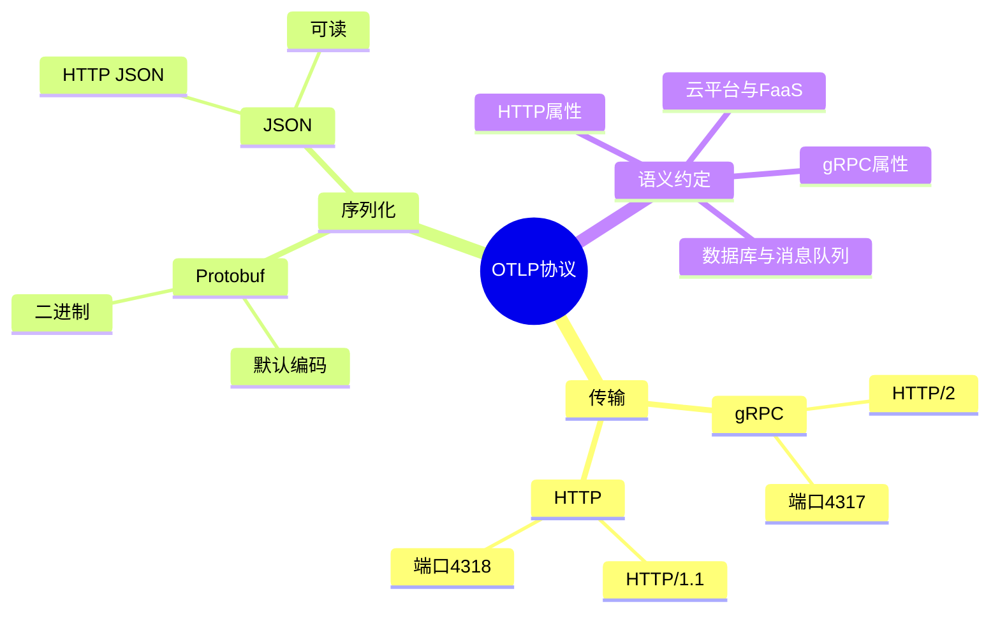
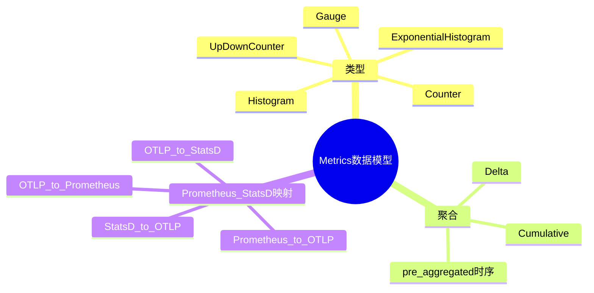
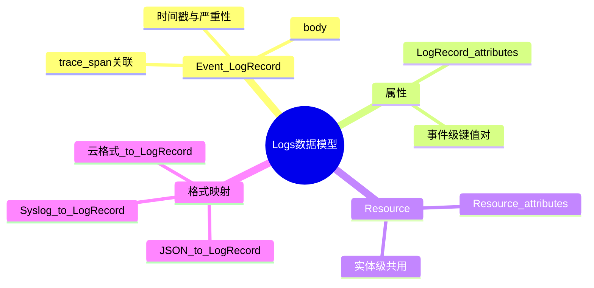

# 范围思维导图：OTLP / Metrics / Logs

> **覆盖范围**: 三条内容范围（OTLP 协议、Metrics 数据模型、Logs 数据模型）
> **用途**: 概念层级与知识结构按范围分开展示
> **关联**: [00_范围-权威对齐矩阵](../../docs/🔬_批判性评价与持续改进计划/00_范围-权威对齐矩阵.md)

---

## 1. OTLP 协议范围思维导图

（传输 / 序列化 / 语义约定）

---

## 2. OTLP Metrics 数据模型范围思维导图

（类型 / 聚合 / 映射）

---

## 3. OTLP Logs 数据模型范围思维导图

（Event / 属性 / 资源 / 格式映射）

