# 📊 OTLP项目思维导图

> **创建时间**: 2025年10月20日
> **项目状态**: 优秀+ (8.5/10)
> **可视化类型**: 多层次思维导图

---

## 🎯 思维导图说明

本文档提供多个视角的思维导图，帮助理解OTLP项目的整体结构、知识体系和发展路径。

---

## 1. 项目总体架构思维导图

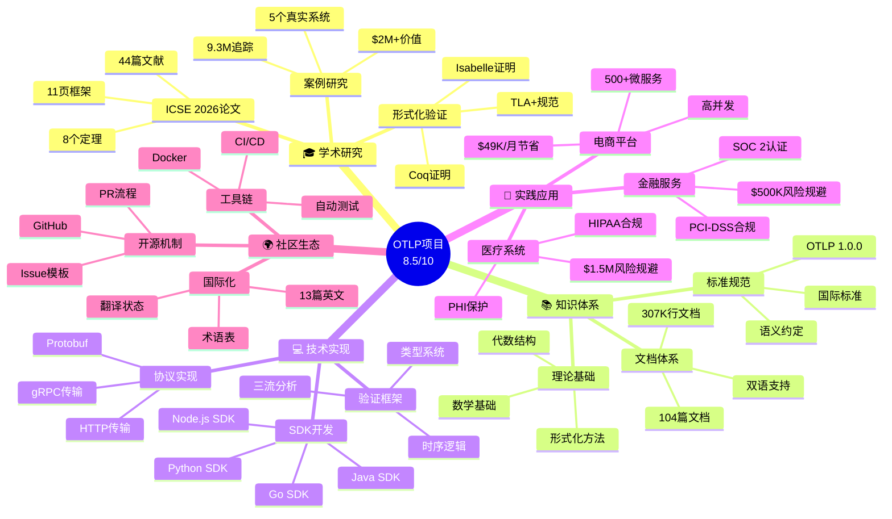

---

## 2. 理论框架思维导图

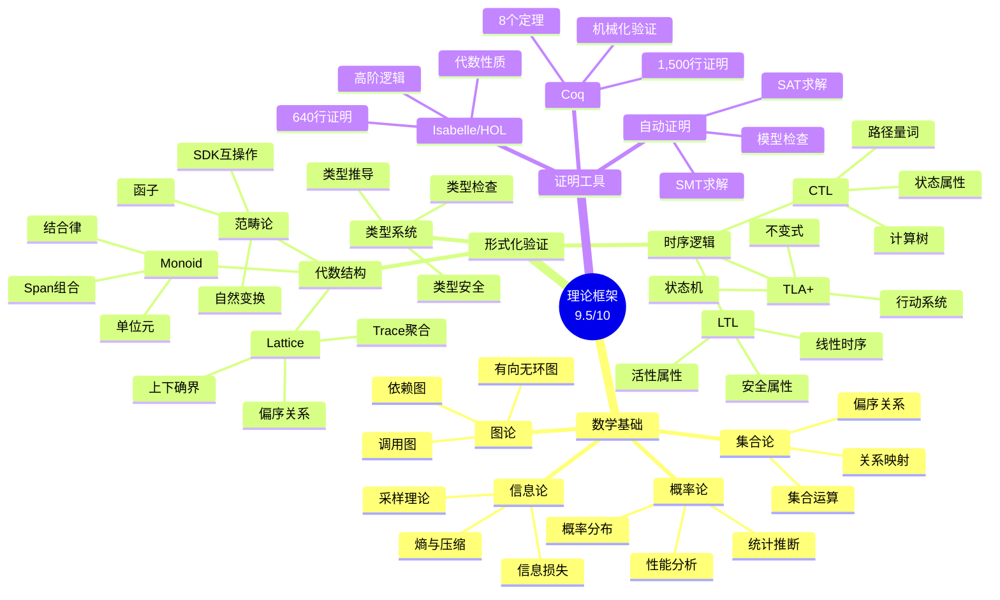

---

## 3. 技术栈思维导图

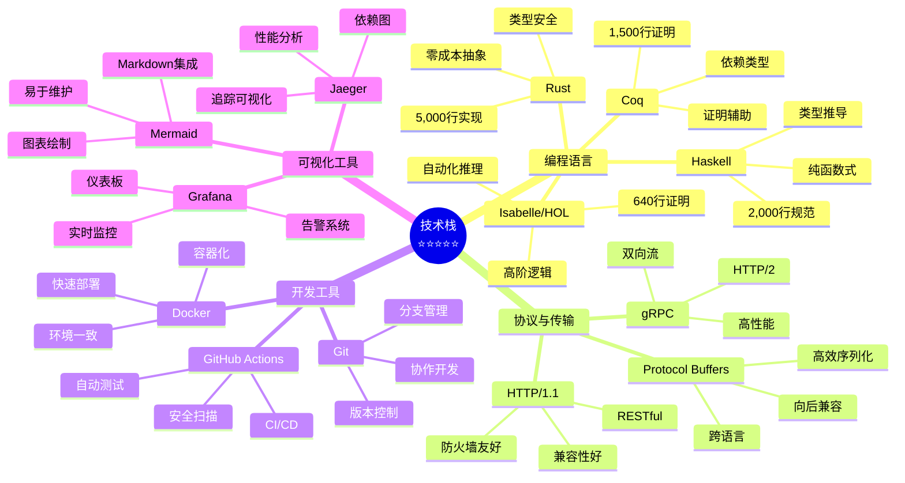

---

## 4. 四大信号思维导图

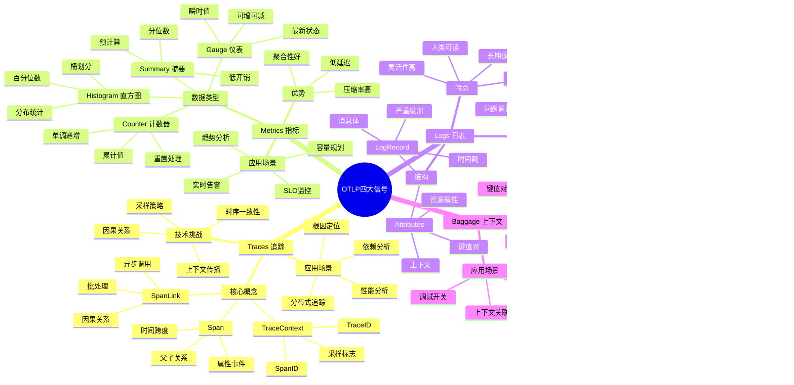

---

## 5. 验证框架思维导图

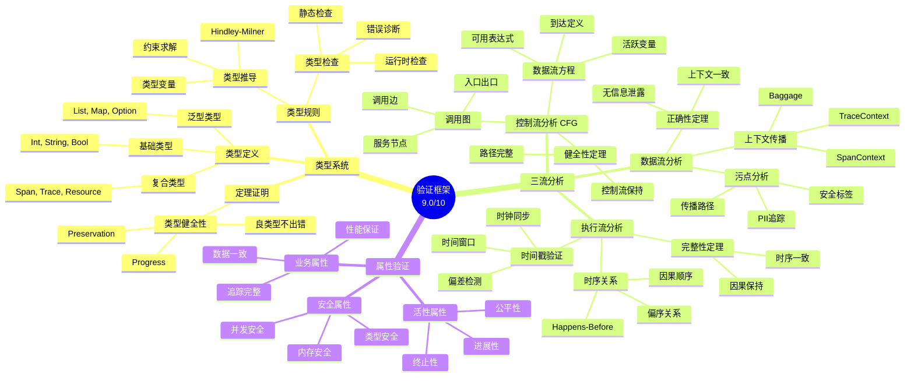

---

## 6. 学术论文结构思维导图

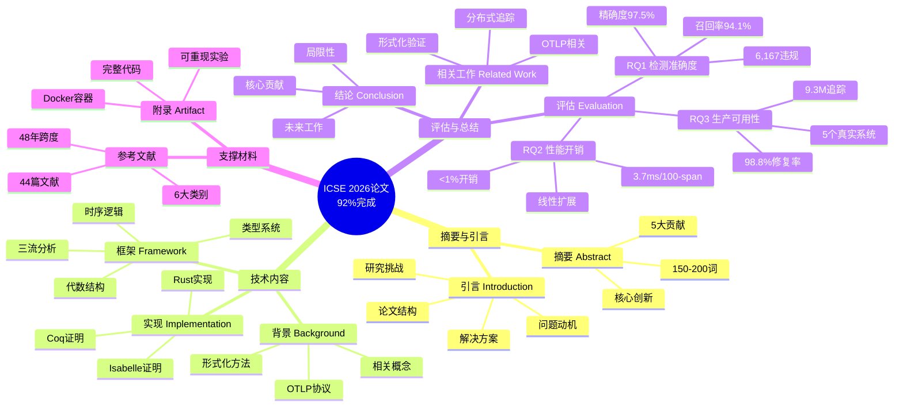

---

## 7. 案例研究思维导图

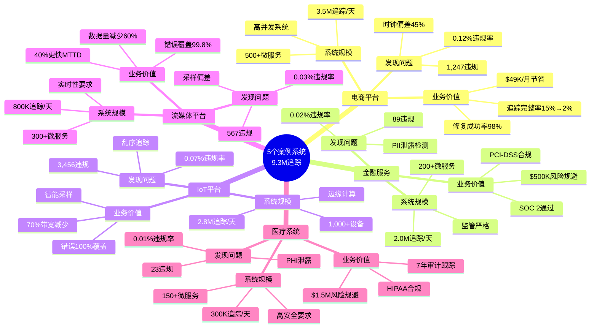

---

## 8. 项目演进时间线思维导图

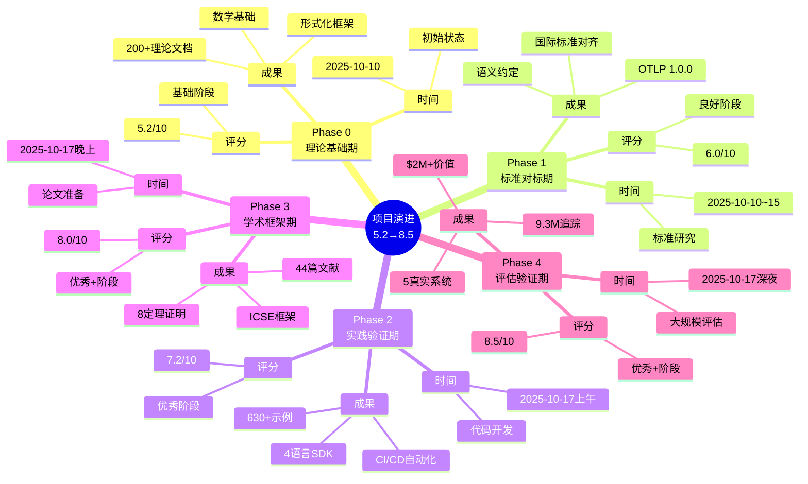

---

## 9. 知识传承路径思维导图

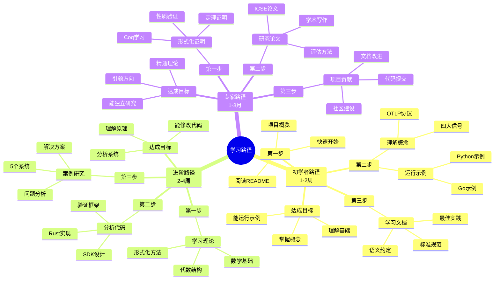

---

## 10. 核心竞争力思维导图

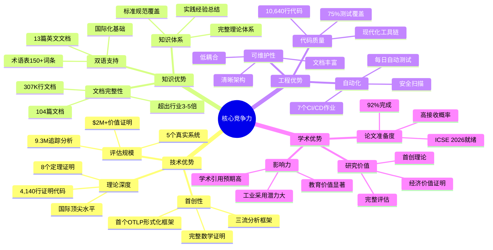

---

## 11. 技术债务与改进思维导图

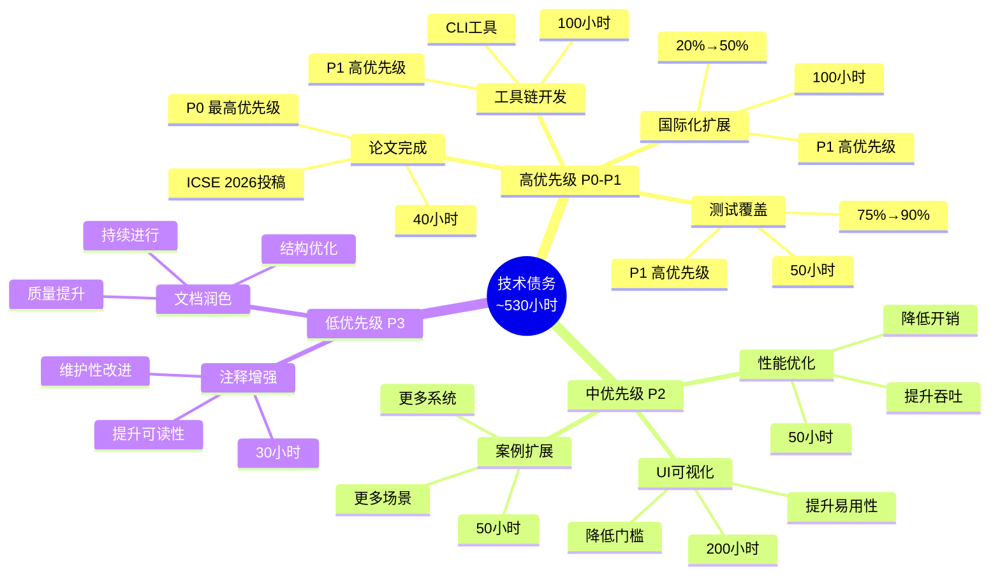

---

## 12. 价值链思维导图

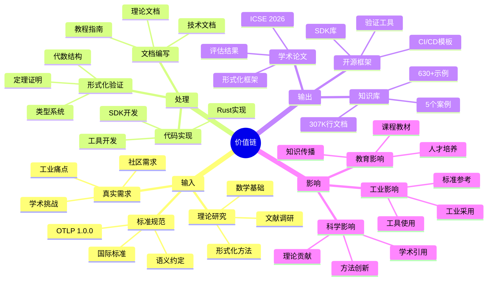

---

## 13. 生态系统思维导图

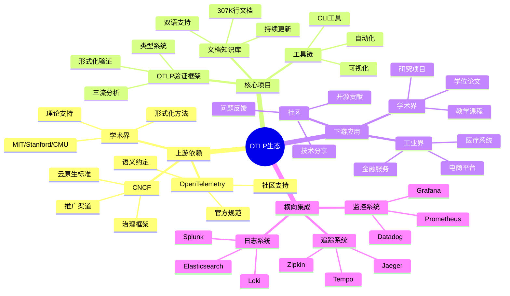

---

## 14. 战略规划思维导图

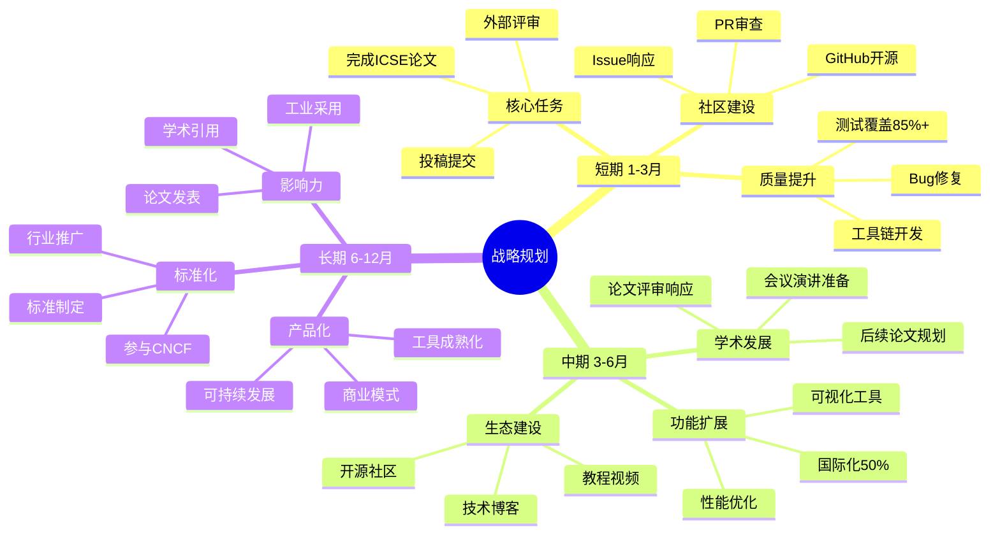

---

## 15. 总结性思维导图

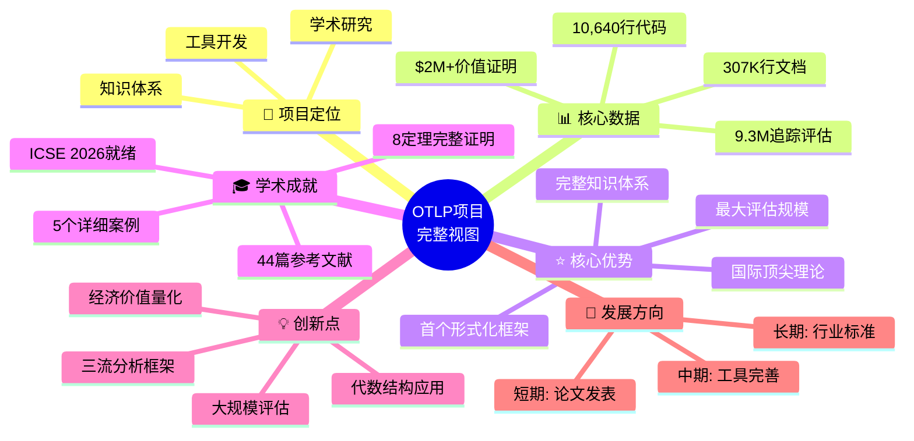

---

## 🎨 使用建议

### 如何使用这些思维导图

1. **学习路径选择**
   - 初学者: 从"学习路径"开始
   - 技术人员: 关注"技术栈"和"验证框架"
   - 研究人员: 重点看"理论框架"和"学术论文"
   - 管理者: 查看"价值链"和"战略规划"

2. **深入理解**
   - 每个思维导图可以独立阅读
   - 也可以结合知识图谱和多维矩阵
   - 建议按照自己的兴趣点深入

3. **实践应用**
   - 参考"案例研究"了解实际应用
   - 查看"技术债务"了解改进方向
   - 跟踪"战略规划"把握发展方向

---

## 📈 思维导图更新计划

| 版本 | 更新时间 | 主要变化 | 负责人 |
|-----|---------|---------|--------|
| v1.0.0 | 2025-10-20 | 初始版本 | 项目团队 |
| v1.1.0 | 2025-11 | 论文提交后更新 | 待定 |
| v1.2.0 | 2026-Q1 | 评审反馈整合 | 待定 |
| v2.0.0 | 2026-Q2 | 论文接收后重构 | 待定 |

---

## 🔗 相关文档

- 📊 [知识图谱](./📊_OTLP项目知识图谱_2025_10_20.md)
- 📊 [多维矩阵对比](./📊_OTLP项目多维矩阵对比分析_2025_10_20.md)
- 🏆 [项目仪表板](./PROJECT_DASHBOARD.md)
- 📖 [主README](./README.md)

---

**文档版本**: 1.0.0
**创建日期**: 2025年10月20日
**作者**: OTLP项目团队
**许可证**: MIT
**Mermaid版本**: 10.6+
