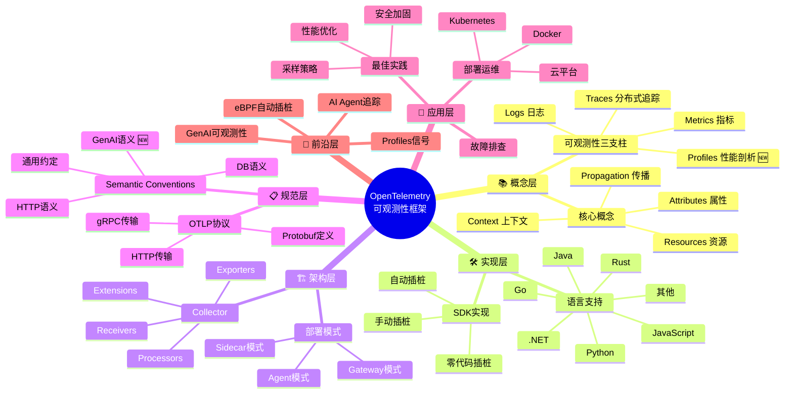
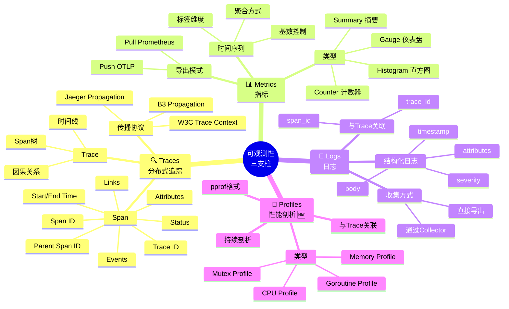
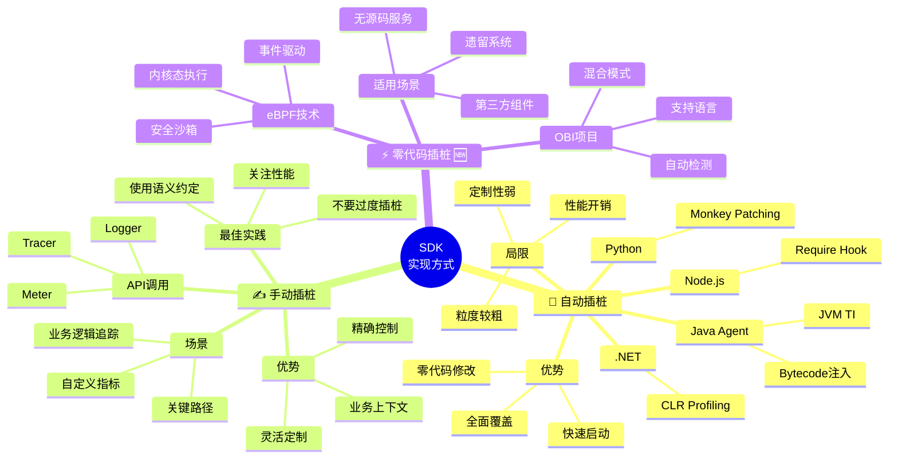
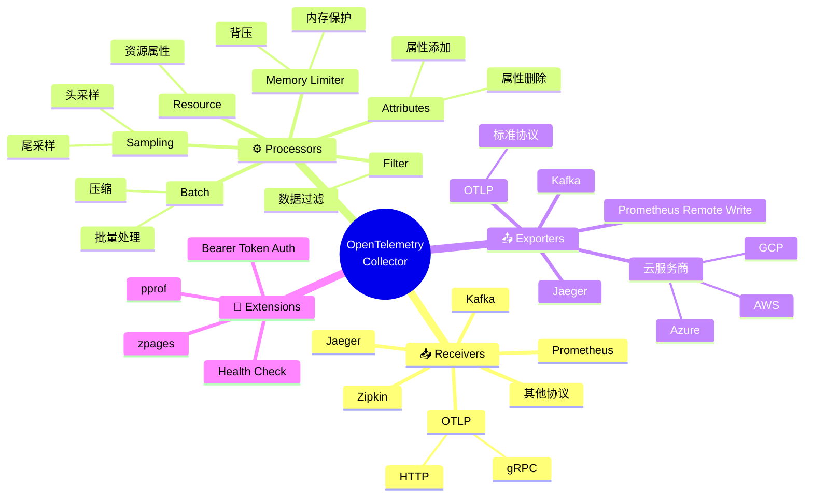
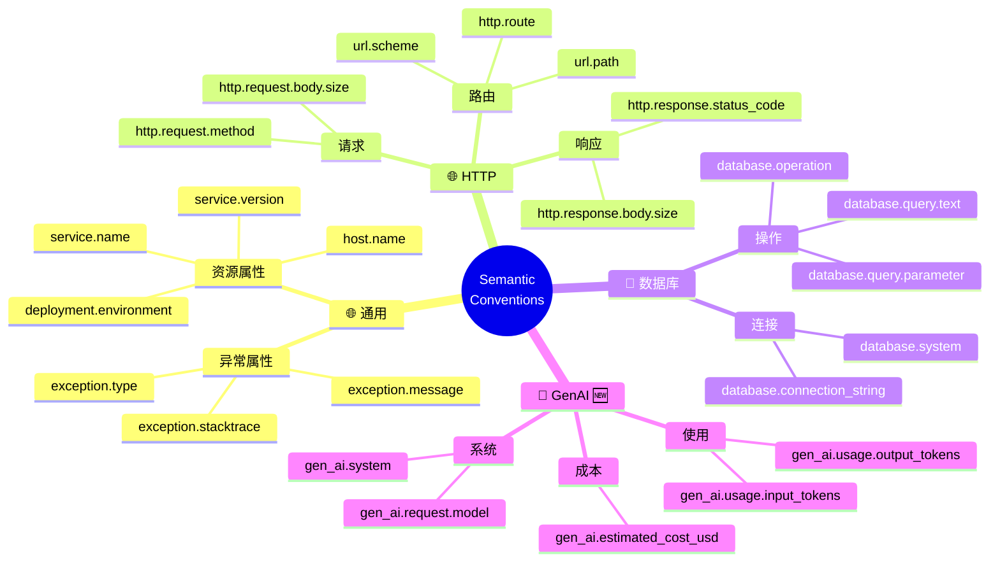
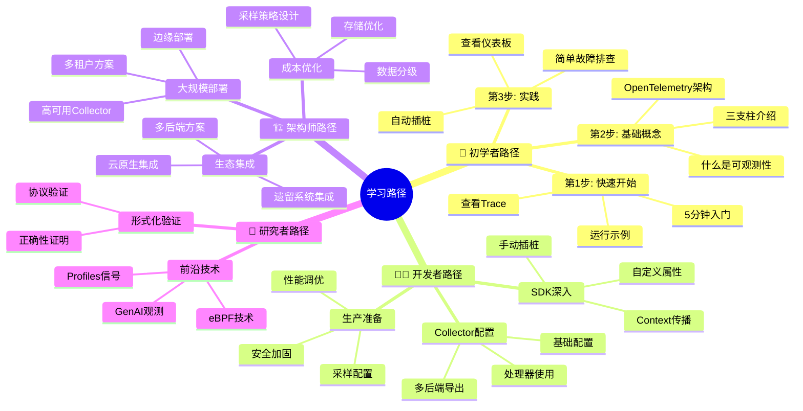

# OpenTelemetry完整知识图谱

> **类型**: 全局思维导图
> **用途**: 了解OpenTelemetry全貌
> **阅读方式**: 从整体到局部，逐层深入

---

## 🗺️ 全景视图

---

## 📚 概念层详细展开

---

## 🛠️ 实现层详细展开

---

## 🏗️ 架构层详细展开

---

## 📋 规范层详细展开

---

## 🚀 学习路径导图

---

## 🎯 使用指南

### 如何使用本导图

1. **全景视图**: 了解OpenTelemetry全貌
2. **逐层深入**: 根据兴趣深入特定领域
3. **学习路径**: 选择适合自己的学习路线
4. **查漏补缺**: 检查知识盲区

### 导图配色说明

- 🟦 蓝色系: 概念/理论
- 🟩 绿色系: 实现/代码
- 🟨 黄色系: 架构/组件
- 🟪 紫色系: 规范/标准
- 🟥 红色系: 前沿/新兴

---

**导图版本**: v1.0
**更新日期**: 2026年3月15日
**维护者**: OTLP项目团队
