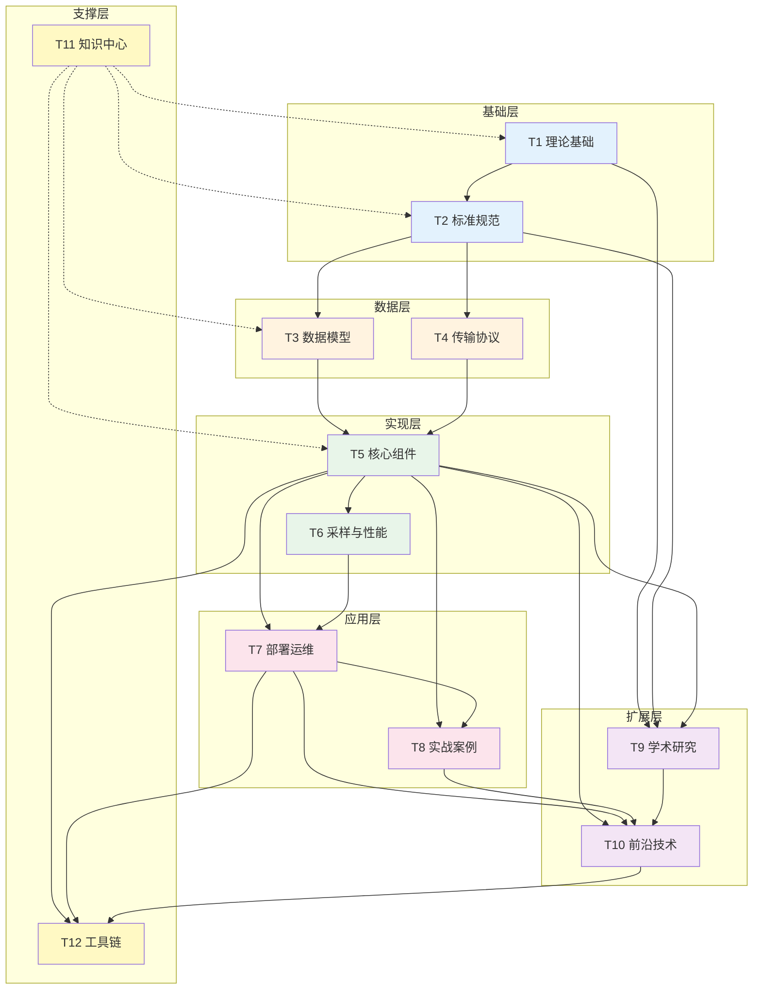
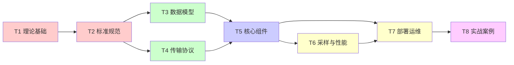
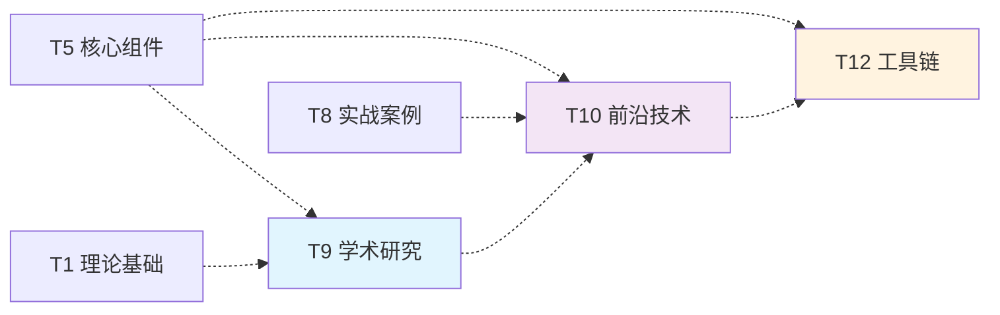
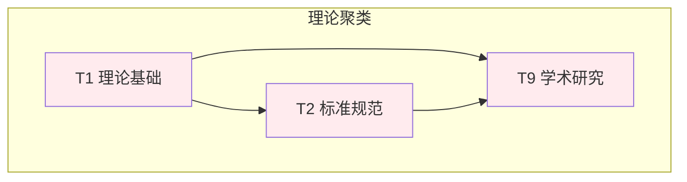
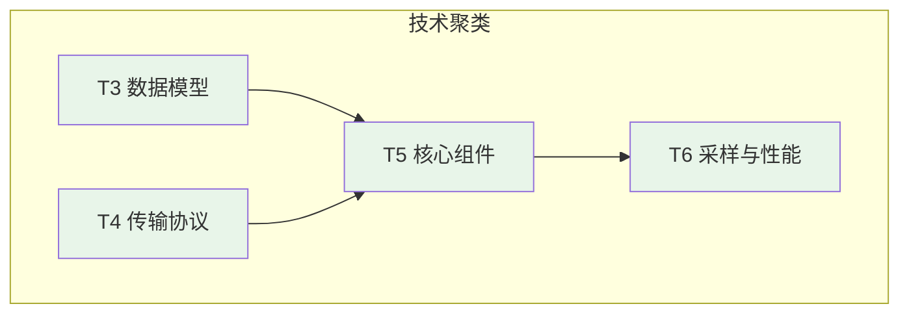
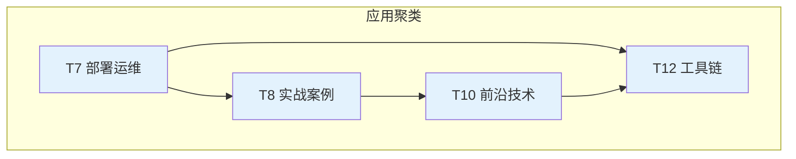
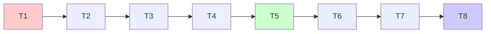
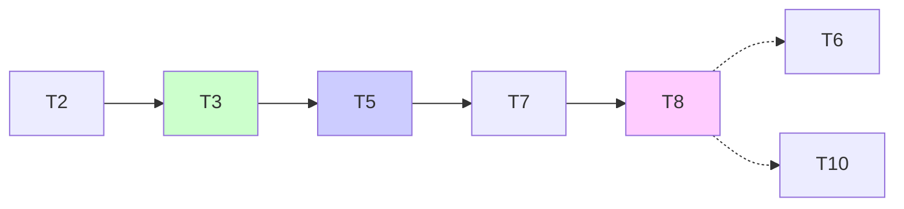
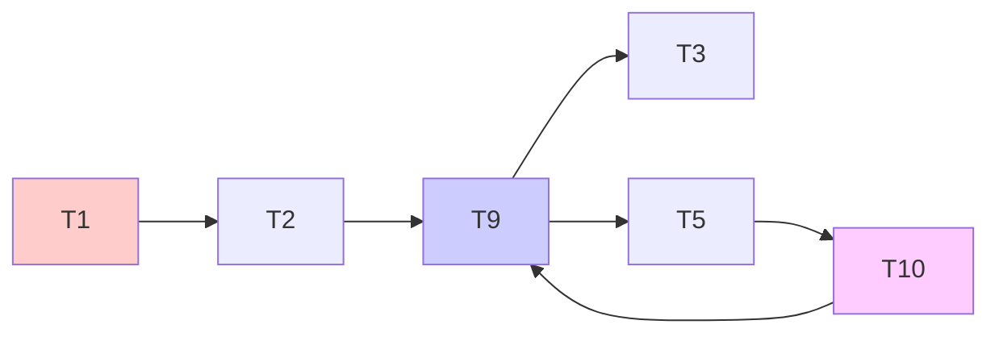
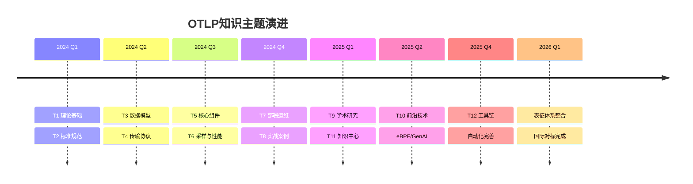

# OTLP 主题关系图谱

> **用途**: 可视化12主题间的依赖关系与知识交叉
> **更新日期**: 2026年3月15日

---

## 🌐 全局主题关系图

---

## 🔗 核心依赖关系

### 强依赖关系 (必须先掌握)

| 依赖路径 | 说明 | 学习建议 |
|:---|:---|:---|
| T1 → T2 | 理论基础支撑标准理解 | 先学形式化概念，再读规范 |
| T2 → T3/T4 | 标准规范指导数据与传输设计 | 规范是数据的依据 |
| T3/T4 → T5 | 数据和传输是组件实现基础 | 理解模型再学组件 |
| T5 → T6/T7 | 组件是实现和部署的核心 | SDK/Collector是核心 |
| T7 → T8 | 运维是实战的基础 | 先部署再实战 |

### 弱依赖关系 (相互增强)

---

## 📊 主题交叉矩阵

### 交叉影响强度矩阵

|  | T1 | T2 | T3 | T4 | T5 | T6 | T7 | T8 | T9 | T10 | T11 | T12 |
|:---:|:---:|:---:|:---:|:---:|:---:|:---:|:---:|:---:|:---:|:---:|:---:|:---:|
| **T1** | - | 🔴 | 🟡 | 🟢 | 🟡 | 🟢 | 🟢 | 🟢 | 🔴 | 🟡 | 🟢 | 🟢 |
| **T2** | 🔴 | - | 🔴 | 🔴 | 🔴 | 🟡 | 🟡 | 🟡 | 🔴 | 🟡 | 🟢 | 🟡 |
| **T3** | 🟡 | 🔴 | - | 🟡 | 🔴 | 🔴 | 🟡 | 🟡 | 🟡 | 🟡 | 🟢 | 🟡 |
| **T4** | 🟢 | 🔴 | 🟡 | - | 🔴 | 🟡 | 🟡 | 🟢 | 🟡 | 🟡 | 🟢 | 🟡 |
| **T5** | 🟡 | 🔴 | 🔴 | 🔴 | - | 🔴 | 🔴 | 🔴 | 🔴 | 🔴 | 🟡 | 🔴 |
| **T6** | 🟢 | 🟡 | 🔴 | 🟡 | 🔴 | - | 🔴 | 🟡 | 🟡 | 🟡 | 🟢 | 🟡 |
| **T7** | 🟢 | 🟡 | 🟡 | 🟡 | 🔴 | 🔴 | - | 🔴 | 🟢 | 🟡 | 🟢 | 🔴 |
| **T8** | 🟢 | 🟡 | 🟡 | 🟢 | 🔴 | 🟡 | 🔴 | - | 🟢 | 🔴 | 🟢 | 🔴 |
| **T9** | 🔴 | 🔴 | 🟡 | 🟡 | 🔴 | 🟡 | 🟢 | 🟢 | - | 🔴 | 🟢 | 🟡 |
| **T10** | 🟡 | 🟡 | 🟡 | 🟡 | 🔴 | 🟡 | 🟡 | 🔴 | 🔴 | - | 🟢 | 🔴 |
| **T11** | 🟢 | 🟢 | 🟢 | 🟢 | 🟡 | 🟢 | 🟢 | 🟢 | 🟢 | 🟢 | - | 🟢 |
| **T12** | 🟢 | 🟡 | 🟡 | 🟡 | 🔴 | 🟡 | 🔴 | 🔴 | 🟡 | 🔴 | 🟢 | - |

**图例**:

- 🔴 强影响 (必须了解)
- 🟡 中等影响 (建议了解)
- 🟢 弱影响 (可选了解)

---

## 🎯 主题聚类分析

### 聚类1: 基础理论 (T1, T2, T9)

**特点**: 偏学术，注重原理和证明
**适合**: 研究人员、架构师
**输出**: 论文、标准建议

### 聚类2: 核心技术 (T3, T4, T5, T6)

**特点**: 偏实现，注重代码和配置
**适合**: 开发人员、SRE
**输出**: 代码、配置、部署

### 聚类3: 实践应用 (T7, T8, T10, T12)

**特点**: 偏实践，注重场景和工具
**适合**: 运维人员、技术负责人
**输出**: 架构设计、最佳实践

---

## 🛤️ 学习路径推荐

### 路径A: 经典学习路径 (广度优先)

T1 → T2 → T3 → T4 → T5 → T6 → T7 → T8
**时长**: 3-6个月
**适合**: 系统学习OTLP的初学者

### 路径B: 实践导向路径 (深度优先)

T2 → T3 → T5 → T7 → T8 → (补充T6, T10)
**时长**: 2-4个月
**适合**: 需要快速上手的开发者

### 路径C: 研究导向路径 (理论优先)

T1 → T2 → T9 → (T3, T5) → T10
**时长**: 持续
**适合**: 学术研究人员

---

## 📈 主题演进路线图

---

## 🔍 主题检索速查

### 按关键词查找主题

| 关键词 | 相关主题 | 推荐入口 |
|:---|:---|:---|
| Span, Trace, Metric | T3, T5 | T3 数据模型 |
| SDK, Collector | T5 | T5 核心组件 |
| Sampling, Performance | T6 | T6 采样与性能 |
| Docker, K8s | T7 | T7 部署运维 |
| eBPF, GenAI | T10 | T10 前沿技术 |
| Paper, Proof | T9 | T9 学术研究 |
| gRPC, HTTP | T4 | T4 传输协议 |
| Tool, Script | T12 | T12 工具链 |

---

**文档版本**: v1.0
**更新日期**: 2026年3月15日
**维护者**: OTLP项目知识中心团队
