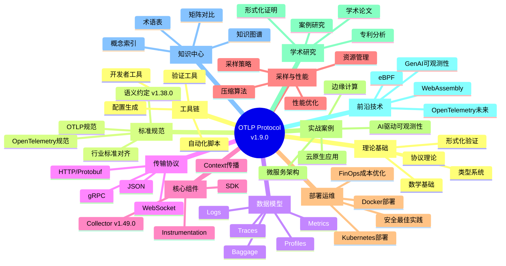
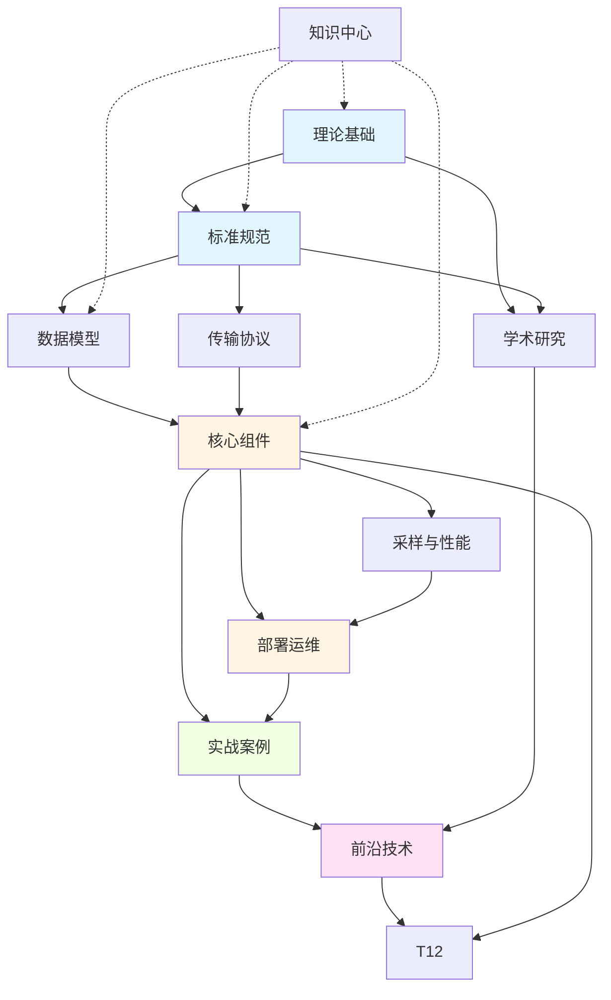

# OTLP 12主题总览思维导图

> **用途**: 12主题全景导航，快速定位知识领域
> **更新日期**: 2026年3月15日
> **对标版本**: OpenTelemetry最新稳定版

---

## 🗺️ 中心主题: OTLP Protocol v1.9.0



---

## 📊 主题分类矩阵

| 类别 | 主题 | 难度 | 前置依赖 |
|:---|:---|:---:|:---|
| **基础层** | T1 理论基础 | ⭐⭐⭐ | 无 |
| | T2 标准规范 | ⭐⭐ | T1 |
| **数据层** | T3 数据模型 | ⭐⭐ | T2 |
| | T4 传输协议 | ⭐⭐ | T2 |
| **实现层** | T5 核心组件 | ⭐⭐⭐ | T3, T4 |
| | T6 采样与性能 | ⭐⭐⭐ | T5 |
| **应用层** | T7 部署运维 | ⭐⭐ | T5, T6 |
| | T8 实战案例 | ⭐⭐ | T7 |
| **扩展层** | T9 学术研究 | ⭐⭐⭐⭐ | T1, T2 |
| | T10 前沿技术 | ⭐⭐⭐ | T5-T8 |
| **支撑层** | T11 知识中心 | ⭐ | 全局 |
| | T12 工具链 | ⭐⭐ | T5-T8 |

---

## 🎯 按角色推荐学习路径

### 初学者路径 (0-30天)

```
T11 知识中心 → T2 标准规范 → T3 数据模型 → T5 核心组件 → T8 实战案例
```

**目标**: 建立全局认知，能够完成基础埋点

### 开发者路径 (30-90天)

```
T1 理论基础 → T3 数据模型 → T5 核心组件 → T6 采样与性能 → T7 部署运维 → T8 实战案例
```

**目标**: 掌握完整技术栈，能够独立实施项目

### 架构师路径 (60-180天)

```
T1 理论基础 → T2 标准规范 → T5 核心组件 → T6 采样与性能 → T7 部署运维 → T10 前沿技术
```

**目标**: 设计企业级可观测性架构

### 研究人员路径 (持续)

```
T1 理论基础 → T2 标准规范 → T9 学术研究 → T10 前沿技术
```

**目标**: 深入理论，推动技术创新

---

## 🔗 主题间依赖关系



---

## 📈 主题深度分析

### 核心主题 (必须掌握)

| 主题 | 重要性 | 学习时长 | 产出物 |
|:---|:---:|:---:|:---|
| T3 数据模型 | ⭐⭐⭐⭐⭐ | 8h | 理解Traces/Metrics/Logs/Profiles |
| T5 核心组件 | ⭐⭐⭐⭐⭐ | 16h | 能配置SDK和Collector |
| T7 部署运维 | ⭐⭐⭐⭐ | 12h | 完成生产环境部署 |

### 进阶主题 (推荐掌握)

| 主题 | 重要性 | 学习时长 | 产出物 |
|:---|:---:|:---:|:---|
| T6 采样与性能 | ⭐⭐⭐⭐ | 10h | 优化成本和性能 |
| T8 实战案例 | ⭐⭐⭐⭐ | 12h | 解决实际问题 |
| T10 前沿技术 | ⭐⭐⭐ | 8h | 了解技术趋势 |

### 专业主题 (按需学习)

| 主题 | 重要性 | 学习时长 | 产出物 |
|:---|:---:|:---:|:---|
| T1 理论基础 | ⭐⭐⭐ | 20h | 深入理解原理 |
| T9 学术研究 | ⭐⭐ | 持续 | 学术论文/专利 |

---

## 🗂️ 主题内容速查

### T1 理论基础

- 数学基础：向量空间、图论、统计学
- 形式化验证：TLA+、Coq证明
- 类型系统：Protocol Buffers类型推导

### T2 标准规范

- OTLP协议规范 v1.9.0
- 语义约定 v1.38.0
- W3C Trace Context标准

### T3 数据模型

- Traces：Span、Link、Event、Status
- Metrics：Counter、Gauge、Histogram、Summary
- Logs：LogRecord、Severity
- Profiles：Sample、Location、Line

### T4 传输协议

- gRPC：高效二进制传输
- HTTP/Protobuf：RESTful风格
- JSON：调试和测试

### T5 核心组件

- SDK：API、SDK、Auto-instrumentation
- Collector：Receiver、Processor、Exporter
- Context：Propagation、Baggage

### T6 采样与性能

- 采样策略：Head-based、Tail-based、Probabilistic
- 压缩算法：GZIP、Snappy、Zstd
- 性能优化：Batch、Queue、Memory Pool

### T7 部署运维

- Docker：单机部署
- Kubernetes：Helm、Operator
- 安全：TLS、mTLS、RBAC
- FinOps：成本优化

### T8 实战案例

- 微服务：分布式追踪
- 云原生：K8s监控
- AI应用：LLM可观测性
- 边缘计算：IoT场景

### T9 学术研究

- 论文：分布式追踪、可观测性理论
- 证明：形式化验证、正确性证明
- 专利：技术创新

### T10 前沿技术

- eBPF：内核级可观测性
- GenAI：AI驱动可观测性
- Wasm：边缘计算

### T11 知识中心

- 概念索引：150+概念
- 知识图谱：30+图表
- 矩阵对比：50+矩阵

### T12 工具链

- 配置生成：otelgen、opentelemetry-operator
- 验证工具：otel-cli、debug exporter
- 自动化：CI/CD集成

---

## 💡 使用建议

### 1. 新用户快速开始

1. **第一步**: 浏览本思维导图，了解12主题全貌
2. **第二步**: 根据角色选择学习路径
3. **第三步**: 按顺序学习核心主题
4. **第四步**: 参考实战案例进行实践

### 2. 查缺补漏

- 使用Ctrl+F搜索关键词
- 参考主题依赖关系，补充前置知识
- 结合知识图谱深入理解概念关系

### 3. 持续学习

- 关注前沿技术主题更新
- 参与社区讨论和贡献
- 定期回顾和整理知识体系

---

**文档版本**: v1.0
**更新日期**: 2026年3月15日
**对标基准**: OpenTelemetry v1.49.0 / OTLP v1.9.0 / SC v1.38.0
