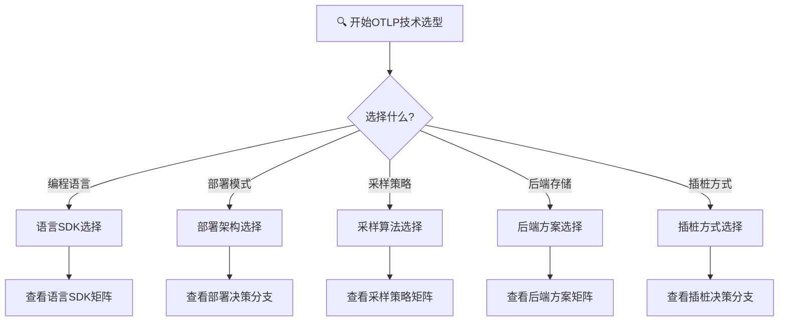
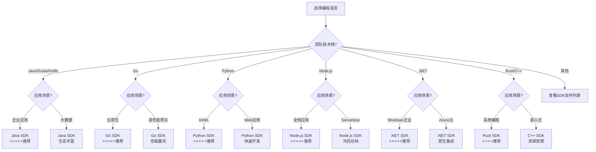
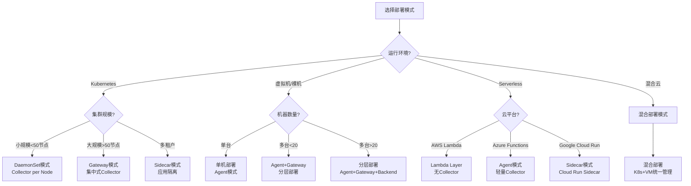
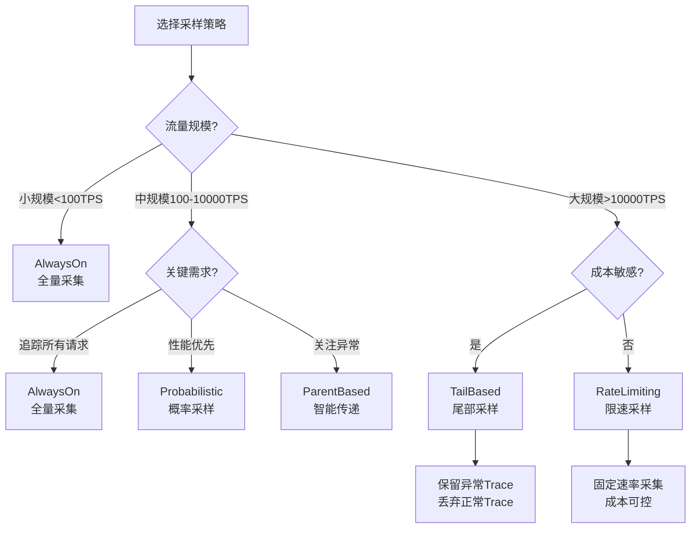
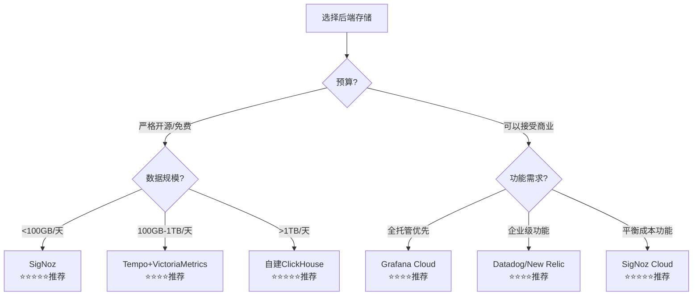
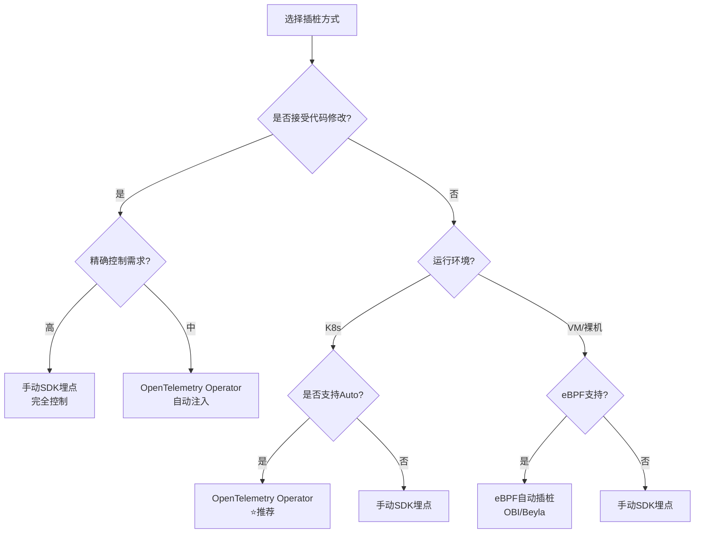
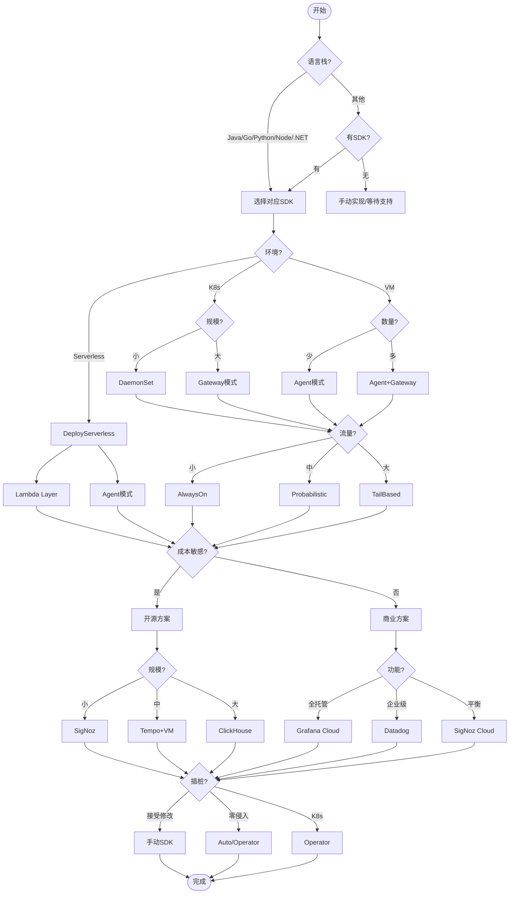

# OTLP 技术选型决策树

> **用途**: 系统化的技术选型决策支持
> **适用场景**: 架构设计、技术评估、方案选择
> **更新日期**: 2026年3月15日

---

## 🌳 顶层决策: OTLP技术栈选择



---

## 📋 决策分支1: 编程语言选择

### 问题: 使用什么编程语言?



### 语言选择速查表

| 语言 | 成熟度 | 性能 | 生态 | 推荐场景 |
|:---|:---:|:---:|:---:|:---|
| **Java** | ⭐⭐⭐⭐⭐ | ⭐⭐⭐⭐ | ⭐⭐⭐⭐⭐ | 企业应用、微服务 |
| **Go** | ⭐⭐⭐⭐⭐ | ⭐⭐⭐⭐⭐ | ⭐⭐⭐⭐ | 云原生、中间件 |
| **Python** | ⭐⭐⭐⭐⭐ | ⭐⭐⭐ | ⭐⭐⭐⭐⭐ | AI/ML、数据科学 |
| **Node.js** | ⭐⭐⭐⭐⭐ | ⭐⭐⭐⭐ | ⭐⭐⭐⭐⭐ | Web、Serverless |
| **.NET** | ⭐⭐⭐⭐⭐ | ⭐⭐⭐⭐ | ⭐⭐⭐⭐ | Windows、Azure |
| **Rust** | ⭐⭐⭐⭐ | ⭐⭐⭐⭐⭐ | ⭐⭐⭐ | 系统编程、安全 |

---

## 📋 决策分支2: 部署架构选择

### 问题: 选择什么部署模式?



### 部署模式对比

| 模式 | 适用场景 | 复杂度 | 成本 | 性能 |
|:---|:---|:---:|:---:|:---:|
| **DaemonSet** | K8s集群 | 中 | 中 | 高 |
| **Gateway** | 大规模集群 | 高 | 中 | 高 |
| **Sidecar** | 多租户/隔离 | 高 | 高 | 中 |
| **Agent** | 单机/VM | 低 | 低 | 中 |
| **Serverless** | FaaS | 低 | 按需 | 高 |

---

## 📋 决策分支3: 采样策略选择

### 问题: 选择什么采样策略?



### 采样策略速查

| 策略 | 适用场景 | 复杂度 | 效果 |
|:---|:---|:---:|:---:|
| **AlwaysOn** | 开发/测试/小规模 | 低 | 完整 |
| **AlwaysOff** | 关闭采集 | 低 | 无 |
| **Probabilistic** | 均匀采样 | 低 | 统计有效 |
| **RateLimiting** | 固定速率 | 中 | 成本可控 |
| **ParentBased** | 继承决策 | 中 | 追踪完整 |
| **TailBased** | 异常保留 | 高 | 精准 |

详细对比请参考 [采样策略对比矩阵](../03_多维矩阵/采样策略对比矩阵.md)

---

## 📋 决策分支4: 后端存储选择

### 问题: 选择什么后端存储?



### 后端方案速查

| 方案 | 类型 | 成本 | 扩展性 | 推荐度 |
|:---|:---:|:---:|:---:|:---:|
| **SigNoz** | 开源 | $ | ⭐⭐⭐⭐ | ⭐⭐⭐⭐⭐ |
| **Tempo** | 开源 | $ | ⭐⭐⭐⭐⭐ | ⭐⭐⭐⭐⭐ |
| **ClickHouse** | 开源 | $$ | ⭐⭐⭐⭐⭐ | ⭐⭐⭐⭐⭐ |
| **Grafana Cloud** | 商业 | $$ | ⭐⭐⭐⭐⭐ | ⭐⭐⭐⭐ |
| **Datadog** | 商业 | $$$ | ⭐⭐⭐⭐⭐ | ⭐⭐⭐⭐ |

详细对比请参考 [后端方案对比矩阵](../03_多维矩阵/后端方案对比矩阵.md)

---

## 📋 决策分支5: 插桩方式选择

### 问题: 选择什么插桩方式?



### 插桩方式对比

| 方式 | 代码侵入 | 精确度 | 适用场景 |
|:---|:---:|:---:|:---|
| **手动SDK** | 高 | ⭐⭐⭐⭐⭐ | 精确控制、复杂场景 |
| **Auto-instrumentation** | 无 | ⭐⭐⭐⭐ | 快速启动、标准框架 |
| **Operator自动注入** | 无 | ⭐⭐⭐⭐ | K8s环境、零侵入 |
| **eBPF** | 无 | ⭐⭐⭐ | 内核级、性能敏感 |

详细对比请参考 [插桩方式选择决策树](./插桩方式选择决策树.md)

---

## 🎯 综合决策流程

### 完整技术栈选型流程



---

## 📊 决策检查清单

### 选型前必查项

```yaml
语言选择:
  - [ ] 团队熟悉度评估
  - [ ] SDK成熟度检查
  - [ ] 生态覆盖度确认
  - [ ] 性能要求匹配

部署选择:
  - [ ] 环境类型确认 (K8s/VM/Serverless)
  - [ ] 规模评估 (节点数/流量)
  - [ ] 网络拓扑设计
  - [ ] 高可用需求确认

采样选择:
  - [ ] 流量规模估算
  - [ ] 成本预算确认
  - [ ] 关键Trace保留需求
  - [ ] 合规要求检查

后端选择:
  - [ ] 数据量预估 (GB/天)
  - [ ] 预算限制确认
  - [ ] 功能需求清单
  - [ ] 扩展性要求

插桩选择:
  - [ ] 代码修改接受度
  - [ ] 精确控制需求
  - [ ] 快速启动需求
  - [ ] 性能敏感程度
```

---

## 🔗 相关资源

- [语言SDK对比矩阵](../03_多维矩阵/语言SDK对比矩阵.md)
- [采样策略对比矩阵](../03_多维矩阵/采样策略对比矩阵.md)
- [后端方案对比矩阵](../03_多维矩阵/后端方案对比矩阵.md)
- [Collector组件矩阵](../03_多维矩阵/Collector组件矩阵.md)
- [插桩方式选择决策树](./插桩方式选择决策树.md)
- [故障排查决策树](./故障排查决策树.md)

---

**文档版本**: v1.0
**更新日期**: 2026年3月15日
**对标基准**: OpenTelemetry最新版本
