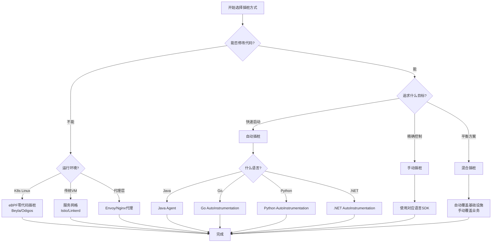

# 插桩方式选择决策树

> **用途**: 帮助用户选择最适合的插桩方式
> **适用场景**: 项目启动、技术选型
> **阅读方式**: 从根节点开始，根据条件选择分支

---

## 🌳 决策树全景图

```
开始: 如何选择插桩方式?
│
├─ 问题1: 是否可以修改代码?
│  │
│  ├─ ❌ 不能修改代码
│  │  │
│  │  ├─ 问题2: 是什么运行环境?
│  │  │  │
│  │  │  ├─ 🐧 Linux + K8s
│  │  │  │  └─ ✅ 推荐: eBPF零代码插桩 (OBI/Beyla)
│  │  │  │     理由: 无需代码修改，自动发现服务
│  │  │  │     工具: Beyla, Odigos, Pixie
│  │  │  │
│  │  │  └─ 🪟 Windows/VM
│  │  │     └─ ✅ 推荐: 服务网格/Istio
│  │  │        理由: 在网络层捕获流量
│  │  │        限制: 仅支持HTTP/gRPC
│  │  │
│  │  └─ ⚠️ 备选: 代理方式
│  │     └─ Nginx/Envoy代理层插桩
│  │
│  └─ ✅ 可以修改代码
│     │
│     ├─ 问题3: 追求什么目标?
│     │  │
│     │  ├─ 🚀 快速启动，全面覆盖
│     │  │  └─ ✅ 推荐: 自动插桩
│     │  │     适用: 主流框架和库
│     │  │     优势: 零代码/少代码
│     │  │     语言: Java, Python, Node.js, .NET, Go
│     │  │
│     │  ├─ 🎯 精确控制，业务深度
│     │  │  └─ ✅ 推荐: 手动插桩
│     │  │     适用: 关键业务路径
│     │  │     优势: 完全控制，业务上下文
│     │  │     投入: 需要开发时间
│     │  │
│     │  └─ ⚖️ 平衡方案
│     │     └─ ✅ 推荐: 自动+手动混合
│     │        策略: 自动覆盖基础设施，手动覆盖业务
│     │
│     └─ 问题4: 使用什么语言?
│        │
│        ├─ ☕ Java/Kotlin
│        │  ├─ 自动: Java Agent (推荐)
│        │  ├─ 手动: OpenTelemetry Java SDK
│        │  └─ 框架: Spring Boot Starter
│        │
│        ├─ 🐹 Go
│        │  ├─ 自动: eBPF (推荐)
│        │  ├─ 自动: runtime/metrics
│        │  └─ 手动: OpenTelemetry Go SDK
│        │
│        ├─ 🐍 Python
│        │  ├─ 自动: opentelemetry-instrument (推荐)
│        │  └─ 手动: OpenTelemetry Python SDK
│        │
│        ├─ 🟨 JavaScript/TypeScript
│        │  ├─ 自动: @opentelemetry/auto-instrumentations-node (推荐)
│        │  ├─ 自动: 浏览器RUM
│        │  └─ 手动: OpenTelemetry JS SDK
│        │
│        ├─ 🔵 .NET
│        │  ├─ 自动: OpenTelemetry .NET AutoInstrumentation (推荐)
│        │  └─ 手动: OpenTelemetry .NET SDK
│        │
│        ├─ ⚙️ Rust
│        │  └─ 手动: OpenTelemetry Rust SDK (主要方式)
│        │
│        └─ 🦀 其他语言 (C++, PHP, Ruby, Erlang)
│           └─ 手动: 对应语言SDK
│
└─ 📊 对比总结
```

---

## 📋 详细决策矩阵

### 第一层决策: 代码修改权限

| 条件 | 选择 | 原因 |
|:---|:---:|:---|
| **不能修改代码** | eBPF/服务网格/代理 | 在基础设施层插桩 |
| **可以修改代码** | 自动/手动/混合插桩 | 在应用层插桩，信息更丰富 |

### 第二层决策: 运行环境 (不能修改代码时)

| 环境 | 推荐方案 | 工具 | 限制 |
|:---|:---:|:---:|:---|
| **Linux + K8s** | eBPF零代码 | Beyla, Odigos, OBI | 需要privileged权限 |
| **传统VM** | 服务网格 | Istio, Linkerd | 仅HTTP/gRPC |
| **多语言混合** | 代理层 | Nginx, Envoy | 需要配置代理 |

### 第三层决策: 目标优先级 (可以修改代码时)

| 目标 | 推荐方案 | 投入 | 效果 |
|:---|:---:|:---:|:---:|
| **快速启动** | 自动插桩 | 低 | 80%覆盖 |
| **精确控制** | 手动插桩 | 高 | 100%定制 |
| **平衡方案** | 混合插桩 | 中 | 90%覆盖+关键定制 |

### 第四层决策: 语言特定建议

| 语言 | 首选自动插桩 | 首选手动插桩 | 备注 |
|:---|:---:|:---:|:---|
| **Java** | Java Agent | OTel Java SDK | Spring Boot有Starter |
| **Go** | eBPF | OTel Go SDK | eBPF对Go支持好 |
| **Python** | opentelemetry-instrument | OTel Python SDK | 装饰器模式 |
| **Node.js** | auto-instrumentations | OTel JS SDK | 多种加载方式 |
| **.NET** | .NET AutoInstrumentation | OTel .NET SDK | CLR Profiler |
| **Rust** | 不支持 | OTel Rust SDK | 主要手动方式 |

---

## 🎯 典型场景决策路径

### 场景1: 遗留Java系统，无法修改代码

```
不能修改代码
    ↓
Linux环境
    ↓
✅ 选择: eBPF零代码插桩 (Beyla)

原因:
- 无需重启应用
- 自动发现JVM进程
- 支持HTTP/JDBC/Redis
- 生产安全
```

### 场景2: 新Spring Boot微服务

```
可以修改代码
    ↓
追求快速启动
    ↓
Java语言
    ↓
✅ 选择: Spring Boot Starter + Java Agent混合

配置:
- Spring Boot Starter提供自动配置
- 手动插桩关键业务方法
- 自定义业务属性
```

### 场景3: Python Flask应用，需要深度定制

```
可以修改代码
    ↓
追求精确控制
    ↓
Python语言
    ↓
✅ 选择: 手动插桩

实现:
- 使用Flask中间件自动追踪请求
- 手动插桩关键函数
- 添加业务上下文属性
```

### 场景4: 多语言微服务集群 (K8s)

```
混合情况
    ↓
✅ 选择: 分层插桩策略

策略:
- K8s层: OpenTelemetry Operator自动注入
- 基础设施层: eBPF捕获网络流量
- 应用层: 各服务根据需要手动插桩
- Service Mesh: Istio提供网络层追踪
```

---

## ⚖️ 决策权衡因素

### 性能 vs 精度

```
高性能要求 (低延迟)
    ↓
避免: 高频手动插桩
选择: 自动插桩 + 尾采样

高精度要求 (全链路)
    ↓
避免: 纯eBPF(缺少业务上下文)
选择: 手动插桩关键路径
```

### 投入 vs 产出

```
快速上线 (1周内)
    ↓
自动插桩 → 80%覆盖
后续逐步手动优化

长期项目 (3个月+)
    ↓
混合插桩 → 自动+手动
关键路径深度定制
```

### 维护成本

| 方案 | 初始投入 | 维护成本 | 扩展性 |
|:---|:---:|:---:|:---:|
| **自动插桩** | 低 | 低 | 高 |
| **手动插桩** | 高 | 中 | 中 |
| **eBPF** | 低 | 低 | 中 |
| **混合插桩** | 中 | 中 | 高 |

---

## 🚀 决策工具

### 快速选择清单

```yaml
检查项:
  - [ ] 能否修改代码?
    - 否 → 选择eBPF或服务网格
    - 是 → 继续

  - [ ] 目标是什么?
    - 快速可见性 → 自动插桩
    - 深度洞察 → 手动插桩
    - 两者都要 → 混合插桩

  - [ ] 什么语言?
    - Java → Spring Boot Starter
    - Go/Python/Node → 自动插桩Agent
    - Rust/C++ → 手动插桩

  - [ ] 运行环境?
    - K8s → 使用Operator
    - VM → 使用Agent
    - Serverless → 使用SDK
```

### 决策流程图 (Mermaid)



---

## 📚 相关文档

- [自动插桩指南](../../docs/04_核心组件/03_SDK最佳实践.md)
- [手动插桩指南](../../docs/04_核心组件/01_SDK概述.md)
- [eBPF插桩指南](../../docs/15_eBPF自动插桩/01_OBI_2026路线图.md)

---

**文档版本**: v1.0
**更新日期**: 2026年3月15日
**维护者**: OTLP项目团队
