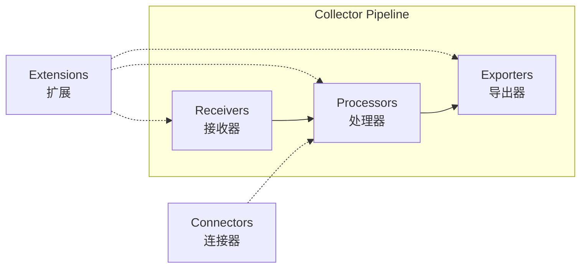

# Collector组件矩阵

> **用途**: OTLP Collector生态组件多维度对比
> **适用场景**: Collector配置、组件选型
> **更新日期**: 2026年3月15日
> **对标版本**: OpenTelemetry Collector v1.49.0

---

## 📊 组件总览

### 三大核心组件类型



---

## 🔌 Receiver矩阵

### 协议支持对比

| Receiver | OTLP/gRPC | OTLP/HTTP | Jaeger | Zipkin | Prometheus | 状态 |
|:---|:---:|:---:|:---:|:---:|:---:|:---:|
| **otlp** | ✅ | ✅ | ❌ | ❌ | ❌ | Stable |
| **jaeger** | ❌ | ❌ | ✅ | ❌ | ❌ | Stable |
| **zipkin** | ❌ | ❌ | ❌ | ✅ | ❌ | Stable |
| **prometheus** | ❌ | ❌ | ❌ | ❌ | ✅ | Stable |
| **opencensus** | ❌ | ❌ | ⚠️ | ❌ | ❌ | Deprecated |
| **kafka** | ✅* | ✅* | ✅* | ✅* | ✅* | Beta |
| **filelog** | ❌ | ❌ | ❌ | ❌ | ❌ | Beta |

*通过数据转换支持

### 性能对比

| Receiver | 吞吐量 | CPU使用 | 内存使用 | 延迟 |
|:---|:---:|:---:|:---:|:---:|
| **otlp** | ⭐⭐⭐⭐⭐ | 低 | 低 | <1ms |
| **jaeger** | ⭐⭐⭐⭐ | 中 | 中 | <5ms |
| **zipkin** | ⭐⭐⭐⭐ | 中 | 中 | <5ms |
| **prometheus** | ⭐⭐⭐ | 中 | 高 | <10ms |
| **kafka** | ⭐⭐⭐⭐⭐ | 中 | 高 | 依赖网络 |

---

## ⚙️ Processor矩阵

### 功能对比

| Processor | 过滤 | 丰富 | 转换 | 采样 | 聚合 | 状态 |
|:---|:---:|:---:|:---:|:---:|:---:|:---:|
| **batch** | ❌ | ❌ | ❌ | ❌ | ✅ | Stable |
| **memory_limiter** | ✅ | ❌ | ❌ | ❌ | ❌ | Stable |
| **resource** | ❌ | ✅ | ❌ | ❌ | ❌ | Stable |
| **attributes** | ❌ | ✅ | ✅ | ❌ | ❌ | Stable |
| **spanmetrics** | ❌ | ❌ | ❌ | ❌ | ✅ | Beta |
| **filter** | ✅ | ❌ | ❌ | ❌ | ❌ | Beta |
| **probabilistic_sampler** | ❌ | ❌ | ❌ | ✅ | ❌ | Stable |
| **tail_sampling** | ❌ | ❌ | ❌ | ✅ | ❌ | Beta |
| **routing** | ✅ | ❌ | ❌ | ❌ | ❌ | Beta |
| **transform** | ❌ | ❌ | ✅ | ❌ | ❌ | Beta |

### 性能影响

| Processor | 开销 | 延迟增加 | 内存使用 | 推荐使用 |
|:---|:---:|:---:|:---:|:---:|
| **batch** | 极低 | 配置相关 | 配置相关 | ⭐⭐⭐⭐⭐ |
| **memory_limiter** | 极低 | 无 | 极小 | ⭐⭐⭐⭐⭐ |
| **resource** | 极低 | 无 | 极小 | ⭐⭐⭐⭐⭐ |
| **attributes** | 低 | <1ms | 小 | ⭐⭐⭐⭐ |
| **probabilistic_sampler** | 极低 | 无 | 无 | ⭐⭐⭐⭐⭐ |
| **tail_sampling** | 高 | 高 | 高 | ⭐⭐⭐ |
| **spanmetrics** | 中 | 中 | 中 | ⭐⭐⭐⭐ |
| **transform** | 中 | <5ms | 小 | ⭐⭐⭐ |

---

## 📤 Exporter矩阵

### 后端支持

| Exporter | OTLP | Jaeger | Zipkin | Prometheus | Cloud | 状态 |
|:---|:---:|:---:|:---:|:---:|:---:|:---:|
| **otlp** | ✅ | ❌ | ❌ | ❌ | ❌ | Stable |
| **otlphttp** | ✅ | ❌ | ❌ | ❌ | ❌ | Stable |
| **jaeger** | ❌ | ✅ | ❌ | ❌ | ❌ | Deprecated |
| **jaeger_thrift** | ❌ | ✅ | ❌ | ❌ | ❌ | Deprecated |
| **zipkin** | ❌ | ❌ | ✅ | ❌ | ❌ | Stable |
| **prometheusremotewrite** | ❌ | ❌ | ❌ | ✅ | ❌ | Stable |
| **prometheus** | ❌ | ❌ | ❌ | ✅ | ❌ | Beta |
| **logging** | ❌ | ❌ | ❌ | ❌ | ❌ | Stable |
| **debug** | ❌ | ❌ | ❌ | ❌ | ❌ | Stable |
| **kafka** | ✅* | ✅* | ✅* | ✅* | ❌ | Beta |
| **file** | ✅* | ✅* | ✅* | ✅* | ❌ | Beta |

### 云厂商支持

| Exporter | AWS | Azure | GCP | Alibaba | 状态 |
|:---|:---:|:---:|:---:|:---:|:---:|
| **awsxray** | ✅ | ❌ | ❌ | ❌ | Beta |
| **awsemf** | ✅ | ❌ | ❌ | ❌ | Beta |
| **azuremonitor** | ❌ | ✅ | ❌ | ❌ | Beta |
| **googlecloud** | ❌ | ❌ | ✅ | ❌ | Beta |
| **googlemanagedprometheus** | ❌ | ❌ | ✅ | ❌ | Beta |
| **alibaba_cloud_logservice** | ❌ | ❌ | ❌ | ✅ | Beta |

### 性能对比

| Exporter | 吞吐量 | 重试机制 | 批处理 | 压缩 | 推荐度 |
|:---|:---:|:---:|:---:|:---:|:---:|
| **otlp** | ⭐⭐⭐⭐⭐ | ✅ | ✅ | ✅ | ⭐⭐⭐⭐⭐ |
| **otlphttp** | ⭐⭐⭐⭐⭐ | ✅ | ✅ | ✅ | ⭐⭐⭐⭐⭐ |
| **prometheusremotewrite** | ⭐⭐⭐⭐ | ✅ | ✅ | ✅ | ⭐⭐⭐⭐ |
| **kafka** | ⭐⭐⭐⭐⭐ | ✅ | ✅ | ✅ | ⭐⭐⭐⭐ |
| **logging** | ⭐ | ❌ | ❌ | ❌ | ⭐⭐ |
| **debug** | ⭐ | ❌ | ❌ | ❌ | ⭐⭐ |

---

## 🔧 Extension矩阵

### 功能分类

| Extension | 健康检查 | 性能分析 | 配置管理 | 安全 | 状态 |
|:---|:---:|:---:|:---:|:---:|:---:|
| **health_check** | ✅ | ❌ | ❌ | ❌ | Stable |
| **pprof** | ❌ | ✅ | ❌ | ❌ | Beta |
| **zpages** | ✅ | ✅ | ❌ | ❌ | Beta |
| **memory_ballast** | ❌ | ✅ | ❌ | ❌ | Stable |
| **bearertokenauth** | ❌ | ❌ | ❌ | ✅ | Beta |
| **basicauth** | ❌ | ❌ | ❌ | ✅ | Beta |
| **oidcauth** | ❌ | ❌ | ❌ | ✅ | Beta |
| **file_storage** | ❌ | ❌ | ✅ | ❌ | Beta |

---

## 🔗 Connector矩阵

### Pipeline连接

| Connector | 输入 | 输出 | 状态 |
|:---|:---:|:---:|:---:|
| **forward** | All | All | Stable |
| **otlpjsonfile** | Traces | Logs | Beta |
| **spanmetrics** | Traces | Metrics | Beta |
| **servicegraph** | Traces | Metrics | Beta |

---

## 📊 组件选型推荐

### 按使用场景推荐

#### 场景1: 标准OTLP收集

```yaml
receivers:
  - otlp  # 标准OTLP接收

processors:
  - batch  # 批处理
  - memory_limiter  # 内存保护

exporters:
  - otlp  # 标准OTLP导出
```

#### 场景2: 多后端分发

```yaml
receivers:
  - otlp

processors:
  - resource  # 添加资源属性
  - batch

exporters:
  - otlp  # 主后端
  - prometheusremotewrite  # 指标后端
  - logging  # 调试输出
```

#### 场景3: 高流量场景

```yaml
receivers:
  - otlp

processors:
  - memory_limiter  # 内存保护
  - probabilistic_sampler  # 概率采样
  - batch:
      timeout: 1s
      send_batch_size: 1024

exporters:
  - otlp:
      retry_on_failure:
        enabled: true
```

#### 场景4: 尾部采样场景

```yaml
receivers:
  - otlp

processors:
  - tail_sampling:  # 尾部采样
      decision_wait: 10s
      policies:
        - name: errors
          type: status_code
          status_code: {status_codes: [ERROR]}

exporters:
  - otlp
```

---

## 🎯 组件使用检查清单

### Receiver选择

- [ ] 确认客户端支持的协议
- [ ] 评估吞吐量需求
- [ ] 检查安全认证要求
- [ ] 验证网络可达性

### Processor配置

- [ ] 添加memory_limiter防止OOM
- [ ] 配置batch提高吞吐
- [ ] 评估采样需求
- [ ] 检查processor顺序

### Exporter配置

- [ ] 配置重试和超时
- [ ] 启用压缩减少带宽
- [ ] 配置批处理参数
- [ ] 设置队列大小

### Extension配置

- [ ] 启用health_check监控
- [ ] 配置pprof性能分析（开发环境）
- [ ] 添加认证extension（生产环境）

---

## 📈 性能优化建议

### Receiver优化

| 优化项 | 建议 | 效果 |
|:---|:---|:---:|
| 并发连接 | 根据客户端数量调整 | +20% |
| 缓冲区大小 | 增大接收缓冲区 | +15% |
| 协议选择 | 优先使用gRPC | +30% |

### Processor优化

| 优化项 | 建议 | 效果 |
|:---|:---|:---:|
| Batch大小 | 100-1000 spans | +40% |
| Batch超时 | 1-5秒 | +25% |
| 采样策略 | 使用概率采样 | -80% 成本 |
| Processor顺序 | filter -> batch -> enrich | +10% |

### Exporter优化

| 优化项 | 建议 | 效果 |
|:---|:---|:---:|
| 队列大小 | 根据内存调整 | 稳定性 |
| 重试策略 | 指数退避 | 可靠性 |
| 并发请求 | 4-8个并发 | +50% |
| 压缩算法 | 使用gzip/zstd | -70% 带宽 |

---

## 🔗 相关资源

- [Collector官方文档](https://opentelemetry.io/docs/collector/)
- [Collector GitHub](https://github.com/open-telemetry/opentelemetry-collector)
- [Contrib Collector](https://github.com/open-telemetry/opentelemetry-collector-contrib)

---

**矩阵版本**: v1.0
**更新日期**: 2026年3月15日
**数据基准**: OpenTelemetry Collector v1.49.0
