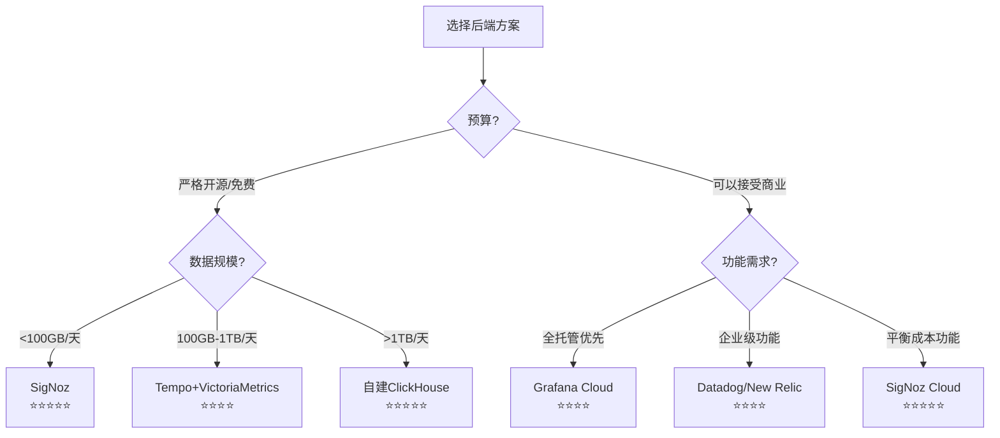

# 后端方案对比矩阵

> **用途**: 对比开源和商业后端方案
> **更新日期**: 2026年3月15日
> **对标范围**: 主流OTLP兼容后端

---

## 📊 综合评估矩阵

| 维度 | Jaeger | Tempo | Zipkin | Prometheus | VictoriaMetrics | ClickHouse |
|:---:|:---:|:---:|:---:|:---:|:---:|:---:|
| **OTLP原生** | ⭐⭐⭐⭐ | ⭐⭐⭐⭐⭐ | ⭐⭐⭐ | ⭐⭐ | ⭐⭐⭐ | ⭐⭐⭐⭐ |
| **Traces** | ⭐⭐⭐⭐⭐ | ⭐⭐⭐⭐⭐ | ⭐⭐⭐⭐ | ⭐ | ⭐ | ⭐⭐⭐⭐ |
| **Metrics** | ⭐ | ⭐ | ⭐ | ⭐⭐⭐⭐⭐ | ⭐⭐⭐⭐⭐ | ⭐⭐⭐⭐ |
| **Logs** | ⭐ | ⭐⭐ | ⭐ | ⭐⭐ | ⭐⭐⭐ | ⭐⭐⭐⭐⭐ |
| **存储成本** | ⭐⭐⭐ | ⭐⭐⭐⭐ | ⭐⭐⭐ | ⭐⭐⭐⭐ | ⭐⭐⭐⭐⭐ | ⭐⭐⭐⭐⭐ |
| **查询性能** | ⭐⭐⭐⭐ | ⭐⭐⭐⭐ | ⭐⭐⭐ | ⭐⭐⭐⭐ | ⭐⭐⭐⭐⭐ | ⭐⭐⭐⭐⭐ |
| **扩展性** | ⭐⭐⭐⭐ | ⭐⭐⭐⭐⭐ | ⭐⭐⭐ | ⭐⭐⭐⭐ | ⭐⭐⭐⭐⭐ | ⭐⭐⭐⭐⭐ |
| **易用性** | ⭐⭐⭐⭐⭐ | ⭐⭐⭐⭐ | ⭐⭐⭐⭐⭐ | ⭐⭐⭐ | ⭐⭐⭐ | ⭐⭐⭐ |

---

## 🔍 详细特性矩阵

### 1. 信号支持

| 后端 | Traces | Metrics | Logs | Profiles | OTLP Ingestion |
|:---|:---:|:---:|:---:|:---:|:---:|
| **Jaeger** | ✅ 完整 | ❌ 不支持 | ❌ 不支持 | ❌ 不支持 | gRPC/HTTP |
| **Tempo** | ✅ 完整 | ⚠️ 有限 | ⚠️ 有限 | ❌ 不支持 | gRPC/HTTP |
| **Zipkin** | ✅ 完整 | ❌ 不支持 | ❌ 不支持 | ❌ 不支持 | HTTP only |
| **Prometheus** | ❌ 不支持 | ✅ 完整 | ❌ 不支持 | ❌ 不支持 | 实验性 |
| **VictoriaMetrics** | ❌ 不支持 | ✅ 完整 | ⚠️ 有限 | ❌ 不支持 | HTTP |
| **ClickHouse** | ✅ 完整 | ✅ 完整 | ✅ 完整 | ❌ 不支持 | HTTP |
| **Grafana Cloud** | ✅ 完整 | ✅ 完整 | ✅ 完整 | ⚠️ 部分 | gRPC/HTTP |
| **Datadog** | ✅ 完整 | ✅ 完整 | ✅ 完整 | ✅ 完整 | gRPC/HTTP |

### 2. 存储特性

| 后端 | 存储引擎 | 存储格式 | 压缩率 |  retention | 分层存储 |
|:---|:---|:---:|:---:|:---:|:---:|
| **Jaeger** | Cassandra/ES/Badger | JSON/Proto | 中 | 配置 | ❌ |
| **Tempo** | S3/GCS/Azure/Local | Parquet | 高 | 配置 | ✅ |
| **Zipkin** | MySQL/ES/Cassandra | JSON | 低 | 配置 | ❌ |
| **Prometheus** | TSDB | 自定义 | 中 | 配置 | ⚠️ |
| **VictoriaMetrics** | 自定义 | 自定义 | 高 | 配置 | ⚠️ |
| **ClickHouse** | MergeTree | 列式 | 极高 | 配置 | ✅ |
| **SigNoz** | ClickHouse | 列式 | 极高 | 配置 | ✅ |

### 3. 查询能力

| 后端 | TraceID查询 | 标签搜索 | 全文搜索 | 聚合分析 | SQL支持 |
|:---|:---:|:---:|:---:|:---:|:---:|
| **Jaeger** | ✅ | ✅ | ❌ | 基础 | TraceQL |
| **Tempo** | ✅ | ✅ | ⚠️ | 基础 | TraceQL |
| **Zipkin** | ✅ | ✅ | ❌ | 基础 | 否 |
| **Prometheus** | ❌ | ✅ | ❌ | 强大 | PromQL |
| **VictoriaMetrics** | ❌ | ✅ | ❌ | 强大 | MetricsQL |
| **ClickHouse** | ✅ | ✅ | ✅ | 强大 | 完整SQL |
| **Grafana Cloud** | ✅ | ✅ | ✅ | 强大 | LogQL/TraceQL |

---

## 💰 成本效益矩阵

### 开源方案成本对比 (月100TB数据)

| 后端 | 存储成本 | 计算成本 | 运维成本 | 总成本估算 | 成本评分 |
|:---|:---:|:---:|:---:|:---:|:---:|
| **Jaeger+ES** | $$$ | $$ | $$ | 高 | ⭐⭐ |
| **Tempo+S3** | $ | $ | $ | 低 | ⭐⭐⭐⭐⭐ |
| **VictoriaMetrics** | $$ | $ | $ | 中低 | ⭐⭐⭐⭐ |
| **ClickHouse** | $ | $$ | $$ | 中 | ⭐⭐⭐⭐ |
| **SigNoz** | $ | $ | $ | 低 | ⭐⭐⭐⭐⭐ |

### 商业方案成本对比

| 后端 | 定价模式 | 免费额度 | 中等规模(100GB/天) | 大规模(1TB/天) | 性价比 |
|:---|:---|:---:|:---:|:---:|:---:|
| **Grafana Cloud** | 数据量+用户 | 50GB/月 | $$ | $$$$ | ⭐⭐⭐ |
| **Datadog** | 数据量+主机 | 有限 | $$$ | $$$$$ | ⭐⭐ |
| **New Relic** | 数据量 | 100GB/月 | $$ | $$$ | ⭐⭐⭐ |
| **Honeycomb** | 事件数 | 2000万/月 | $$ | $$$ | ⭐⭐⭐ |
| **SigNoz Cloud** | 数据量 | 15GB/天 | $ | $$ | ⭐⭐⭐⭐⭐ |

---

## ⚡ 性能对比矩阵

### 写入性能 (单节点)

| 后端 | Spans/秒 | 延迟P99 | CPU使用 | 内存使用 |
|:---|:---:|:---:|:---:|:---:|
| **Jaeger** | 10K-50K | 10ms | 中 | 中 |
| **Tempo** | 100K+ | 5ms | 低 | 低 |
| **VictoriaMetrics** | 500K+ | 2ms | 低 | 低 |
| **ClickHouse** | 1M+ | 5ms | 中 | 高 |
| **SigNoz** | 100K+ | 10ms | 中 | 中 |

### 查询性能

| 后端 | TraceID查询 | 标签过滤 | 时间范围扫描 | 聚合查询 |
|:---|:---:|:---:|:---:|:---:|
| **Jaeger** | <100ms | <1s | <5s | <10s |
| **Tempo** | <50ms | <500ms | <3s | <5s |
| **VictoriaMetrics** | N/A | <100ms | <1s | <2s |
| **ClickHouse** | <100ms | <500ms | <2s | <3s |

---

## 🎯 场景推荐矩阵

### 按团队规模

| 团队规模 | 推荐方案 | 原因 |
|:---|:---:|:---|
| **个人/小团队** | SigNoz / Jaeger | 免费、易部署 |
| **中型企业** | Tempo+Grafana / VictoriaMetrics | 可扩展、成本可控 |
| **大型企业** | ClickHouse/Grafana Cloud / Datadog | 全功能、高可用 |
| **SaaS提供商** | 自建ClickHouse/Tempo | 多租户、成本控制 |

### 按使用场景

| 场景 | 推荐方案 | 备选方案 | 不推荐 |
|:---|:---:|:---:|:---:|
| **纯Trace分析** | Jaeger/Tempo | SigNoz | Prometheus |
| **纯Metrics监控** | VictoriaMetrics | Prometheus | Jaeger |
| **统一可观测性** | Grafana Stack | SigNoz | 单一后端 |
| **成本敏感** | SigNoz/Tempo | VictoriaMetrics | Datadog |
| **高性能要求** | ClickHouse | VictoriaMetrics | Jaeger+ES |
| **快速上手** | Grafana Cloud | SigNoz Cloud | 自建复杂方案 |

---

## 🔧 部署复杂度矩阵

| 后端 | Kubernetes部署 | 单机部署 | 高可用部署 | 运维复杂度 |
|:---|:---:|:---:|:---:|:---:|
| **Jaeger** | Helm/Operator | 简单 | 中等 | 中等 |
| **Tempo** | Helm/Operator | 简单 | 简单 | 低 |
| **VictoriaMetrics** | Helm | 简单 | 中等 | 低 |
| **ClickHouse** | Operator | 复杂 | 复杂 | 高 |
| **SigNoz** | Helm | 中等 | 中等 | 中等 |

---

## 📊 架构模式推荐

### 模式1: 轻量级 (适合初创)

```
App → OTel SDK → Collector → Tempo (单节点)
                          → Prometheus (单节点)
                          → Loki (单节点)

可视化: Grafana (单机Docker)
成本: $50-100/月
容量: <100GB/天
```

### 模式2: 企业级 (适合中型企业)

```
App → OTel SDK → Collector (Gateway) → Tempo (S3后端)
                                    → VictoriaMetrics Cluster
                                    → ClickHouse (Logs)

可视化: Grafana Enterprise
成本: $500-2000/月
容量: <1TB/天
```

### 模式3: 超大规模 (适合大型企业)

```
App → OTel SDK → Collector (多层) → Kafka → ClickHouse (统一存储)
                                               ↓
                                          实时分析/告警

可视化: Grafana Enterprise + 自定义看板
成本: $5000+/月
容量: >10TB/天
```

---

## 📈 选型决策流程图



---

**矩阵版本**: v1.0
**更新日期**: 2026年3月15日
**数据基准**: 各后端官方文档及社区基准测试
