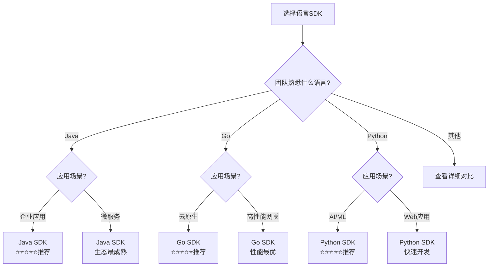

# 语言SDK对比矩阵

> **用途**: 多维度对比各语言SDK特性
> **更新日期**: 2026年3月15日
> **对标版本**: OpenTelemetry最新稳定版

---

## 📊 综合对比矩阵

| 维度 | Java | Go | Python | Node.js | .NET | Rust |
|:---:|:---:|:---:|:---:|:---:|:---:|:---:|
| **稳定性** | ⭐⭐⭐⭐⭐ | ⭐⭐⭐⭐⭐ | ⭐⭐⭐⭐⭐ | ⭐⭐⭐⭐⭐ | ⭐⭐⭐⭐⭐ | ⭐⭐⭐⭐ |
| **自动插桩** | ⭐⭐⭐⭐⭐ | ⭐⭐⭐⭐ | ⭐⭐⭐⭐⭐ | ⭐⭐⭐⭐⭐ | ⭐⭐⭐⭐⭐ | ⭐⭐ |
| **生态覆盖** | ⭐⭐⭐⭐⭐ | ⭐⭐⭐⭐ | ⭐⭐⭐⭐⭐ | ⭐⭐⭐⭐⭐ | ⭐⭐⭐⭐ | ⭐⭐⭐ |
| **性能** | ⭐⭐⭐⭐ | ⭐⭐⭐⭐⭐ | ⭐⭐⭐⭐ | ⭐⭐⭐⭐ | ⭐⭐⭐⭐ | ⭐⭐⭐⭐⭐ |
| **易用性** | ⭐⭐⭐⭐⭐ | ⭐⭐⭐⭐ | ⭐⭐⭐⭐⭐ | ⭐⭐⭐⭐⭐ | ⭐⭐⭐⭐⭐ | ⭐⭐⭐ |
| **社区活跃度** | ⭐⭐⭐⭐⭐ | ⭐⭐⭐⭐⭐ | ⭐⭐⭐⭐⭐ | ⭐⭐⭐⭐ | ⭐⭐⭐⭐ | ⭐⭐⭐ |

---

## 🔍 详细特性矩阵

### 1. 自动插桩支持

| 语言 | Java Agent | eBPF | 框架自动插桩 | 零代码 | 成熟度 |
|:---|:---:|:---:|:---:|:---:|:---:|
| **Java** | ✅ 优秀 | ⚠️ 一般 | Spring, Jakarta | 完全支持 | 生产级 |
| **Go** | ❌ 不支持 | ✅ 优秀 | 运行时探查 | 部分支持 | 生产级 |
| **Python** | ✅ 优秀 | ❌ 不支持 | Django, Flask, FastAPI | 完全支持 | 生产级 |
| **Node.js** | ✅ 优秀 | ❌ 不支持 | Express, NestJS | 完全支持 | 生产级 |
| **.NET** | ✅ 优秀 | ⚠️ 一般 | ASP.NET Core | 完全支持 | 生产级 |
| **Rust** | ❌ 不支持 | ⚠️ 一般 | 有限 | 不支持 | 开发中 |

### 2. 信号支持完整度

| 信号 | Java | Go | Python | Node.js | .NET | Rust |
|:---|:---:|:---:|:---:|:---:|:---:|:---:|
| **Traces** | ✅ 完整 | ✅ 完整 | ✅ 完整 | ✅ 完整 | ✅ 完整 | ✅ 完整 |
| **Metrics** | ✅ 完整 | ✅ 完整 | ✅ 完整 | ✅ 完整 | ✅ 完整 | ⚠️ 部分 |
| **Logs** | ✅ 完整 | ✅ 完整 | ✅ 完整 | ✅ 完整 | ✅ 完整 | ⚠️ 部分 |
| **Baggage** | ✅ 完整 | ✅ 完整 | ✅ 完整 | ✅ 完整 | ✅ 完整 | ⚠️ 部分 |
| **Profiles** | ⚠️ 实验 | ⚠️ 实验 | ⚠️ 实验 | ❌ 不支持 | ❌ 不支持 | ❌ 不支持 |

### 3. 框架支持覆盖

| 框架类型 | Java | Go | Python | Node.js | .NET |
|:---|:---:|:---:|:---:|:---:|:---:|
| **Web框架** | ★★★★★ | ★★★☆☆ | ★★★★★ | ★★★★★ | ★★★★★ |
| **数据库** | ★★★★★ | ★★★★☆ | ★★★★★ | ★★★★☆ | ★★★★☆ |
| **HTTP客户端** | ★★★★★ | ★★★★★ | ★★★★★ | ★★★★★ | ★★★★☆ |
| **消息队列** | ★★★★☆ | ★★★☆☆ | ★★★★☆ | ★★★☆☆ | ★★★☆☆ |
| **RPC框架** | ★★★★★ | ★★★★★ | ★★★☆☆ | ★★★☆☆ | ★★★★☆ |
| **云服务SDK** | ★★★★☆ | ★★★★☆ | ★★★★☆ | ★★★☆☆ | ★★★★★ |

---

## ⚡ 性能对比矩阵

### 基准测试数据 (近似值)

| 指标 | Java | Go | Python | Node.js | .NET | Rust |
|:---|:---:|:---:|:---:|:---:|:---:|:---:|
| **Span创建开销** | ~100ns | ~50ns | ~200ns | ~150ns | ~80ns | ~30ns |
| **Context传播开销** | ~50ns | ~20ns | ~100ns | ~80ns | ~40ns | ~15ns |
| **内存占用 (Agent)** | 50-100MB | 20-50MB | 30-60MB | 30-50MB | 40-80MB | 10-20MB |
| **CPU开销** | 1-3% | 0.5-2% | 2-5% | 1-3% | 1-3% | 0.1-1% |
| **导出吞吐量** | 高 | 高 | 中 | 中 | 高 | 高 |

### 性能优化特性

| 特性 | Java | Go | Python | Node.js | .NET | Rust |
|:---|:---:|:---:|:---:|:---:|:---:|:---:|
| **异步导出** | ✅ | ✅ | ✅ | ✅ | ✅ | ✅ |
| **批量处理** | ✅ | ✅ | ✅ | ✅ | ✅ | ✅ |
| **内存池** | ✅ | ✅ | ❌ | ❌ | ✅ | ✅ |
| **零分配路径** | ⚠️ | ✅ | ❌ | ❌ | ⚠️ | ✅ |
| **无锁数据结构** | ⚠️ | ✅ | ❌ | ⚠️ | ⚠️ | ✅ |

---

## 🛠️ 功能特性矩阵

### 采样策略支持

| 采样策略 | Java | Go | Python | Node.js | .NET | Rust |
|:---|:---:|:---:|:---:|:---:|:---:|:---:|
| **AlwaysOn** | ✅ | ✅ | ✅ | ✅ | ✅ | ✅ |
| **AlwaysOff** | ✅ | ✅ | ✅ | ✅ | ✅ | ✅ |
| **TraceIdRatio** | ✅ | ✅ | ✅ | ✅ | ✅ | ✅ |
| **ParentBased** | ✅ | ✅ | ✅ | ✅ | ✅ | ✅ |
| **Tail-based** | ✅ | ⚠️ | ⚠️ | ⚠️ | ✅ | ❌ |
| **Custom Sampler** | ✅ | ✅ | ✅ | ✅ | ✅ | ⚠️ |

### Propagator支持

| Propagator | Java | Go | Python | Node.js | .NET | Rust |
|:---|:---:|:---:|:---:|:---:|:---:|:---:|
| **W3C Trace Context** | ✅ | ✅ | ✅ | ✅ | ✅ | ✅ |
| **W3C Baggage** | ✅ | ✅ | ✅ | ✅ | ✅ | ✅ |
| **B3 Single** | ✅ | ✅ | ✅ | ✅ | ✅ | ⚠️ |
| **B3 Multi** | ✅ | ✅ | ✅ | ✅ | ✅ | ⚠️ |
| **Jaeger** | ✅ | ✅ | ✅ | ✅ | ✅ | ⚠️ |
| **OpenCensus** | ✅ | ⚠️ | ⚠️ | ⚠️ | ⚠️ | ❌ |
| **Custom** | ✅ | ✅ | ✅ | ✅ | ✅ | ⚠️ |

---

## 🚀 生产就绪度评估

### 企业级特性

| 特性 | Java | Go | Python | Node.js | .NET | Rust |
|:---|:---:|:---:|:---:|:---:|:---:|:---:|
| **高可用部署** | ✅ 成熟 | ✅ 成熟 | ✅ 成熟 | ✅ 成熟 | ✅ 成熟 | ⚠️ 实验 |
| **多租户支持** | ✅ 支持 | ✅ 支持 | ✅ 支持 | ✅ 支持 | ✅ 支持 | ⚠️ 有限 |
| **动态配置** | ✅ 支持 | ✅ 支持 | ✅ 支持 | ✅ 支持 | ✅ 支持 | ❌ 不支持 |
| **安全加固** | ✅ 完善 | ✅ 完善 | ✅ 完善 | ✅ 完善 | ✅ 完善 | ⚠️ 基本 |
| **监控自身** | ✅ 完善 | ✅ 完善 | ✅ 完善 | ✅ 完善 | ✅ 完善 | ⚠️ 有限 |

### 使用场景推荐

| 场景 | 推荐语言 | 原因 |
|:---|:---:|:---|
| **企业级微服务 (Java)** | Java | 生态最成熟，Spring Boot完美集成 |
| **高性能网关/中间件** | Go | 性能最优，资源占用低 |
| **数据科学/AI应用** | Python | AI生态丰富，自动插桩完善 |
| **前端全栈/Serverless** | Node.js | 前后端统一，Lambda支持好 |
| **Windows企业环境** | .NET | 微软生态原生支持 |
| **系统级/边缘计算** | Rust | 性能极致，资源占用最低 |

---

## 📈 发展趋势矩阵

### 2026年路线图完成度

| 特性 | Java | Go | Python | Node.js | .NET | Rust |
|:---|:---:|:---:|:---:|:---:|:---:|:---:|
| **GenAI语义约定** | ✅ 完整 | ✅ 完整 | ✅ 完整 | ⚠️ 部分 | ⚠️ 部分 | ❌ 未开始 |
| **eBPF支持** | ⚠️ 开发中 | ✅ 完整 | ❌ 不支持 | ❌ 不支持 | ⚠️ 开发中 | ⚠️ 有限 |
| **Profiles支持** | ⚠️ 实验 | ⚠️ 实验 | ⚠️ 实验 | ❌ 不支持 | ❌ 不支持 | ❌ 不支持 |
| **Stable API** | ✅ 100% | ✅ 100% | ✅ 100% | ✅ 100% | ✅ 100% | ⚠️ 80% |
| **社区贡献者** | 200+ | 150+ | 180+ | 120+ | 100+ | 30+ |

---

## 🎯 选型决策矩阵

### 根据团队背景选择

| 团队背景 | 推荐语言 | 学习曲线 | 风险等级 |
|:---|:---:|:---:|:---:|
| **Java背景团队** | Java | 平缓 | 低 |
| **云原生/DevOps** | Go | 平缓 | 低 |
| **AI/Data团队** | Python | 平缓 | 低 |
| **全栈JavaScript** | Node.js | 平缓 | 低 |
| **微软技术栈** | .NET | 平缓 | 低 |
| **系统编程/安全** | Rust | 陡峭 | 中 |

### 根据应用场景选择

| 应用场景 | 推荐语言 | 备选语言 | 避免使用 |
|:---|:---:|:---:|:---:|
| **高频交易/支付** | Go, Rust | Java | Python |
| **AI/ML服务** | Python | Java, Go | - |
| **传统企业应用** | Java, .NET | Go | Rust |
| **IoT/边缘设备** | Rust, Go | Python | Java |
| **Serverless函数** | Node.js, Go | Python | Java |
| **实时流处理** | Java, Go | Rust | Python |

---

## 📊 可视化对比图

### 雷达图数据

```
Java:    [稳定性:5, 自动插桩:5, 性能:4, 生态:5, 易用性:5]
Go:      [稳定性:5, 自动插桩:4, 性能:5, 生态:4, 易用性:4]
Python:  [稳定性:5, 自动插桩:5, 性能:4, 生态:5, 易用性:5]
Node.js: [稳定性:5, 自动插桩:5, 性能:4, 生态:5, 易用性:5]
.NET:    [稳定性:5, 自动插桩:5, 性能:4, 生态:4, 易用性:5]
Rust:    [稳定性:4, 自动插桩:2, 性能:5, 生态:3, 易用性:3]
```

### 决策流程图



---

## 📚 参考资源

- [Java SDK官方文档](https://opentelemetry.io/docs/languages/java/)
- [Go SDK官方文档](https://opentelemetry.io/docs/languages/go/)
- [Python SDK官方文档](https://opentelemetry.io/docs/languages/python/)
- [Node.js SDK官方文档](https://opentelemetry.io/docs/languages/js/)
- [.NET SDK官方文档](https://opentelemetry.io/docs/languages/net/)

---

**矩阵版本**: v1.0
**更新日期**: 2026年3月15日
**数据基准**: OpenTelemetry 2026年3月状态
