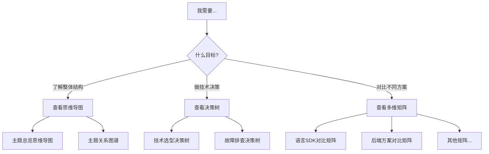

# OTLP多维表征体系

> **目的**: 通过多维度知识表征，优化12主题结构的知识导航与检索效率
> **创建日期**: 2026年3月15日
> **对标基准**: OpenTelemetry官方文档结构 + CNCF项目组织模式

---

## 📂 表征体系架构

```
04_表征体系/
├── README.md                    # 本文件 - 体系导览
├── 01_思维导图/                  # 主题导航与关系可视化
│   ├── 主题总览思维导图.md       # 12主题全景导航
│   └── 主题关系图谱.md           # 主题间依赖与关联
├── 02_决策树/                    # 技术选型与问题诊断
│   ├── 技术选型决策树.md         # 技术栈选择决策
│   └── 故障排查决策树.md         # 系统性故障诊断
└── 03_多维矩阵/                  # 多维度对比分析
    ├── 语言SDK对比矩阵.md        # 各语言SDK特性对比
    ├── 采样策略对比矩阵.md       # 采样算法对比
    ├── Collector组件矩阵.md      # Collector生态对比
    └── 后端方案对比矩阵.md       # 后端存储方案对比
```

---

## 🎯 表征类型说明

### 1. 思维导图 (Mind Maps)

**用途**: 提供主题的全景视图和导航路径
**特点**:

- 中心主题 + 分支展开
- 支持快速定位知识领域
- 可视化主题间关联

**包含文档**:

| 文档 | 用途 | 适合人群 |
|:---|:---|:---|
| 主题总览思维导图 | 了解12主题全貌 | 初学者 |
| 主题关系图谱 | 理解主题依赖 | 进阶学习者 |

### 2. 决策树 (Decision Trees)

**用途**: 支持系统性决策和问题诊断
**特点**:

- 条件分支逻辑
- 逐步缩小选择范围
- 标准化决策流程

**包含文档**:

| 文档 | 用途 | 适用场景 |
|:---|:---|:---|
| 技术选型决策树 | 选择合适的技术方案 | 架构设计 |
| 故障排查决策树 | 系统性诊断问题 | 运维排障 |

### 3. 多维矩阵 (Multi-dimensional Matrices)

**用途**: 多维度对比分析不同选项
**特点**:

- 维度 × 选项的交叉分析
- 量化评分支持
- 快速横向对比

**包含文档**:

| 文档 | 维度数 | 对比对象 |
|:---|:---:|:---|
| 语言SDK对比矩阵 | 10+ | Java/Go/Python/Node.js/.NET/Rust |
| 采样策略对比矩阵 | 8 | 7种采样策略 |
| Collector组件矩阵 | 6 | Receiver/Processor/Exporter |
| 后端方案对比矩阵 | 8 | Jaeger/Tempo/ClickHouse等 |

---

## 🗺️ 使用指南

### 根据目标选择表征类型



### 学习路径推荐

**初学者路径**:

```
主题总览思维导图 → 技术选型决策树 → 语言SDK对比矩阵
```

**进阶路径**:

```
主题关系图谱 → 故障排查决策树 → 后端方案对比矩阵
```

**专家路径**:

```
采样策略对比矩阵 → Collector组件矩阵 → 自定义扩展
```

---

## 📊 与12主题的对应关系

| 表征文档 | 覆盖主题 | 核心关联 |
|:---|:---|:---|
| 主题总览思维导图 | T1-T12 | 全局导航 |
| 技术选型决策树 | T2, T5, T7 | 标准选择、组件选型 |
| 故障排查决策树 | T7, T8 | 部署运维、实战问题 |
| 语言SDK对比矩阵 | T5 | SDK特性 |
| 采样策略对比矩阵 | T6 | 采样优化 |
| Collector组件矩阵 | T5, T7 | 组件配置 |
| 后端方案对比矩阵 | T7 | 后端选择 |

---

## 🔄 更新与维护

### 更新频率

| 表征类型 | 更新频率 | 触发条件 |
|:---|:---:|:---|
| 思维导图 | 季度 | 主题结构调整 |
| 决策树 | 月度 | 新技术加入/问题模式变化 |
| 多维矩阵 | 双月 | 组件版本更新 |

### 版本管理

- 主版本: 表征体系重大结构变更
- 次版本: 内容更新补充
- 修订号: 错误修正

当前版本: **v1.0** (2026-03-15)

---

## 🔗 相关资源

- [OTLP 2025/2026行动计划](../../🎯_OTLP项目行动计划_2025Q4-2026_ROADMAP.md)
- [国际标准对标分析](../../📊_OTLP项目全面梳理与国际对标报告_2025_10_26.md)
- [12主题详细内容](../02_12主题/)

---

**文档状态**: 初版完成
**下次更新**: 2026年Q2
**维护者**: OTLP项目知识中心团队
