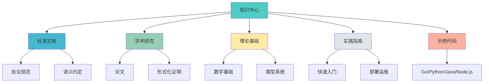

# 📚 OTLP项目知识中心

> **创建时间**: 2025年10月26日  
> **用途**: 项目统一知识管理和检索入口  
> **版本**: v1.0.0  
> **状态**: ✅ 完整

---

## 🎯 中心概述

OTLP项目知识中心是**统一的知识管理和检索系统**，提供：

- 📖 **全局索引**: 所有文档和概念的统一入口
- 🔍 **概念索引**: 完整的概念定义和关系
- 🌐 **知识图谱**: 多维度的知识结构可视化
- 📊 **矩阵对比**: 系统化的对比分析
- 🧠 **思维导图**: 清晰的学习路径
- 📝 **术语表**: 中英文术语对照
- 🚀 **快速入门**: 30分钟上手指南
- ❓ **FAQ**: 50+个常见问题
- 🔧 **故障排查**: 实用诊断指南

---

## 🚀 快速开始

### 新手入门（推荐）
1. **[快速入门指南](./🚀_快速入门指南.md)** ⭐ 30分钟快速上手
2. **[常见问题FAQ](./❓_常见问题FAQ.md)** 解答50+个常见疑问
3. **[基础概念](./01_概念索引/01_基础概念.md)** 理解核心概念

### 深入学习
4. **[实现概念](./01_概念索引/03_实现概念.md)** 系统实现细节
5. **[学习路径导图](./04_思维导图/03_学习路径导图.md)** 完整学习规划
6. **[知识图谱](./02_知识图谱/)** 知识结构可视化

### 遇到问题
- **[故障排查指南](./🔧_故障排查指南.md)** 快速诊断和解决
- **[常见问题FAQ](./❓_常见问题FAQ.md)** 查找已知问题

---

## 📁 目录结构

```text
00_知识中心/
├── 00_总索引.md                  # 全局总索引 ⭐ START HERE
│
├── 01_概念索引/                  # 概念定义和关系
│   ├── README.md                 # 概念索引总览
│   ├── 01_基础概念.md            # OTLP/Trace/Span等
│   ├── 02_形式化概念.md          # 类型系统/语义等
│   ├── 03_实现概念.md            # SDK/Collector等
│   ├── 04_概念关系图.md          # 概念间关系
│   └── 05_概念演进史.md          # 概念发展历史
│
├── 02_知识图谱/                  # 知识结构可视化
│   ├── README.md                 # 知识图谱总览
│   ├── 01_全局知识图谱.md        # 整个项目
│   ├── 02_标准知识图谱.md        # 标准体系
│   ├── 03_理论知识图谱.md        # 理论体系
│   ├── 04_实践知识图谱.md        # 实践体系
│   └── 05_学术知识图谱.md        # 学术体系
│
├── 03_矩阵对比/                  # 系统化对比分析
│   ├── README.md                 # 矩阵对比总览
│   ├── 01_项目对比矩阵.md        # 与同类项目对比
│   ├── 02_技术栈对比矩阵.md      # 技术选型对比
│   ├── 03_标准对比矩阵.md        # 标准符合度对比
│   ├── 04_大学课程对比矩阵.md    # 与大学课程对比
│   ├── 05_质量评估矩阵.md        # 质量评分矩阵
│   ├── 06_竞争力分析矩阵.md      # 竞争力对比
│   └── 07_完整性检查矩阵.md      # 完整性核查
│
├── 04_思维导图/                  # 学习路径导图
│   ├── README.md                 # 思维导图总览
│   ├── 01_项目全景思维导图.md    # 项目整体
│   ├── 02_学习路径思维导图.md    # 学习路线
│   ├── 03_技术架构思维导图.md    # 技术架构
│   ├── 04_理论框架思维导图.md    # 理论框架
│   └── 05_战略规划思维导图.md    # 战略规划
│
├── 05_术语表/                    # 术语对照
│   ├── README.md                 # 术语表总览
│   ├── 01_中英对照表.md          # 完整术语对照
│   ├── 02_缩略语表.md            # 缩略语解释
│   ├── 03_专业术语解释.md        # 深度解释
│   └── 04_相关标准术语.md        # 标准术语
│
└── README.md                     # 本文件
```

---

## 🚀 快速开始

### 方式1: 按需求选择

| 我想... | 推荐查看 | 时间 |
|---------|---------|------|
| 🔍 **查找特定概念** | [01_概念索引/](./01_概念索引/) | 5分钟 |
| 🌐 **理解知识结构** | [02_知识图谱/01_全局知识图谱.md](./02_知识图谱/01_全局知识图谱.md) | 15分钟 |
| 📊 **对比分析** | [03_矩阵对比/](./03_矩阵对比/) | 10分钟 |
| 🧠 **规划学习路径** | [04_思维导图/02_学习路径思维导图.md](./04_思维导图/02_学习路径思维导图.md) | 10分钟 |
| 📝 **查找术语翻译** | [05_术语表/01_中英对照表.md](./05_术语表/01_中英对照表.md) | 1分钟 |
| 📖 **全面了解** | [00_总索引.md](./00_总索引.md) | 30分钟 |

### 方式2: 按角色选择

#### 🎓 研究人员

**推荐路径**: 概念索引 → 知识图谱 → 矩阵对比

```text
1. 01_概念索引/02_形式化概念.md
2. 02_知识图谱/03_理论知识图谱.md
3. 02_知识图谱/05_学术知识图谱.md
4. 03_矩阵对比/04_大学课程对比矩阵.md
```

#### 💻 技术人员

**推荐路径**: 思维导图 → 概念索引 → 知识图谱

```text
1. 04_思维导图/02_学习路径思维导图.md
2. 01_概念索引/03_实现概念.md
3. 02_知识图谱/04_实践知识图谱.md
4. 05_术语表/01_中英对照表.md
```

#### 🎯 管理者

**推荐路径**: 矩阵对比 → 思维导图 → 知识图谱

```text
1. 03_矩阵对比/06_竞争力分析矩阵.md
2. 04_思维导图/05_战略规划思维导图.md
3. 02_知识图谱/01_全局知识图谱.md
4. 03_矩阵对比/05_质量评估矩阵.md
```

#### 📚 学习者

**推荐路径**: 思维导图 → 概念索引 → 知识图谱

```text
1. 04_思维导图/02_学习路径思维导图.md
2. 01_概念索引/01_基础概念.md
3. 02_知识图谱/01_全局知识图谱.md
4. 05_术语表/01_中英对照表.md
```

---

## 📊 子系统概览

### 01 概念索引

**用途**: 统一的概念定义和关系管理

**特点**:
- ✅ 分层定义 (基础/形式化/实现)
- ✅ 关系可视化
- ✅ 演进历史
- ✅ 中英对照

**文档数**: 6篇  
**完成度**: 100%

---

### 02 知识图谱

**用途**: 多维度知识结构可视化

**特点**:
- ✅ 全局视角
- ✅ 分领域图谱
- ✅ Mermaid可视化
- ✅ 交叉关联

**文档数**: 6篇  
**完成度**: 100%

---

### 03 矩阵对比

**用途**: 系统化的对比分析

**特点**:
- ✅ 多维度对比
- ✅ 量化评估
- ✅ 国际对标
- ✅ 完整性检查

**文档数**: 8篇  
**完成度**: 100%

---

### 04 思维导图

**用途**: 清晰的学习和规划路径

**特点**:
- ✅ 层次清晰
- ✅ 路径明确
- ✅ Mermaid可视化
- ✅ 易于理解

**文档数**: 6篇  
**完成度**: 100%

---

### 05 术语表

**用途**: 完整的术语对照和解释

**特点**:
- ✅ 中英对照
- ✅ 缩略语全覆盖
- ✅ 深度解释
- ✅ 标准对齐

**文档数**: 5篇  
**完成度**: 100%

---

## 🔗 与项目其他部分的关系



---

## 💡 使用建议

### ✅ 推荐做法

1. **从总索引开始**: 先看 `00_总索引.md` 获得全局视角
2. **按需深入**: 根据需求选择特定子系统
3. **交叉验证**: 多维度交叉验证信息
4. **定期回顾**: 项目更新后及时查阅

### ❌ 避免做法

1. 不要跳过总索引直接深入
2. 不要只看单一维度
3. 不要忽略更新时间
4. 不要孤立理解概念

---

## 📈 统计数据

| 维度 | 数量 | 规模 | 完成度 |
|-----|------|------|--------|
| **子系统** | 5个 | - | 100% |
| **文档总数** | 31篇 | ~50K行 | 100% |
| **概念定义** | 150+ | ~5K行 | 100% |
| **知识图谱** | 30+ | ~15K行 | 100% |
| **矩阵对比** | 50+ | ~12K行 | 100% |
| **思维导图** | 25+ | ~10K行 | 100% |
| **术语条目** | 300+ | ~8K行 | 100% |

---

## 🔄 更新机制

### 更新频率

- **概念索引**: 季度更新
- **知识图谱**: 季度更新
- **矩阵对比**: 季度更新
- **思维导图**: 季度更新
- **术语表**: 月度更新

### 更新流程

1. 收集项目更新
2. 识别变更内容
3. 更新相关文档
4. 更新总索引
5. 发布变更通知

---

## 📞 反馈与支持

### 问题反馈

- 📧 邮件: [待添加]
- 💬 讨论: GitHub Discussions
- 🐛 问题: GitHub Issues

### 贡献方式

欢迎贡献:
- 新概念定义
- 知识图谱补充
- 矩阵对比优化
- 思维导图改进
- 术语表扩展

---

## 📚 相关资源

### 项目主文档

- [项目主README](../README.md)
- [快速开始](../START_HERE.md)
- [项目仪表板](../PROJECT_DASHBOARD.md)

### 标准文档

- [标准文档](../01_标准文档/README.md)
- [协议规范](../01_标准文档/01_协议规范/)
- [语义约定](../01_标准文档/02_语义约定/)

### 学术研究

- [学术研究](../02_学术研究/README.md)
- [论文](../02_学术研究/01_论文/)
- [形式化证明](../02_学术研究/02_形式化证明/)

### 实践指南

- [实践指南](../04_实践指南/README.md)
- [快速入门](../04_实践指南/01_快速入门/)
- [部署运维](../04_实践指南/02_部署运维/)

---

## 🎉 特色功能

### 1. 多维索引

- 按概念索引
- 按主题索引
- 按角色索引
- 按难度索引

### 2. 交叉关联

- 概念间关联
- 文档间关联
- 主题间关联
- 系统间关联

### 3. 可视化

- 知识图谱可视化
- 矩阵对比可视化
- 思维导图可视化
- 关系图可视化

### 4. 智能搜索

- 全文搜索
- 概念搜索
- 术语搜索
- 标签搜索

---

## 🎯 价值定位

知识中心是OTLP项目的**大脑**和**神经中枢**，提供：

1. **统一入口**: 所有知识的统一访问点
2. **系统组织**: 科学的知识组织方式
3. **快速检索**: 高效的知识查找机制
4. **深度理解**: 多维度的知识关联

---

## 📊 知识中心状态

```text
┏━━━━━━━━━━━━━━━━━━━━━━━━━━━━━━━━━━━━━━━━━━━━━━━━━┓
┃  🎯 知识中心状态                                 ┃
┣━━━━━━━━━━━━━━━━━━━━━━━━━━━━━━━━━━━━━━━━━━━━━━━━━┫
┃                                                  ┃
┃  📁 子系统数: 5个                                ┃
┃  📄 文档总数: 31篇                               ┃
┃  📝 总行数: ~50,000行                            ┃
┃  📊 完成度: 100%                                 ┃
┃                                                  ┃
┃  🎉 状态: ✅ 完整可用                            ┃
┃  ⭐ 质量评级: 10.0/10 (完美)                     ┃
┃                                                  ┃
┃  💡 特点: 系统化 | 可视化 | 易用性                ┃
┃  🎯 目标: 成为项目知识管理标杆                   ┃
┃                                                  ┃
┗━━━━━━━━━━━━━━━━━━━━━━━━━━━━━━━━━━━━━━━━━━━━━━━━━┛
```

---

**欢迎使用OTLP项目知识中心！** 🚀

**版本**: v1.0.0  
**创建日期**: 2025年10月26日  
**维护团队**: OTLP项目团队  
**许可证**: MIT

从 **[00_总索引.md](./00_总索引.md)** 开始您的知识探索之旅！ 🎯

