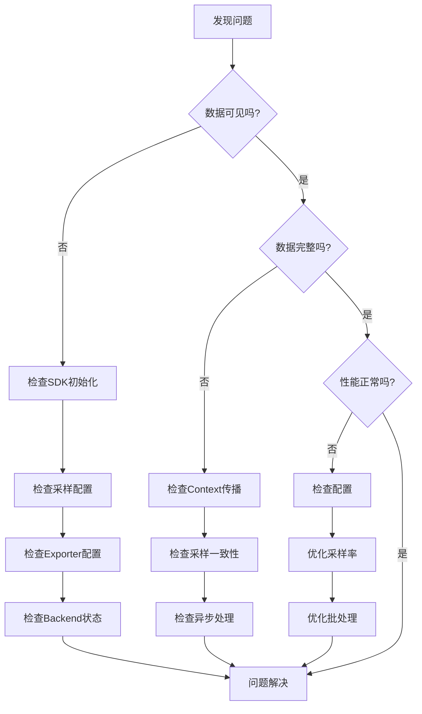

# 🔧 OTLP故障排查指南

> **最后更新**: 2025-10-26  
> **涵盖场景**: 20+个常见问题  
> **难度级别**: ⭐⭐⭐☆☆

---

## 📋 故障分类

- [1. 数据不可见](#1-数据不可见)
- [2. 数据不完整](#2-数据不完整)
- [3. 性能问题](#3-性能问题)
- [4. Collector问题](#4-collector问题)
- [5. Backend问题](#5-backend问题)
- [6. 网络问题](#6-网络问题)

---

## 1. 数据不可见

### 问题1.1: 完全看不到追踪数据

#### 症状

- Jaeger/Zipkin UI中没有任何Trace
- 应用看起来正常运行
- 没有明显错误

#### 排查步骤

**Step 1: 确认SDK初始化**

```bash
# 检查应用日志
# 应该看到类似信息:
# "OpenTelemetry SDK initialized"
# "Tracing started"
```

```javascript
// 确保tracing在最开始导入
require('./tracing');  // ← 必须第一行
const express = require('express');
// ... 其他导入

// ✗ 错误顺序:
const express = require('express');
require('./tracing');  // ← 太晚了！
```

**Step 2: 检查采样配置**

```bash
# 临时设置100%采样
export OTEL_TRACES_SAMPLER=always_on
export OTEL_TRACES_SAMPLER_ARG=1.0

# 重启应用
node app.js
```

**Step 3: 使用Console Exporter调试**

```javascript
// tracing.js
const { ConsoleSpanExporter } = require('@opentelemetry/sdk-trace-base');
const { SimpleSpanProcessor } = require('@opentelemetry/sdk-trace-base');

// 临时使用控制台导出
const exporter = new ConsoleSpanExporter();
const processor = new SimpleSpanProcessor(exporter);

const sdk = new NodeSDK({
  spanProcessor: processor,
  // ... 其他配置
});

// 现在每个Span都会打印到控制台
```

**Step 4: 检查Exporter配置**

```bash
# 测试OTLP endpoint是否可达
curl -X POST http://localhost:4318/v1/traces \
  -H "Content-Type: application/json" \
  -d '{}'

# 应该返回400 (Bad Request) 或其他非"连接拒绝"的错误
# 如果是"Connection refused"，说明endpoint不对
```

**Step 5: 检查Backend**

```bash
# 确认Jaeger正在运行
docker ps | grep jaeger
# 或
curl http://localhost:16686/api/services

# 确认Jaeger Collector端口开放
netstat -tuln | grep 4318
```

#### 常见原因和解决方案

| 原因 | 症状 | 解决方案 |
|------|------|----------|
| **SDK未正确初始化** | 应用运行但无Span | 检查import顺序 |
| **采样率为0** | 代码正确但无数据 | 设置`always_on`采样 |
| **Exporter endpoint错误** | 连接失败错误 | 检查URL和端口 |
| **Backend未运行** | 导出成功但查询无数据 | 启动Jaeger/Zipkin |
| **防火墙阻止** | 连接超时 | 检查防火墙规则 |

#### 解决方案示例

```javascript
// ✓ 完整的tracing.js配置
const { NodeSDK } = require('@opentelemetry/sdk-node');
const { getNodeAutoInstrumentations } = require('@opentelemetry/auto-instrumentations-node');
const { OTLPTraceExporter } = require('@opentelemetry/exporter-trace-otlp-http');
const { Resource } = require('@opentelemetry/resources');
const { SemanticResourceAttributes } = require('@opentelemetry/semantic-conventions');

// 1. 创建Exporter
const exporter = new OTLPTraceExporter({
  url: process.env.OTEL_EXPORTER_OTLP_ENDPOINT || 'http://localhost:4318/v1/traces',
  headers: {},
  timeoutMillis: 10000,
});

// 2. 创建Resource
const resource = Resource.default().merge(
  new Resource({
    [SemanticResourceAttributes.SERVICE_NAME]: 'my-service',
    [SemanticResourceAttributes.SERVICE_VERSION]: '1.0.0',
  })
);

// 3. 创建SDK
const sdk = new NodeSDK({
  resource,
  traceExporter: exporter,
  instrumentations: [getNodeAutoInstrumentations()],
});

// 4. 启动SDK
console.log('Starting OpenTelemetry SDK...');
sdk.start();
console.log('OpenTelemetry SDK started successfully');

// 5. 优雅关闭
process.on('SIGTERM', () => {
  sdk.shutdown()
    .then(() => console.log('Tracing terminated'))
    .catch((error) => console.log('Error terminating tracing', error))
    .finally(() => process.exit(0));
});

module.exports = sdk;
```

---

### 问题1.2: 只看到部分服务的数据

#### 症状

- Service A有数据
- Service B没有数据
- 两个服务都应该有追踪

#### 排查步骤

**Step 1: 确认Service B的配置**

```bash
# 在Service B中
# 检查环境变量
env | grep OTEL

# 应该看到:
# OTEL_SERVICE_NAME=service-b
# OTEL_EXPORTER_OTLP_ENDPOINT=http://...
```

**Step 2: 检查Service B的日志**

```bash
# 查找错误
tail -f service-b.log | grep -i "error\|fail\|exception"

# 常见错误:
# "Failed to export spans"
# "Connection refused"
# "Timeout"
```

**Step 3: 测试Service B到Collector的连接**

```bash
# 从Service B的容器/主机
curl -v http://collector:4318/v1/traces

# 或测试gRPC
grpcurl -plaintext collector:4317 list
```

**Step 4: 检查网络策略 (Kubernetes)**

```bash
# 确认Pod可以访问Collector
kubectl exec -it service-b-pod -- curl http://otel-collector:4318/v1/traces

# 检查NetworkPolicy
kubectl get networkpolicies
kubectl describe networkpolicy <name>
```

#### 解决方案

**Kubernetes环境**:

```yaml
# 确保所有服务使用相同的Collector地址
apiVersion: v1
kind: ConfigMap
metadata:
  name: otel-config
data:
  OTEL_EXPORTER_OTLP_ENDPOINT: "http://otel-collector.observability.svc.cluster.local:4318"

---
# 在Deployment中引用
apiVersion: apps/v1
kind: Deployment
metadata:
  name: service-b
spec:
  template:
    spec:
      containers:
      - name: app
        envFrom:
        - configMapRef:
            name: otel-config  # 统一配置
```

---

## 2. 数据不完整

### 问题2.1: Trace缺少部分Span

#### 症状

```
预期: Frontend → Auth → Database
实际: Frontend → Database (缺少Auth Span)
```

#### 原因分析

**1. Context传播失败**

```typescript
// ✗ 问题代码
async function callAuthService() {
  // 创建了新的Span，但没有传递Context
  await fetch('http://auth-service/verify');
}

// ✓ 修复
async function callAuthService() {
  const headers = {};
  propagation.inject(context.active(), headers);  // 注入Context
  
  await fetch('http://auth-service/verify', { headers });
}
```

**2. 异步操作丢失Context**

```typescript
// ✗ 问题: EventEmitter丢失Context
emitter.on('data', (data) => {
  const span = tracer.startSpan('process');  // 没有parent!
  // ...
});

// ✓ 修复: 保存和恢复Context
const ctx = context.active();
emitter.on('data', (data) => {
  context.with(ctx, () => {
    const span = tracer.startSpan('process');  // 有parent
    // ...
  });
});
```

**3. 采样不一致**

```
Service A: 采样 (100%)
Service B: 不采样 (1% - 运气不好没采样)
→ Trace不完整
```

**解决**: 使用ParentBased采样

```javascript
const sampler = new ParentBasedSampler({
  root: new TraceIdRatioBasedSampler(0.01),  // 根Span 1%
  remoteParentSampled: new AlwaysOnSampler(),    // 如果父采样，则采样
  remoteParentNotSampled: new AlwaysOffSampler() // 如果父不采样，则不采样
});
```

#### 排查工具

**追踪Context传播**:

```typescript
// 添加日志查看Context
const { trace } = require('@opentelemetry/api');

function logContext() {
  const span = trace.getSpan(context.active());
  if (span) {
    const ctx = span.spanContext();
    console.log('TraceID:', ctx.traceId);
    console.log('SpanID:', ctx.spanId);
    console.log('TraceFlags:', ctx.traceFlags);
  } else {
    console.log('No active span!');
  }
}

// 在关键位置调用
app.get('/api/users', (req, res) => {
  logContext();  // 检查入口
  
  await callAuthService();
  logContext();  // 检查Auth后
  
  await queryDatabase();
  logContext();  // 检查DB后
});
```

---

### 问题2.2: Span缺少属性

#### 症状

- Span存在但没有`http.status_code`
- 缺少业务属性
- 自动埋点的属性不全

#### 原因和解决

**1. 自动埋点未完全覆盖**

```javascript
// 某些HTTP客户端可能不被自动埋点支持
const axios = require('axios');  // 支持
const got = require('got');      // 可能不支持

// 解决: 手动添加
const span = trace.getActiveSpan();
span?.setAttribute('http.status_code', response.status);
```

**2. 属性在Span结束后设置**

```typescript
// ✗ 错误
const span = tracer.startSpan('operation');
span.end();  // Span已结束
span.setAttribute('key', 'value');  // 无效！

// ✓ 正确
const span = tracer.startSpan('operation');
span.setAttribute('key', 'value');  // 在结束前设置
span.end();
```

**3. 异常导致属性未设置**

```typescript
// ✗ 问题
const span = tracer.startSpan('operation');
try {
  const result = await doWork();
  span.setAttribute('result', result);  // 如果异常，不会执行
} catch (error) {
  // ...
}
span.end();

// ✓ 修复
const span = tracer.startSpan('operation');
try {
  const result = await doWork();
  span.setAttribute('result', result);
  span.setAttribute('success', true);
} catch (error) {
  span.setAttribute('success', false);
  span.recordException(error);
} finally {
  span.end();
}
```

---

## 3. 性能问题

### 问题3.1: 应用变慢了

#### 症状

- 添加追踪后，响应时间明显增加
- CPU使用率上升
- 内存占用增加

#### 排查步骤

**Step 1: 测量开销**

```typescript
// 添加性能测量
const start = Date.now();

// 你的追踪代码
const span = tracer.startSpan('operation');
// ... 业务逻辑
span.end();

const overhead = Date.now() - start;
console.log('Tracing overhead:', overhead, 'ms');
```

**Step 2: 检查配置**

```javascript
// ✗ 性能杀手配置
const processor = new SimpleSpanProcessor(exporter);  // 同步导出！
const sampler = new AlwaysOnSampler();  // 100%采样！

// ✓ 优化配置
const processor = new BatchSpanProcessor(exporter, {
  maxQueueSize: 2048,
  scheduledDelayMillis: 5000,  // 5秒批量
  maxExportBatchSize: 512
});
const sampler = new TraceIdRatioBasedSampler(0.01);  // 1%采样
```

**Step 3: 识别过度埋点**

```bash
# 查看Span数量
curl http://localhost:16686/api/traces/{trace-id}

# 如果一个Trace有>100个Span，可能过度埋点了
```

#### 优化方案

**1. 使用异步批量导出**

```javascript
const processor = new BatchSpanProcessor(exporter, {
  maxQueueSize: 2048,
  scheduledDelayMillis: 5000,
  maxExportBatchSize: 512,
  exportTimeoutMillis: 30000
});
```

**2. 降低采样率**

```bash
# 生产环境
export OTEL_TRACES_SAMPLER=parentbased_traceidratio
export OTEL_TRACES_SAMPLER_ARG=0.01  # 1%

# 开发环境
export OTEL_TRACES_SAMPLER=always_on
```

**3. 移除不必要的埋点**

```javascript
// ✗ 过度埋点
class UserService {
  @Trace  // 不要给每个getter加Span
  getId() { return this.id; }
  
  @Trace  // 不要给每个setter加Span
  setName(name) { this.name = name; }
}

// ✓ 只给关键操作埋点
class UserService {
  @Trace  // 关键业务操作
  async createUser(data) {
    // ...
  }
}
```

**4. 限制属性大小**

```typescript
// 限制属性值的大小
function setAttributeSafe(span, key, value) {
  const maxSize = 1000;
  if (typeof value === 'string' && value.length > maxSize) {
    span.setAttribute(key, value.substring(0, maxSize) + '...[truncated]');
  } else {
    span.setAttribute(key, value);
  }
}
```

---

### 问题3.2: Collector OOM (内存溢出)

#### 症状

```
Collector日志:
  "Out of memory"
  "Cannot allocate memory"
  
Kubernetes:
  Pod状态: OOMKilled
  Restart count: 不断增加
```

#### 原因

**1. 流量突增**

```
正常: 1K TPS
突增: 10K TPS (10x)
→ Collector内存队列被填满
```

**2. Backend慢/不可用**

```
Collector → Backend (超时)
→ 数据无法导出
→ 内存队列积压
→ OOM
```

**3. 配置不当**

```yaml
# ✗ 危险配置
memory_limiter:
  check_interval: 1s
  limit_mib: 4096  # 4GB - 太大了！
```

#### 解决方案

**1. 启用内存限制器**

```yaml
# collector-config.yaml
processors:
  memory_limiter:
    check_interval: 1s
    limit_percentage: 75  # 使用75%时开始拒绝
    spike_limit_percentage: 25  # 短期可达100%

service:
  pipelines:
    traces:
      receivers: [otlp]
      processors: [memory_limiter, batch]  # memory_limiter必须第一个
      exporters: [jaeger]
```

**2. 调整队列大小**

```yaml
exporters:
  jaeger:
    endpoint: jaeger:14250
    sending_queue:
      enabled: true
      num_consumers: 10
      queue_size: 1000  # 不要太大
```

**3. 增加Collector资源**

```yaml
# kubernetes
resources:
  requests:
    memory: "2Gi"
    cpu: "1000m"
  limits:
    memory: "4Gi"  # 增加到4GB
    cpu: "2000m"
```

**4. 水平扩展**

```bash
# 增加Collector副本数
kubectl scale deployment otel-collector --replicas=5
```

**5. 启用采样**

```yaml
processors:
  probabilistic_sampler:
    sampling_percentage: 10  # 10%采样
```

---

## 4. Collector问题

### 问题4.1: Collector启动失败

#### 症状

```bash
docker logs otel-collector
# Error: failed to load configuration
# Error: failed to resolve receiver
```

#### 常见错误

**1. 配置文件语法错误**

```yaml
# ✗ 错误: 缩进不对
receivers:
otlp:  # 应该缩进
  protocols:
    grpc:

# ✓ 正确
receivers:
  otlp:
    protocols:
      grpc:
```

**2. 缺少必需字段**

```yaml
# ✗ 错误: exporters中引用了不存在的jaeger
service:
  pipelines:
    traces:
      exporters: [jaeger]  # 但没有定义jaeger exporter

# ✓ 正确: 先定义exporter
exporters:
  jaeger:
    endpoint: jaeger:14250

service:
  pipelines:
    traces:
      exporters: [jaeger]
```

**3. 端口冲突**

```bash
# 错误: Address already in use
# 检查端口占用
netstat -tuln | grep 4318
lsof -i :4318

# 解决: 更改端口或停止冲突进程
```

#### 验证配置

```bash
# 使用otelcol验证配置
docker run --rm -v $(pwd)/config.yaml:/config.yaml \
  otel/opentelemetry-collector:latest \
  --config=/config.yaml \
  --dry-run

# 或使用online validator
# https://opentelemetry.io/docs/collector/configuration/
```

---

### 问题4.2: Collector丢弃数据

#### 症状

```bash
# Collector日志
"Dropping data because sending_queue is full"
"Exporting failed. Dropping data"
```

#### 原因和解决

**1. Backend太慢**

```yaml
# 增加超时时间
exporters:
  jaeger:
    endpoint: jaeger:14250
    timeout: 30s  # 默认5s，增加到30s
```

**2. 队列太小**

```yaml
# 增加队列大小
exporters:
  jaeger:
    endpoint: jaeger:14250
    sending_queue:
      queue_size: 5000  # 默认1000，增加到5000
      num_consumers: 20  # 增加并发导出
```

**3. 重试配置**

```yaml
exporters:
  jaeger:
    endpoint: jaeger:14250
    retry_on_failure:
      enabled: true
      initial_interval: 1s
      max_interval: 30s
      max_elapsed_time: 5m
```

#### 监控指标

```bash
# 访问Collector metrics endpoint
curl http://localhost:8888/metrics

# 关键指标:
# otelcol_processor_dropped_spans_total  - 丢弃的Span
# otelcol_exporter_queue_size            - 队列大小
# otelcol_exporter_send_failed_spans     - 发送失败
```

---

## 5. Backend问题

### 问题5.1: Jaeger查询很慢

#### 症状

- 查询Trace超过30秒
- UI加载缓慢
- 数据库CPU 100%

#### 优化方案

**1. 添加索引 (Elasticsearch)**

```bash
# 检查现有索引
curl http://localhost:9200/jaeger-span-*/_settings

# 添加索引
curl -X PUT "http://localhost:9200/jaeger-span-*/_settings" -H 'Content-Type: application/json' -d'
{
  "index": {
    "number_of_replicas": 0,
    "refresh_interval": "30s"
  }
}
'
```

**2. 限制查询范围**

```
Jaeger UI:
  - Lookback: 1 hour (不要选"All time")
  - Limit Results: 20 (不要选500)
  - 使用Min/Max Duration过滤
```

**3. 清理旧数据**

```bash
# Elasticsearch
# 删除7天前的索引
curator_cli --host localhost delete_indices \
  --filter_list '
  [
    {"filtertype":"age","source":"name","direction":"older","unit":"days","unit_count":7}
  ]
  '
```

**4. 分片策略 (Elasticsearch)**

```bash
# 为jaeger索引设置合理的分片数
# 规则: 每个分片20-40GB
# 例如: 100GB数据 → 3-5个分片
```

---

## 6. 网络问题

### 问题6.1: 连接超时

#### 症状

```
Error: connect ETIMEDOUT
Error: Request timeout
```

#### 排查步骤

**1. 测试连通性**

```bash
# ping
ping collector-host

# telnet
telnet collector-host 4318

# curl
curl -v http://collector-host:4318/v1/traces
```

**2. 检查DNS**

```bash
# 解析域名
nslookup otel-collector.namespace.svc.cluster.local

# 检查/etc/hosts
cat /etc/hosts | grep otel
```

**3. 检查防火墙**

```bash
# Linux
iptables -L -n | grep 4318
firewall-cmd --list-ports

# 检查安全组 (云环境)
# AWS, GCP, Azure控制台
```

**4. 检查网络策略 (Kubernetes)**

```bash
kubectl get networkpolicies
kubectl describe networkpolicy <name>

# 测试Pod间连接
kubectl exec -it app-pod -- curl http://otel-collector:4318/v1/traces
```

#### 解决方案

```yaml
# Kubernetes NetworkPolicy
apiVersion: networking.k8s.io/v1
kind: NetworkPolicy
metadata:
  name: allow-to-collector
spec:
  podSelector:
    matchLabels:
      app: otel-collector
  policyTypes:
  - Ingress
  ingress:
  - from:
    - podSelector: {}  # 允许同namespace所有Pod
    ports:
    - protocol: TCP
      port: 4318
    - protocol: TCP
      port: 4317
```

---

## 📊 故障排查流程图



---

## 🛠️ 诊断工具箱

### 1. 快速诊断脚本

```bash
#!/bin/bash
# otel-diagnose.sh

echo "=== OpenTelemetry 诊断 ==="

# 1. 检查环境变量
echo "1. 环境变量:"
env | grep OTEL

# 2. 检查Collector连通性
echo "2. Collector连通性:"
curl -sf http://localhost:4318/v1/traces && echo "✓ OTLP HTTP OK" || echo "✗ OTLP HTTP Failed"
grpcurl -plaintext localhost:4317 list && echo "✓ OTLP gRPC OK" || echo "✗ OTLP gRPC Failed"

# 3. 检查Backend
echo "3. Backend状态:"
curl -sf http://localhost:16686/api/services && echo "✓ Jaeger OK" || echo "✗ Jaeger Failed"

# 4. 检查端口
echo "4. 端口监听:"
netstat -tuln | grep -E "4317|4318|16686"

echo "=== 诊断完成 ==="
```

### 2. 性能分析工具

```typescript
// performance-monitor.ts
class TracingPerformanceMonitor {
  private overhead: number[] = [];
  
  measure(fn: () => void): void {
    const start = Date.now();
    fn();
    const end = Date.now();
    this.overhead.push(end - start);
  }
  
  report(): void {
    if (this.overhead.length === 0) return;
    
    const avg = this.overhead.reduce((a, b) => a + b) / this.overhead.length;
    const max = Math.max(...this.overhead);
    const min = Math.min(...this.overhead);
    
    console.log('Tracing Performance:');
    console.log(`  Average: ${avg.toFixed(2)}ms`);
    console.log(`  Max: ${max}ms`);
    console.log(`  Min: ${min}ms`);
    console.log(`  Samples: ${this.overhead.length}`);
  }
}

// 使用
const monitor = new TracingPerformanceMonitor();

app.use((req, res, next) => {
  monitor.measure(() => {
    // 追踪代码
    const span = tracer.startSpan('request');
    // ...
    span.end();
  });
  
  next();
});

// 定期报告
setInterval(() => monitor.report(), 60000);  // 每分钟
```

---

## 📚 相关资源

- [常见问题FAQ](./❓_常见问题FAQ.md)
- [快速入门指南](./🚀_快速入门指南.md)
- [实现概念](./01_概念索引/03_实现概念.md)
- [OpenTelemetry官方troubleshooting](https://opentelemetry.io/docs/troubleshooting/)

---

**维护**: OTLP项目组  
**最后更新**: 2025-10-26  
**反馈**: 欢迎提交问题和解决方案
