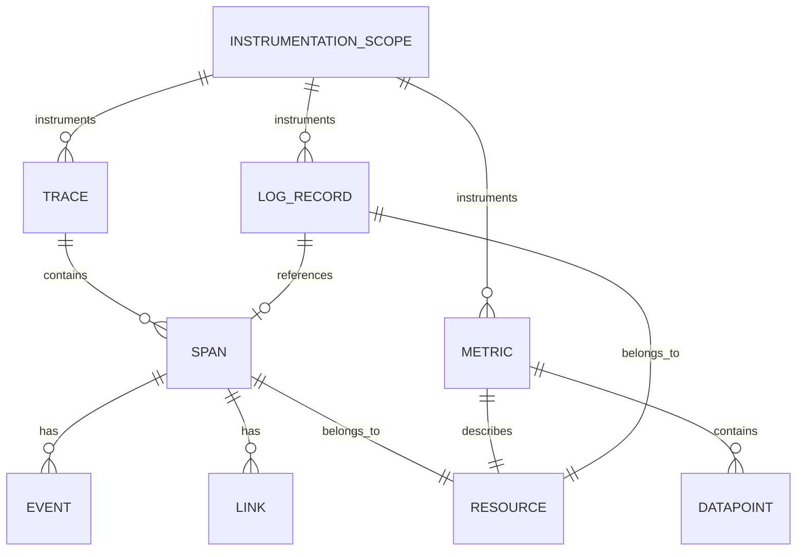

# OpenTelemetry 2025年数据模型设计

## 🎯 数据模型设计概述

基于2025年最新数据存储和分析技术发展趋势，本文档提供OpenTelemetry系统的完整数据模型设计，包括数据模型、存储策略、索引设计、查询优化等核心功能。

---

## 📊 数据模型架构

### 1. 核心数据模型

#### 1.1 追踪数据模型

```yaml
# 追踪数据模型定义
trace_data_model:
  trace:
    id: "string"                    # 追踪ID
    timestamp: "int64"              # 创建时间戳
    duration: "int64"               # 总持续时间
    service_name: "string"          # 服务名称
    operation_name: "string"        # 操作名称
    status: "enum"                  # 状态码
    attributes: "map<string,any>"   # 属性映射
    resource: "resource"            # 资源信息
    instrumentation_scope: "scope"  # 工具作用域
  
  span:
    id: "string"                    # 跨度ID
    trace_id: "string"              # 追踪ID
    parent_span_id: "string"        # 父跨度ID
    name: "string"                  # 跨度名称
    kind: "enum"                    # 跨度类型
    start_time: "int64"             # 开始时间
    end_time: "int64"               # 结束时间
    status: "status"                # 状态信息
    attributes: "map<string,any>"   # 属性映射
    events: "array<event>"          # 事件列表
    links: "array<link>"            # 链接列表
    resource: "resource"            # 资源信息
  
  event:
    timestamp: "int64"              # 事件时间戳
    name: "string"                  # 事件名称
    attributes: "map<string,any>"   # 事件属性
  
  link:
    trace_id: "string"              # 链接追踪ID
    span_id: "string"               # 链接跨度ID
    attributes: "map<string,any>"   # 链接属性
```

#### 1.2 指标数据模型

```yaml
# 指标数据模型定义
metric_data_model:
  metric:
    name: "string"                  # 指标名称
    description: "string"           # 指标描述
    unit: "string"                  # 指标单位
    type: "enum"                    # 指标类型
    data_points: "array<datapoint>" # 数据点列表
    resource: "resource"            # 资源信息
    instrumentation_scope: "scope"  # 工具作用域
  
  datapoint:
    timestamp: "int64"              # 时间戳
    value: "any"                    # 数值
    attributes: "map<string,any>"   # 属性映射
    exemplars: "array<exemplar>"    # 示例列表
  
  exemplar:
    timestamp: "int64"              # 示例时间戳
    value: "any"                    # 示例值
    filtered_attributes: "map<string,any>" # 过滤属性
    span_id: "string"               # 关联跨度ID
    trace_id: "string"              # 关联追踪ID
```

#### 1.3 日志数据模型

```yaml
# 日志数据模型定义
log_data_model:
  log_record:
    timestamp: "int64"              # 时间戳
    observed_timestamp: "int64"     # 观察时间戳
    trace_id: "string"              # 追踪ID
    span_id: "string"               # 跨度ID
    severity_text: "string"         # 严重程度文本
    severity_number: "int32"        # 严重程度数字
    body: "any"                     # 日志体
    attributes: "map<string,any>"   # 属性映射
    resource: "resource"            # 资源信息
    instrumentation_scope: "scope"  # 工具作用域
```

#### 1.4 资源数据模型

```yaml
# 资源数据模型定义
resource_data_model:
  resource:
    attributes: "map<string,any>"   # 资源属性
    dropped_attributes_count: "int32" # 丢弃属性数量
  
  common_attributes:
    service_name: "string"          # 服务名称
    service_version: "string"       # 服务版本
    service_instance_id: "string"   # 服务实例ID
    host_name: "string"             # 主机名
    host_id: "string"               # 主机ID
    os_type: "string"               # 操作系统类型
    os_version: "string"            # 操作系统版本
    process_pid: "int32"            # 进程ID
    process_command: "string"       # 进程命令
    process_command_line: "string"  # 进程命令行
    process_executable_name: "string" # 可执行文件名
    process_executable_path: "string" # 可执行文件路径
    telemetry_sdk_name: "string"    # 遥测SDK名称
    telemetry_sdk_version: "string" # 遥测SDK版本
    telemetry_auto_version: "string" # 遥测自动版本
```

### 2. 数据关系模型

#### 2.1 实体关系图



#### 2.2 数据依赖关系

```yaml
# 数据依赖关系定义
data_dependencies:
  trace_dependencies:
    - "resource"
    - "instrumentation_scope"
    - "spans"
  
  span_dependencies:
    - "trace"
    - "parent_span"
    - "resource"
    - "events"
    - "links"
  
  metric_dependencies:
    - "resource"
    - "instrumentation_scope"
    - "data_points"
  
  log_dependencies:
    - "resource"
    - "instrumentation_scope"
    - "span (optional)"
```

---

## 🗄️ 存储策略设计

### 1. 分层存储策略

#### 1.1 热数据存储

```yaml
# 热数据存储配置
hot_data_storage:
  storage_type: "SSD"
  retention_period: "7d"
  compression: "lz4"
  replication_factor: 3
  
  data_types:
    - "recent_traces"
    - "recent_metrics"
    - "recent_logs"
    - "active_alerts"
  
  access_patterns:
    - "frequent_reads"
    - "real_time_queries"
    - "dashboard_updates"
    - "alert_evaluation"
  
  performance_requirements:
    read_latency: "< 10ms"
    write_latency: "< 5ms"
    throughput: "> 100K ops/s"
    availability: "99.9%"
```

#### 1.2 温数据存储

```yaml
# 温数据存储配置
warm_data_storage:
  storage_type: "HDD"
  retention_period: "30d"
  compression: "zstd"
  replication_factor: 2
  
  data_types:
    - "historical_traces"
    - "historical_metrics"
    - "historical_logs"
    - "aggregated_data"
  
  access_patterns:
    - "periodic_queries"
    - "analytical_queries"
    - "reporting"
    - "trend_analysis"
  
  performance_requirements:
    read_latency: "< 100ms"
    write_latency: "< 50ms"
    throughput: "> 10K ops/s"
    availability: "99.5%"
```

#### 1.3 冷数据存储

```yaml
# 冷数据存储配置
cold_data_storage:
  storage_type: "Object Storage"
  retention_period: "1y"
  compression: "gzip"
  replication_factor: 1
  
  data_types:
    - "archived_traces"
    - "archived_metrics"
    - "archived_logs"
    - "backup_data"
  
  access_patterns:
    - "rare_queries"
    - "compliance_queries"
    - "data_recovery"
    - "long_term_analysis"
  
  performance_requirements:
    read_latency: "< 1s"
    write_latency: "< 500ms"
    throughput: "> 1K ops/s"
    availability: "99.0%"
```

### 2. 数据分区策略

#### 2.1 时间分区

```yaml
# 时间分区策略
time_partitioning:
  partition_key: "timestamp"
  partition_granularity: "hour"
  partition_retention: "30d"
  
  partition_strategy:
    - "hourly_partitions"
    - "daily_partitions"
    - "monthly_partitions"
  
  partition_management:
    - "auto_creation"
    - "auto_cleanup"
    - "partition_pruning"
    - "partition_compaction"
```

#### 2.2 服务分区

```yaml
# 服务分区策略
service_partitioning:
  partition_key: "service_name"
  partition_strategy: "hash"
  partition_count: 16
  
  partition_distribution:
    - "even_distribution"
    - "load_balancing"
    - "hotspot_avoidance"
  
  partition_management:
    - "dynamic_rebalancing"
    - "partition_splitting"
    - "partition_merging"
```

#### 2.3 混合分区

```yaml
# 混合分区策略
hybrid_partitioning:
  primary_partition: "timestamp"
  secondary_partition: "service_name"
  
  partition_combination:
    - "time_service_partition"
    - "service_time_partition"
  
  partition_optimization:
    - "query_optimization"
    - "storage_optimization"
    - "performance_optimization"
```

---

## 🔍 索引设计

### 1. 主索引设计

#### 1.1 追踪索引

```yaml
# 追踪索引设计
trace_indexes:
  primary_index:
    fields: ["trace_id"]
    type: "hash"
    unique: true
  
  time_index:
    fields: ["timestamp"]
    type: "btree"
    range_queries: true
  
  service_index:
    fields: ["service_name", "timestamp"]
    type: "composite"
    prefix_queries: true
  
  operation_index:
    fields: ["operation_name", "timestamp"]
    type: "composite"
    prefix_queries: true
  
  status_index:
    fields: ["status", "timestamp"]
    type: "composite"
    equality_queries: true
```

#### 1.2 跨度索引

```yaml
# 跨度索引设计
span_indexes:
  primary_index:
    fields: ["span_id"]
    type: "hash"
    unique: true
  
  trace_index:
    fields: ["trace_id", "start_time"]
    type: "composite"
    range_queries: true
  
  parent_index:
    fields: ["parent_span_id", "start_time"]
    type: "composite"
    range_queries: true
  
  service_operation_index:
    fields: ["service_name", "operation_name", "start_time"]
    type: "composite"
    prefix_queries: true
  
  duration_index:
    fields: ["duration", "start_time"]
    type: "composite"
    range_queries: true
```

#### 1.3 指标索引

```yaml
# 指标索引设计
metric_indexes:
  primary_index:
    fields: ["metric_name", "timestamp"]
    type: "composite"
    unique: true
  
  time_index:
    fields: ["timestamp"]
    type: "btree"
    range_queries: true
  
  metric_type_index:
    fields: ["metric_type", "timestamp"]
    type: "composite"
    equality_queries: true
  
  resource_index:
    fields: ["resource_attributes", "timestamp"]
    type: "composite"
    prefix_queries: true
```

#### 1.4 日志索引

```yaml
# 日志索引设计
log_indexes:
  primary_index:
    fields: ["log_id"]
    type: "hash"
    unique: true
  
  time_index:
    fields: ["timestamp"]
    type: "btree"
    range_queries: true
  
  severity_index:
    fields: ["severity_number", "timestamp"]
    type: "composite"
    range_queries: true
  
  service_index:
    fields: ["service_name", "timestamp"]
    type: "composite"
    prefix_queries: true
  
  trace_index:
    fields: ["trace_id", "span_id", "timestamp"]
    type: "composite"
    range_queries: true
```

### 2. 辅助索引设计

#### 2.1 全文搜索索引

```yaml
# 全文搜索索引设计
fulltext_indexes:
  log_content_index:
    fields: ["log_body"]
    type: "fulltext"
    analyzer: "standard"
    language: "multi"
  
  span_name_index:
    fields: ["span_name"]
    type: "fulltext"
    analyzer: "standard"
  
  attribute_value_index:
    fields: ["attribute_values"]
    type: "fulltext"
    analyzer: "standard"
```

#### 2.2 复合索引

```yaml
# 复合索引设计
composite_indexes:
  trace_service_time_index:
    fields: ["trace_id", "service_name", "timestamp"]
    type: "composite"
    query_patterns:
      - "trace_by_service"
      - "service_by_time"
      - "trace_by_time"
  
  span_operation_time_index:
    fields: ["span_id", "operation_name", "start_time"]
    type: "composite"
    query_patterns:
      - "span_by_operation"
      - "operation_by_time"
      - "span_by_time"
  
  metric_resource_time_index:
    fields: ["metric_name", "resource_attributes", "timestamp"]
    type: "composite"
    query_patterns:
      - "metric_by_resource"
      - "resource_by_time"
      - "metric_by_time"
```

---

## 📈 查询优化

### 1. 查询计划优化

#### 1.1 查询重写

```python
# 查询重写优化器
class QueryRewriter:
    def __init__(self):
        self.rewrite_rules = self._load_rewrite_rules()
    
    def rewrite_query(self, query: str) -> str:
        """重写查询以优化性能"""
        rewritten_query = query
        
        # 应用重写规则
        for rule in self.rewrite_rules:
            rewritten_query = rule.apply(rewritten_query)
        
        return rewritten_query
    
    def _load_rewrite_rules(self) -> List[RewriteRule]:
        """加载重写规则"""
        rules = [
            # 谓词下推规则
            PredicatePushdownRule(),
            # 投影下推规则
            ProjectionPushdownRule(),
            # 连接重排序规则
            JoinReorderingRule(),
            # 子查询展开规则
            SubqueryUnnestingRule(),
            # 常量折叠规则
            ConstantFoldingRule()
        ]
        
        return rules
```

#### 1.2 查询计划生成

```python
# 查询计划生成器
class QueryPlanner:
    def __init__(self):
        self.plan_generators = self._load_plan_generators()
    
    def generate_plan(self, query: str) -> QueryPlan:
        """生成查询计划"""
        # 解析查询
        parsed_query = self._parse_query(query)
        
        # 生成逻辑计划
        logical_plan = self._generate_logical_plan(parsed_query)
        
        # 优化逻辑计划
        optimized_logical_plan = self._optimize_logical_plan(logical_plan)
        
        # 生成物理计划
        physical_plan = self._generate_physical_plan(optimized_logical_plan)
        
        # 优化物理计划
        optimized_physical_plan = self._optimize_physical_plan(physical_plan)
        
        return optimized_physical_plan
    
    def _generate_logical_plan(self, parsed_query: ParsedQuery) -> LogicalPlan:
        """生成逻辑计划"""
        # 根据查询类型生成不同的逻辑计划
        if parsed_query.type == "SELECT":
            return self._generate_select_plan(parsed_query)
        elif parsed_query.type == "AGGREGATE":
            return self._generate_aggregate_plan(parsed_query)
        elif parsed_query.type == "JOIN":
            return self._generate_join_plan(parsed_query)
        
        raise ValueError(f"Unsupported query type: {parsed_query.type}")
```

### 2. 缓存策略

#### 2.1 查询结果缓存

```yaml
# 查询结果缓存配置
query_result_cache:
  cache_type: "LRU"
  cache_size: "1GB"
  ttl: "5m"
  
  cacheable_queries:
    - "dashboard_queries"
    - "metric_queries"
    - "aggregation_queries"
    - "frequent_queries"
  
  cache_invalidation:
    - "time_based"
    - "data_change_based"
    - "manual_invalidation"
  
  cache_metrics:
    - "hit_rate"
    - "miss_rate"
    - "eviction_rate"
    - "memory_usage"
```

#### 2.2 索引缓存

```yaml
# 索引缓存配置
index_cache:
  cache_type: "LRU"
  cache_size: "512MB"
  ttl: "10m"
  
  cached_indexes:
    - "primary_indexes"
    - "frequently_used_indexes"
    - "hot_indexes"
  
  cache_management:
    - "preloading"
    - "warmup"
    - "eviction_policy"
```

---

## 🔄 数据生命周期管理

### 1. 数据生命周期策略

#### 1.1 生命周期阶段

```yaml
# 数据生命周期阶段定义
data_lifecycle_stages:
  creation:
    stage: "creation"
    duration: "0s"
    actions:
      - "data_validation"
      - "initial_indexing"
      - "replication"
  
  active:
    stage: "active"
    duration: "7d"
    actions:
      - "frequent_access"
      - "real_time_queries"
      - "hot_storage"
  
  warm:
    stage: "warm"
    duration: "30d"
    actions:
      - "periodic_access"
      - "analytical_queries"
      - "warm_storage"
  
  cold:
    stage: "cold"
    duration: "1y"
    actions:
      - "rare_access"
      - "compliance_queries"
      - "cold_storage"
  
  archive:
    stage: "archive"
    duration: "indefinite"
    actions:
      - "backup"
      - "long_term_storage"
      - "disaster_recovery"
```

#### 1.2 生命周期策略

```python
# 数据生命周期管理器
class DataLifecycleManager:
    def __init__(self):
        self.lifecycle_policies = self._load_lifecycle_policies()
        self.storage_tiers = self._load_storage_tiers()
    
    def manage_lifecycle(self, data_type: str, data_age: int) -> LifecycleAction:
        """管理数据生命周期"""
        policy = self.lifecycle_policies.get(data_type)
        if not policy:
            return LifecycleAction.NO_ACTION
        
        # 确定当前阶段
        current_stage = self._determine_current_stage(policy, data_age)
        
        # 确定下一步动作
        next_action = self._determine_next_action(policy, current_stage, data_age)
        
        return next_action
    
    def _determine_current_stage(self, policy: LifecyclePolicy, data_age: int) -> str:
        """确定当前数据阶段"""
        if data_age <= policy.active_duration:
            return "active"
        elif data_age <= policy.active_duration + policy.warm_duration:
            return "warm"
        elif data_age <= policy.active_duration + policy.warm_duration + policy.cold_duration:
            return "cold"
        else:
            return "archive"
    
    def _determine_next_action(self, policy: LifecyclePolicy, 
                             current_stage: str, data_age: int) -> LifecycleAction:
        """确定下一步动作"""
        if current_stage == "active" and data_age > policy.active_duration:
            return LifecycleAction.MOVE_TO_WARM
        elif current_stage == "warm" and data_age > policy.active_duration + policy.warm_duration:
            return LifecycleAction.MOVE_TO_COLD
        elif current_stage == "cold" and data_age > policy.active_duration + policy.warm_duration + policy.cold_duration:
            return LifecycleAction.MOVE_TO_ARCHIVE
        else:
            return LifecycleAction.NO_ACTION
```

### 2. 数据压缩策略

#### 2.1 压缩算法选择

```yaml
# 压缩算法配置
compression_algorithms:
  lz4:
    compression_ratio: "2:1"
    compression_speed: "fast"
    decompression_speed: "very_fast"
    use_cases:
      - "hot_data"
      - "real_time_queries"
  
  zstd:
    compression_ratio: "3:1"
    compression_speed: "medium"
    decompression_speed: "fast"
    use_cases:
      - "warm_data"
      - "analytical_queries"
  
  gzip:
    compression_ratio: "4:1"
    compression_speed: "slow"
    decompression_speed: "medium"
    use_cases:
      - "cold_data"
      - "archive_data"
  
  brotli:
    compression_ratio: "5:1"
    compression_speed: "slow"
    decompression_speed: "medium"
    use_cases:
      - "cold_data"
      - "long_term_storage"
```

#### 2.2 压缩策略

```python
# 数据压缩策略
class CompressionStrategy:
    def __init__(self):
        self.compression_algorithms = self._load_compression_algorithms()
        self.compression_policies = self._load_compression_policies()
    
    def select_compression_algorithm(self, data_type: str, 
                                   storage_tier: str) -> str:
        """选择压缩算法"""
        policy = self.compression_policies.get(data_type, {})
        algorithm = policy.get(storage_tier, "zstd")
        
        return algorithm
    
    def compress_data(self, data: bytes, algorithm: str) -> bytes:
        """压缩数据"""
        compressor = self.compression_algorithms[algorithm]
        return compressor.compress(data)
    
    def decompress_data(self, compressed_data: bytes, 
                       algorithm: str) -> bytes:
        """解压缩数据"""
        decompressor = self.compression_algorithms[algorithm]
        return decompressor.decompress(compressed_data)
```

---

## 📊 数据质量保证

### 1. 数据验证

#### 1.1 数据完整性验证

```python
# 数据完整性验证器
class DataIntegrityValidator:
    def __init__(self):
        self.validation_rules = self._load_validation_rules()
    
    def validate_trace(self, trace: Trace) -> ValidationResult:
        """验证追踪数据完整性"""
        validation_result = ValidationResult()
        
        # 验证必需字段
        if not trace.trace_id:
            validation_result.add_error("Missing trace_id")
        
        if not trace.spans or len(trace.spans) == 0:
            validation_result.add_error("Missing spans")
        
        # 验证跨度完整性
        for span in trace.spans:
            span_validation = self._validate_span(span)
            validation_result.merge(span_validation)
        
        # 验证时间一致性
        time_validation = self._validate_time_consistency(trace)
        validation_result.merge(time_validation)
        
        return validation_result
    
    def validate_metric(self, metric: Metric) -> ValidationResult:
        """验证指标数据完整性"""
        validation_result = ValidationResult()
        
        # 验证必需字段
        if not metric.name:
            validation_result.add_error("Missing metric name")
        
        if not metric.data_points or len(metric.data_points) == 0:
            validation_result.add_error("Missing data points")
        
        # 验证数据点完整性
        for data_point in metric.data_points:
            dp_validation = self._validate_data_point(data_point)
            validation_result.merge(dp_validation)
        
        return validation_result
```

#### 1.2 数据一致性验证

```python
# 数据一致性验证器
class DataConsistencyValidator:
    def __init__(self):
        self.consistency_rules = self._load_consistency_rules()
    
    def validate_consistency(self, data: Dict[str, Any]) -> ConsistencyResult:
        """验证数据一致性"""
        consistency_result = ConsistencyResult()
        
        # 验证追踪一致性
        trace_consistency = self._validate_trace_consistency(data.get("traces", []))
        consistency_result.merge(trace_consistency)
        
        # 验证指标一致性
        metric_consistency = self._validate_metric_consistency(data.get("metrics", []))
        consistency_result.merge(metric_consistency)
        
        # 验证日志一致性
        log_consistency = self._validate_log_consistency(data.get("logs", []))
        consistency_result.merge(log_consistency)
        
        return consistency_result
    
    def _validate_trace_consistency(self, traces: List[Trace]) -> ConsistencyResult:
        """验证追踪一致性"""
        consistency_result = ConsistencyResult()
        
        for trace in traces:
            # 验证跨度时间一致性
            for span in trace.spans:
                if span.start_time >= span.end_time:
                    consistency_result.add_error(
                        f"Invalid time range for span {span.span_id}")
            
            # 验证父子关系一致性
            parent_child_consistency = self._validate_parent_child_consistency(trace)
            consistency_result.merge(parent_child_consistency)
        
        return consistency_result
```

### 2. 数据清理

#### 2.1 数据清理策略

```yaml
# 数据清理策略配置
data_cleaning_strategies:
  duplicate_removal:
    strategy: "deduplication"
    methods:
      - "hash_based"
      - "content_based"
      - "timestamp_based"
    
    thresholds:
      - "exact_match: 100%"
      - "similar_match: 95%"
      - "time_window: 1s"
  
  outlier_removal:
    strategy: "outlier_detection"
    methods:
      - "statistical"
      - "machine_learning"
      - "rule_based"
    
    thresholds:
      - "z_score: 3.0"
      - "iqr_multiplier: 1.5"
      - "isolation_forest: 0.1"
  
  missing_value_handling:
    strategy: "missing_value_imputation"
    methods:
      - "forward_fill"
      - "backward_fill"
      - "interpolation"
      - "mean_imputation"
    
    rules:
      - "time_series: interpolation"
      - "categorical: mode_imputation"
      - "numerical: mean_imputation"
```

#### 2.2 数据清理执行器

```python
# 数据清理执行器
class DataCleaner:
    def __init__(self):
        self.cleaning_strategies = self._load_cleaning_strategies()
        self.cleaning_rules = self._load_cleaning_rules()
    
    def clean_data(self, data: Dict[str, Any], 
                  cleaning_config: CleaningConfig) -> CleaningResult:
        """清理数据"""
        cleaning_result = CleaningResult()
        
        # 应用清理策略
        for strategy in cleaning_config.strategies:
            if strategy == "duplicate_removal":
                result = self._remove_duplicates(data)
                cleaning_result.merge(result)
            elif strategy == "outlier_removal":
                result = self._remove_outliers(data)
                cleaning_result.merge(result)
            elif strategy == "missing_value_handling":
                result = self._handle_missing_values(data)
                cleaning_result.merge(result)
        
        return cleaning_result
    
    def _remove_duplicates(self, data: Dict[str, Any]) -> CleaningResult:
        """移除重复数据"""
        cleaning_result = CleaningResult()
        
        # 基于哈希的重复检测
        seen_hashes = set()
        cleaned_data = {}
        
        for key, value in data.items():
            data_hash = self._calculate_hash(value)
            if data_hash not in seen_hashes:
                seen_hashes.add(data_hash)
                cleaned_data[key] = value
            else:
                cleaning_result.add_removed_item(key, "duplicate")
        
        return cleaning_result
```

---

## 🎯 总结

本文档提供了OpenTelemetry系统的完整数据模型设计，包括：

### 1. 数据模型架构

- **核心数据模型**：追踪、指标、日志、资源数据模型
- **数据关系模型**：实体关系图、数据依赖关系
- **数据完整性**：数据验证、一致性检查

### 2. 存储策略设计

- **分层存储**：热数据、温数据、冷数据存储策略
- **数据分区**：时间分区、服务分区、混合分区
- **生命周期管理**：数据生命周期策略、压缩策略

### 3. 索引设计

- **主索引**：追踪、跨度、指标、日志索引
- **辅助索引**：全文搜索索引、复合索引
- **索引优化**：查询优化、缓存策略

### 4. 数据质量保证

- **数据验证**：完整性验证、一致性验证
- **数据清理**：重复移除、异常值处理、缺失值处理
- **质量监控**：数据质量指标、质量报告

这个数据模型设计为OpenTelemetry系统提供了坚实的数据基础，确保系统能够高效地存储、查询和分析遥测数据。

---

*本文档基于2025年最新数据存储和分析技术发展趋势，为OpenTelemetry系统提供了完整的数据模型设计框架。*
