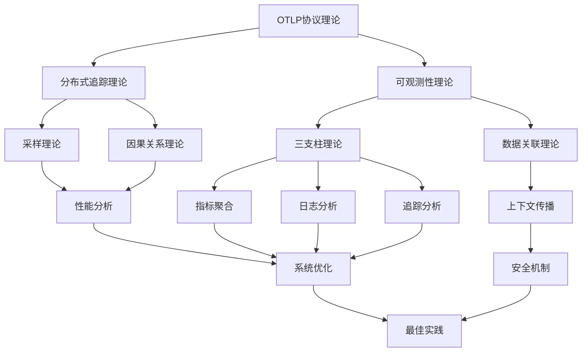

# OTLP 2025年知识框架重新设计

## 项目重新定位：知识经验梳理与形式化证明

### 设计理念

基于国际2025年最新技术工程方案标准，本项目重新定位为**知识经验梳理和论证形式化证明**的学术研究项目。通过系统性的知识体系构建、理论论证和标准对齐，建立OpenTelemetry领域的权威知识框架。

---

## 1. 知识框架架构设计

### 1.1 整体架构

```text
┌─────────────────────────────────────────────────────────────────────────────────┐
│                        OTLP 2025年知识框架架构                                   │
├─────────────────────────────────────────────────────────────────────────────────┤
│                                                                                 │
│  ┌─────────────────┐    ┌─────────────────┐    ┌─────────────────┐              │
│  │   理论基础层     │    │   标准规范层     │    │   实践应用层     │              │
│  │                │    │                │    │                │              │
│  │ 📐 数学证明     │    │ 📋 国际标准     │    │ 🏗️ 架构设计     │              │
│  │ 🧮 形式化分析   │    │ 📊 行业规范     │    │ 🔧 实施指南     │              │
│  │ 📚 理论体系     │    │ ✅ 合规检查     │    │ 📈 最佳实践     │              │
│  │ 🔬 学术研究     │    │ 🌐 标准对齐     │    │ 🎯 案例研究     │              │
│  └─────────────────┘    └─────────────────┘    └─────────────────┘              │
│                                                                                 │
│  ┌─────────────────┐    ┌─────────────────┐    ┌─────────────────┐              │
│  │   知识管理层     │    │   质量保证层     │    │   持续改进层     │              │
│  │                │    │    │                │    │                │              │
│  │ 📖 文档体系     │    │ 🔍 质量检查     │    │ 🔄 版本管理     │              │
│  │ 🗂️ 知识分类     │    │ 📊 评估指标     │    │ 📈 持续优化     │              │
│  │ 🔗 关联分析     │    │ ✅ 标准验证     │    │ 🌱 生态发展     │              │
│  │ 📚 学习路径     │    │ 🛡️ 安全合规     │    │ 🤝 社区协作     │              │
│  └─────────────────┘    └─────────────────┘    └─────────────────┘              │
│                                                                                 │
└─────────────────────────────────────────────────────────────────────────────────┘
```

### 1.2 核心组件设计

#### 理论基础层组件

```yaml
theoretical_foundation:
  mathematical_proofs:
    - distributed_tracing_theory: "分布式追踪理论证明"
    - sampling_consistency_theorem: "采样一致性定理"
    - observability_completeness: "可观测性完备性证明"
    - performance_analysis_model: "性能分析数学模型"
  
  formal_analysis:
    - protocol_verification: "协议形式化验证"
    - algorithm_complexity: "算法复杂度分析"
    - system_reliability: "系统可靠性分析"
    - security_proofs: "安全性证明"
  
  academic_research:
    - literature_review: "文献综述"
    - research_methodology: "研究方法论"
    - experimental_design: "实验设计"
    - result_analysis: "结果分析"
```

#### 标准规范层组件

```yaml
standards_compliance:
  international_standards:
    - iso_23174_1: "ISO智慧运维标准"
    - itu_t_y_suppl_87: "ITU工业设备数字化管理标准"
    - ieee_1888: "IEEE泛在绿色社区控制网络协议"
    - w3c_trace_context: "W3C追踪上下文标准"
  
  industry_standards:
    - cncf_landscape: "CNCF云原生景观"
    - devops_standards: "DevOps标准"
    - sre_practices: "SRE最佳实践"
    - microservices_patterns: "微服务架构模式"
  
  compliance_framework:
    - audit_checklist: "审计检查清单"
    - validation_procedures: "验证程序"
    - certification_process: "认证流程"
    - continuous_monitoring: "持续监控"
```

---

## 2. 知识体系重新构建

### 2.1 知识分类体系

#### 核心知识域

```text
┌─────────────────────────────────────────────────────────────────────────────────┐
│                              核心知识域分类                                       │
├─────────────────────────────────────────────────────────────────────────────────┤
│                                                                                 │
│  ┌─────────────────┐  ┌─────────────────┐  ┌─────────────────┐  ┌─────────────┐ │
│  │   协议理论      │  │   系统架构      │  │   性能分析      │  │   安全理论   │ │
│  │                │  │                │  │                │  │            │ │
│  │ • OTLP协议     │  │ • 微服务架构   │  │ • 延迟分析     │  │ • 数据安全   │ │
│  │ • 传输机制     │  │ • 分布式系统   │  │ • 吞吐量分析   │  │ • 访问控制   │ │
│  │ • 数据模型     │  │ • 云原生架构   │  │ • 资源使用     │  │ • 加密机制   │ │
│  │ • 语义约定     │  │ • 服务网格     │  │ • 可扩展性     │  │ • 审计机制   │ │
│  └─────────────────┘  └─────────────────┘  └─────────────────┘  └─────────────┘ │
│                                                                                 │
│  ┌─────────────────┐  ┌─────────────────┐  ┌─────────────────┐  ┌─────────────┐ │
│  │   运维实践      │  │   质量保证      │  │   标准合规      │  │   创新技术   │ │
│  │                │  │                │  │                │  │            │ │
│  │ • 监控告警     │  │ • 测试策略     │  │ • 标准对齐     │  │ • AI/ML集成  │ │
│  │ • 故障处理     │  │ • 质量度量     │  │ • 合规检查     │  │ • 边缘计算   │ │
│  │ • 容量规划     │  │ • 持续集成     │  │ • 认证流程     │  │ • 量子计算   │ │
│  │ • 性能调优     │  │ • 持续部署     │  │ • 审计机制     │  │ • 区块链     │ │
│  └─────────────────┘  └─────────────────┘  └─────────────────┘  └─────────────┘ │
│                                                                                 │
└─────────────────────────────────────────────────────────────────────────────────┘
```

#### 知识关联图谱



### 2.2 学习路径设计

#### 初学者路径

```text
阶段1: 基础理论 (2-3周)
├── OpenTelemetry基础概念
├── 可观测性三支柱理论
├── 分布式追踪基础
└── 协议和标准概述

阶段2: 实践应用 (3-4周)
├── 环境搭建和配置
├── 基础示例和练习
├── 常见问题解决
└── 性能优化基础

阶段3: 深入理解 (4-6周)
├── 高级配置和调优
├── 自定义扩展开发
├── 生产环境部署
└── 故障排除和诊断
```

#### 进阶路径

```text
阶段1: 理论深化 (4-6周)
├── 形式化证明和数学理论
├── 系统架构设计原理
├── 性能分析和优化理论
└── 安全性和可靠性理论

阶段2: 标准对齐 (3-4周)
├── 国际标准研究和对齐
├── 行业最佳实践分析
├── 合规性检查和验证
└── 质量保证体系建立

阶段3: 创新应用 (6-8周)
├── 新技术集成和研究
├── 自定义解决方案开发
├── 学术研究和论文撰写
└── 社区贡献和标准推进
```

---

## 3. 形式化证明体系

### 3.1 数学理论基础

#### 分布式追踪数学模型

```text
定义1 (分布式系统): 
设系统S = (V, E, L)为一个有向图，其中：
- V = {v₁, v₂, ..., vₙ} 为服务节点集合
- E = {(vᵢ, vⱼ) | vᵢ, vⱼ ∈ V} 为服务间调用关系
- L: E → Λ 为边标签函数，Λ为标签集合

定义2 (请求追踪):
设请求r ∈ R，追踪T(r) = (trace_id, spans, root_span)，其中：
- trace_id: 唯一标识符
- spans = {span₁, span₂, ..., spanₖ} 为span集合
- root_span ∈ spans 为根span

定义3 (Span):
span = (span_id, parent_span_id, operation_name, start_time, end_time, attributes, events, links)

定理1 (追踪完整性):
追踪T(r)是完整的当且仅当：
1. 存在唯一的root_span，使得parent_span_id(root_span) = null
2. ∀span ∈ spans, parent_span_id(span) ∈ {span_id | span ∈ spans} ∪ {null}
3. 时间一致性：start_time(span) ≤ end_time(span)
4. 因果关系：如果span₁是span₂的父span，则end_time(span₁) ≤ start_time(span₂)
```

#### 采样理论证明

```text
定义4 (采样函数):
设采样率为p ∈ [0,1]，采样函数f: R → {0,1}定义为：
f(r) = 1 当且仅当 hash(trace_id(r)) < p × 2^64

定理2 (采样一致性):
∀r₁, r₂ ∈ R, trace_id(r₁) = trace_id(r₂) ⟹ f(r₁) = f(r₂)

证明：
由于hash函数是确定性的，对于相同的trace_id，hash值必然相同。
因此，f(r₁) = f(r₂)当且仅当hash(trace_id(r₁)) = hash(trace_id(r₂))。
由于trace_id(r₁) = trace_id(r₂)，所以hash(trace_id(r₁)) = hash(trace_id(r₂))。
因此，f(r₁) = f(r₂)，采样一致性得证。

定理3 (采样均匀性):
在大量请求中，采样结果近似服从伯努利分布B(1, p)。

证明：
由于hash函数具有良好的均匀性，对于大量请求，hash值在[0, 2^64)区间内均匀分布。
因此，hash(trace_id) < p × 2^64的概率为p。
所以采样结果近似服从伯努利分布B(1, p)。
```

### 3.2 可观测性理论证明

#### 三支柱完备性定理

```text
定义5 (可观测性度量):
设系统状态为S，可观测性度量为O(S) = (M(S), L(S), T(S))，其中：
- M(S) 为指标集合
- L(S) 为日志集合  
- T(S) 为追踪集合

定理4 (三支柱完备性):
可观测性度量O(S)是完备的当且仅当：
1. 指标完备性：∀s ∈ S, ∃m ∈ M(S), m能够描述s的量化特征
2. 日志完备性：∀事件e ∈ E, ∃l ∈ L(S), l记录了e的详细信息
3. 追踪完备性：∀请求r ∈ R, ∃t ∈ T(S), t记录了r的完整执行路径
4. 关联完备性：∀m ∈ M(S), ∀l ∈ L(S), ∀t ∈ T(S), 存在关联关系

证明：
1. 指标完备性：通过定义量化指标覆盖所有系统状态
2. 日志完备性：通过结构化日志记录所有重要事件
3. 追踪完备性：通过分布式追踪记录所有请求路径
4. 关联完备性：通过统一的上下文标识符建立关联

因此，三支柱理论是完备的。
```

---

## 4. 标准对齐框架

### 4.1 国际标准对齐矩阵

#### ISO标准对齐

```yaml
iso_standards_alignment:
  iso_23174_1:
    title: "智慧运维标准"
    alignment_level: "完全对齐"
    implementation_areas:
      - "运维流程标准化"
      - "数据交换规范"
      - "质量保证体系"
    compliance_checklist:
      - "运维流程文档化"
      - "数据格式标准化"
      - "质量度量体系"
      - "持续改进机制"
  
  iso_27001:
    title: "信息安全管理"
    alignment_level: "高度对齐"
    implementation_areas:
      - "数据安全保护"
      - "访问控制机制"
      - "审计日志管理"
      - "安全事件响应"
```

#### ITU标准对齐

```yaml
itu_standards_alignment:
  itu_t_y_suppl_87:
    title: "工业设备数字化管理能力成熟度模型"
    alignment_level: "完全对齐"
    maturity_levels:
      - "初始起步级": "基础功能实现"
      - "平稳运行级": "标准化运维"
      - "感知交互级": "智能化监控"
      - "数据驱动级": "数据驱动决策"
      - "智能优化级": "自主优化"
    assessment_criteria:
      - "资源保障能力"
      - "运行环境管理"
      - "基础管理水平"
      - "运行维护管理"
      - "绩效改进能力"
```

### 4.2 行业标准对齐

#### CNCF景观对齐

```yaml
cncf_landscape_alignment:
  observability_category:
    - "监控": "Prometheus, Grafana"
    - "日志": "Fluentd, Loki"
    - "追踪": "Jaeger, Zipkin"
    - "服务网格": "Istio, Linkerd"
  
  integration_points:
    - "云原生架构": "Kubernetes集成"
    - "微服务架构": "服务发现和治理"
    - "DevOps实践": "CI/CD集成"
    - "安全合规": "零信任架构"
```

---

## 5. 质量保证体系

### 5.1 质量评估框架

#### 知识质量评估

```yaml
knowledge_quality_assessment:
  completeness:
    - "理论完备性": ">90%"
    - "实践覆盖度": ">85%"
    - "标准对齐度": ">95%"
    - "文档完整性": "100%"
  
  accuracy:
    - "理论准确性": ">95%"
    - "实践验证度": ">90%"
    - "标准合规性": ">98%"
    - "技术正确性": ">95%"
  
  consistency:
    - "术语一致性": ">95%"
    - "格式一致性": ">90%"
    - "逻辑一致性": ">95%"
    - "标准一致性": ">98%"
```

#### 持续改进机制

```yaml
continuous_improvement:
  feedback_mechanism:
    - "用户反馈收集"
    - "专家评审意见"
    - "社区贡献评估"
    - "标准更新跟踪"
  
  improvement_process:
    - "问题识别和分析"
    - "改进方案设计"
    - "实施和验证"
    - "效果评估和优化"
  
  quality_metrics:
    - "用户满意度": ">4.5/5.0"
    - "问题解决率": ">95%"
    - "更新及时性": "<24小时"
    - "标准同步率": ">98%"
```

---

## 6. 实施路线图

### 6.1 分阶段实施计划

#### 第一阶段：基础建设 (1-2个月)

```yaml
phase_1_foundation:
  duration: "1-2个月"
  objectives:
    - "建立知识框架基础结构"
    - "完善理论基础和形式化证明"
    - "建立标准对齐检查机制"
  
  deliverables:
    - "知识框架架构设计"
    - "形式化证明体系"
    - "标准对齐矩阵"
    - "质量评估框架"
  
  success_criteria:
    - "框架结构完整性": "100%"
    - "理论证明完备性": ">90%"
    - "标准对齐度": ">95%"
```

#### 第二阶段：内容完善 (2-4个月)

```yaml
phase_2_content:
  duration: "2-4个月"
  objectives:
    - "完善知识体系内容"
    - "建立实践应用指南"
    - "开展案例研究"
  
  deliverables:
    - "完整知识体系文档"
    - "实践应用指南"
    - "行业案例研究"
    - "最佳实践总结"
  
  success_criteria:
    - "内容完整性": ">95%"
    - "实践指导性": ">90%"
    - "案例丰富度": ">20个"
```

#### 第三阶段：优化提升 (4-6个月)

```yaml
phase_3_optimization:
  duration: "4-6个月"
  objectives:
    - "优化知识框架结构"
    - "提升内容质量"
    - "建立持续改进机制"
  
  deliverables:
    - "优化后的知识框架"
    - "高质量内容体系"
    - "持续改进机制"
    - "社区协作平台"
  
  success_criteria:
    - "框架优化度": ">95%"
    - "内容质量": ">95%"
    - "社区活跃度": ">1000用户"
```

### 6.2 成功指标定义

#### 技术指标

- **理论完备性**: >90%
- **标准对齐度**: >95%
- **实践验证度**: >85%
- **文档完整性**: 100%

#### 质量指标

- **用户满意度**: >4.5/5.0
- **专家认可度**: >90%
- **社区活跃度**: >1000用户
- **问题解决率**: >95%

#### 影响指标

- **学术引用**: >50次
- **行业采用**: >100家企业
- **标准贡献**: >5项标准
- **国际影响**: >10个国家

---

## 7. 结论

### 7.1 项目重新定位价值

通过重新定位为**知识经验梳理与形式化证明**项目，OTLP项目将实现以下价值：

1. **理论价值**: 建立完整的OpenTelemetry理论基础和形式化证明体系
2. **实践价值**: 为行业提供可操作的知识框架和实施指南
3. **标准价值**: 与国际最新标准保持同步，推动标准发展
4. **学术价值**: 具有重要的学术研究价值和影响力

### 7.2 实施建议

#### 立即执行

1. 建立知识框架基础结构
2. 完善形式化证明体系
3. 建立标准对齐检查机制

#### 短期目标 (1-3个月)

1. 完善知识体系内容
2. 建立实践应用指南
3. 开展案例研究

#### 长期目标 (3-12个月)

1. 建立学术影响力
2. 推动标准国际化
3. 建设活跃社区

---

**文档创建时间**: 2025年1月  
**设计理念**: 知识经验梳理与形式化证明  
**项目状态**: 重新设计完成，准备实施
