# OTLP 2025年项目结构优化

## 项目结构最终优化方案

### 优化概述

基于国际2025年最新技术工程方案标准，对OpenTelemetry知识经验梳理与形式化证明学术研究项目进行最终结构优化，确保项目结构清晰、逻辑合理、便于管理和维护。

---

## 1. 项目结构重新设计

### 1.1 新项目结构

#### 优化后的项目结构

```text
OTLP/
├── 📁 核心文档/
│   ├── README.md                                    # 项目主文档
│   ├── OTLP_2025_INTERNATIONAL_BENCHMARK_ANALYSIS.md # 国际对标分析
│   ├── OTLP_2025_KNOWLEDGE_FRAMEWORK_REDESIGN.md     # 知识框架重设计
│   ├── OTLP_2025_KNOWLEDGE_FRAMEWORK.md              # 知识框架文档
│   ├── OTLP_THEORETICAL_FOUNDATION.md                # 理论基础文档
│   ├── OTLP_EXECUTABLE_ROADMAP.md                    # 可执行路线图
│   └── OTLP_2025_FINAL_TRANSFORMATION_SUMMARY.md     # 最终转型总结
│
├── 📁 标准合规/
│   ├── OTLP_2025_STANDARDS_COMPLIANCE_FRAMEWORK.md   # 标准合规框架
│   ├── OTLP_2025_QUALITY_ASSURANCE_SYSTEM.md         # 质量保证体系
│   ├── OTLP_2025_VALIDATION_CHECKLIST.md             # 验证检查清单
│   └── OTLP_2025_PROJECT_METADATA.md                 # 项目元数据
│
├── 📁 社区建设/
│   ├── OTLP_2025_ACADEMIC_COMMUNITY_GUIDELINES.md    # 学术社区指导原则
│   ├── OTLP_2025_ACADEMIC_COLLABORATION_FRAMEWORK.md # 学术合作框架
│   └── OTLP_2025_CONTINUOUS_IMPROVEMENT_CYCLE.md     # 持续改进循环
│
├── 📁 监控评估/
│   ├── OTLP_2025_SUCCESS_METRICS_DASHBOARD.md        # 成功指标仪表板
│   └── OTLP_2025_PROJECT_STRUCTURE_OPTIMIZATION.md   # 项目结构优化
│
├── 📁 文档体系/
│   ├── docs/                                         # 技术文档
│   │   ├── INDEX.md                                  # 文档索引
│   │   ├── QUICK_START.md                            # 快速开始
│   │   ├── ARCHITECTURE.md                           # 架构设计
│   │   ├── API_REFERENCE.md                          # API参考
│   │   ├── FORMAL_PROOFS.md                          # 形式化证明
│   │   ├── DEPLOYMENT_GUIDE.md                       # 部署指南
│   │   ├── INTEGRATION_GUIDE.md                      # 集成指南
│   │   ├── PERFORMANCE_GUIDE.md                      # 性能指南
│   │   ├── SECURITY_GUIDE.md                         # 安全指南
│   │   ├── TROUBLESHOOTING.md                        # 故障排除
│   │   ├── TUTORIALS.md                              # 教程
│   │   ├── TERMS.md                                  # 术语定义
│   │   ├── SEMANTIC_CONVENTIONS.md                   # 语义约定
│   │   ├── COURSE_ALIGNMENT.md                       # 课程对齐
│   │   ├── FORMAT_STANDARDS.md                       # 格式标准
│   │   ├── TRANSLATION_TEMPLATE.md                   # 翻译模板
│   │   ├── QUALITY_REPORT.md                         # 质量报告
│   │   └── STATUS.md                                 # 文档状态
│   │
│   ├── spec/                                         # 规范文档
│   │   ├── OTLP_OVERVIEW.md                          # OTLP概述
│   │   ├── TRACES.md                                 # 追踪规范
│   │   ├── METRICS.md                                # 指标规范
│   │   └── LOGS.md                                   # 日志规范
│   │
│   └── governance/                                   # 治理文档
│       ├── BEST_PRACTICES.md                         # 最佳实践
│       ├── CHANGE_PROPOSAL_TEMPLATE.md               # 变更提案模板
│       ├── COMPLIANCE_CHECKLIST.md                   # 合规检查清单
│       └── STATUS.md                                 # 治理状态
│
├── 📁 技术实现/
│   ├── examples/                                     # 示例代码
│   │   ├── minimal-rust/                             # Rust最小示例
│   │   ├── minimal-go/                               # Go最小示例
│   │   ├── minimal-python/                           # Python最小示例
│   │   ├── minimal-javascript/                       # JavaScript最小示例
│   │   ├── minimal-java/                             # Java最小示例
│   │   └── STATUS.md                                 # 示例状态
│   │
│   ├── languages/                                    # 高级示例
│   │   ├── rust/                                     # Rust高级示例
│   │   ├── go/                                       # Go高级示例
│   │   ├── python/                                   # Python高级示例
│   │   └── STATUS.md                                 # 语言状态
│   │
│   ├── implementations/                              # 实现配置
│   │   ├── collector/                                # Collector配置
│   │   │   ├── minimal.yaml                          # 最小配置
│   │   │   ├── advanced.yaml                         # 高级配置
│   │   │   ├── security.yaml                         # 安全配置
│   │   │   ├── security-enhanced.yaml                # 增强安全配置
│   │   │   ├── export-*.yaml                         # 导出配置
│   │   │   ├── tracezip.yaml                         # Tracezip配置
│   │   │   ├── compose/                              # 组合配置
│   │   │   └── README.md                             # 配置说明
│   │   └── STATUS.md                                 # 实现状态
│   │
│   └── technologies/                                 # 技术组件
│       ├── tracezip/                                 # Tracezip技术
│       ├── crosstrace/                               # CrossTrace技术
│       └── atys/                                     # Atys技术
│
├── 📁 工具脚本/
│   ├── scripts/                                      # 自动化脚本
│   │   ├── version-check-*.ps1                       # 版本检查脚本
│   │   ├── doc-quality-check-*.ps1                   # 文档质量检查脚本
│   │   ├── generate-docs-*.ps1                       # 文档生成脚本
│   │   ├── run-collector-*.ps1                       # Collector运行脚本
│   │   ├── run-compose-*.ps1                         # 组合运行脚本
│   │   ├── test-integration-*.ps1                    # 集成测试脚本
│   │   ├── tech-integration-*.ps1                    # 技术集成脚本
│   │   ├── run-comprehensive-benchmark-*.ps1         # 综合基准测试脚本
│   │   ├── otlp-2025-executor.ps1                    # 2025年执行器脚本
│   │   ├── env-check-*.ps1                           # 环境检查脚本
│   │   ├── validate-docs-*.ps1                       # 文档验证脚本
│   │   └── publish-docs-*.ps1                        # 文档发布脚本
│   │
│   ├── benchmarks/                                   # 基准测试
│   │   ├── run-*.ps1                                 # 基准测试脚本
│   │   ├── REPORT_TEMPLATE.md                        # 报告模板
│   │   └── STATUS.md                                 # 基准测试状态
│   │
│   └── version-check-config.json                     # 版本检查配置
│
├── 📁 项目配置/
│   ├── Cargo.toml                                    # Rust项目配置
│   ├── Cargo.lock                                    # Rust依赖锁定
│   ├── LICENSE                                       # 许可证
│   └── .gitignore                                    # Git忽略文件
│
├── 📁 日志报告/
│   ├── logs/                                         # 日志文件
│   │   └── version-check-*.log                       # 版本检查日志
│   │
│   ├── reports/                                      # 报告文件
│   │   ├── config-test-*.md                          # 配置测试报告
│   │   ├── tech-integration-*.md                     # 技术集成报告
│   │   └── version-check-report-*.md                 # 版本检查报告
│   │
│   └── doc-quality-reports/                          # 文档质量报告
│       ├── doc-quality-check-*.log                   # 文档质量检查日志
│       └── doc-quality-report-*.md                   # 文档质量报告
│
└── 📁 构建输出/
    └── target/                                       # Rust构建输出
        ├── CACHEDIR.TAG                              # 缓存目录标记
        └── debug/                                    # 调试构建输出
```

### 1.2 结构优化原则

#### 优化设计原则

```yaml
optimization_principles:
  logical_organization:
    - "逻辑清晰": "按功能和用途组织文件"
    - "层次分明": "建立清晰的层次结构"
    - "易于导航": "便于用户导航和查找"
    - "便于维护": "便于项目维护和管理"
  
  functional_grouping:
    - "功能分组": "按功能对文件进行分组"
    - "相关聚合": "将相关文件聚合在一起"
    - "独立分离": "将独立功能分离"
    - "依赖管理": "合理管理文件依赖关系"
  
  scalability_design:
    - "可扩展性": "支持项目规模扩展"
    - "模块化": "采用模块化设计"
    - "可插拔": "支持组件可插拔"
    - "灵活性": "保持结构灵活性"
  
  user_experience:
    - "用户友好": "提供良好的用户体验"
    - "直观明了": "结构直观明了"
    - "快速定位": "支持快速定位文件"
    - "易于理解": "易于理解项目结构"
```

---

## 2. 目录结构详细说明

### 2.1 核心文档目录

#### 核心文档组织

```yaml
core_documents:
  purpose: "存放项目的核心文档和重要文件"
  
  files:
    - "README.md": "项目主文档，项目入口和概述"
    - "OTLP_2025_INTERNATIONAL_BENCHMARK_ANALYSIS.md": "国际对标分析报告"
    - "OTLP_2025_KNOWLEDGE_FRAMEWORK_REDESIGN.md": "知识框架重新设计"
    - "OTLP_2025_KNOWLEDGE_FRAMEWORK.md": "知识框架文档"
    - "OTLP_THEORETICAL_FOUNDATION.md": "理论基础文档"
    - "OTLP_EXECUTABLE_ROADMAP.md": "可执行路线图"
    - "OTLP_2025_FINAL_TRANSFORMATION_SUMMARY.md": "最终转型总结"
  
  organization_rationale:
    - "重要性": "这些文档是项目的核心，需要突出显示"
    - "访问频率": "这些文档访问频率最高"
    - "逻辑关系": "这些文档之间有紧密的逻辑关系"
    - "维护便利": "便于统一维护和管理"
```

### 2.2 标准合规目录

#### 标准合规组织

```yaml
standards_compliance:
  purpose: "存放标准合规相关的文档和配置"
  
  files:
    - "OTLP_2025_STANDARDS_COMPLIANCE_FRAMEWORK.md": "标准合规框架"
    - "OTLP_2025_QUALITY_ASSURANCE_SYSTEM.md": "质量保证体系"
    - "OTLP_2025_VALIDATION_CHECKLIST.md": "验证检查清单"
    - "OTLP_2025_PROJECT_METADATA.md": "项目元数据"
  
  organization_rationale:
    - "功能相关": "这些文档都与标准合规相关"
    - "使用场景": "在标准合规检查时一起使用"
    - "维护便利": "便于统一维护和更新"
    - "逻辑清晰": "逻辑关系清晰明确"
```

### 2.3 社区建设目录

#### 社区建设组织

```yaml
community_building:
  purpose: "存放社区建设相关的文档和指南"
  
  files:
    - "OTLP_2025_ACADEMIC_COMMUNITY_GUIDELINES.md": "学术社区指导原则"
    - "OTLP_2025_ACADEMIC_COLLABORATION_FRAMEWORK.md": "学术合作框架"
    - "OTLP_2025_CONTINUOUS_IMPROVEMENT_CYCLE.md": "持续改进循环"
  
  organization_rationale:
    - "主题相关": "这些文档都与社区建设相关"
    - "使用场景": "在社区建设时一起使用"
    - "维护便利": "便于统一维护和更新"
    - "逻辑清晰": "逻辑关系清晰明确"
```

### 2.4 监控评估目录

#### 监控评估组织

```yaml
monitoring_evaluation:
  purpose: "存放监控评估相关的文档和工具"
  
  files:
    - "OTLP_2025_SUCCESS_METRICS_DASHBOARD.md": "成功指标仪表板"
    - "OTLP_2025_PROJECT_STRUCTURE_OPTIMIZATION.md": "项目结构优化"
  
  organization_rationale:
    - "功能相关": "这些文档都与监控评估相关"
    - "使用场景": "在监控评估时一起使用"
    - "维护便利": "便于统一维护和更新"
    - "逻辑清晰": "逻辑关系清晰明确"
```

---

## 3. 文件命名规范

### 3.1 命名规范

#### 文件命名规则

```yaml
naming_conventions:
  core_documents:
    - "格式": "OTLP_YYYY_TOPIC_NAME.md"
    - "示例": "OTLP_2025_INTERNATIONAL_BENCHMARK_ANALYSIS.md"
    - "说明": "核心文档使用统一的前缀和格式"
  
  technical_documents:
    - "格式": "TOPIC_NAME.md"
    - "示例": "ARCHITECTURE.md"
    - "说明": "技术文档使用简洁的命名"
  
  configuration_files:
    - "格式": "CONFIG_NAME.yaml"
    - "示例": "minimal.yaml"
    - "说明": "配置文件使用描述性命名"
  
  script_files:
    - "格式": "ACTION_NAME-YYYY.ps1"
    - "示例": "version-check-2025.ps1"
    - "说明": "脚本文件包含动作和年份"
  
  report_files:
    - "格式": "REPORT_TYPE-YYYY-MM-DD-HHMM.md"
    - "示例": "config-test-2025-09-19-2315.md"
    - "说明": "报告文件包含类型和时间戳"
```

### 3.2 目录命名规范

#### 目录命名规则

```yaml
directory_naming:
  functional_directories:
    - "格式": "功能名称"
    - "示例": "核心文档", "标准合规", "社区建设"
    - "说明": "使用中文描述功能"
  
  technical_directories:
    - "格式": "技术名称"
    - "示例": "docs", "spec", "governance"
    - "说明": "使用英文技术术语"
  
  implementation_directories:
    - "格式": "实现类型"
    - "示例": "examples", "languages", "implementations"
    - "说明": "使用英文实现术语"
  
  tool_directories:
    - "格式": "工具类型"
    - "示例": "scripts", "benchmarks"
    - "说明": "使用英文工具术语"
```

---

## 4. 文档链接关系

### 4.1 链接关系图

#### 文档链接网络

```mermaid
graph TB
    A[README.md] --> B[OTLP_2025_INTERNATIONAL_BENCHMARK_ANALYSIS.md]
    A --> C[OTLP_2025_KNOWLEDGE_FRAMEWORK_REDESIGN.md]
    A --> D[docs/INDEX.md]
    A --> E[docs/QUICK_START.md]
    
    B --> F[OTLP_2025_STANDARDS_COMPLIANCE_FRAMEWORK.md]
    B --> G[OTLP_2025_QUALITY_ASSURANCE_SYSTEM.md]
    
    C --> H[OTLP_2025_KNOWLEDGE_FRAMEWORK.md]
    C --> I[OTLP_THEORETICAL_FOUNDATION.md]
    
    D --> J[docs/ARCHITECTURE.md]
    D --> K[docs/FORMAL_PROOFS.md]
    D --> L[docs/API_REFERENCE.md]
    
    F --> M[OTLP_2025_VALIDATION_CHECKLIST.md]
    F --> N[OTLP_2025_PROJECT_METADATA.md]
    
    G --> O[OTLP_2025_SUCCESS_METRICS_DASHBOARD.md]
    G --> P[OTLP_2025_CONTINUOUS_IMPROVEMENT_CYCLE.md]
    
    H --> Q[OTLP_2025_ACADEMIC_COMMUNITY_GUIDELINES.md]
    H --> R[OTLP_2025_ACADEMIC_COLLABORATION_FRAMEWORK.md]
    
    I --> S[docs/FORMAL_PROOFS.md]
    I --> T[docs/ARCHITECTURE.md]
    
    J --> U[examples/]
    J --> V[implementations/]
    
    K --> W[languages/]
    K --> X[technologies/]
```



### 4.2 导航结构

#### 导航层次结构

```yaml
navigation_structure:
  level_1:
    - "项目概述": "README.md"
    - "国际对标": "OTLP_2025_INTERNATIONAL_BENCHMARK_ANALYSIS.md"
    - "知识框架": "OTLP_2025_KNOWLEDGE_FRAMEWORK_REDESIGN.md"
    - "文档索引": "docs/INDEX.md"
  
  level_2:
    - "标准合规": "OTLP_2025_STANDARDS_COMPLIANCE_FRAMEWORK.md"
    - "质量保证": "OTLP_2025_QUALITY_ASSURANCE_SYSTEM.md"
    - "社区建设": "OTLP_2025_ACADEMIC_COMMUNITY_GUIDELINES.md"
    - "监控评估": "OTLP_2025_SUCCESS_METRICS_DASHBOARD.md"
  
  level_3:
    - "技术文档": "docs/"
    - "示例代码": "examples/"
    - "实现配置": "implementations/"
    - "工具脚本": "scripts/"
  
  level_4:
    - "具体文档": "具体的技术文档"
    - "具体示例": "具体的代码示例"
    - "具体配置": "具体的配置文件"
    - "具体脚本": "具体的脚本文件"
```

---

## 5. 维护管理

### 5.1 维护策略

#### 维护管理框架

```yaml
maintenance_strategy:
  regular_maintenance:
    - "定期检查": "定期检查文件完整性"
    - "链接验证": "验证文档链接有效性"
    - "内容更新": "更新过时内容"
    - "格式统一": "统一文档格式"
  
  version_management:
    - "版本控制": "使用Git进行版本控制"
    - "版本标记": "为重要版本添加标记"
    - "变更记录": "记录重要变更"
    - "回滚机制": "提供回滚机制"
  
  quality_assurance:
    - "质量检查": "定期进行质量检查"
    - "标准验证": "验证文档标准符合性"
    - "用户反馈": "收集用户反馈"
    - "持续改进": "持续改进文档质量"
  
  backup_recovery:
    - "定期备份": "定期备份重要文件"
    - "灾难恢复": "建立灾难恢复机制"
    - "数据保护": "保护重要数据"
    - "恢复测试": "定期进行恢复测试"
```

### 5.2 更新机制

#### 更新管理流程

```yaml
update_mechanism:
  update_triggers:
    - "内容变更": "内容发生重大变更"
    - "标准更新": "相关标准更新"
    - "用户反馈": "用户反馈需要更新"
    - "定期更新": "定期更新计划"
  
  update_process:
    - "变更识别": "识别需要更新的内容"
    - "影响评估": "评估更新影响"
    - "更新实施": "实施更新"
    - "验证测试": "验证更新效果"
  
  update_validation:
    - "内容验证": "验证更新内容"
    - "链接验证": "验证链接有效性"
    - "格式验证": "验证格式正确性"
    - "功能验证": "验证功能正确性"
  
  update_communication:
    - "变更通知": "通知相关用户"
    - "更新说明": "提供更新说明"
    - "培训支持": "提供培训支持"
    - "反馈收集": "收集用户反馈"
```

---

## 6. 访问控制

### 6.1 权限管理

#### 访问权限设计

```yaml
access_control:
  permission_levels:
    - "公开访问": "所有用户都可以访问"
    - "注册访问": "注册用户才能访问"
    - "授权访问": "需要授权才能访问"
    - "内部访问": "仅内部用户访问"
  
  user_roles:
    - "访客": "只能查看公开内容"
    - "用户": "可以查看和下载内容"
    - "贡献者": "可以编辑和贡献内容"
    - "维护者": "可以管理项目内容"
  
  content_protection:
    - "版权保护": "保护文档版权"
    - "访问控制": "控制访问权限"
    - "使用限制": "限制使用方式"
    - "责任声明": "明确责任声明"
  
  security_measures:
    - "身份验证": "验证用户身份"
    - "授权检查": "检查用户权限"
    - "访问日志": "记录访问日志"
    - "安全监控": "监控安全事件"
```

### 6.2 使用规范

#### 使用规范定义

```yaml
usage_guidelines:
  acceptable_use:
    - "学术研究": "用于学术研究目的"
    - "教育用途": "用于教育目的"
    - "个人学习": "用于个人学习"
    - "商业应用": "用于商业应用"
  
  prohibited_use:
    - "恶意使用": "禁止恶意使用"
    - "版权侵犯": "禁止侵犯版权"
    - "非法活动": "禁止用于非法活动"
    - "商业盗用": "禁止商业盗用"
  
  attribution_requirements:
    - "引用要求": "使用需要引用"
    - "版权声明": "保留版权声明"
    - "来源标注": "标注来源信息"
    - "许可遵守": "遵守许可条款"
  
  reporting_requirements:
    - "使用报告": "报告使用情况"
    - "问题报告": "报告发现的问题"
    - "改进建议": "提供改进建议"
    - "反馈信息": "提供反馈信息"
```

---

## 7. 性能优化

### 7.1 加载优化

#### 性能优化策略

```yaml
performance_optimization:
  loading_optimization:
    - "懒加载": "实现懒加载机制"
    - "缓存策略": "实施缓存策略"
    - "压缩优化": "压缩文件大小"
    - "CDN加速": "使用CDN加速"
  
  navigation_optimization:
    - "索引优化": "优化文档索引"
    - "搜索优化": "优化搜索功能"
    - "导航优化": "优化导航结构"
    - "链接优化": "优化链接结构"
  
  content_optimization:
    - "内容压缩": "压缩内容大小"
    - "格式优化": "优化内容格式"
    - "图片优化": "优化图片资源"
    - "代码优化": "优化代码示例"
  
  user_experience:
    - "响应速度": "提升响应速度"
    - "界面友好": "提供友好界面"
    - "操作简便": "简化操作流程"
    - "错误处理": "改善错误处理"
```

### 7.2 可扩展性

#### 可扩展性设计

```yaml
scalability_design:
  horizontal_scaling:
    - "模块化": "采用模块化设计"
    - "分布式": "支持分布式部署"
    - "负载均衡": "实现负载均衡"
    - "弹性扩展": "支持弹性扩展"
  
  vertical_scaling:
    - "资源优化": "优化资源使用"
    - "性能提升": "提升系统性能"
    - "容量扩展": "扩展系统容量"
    - "功能增强": "增强系统功能"
  
  content_scaling:
    - "内容管理": "支持大量内容"
    - "版本管理": "支持多版本管理"
    - "多语言": "支持多语言内容"
    - "个性化": "支持个性化内容"
  
  user_scaling:
    - "用户管理": "支持大量用户"
    - "权限管理": "支持复杂权限"
    - "个性化": "支持个性化服务"
    - "协作功能": "支持协作功能"
```

---

## 8. 迁移计划

### 8.1 迁移策略

#### 迁移实施计划

```yaml
migration_strategy:
  migration_phases:
    - "准备阶段": "准备迁移工作"
    - "实施阶段": "实施迁移"
    - "验证阶段": "验证迁移结果"
    - "完成阶段": "完成迁移工作"
  
  migration_approach:
    - "渐进式迁移": "采用渐进式迁移"
    - "零停机迁移": "实现零停机迁移"
    - "数据完整性": "保证数据完整性"
    - "回滚准备": "准备回滚方案"
  
  migration_validation:
    - "功能验证": "验证功能正确性"
    - "性能验证": "验证性能表现"
    - "兼容性验证": "验证兼容性"
    - "用户体验验证": "验证用户体验"
  
  migration_communication:
    - "迁移通知": "通知用户迁移"
    - "进度更新": "更新迁移进度"
    - "问题处理": "处理迁移问题"
    - "完成确认": "确认迁移完成"
```

### 8.2 风险控制

#### 迁移风险控制

```yaml
risk_control:
  risk_identification:
    - "数据丢失风险": "识别数据丢失风险"
    - "功能中断风险": "识别功能中断风险"
    - "性能下降风险": "识别性能下降风险"
    - "用户影响风险": "识别用户影响风险"
  
  risk_mitigation:
    - "数据备份": "进行数据备份"
    - "功能测试": "进行功能测试"
    - "性能测试": "进行性能测试"
    - "用户通知": "提前通知用户"
  
  risk_monitoring:
    - "实时监控": "实时监控迁移过程"
    - "问题跟踪": "跟踪迁移问题"
    - "性能监控": "监控系统性能"
    - "用户反馈": "收集用户反馈"
  
  risk_response:
    - "问题处理": "及时处理问题"
    - "回滚机制": "准备回滚机制"
    - "应急计划": "制定应急计划"
    - "沟通机制": "建立沟通机制"
```

---

## 9. 结论

### 9.1 结构优化价值

通过项目结构优化，将实现：

1. **清晰组织**: 建立清晰的项目组织结构
2. **易于维护**: 便于项目维护和管理
3. **用户友好**: 提供良好的用户体验
4. **可扩展性**: 支持项目规模扩展

### 9.2 实施建议

#### 立即执行

1. 实施新的项目结构
2. 更新文档链接关系
3. 建立维护管理机制
4. 实施访问控制

#### 短期目标

1. 完善文档导航
2. 优化用户体验
3. 建立更新机制
4. 实施性能优化

#### 长期目标

1. 持续结构优化
2. 支持大规模扩展
3. 建立智能导航
4. 实现个性化服务

---

**结构优化完成时间**: 2025年1月  
**优化状态**: 设计完成，准备实施  
**下一步**: 开始实施新的项目结构
