# 📊 OTLP项目多维思维表征体系

> **创建时间**: 2025年12月
> **文档类型**: 思维表征可视化
> **覆盖范围**: 全项目主题

---

## 📋 目录

- [📊 OTLP项目多维思维表征体系](#-otlp项目多维思维表征体系)
  - [📋 目录](#-目录)
  - [1. 思维导图体系](#1-思维导图体系)
    - [1.1 项目总体架构思维导图](#11-项目总体架构思维导图)
    - [1.2 理论框架思维导图](#12-理论框架思维导图)
    - [1.3 技术栈思维导图](#13-技术栈思维导图)
  - [2. 概念定义关系矩阵](#2-概念定义关系矩阵)
    - [2.1 核心概念关系矩阵](#21-核心概念关系矩阵)
    - [2.2 概念层次关系](#22-概念层次关系)
    - [2.3 概念依赖关系图](#23-概念依赖关系图)
  - [3. 决策树图](#3-决策树图)
    - [3.1 OTLP实施决策树](#31-otlp实施决策树)
    - [3.2 故障排查决策树](#32-故障排查决策树)
  - [4. 证明树图](#4-证明树图)
    - [4.1 协议正确性证明树](#41-协议正确性证明树)
    - [4.2 采样策略正确性证明树](#42-采样策略正确性证明树)
  - [5. 控制执行数据流图](#5-控制执行数据流图)
    - [5.1 OTLP端到端数据流图](#51-otlp端到端数据流图)
    - [5.2 Context传播数据流](#52-context传播数据流)
    - [5.3 Collector处理流程](#53-collector处理流程)
  - [6. 论证思维图](#6-论证思维图)
    - [6.1 OTLP价值论证图](#61-otlp价值论证图)
    - [6.2 采样策略论证图](#62-采样策略论证图)
  - [7. 主题关联网络图](#7-主题关联网络图)
    - [7.1 主题依赖网络](#71-主题依赖网络)
    - [7.2 主题协作网络](#72-主题协作网络)
  - [8. 时间线演进图](#8-时间线演进图)
    - [8.1 项目发展时间线](#81-项目发展时间线)
    - [8.2 OpenTelemetry标准演进](#82-opentelemetry标准演进)
  - [9. 按内容范围（OTLP / Metrics / Logs）的思维表征](#9-按内容范围otlp--metrics--logs的思维表征)
    - [9.1 公理/定理推理梳理树图（范围专用）](#91-公理定理推理梳理树图范围专用)
    - [9.2 应用树图（按三条范围的应用场景）](#92-应用树图按三条范围的应用场景)
    - [9.3 场景与实践树图](#93-场景与实践树图)
    - [9.4 决策/权衡树图（范围扩展）](#94-决策权衡树图范围扩展)
  - [按内容范围（OTLP / Metrics / Logs）的思维表征索引](#按内容范围otlp--metrics--logs的思维表征索引)
  - [10. 按文档模块的思维表征索引](#10-按文档模块的思维表征索引)
    - [10.1 语义约定模块](#101-语义约定模块02_semantic_conventions)
    - [10.2 核心组件模块](#102-核心组件模块04_核心组件)
    - [10.3 采样与性能、实战案例、安全与合规](#103-采样与性能实战案例安全与合规)
  - [总结](#总结)

---

## 1. 思维导图体系

### 1.1 项目总体架构思维导图

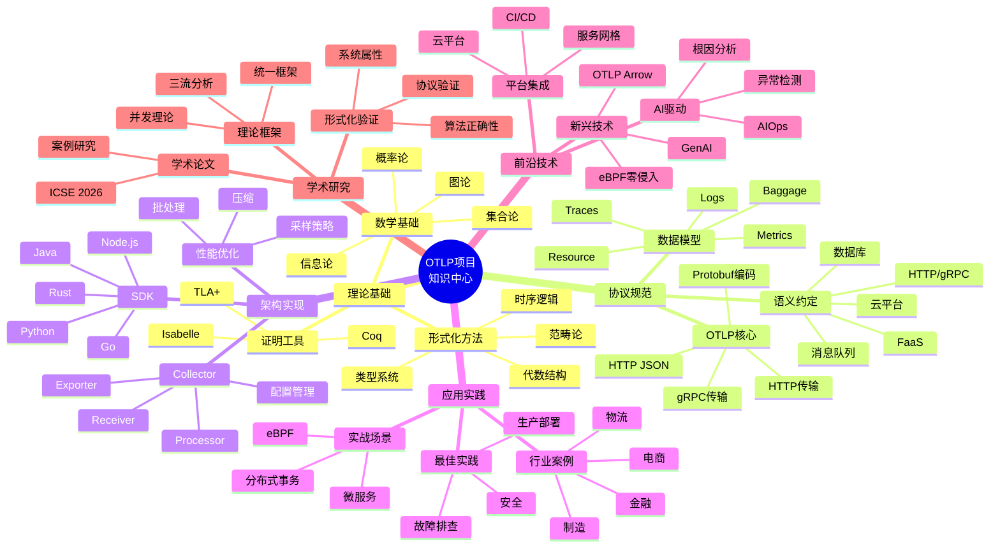

### 1.2 理论框架思维导图

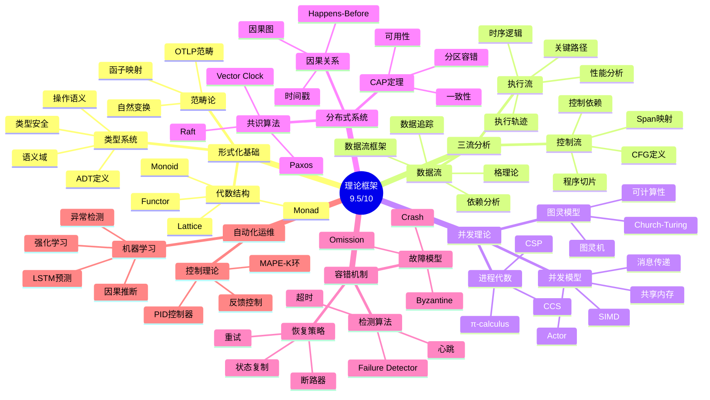

### 1.3 技术栈思维导图

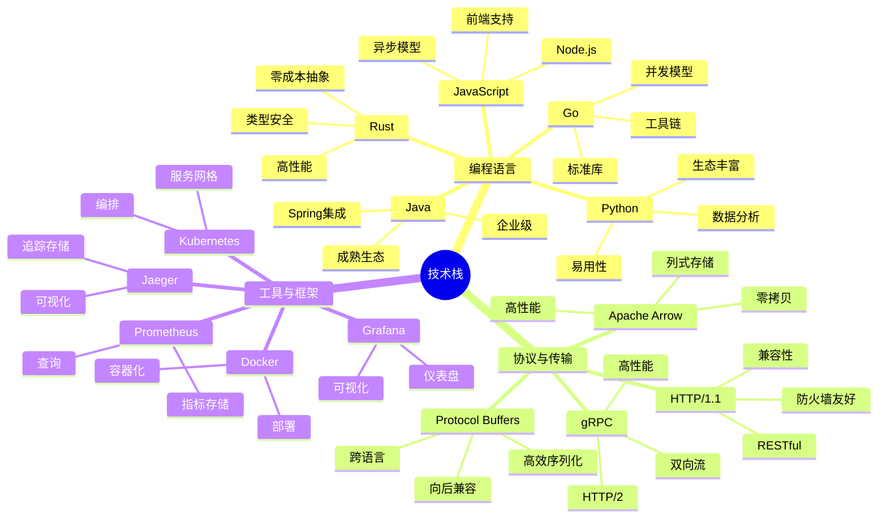

---

## 2. 概念定义关系矩阵

### 2.1 核心概念关系矩阵

| 概念 | 定义 | 关键属性 | 关系 | 应用场景 | 形式化表示 |
|------|------|---------|------|---------|-----------|
| **Trace** | 一次完整请求的执行记录 | trace_id, spans[], duration | 包含多个Span | 分布式追踪 | `Trace = {trace_id: TraceId, spans: List[Span]}` |
| **Span** | 单个操作的记录 | span_id, parent_id, start_time, end_time, attributes | 属于Trace，可能有子Span | 操作追踪 | `Span = {span_id: SpanId, parent_id: Option[SpanId], ...}` |
| **Context** | 传播的上下文信息 | trace_id, span_id, baggage | 在Span间传播 | 跨服务追踪 | `Context = {trace_id: TraceId, span_id: SpanId, baggage: Map[String, String]}` |
| **Resource** | 产生遥测数据的实体 | service.name, host.name, attributes | 关联Traces/Metrics/Logs | 资源标识 | `Resource = {attributes: Map[String, AttributeValue]}` |
| **Metric** | 数值型指标 | name, value, timestamp, attributes | 独立或关联Trace | 性能监控 | `Metric = {name: String, value: Number, timestamp: Timestamp}` |
| **Log** | 文本型日志 | timestamp, severity, message, attributes | 可关联Trace | 问题诊断 | `Log = {timestamp: Timestamp, severity: Severity, message: String}` |
| **Baggage** | 跨服务传递的键值对 | key-value pairs | 随Context传播 | 灰度/染色 | `Baggage = Map[String, String]` |
| **Sampling** | 数据采样策略 | ratio, rules, strategy | 控制数据量 | 成本优化 | `Sampling: Trace → Bool` |
| **Collector** | 数据收集处理组件 | receivers[], processors[], exporters[] | 连接SDK和后端 | 数据管道 | `Collector = {receivers: List[Receiver], processors: List[Processor], exporters: List[Exporter]}` |
| **Semantic Convention** | 语义约定标准 | 属性命名规范 | 统一语义 | 互操作性 | `SemanticConvention: AttributeName → SemanticType` |

### 2.2 概念层次关系

```text
OTLP概念体系
│
├── 数据概念层 (Data Concepts)
│   ├── Trace (追踪)
│   │   ├── trace_id: TraceId
│   │   ├── spans: List[Span]
│   │   └── duration: Duration
│   │
│   ├── Span (片段)
│   │   ├── span_id: SpanId
│   │   ├── parent_span_id: Option[SpanId]
│   │   ├── trace_id: TraceId
│   │   ├── name: String
│   │   ├── kind: SpanKind
│   │   ├── start_time: Timestamp
│   │   ├── end_time: Timestamp
│   │   ├── attributes: Map[String, AttributeValue]
│   │   ├── events: List[Event]
│   │   ├── links: List[Link]
│   │   └── status: SpanStatus
│   │
│   ├── Metric (指标)
│   │   ├── name: String
│   │   ├── description: String
│   │   ├── unit: String
│   │   ├── data: MetricData
│   │   └── attributes: Map[String, AttributeValue]
│   │
│   └── Log (日志)
│       ├── timestamp: Timestamp
│       ├── severity: LogSeverity
│       ├── body: String
│       ├── attributes: Map[String, AttributeValue]
│       ├── trace_id: Option[TraceId]
│       └── span_id: Option[SpanId]
│
├── 上下文概念层 (Context Concepts)
│   ├── Context (上下文)
│   │   ├── trace_context: TraceContext
│   │   └── baggage: Baggage
│   │
│   └── Resource (资源)
│       └── attributes: Map[String, AttributeValue]
│
├── 协议概念层 (Protocol Concepts)
│   ├── OTLP (协议)
│   │   ├── ExportTraceServiceRequest
│   │   ├── ExportMetricsServiceRequest
│   │   ├── ExportLogsServiceRequest
│   │   └── ExportServiceResponse
│   │
│   └── Semantic Convention (语义约定)
│       ├── HTTP约定
│       ├── gRPC约定
│       ├── 数据库约定
│       └── 消息队列约定
│
└── 架构概念层 (Architecture Concepts)
    ├── SDK (软件开发包)
    │   ├── Tracer (追踪器)
    │   ├── Meter (计量器)
    │   └── Logger (日志器)
    │
    ├── Collector (收集器)
    │   ├── Receiver (接收器)
    │   ├── Processor (处理器)
    │   └── Exporter (导出器)
    │
    └── Backend (后端)
        ├── Jaeger (Traces)
        ├── Prometheus (Metrics)
        └── Loki (Logs)
```

### 2.3 概念依赖关系图

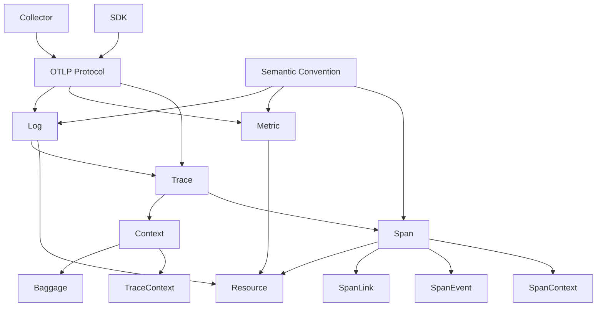

---

## 3. 决策树图

### 3.1 OTLP实施决策树

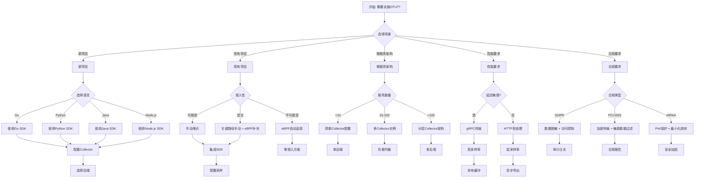

### 3.2 故障排查决策树

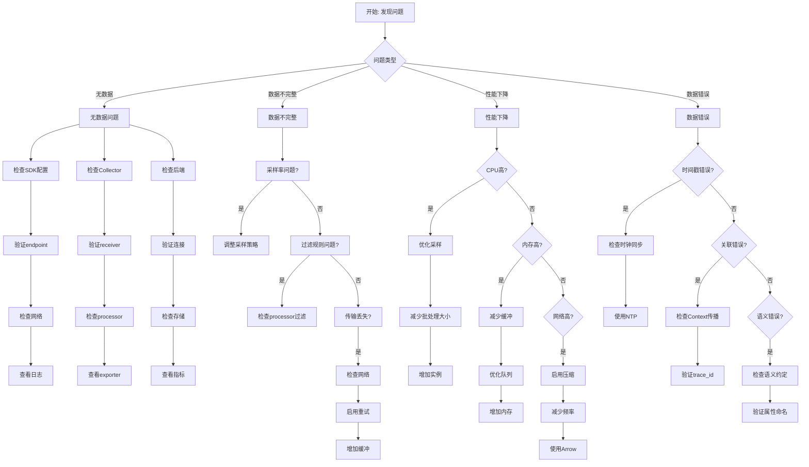

---

## 4. 证明树图

### 4.1 协议正确性证明树

```mermaid
graph TD
    Root[OTLP协议正确性] --> T1[定理1: 数据完整性]
    Root --> T2[定理2: 传输可靠性]
    Root --> T3[定理3: 语义一致性]

    T1 --> L1_1[引理1.1: Span树结构保持]
    T1 --> L1_2[引理1.2: 时间戳单调性]
    T1 --> L1_3[引理1.3: 因果关系保持]

    L1_1 --> P1_1_1[证明: parent_span_id约束]
    L1_1 --> P1_1_2[证明: trace_id一致性]

    L1_2 --> P1_2_1[证明: start_time ≤ end_time]
    L1_2 --> P1_2_2[证明: 子Span时间包含]

    L1_3 --> P1_3_1[证明: Happens-Before关系]
    L1_3 --> P1_3_2[证明: Vector Clock更新]

    T2 --> L2_1[引理2.1: 重试语义正确]
    T2 --> L2_2[引理2.2: 背压处理]
    T2 --> L2_3[引理2.3: 错误恢复]

    L2_1 --> P2_1_1[证明: 幂等性保证]
    L2_1 --> P2_1_2[证明: 指数退避收敛]

    L2_2 --> P2_2_1[证明: 队列有界性]
    L2_2 --> P2_2_2[证明: 丢弃策略正确]

    L2_3 --> P2_3_1[证明: 可重试错误分类]
    L2_3 --> P2_3_2[证明: 不可重试错误处理]

    T3 --> L3_1[引理3.1: 语义约定遵循]
    T3 --> L3_2[引理3.2: 跨语言互操作]
    T3 --> L3_3[引理3.3: 版本兼容性]

    L3_1 --> P3_1_1[证明: 属性命名规范]
    L3_1 --> P3_1_2[证明: 类型系统约束]

    L3_2 --> P3_2_1[证明: 协议格式统一]
    L3_2 --> P3_2_2[证明: 语义映射正确]

    L3_3 --> P3_3_1[证明: 向后兼容保证]
    L3_3 --> P3_3_2[证明: 未知字段处理]
```

### 4.2 采样策略正确性证明树

```mermaid
graph TD
    Root[采样策略正确性] --> T4[定理4: 采样无偏性]
    Root --> T5[定理5: 采样效率]

    T4 --> L4_1[引理4.1: 随机采样期望]
    T4 --> L4_2[引理4.2: 分层采样保持]
    T4 --> L4_3[引理4.3: 自适应采样收敛]

    L4_1 --> P4_1_1[证明: E[sample_rate] = p]
    L4_1 --> P4_1_2[证明: 方差有界]

    L4_2 --> P4_2_1[证明: 每层独立采样]
    L4_2 --> P4_2_2[证明: 总体概率乘积]

    L4_3 --> P4_3_1[证明: 目标采样率收敛]
    L4_3 --> P4_3_2[证明: 误差有界]

    T5 --> L5_1[引理5.1: 存储节省]
    T5 --> L5_2[引理5.2: 信息损失上界]
    T5 --> L5_3[引理5.3: 计算复杂度]

    L5_1 --> P5_1_1[证明: 存储量 = O(p × n)]
    L5_1 --> P5_1_2[证明: 压缩率分析]

    L5_2 --> P5_2_1[证明: 关键路径保留概率]
    L5_2 --> P5_2_2[证明: 异常检测覆盖率]

    L5_3 --> P5_3_1[证明: 采样决策O(1)]
    L5_3 --> P5_3_2[证明: 批处理优化]
```

---

## 5. 控制执行数据流图

### 5.1 OTLP端到端数据流图

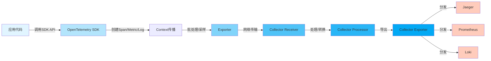

### 5.2 Context传播数据流

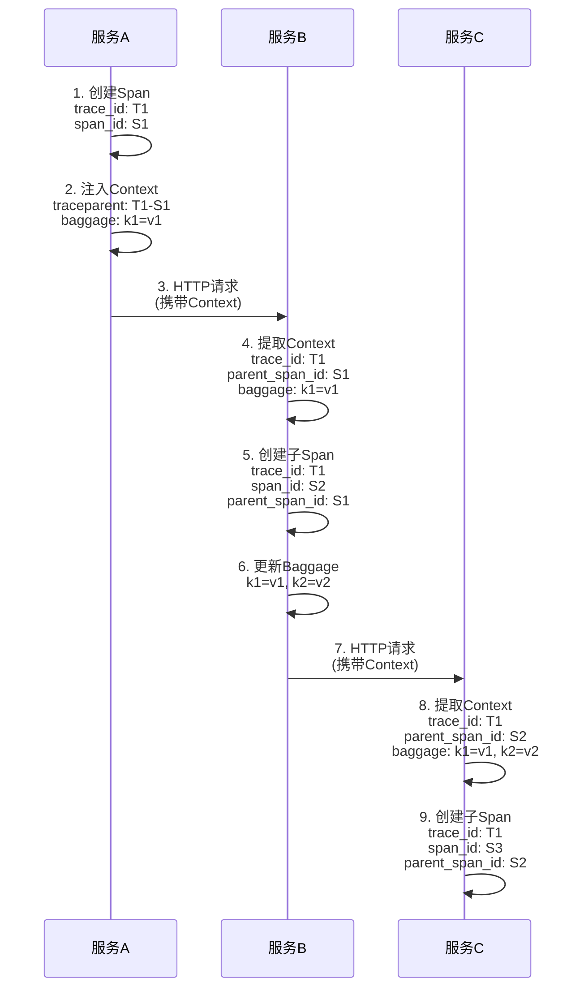

### 5.3 Collector处理流程

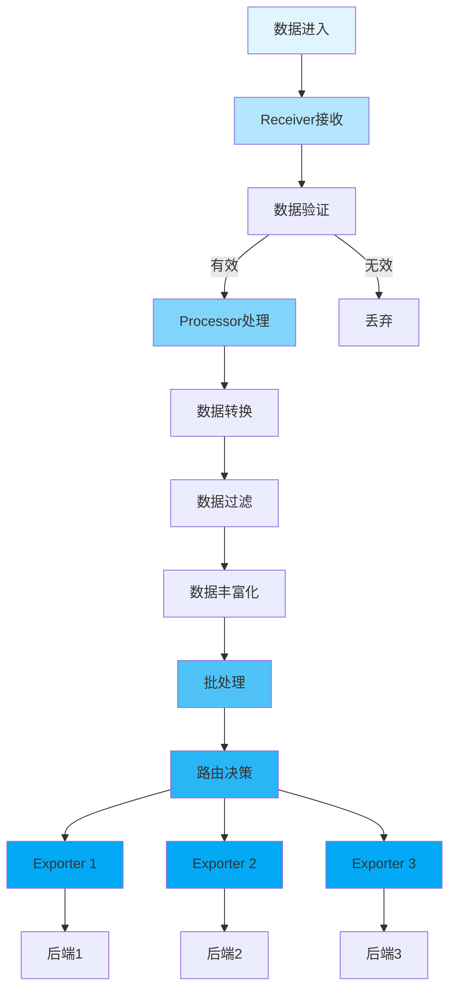

---

## 6. 论证思维图

### 6.1 OTLP价值论证图

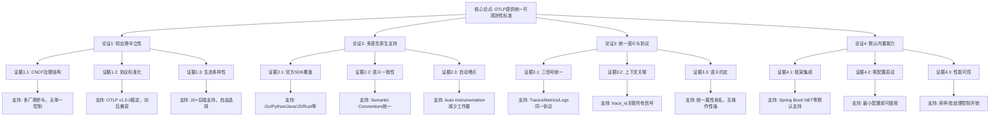

### 6.2 采样策略论证图

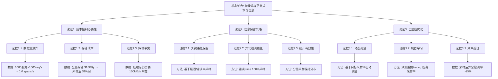

---

## 7. 主题关联网络图

### 7.1 主题依赖网络

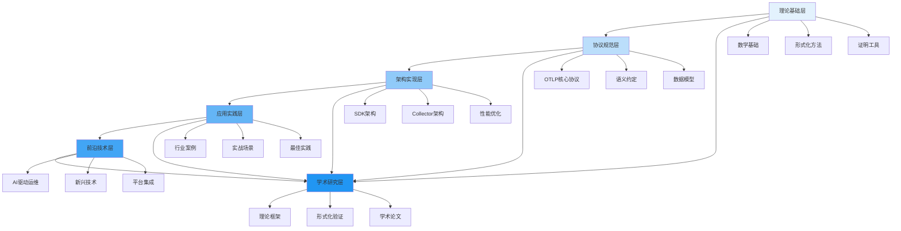

### 7.2 主题协作网络

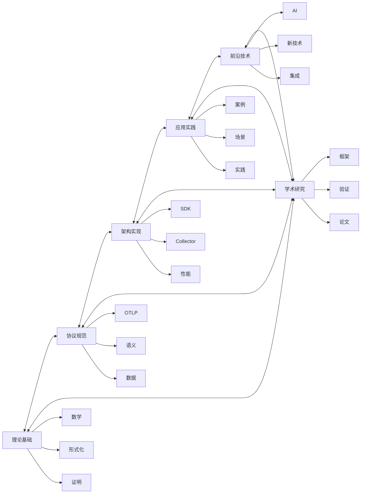

---

## 8. 时间线演进图

### 8.1 项目发展时间线

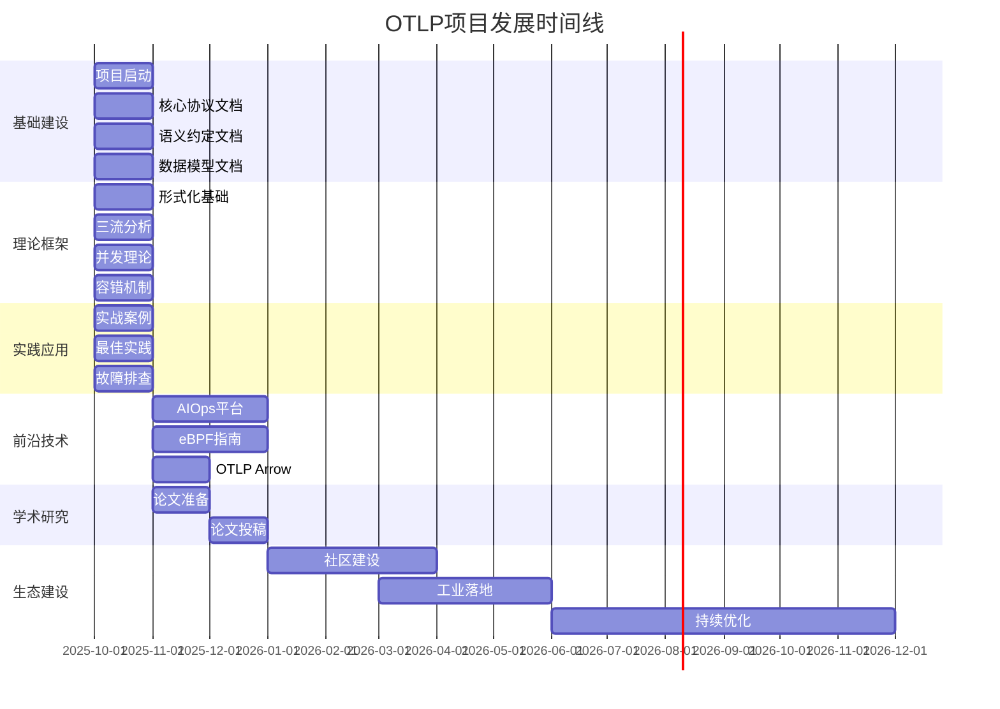

### 8.2 OpenTelemetry标准演进

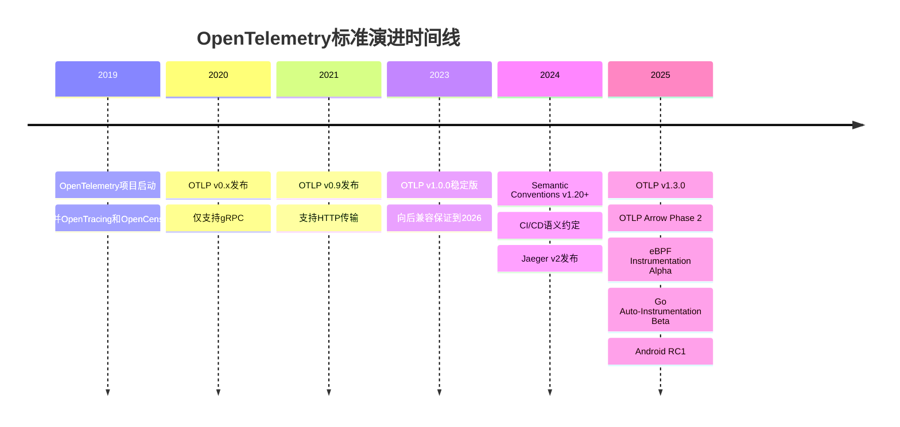

---

## 9. 按内容范围（OTLP / Metrics / Logs）的思维表征

以下表征明确对应本项目三条内容范围，便于从范围入口查找。

### 9.1 公理/定理推理梳理树图（范围专用）

**协议**：必选/可选字段与一致性约束。

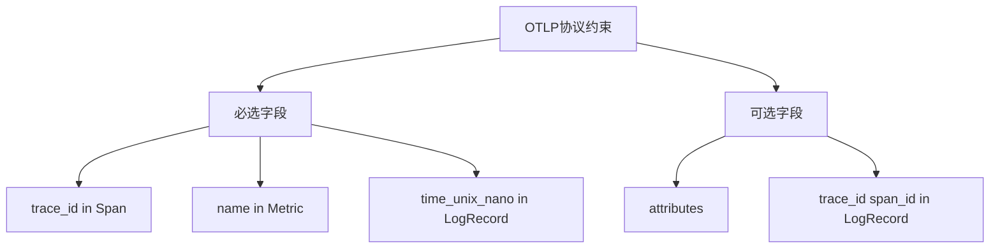

**Metrics**：聚合语义（Cumulative/Delta）与可观测性等价。

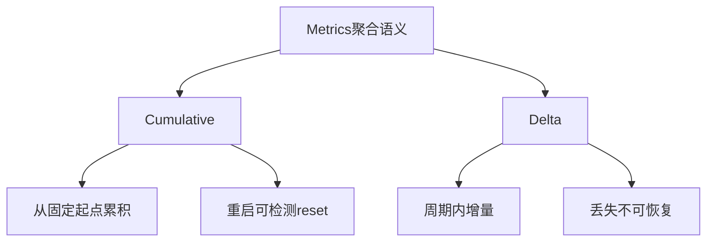

**Logs**：Trace 关联与唯一性约束。

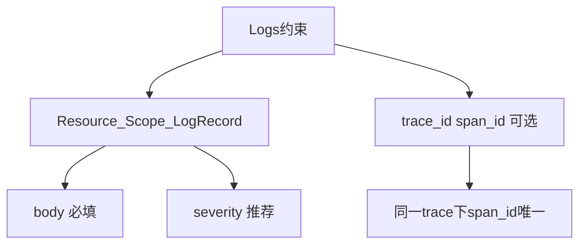

### 9.2 应用树图（按三条范围的应用场景）

```mermaid
graph TD
    Root[应用场景] --> A1[可观测性与微服务遥测]
    Root --> A2[监控与指标收集]
    Root --> A3[日志聚合与审计]
    A1 --> A1_1[OTLP协议: 传输与语义]
    A1 --> A1_2[Traces_Metrics_Logs统一出口]
    A2 --> A2_1[Metrics: pre_aggregation]
    A2 --> A2_2[Prometheus_StatsD桥接]
    A3 --> A3_1[Logs: 统一结构]
    A3 --> A3_2[多格式无歧义映射]
```

### 9.3 场景与实践树图

```mermaid
graph TD
    Root[场景到实践] --> S1[协议选型]
    Root --> S2[指标落地]
    Root --> S3[日志统一]
    S1 --> S1_1[gRPC vs HTTP]
    S1_1 --> S1_1a[docs/01_OTLP核心协议]
    S2 --> S2_1[Pre_aggregation与映射]
    S2_1 --> S2_1a[03_数据模型/02_Metrics数据模型]
    S3 --> S3_1[统一结构与多格式映射]
    S3_1 --> S3_1a[03_数据模型/03_Logs数据模型]
```

### 9.4 决策/权衡树图（范围扩展）

**协议**：gRPC vs HTTP 选型。

```mermaid
graph TD
    Start[传输选型] --> Perf{性能与延迟敏感?}
    Perf -->|是| gRPC[选gRPC]
    Perf -->|否| Firewall{防火墙或浏览器?}
    Firewall -->|是| HTTP[选HTTP]
    Firewall -->|否| gRPC
```

**Metrics**：何时 pre-aggregate、何时用 Prometheus/StatsD 桥接。

```mermaid
graph TD
    Start[Metrics方案] --> Source{数据来源?}
    Source -->|已有Prometheus| Prom[Collector Prometheus Receiver]
    Source -->|已有StatsD| StatsD[Collector StatsD Receiver]
    Source -->|原生OTLP| OTLP[SDK直接导出OTLP]
    Prom --> Backend[后端: OTLP或Remote Write]
    StatsD --> Backend
    OTLP --> Backend
```

**Logs**：格式与后端选型、采样与保留策略。

```mermaid
graph TD
    Start[Logs方案] --> Format{现有格式?}
    Format -->|JSON/应用日志| MapJSON[按03_统一结构与多格式映射转换]
    Format -->|Syslog| MapSyslog[Syslog映射表]
    Format -->|云格式| MapCloud[CloudWatch等映射]
    MapJSON --> OTLPExport[OTLP导出]
    MapSyslog --> OTLPExport
    MapCloud --> OTLPExport
```

---

## 按内容范围（OTLP / Metrics / Logs）的思维表征索引

从三条范围入口可快速定位到以下表征文档或本章节。

| 表征类型 | 覆盖范围 | 文档/位置 |
|----------|----------|-----------|
| **思维导图** | 协议 / Metrics / Logs 各自概念层级 | [00_知识中心/04_思维导图/范围思维导图_OTLP_Metrics_Logs.md](00_知识中心/04_思维导图/范围思维导图_OTLP_Metrics_Logs.md) |
| **多维概念矩阵对比** | 协议 gRPC vs HTTP、Metrics vs Prometheus vs StatsD、Logs 格式映射 | [00_知识中心/03_矩阵对比/范围矩阵_协议与数据模型对比.md](00_知识中心/03_矩阵对比/范围矩阵_协议与数据模型对比.md) |
| **公理/定理推理梳理树图** | 协议必选/可选、Metrics 聚合语义、Logs Trace 关联约束 | 本文档 §9.1 |
| **应用树图** | 可观测性/微服务遥测、监控/指标收集、日志聚合/审计 | 本文档 §9.2 |
| **场景与实践树图** | 每条范围下场景 → 实践步骤 → 文档链接 | 本文档 §9.3 |
| **决策/权衡树图** | 协议选型、Metrics 桥接、Logs 格式与后端 | 本文档 §9.4 |

范围与权威对齐及缺口见 [docs/🔬_批判性评价与持续改进计划/00_范围-权威对齐矩阵](docs/🔬_批判性评价与持续改进计划/00_范围-权威对齐矩阵.md)。

---

## 10. 按文档模块的思维表征索引

以下按 **docs 子模块** 列出思维导图、多维矩阵、定理/公理推理树、决策树的对应位置，便于从各模块入口直达表征。

| 模块 | 思维导图 | 多维矩阵/概念对比 | 定理/公理推理树 | 决策树 |
|------|----------|-------------------|-----------------|--------|
| **01_OTLP核心协议** | §1、[范围思维导图](00_知识中心/04_思维导图/范围思维导图_OTLP_Metrics_Logs.md) | [范围矩阵](00_知识中心/03_矩阵对比/范围矩阵_协议与数据模型对比.md) | §9.1 协议约束 | §3.1、§9.4 传输选型 |
| **02_Semantic_Conventions** | §10.1 语义约定思维导图 | §10.1 语义约定矩阵 | 复用 §2 概念关系 | §10.1 语义约定决策树 |
| **03_数据模型** | [范围思维导图](00_知识中心/04_思维导图/范围思维导图_OTLP_Metrics_Logs.md) | [范围矩阵](00_知识中心/03_矩阵对比/范围矩阵_协议与数据模型对比.md) | §9.1 Metrics/Logs | §9.4 |
| **04_核心组件** | §10.2 核心组件思维导图 | §10.2 核心组件矩阵 | 复用 §5 Collector 流程 | §10.2 核心组件决策树 |
| **05_采样与性能** | §1.2 理论框架 | 复用 §2 | §4.2 采样策略证明树 | §3.1、§10.3 采样决策树 |
| **06_实战案例** | §1、§9.3 场景与实践树 | [可视化分析/02_多维矩阵](可视化分析_2025_10_20/02_多维矩阵/) | - | §10.3 实战场景树 |
| **07_安全与合规** | - | - | - | §10.3 安全合规决策树 |
| **08_故障排查** | - | - | - | §3.2 故障排查决策树 |
| **01_理论基础** | §1.2 理论框架思维导图 | §2 概念矩阵 | §4 证明树 | §3 |
| **02_THEORETICAL_FRAMEWORK** | §1.2 | §2 | §4、§9.1 | §3 |

**说明**：各模块「本模块思维表征」入口已 100% 覆盖；核心文档及多数主要文档已内嵌思维表征（mindmap/矩阵/决策树/flowchart），清单见 [多种思维表征全面覆盖计划与方案](docs/多种思维表征全面覆盖计划与方案.md) 3.2 与 §6.3 单篇内嵌持续推进（Phase 1–4）。

**总入口**: [多种思维表征全面覆盖计划与方案](docs/多种思维表征全面覆盖计划与方案.md)。

### 10.1 语义约定模块（02_Semantic_Conventions）

**思维导图**（语义约定层级）:

```mermaid
mindmap
  root((语义约定))
    HTTP_gRPC
      HTTP属性
      gRPC属性
      RPC通用
    数据库
      SQL
      MongoDB
      Cassandra
      Elasticsearch
    消息队列
      Kafka
      NATS
      RabbitMQ
      Redis
      Pulsar
      MQTT
      AWS_SQS_SNS
    云平台
      AWS
      Azure
      GCP
    FaaS
      AWS_Lambda
      Azure_Functions
      GCP_Functions
```

**概念对比矩阵**（语义约定选型）:

| 场景 | 推荐语义约定 | 文档位置 |
|------|--------------|----------|
| Web/API | HTTP、gRPC 追踪属性 | docs/02_Semantic_Conventions/02_追踪属性 |
| 数据库 | 04_数据库属性 | 同上/04_数据库属性 |
| 消息队列 | 03_消息队列属性 | 同上/03_消息队列属性 |
| 云资源 | 05_云平台属性、04_资源属性 | 同上/05、04 |
| FaaS | 06_FaaS属性 | 同上/06_FaaS属性 |

**决策树**（语义约定采用）:

```mermaid
graph TD
    Start[需要语义约定?] --> Scene{使用场景}
    Scene -->|HTTP/gRPC| A[02_追踪属性]
    Scene -->|数据库| B[04_数据库属性]
    Scene -->|消息队列| C[03_消息队列属性]
    Scene -->|云/资源| D[05_云平台 04_资源]
    Scene -->|FaaS| E[06_FaaS属性]
    A --> Doc[docs/02_Semantic_Conventions]
    B --> Doc
    C --> Doc
    D --> Doc
    E --> Doc
```

### 10.2 核心组件模块（04_核心组件）

**思维导图**（核心组件层级）:

```mermaid
mindmap
  root((核心组件))
    SDK
      Tracer
      Meter
      Logger
      多语言
    Collector
      Receiver
      Processor
      Exporter
      Pipeline
    配置与部署
      配置格式
      生产配置
```

**核心组件对比矩阵**:

| 组件 | 职责 | 输入 | 输出 | 文档 |
|------|------|------|------|------|
| SDK | 埋点、导出 | 应用代码 | OTLP 请求 | docs/04_核心组件/01_SDK概述 |
| Receiver | 接收 | 网络/文件 | 管道 | 04/04_Collector_Receiver配置详解 |
| Processor | 处理 | 管道 | 管道 | 04/03_Collector_Processor |
| Exporter | 导出 | 管道 | 后端 | 04/05_Collector_Exporter配置详解 |

**决策树**（核心组件选型与部署）:

```mermaid
graph TD
    Start[部署可观测性] --> Need{需求}
    Need -->|仅应用埋点| SDK[选 SDK + 后端 Exporter]
    Need -->|集中接收/转换| Coll[部署 Collector]
    Need -->|多后端/过滤| Coll
    SDK --> Lang[选语言 SDK]
    Coll --> Conf[配置 Receiver/Processor/Exporter]
    Lang --> Doc[docs/04_核心组件]
    Conf --> Doc
```

### 10.3 采样与性能、实战案例、安全与合规

**采样与性能决策树**:

```mermaid
graph TD
    S[采样策略] --> Type{类型}
    Type -->|头采样| Head[简单比例/阈值]
    Type -->|尾采样| Tail[基于延迟错误率]
    Type -->|自适应| Adapt[动态调整]
    Head --> Doc1[docs/05_采样与性能]
    Tail --> Doc1
    Adapt --> Doc1
```

**实战案例场景树**:

```mermaid
graph TD
    R[实战场景] --> C1[微服务追踪]
    R --> C2[电商/金融/制造/物流]
    R --> C3[生产环境最佳实践]
    C1 --> L1[docs/06_实战案例]
    C2 --> L1
    C3 --> L1
```

**安全与合规决策树**:

```mermaid
graph TD
    Sec[安全与合规] --> A[传输加密 TLS]
    Sec --> B[敏感数据脱敏]
    Sec --> C[访问控制与审计]
    Sec --> D[合规清单 GDPR/PCI 等]
    A --> Doc2[docs/07_安全与合规]
    B --> Doc2
    C --> Doc2
    D --> Doc2
```

---

## 总结

本文档提供了OTLP项目的多维思维表征体系，包括：

1. ✅ **思维导图**: 项目总体、理论框架、技术栈、**按范围（OTLP/Metrics/Logs）**、**按模块（语义约定、核心组件）**
2. ✅ **概念矩阵**: 核心概念关系、层次结构、依赖关系、**范围矩阵**、**语义约定/核心组件矩阵**
3. ✅ **决策树**: 实施决策、故障排查、**范围决策/权衡树**、**语义约定/核心组件/采样/实战/安全决策树**
4. ✅ **证明树**: 协议正确性、采样策略
5. ✅ **数据流图**: 端到端流程、Context传播、Collector处理
6. ✅ **论证图**: 价值论证、策略论证
7. ✅ **关联网络**: 主题依赖、主题协作
8. ✅ **时间线**: 项目发展、标准演进
9. ✅ **按范围思维表征**: 公理树、应用树、场景实践树、决策树及**按范围索引**
10. ✅ **按文档模块思维表征**: **§10 按文档模块索引**，覆盖 docs 各主要模块，直达思维导图/矩阵/定理树/决策树

这些思维表征方式帮助从不同角度理解项目，支持决策制定和问题解决。

---

**文档版本**: 1.0.0
**最后更新**: 2025年12月
