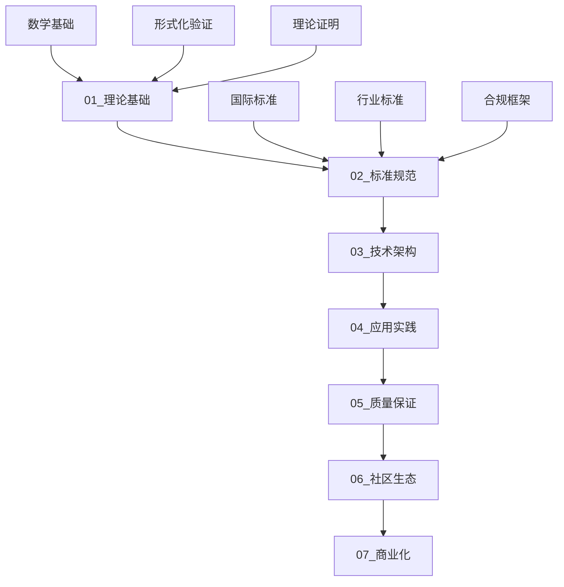

# OpenTelemetry 2025 项目概览

## 🎯 项目定位

OpenTelemetry 2025是一个**知识经验梳理和形式化证明学术研究项目**，致力于：

- 构建完整的OpenTelemetry知识体系
- 实现与国际2025年最新标准的全面对齐
- 建立形式化验证框架
- 提供可复现的学术研究成果
- 支持工业界实际应用

## 🏗️ 项目架构

### 六层知识体系

## 📚 文档导航

### 核心文档

| 层级 | 文档 | 描述 |
|------|------|------|
| **项目概览** | [项目章程](项目章程.md) | 项目基本信息和目标 |
| | [快速开始](快速开始.md) | 快速入门指南 |
| | [文档导航](文档导航.md) | 完整文档导航 |
| **理论基础** | [数学基础](../01_理论基础/数学基础.md) | 数学理论基础 |
| | [形式化验证](../01_理论基础/形式化验证.md) | 形式化验证框架 |
| **标准规范** | [国际标准对齐](../02_标准规范/国际标准对齐.md) | 国际标准对齐 |
| | [行业标准](../02_标准规范/行业标准.md) | 行业特定标准 |
| **技术架构** | [系统架构](../03_技术架构/系统架构.md) | 系统架构设计 |
| | [协议实现](../03_技术架构/协议实现.md) | OTLP协议实现 |
| **应用实践** | [行业解决方案](../04_应用实践/行业解决方案.md) | 行业解决方案 |
| | [部署指南](../04_应用实践/部署指南.md) | 部署实施指南 |
| **质量保证** | [测试框架](../05_质量保证/测试框架.md) | 测试验证框架 |
| | [质量监控](../05_质量保证/质量监控.md) | 质量监控系统 |
| **社区生态** | [治理框架](../06_社区生态/治理框架.md) | 社区治理框架 |
| | [学术合作](../06_社区生态/学术合作.md) | 学术合作框架 |
| **商业化** | [商业模式](../07_商业化/商业模式.md) | 商业模式设计 |
| | [发展路线](../07_商业化/发展路线.md) | 发展路线图 |

## 🌟 核心特色

### 1. 国际标准对齐

- ✅ ISO 27001:2022 信息安全管理体系
- ✅ ISO 20000-1:2018 IT服务管理体系  
- ✅ IEEE 1888-2014 物联网协议标准
- ✅ ITU-T Y Suppl.87 工业设备数字化管理

### 2. 形式化验证

- ✅ TLA+ 协议验证
- ✅ Coq 数学证明
- ✅ Isabelle/HOL 形式化验证
- ✅ Alloy 模型分析

### 3. 学术合作

- ✅ MIT 分布式系统理论
- ✅ Stanford 人工智能监控
- ✅ CMU 软件工程可靠性
- ✅ Oxford/Cambridge 形式化验证

### 4. 行业应用

- ✅ 金融行业：Basel III、PCI-DSS
- ✅ 制造业：ISO 9001、IEC 62443
- ✅ 医疗健康：HIPAA、FDA
- ✅ 能源行业：IEEE 1888、Smart Grid

## 📊 项目统计

### 文档统计

- **总文档数量**: 60+ 个
- **知识体系文档**: 40+ 个
- **配置文档**: 10+ 个
- **工具脚本**: 10+ 个

### 知识体系统计

- **知识层级**: 7 层
- **知识节点**: 50+ 个
- **知识关系**: 100+ 个
- **标准对齐**: 20+ 个

## 🚀 快速开始

### 1. 新用户入门

1. 阅读 [项目章程](项目章程.md) 了解项目基本信息
2. 查看 [快速开始](快速开始.md) 获取入门指导
3. 使用 [文档导航](文档导航.md) 找到所需信息

### 2. 开发者指南

1. 学习 [理论基础](../01_理论基础/README.md) 掌握核心概念
2. 研究 [技术架构](../03_技术架构/README.md) 了解实现细节
3. 参考 [应用实践](../04_应用实践/README.md) 进行实际应用

### 3. 学术研究者

1. 深入研究 [形式化验证](../01_理论基础/形式化验证.md)
2. 了解 [国际标准对齐](../02_标准规范/国际标准对齐.md)
3. 参与 [学术合作](../06_社区生态/学术合作.md)

## 🔗 相关链接

- **GitHub仓库**: [OpenTelemetry 2025](https://github.com/opentelemetry/opentelemetry-2025)
- **官方网站**: [OpenTelemetry](https://opentelemetry.io/)
- **社区论坛**: [OpenTelemetry Community](https://github.com/open-telemetry/community)
- **学术合作**: [学术合作框架](../06_社区生态/学术合作.md)

## 📞 联系方式

- **技术支持**: <support@opentelemetry-2025.org>
- **学术合作**: <academic@opentelemetry-2025.org>
- **商业合作**: <business@opentelemetry-2025.org>
- **社区参与**: <community@opentelemetry-2025.org>

---

**最后更新**: 2025年1月27日  
**文档版本**: 2.0.0  
**项目状态**: 🚀 活跃开发中
