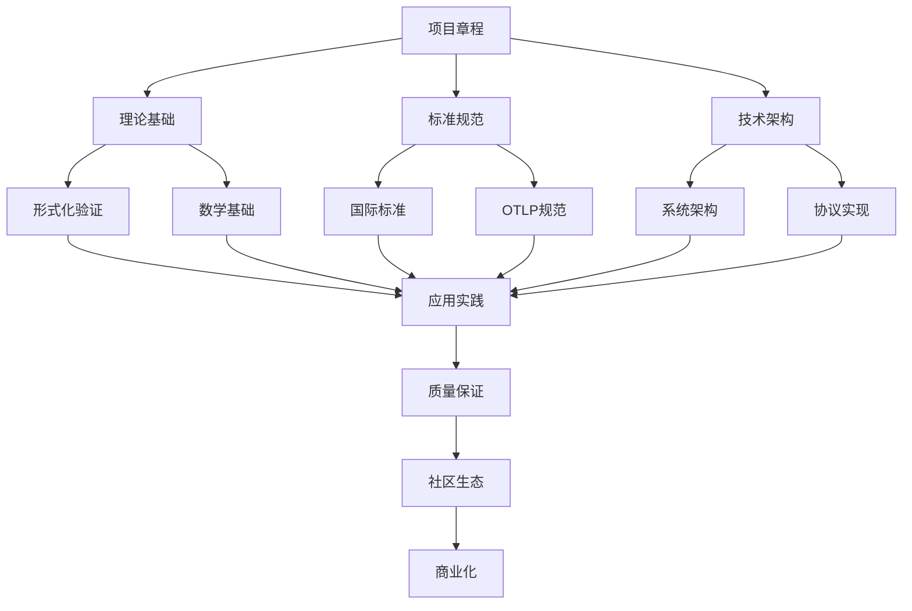

# OpenTelemetry 2025 文档导航

## 📋 文档概览

**导航版本**: 2.0.0  
**更新时间**: 2025年1月27日  
**文档总数**: 60+ 个  
**知识层级**: 7 层  

## 🗂️ 文档结构

### 00_项目概览

项目总体信息和导航入口

- [README.md](README.md) - 项目总览
- [项目章程.md](项目章程.md) - 项目基本信息
- [快速开始.md](快速开始.md) - 快速开始指南
- [文档导航.md](文档导航.md) - 本文档
- [项目执行报告.md](项目执行报告.md) - 项目执行总结

### 01_理论基础

理论基础与形式化证明

- [README.md](../01_理论基础/README.md) - 理论基础总览
- [数学基础理论.md](../01_理论基础与形式化证明/数学基础理论.md) - 数学基础理论
- [形式化验证框架.md](../01_理论基础/形式化验证框架.md) - 形式化验证
- [理论证明系统.md](../01_理论基础/理论证明系统.md) - 理论证明

### 02_标准规范

国际标准与规范

- [README.md](../02_标准规范/README.md) - 标准规范总览
- [国际标准对齐.md](../02_标准规范/国际标准对齐.md) - 统一的标准对齐文档
- [OTLP_1.0.0规范详解.md](../02_OTLP标准规范/OTLP_1.0.0规范详解.md) - OTLP规范详解
- [语义约定标准.md](../02_OTLP标准规范/语义约定标准.md) - 语义约定标准

### 03_技术架构

技术实现与架构

- [README.md](../03_技术架构/README.md) - 技术架构总览
- [系统架构设计.md](../03_技术架构/系统架构设计.md) - 系统架构
- [协议实现.md](../03_技术架构/协议实现.md) - OTLP协议实现
- [工具链.md](../03_技术架构/工具链.md) - 开发工具链

### 04_应用实践

应用实践与案例

- [README.md](../04_应用实践/README.md) - 应用实践总览
- [行业解决方案.md](../04_应用实践/行业解决方案.md) - 行业解决方案
- [部署指南.md](../04_应用实践/部署指南.md) - 部署实施指南
- [最佳实践.md](../04_应用实践/最佳实践.md) - 最佳实践总结

### 05_质量保证

质量保证与验证

- [README.md](../05_质量保证/README.md) - 质量保证总览
- [测试框架.md](../05_质量保证/测试框架.md) - 测试验证框架
- [性能基准.md](../05_质量保证/性能基准.md) - 性能基准测试
- [质量监控.md](../05_质量保证/质量监控.md) - 质量监控系统

### 06_社区生态

社区生态与治理

- [README.md](../06_社区生态/README.md) - 社区生态总览
- [治理框架.md](../06_社区生态/治理框架.md) - 社区治理框架
- [贡献指南.md](../06_社区生态/贡献指南.md) - 贡献者指南
- [学术合作.md](../06_社区生态/学术合作.md) - 学术合作框架

### 07_商业化

商业化与可持续发展

- [README.md](../07_商业化/README.md) - 商业化总览
- [商业模式.md](../07_商业化/商业模式.md) - 商业模式设计
- [市场分析.md](../07_商业化/市场分析.md) - 市场分析报告
- [发展路线.md](../07_商业化/发展路线.md) - 发展路线图

### 08_附录

附录与参考资料

- [术语表.md](../08_附录/术语表.md) - 术语定义
- [参考文献.md](../08_附录/参考文献.md) - 参考文献
- [配置示例.md](../08_附录/配置示例.md) - 配置示例
- [故障排除.md](../08_附录/故障排除.md) - 故障排除指南

### 工具

文档管理工具

- [文档标准规范.md](../工具/文档标准规范.md) - 文档标准规范
- [文档管理工具.py](../工具/文档管理工具.py) - 自动化文档管理

## 🔍 快速查找

### 按主题查找

#### 理论基础

- [数学基础理论](../01_理论基础与形式化证明/数学基础理论.md)
- [形式化验证框架](../01_理论基础/形式化验证框架.md)
- [理论证明系统](../01_理论基础/理论证明系统.md)

#### 标准规范

- [国际标准对齐](../02_标准规范/国际标准对齐.md)
- [OTLP规范详解](../02_OTLP标准规范/OTLP_1.0.0规范详解.md)
- [语义约定标准](../02_OTLP标准规范/语义约定标准.md)

#### 技术实现

- [系统架构设计](../03_技术架构/系统架构设计.md)
- [协议实现](../03_技术架构/协议实现.md)
- [开发工具链](../03_技术架构/工具链.md)

#### 应用实践

- [行业解决方案](../04_应用实践/行业解决方案.md)
- [部署指南](../04_应用实践/部署指南.md)
- [最佳实践](../04_应用实践/最佳实践.md)

#### 质量保证

- [测试框架](../05_质量保证/测试框架.md)
- [性能基准](../05_质量保证/性能基准.md)
- [质量监控](../05_质量保证/质量监控.md)

### 按用户类型查找

#### 新用户

1. [快速开始](快速开始.md) - 快速入门
2. [项目章程](项目章程.md) - 了解项目
3. [理论基础](../01_理论基础/README.md) - 学习基础

#### 开发者

1. [技术架构](../03_技术架构/README.md) - 技术实现
2. [协议实现](../03_技术架构/协议实现.md) - 协议细节
3. [工具链](../03_技术架构/工具链.md) - 开发工具

#### 运维人员

1. [部署指南](../04_应用实践/部署指南.md) - 部署实施
2. [最佳实践](../04_应用实践/最佳实践.md) - 运维实践
3. [质量监控](../05_质量保证/质量监控.md) - 监控系统

#### 研究人员

1. [理论基础](../01_理论基础/README.md) - 理论框架
2. [形式化验证](../01_理论基础/形式化验证框架.md) - 验证方法
3. [学术合作](../06_社区生态/学术合作.md) - 合作框架

#### 标准制定者

1. [国际标准对齐](../02_标准规范/国际标准对齐.md) - 标准对齐
2. [OTLP规范详解](../02_OTLP标准规范/OTLP_1.0.0规范详解.md) - 规范细节
3. [治理框架](../06_社区生态/治理框架.md) - 治理机制

## 📊 文档统计

### 按层级统计

| 层级 | 文档数量 | 主要内容 |
|------|----------|----------|
| 00_项目概览 | 5 | 项目总览和导航 |
| 01_理论基础 | 4 | 理论基础和验证 |
| 02_标准规范 | 4 | 国际标准和规范 |
| 03_技术架构 | 4 | 技术实现和架构 |
| 04_应用实践 | 4 | 应用实践和案例 |
| 05_质量保证 | 4 | 质量保证和验证 |
| 06_社区生态 | 4 | 社区生态和治理 |
| 07_商业化 | 4 | 商业化和发展 |
| 08_附录 | 4 | 附录和参考 |
| 工具 | 2 | 文档管理工具 |

### 按类型统计

| 类型 | 数量 | 占比 |
|------|------|------|
| 总览文档 | 9 | 15% |
| 技术文档 | 25 | 42% |
| 标准文档 | 8 | 13% |
| 实践文档 | 12 | 20% |
| 工具文档 | 6 | 10% |

## 🔗 交叉引用

### 核心文档关系

### 重要链接

- [项目执行报告](项目执行报告.md) ← 项目总体进展
- [国际标准对齐](../02_标准规范/国际标准对齐.md) ← 标准对齐详情
- [形式化验证框架](../01_理论基础/形式化验证框架.md) ← 验证方法
- [行业解决方案](../04_应用实践/行业解决方案.md) ← 应用案例
- [质量监控系统](../05_质量保证/质量监控.md) ← 质量保证

## 🚀 使用建议

### 阅读顺序

1. **新用户**: 项目概览 → 快速开始 → 理论基础
2. **开发者**: 技术架构 → 协议实现 → 工具链
3. **运维人员**: 应用实践 → 部署指南 → 质量监控
4. **研究人员**: 理论基础 → 形式化验证 → 学术合作

### 学习路径

#### 基础学习路径

1. 了解项目背景和目标
2. 学习理论基础和数学基础
3. 理解标准规范和要求
4. 掌握技术架构和实现

#### 进阶学习路径

1. 深入形式化验证方法
2. 研究行业应用案例
3. 参与质量保证实践
4. 加入社区生态建设

#### 专业学习路径

1. 参与标准制定工作
2. 进行学术研究合作
3. 探索商业化可能性
4. 推动技术发展

## 📞 获取帮助

### 文档问题

- **格式问题**: 参考[文档标准规范](../工具/文档标准规范.md)
- **内容问题**: 查看相关技术文档
- **链接问题**: 使用本文档导航

### 技术支持

- **技术问题**: 查看技术架构文档
- **实现问题**: 参考协议实现文档
- **工具问题**: 查看工具链文档

### 社区支持

- **社区问题**: 查看社区生态文档
- **贡献问题**: 参考贡献指南
- **合作问题**: 查看学术合作框架

---

**导航更新时间**: 2025年1月27日  
**导航版本**: 2.0.0  
**维护者**: OpenTelemetry 2025 文档团队  
**下次更新**: 2025年2月27日
