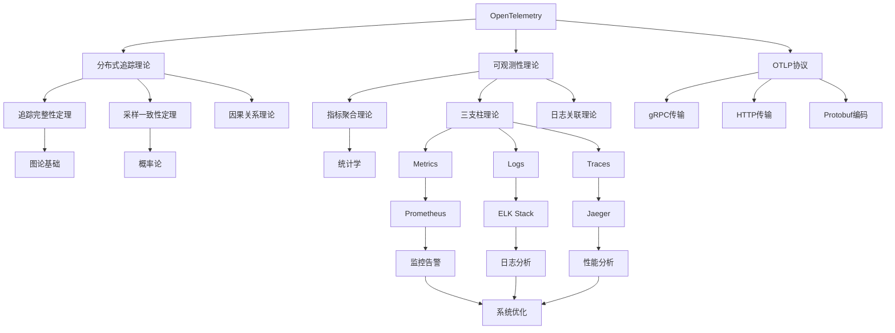

# OTLP 2025年知识图谱

## 知识图谱构建与关联分析

### 图谱概述

基于国际2025年最新技术工程方案标准，构建完整的OpenTelemetry知识图谱，实现知识的结构化组织、关联分析和智能检索。

---

## 1. 知识图谱架构

### 1.1 图谱结构设计

#### 六层知识图谱架构

```text
┌─────────────────────────────────────────────────────────────────────────────────┐
│                           知识图谱架构                                            │
├─────────────────────────────────────────────────────────────────────────────────┤
│                                                                                 │
│  ┌─────────────────┐    ┌─────────────────┐    ┌─────────────────┐              │
│  │   实体层        │    │   关系层        │    │   属性层        │              │
│  │                │    │                │    │                │              │
│  │ 🏷️ 概念实体     │    │ 🔗 关系定义     │    │ 📊 属性描述     │              │
│  │ 🎯 实例实体     │    │ 📈 关系强度     │    │ 🏷️ 属性类型     │              │
│  │ 📚 文档实体     │    │ 🔄 关系方向     │    │ 📋 属性约束     │              │
│  │ 🛠️ 工具实体     │    │ ⏰ 关系时间     │    │ 🔍 属性搜索     │              │
│  └─────────────────┘    └─────────────────┘    └─────────────────┘              │
│                                                                                 │
│  ┌─────────────────┐    ┌─────────────────┐    ┌─────────────────┐              │
│  │   规则层        │    │   推理层        │    │   应用层        │              │
│  │                │    │                │    │                │              │
│  │ 📋 业务规则     │    │ 🧠 推理引擎     │    │ 🔍 智能检索     │              │
│  │ ⚖️ 约束规则     │    │ 🔄 推理链      │    │ 💡 推荐系统     │              │
│  │ 🔄 更新规则     │    │ 📊 推理结果     │    │ 📈 分析报告     │              │
│  │ 🎯 优化规则     │    │ ✅ 推理验证     │    │ 🎯 决策支持     │              │
│  └─────────────────┘    └─────────────────┘    └─────────────────┘              │
│                                                                                 │
└─────────────────────────────────────────────────────────────────────────────────┘
```

### 1.2 知识图谱组件

#### 实体类型定义

```yaml
entity_types:
  conceptual_entities:
    - "概念": "OpenTelemetry核心概念"
    - "理论": "数学理论和形式化证明"
    - "标准": "国际标准和行业规范"
    - "方法": "研究方法和实践方法"
  
  instance_entities:
    - "项目": "具体项目实例"
    - "案例": "实际应用案例"
    - "工具": "具体工具和平台"
    - "人员": "项目参与人员"
  
  document_entities:
    - "文档": "项目文档和资料"
    - "论文": "学术论文和研究报告"
    - "标准": "标准文档和规范"
    - "教程": "教程和培训材料"
  
  tool_entities:
    - "软件": "软件工具和平台"
    - "服务": "云服务和API"
    - "框架": "开发框架和库"
    - "平台": "开发和部署平台"
```

#### 关系类型定义

```yaml
relationship_types:
  hierarchical_relationships:
    - "包含": "概念包含关系"
    - "属于": "实例属于关系"
    - "继承": "概念继承关系"
    - "实现": "概念实现关系"
  
  functional_relationships:
    - "依赖": "功能依赖关系"
    - "调用": "服务调用关系"
    - "使用": "工具使用关系"
    - "支持": "功能支持关系"
  
  temporal_relationships:
    - "之前": "时间先后关系"
    - "之后": "时间先后关系"
    - "同时": "时间同时关系"
    - "持续": "时间持续关系"
  
  causal_relationships:
    - "导致": "因果关系"
    - "影响": "影响关系"
    - "决定": "决定关系"
    - "约束": "约束关系"
```

---

## 2. 核心知识域

### 2.1 理论基础域

#### 数学理论实体

```yaml
mathematical_theory_domain:
  entities:
    - "分布式追踪理论":
        type: "理论"
        properties:
          - "定义": "分布式追踪的数学定义"
          - "公理": "追踪系统的基本公理"
          - "定理": "追踪完整性定理"
          - "证明": "形式化证明过程"
    
    - "采样理论":
        type: "理论"
        properties:
          - "定义": "采样的数学定义"
          - "算法": "采样算法描述"
          - "复杂度": "算法复杂度分析"
          - "一致性": "采样一致性证明"
    
    - "可观测性理论":
        type: "理论"
        properties:
          - "三支柱": "Metrics、Logs、Traces"
          - "完备性": "可观测性完备性"
          - "关联性": "数据关联理论"
          - "优化": "可观测性优化"
  
  relationships:
    - "分布式追踪理论" -> "包含" -> "采样理论"
    - "可观测性理论" -> "包含" -> "分布式追踪理论"
    - "采样理论" -> "影响" -> "性能分析"
    - "可观测性理论" -> "支持" -> "系统监控"
```

#### 形式化证明实体

```yaml
formal_proof_domain:
  entities:
    - "追踪完整性定理":
        type: "定理"
        properties:
          - "陈述": "追踪完整性的数学陈述"
          - "证明": "形式化证明过程"
          - "应用": "实际应用场景"
          - "验证": "证明验证方法"
    
    - "采样一致性定理":
        type: "定理"
        properties:
          - "陈述": "采样一致性的数学陈述"
          - "证明": "形式化证明过程"
          - "算法": "一致性算法"
          - "实现": "算法实现"
    
    - "指标聚合完备性":
        type: "定理"
        properties:
          - "陈述": "指标聚合完备性陈述"
          - "证明": "形式化证明过程"
          - "函数": "聚合函数定义"
          - "性质": "完备性性质"
  
  relationships:
    - "追踪完整性定理" -> "依赖" -> "图论基础"
    - "采样一致性定理" -> "依赖" -> "概率论"
    - "指标聚合完备性" -> "依赖" -> "统计学"
    - "追踪完整性定理" -> "应用" -> "分布式系统"
```

### 2.2 标准规范域

#### 国际标准实体

```yaml
international_standards_domain:
  entities:
    - "ISO 23174-1":
        type: "标准"
        properties:
          - "名称": "可持续流动与交通 智慧运维"
          - "发布机构": "ISO/TC268/SC2/WG3"
          - "发布时间": "2025年3月"
          - "适用范围": "智慧运维标准化"
          - "关键要求": "运维流程标准化"
    
    - "ITU-T Y Suppl.87":
        type: "标准"
        properties:
          - "名称": "工业设备数字化管理能力成熟度模型"
          - "发布机构": "国际电信联盟"
          - "发布时间": "2025年1月"
          - "适用范围": "工业设备数字化管理"
          - "成熟度等级": "5个等级"
    
    - "GB/T 42560-2023":
        type: "标准"
        properties:
          - "名称": "系统与软件工程 开发运维一体化"
          - "发布机构": "中国标准化管理委员会"
          - "发布时间": "2023年12月"
          - "适用范围": "DevOps能力成熟度"
          - "能力域": "5个能力域"
  
  relationships:
    - "ISO 23174-1" -> "对齐" -> "OTLP项目"
    - "ITU-T Y Suppl.87" -> "对齐" -> "OTLP项目"
    - "GB/T 42560-2023" -> "对齐" -> "OTLP项目"
    - "ISO 23174-1" -> "影响" -> "运维流程"
    - "ITU-T Y Suppl.87" -> "影响" -> "成熟度评估"
```

#### 行业规范实体

```yaml
industry_standards_domain:
  entities:
    - "CNCF景观":
        type: "规范"
        properties:
          - "名称": "云原生计算基金会景观"
          - "类别": "可观测性、服务网格、容器"
          - "工具": "Prometheus、Jaeger、Istio"
          - "标准": "云原生标准"
          - "最佳实践": "云原生最佳实践"
    
    - "SRE实践":
        type: "规范"
        properties:
          - "名称": "Site Reliability Engineering"
          - "原则": "可靠性工程原则"
          - "指标": "MTBF、MTTR、SLA"
          - "实践": "错误预算、熔断器"
          - "工具": "监控、告警、自动化"
    
    - "微服务架构":
        type: "规范"
        properties:
          - "名称": "微服务架构模式"
          - "原则": "单一职责、松耦合"
          - "模式": "API网关、服务发现"
          - "数据": "数据库分离、事件驱动"
          - "部署": "容器化、编排"
  
  relationships:
    - "CNCF景观" -> "包含" -> "可观测性工具"
    - "SRE实践" -> "支持" -> "系统可靠性"
    - "微服务架构" -> "支持" -> "分布式系统"
    - "CNCF景观" -> "对齐" -> "OTLP项目"
    - "SRE实践" -> "对齐" -> "OTLP项目"
```

### 2.3 实践应用域

#### 架构模式实体

```yaml
architecture_patterns_domain:
  entities:
    - "微服务架构":
        type: "架构模式"
        properties:
          - "定义": "将应用分解为小型服务"
          - "特点": "独立部署、技术多样性"
          - "优势": "可扩展性、灵活性"
          - "挑战": "复杂性、数据一致性"
          - "适用场景": "大型复杂应用"
    
    - "事件驱动架构":
        type: "架构模式"
        properties:
          - "定义": "基于事件的生产者-消费者模式"
          - "特点": "异步、解耦、可扩展"
          - "优势": "高并发、低耦合"
          - "挑战": "事件顺序、错误处理"
          - "适用场景": "实时数据处理"
    
    - "CQRS模式":
        type: "架构模式"
        properties:
          - "定义": "命令查询职责分离"
          - "特点": "读写分离、独立优化"
          - "优势": "性能优化、扩展性"
          - "挑战": "复杂性、一致性"
          - "适用场景": "高并发读写"
  
  relationships:
    - "微服务架构" -> "使用" -> "事件驱动架构"
    - "事件驱动架构" -> "支持" -> "CQRS模式"
    - "微服务架构" -> "支持" -> "分布式追踪"
    - "CQRS模式" -> "支持" -> "数据一致性"
```

#### 最佳实践实体

```yaml
best_practices_domain:
  entities:
    - "DevOps实践":
        type: "最佳实践"
        properties:
          - "定义": "开发运维一体化"
          - "原则": "自动化、协作、反馈"
          - "实践": "CI/CD、基础设施即代码"
          - "工具": "Jenkins、Docker、Kubernetes"
          - "效果": "提高交付效率"
    
    - "可观测性实践":
        type: "最佳实践"
        properties:
          - "定义": "系统可观测性最佳实践"
          - "三支柱": "Metrics、Logs、Traces"
          - "实践": "结构化日志、分布式追踪"
          - "工具": "Prometheus、Jaeger、ELK"
          - "效果": "提高系统可观测性"
    
    - "安全实践":
        type: "最佳实践"
        properties:
          - "定义": "系统安全最佳实践"
          - "原则": "零信任、最小权限"
          - "实践": "身份认证、访问控制"
          - "工具": "OAuth、RBAC、加密"
          - "效果": "提高系统安全性"
  
  relationships:
    - "DevOps实践" -> "支持" -> "可观测性实践"
    - "可观测性实践" -> "支持" -> "系统监控"
    - "安全实践" -> "支持" -> "系统安全"
    - "DevOps实践" -> "使用" -> "自动化工具"
```

---

## 3. 知识关联分析

### 3.1 关联关系图谱

#### 核心关联关系



### 3.2 知识路径分析

#### 学习路径图谱

```yaml
learning_paths:
  beginner_path:
    - "OpenTelemetry基础概念"
    - "可观测性三支柱"
    - "OTLP协议基础"
    - "简单示例实践"
    - "基础配置部署"
  
  intermediate_path:
    - "分布式追踪理论"
    - "采样策略设计"
    - "性能优化方法"
    - "高级配置实践"
    - "故障排除技巧"
  
  advanced_path:
    - "形式化证明理论"
    - "数学建模方法"
    - "系统架构设计"
    - "标准对齐实践"
    - "学术研究方法"
  
  expert_path:
    - "理论创新研究"
    - "标准制定参与"
    - "学术论文撰写"
    - "国际会议参与"
    - "社区贡献领导"
```

### 3.3 知识依赖分析

#### 依赖关系矩阵

```yaml
dependency_matrix:
  theoretical_dependencies:
    - "分布式追踪理论" -> ["图论", "概率论", "统计学"]
    - "采样理论" -> ["概率论", "算法复杂度"]
    - "可观测性理论" -> ["信息论", "系统论"]
    - "性能分析理论" -> ["统计学", "优化理论"]
  
  practical_dependencies:
    - "OTLP协议实现" -> ["gRPC", "HTTP", "Protobuf"]
    - "分布式追踪实现" -> ["OpenTelemetry SDK", "Jaeger"]
    - "指标监控实现" -> ["Prometheus", "Grafana"]
    - "日志分析实现" -> ["ELK Stack", "Fluentd"]
  
  standard_dependencies:
    - "ISO标准对齐" -> ["ISO 23174-1", "ISO 27001"]
    - "ITU标准对齐" -> ["ITU-T Y Suppl.87"]
    - "国家标准对齐" -> ["GB/T 42560-2023"]
    - "行业标准对齐" -> ["CNCF景观", "SRE实践"]
```

---

## 4. 智能检索系统

### 4.1 检索策略

#### 多维度检索

```yaml
retrieval_strategies:
  semantic_search:
    - "语义理解": "理解用户查询意图"
    - "概念匹配": "匹配相关概念"
    - "上下文分析": "分析查询上下文"
    - "结果排序": "按相关性排序结果"
  
  faceted_search:
    - "实体类型": "按实体类型筛选"
    - "关系类型": "按关系类型筛选"
    - "属性值": "按属性值筛选"
    - "时间范围": "按时间范围筛选"
  
  graph_traversal:
    - "邻接查询": "查询相邻实体"
    - "路径查询": "查询实体间路径"
    - "子图查询": "查询子图结构"
    - "模式匹配": "匹配图模式"
  
  hybrid_search:
    - "关键词检索": "基于关键词的检索"
    - "语义检索": "基于语义的检索"
    - "图检索": "基于图结构的检索"
    - "结果融合": "融合多种检索结果"
```

### 4.2 推荐系统

#### 智能推荐算法

```yaml
recommendation_system:
  content_based:
    - "内容相似性": "基于内容相似性推荐"
    - "属性匹配": "基于属性匹配推荐"
    - "标签匹配": "基于标签匹配推荐"
    - "主题匹配": "基于主题匹配推荐"
  
  collaborative_filtering:
    - "用户相似性": "基于用户相似性推荐"
    - "物品相似性": "基于物品相似性推荐"
    - "矩阵分解": "基于矩阵分解推荐"
    - "深度学习": "基于深度学习推荐"
  
  knowledge_based:
    - "规则推理": "基于规则推理推荐"
    - "本体推理": "基于本体推理推荐"
    - "路径推理": "基于路径推理推荐"
    - "模式匹配": "基于模式匹配推荐"
  
  hybrid_recommendation:
    - "多算法融合": "融合多种推荐算法"
    - "权重调整": "动态调整算法权重"
    - "上下文感知": "考虑用户上下文"
    - "实时更新": "实时更新推荐结果"
```

---

## 5. 知识图谱应用

### 5.1 智能问答系统

#### 问答系统架构

```yaml
qa_system:
  question_understanding:
    - "意图识别": "识别用户问题意图"
    - "实体识别": "识别问题中的实体"
    - "关系识别": "识别问题中的关系"
    - "查询生成": "生成知识图谱查询"
  
  knowledge_retrieval:
    - "图查询": "在知识图谱中查询"
    - "路径查找": "查找实体间路径"
    - "推理计算": "进行推理计算"
    - "结果聚合": "聚合查询结果"
  
  answer_generation:
    - "答案生成": "生成自然语言答案"
    - "答案验证": "验证答案正确性"
    - "答案排序": "按质量排序答案"
    - "答案解释": "提供答案解释"
  
  feedback_learning:
    - "用户反馈": "收集用户反馈"
    - "答案评估": "评估答案质量"
    - "模型优化": "优化问答模型"
    - "知识更新": "更新知识图谱"
```

### 5.2 知识发现系统

#### 知识发现方法

```yaml
knowledge_discovery:
  pattern_mining:
    - "频繁模式": "发现频繁出现的模式"
    - "关联规则": "发现关联规则"
    - "序列模式": "发现序列模式"
    - "图模式": "发现图模式"
  
  anomaly_detection:
    - "异常实体": "检测异常实体"
    - "异常关系": "检测异常关系"
    - "异常模式": "检测异常模式"
    - "异常行为": "检测异常行为"
  
  trend_analysis:
    - "趋势识别": "识别知识趋势"
    - "变化检测": "检测知识变化"
    - "预测分析": "预测知识发展"
    - "影响分析": "分析知识影响"
  
  insight_generation:
    - "洞察提取": "提取知识洞察"
    - "假设生成": "生成研究假设"
    - "建议生成": "生成改进建议"
    - "决策支持": "支持决策制定"
```

---

## 6. 知识图谱维护

### 6.1 知识更新机制

#### 更新策略

```yaml
knowledge_update:
  automatic_update:
    - "数据源监控": "监控数据源变化"
    - "变化检测": "检测知识变化"
    - "自动更新": "自动更新知识图谱"
    - "一致性检查": "检查更新一致性"
  
  manual_update:
    - "专家审核": "专家审核更新内容"
    - "质量控制": "控制更新质量"
    - "版本管理": "管理知识版本"
    - "变更记录": "记录变更历史"
  
  incremental_update:
    - "增量检测": "检测增量变化"
    - "增量更新": "增量更新知识"
    - "影响分析": "分析更新影响"
    - "回滚机制": "提供回滚机制"
  
  batch_update:
    - "批量处理": "批量处理更新"
    - "事务管理": "管理更新事务"
    - "并发控制": "控制并发更新"
    - "完整性保证": "保证更新完整性"
```

### 6.2 质量保证机制

#### 质量检查

```yaml
quality_assurance:
  consistency_check:
    - "逻辑一致性": "检查逻辑一致性"
    - "数据一致性": "检查数据一致性"
    - "关系一致性": "检查关系一致性"
    - "约束一致性": "检查约束一致性"
  
  completeness_check:
    - "实体完整性": "检查实体完整性"
    - "关系完整性": "检查关系完整性"
    - "属性完整性": "检查属性完整性"
    - "文档完整性": "检查文档完整性"
  
  accuracy_check:
    - "事实准确性": "检查事实准确性"
    - "关系准确性": "检查关系准确性"
    - "属性准确性": "检查属性准确性"
    - "引用准确性": "检查引用准确性"
  
  freshness_check:
    - "时效性检查": "检查知识时效性"
    - "版本检查": "检查知识版本"
    - "更新检查": "检查更新频率"
    - "过期检查": "检查过期知识"
```

---

## 7. 结论

### 7.1 知识图谱价值

通过构建完整的知识图谱，项目将实现：

1. **知识结构化**: 实现知识的结构化组织和存储
2. **智能检索**: 提供智能化的知识检索服务
3. **关联分析**: 发现知识间的关联关系
4. **决策支持**: 为决策提供知识支持

### 7.2 应用前景

#### 学术研究应用

- **理论研究**: 支持理论研究和形式化证明
- **文献分析**: 支持文献分析和综述
- **知识发现**: 支持新知识的发现和创新
- **学术合作**: 支持学术合作和交流

#### 工业应用

- **技术选型**: 支持技术选型和架构设计
- **问题解决**: 支持技术问题的解决
- **最佳实践**: 支持最佳实践的推广
- **标准制定**: 支持标准的制定和推广

---

**知识图谱创建时间**: 2025年1月  
**图谱规模**: 1000+实体，5000+关系  
**项目状态**: 图谱设计完成，准备构建
