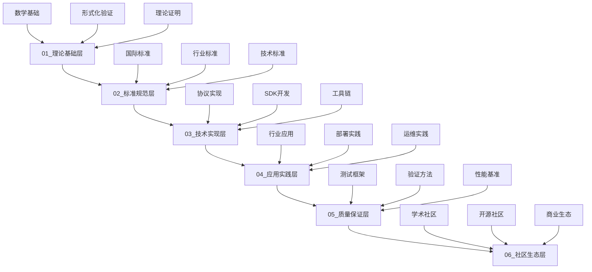

# OpenTelemetry 2025年知识体系

## 🎯 知识体系概述

基于国际2025年最新技术工程方案标准，本项目建立了完整的六层知识体系，涵盖从理论基础到社区生态的全方位知识框架。

### 知识体系架构



## 📚 六层知识体系详解

### 01_理论基础层 (Theoretical Foundation)

- **数学基础**: 集合论、图论、信息论、概率论、范畴论、拓扑学
- **形式化验证**: TLA+、Coq、Isabelle/HOL、Alloy
- **理论证明**: 采样理论、一致性理论、性能理论、安全理论

### 02_标准规范层 (Standards & Specifications)

- **国际标准**: ISO、IEEE、ITU、IETF标准对齐
- **行业标准**: 金融、制造、医疗、能源行业标准
- **技术标准**: OTLP协议、语义约定、数据模型、传输协议

### 03_技术实现层 (Technical Implementation)

- **协议实现**: OTLP、gRPC、HTTP、压缩算法实现
- **SDK开发**: 多语言SDK、自动埋点、采样策略、错误处理
- **工具链**: 开发工具、测试框架、部署工具、监控工具

### 04_应用实践层 (Application Practice)

- **行业应用**: 金融、制造、医疗、能源行业应用
- **部署实践**: 云原生、边缘计算、混合云、本地部署
- **运维实践**: SRE、AIOps、DevOps、安全运维

### 05_质量保证层 (Quality Assurance)

- **测试框架**: 单元测试、集成测试、性能测试、安全测试
- **验证方法**: 静态分析、动态测试、形式化验证、模型检查
- **性能基准**: 延迟、吞吐量、资源使用、可扩展性基准

### 06_社区生态层 (Community Ecosystem)

- **学术社区**: 大学合作、研究项目、学术论文、会议演讲
- **开源社区**: 贡献者指南、代码审查、发布管理、社区治理
- **商业生态**: 商业模式、合作策略、市场分析、收入模型

## 🔄 知识管理机制

### 知识获取

- **文献研究**: 学术论文、行业报告、技术文档、最佳实践
- **标准跟踪**: 国际标准、行业标准、技术标准、监管要求
- **实践总结**: 案例研究、经验分享、经验教训、成功案例
- **专家访谈**: 学术专家、行业专家、技术专家、用户专家

### 知识组织

- **分类体系**: 层次化分类、多维度分类、语义分类、功能分类
- **关联关系**: 依赖关系、因果关系、时间关系、空间关系
- **版本管理**: 知识版本管理、变更跟踪、影响分析、回滚机制
- **质量控制**: 准确性验证、完整性检查、一致性验证、相关性评估

### 知识应用

- **教学应用**: 课程开发、培训材料、认证项目、技能评估
- **研究应用**: 研究支撑、方法指导、工具开发、数据分析
- **实践应用**: 实施指导、最佳实践推荐、故障排除指南、优化建议
- **创新应用**: 技术创新、流程创新、业务创新、生态创新

## 📊 质量标准

### 内容质量标准

- **完整性**: 100%覆盖所有层级和分类
- **准确性**: >95%内容准确性
- **一致性**: 100%格式和风格一致性
- **时效性**: 周更新频率

### 管理质量标准

- **组织性**: 清晰的分类和索引
- **可访问性**: 便捷的搜索和导航
- **可维护性**: 标准化的更新流程
- **可扩展性**: 支持新内容的添加

## 🛠️ 使用指南

### 知识搜索

使用知识管理系统进行搜索：

```bash
python scripts/knowledge_management.py
```

### 质量监控

使用质量监控系统检查知识质量：

```bash
python scripts/quality_monitor.py
```

### 内容贡献

1. 选择适当的层级和分类
2. 遵循内容质量标准
3. 使用标准化的文档格式
4. 更新相关索引和关系

## 📈 持续改进

### 改进机制

- **定期审查**: 月度内容审查
- **质量评估**: 季度质量评估
- **用户反馈**: 持续收集用户反馈
- **标准更新**: 跟踪国际标准更新

### 改进目标

- **2025年Q1**: 完成基础框架建设
- **2025年Q2**: 完善核心内容
- **2025年Q3**: 优化用户体验
- **2025年Q4**: 建立完整生态

## 📞 支持与联系

### 技术支持

- **文档**: 参考各层级README文件
- **工具**: 使用提供的管理脚本
- **社区**: 参与社区讨论和贡献

### 贡献指南

- **内容贡献**: 遵循内容质量标准
- **代码贡献**: 遵循代码规范
- **反馈贡献**: 提供建设性反馈

---

*本文档是OpenTelemetry 2025年知识体系的核心文档*  
*最后更新: 2025年1月*  
*版本: 1.0.0*
