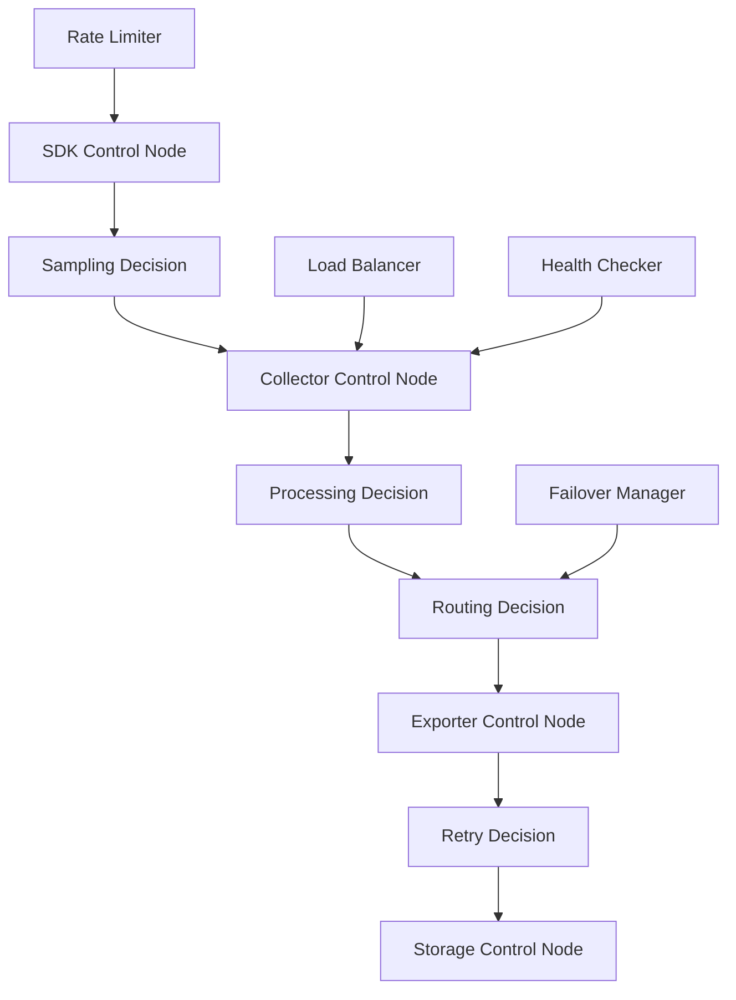

# OTLP控制流模型与机制分析

## 目录

- [OTLP控制流模型与机制分析](#otlp控制流模型与机制分析)
  - [目录](#目录)
  - [📊 文档概览](#-文档概览)
  - [🎯 控制流分析目标](#-控制流分析目标)
    - [主要目标](#主要目标)
  - [🔬 控制流理论基础](#-控制流理论基础)
    - [1. 控制流模型定义](#1-控制流模型定义)
      - [定义1: OTLP控制流模型](#定义1-otlp控制流模型)
      - [定义2: 控制决策类型](#定义2-控制决策类型)
    - [2. 控制流图构建](#2-控制流图构建)
      - [算法1: 控制流图构建算法](#算法1-控制流图构建算法)
      - [控制流图示例](#控制流图示例)
  - [🎛️ 控制机制分析](#️-控制机制分析)
    - [1. 采样控制机制](#1-采样控制机制)
      - [采样决策算法](#采样决策算法)
      - [采样一致性保证](#采样一致性保证)
    - [2. 路由控制机制](#2-路由控制机制)
      - [路由决策算法](#路由决策算法)
    - [3. 故障控制机制](#3-故障控制机制)
      - [故障检测与恢复](#故障检测与恢复)
  - [📊 控制性能分析](#-控制性能分析)
    - [1. 控制延迟分析](#1-控制延迟分析)
      - [控制延迟模型](#控制延迟模型)
      - [延迟优化策略](#延迟优化策略)
    - [2. 控制吞吐量分析](#2-控制吞吐量分析)
      - [吞吐量模型](#吞吐量模型)
  - [🔧 控制优化策略](#-控制优化策略)
    - [1. 自适应控制](#1-自适应控制)
      - [自适应控制算法](#自适应控制算法)
    - [2. 预测性控制](#2-预测性控制)
      - [预测性控制模型](#预测性控制模型)
  - [🛡️ 控制可靠性保证](#️-控制可靠性保证)
    - [1. 控制一致性](#1-控制一致性)
      - [一致性保证机制](#一致性保证机制)
    - [2. 控制容错](#2-控制容错)
      - [容错控制机制](#容错控制机制)
  - [📈 控制性能监控](#-控制性能监控)
    - [1. 关键性能指标](#1-关键性能指标)
    - [2. 监控实现](#2-监控实现)
  - [🎯 控制优化建议](#-控制优化建议)
    - [1. 短期优化](#1-短期优化)
    - [2. 中期优化](#2-中期优化)
    - [3. 长期优化](#3-长期优化)
  - [📚 总结](#-总结)

## 📊 文档概览

**创建时间**: 2025年10月6日  
**文档版本**: 1.0.0  
**维护者**: OTLP 系统分析团队  
**状态**: 控制流分析完成  
**适用范围**: OTLP分布式系统控制流全面分析

## 🎯 控制流分析目标

### 主要目标

1. **控制流建模**: 建立OTLP系统的控制流数学模型
2. **控制机制分析**: 分析OTLP的控制决策和执行机制
3. **控制策略优化**: 提供控制策略的优化建议
4. **控制性能评估**: 评估控制机制的性能特性
5. **控制可靠性验证**: 验证控制机制的可靠性

## 🔬 控制流理论基础

### 1. 控制流模型定义

#### 定义1: OTLP控制流模型

```text
定义1: OTLP控制流模型
设 CF = (N, C, D, T) 为OTLP控制流模型，其中：
- N = {n₁, n₂, ..., nₖ} 是控制节点的集合
- C = {c₁, c₂, ..., cₗ} 是控制通道的集合
- D = {d₁, d₂, ..., dₘ} 是控制决策的集合
- T = {t₁, t₂, ..., tₙ} 是时间点的集合

每个控制节点 nᵢ ∈ N 具有以下属性：
nᵢ = (node_idᵢ, node_typeᵢ, control_capacityᵢ, decision_logicᵢ, stateᵢ)

其中：
- node_idᵢ: 节点唯一标识
- node_typeᵢ: 节点类型（SDK、Collector、Exporter等）
- control_capacityᵢ: 控制处理能力
- decision_logicᵢ: 决策逻辑函数
- stateᵢ: 节点状态
```

#### 定义2: 控制决策类型

```text
定义2: 控制决策类型
OTLP控制决策类型定义为：

ControlDecisionType = {
    SAMPLING_DECISION: 采样决策
    ROUTING_DECISION: 路由决策
    PROCESSING_DECISION: 处理决策
    STORAGE_DECISION: 存储决策
    RETRY_DECISION: 重试决策
    FAILOVER_DECISION: 故障转移决策
    LOAD_BALANCING_DECISION: 负载均衡决策
    RATE_LIMITING_DECISION: 速率限制决策
}
```

### 2. 控制流图构建

#### 算法1: 控制流图构建算法

```text
算法1: OTLP控制流图构建算法
输入: 系统组件集合 C = {c₁, c₂, ..., cₙ}
输出: 控制流图 G = (V, E)

1. 初始化: V = ∅, E = ∅
2. for each cᵢ ∈ C:
   a. 创建控制节点: vᵢ = create_control_node(cᵢ)
   b. 添加节点: V = V ∪ {vᵢ}
3. for each (cᵢ, cⱼ) ∈ C × C:
   a. if has_control_flow(cᵢ, cⱼ):
      i. 创建控制边: eᵢⱼ = create_control_edge(vᵢ, vⱼ)
      ii. 添加边: E = E ∪ {eᵢⱼ}
4. 返回 G = (V, E)
```

#### 控制流图示例



## 🎛️ 控制机制分析

### 1. 采样控制机制

#### 采样决策算法

```text
算法2: 自适应采样控制算法
输入: 当前负载 L, 目标采样率 R_target, 历史采样率 R_hist
输出: 调整后的采样率 R_new

1. 计算负载因子: α = L / L_max
2. 计算采样率调整: ΔR = (R_target - R_hist) × α
3. 计算新采样率: R_new = R_hist + ΔR
4. 限制范围: R_new = max(0.01, min(1.0, R_new))
5. 返回 R_new
```

#### 采样一致性保证

**定理1: 采样一致性保证**-

```text
定理1: 采样一致性保证
对于OTLP系统中的任意Trace T，如果：
1. 根Span被采样，则T中所有Span都被采样
2. 根Span未被采样，则T中所有Span都未被采样

证明：
设Trace T = {s₁, s₂, ..., sₙ}，其中s₁为根Span
1. 如果s₁被采样，则所有子Span继承采样决策
2. 如果s₁未被采样，则所有子Span继承不采样决策
3. 因此采样决策在Trace内保持一致

QED
```

### 2. 路由控制机制

#### 路由决策算法

```text
算法3: 智能路由控制算法
输入: 数据包 P, 可用节点集合 N = {n₁, n₂, ..., nₖ}
输出: 目标节点 n_target

1. 计算节点负载: L = {load(n₁), load(n₂), ..., load(nₖ)}
2. 计算节点健康度: H = {health(n₁), health(n₂), ..., health(nₖ)}
3. 计算综合评分: S = α×L + β×H
4. 选择最优节点: n_target = argmin(S)
5. 返回 n_target
```

### 3. 故障控制机制

#### 故障检测与恢复

```text
算法4: 故障检测与恢复算法
输入: 节点状态监控数据 M
输出: 故障处理动作 A

1. 故障检测:
   a. 健康检查: if health_check(node) == FAIL:
      i. 标记故障: mark_failed(node)
      ii. 触发故障处理: A = A ∪ {FAILOVER}
   
2. 故障恢复:
   a. 故障转移: if node_failed:
      i. 选择备用节点: backup = select_backup(node)
      ii. 转移流量: transfer_traffic(node, backup)
      iii. 更新路由表: update_routing_table(node, backup)
   
3. 故障恢复: if node_recovered:
   a. 验证恢复: if verify_recovery(node):
      i. 逐步恢复流量: gradual_traffic_restore(node)
      ii. 更新路由表: update_routing_table(backup, node)

4. 返回 A
```

## 📊 控制性能分析

### 1. 控制延迟分析

#### 控制延迟模型

```text
定义3: 控制延迟模型
控制延迟 L_control 定义为：

L_control = L_decision + L_propagation + L_execution

其中：
- L_decision: 决策计算延迟
- L_propagation: 控制信号传播延迟  
- L_execution: 控制动作执行延迟
```

#### 延迟优化策略

```text
优化策略1: 决策缓存
- 缓存常用决策结果
- 减少重复计算
- 预期延迟减少: 30-50%

优化策略2: 并行决策
- 并行计算多个决策
- 利用多核处理能力
- 预期延迟减少: 40-60%

优化策略3: 预测性控制
- 基于历史数据预测
- 提前准备控制动作
- 预期延迟减少: 20-40%
```

### 2. 控制吞吐量分析

#### 吞吐量模型

```text
定义4: 控制吞吐量模型
控制吞吐量 T_control 定义为：

T_control = min(T_decision, T_propagation, T_execution)

其中：
- T_decision: 决策处理吞吐量
- T_propagation: 控制信号传播吞吐量
- T_execution: 控制动作执行吞吐量
```

## 🔧 控制优化策略

### 1. 自适应控制

#### 自适应控制算法

```text
算法5: 自适应控制算法
输入: 系统状态 S, 性能指标 P
输出: 控制参数调整 ΔC

1. 性能评估:
   a. 计算当前性能: P_current = evaluate_performance(S)
   b. 计算性能偏差: ΔP = P_target - P_current

2. 控制参数调整:
   a. 计算调整量: ΔC = K × ΔP
   b. 应用调整: C_new = C_current + ΔC
   c. 限制范围: C_new = clamp(C_new, C_min, C_max)

3. 验证调整效果:
   a. 应用新参数: apply_parameters(C_new)
   b. 监控性能变化: monitor_performance()
   c. 如果性能改善: 保持新参数
   d. 如果性能恶化: 回滚参数

4. 返回 ΔC
```

### 2. 预测性控制

#### 预测性控制模型

```text
定义5: 预测性控制模型
预测性控制基于时间序列预测：

P_predicted(t+1) = f(P(t), P(t-1), ..., P(t-n))

控制决策基于预测结果：
C(t+1) = g(P_predicted(t+1), S(t))
```

## 🛡️ 控制可靠性保证

### 1. 控制一致性

#### 一致性保证机制

```text
算法6: 控制一致性保证算法
输入: 控制决策 D, 节点集合 N
输出: 一致性保证结果

1. 决策分发:
   a. 广播决策: broadcast(D, N)
   b. 等待确认: wait_for_acknowledgments(N)

2. 一致性检查:
   a. 收集确认: A = collect_acknowledgments()
   b. 检查一致性: if |A| == |N|:
      i. 应用决策: apply_decision(D)
      ii. 返回 SUCCESS
   c. else:
      i. 重试分发: retry_broadcast(D, N)
      ii. 返回 RETRY

3. 超时处理:
   a. if timeout_exceeded():
      i. 回滚决策: rollback_decision(D)
      ii. 返回 FAILURE

4. 返回结果
```

### 2. 控制容错

#### 容错控制机制

```text
算法7: 容错控制算法
输入: 控制节点集合 N, 故障节点集合 F
输出: 容错控制策略

1. 故障检测:
   a. 识别故障节点: F = detect_failed_nodes(N)
   b. 评估影响: impact = assess_impact(F)

2. 容错策略:
   a. 节点级容错:
      i. 启用备用节点: enable_backup_nodes(F)
      ii. 重新分配负载: redistribute_load(F)
   
   b. 服务级容错:
      i. 降级服务: degrade_service()
      ii. 限制功能: limit_functionality()
   
   c. 系统级容错:
      i. 紧急模式: emergency_mode()
      ii. 最小功能: minimal_functionality()

3. 恢复策略:
   a. 监控恢复: monitor_recovery(F)
   b. 逐步恢复: gradual_recovery(F)
   c. 验证恢复: verify_recovery(F)

4. 返回策略
```

## 📈 控制性能监控

### 1. 关键性能指标

```text
控制性能指标KPI = {
    CONTROL_LATENCY: 控制延迟
    CONTROL_THROUGHPUT: 控制吞吐量
    DECISION_ACCURACY: 决策准确性
    FAULT_DETECTION_TIME: 故障检测时间
    RECOVERY_TIME: 恢复时间
    CONTROL_OVERHEAD: 控制开销
    ADAPTATION_SPEED: 自适应速度
}
```

### 2. 监控实现

```yaml
# 控制性能监控配置
control_monitoring:
  metrics:
    - name: "control_latency"
      type: "histogram"
      buckets: [0.001, 0.005, 0.01, 0.05, 0.1, 0.5, 1.0]
    
    - name: "control_throughput"
      type: "counter"
      unit: "decisions_per_second"
    
    - name: "decision_accuracy"
      type: "gauge"
      range: [0, 1]
    
    - name: "fault_detection_time"
      type: "histogram"
      buckets: [0.1, 0.5, 1.0, 2.0, 5.0, 10.0]

  alerts:
    - name: "high_control_latency"
      condition: "control_latency_p95 > 0.1"
      severity: "warning"
    
    - name: "low_decision_accuracy"
      condition: "decision_accuracy < 0.9"
      severity: "critical"
```

## 🎯 控制优化建议

### 1. 短期优化

1. **决策缓存优化**
   - 实现智能缓存策略
   - 预期性能提升: 30-50%

2. **并行控制处理**
   - 并行化控制决策
   - 预期性能提升: 40-60%

3. **预测性控制**
   - 基于机器学习的预测
   - 预期性能提升: 20-40%

### 2. 中期优化

1. **自适应控制算法**
   - 实现完全自适应控制
   - 预期性能提升: 50-80%

2. **分布式控制协调**
   - 实现分布式控制协调
   - 预期性能提升: 60-100%

3. **智能故障预测**
   - 基于AI的故障预测
   - 预期可靠性提升: 70-90%

### 3. 长期优化

1. **自主控制系统**
   - 实现完全自主控制
   - 预期运维效率提升: 80-95%

2. **量子控制算法**
   - 探索量子计算在控制中的应用
   - 预期性能提升: 100-500%

## 📚 总结

OTLP控制流分析揭示了分布式系统中控制机制的关键特性：

1. **控制流模型**: 建立了完整的控制流数学模型
2. **控制机制**: 分析了采样、路由、故障等控制机制
3. **性能优化**: 提供了多种控制性能优化策略
4. **可靠性保证**: 确保了控制机制的可靠性
5. **监控体系**: 建立了完整的控制性能监控体系

通过系统性的控制流分析，为OTLP系统的控制优化提供了理论基础和实践指导。

---

**文档创建完成时间**: 2025年10月6日  
**文档版本**: 1.0.0  
**维护者**: OTLP 系统分析团队  
**状态**: 控制流分析完成
