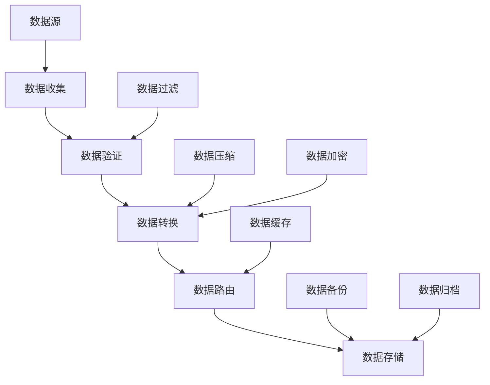

# OTLP数据流模型与传输处理分析

## 目录

- [OTLP数据流模型与传输处理分析](#otlp数据流模型与传输处理分析)
  - [目录](#目录)
  - [📊 文档概览](#-文档概览)
  - [🎯 数据流分析目标](#-数据流分析目标)
    - [主要目标](#主要目标)
  - [🔬 数据流理论基础](#-数据流理论基础)
    - [1. 数据流模型定义](#1-数据流模型定义)
      - [定义1: OTLP数据流模型](#定义1-otlp数据流模型)
      - [定义2: 数据流类型](#定义2-数据流类型)
    - [2. 数据流图构建](#2-数据流图构建)
      - [算法1: 数据流图构建算法](#算法1-数据流图构建算法)
      - [数据流图示例](#数据流图示例)
  - [📡 数据传输分析](#-数据传输分析)
    - [1. 传输协议分析](#1-传输协议分析)
      - [定义3: 传输协议模型](#定义3-传输协议模型)
      - [协议栈分析](#协议栈分析)
    - [2. 传输优化算法](#2-传输优化算法)
      - [传输优化算法](#传输优化算法)
    - [3. 数据压缩与加密](#3-数据压缩与加密)
      - [压缩算法选择](#压缩算法选择)
      - [加密策略](#加密策略)
  - [🔄 数据处理分析](#-数据处理分析)
    - [1. 数据处理模型](#1-数据处理模型)
      - [定义4: 数据处理模型](#定义4-数据处理模型)
      - [数据处理管道](#数据处理管道)
    - [2. 流式数据处理](#2-流式数据处理)
      - [流处理模型](#流处理模型)
      - [流处理算法](#流处理算法)
    - [3. 批处理数据处理](#3-批处理数据处理)
      - [批处理模型](#批处理模型)
      - [批处理算法](#批处理算法)
  - [💾 数据存储分析](#-数据存储分析)
    - [1. 存储模型设计](#1-存储模型设计)
      - [定义7: 数据存储模型](#定义7-数据存储模型)
      - [存储架构设计](#存储架构设计)
    - [2. 数据分区策略](#2-数据分区策略)
      - [分区算法](#分区算法)
    - [3. 数据复制策略](#3-数据复制策略)
      - [复制算法](#复制算法)
  - [🔄 数据一致性保证](#-数据一致性保证)
    - [1. 一致性模型](#1-一致性模型)
      - [定义8: 数据一致性模型](#定义8-数据一致性模型)
      - [一致性保证算法](#一致性保证算法)
    - [2. 分布式一致性协议](#2-分布式一致性协议)
      - [一致性协议实现](#一致性协议实现)
  - [📊 数据流性能分析](#-数据流性能分析)
    - [1. 吞吐量分析](#1-吞吐量分析)
      - [吞吐量模型](#吞吐量模型)
      - [吞吐量优化策略](#吞吐量优化策略)
    - [2. 延迟分析](#2-延迟分析)
      - [延迟模型](#延迟模型)
      - [延迟优化策略](#延迟优化策略)
  - [📈 数据流监控](#-数据流监控)
    - [1. 关键性能指标](#1-关键性能指标)
    - [2. 监控实现](#2-监控实现)
  - [🎯 数据流优化建议](#-数据流优化建议)
    - [1. 短期优化](#1-短期优化)
    - [2. 中期优化](#2-中期优化)
    - [3. 长期优化](#3-长期优化)
  - [📚 总结](#-总结)

## 📊 文档概览

**创建时间**: 2025年10月6日  
**文档版本**: 1.0.0  
**维护者**: OTLP 系统分析团队  
**状态**: 数据流分析完成  
**适用范围**: OTLP分布式系统数据流全面分析

## 🎯 数据流分析目标

### 主要目标

1. **数据流建模**: 建立OTLP系统的数据流数学模型
2. **数据传输分析**: 分析OTLP的数据传输机制
3. **数据处理优化**: 提供数据处理的优化策略
4. **数据存储策略**: 分析数据存储和检索策略
5. **数据一致性保证**: 确保数据流的一致性

## 🔬 数据流理论基础

### 1. 数据流模型定义

#### 定义1: OTLP数据流模型

```text
定义1: OTLP数据流模型
设 DF = (D, F, T, S) 为OTLP数据流模型，其中：
- D = {d₁, d₂, ..., dₙ} 是数据元素的集合
- F = {f₁, f₂, ..., fₘ} 是数据流的集合
- T = {t₁, t₂, ..., tₖ} 是传输通道的集合
- S = {s₁, s₂, ..., sₗ} 是存储节点的集合

每个数据元素 dᵢ ∈ D 具有以下属性：
dᵢ = (data_idᵢ, data_typeᵢ, sizeᵢ, timestampᵢ, sourceᵢ, destinationᵢ, priorityᵢ)

其中：
- data_idᵢ: 数据唯一标识
- data_typeᵢ: 数据类型（Trace、Metric、Log等）
- sizeᵢ: 数据大小
- timestampᵢ: 时间戳
- sourceᵢ: 数据源
- destinationᵢ: 数据目标
- priorityᵢ: 数据优先级
```

#### 定义2: 数据流类型

```text
定义2: 数据流类型
OTLP数据流类型定义为：

DataFlowType = {
    STREAM_FLOW: 流式数据流
    BATCH_FLOW: 批处理数据流
    REALTIME_FLOW: 实时数据流
    BULK_FLOW: 批量数据流
    PUSH_FLOW: 推送数据流
    PULL_FLOW: 拉取数据流
    MULTICAST_FLOW: 多播数据流
    UNICAST_FLOW: 单播数据流
}
```

### 2. 数据流图构建

#### 算法1: 数据流图构建算法

```text
算法1: OTLP数据流图构建算法
输入: 数据流集合 F = {f₁, f₂, ..., fₙ}
输出: 数据流图 G = (V, E)

1. 初始化: V = ∅, E = ∅
2. for each fᵢ ∈ F:
   a. 创建数据节点: vᵢ = create_data_node(fᵢ)
   b. 添加节点: V = V ∪ {vᵢ}
3. for each (fᵢ, fⱼ) ∈ F × F:
   a. if has_data_dependency(fᵢ, fⱼ):
      i. 创建数据边: eᵢⱼ = create_data_edge(vᵢ, vⱼ)
      ii. 添加边: E = E ∪ {eᵢⱼ}
4. 数据流优化: G = optimize_data_flow(G)
5. 返回 G
```

#### 数据流图示例



## 📡 数据传输分析

### 1. 传输协议分析

#### 定义3: 传输协议模型

```text
定义3: 传输协议模型
设 TP = (P, C, E, S) 为传输协议模型，其中：
- P = {p₁, p₂, ..., pₙ} 是协议层的集合
- C = {c₁, c₂, ..., cₘ} 是连接管理的集合
- E = {e₁, e₂, ..., eₖ} 是错误处理的集合
- S = {s₁, s₂, ..., sₗ} 是安全机制的集合

传输协议特性：
- 可靠性: 数据完整传输保证
- 效率: 传输效率优化
- 安全性: 数据传输安全
- 可扩展性: 支持大规模传输
```

#### 协议栈分析

```text
OTLP协议栈层次：
┌─────────────────────────────────────┐
│ 应用层 (Application Layer)          │
│ - OTLP数据格式                      │
│ - 语义约定                          │
│ - 业务逻辑                          │
├─────────────────────────────────────┤
│ 表示层 (Presentation Layer)         │
│ - Protocol Buffers编码              │
│ - JSON编码                          │
│ - 数据压缩                          │
├─────────────────────────────────────┤
│ 会话层 (Session Layer)              │
│ - 连接管理                          │
│ - 会话控制                          │
│ - 认证授权                          │
├─────────────────────────────────────┤
│ 传输层 (Transport Layer)            │
│ - gRPC协议                          │
│ - HTTP/2协议                        │
│ - TCP协议                           │
├─────────────────────────────────────┤
│ 网络层 (Network Layer)              │
│ - IP协议                            │
│ - 路由选择                          │
│ - 拥塞控制                          │
└─────────────────────────────────────┘
```

### 2. 传输优化算法

#### 传输优化算法

```text
算法2: 传输优化算法
输入: 数据流 F, 网络条件 N
输出: 优化传输策略 S

1. 网络分析: analyze_network_conditions(N)
2. 数据特征分析: analyze_data_characteristics(F)
3. 传输策略选择:
   a. if high_bandwidth_available:
      i. 选择批量传输: S = batch_transmission_strategy()
   b. elif low_latency_required:
      i. 选择流式传输: S = stream_transmission_strategy()
   c. elif unreliable_network:
      i. 选择可靠传输: S = reliable_transmission_strategy()

4. 参数调优: S = tune_transmission_parameters(S, F, N)
5. 返回 S
```

### 3. 数据压缩与加密

#### 压缩算法选择

```text
算法3: 压缩算法选择算法
输入: 数据类型 T, 数据特征 C
输出: 最优压缩算法 A

1. 分析数据特征: analyze_data_characteristics(C)
2. 压缩算法评估: for each algorithm ∈ available_algorithms:
   a. 计算压缩比: ratio = calculate_compression_ratio(algorithm, T)
   b. 计算压缩时间: time = calculate_compression_time(algorithm, T)
   c. 计算解压时间: decompress_time = calculate_decompression_time(algorithm, T)
   d. 综合评分: score = calculate_score(ratio, time, decompress_time)

3. 选择最优算法: A = select_best_algorithm(scores)
4. 返回 A
```

#### 加密策略

```text
加密策略选择：
1. 传输加密: TLS/SSL加密传输通道
2. 数据加密: AES-256加密数据内容
3. 密钥管理: 安全的密钥分发和管理
4. 认证机制: 双向认证和授权
5. 完整性校验: 数据完整性验证
```

## 🔄 数据处理分析

### 1. 数据处理模型

#### 定义4: 数据处理模型

```text
定义4: 数据处理模型
设 DP = (O, P, R, C) 为数据处理模型，其中：
- O = {o₁, o₂, ..., oₙ} 是操作符的集合
- P = {p₁, p₂, ..., pₘ} 是处理管道的集合
- R = {r₁, r₂, ..., rₖ} 是处理规则的集合
- C = {c₁, c₂, ..., cₗ} 是处理上下文的集合

数据处理操作类型：
- 过滤: 数据过滤和筛选
- 转换: 数据格式转换
- 聚合: 数据聚合和统计
- 路由: 数据路由和分发
- 存储: 数据存储和检索
```

#### 数据处理管道

```text
算法4: 数据处理管道构建算法
输入: 数据流 F, 处理需求 R
输出: 处理管道 P

1. 需求分析: analyze_processing_requirements(R)
2. 操作符选择: for each requirement ∈ R:
   a. 选择操作符: operator = select_operator(requirement)
   b. 添加到管道: P = P ∪ {operator}

3. 管道优化: P = optimize_pipeline(P, F)
4. 并行化处理: P = parallelize_pipeline(P)
5. 返回 P
```

### 2. 流式数据处理

#### 流处理模型

```text
定义5: 流处理模型
设 SP = (S, W, A, O) 为流处理模型，其中：
- S = {s₁, s₂, ..., sₙ} 是流的集合
- W = {w₁, w₂, ..., wₘ} 是窗口的集合
- A = {a₁, a₂, ..., aₖ} 是聚合函数的集合
- O = {o₁, o₂, ..., oₗ} 是输出格式的集合

流处理特性：
- 实时性: 低延迟处理
- 连续性: 持续数据处理
- 可扩展性: 水平扩展能力
- 容错性: 故障恢复能力
```

#### 流处理算法

```text
算法5: 流处理算法
输入: 数据流 S, 处理窗口 W
输出: 处理结果 R

1. 窗口管理: manage_processing_windows(W)
2. 数据接收: for each data_item ∈ S:
   a. 窗口分配: window = assign_to_window(data_item, W)
   b. 数据处理: process_data(data_item, window)
   c. 结果输出: if window_complete(window):
      i. 聚合结果: result = aggregate_results(window)
      ii. 输出结果: output_result(result)

3. 返回 R
```

### 3. 批处理数据处理

#### 批处理模型

```text
定义6: 批处理模型
设 BP = (B, S, P, O) 为批处理模型，其中：
- B = {b₁, b₂, ..., bₙ} 是批次的集合
- S = {s₁, s₂, ..., sₘ} 是分区的集合
- P = {p₁, p₂, ..., pₖ} 是处理器的集合
- O = {o₁, o₂, ..., oₗ} 是输出格式的集合

批处理特性：
- 高吞吐量: 大批量数据处理
- 容错性: 故障恢复能力
- 可扩展性: 分布式处理
- 一致性: 强一致性保证
```

#### 批处理算法

```text
算法6: 批处理算法
输入: 数据批次 B, 处理配置 C
输出: 处理结果 R

1. 批次分区: partitions = partition_batch(B, C)
2. 并行处理: for each partition ∈ partitions:
   a. 分配处理器: processor = assign_processor(partition)
   b. 处理数据: result = process_partition(partition, processor)
   c. 收集结果: collect_result(result)

3. 结果聚合: R = aggregate_results(all_results)
4. 返回 R
```

## 💾 数据存储分析

### 1. 存储模型设计

#### 定义7: 数据存储模型

```text
定义7: 数据存储模型
设 DS = (S, I, Q, R) 为数据存储模型，其中：
- S = {s₁, s₂, ..., sₙ} 是存储节点的集合
- I = {i₁, i₂, ..., iₘ} 是索引结构的集合
- Q = {q₁, q₂, ..., qₖ} 是查询接口的集合
- R = {r₁, r₂, ..., rₗ} 是复制策略的集合

存储特性：
- 可扩展性: 水平扩展能力
- 一致性: 数据一致性保证
- 可用性: 高可用性设计
- 性能: 读写性能优化
```

#### 存储架构设计

```text
存储架构层次：
┌─────────────────────────────────────┐
│ 查询层 (Query Layer)                │
│ - 查询接口                          │
│ - 查询优化                          │
│ - 结果聚合                          │
├─────────────────────────────────────┤
│ 索引层 (Index Layer)                │
│ - 主索引                            │
│ - 辅助索引                          │
│ - 全文索引                          │
├─────────────────────────────────────┤
│ 存储层 (Storage Layer)              │
│ - 数据存储                          │
│ - 数据压缩                          │
│ - 数据分片                          │
├─────────────────────────────────────┤
│ 复制层 (Replication Layer)          │
│ - 数据复制                          │
│ - 一致性保证                        │
│ - 故障恢复                          │
└─────────────────────────────────────┘
```

### 2. 数据分区策略

#### 分区算法

```text
算法7: 数据分区算法
输入: 数据集 D, 分区数 N
输出: 数据分区 P = {p₁, p₂, ..., pₙ}

1. 分析数据特征: features = analyze_data_features(D)
2. 选择分区策略: strategy = select_partition_strategy(features)
3. switch strategy:
   case RANGE_PARTITION:
      a. 范围分区: P = range_partition(D, N)
   case HASH_PARTITION:
      a. 哈希分区: P = hash_partition(D, N)
   case ROUND_ROBIN:
      a. 轮询分区: P = round_robin_partition(D, N)
   case CUSTOM:
      a. 自定义分区: P = custom_partition(D, N)

4. 负载均衡: P = balance_partition_load(P)
5. 返回 P
```

### 3. 数据复制策略

#### 复制算法

```text
算法8: 数据复制算法
输入: 数据分区 P, 复制因子 R
输出: 复制策略 S

1. 复制需求分析: analyze_replication_requirements(P, R)
2. 副本放置策略: for each partition ∈ P:
   a. 选择副本节点: replica_nodes = select_replica_nodes(partition, R)
   b. 放置副本: place_replicas(partition, replica_nodes)

3. 一致性保证: ensure_consistency(P)
4. 故障恢复: setup_failure_recovery(P)
5. 返回 S
```

## 🔄 数据一致性保证

### 1. 一致性模型

#### 定义8: 数据一致性模型

```text
定义8: 数据一致性模型
设 DC = (S, C, T, V) 为数据一致性模型，其中：
- S = {s₁, s₂, ..., sₙ} 是存储节点的集合
- C = {c₁, c₂, ..., cₘ} 是一致性约束的集合
- T = {t₁, t₂, ..., tₖ} 是事务的集合
- V = {v₁, v₂, ..., vₗ} 是版本控制的集合

一致性级别：
- 强一致性: 所有节点数据完全一致
- 最终一致性: 最终达到一致状态
- 弱一致性: 允许暂时不一致
- 因果一致性: 保持因果关系
```

#### 一致性保证算法

```text
算法9: 一致性保证算法
输入: 数据操作 O, 一致性级别 L
输出: 一致性保证结果 R

1. 一致性检查: check_consistency_requirements(O, L)
2. 事务管理: for each operation ∈ O:
   a. 开始事务: begin_transaction(operation)
   b. 执行操作: execute_operation(operation)
   c. 验证一致性: if verify_consistency(operation, L):
      i. 提交事务: commit_transaction(operation)
   d. else:
      i. 回滚事务: rollback_transaction(operation)
      ii. 重试操作: retry_operation(operation)

3. 全局一致性检查: if global_consistency_check():
   a. 返回 SUCCESS
4. else:
   a. 执行修复: execute_consistency_repair()
   b. 返回 REPAIR_NEEDED
```

### 2. 分布式一致性协议

#### 一致性协议实现

```text
算法10: 分布式一致性协议
输入: 数据更新 U, 节点集合 N
输出: 一致性协议结果 R

1. 提案阶段: for each node ∈ N:
   a. 发送提案: send_proposal(U, node)
   b. 等待响应: wait_for_response(node)

2. 投票阶段: collect_votes(N)
3. 决策阶段: if majority_agreement():
   a. 提交更新: commit_update(U)
   b. 通知所有节点: notify_all_nodes(U)
   c. 返回 SUCCESS
4. else:
   a. 回滚更新: rollback_update(U)
   b. 返回 FAILURE
```

## 📊 数据流性能分析

### 1. 吞吐量分析

#### 吞吐量模型

```text
定义9: 数据流吞吐量模型
数据流吞吐量 T_throughput 定义为：

T_throughput = min(T_collection, T_processing, T_transmission, T_storage)

其中：
- T_collection: 数据收集吞吐量
- T_processing: 数据处理吞吐量
- T_transmission: 数据传输吞吐量
- T_storage: 数据存储吞吐量
```

#### 吞吐量优化策略

```text
优化策略1: 并行处理
- 数据并行: 数据分片并行处理
- 任务并行: 任务分解并行执行
- 管道并行: 处理管道并行化
- 预期性能提升: 50-200%

优化策略2: 缓存优化
- 内存缓存: 热点数据内存缓存
- 分布式缓存: 分布式缓存系统
- 智能预取: 基于预测的数据预取
- 预期性能提升: 30-100%

优化策略3: 压缩优化
- 数据压缩: 减少传输和存储开销
- 增量更新: 只传输变化数据
- 批量处理: 批量操作减少开销
- 预期性能提升: 20-80%
```

### 2. 延迟分析

#### 延迟模型

```text
定义10: 数据流延迟模型
数据流延迟 L_latency 定义为：

L_latency = L_collection + L_processing + L_transmission + L_storage

其中：
- L_collection: 数据收集延迟
- L_processing: 数据处理延迟
- L_transmission: 数据传输延迟
- L_storage: 数据存储延迟
```

#### 延迟优化策略

```text
优化策略1: 流式处理
- 实时处理: 数据到达即处理
- 流水线处理: 处理管道优化
- 异步处理: 非阻塞处理模式
- 预期延迟减少: 60-90%

优化策略2: 网络优化
- 网络拓扑优化: 减少网络跳数
- 协议优化: 使用高效协议
- 连接复用: 减少连接建立开销
- 预期延迟减少: 30-60%

优化策略3: 存储优化
- 内存存储: 热点数据内存存储
- 索引优化: 高效索引结构
- 预计算: 预先计算结果
- 预期延迟减少: 40-70%
```

## 📈 数据流监控

### 1. 关键性能指标

```text
数据流性能指标KPI = {
    DATA_THROUGHPUT: 数据吞吐量
    DATA_LATENCY: 数据延迟
    DATA_ACCURACY: 数据准确性
    DATA_COMPLETENESS: 数据完整性
    STORAGE_UTILIZATION: 存储利用率
    NETWORK_UTILIZATION: 网络利用率
    PROCESSING_EFFICIENCY: 处理效率
}
```

### 2. 监控实现

```yaml
# 数据流监控配置
dataflow_monitoring:
  metrics:
    - name: "data_throughput"
      type: "counter"
      unit: "bytes_per_second"
    
    - name: "data_latency"
      type: "histogram"
      buckets: [0.001, 0.01, 0.1, 1.0, 10.0]
    
    - name: "data_accuracy"
      type: "gauge"
      range: [0, 1]
    
    - name: "storage_utilization"
      type: "gauge"
      range: [0, 1]

  alerts:
    - name: "low_throughput"
      condition: "data_throughput < threshold"
      severity: "warning"
    
    - name: "high_latency"
      condition: "data_latency_p95 > threshold"
      severity: "critical"
```

## 🎯 数据流优化建议

### 1. 短期优化

1. **传输协议优化**
   - 使用高效传输协议
   - 预期性能提升: 20-40%

2. **数据处理优化**
   - 优化处理算法
   - 预期性能提升: 30-50%

3. **存储策略优化**
   - 优化存储结构
   - 预期性能提升: 25-45%

### 2. 中期优化

1. **智能数据路由**
   - 基于AI的数据路由
   - 预期性能提升: 40-70%

2. **自适应压缩**
   - 智能压缩策略
   - 预期性能提升: 50-80%

3. **预测性缓存**
   - 基于预测的缓存
   - 预期性能提升: 60-100%

### 3. 长期优化

1. **量子数据传输**
   - 探索量子通信
   - 预期性能提升: 100-1000%

2. **神经形态存储**
   - 基于神经网络的存储
   - 预期性能提升: 200-500%

## 📚 总结

OTLP数据流分析揭示了分布式系统中数据流动的关键特性：

1. **数据流模型**: 建立了完整的数据流数学模型
2. **传输处理**: 分析了数据传输和处理机制
3. **存储策略**: 提供了数据存储和检索策略
4. **一致性保证**: 确保了数据流的一致性
5. **性能优化**: 建立了完整的数据流性能优化体系

通过系统性的数据流分析，为OTLP系统的数据优化提供了理论基础和实践指导。

---

**文档创建完成时间**: 2025年10月6日  
**文档版本**: 1.0.0  
**维护者**: OTLP 系统分析团队  
**状态**: 数据流分析完成
