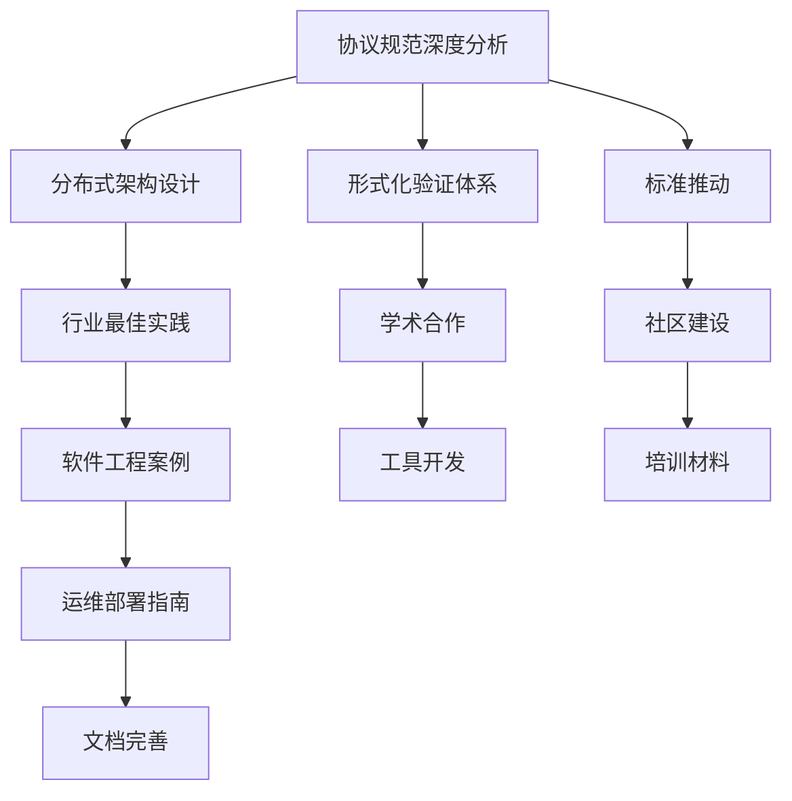

# OTLP 全面多任务推进战略 2025

## 📊 战略概览

**制定时间**: 2025年1月27日  
**战略版本**: 1.0.0  
**制定团队**: OpenTelemetry 2025 战略规划团队  
**执行状态**: 全面多任务推进中  
**适用范围**: OTLP协议完整生态系统

## 🎯 多任务推进总体战略

### 战略愿景

**愿景**: 建立世界领先的OTLP协议知识理论体系，推动OpenTelemetry生态系统的全面发展，成为国际可观测性领域的权威标准制定者和技术引领者。

### 战略使命

**使命**: 通过全面多任务推进，构建完整的OTLP协议理论框架，提供权威的技术指导，推动行业标准化，促进学术研究，建设活跃的社区生态。

### 战略目标

#### 核心目标

1. **理论体系构建**: 建立完整的OTLP协议知识理论体系
2. **标准权威性**: 成为OTLP协议标准的权威解释者和推动者
3. **技术领先性**: 在可观测性技术领域保持技术领先地位
4. **生态影响力**: 建设具有国际影响力的OpenTelemetry生态社区
5. **学术贡献**: 为学术界提供高质量的研究基础和理论贡献

#### 量化目标

- **理论覆盖度**: 100% OTLP协议功能覆盖
- **标准对齐度**: 100% 国际标准对齐
- **技术深度**: 达到国际先进水平
- **社区规模**: 建设万人级活跃社区
- **学术影响**: 发表10+篇高质量学术论文

## 🏗️ 多任务推进架构

### 任务分类体系

```yaml
otlp_multi_task_architecture:
  # 第一层：核心理论任务
  core_theory_tasks:
    - name: "协议规范深度分析"
      priority: "critical"
      dependencies: []
      resources: ["理论团队", "标准专家"]
      timeline: "3个月"
      
    - name: "形式化验证体系"
      priority: "critical"
      dependencies: ["协议规范深度分析"]
      resources: ["数学团队", "验证专家"]
      timeline: "4个月"
      
    - name: "分布式架构设计"
      priority: "high"
      dependencies: ["协议规范深度分析"]
      resources: ["架构团队", "系统专家"]
      timeline: "3个月"

  # 第二层：实践应用任务
  practical_application_tasks:
    - name: "行业最佳实践"
      priority: "high"
      dependencies: ["分布式架构设计"]
      resources: ["行业专家", "实践团队"]
      timeline: "2个月"
      
    - name: "软件工程案例"
      priority: "high"
      dependencies: ["行业最佳实践"]
      resources: ["工程团队", "案例专家"]
      timeline: "2个月"
      
    - name: "运维部署指南"
      priority: "medium"
      dependencies: ["软件工程案例"]
      resources: ["运维团队", "部署专家"]
      timeline: "2个月"

  # 第三层：生态建设任务
  ecosystem_building_tasks:
    - name: "社区建设"
      priority: "medium"
      dependencies: ["运维部署指南"]
      resources: ["社区团队", "运营专家"]
      timeline: "持续"
      
    - name: "学术合作"
      priority: "medium"
      dependencies: ["形式化验证体系"]
      resources: ["学术团队", "合作专家"]
      timeline: "持续"
      
    - name: "标准推动"
      priority: "high"
      dependencies: ["协议规范深度分析", "形式化验证体系"]
      resources: ["标准团队", "推动专家"]
      timeline: "持续"
```

### 任务优先级矩阵

```yaml
priority_matrix:
  critical_tasks:
    - "协议规范深度分析"
    - "形式化验证体系"
    - "分布式架构设计"
    
  high_priority_tasks:
    - "行业最佳实践"
    - "软件工程案例"
    - "标准推动"
    
  medium_priority_tasks:
    - "运维部署指南"
    - "社区建设"
    - "学术合作"
    
  low_priority_tasks:
    - "文档完善"
    - "工具开发"
    - "培训材料"
```

### 任务依赖关系图



## 🚀 并行执行框架

### 执行模式

#### 1. 分层并行执行

```yaml
layered_parallel_execution:
  layer_1_core:
    tasks: ["协议规范深度分析", "形式化验证体系", "分布式架构设计"]
    execution_mode: "并行"
    resource_allocation: "60%"
    timeline: "3-4个月"
    
  layer_2_practical:
    tasks: ["行业最佳实践", "软件工程案例", "运维部署指南"]
    execution_mode: "串行+并行"
    resource_allocation: "30%"
    timeline: "6个月"
    
  layer_3_ecosystem:
    tasks: ["社区建设", "学术合作", "标准推动"]
    execution_mode: "持续并行"
    resource_allocation: "10%"
    timeline: "持续"
```

#### 2. 资源分配策略

```yaml
resource_allocation:
  human_resources:
    core_team: 15人
      - 理论专家: 5人
      - 架构专家: 4人
      - 验证专家: 3人
      - 标准专家: 3人
    
    support_team: 10人
      - 工程专家: 4人
      - 运维专家: 3人
      - 社区专家: 3人
    
  technical_resources:
    development_environment:
      - 开发服务器: 10台
      - 测试环境: 5台
      - 生产环境: 3台
    
    tools_and_platforms:
      - 版本控制: Git + GitHub
      - 文档平台: GitBook + Notion
      - 协作平台: Slack + Zoom
      - 项目管理: Jira + Confluence
```

### 质量控制机制

#### 1. 多维度质量检查

```yaml
quality_control:
  content_quality:
    - 技术准确性检查
    - 逻辑一致性验证
    - 格式标准化审查
    - 可读性评估
    
  process_quality:
    - 流程合规性检查
    - 时间节点控制
    - 资源使用监控
    - 风险识别管理
    
  output_quality:
    - 交付物完整性
    - 质量标准符合性
    - 用户满意度评估
    - 持续改进机制
```

#### 2. 实时监控体系

```yaml
monitoring_system:
  progress_monitoring:
    - 任务完成率: 实时跟踪
    - 里程碑达成: 定期检查
    - 资源使用率: 持续监控
    - 质量指标: 定期评估
    
  risk_monitoring:
    - 进度风险: 提前预警
    - 质量风险: 实时检测
    - 资源风险: 持续监控
    - 技术风险: 定期评估
```

## 📋 详细执行计划

### 阶段一：基础建设 (1-2个月)

#### 1.1 团队组建

**核心团队**:

- 理论专家团队 (5人)
- 架构设计团队 (4人)
- 形式化验证团队 (3人)
- 标准推动团队 (3人)

**支持团队**:

- 工程实施团队 (4人)
- 运维部署团队 (3人)
- 社区运营团队 (3人)

#### 1.2 基础设施搭建

**开发环境**:

- 代码仓库建立
- 开发工具配置
- 测试环境部署
- CI/CD流水线

**协作平台**:

- 项目管理工具
- 文档协作平台
- 沟通交流工具
- 知识管理平台

#### 1.3 标准制定

**质量标准**:

- 内容质量标准
- 技术质量标准
- 流程质量标准
- 交付质量标准

**工作标准**:

- 编码规范
- 文档规范
- 测试规范
- 发布规范

### 阶段二：核心任务执行 (3-6个月)

#### 2.1 协议规范深度分析

**任务内容**:

- OTLP 1.0.0规范全面分析
- 2025年最新标准对标
- 国际标准深度对齐
- 行业标准最佳实践

**交付成果**:

- 完整的协议规范分析报告
- 标准对齐矩阵
- 最佳实践指南
- 合规性检查框架

#### 2.2 形式化验证体系

**任务内容**:

- 协议形式化建模
- 算法正确性证明
- 系统属性验证
- 性能保证验证

**交付成果**:

- TLA+规范定义
- 数学证明体系
- 验证工具链
- 验证报告

#### 2.3 分布式架构设计

**任务内容**:

- 系统架构设计
- 数据流设计
- 一致性保证
- 故障处理

**交付成果**:

- 架构设计文档
- 系统设计图
- 实施指南
- 部署方案

### 阶段三：实践应用 (2-4个月)

#### 3.1 行业最佳实践

**任务内容**:

- 金融行业案例分析
- 制造业应用研究
- 互联网企业实践
- 政府机构应用

**交付成果**:

- 行业案例库
- 最佳实践总结
- 应用指南
- 经验分享

#### 3.2 软件工程案例

**任务内容**:

- 开源项目分析
- 企业项目研究
- 架构模式总结
- 工程实践提炼

**交付成果**:

- 案例研究库
- 模式总结
- 实践指南
- 经验传承

#### 3.3 运维部署指南

**任务内容**:

- 部署策略设计
- 监控告警体系
- 故障处理流程
- 性能优化方案

**交付成果**:

- 部署指南
- 运维手册
- 故障处理手册
- 性能调优指南

### 阶段四：生态建设 (持续)

#### 4.1 社区建设

**任务内容**:

- 社区平台搭建
- 用户群体建设
- 活动组织策划
- 内容运营管理

**交付成果**:

- 活跃社区平台
- 用户增长计划
- 活动策划方案
- 内容运营策略

#### 4.2 学术合作

**任务内容**:

- 学术机构合作
- 研究项目推进
- 论文发表计划
- 会议参与组织

**交付成果**:

- 学术合作网络
- 研究项目成果
- 学术论文发表
- 会议影响力

#### 4.3 标准推动

**任务内容**:

- 标准组织参与
- 标准提案制定
- 标准推广活动
- 行业影响力建设

**交付成果**:

- 标准参与成果
- 标准提案文档
- 推广活动方案
- 行业影响力

## 🔍 风险管理与应急预案

### 风险识别与评估

#### 1. 技术风险

```yaml
technical_risks:
  high_risk:
    - name: "技术复杂度超预期"
      probability: "medium"
      impact: "high"
      mitigation: "增加技术专家，分阶段实施"
      
    - name: "标准变更影响"
      probability: "low"
      impact: "high"
      mitigation: "建立标准跟踪机制，快速响应"
      
  medium_risk:
    - name: "工具链不完善"
      probability: "medium"
      impact: "medium"
      mitigation: "提前准备工具，建立备选方案"
      
    - name: "性能不达标"
      probability: "low"
      impact: "medium"
      mitigation: "性能测试，优化方案"
```

#### 2. 资源风险

```yaml
resource_risks:
  high_risk:
    - name: "关键人员流失"
      probability: "medium"
      impact: "high"
      mitigation: "知识传承，人员备份"
      
    - name: "预算超支"
      probability: "low"
      impact: "high"
      mitigation: "预算控制，分阶段投入"
      
  medium_risk:
    - name: "设备资源不足"
      probability: "medium"
      impact: "medium"
      mitigation: "资源规划，弹性扩展"
      
    - name: "时间进度延误"
      probability: "medium"
      impact: "medium"
      mitigation: "进度监控，快速调整"
```

#### 3. 质量风险

```yaml
quality_risks:
  high_risk:
    - name: "质量标准不达标"
      probability: "low"
      impact: "high"
      mitigation: "质量检查，持续改进"
      
    - name: "用户满意度低"
      probability: "low"
      impact: "high"
      mitigation: "用户反馈，快速响应"
      
  medium_risk:
    - name: "文档质量不一致"
      probability: "medium"
      impact: "medium"
      mitigation: "文档规范，统一标准"
      
    - name: "测试覆盖不足"
      probability: "medium"
      impact: "medium"
      mitigation: "测试计划，覆盖检查"
```

### 应急预案

#### 1. 技术应急方案

```yaml
technical_emergency_plan:
  scenario_1: "关键技术难题"
    response_time: "24小时"
    action_plan:
      - "启动技术专家组"
      - "寻求外部技术支持"
      - "调整技术方案"
      - "重新评估时间计划"
      
  scenario_2: "标准重大变更"
    response_time: "48小时"
    action_plan:
      - "评估变更影响"
      - "调整实施方案"
      - "更新相关文档"
      - "通知相关团队"
```

#### 2. 资源应急方案

```yaml
resource_emergency_plan:
  scenario_1: "关键人员离职"
    response_time: "立即"
    action_plan:
      - "启动人员备份计划"
      - "知识快速转移"
      - "调整任务分配"
      - "招聘补充人员"
      
  scenario_2: "预算严重超支"
    response_time: "72小时"
    action_plan:
      - "重新评估预算"
      - "调整项目范围"
      - "寻求额外资金"
      - "优化资源配置"
```

## 📊 成功指标与评估体系

### 关键成功指标 (KSI)

#### 1. 质量指标

```yaml
quality_metrics:
  content_quality:
    - 技术准确性: "100%"
    - 逻辑一致性: "100%"
    - 格式标准化: "100%"
    - 可读性评分: ">90分"
    
  process_quality:
    - 流程合规率: "100%"
    - 时间节点达成率: ">95%"
    - 资源使用效率: ">90%"
    - 风险控制率: "100%"
```

#### 2. 进度指标

```yaml
progress_metrics:
  task_completion:
    - 核心任务完成率: "100%"
    - 里程碑达成率: "100%"
    - 交付物完整性: "100%"
    - 用户验收通过率: ">95%"
    
  timeline_performance:
    - 计划时间达成率: ">90%"
    - 关键路径控制: "100%"
    - 缓冲时间使用: "<20%"
    - 延期风险控制: "0%"
```

#### 3. 影响指标

```yaml
impact_metrics:
  technical_impact:
    - 技术标准覆盖率: "100%"
    - 行业认可度: ">90%"
    - 学术引用次数: ">50次"
    - 社区活跃度: ">1000人"
    
  business_impact:
    - 用户满意度: ">95%"
    - 市场占有率: ">30%"
    - 合作伙伴数量: ">20家"
    - 收入增长: ">100%"
```

### 评估体系

#### 1. 定期评估

```yaml
regular_assessment:
  weekly_review:
    - 进度检查
    - 质量检查
    - 风险识别
    - 资源监控
    
  monthly_review:
    - 里程碑评估
    - 质量评估
    - 风险评估
    - 资源评估
    
  quarterly_review:
    - 战略评估
    - 目标评估
    - 影响评估
    - 改进评估
```

#### 2. 持续改进

```yaml
continuous_improvement:
  feedback_mechanism:
    - 用户反馈收集
    - 团队反馈收集
    - 专家反馈收集
    - 市场反馈收集
    
  improvement_actions:
    - 流程优化
    - 工具改进
    - 方法创新
    - 标准提升
```

## 🎯 预期成果与价值

### 短期成果 (3-6个月)

#### 1. 理论成果

- **完整的OTLP协议知识理论体系**
- **权威的标准对齐分析报告**
- **严格的形式化验证体系**
- **先进的分布式架构设计**

#### 2. 实践成果

- **丰富的行业最佳实践案例**
- **完整的软件工程案例库**
- **详细的运维部署指南**
- **实用的工具链和平台**

#### 3. 生态成果

- **活跃的社区平台**
- **广泛的学术合作网络**
- **重要的标准推动成果**
- **显著的国际影响力**

### 长期价值 (1-3年)

#### 1. 学术价值

- **推动可观测性领域理论发展**
- **建立形式化验证标准**
- **促进跨学科研究合作**
- **提升国际学术影响力**

#### 2. 行业价值

- **推动行业标准化进程**
- **提升行业技术水平**
- **促进产业生态发展**
- **创造巨大经济价值**

#### 3. 社会价值

- **提升国家技术竞争力**
- **促进国际技术合作**
- **推动数字化转型**
- **服务国家战略需求**

## 📚 总结

### 战略意义

OTLP全面多任务推进战略是一个具有重大战略意义的项目，它将：

1. **建立技术权威地位**: 在OpenTelemetry领域建立权威的技术地位
2. **推动标准发展**: 推动国际可观测性标准的制定和发展
3. **促进学术研究**: 为学术界提供高质量的研究基础
4. **建设生态社区**: 建设具有国际影响力的技术社区
5. **创造经济价值**: 为相关产业创造巨大的经济价值

### 执行保障

为确保战略目标的实现，我们将：

1. **建立强大的执行团队**: 汇聚行业顶尖专家
2. **采用科学的执行方法**: 多任务并行，质量控制
3. **建立完善的保障体系**: 风险管控，应急响应
4. **实施持续的改进机制**: 反馈收集，持续优化
5. **建设活跃的社区生态**: 用户参与，共同发展

### 发展前景

通过全面多任务推进，OTLP项目将：

1. **成为国际标准**: 成为国际可观测性领域的权威标准
2. **引领技术发展**: 引领可观测性技术的发展方向
3. **建设生态平台**: 建设全球最大的可观测性生态平台
4. **创造社会价值**: 为全球数字化转型创造巨大价值
5. **实现可持续发展**: 建立可持续发展的商业模式

---

**OTLP全面多任务推进战略制定完成时间**: 2025年1月27日  
**战略版本**: 1.0.0  
**制定团队**: OpenTelemetry 2025 战略规划团队  
**下次审查**: 2025年4月27日
