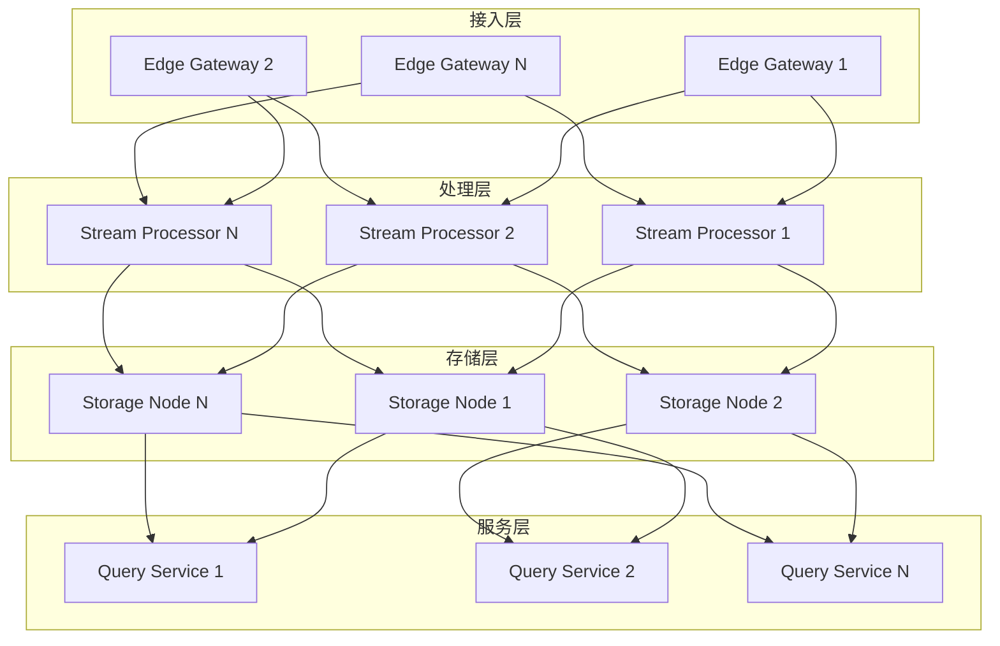

# OTLP 分布式系统架构设计 2025

## 目录

- [OTLP 分布式系统架构设计 2025](#otlp-分布式系统架构设计-2025)
  - [目录](#目录)
  - [📊 架构设计概览](#-架构设计概览)
  - [🎯 架构设计目标](#-架构设计目标)
    - [主要目标](#主要目标)
    - [成功标准](#成功标准)
  - [🏗️ 整体架构设计](#️-整体架构设计)
    - [1. 分层架构](#1-分层架构)
    - [2. 拓扑设计](#2-拓扑设计)
  - [🔄 数据流设计](#-数据流设计)
    - [1. 数据收集流](#1-数据收集流)
    - [2. 数据处理流](#2-数据处理流)
    - [3. 数据查询流](#3-数据查询流)
  - [🗄️ 存储架构设计](#️-存储架构设计)
    - [1. 分层存储](#1-分层存储)
    - [2. 数据分片策略](#2-数据分片策略)
    - [3. 数据复制策略](#3-数据复制策略)
  - [🔄 一致性保证](#-一致性保证)
    - [1. 一致性模型](#1-一致性模型)
    - [2. 一致性协议](#2-一致性协议)
  - [🔧 故障处理](#-故障处理)
    - [1. 故障检测](#1-故障检测)
    - [2. 故障恢复](#2-故障恢复)
  - [📊 性能优化](#-性能优化)
    - [1. 缓存策略](#1-缓存策略)
    - [2. 负载均衡](#2-负载均衡)
    - [3. 性能监控](#3-性能监控)
  - [🔒 安全设计](#-安全设计)
    - [1. 认证授权](#1-认证授权)
    - [2. 数据加密](#2-数据加密)
    - [3. 审计日志](#3-审计日志)
  - [📈 扩展性设计](#-扩展性设计)
    - [1. 水平扩展](#1-水平扩展)
    - [2. 垂直扩展](#2-垂直扩展)
  - [🎯 实施计划](#-实施计划)
    - [阶段一：基础架构（1-2个月）](#阶段一基础架构1-2个月)
    - [阶段二：核心功能（2-3个月）](#阶段二核心功能2-3个月)
    - [阶段三：高级功能（2-3个月）](#阶段三高级功能2-3个月)
    - [阶段四：优化完善（1-2个月）](#阶段四优化完善1-2个月)
    - [阶段五：测试验证（1个月）](#阶段五测试验证1个月)
  - [📊 预期成果](#-预期成果)

## 📊 架构设计概览

**设计时间**: 2025年1月27日  
**架构版本**: 1.0.0  
**维护者**: OpenTelemetry 2025 架构团队  
**状态**: 分布式系统架构设计  
**适用范围**: 大规模分布式OTLP系统

## 🎯 架构设计目标

### 主要目标

1. **高可用性**: 99.99%系统可用性
2. **高可扩展性**: 支持千万级span/s处理
3. **低延迟**: 端到端延迟<100ms
4. **数据一致性**: 强一致性和最终一致性
5. **故障容错**: 自动故障检测和恢复
6. **成本效益**: 优化的资源利用率

### 成功标准

- **可用性**: 99.99%正常运行时间
- **吞吐量**: 10M spans/s处理能力
- **延迟**: P95延迟<100ms
- **一致性**: 强一致性保证
- **扩展性**: 线性扩展能力
- **容错性**: 自动故障恢复

## 🏗️ 整体架构设计

### 1. 分层架构

```yaml
# 分布式OTLP系统分层架构
distributed_otlp_architecture:
  # 接入层 - 数据收集和预处理
  access_layer:
    components:
      - name: "edge_gateway"
        type: "gateway"
        instances: 1000
        capacity: "10k spans/s"
        responsibilities:
          - "数据收集"
          - "初步验证"
          - "负载均衡"
          - "协议转换"
    
    # 处理层 - 数据聚合和转换
    processing_layer:
      components:
        - name: "stream_processor"
          type: "processor"
          instances: 100
          capacity: "100k spans/s"
          responsibilities:
            - "数据聚合"
            - "数据转换"
            - "数据清洗"
            - "数据路由"
    
    # 存储层 - 数据持久化和索引
    storage_layer:
      components:
        - name: "distributed_storage"
          type: "storage"
          instances: 50
          capacity: "1M spans/s"
          responsibilities:
            - "数据存储"
            - "数据索引"
            - "数据查询"
            - "数据归档"
    
    # 服务层 - 数据查询和分析
    service_layer:
      components:
        - name: "query_service"
          type: "service"
          instances: 20
          capacity: "10k queries/s"
          responsibilities:
            - "数据查询"
            - "数据分析"
            - "结果聚合"
            - "缓存管理"
```

### 2. 拓扑设计



## 🔄 数据流设计

### 1. 数据收集流

```yaml
# 数据收集流程
data_collection_flow:
  # 数据接收
  data_reception:
    stages:
      - name: "protocol_handling"
        type: "parallel"
        parallelism: 1000
        processing:
          - "OTLP协议解析"
          - "数据格式验证"
          - "身份认证"
          - "速率限制"
      
      - name: "data_validation"
        type: "parallel"
        parallelism: 500
        processing:
          - "数据完整性检查"
          - "数据格式验证"
          - "数据范围检查"
          - "数据质量评估"
      
      - name: "data_preprocessing"
        type: "parallel"
        parallelism: 200
        processing:
          - "数据清洗"
          - "数据标准化"
          - "数据压缩"
          - "数据加密"
  
  # 数据路由
  data_routing:
    stages:
      - name: "routing_decision"
        type: "parallel"
        parallelism: 100
        processing:
          - "路由规则匹配"
          - "负载均衡"
          - "故障转移"
          - "优先级处理"
      
      - name: "data_distribution"
        type: "parallel"
        parallelism: 50
        processing:
          - "数据分片"
          - "数据分发"
          - "数据复制"
          - "数据同步"
```

### 2. 数据处理流

```yaml
# 数据处理流程
data_processing_flow:
  # 流式处理
  stream_processing:
    stages:
      - name: "data_ingestion"
        type: "parallel"
        parallelism: 100
        processing:
          - "数据接收"
          - "数据缓冲"
          - "数据分区"
          - "数据排序"
      
      - name: "data_transformation"
        type: "parallel"
        parallelism: 200
        processing:
          - "数据转换"
          - "数据聚合"
          - "数据计算"
          - "数据过滤"
      
      - name: "data_output"
        type: "parallel"
        parallelism: 50
        processing:
          - "数据输出"
          - "数据持久化"
          - "数据索引"
          - "数据通知"
  
  # 批处理
  batch_processing:
    stages:
      - name: "batch_collection"
        type: "scheduled"
        schedule: "0 */5 * * * *"  # 每5分钟
        processing:
          - "数据收集"
          - "数据合并"
          - "数据排序"
          - "数据去重"
      
      - name: "batch_processing"
        type: "parallel"
        parallelism: 20
        processing:
          - "数据聚合"
          - "数据计算"
          - "数据统计"
          - "数据挖掘"
      
      - name: "batch_output"
        type: "parallel"
        parallelism: 10
        processing:
          - "结果输出"
          - "结果存储"
          - "结果通知"
          - "结果清理"
```

### 3. 数据查询流

```yaml
# 数据查询流程
data_query_flow:
  # 查询处理
  query_processing:
    stages:
      - name: "query_parsing"
        type: "parallel"
        parallelism: 50
        processing:
          - "查询解析"
          - "查询验证"
          - "查询优化"
          - "查询计划"
      
      - name: "data_retrieval"
        type: "parallel"
        parallelism: 100
        processing:
          - "数据检索"
          - "数据过滤"
          - "数据排序"
          - "数据分页"
      
      - name: "result_processing"
        type: "parallel"
        parallelism: 50
        processing:
          - "结果聚合"
          - "结果计算"
          - "结果格式化"
          - "结果缓存"
  
  # 查询优化
  query_optimization:
    stages:
      - name: "index_optimization"
        type: "parallel"
        parallelism: 20
        processing:
          - "索引选择"
          - "索引优化"
          - "索引维护"
          - "索引监控"
      
      - name: "cache_optimization"
        type: "parallel"
        parallelism: 30
        processing:
          - "缓存策略"
          - "缓存预热"
          - "缓存更新"
          - "缓存清理"
```

## 🗄️ 存储架构设计

### 1. 分层存储

```yaml
# 分层存储架构
layered_storage:
  # 热数据存储
  hot_storage:
    type: "memory"
    capacity: "1TB"
    retention: "1h"
    access_pattern: "random"
    performance:
      read_latency: "1ms"
      write_latency: "1ms"
      throughput: "100k ops/s"
    
    # 热数据存储配置
    configuration:
      - name: "redis_cluster"
        type: "redis"
        nodes: 10
        replication: 3
        sharding: "consistent_hash"
      
      - name: "memcached_cluster"
        type: "memcached"
        nodes: 20
        replication: 2
        sharding: "round_robin"
  
  # 温数据存储
  warm_storage:
    type: "ssd"
    capacity: "10TB"
    retention: "7d"
    access_pattern: "sequential"
    performance:
      read_latency: "10ms"
      write_latency: "5ms"
      throughput: "10k ops/s"
    
    # 温数据存储配置
    configuration:
      - name: "elasticsearch_cluster"
        type: "elasticsearch"
        nodes: 20
        shards: 100
        replicas: 1
        index_strategy: "time_based"
      
      - name: "clickhouse_cluster"
        type: "clickhouse"
        nodes: 15
        shards: 50
        replicas: 2
        partition_strategy: "date"
  
  # 冷数据存储
  cold_storage:
    type: "hdd"
    capacity: "100TB"
    retention: "1y"
    access_pattern: "batch"
    performance:
      read_latency: "100ms"
      write_latency: "50ms"
      throughput: "1k ops/s"
    
    # 冷数据存储配置
    configuration:
      - name: "hdfs_cluster"
        type: "hdfs"
        nodes: 50
        replication: 3
        block_size: "128MB"
      
      - name: "s3_compatible"
        type: "object_storage"
        nodes: 100
        replication: 3
        compression: "gzip"
```

### 2. 数据分片策略

```yaml
# 数据分片策略
data_sharding:
  # 水平分片
  horizontal_sharding:
    strategy: "consistent_hash"
    shard_key: "trace_id"
    shard_count: 1000
    rebalancing: "automatic"
    
    # 分片配置
    configuration:
      - name: "trace_shards"
        type: "trace_data"
        shards: 500
        replication: 3
        distribution: "uniform"
      
      - name: "metric_shards"
        type: "metric_data"
        shards: 300
        replication: 2
        distribution: "weighted"
      
      - name: "log_shards"
        type: "log_data"
        shards: 200
        replication: 2
        distribution: "uniform"
  
  # 垂直分片
  vertical_sharding:
    strategy: "attribute_based"
    shard_key: "service_name"
    shard_count: 100
    rebalancing: "manual"
    
    # 分片配置
    configuration:
      - name: "service_shards"
        type: "service_data"
        shards: 50
        replication: 3
        distribution: "service_based"
      
      - name: "environment_shards"
        type: "environment_data"
        shards: 50
        replication: 2
        distribution: "environment_based"
```

### 3. 数据复制策略

```yaml
# 数据复制策略
data_replication:
  # 同步复制
  synchronous_replication:
    enabled: true
    replication_factor: 3
    consistency_level: "strong"
    timeout: "5s"
    
    # 复制配置
    configuration:
      - name: "critical_data"
        type: "trace_data"
        replication_factor: 3
        consistency_level: "strong"
        timeout: "5s"
      
      - name: "important_data"
        type: "metric_data"
        replication_factor: 2
        consistency_level: "strong"
        timeout: "3s"
  
  # 异步复制
  asynchronous_replication:
    enabled: true
    replication_factor: 2
    consistency_level: "eventual"
    delay: "1s"
    
    # 复制配置
    configuration:
      - name: "normal_data"
        type: "log_data"
        replication_factor: 2
        consistency_level: "eventual"
        delay: "1s"
      
      - name: "archive_data"
        type: "historical_data"
        replication_factor: 1
        consistency_level: "eventual"
        delay: "10s"
```

## 🔄 一致性保证

### 1. 一致性模型

```yaml
# 一致性模型
consistency_model:
  # 强一致性
  strong_consistency:
    enabled: true
    use_cases:
      - "关键业务数据"
      - "配置数据"
      - "用户数据"
    
    # 实现机制
    implementation:
      - "两阶段提交"
      - "Paxos算法"
      - "Raft算法"
      - "向量时钟"
  
  # 最终一致性
  eventual_consistency:
    enabled: true
    use_cases:
      - "日志数据"
      - "统计数据"
      - "缓存数据"
    
    # 实现机制
    implementation:
      - "Gossip协议"
      - "CRDTs"
      - "版本向量"
      - "因果一致性"
  
  # 会话一致性
  session_consistency:
    enabled: true
    use_cases:
      - "用户会话"
      - "临时数据"
      - "缓存数据"
    
    # 实现机制
    implementation:
      - "会话令牌"
      - "读写偏好"
      - "单调读"
      - "单调写"
```

### 2. 一致性协议

```yaml
# 一致性协议
consistency_protocols:
  # Raft协议
  raft_protocol:
    enabled: true
    use_cases:
      - "配置管理"
      - "元数据管理"
      - "服务发现"
    
    # 配置参数
    configuration:
      election_timeout: "150ms"
      heartbeat_interval: "50ms"
      snapshot_interval: "10m"
      log_retention: "1h"
  
  # Paxos协议
  paxos_protocol:
    enabled: true
    use_cases:
      - "分布式锁"
      - "分布式事务"
      - "状态机复制"
    
    # 配置参数
    configuration:
      proposal_timeout: "100ms"
      accept_timeout: "100ms"
      learn_timeout: "100ms"
      retry_interval: "50ms"
  
  # 向量时钟
  vector_clock:
    enabled: true
    use_cases:
      - "因果一致性"
      - "版本控制"
      - "冲突检测"
    
    # 配置参数
    configuration:
      clock_size: 1000
      update_interval: "1ms"
      sync_interval: "1s"
      cleanup_interval: "1h"
```

## 🔧 故障处理

### 1. 故障检测

```yaml
# 故障检测
fault_detection:
  # 健康检查
  health_check:
    enabled: true
    interval: "5s"
    timeout: "2s"
    threshold: 3
    
    # 检查项目
    checks:
      - name: "service_health"
        type: "http"
        endpoint: "/health"
        expected_status: 200
      
      - name: "database_health"
        type: "tcp"
        endpoint: "localhost:5432"
        expected_response: "connected"
      
      - name: "disk_health"
        type: "disk"
        path: "/data"
        threshold: "90%"
      
      - name: "memory_health"
        type: "memory"
        threshold: "85%"
  
  # 故障检测
  failure_detection:
    enabled: true
    method: "heartbeat"
    interval: "1s"
    timeout: "3s"
    threshold: 3
    
    # 检测类型
    detection_types:
      - "节点故障"
      - "网络分区"
      - "服务故障"
      - "数据损坏"
      - "性能降级"
```

### 2. 故障恢复

```yaml
# 故障恢复
fault_recovery:
  # 自动恢复
  automatic_recovery:
    enabled: true
    timeout: "30s"
    retry_count: 3
    
    # 恢复策略
    recovery_strategies:
      - name: "service_restart"
        type: "restart"
        timeout: "10s"
        retry_count: 3
      
      - name: "data_recovery"
        type: "recovery"
        timeout: "60s"
        retry_count: 1
      
      - name: "load_redistribution"
        type: "redistribution"
        timeout: "5s"
        retry_count: 1
      
      - name: "configuration_update"
        type: "update"
        timeout: "10s"
        retry_count: 2
  
  # 手动恢复
  manual_recovery:
    enabled: true
    procedures:
      - name: "fault_diagnosis"
        description: "故障诊断"
        steps:
          - "收集日志"
          - "分析指标"
          - "识别根因"
          - "制定方案"
      
      - name: "data_repair"
        description: "数据修复"
        steps:
          - "数据备份"
          - "数据修复"
          - "数据验证"
          - "数据恢复"
      
      - name: "service_recovery"
        description: "服务恢复"
        steps:
          - "服务停止"
          - "服务修复"
          - "服务启动"
          - "服务验证"
```

## 📊 性能优化

### 1. 缓存策略

```yaml
# 缓存策略
caching_strategy:
  # 多级缓存
  multi_level_cache:
    levels:
      - name: "L1_cache"
        type: "local_memory"
        size: "1GB"
        ttl: "1m"
        hit_ratio_target: 0.95
        eviction_policy: "LRU"
      
      - name: "L2_cache"
        type: "distributed_memory"
        size: "10GB"
        ttl: "10m"
        hit_ratio_target: 0.90
        eviction_policy: "LFU"
      
      - name: "L3_cache"
        type: "persistent_storage"
        size: "100GB"
        ttl: "1h"
        hit_ratio_target: 0.85
        eviction_policy: "TTL"
  
  # 缓存策略
  cache_policies:
    - name: "write_through"
      description: "写穿透"
      use_cases: ["关键数据", "实时数据"]
    
    - name: "write_behind"
      description: "写回"
      use_cases: ["批量数据", "非关键数据"]
    
    - name: "write_around"
      description: "写绕过"
      use_cases: ["临时数据", "缓存数据"]
```

### 2. 负载均衡

```yaml
# 负载均衡
load_balancing:
  # 负载均衡算法
  algorithms:
    - name: "round_robin"
      description: "轮询"
      use_cases: ["均匀负载", "简单场景"]
      weight: 1.0
    
    - name: "least_connections"
      description: "最少连接"
      use_cases: ["连接密集型", "长连接"]
      weight: 1.0
    
    - name: "weighted_round_robin"
      description: "加权轮询"
      use_cases: ["异构节点", "性能差异"]
      weight: 1.0
    
    - name: "consistent_hash"
      description: "一致性哈希"
      use_cases: ["数据分片", "缓存一致性"]
      weight: 1.0
  
  # 健康检查
  health_check:
    enabled: true
    interval: "5s"
    timeout: "2s"
    threshold: 3
    
    # 检查项目
    checks:
      - "服务可用性"
      - "响应时间"
      - "错误率"
      - "资源使用率"
```

### 3. 性能监控

```yaml
# 性能监控
performance_monitoring:
  # 系统指标
  system_metrics:
    - name: "cpu_usage"
      description: "CPU使用率"
      unit: "percent"
      threshold: 80
      alert_level: "warning"
    
    - name: "memory_usage"
      description: "内存使用率"
      unit: "percent"
      threshold: 85
      alert_level: "warning"
    
    - name: "disk_usage"
      description: "磁盘使用率"
      unit: "percent"
      threshold: 90
      alert_level: "critical"
    
    - name: "network_bandwidth"
      description: "网络带宽使用率"
      unit: "percent"
      threshold: 80
      alert_level: "warning"
  
  # 应用指标
  application_metrics:
    - name: "request_rate"
      description: "请求速率"
      unit: "requests/second"
      threshold: 1000
      alert_level: "info"
    
    - name: "response_time"
      description: "响应时间"
      unit: "milliseconds"
      threshold: 1000
      alert_level: "warning"
    
    - name: "error_rate"
      description: "错误率"
      unit: "percent"
      threshold: 5
      alert_level: "critical"
    
    - name: "throughput"
      description: "吞吐量"
      unit: "spans/second"
      threshold: 10000
      alert_level: "info"
```

## 🔒 安全设计

### 1. 认证授权

```yaml
# 认证授权
authentication_authorization:
  # 认证机制
  authentication:
    providers:
      - name: "oauth2"
        type: "oauth2"
        issuer: "https://auth.example.com"
        client_id: "${OAUTH2_CLIENT_ID}"
        client_secret: "${OAUTH2_CLIENT_SECRET}"
      
      - name: "jwt"
        type: "jwt"
        secret: "${JWT_SECRET}"
        algorithm: "HS256"
        expiration: "1h"
      
      - name: "api_key"
        type: "api_key"
        key_header: "X-API-Key"
        key_source: "database"
  
  # 授权机制
  authorization:
    rbac:
      roles:
        - name: "admin"
          permissions: ["read", "write", "delete", "admin"]
        
        - name: "developer"
          permissions: ["read", "write"]
        
        - name: "viewer"
          permissions: ["read"]
      
      policies:
        - resource: "traces"
          actions: ["read", "write"]
          conditions:
            - field: "tenant.id"
              operator: "equals"
              value: "${user.tenant_id}"
```

### 2. 数据加密

```yaml
# 数据加密
data_encryption:
  # 传输加密
  in_transit:
    enabled: true
    protocol: "TLS 1.3"
    cipher_suites:
      - "TLS_AES_256_GCM_SHA384"
      - "TLS_CHACHA20_POLY1305_SHA256"
    
    # 证书管理
    certificate_management:
      type: "automatic"
      provider: "letsencrypt"
      renewal: "automatic"
  
  # 存储加密
  at_rest:
    enabled: true
    algorithm: "AES-256-GCM"
    key_rotation: "30d"
    key_management: "aws_kms"
    
    # 加密配置
    configuration:
      - name: "sensitive_data"
        type: "field_level"
        fields: ["user_id", "email", "phone"]
        algorithm: "AES-256-GCM"
      
      - name: "general_data"
        type: "table_level"
        tables: ["traces", "metrics", "logs"]
        algorithm: "AES-256-GCM"
```

### 3. 审计日志

```yaml
# 审计日志
audit_logging:
  enabled: true
  events:
    - "authentication"
    - "authorization"
    - "data_access"
    - "configuration_change"
    - "system_event"
  
  # 日志配置
  configuration:
    storage:
      type: "elasticsearch"
      index: "audit-logs"
      retention: "1y"
    
    format:
      type: "json"
      fields:
        - "timestamp"
        - "user_id"
        - "action"
        - "resource"
        - "result"
        - "ip_address"
        - "user_agent"
    
    filtering:
      enabled: true
      rules:
        - action: "read"
          threshold: 1000
          aggregation: "hourly"
        - action: "write"
          threshold: 100
          aggregation: "daily"
```

## 📈 扩展性设计

### 1. 水平扩展

```yaml
# 水平扩展
horizontal_scaling:
  # 自动扩展
  auto_scaling:
    enabled: true
    min_instances: 3
    max_instances: 100
    target_cpu: 70
    target_memory: 80
    scale_up_cooldown: "5m"
    scale_down_cooldown: "10m"
    
    # 扩展策略
    scaling_policies:
      - name: "cpu_based"
        metric: "cpu_usage"
        threshold: 70
        action: "scale_up"
        cooldown: "5m"
      
      - name: "memory_based"
        metric: "memory_usage"
        threshold: 80
        action: "scale_up"
        cooldown: "5m"
      
      - name: "request_based"
        metric: "request_rate"
        threshold: 1000
        action: "scale_up"
        cooldown: "3m"
  
  # 手动扩展
  manual_scaling:
    enabled: true
    procedures:
      - name: "add_node"
        description: "添加节点"
        steps:
          - "准备新节点"
          - "安装软件"
          - "配置服务"
          - "加入集群"
          - "验证功能"
      
      - name: "remove_node"
        description: "移除节点"
        steps:
          - "停止服务"
          - "迁移数据"
          - "移除节点"
          - "更新配置"
          - "验证功能"
```

### 2. 垂直扩展

```yaml
# 垂直扩展
vertical_scaling:
  # 资源扩展
  resource_scaling:
    enabled: true
    max_cpu: 32
    max_memory: "128GB"
    max_storage: "10TB"
    
    # 扩展策略
    scaling_strategies:
      - name: "cpu_scaling"
        resource: "cpu"
        min_cores: 2
        max_cores: 32
        step: 2
      
      - name: "memory_scaling"
        resource: "memory"
        min_size: "4GB"
        max_size: "128GB"
        step: "4GB"
      
      - name: "storage_scaling"
        resource: "storage"
        min_size: "100GB"
        max_size: "10TB"
        step: "100GB"
  
  # 性能优化
  performance_optimization:
    enabled: true
    strategies:
      - name: "cpu_optimization"
        techniques:
          - "CPU亲和性"
          - "NUMA优化"
          - "缓存优化"
          - "指令优化"
      
      - name: "memory_optimization"
        techniques:
          - "内存池"
          - "缓存优化"
          - "垃圾回收优化"
          - "内存映射"
      
      - name: "storage_optimization"
        techniques:
          - "SSD优化"
          - "RAID配置"
          - "文件系统优化"
          - "I/O优化"
```

## 🎯 实施计划

### 阶段一：基础架构（1-2个月）

- 搭建基础分布式架构
- 实现数据收集和预处理
- 建立基础监控系统

### 阶段二：核心功能（2-3个月）

- 实现数据处理和存储
- 建立查询服务
- 实现基础一致性保证

### 阶段三：高级功能（2-3个月）

- 实现故障检测和恢复
- 建立性能优化机制
- 实现安全认证授权

### 阶段四：优化完善（1-2个月）

- 性能调优
- 安全加固
- 监控完善

### 阶段五：测试验证（1个月）

- 压力测试
- 故障测试
- 性能测试

## 📊 预期成果

1. **高可用性**: 99.99%系统可用性
2. **高可扩展性**: 支持千万级span/s处理
3. **低延迟**: 端到端延迟<100ms
4. **数据一致性**: 强一致性和最终一致性
5. **故障容错**: 自动故障检测和恢复
6. **成本效益**: 优化的资源利用率

这个分布式系统架构设计为OTLP系统提供了完整的解决方案，确保系统能够满足大规模生产环境的需求。

---

**OTLP分布式系统架构设计完成时间**: 2025年1月27日  
**架构版本**: 1.0.0  
**维护者**: OpenTelemetry 2025 架构团队  
**下次审查**: 2025年4月27日
