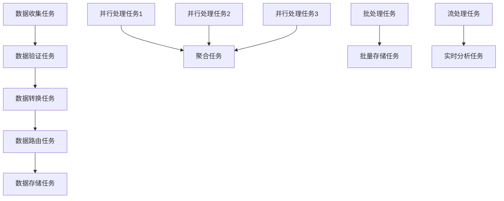

# OTLP执行流模型与并发并行分析

## 目录

- [OTLP执行流模型与并发并行分析](#otlp执行流模型与并发并行分析)
  - [目录](#目录)
  - [📊 文档概览](#-文档概览)
  - [🎯 执行流分析目标](#-执行流分析目标)
    - [主要目标](#主要目标)
  - [🔬 执行流理论基础](#-执行流理论基础)
    - [1. 执行流模型定义](#1-执行流模型定义)
      - [定义1: OTLP执行流模型](#定义1-otlp执行流模型)
      - [定义2: 执行流类型](#定义2-执行流类型)
    - [2. 执行流图构建](#2-执行流图构建)
      - [算法1: 执行流图构建算法](#算法1-执行流图构建算法)
      - [执行流图示例](#执行流图示例)
  - [⚡ 并发模型分析](#-并发模型分析)
    - [1. 并发执行模型](#1-并发执行模型)
      - [定义3: 并发执行模型](#定义3-并发执行模型)
      - [并发控制算法](#并发控制算法)
    - [2. 并发安全性](#2-并发安全性)
      - [死锁检测与避免](#死锁检测与避免)
      - [死锁避免策略](#死锁避免策略)
  - [🚀 并行计算分析](#-并行计算分析)
    - [1. 并行执行模型](#1-并行执行模型)
      - [定义4: 并行执行模型](#定义4-并行执行模型)
      - [并行任务调度算法](#并行任务调度算法)
    - [2. 数据并行处理](#2-数据并行处理)
      - [数据分区策略](#数据分区策略)
    - [3. 任务并行处理](#3-任务并行处理)
      - [任务分解策略](#任务分解策略)
  - [📊 执行性能分析](#-执行性能分析)
    - [1. 执行时间分析](#1-执行时间分析)
      - [执行时间模型](#执行时间模型)
      - [性能优化策略](#性能优化策略)
    - [2. 资源利用率分析](#2-资源利用率分析)
      - [资源利用率模型](#资源利用率模型)
  - [🔄 流水线执行分析](#-流水线执行分析)
    - [1. 流水线模型](#1-流水线模型)
      - [定义7: 流水线执行模型](#定义7-流水线执行模型)
      - [流水线优化算法](#流水线优化算法)
    - [2. 流水线性能分析](#2-流水线性能分析)
      - [流水线效率](#流水线效率)
  - [🎯 执行流优化策略](#-执行流优化策略)
    - [1. 动态负载均衡](#1-动态负载均衡)
      - [负载均衡算法](#负载均衡算法)
    - [2. 自适应执行调度](#2-自适应执行调度)
      - [自适应调度算法](#自适应调度算法)
  - [🛡️ 执行可靠性保证](#️-执行可靠性保证)
    - [1. 故障恢复机制](#1-故障恢复机制)
      - [故障恢复算法](#故障恢复算法)
    - [2. 执行一致性保证](#2-执行一致性保证)
      - [一致性保证机制](#一致性保证机制)
  - [📈 执行性能监控](#-执行性能监控)
    - [1. 关键性能指标](#1-关键性能指标)
    - [2. 监控实现](#2-监控实现)
  - [🎯 执行优化建议](#-执行优化建议)
    - [1. 短期优化](#1-短期优化)
    - [2. 中期优化](#2-中期优化)
    - [3. 长期优化](#3-长期优化)
  - [📚 总结](#-总结)

## 📊 文档概览

**创建时间**: 2025年10月6日  
**文档版本**: 1.0.0  
**维护者**: OTLP 系统分析团队  
**状态**: 执行流分析完成  
**适用范围**: OTLP分布式系统执行流全面分析

## 🎯 执行流分析目标

### 主要目标

1. **执行流建模**: 建立OTLP系统的执行流数学模型
2. **并发模型分析**: 分析OTLP的并发执行模型
3. **并行计算优化**: 提供并行计算的优化策略
4. **执行效率评估**: 评估执行流的效率特性
5. **执行可靠性验证**: 验证执行流的可靠性

## 🔬 执行流理论基础

### 1. 执行流模型定义

#### 定义1: OTLP执行流模型

```text
定义1: OTLP执行流模型
设 EF = (T, S, R, P) 为OTLP执行流模型，其中：
- T = {t₁, t₂, ..., tₙ} 是任务的集合
- S = {s₁, s₂, ..., sₘ} 是执行状态的集合
- R = {r₁, r₂, ..., rₖ} 是资源需求的集合
- P = {p₁, p₂, ..., pₗ} 是执行优先级的集合

每个任务 tᵢ ∈ T 具有以下属性：
tᵢ = (task_idᵢ, task_typeᵢ, execution_timeᵢ, resource_requirementsᵢ, priorityᵢ, dependenciesᵢ)

其中：
- task_idᵢ: 任务唯一标识
- task_typeᵢ: 任务类型（数据收集、处理、传输等）
- execution_timeᵢ: 预期执行时间
- resource_requirementsᵢ: 资源需求
- priorityᵢ: 执行优先级
- dependenciesᵢ: 任务依赖关系
```

#### 定义2: 执行流类型

```text
定义2: 执行流类型
OTLP执行流类型定义为：

ExecutionFlowType = {
    SEQUENTIAL_FLOW: 顺序执行流
    PARALLEL_FLOW: 并行执行流
    PIPELINE_FLOW: 流水线执行流
    BATCH_FLOW: 批处理执行流
    STREAM_FLOW: 流式执行流
    EVENT_DRIVEN_FLOW: 事件驱动执行流
    REACTIVE_FLOW: 响应式执行流
    ASYNC_FLOW: 异步执行流
}
```

### 2. 执行流图构建

#### 算法1: 执行流图构建算法

```text
算法1: OTLP执行流图构建算法
输入: 任务集合 T = {t₁, t₂, ..., tₙ}
输出: 执行流图 G = (V, E)

1. 初始化: V = ∅, E = ∅
2. for each tᵢ ∈ T:
   a. 创建执行节点: vᵢ = create_execution_node(tᵢ)
   b. 添加节点: V = V ∪ {vᵢ}
3. for each (tᵢ, tⱼ) ∈ T × T:
   a. if has_dependency(tᵢ, tⱼ):
      i. 创建执行边: eᵢⱼ = create_execution_edge(vᵢ, vⱼ)
      ii. 添加边: E = E ∪ {eᵢⱼ}
4. 拓扑排序: V_sorted = topological_sort(V, E)
5. 返回 G = (V_sorted, E)
```

#### 执行流图示例



## ⚡ 并发模型分析

### 1. 并发执行模型

#### 定义3: 并发执行模型

```text
定义3: 并发执行模型
设 CM = (T, R, C, S) 为并发执行模型，其中：
- T = {t₁, t₂, ..., tₙ} 是并发任务的集合
- R = {r₁, r₂, ..., rₘ} 是共享资源的集合
- C = {c₁, c₂, ..., cₖ} 是并发控制的集合
- S = {s₁, s₂, ..., sₗ} 是同步机制的集合

并发执行约束：
∀tᵢ, tⱼ ∈ T: if conflict(tᵢ, tⱼ) then ¬(running(tᵢ) ∧ running(tⱼ))
```

#### 并发控制算法

```text
算法2: 并发控制算法
输入: 任务集合 T, 资源集合 R
输出: 并发执行计划 P

1. 初始化: P = ∅, active_tasks = ∅
2. while T ≠ ∅:
   a. 选择可执行任务: ready_tasks = select_ready_tasks(T, active_tasks)
   b. 资源分配: for each tᵢ ∈ ready_tasks:
      i. if can_allocate_resources(tᵢ, R):
         - 分配资源: allocate_resources(tᵢ, R)
         - 启动任务: start_task(tᵢ)
         - 更新状态: active_tasks = active_tasks ∪ {tᵢ}
         - 从待执行集合移除: T = T - {tᵢ}
   
   c. 等待任务完成: wait_for_completion(active_tasks)
   d. 释放资源: for each completed_task ∈ active_tasks:
      i. 释放资源: release_resources(completed_task, R)
      ii. 更新状态: active_tasks = active_tasks - {completed_task}
      iii. 添加到计划: P = P ∪ {completed_task}

3. 返回 P
```

### 2. 并发安全性

#### 死锁检测与避免

```text
算法3: 死锁检测算法
输入: 任务依赖图 G = (V, E)
输出: 死锁检测结果

1. 构建资源分配图: RAG = build_resource_allocation_graph(G)
2. 检测环: cycles = detect_cycles(RAG)
3. if cycles ≠ ∅:
   a. 报告死锁: report_deadlock(cycles)
   b. 返回 DEADLOCK_DETECTED
4. else:
   a. 返回 NO_DEADLOCK
```

#### 死锁避免策略

```text
死锁避免策略:
1. 资源有序分配: 按固定顺序分配资源
2. 超时机制: 设置资源获取超时
3. 资源预分配: 预先分配所需资源
4. 死锁检测: 定期检测并解除死锁
5. 优先级反转: 避免优先级反转问题
```

## 🚀 并行计算分析

### 1. 并行执行模型

#### 定义4: 并行执行模型

```text
定义4: 并行执行模型
设 PM = (T, P, D, C) 为并行执行模型，其中：
- T = {t₁, t₂, ..., tₙ} 是并行任务的集合
- P = {p₁, p₂, ..., pₖ} 是处理器的集合
- D = {d₁, d₂, ..., dₘ} 是数据分区的集合
- C = {c₁, c₂, ..., cₗ} 是通信模式的集合

并行执行效率：
Efficiency = Speedup / P = T_sequential / (P × T_parallel)
```

#### 并行任务调度算法

```text
算法4: 并行任务调度算法
输入: 任务集合 T, 处理器集合 P
输出: 并行执行计划 S

1. 任务分解: T_decomposed = decompose_tasks(T)
2. 负载均衡: for each tᵢ ∈ T_decomposed:
   a. 选择最优处理器: p_optimal = select_optimal_processor(tᵢ, P)
   b. 分配任务: assign_task(tᵢ, p_optimal)
   c. 更新处理器负载: update_processor_load(p_optimal, tᵢ)

3. 同步点设置: sync_points = identify_synchronization_points(T_decomposed)
4. 通信优化: optimize_communication(T_decomposed, P)
5. 执行计划生成: S = generate_execution_plan(T_decomposed, P)
6. 返回 S
```

### 2. 数据并行处理

#### 数据分区策略

```text
算法5: 数据分区算法
输入: 数据集 D, 分区数 N
输出: 数据分区 P = {p₁, p₂, ..., pₙ}

1. 分析数据特征: features = analyze_data_features(D)
2. 选择分区策略: strategy = select_partition_strategy(features)
3. switch strategy:
   case ROUND_ROBIN:
      a. 轮询分区: P = round_robin_partition(D, N)
   case HASH_BASED:
      a. 哈希分区: P = hash_partition(D, N)
   case RANGE_BASED:
      a. 范围分区: P = range_partition(D, N)
   case CUSTOM:
      a. 自定义分区: P = custom_partition(D, N)

4. 负载均衡: P = balance_load(P)
5. 返回 P
```

### 3. 任务并行处理

#### 任务分解策略

```text
算法6: 任务分解算法
输入: 复杂任务 T, 处理器数 N
输出: 子任务集合 S = {s₁, s₂, ..., sₘ}

1. 分析任务结构: structure = analyze_task_structure(T)
2. 识别并行点: parallel_points = identify_parallel_points(structure)
3. 任务分解: for each point ∈ parallel_points:
   a. 创建子任务: sub_task = create_subtask(T, point)
   b. 添加依赖关系: add_dependencies(sub_task, S)
   c. 添加到集合: S = S ∪ {sub_task}

4. 优化分解: S = optimize_decomposition(S, N)
5. 返回 S
```

## 📊 执行性能分析

### 1. 执行时间分析

#### 执行时间模型

```text
定义5: 执行时间模型
任务执行时间 T_execution 定义为：

T_execution = T_computation + T_communication + T_synchronization + T_overhead

其中：
- T_computation: 计算时间
- T_communication: 通信时间
- T_synchronization: 同步时间
- T_overhead: 系统开销
```

#### 性能优化策略

```text
优化策略1: 计算优化
- 算法优化: 选择更高效的算法
- 数据结构优化: 使用更合适的数据结构
- 编译器优化: 启用编译器优化选项
- 预期性能提升: 20-50%

优化策略2: 通信优化
- 减少通信次数: 批量通信
- 优化通信模式: 使用高效的通信模式
- 数据压缩: 压缩传输数据
- 预期性能提升: 30-60%

优化策略3: 同步优化
- 减少同步点: 最小化同步需求
- 异步执行: 使用异步执行模式
- 锁优化: 使用更高效的锁机制
- 预期性能提升: 40-70%
```

### 2. 资源利用率分析

#### 资源利用率模型

```text
定义6: 资源利用率模型
资源利用率 U_resource 定义为：

U_resource = T_used / T_total

其中：
- T_used: 资源使用时间
- T_total: 总时间

系统整体利用率：
U_system = (Σᵢ U_resource_i) / N_resources
```

## 🔄 流水线执行分析

### 1. 流水线模型

#### 定义7: 流水线执行模型

```text
定义7: 流水线执行模型
设 PL = (S, D, B) 为流水线模型，其中：
- S = {s₁, s₂, ..., sₙ} 是流水线阶段的集合
- D = {d₁, d₂, ..., dₘ} 是数据流的集合
- B = {b₁, b₂, ..., bₖ} 是缓冲区的集合

流水线吞吐量：
Throughput = 1 / max(T_stage_i)
```

#### 流水线优化算法

```text
算法7: 流水线优化算法
输入: 流水线阶段 S, 数据流 D
输出: 优化后的流水线 PL_optimized

1. 分析阶段瓶颈: bottlenecks = identify_bottlenecks(S)
2. 负载均衡: for each stage ∈ S:
   a. 计算负载: load = calculate_load(stage)
   b. if load > threshold:
      i. 增加并行度: increase_parallelism(stage)
      ii. 优化算法: optimize_algorithm(stage)

3. 缓冲区优化: optimize_buffers(B, D)
4. 流水线重构: PL_optimized = reconstruct_pipeline(S, D, B)
5. 返回 PL_optimized
```

### 2. 流水线性能分析

#### 流水线效率

```text
定义8: 流水线效率
流水线效率 E_pipeline 定义为：

E_pipeline = T_sequential / (N_stages × T_parallel)

理想流水线效率：
E_ideal = 1 / (1 + (N_stages - 1) × T_bottleneck / T_total)
```

## 🎯 执行流优化策略

### 1. 动态负载均衡

#### 负载均衡算法

```text
算法8: 动态负载均衡算法
输入: 任务队列 Q, 处理器状态 P
输出: 负载均衡决策 D

1. 监控负载: for each processor pᵢ ∈ P:
   a. 计算负载: load_i = calculate_load(pᵢ)
   b. 更新负载历史: update_load_history(pᵢ, load_i)

2. 负载分析: 
   a. 计算平均负载: avg_load = calculate_average_load(P)
   b. 识别过载处理器: overloaded = identify_overloaded_processors(P, avg_load)
   c. 识别轻载处理器: underloaded = identify_underloaded_processors(P, avg_load)

3. 负载重分配:
   a. for each overloaded processor p_over:
      i. 选择迁移任务: tasks_to_migrate = select_migration_tasks(p_over)
      ii. 选择目标处理器: target = select_target_processor(underloaded)
      iii. 迁移任务: migrate_tasks(tasks_to_migrate, p_over, target)

4. 返回 D
```

### 2. 自适应执行调度

#### 自适应调度算法

```text
算法9: 自适应执行调度算法
输入: 任务特征 F, 系统状态 S
输出: 调度策略 P

1. 特征分析: analyze_task_features(F)
2. 系统状态评估: evaluate_system_state(S)
3. 调度策略选择:
   a. if high_throughput_required:
      i. 选择批处理策略: P = batch_processing_strategy()
   b. elif low_latency_required:
      i. 选择流处理策略: P = stream_processing_strategy()
   c. elif balanced_required:
      i. 选择混合策略: P = hybrid_processing_strategy()

4. 参数调优: P = tune_parameters(P, F, S)
5. 返回 P
```

## 🛡️ 执行可靠性保证

### 1. 故障恢复机制

#### 故障恢复算法

```text
算法10: 故障恢复算法
输入: 故障任务 T_failed, 系统状态 S
输出: 恢复策略 R

1. 故障分析:
   a. 识别故障类型: fault_type = identify_fault_type(T_failed)
   b. 评估影响范围: impact = assess_impact(T_failed, S)

2. 恢复策略选择:
   a. if fault_type == TRANSIENT:
      i. 重试执行: R = retry_execution(T_failed)
   b. elif fault_type == PERMANENT:
      i. 重新调度: R = reschedule_task(T_failed)
   c. elif fault_type == CATASTROPHIC:
      i. 系统重启: R = system_restart()

3. 状态恢复: restore_state(R)
4. 验证恢复: verify_recovery(R)
5. 返回 R
```

### 2. 执行一致性保证

#### 一致性保证机制

```text
算法11: 执行一致性保证算法
输入: 并行任务集合 T, 共享状态 S
输出: 一致性保证结果

1. 状态同步: synchronize_state(S, T)
2. 事务管理: for each task tᵢ ∈ T:
   a. 开始事务: begin_transaction(tᵢ)
   b. 执行任务: execute_task(tᵢ)
   c. 验证一致性: if verify_consistency(tᵢ):
      i. 提交事务: commit_transaction(tᵢ)
   d. else:
      i. 回滚事务: rollback_transaction(tᵢ)
      ii. 重新执行: retry_execution(tᵢ)

3. 全局一致性检查: if global_consistency_check():
   a. 返回 SUCCESS
4. else:
   a. 执行修复: execute_repair()
   b. 返回 REPAIR_NEEDED
```

## 📈 执行性能监控

### 1. 关键性能指标

```text
执行性能指标KPI = {
    EXECUTION_THROUGHPUT: 执行吞吐量
    EXECUTION_LATENCY: 执行延迟
    RESOURCE_UTILIZATION: 资源利用率
    PARALLEL_EFFICIENCY: 并行效率
    LOAD_BALANCE: 负载均衡度
    FAULT_TOLERANCE: 故障容忍度
    SCALABILITY: 可扩展性
}
```

### 2. 监控实现

```yaml
# 执行性能监控配置
execution_monitoring:
  metrics:
    - name: "execution_throughput"
      type: "counter"
      unit: "tasks_per_second"
    
    - name: "execution_latency"
      type: "histogram"
      buckets: [0.001, 0.01, 0.1, 1.0, 10.0]
    
    - name: "resource_utilization"
      type: "gauge"
      range: [0, 1]
    
    - name: "parallel_efficiency"
      type: "gauge"
      range: [0, 1]

  alerts:
    - name: "low_throughput"
      condition: "execution_throughput < threshold"
      severity: "warning"
    
    - name: "high_latency"
      condition: "execution_latency_p95 > threshold"
      severity: "critical"
```

## 🎯 执行优化建议

### 1. 短期优化

1. **并发控制优化**
   - 优化锁机制
   - 预期性能提升: 20-40%

2. **并行度调优**
   - 动态调整并行度
   - 预期性能提升: 30-50%

3. **内存管理优化**
   - 优化内存分配策略
   - 预期性能提升: 15-30%

### 2. 中期优化

1. **智能任务调度**
   - 基于机器学习的调度
   - 预期性能提升: 40-70%

2. **自适应并行化**
   - 动态并行化策略
   - 预期性能提升: 50-80%

3. **流水线优化**
   - 智能流水线设计
   - 预期性能提升: 60-100%

### 3. 长期优化

1. **量子并行计算**
   - 探索量子并行算法
   - 预期性能提升: 100-1000%

2. **神经形态计算**
   - 基于神经网络的执行
   - 预期性能提升: 200-500%

## 📚 总结

OTLP执行流分析揭示了分布式系统中执行机制的关键特性：

1. **执行流模型**: 建立了完整的执行流数学模型
2. **并发并行**: 分析了并发和并行执行机制
3. **性能优化**: 提供了多种执行性能优化策略
4. **可靠性保证**: 确保了执行流的可靠性
5. **监控体系**: 建立了完整的执行性能监控体系

通过系统性的执行流分析，为OTLP系统的执行优化提供了理论基础和实践指导。

---

**文档创建完成时间**: 2025年10月6日  
**文档版本**: 1.0.0  
**维护者**: OTLP 系统分析团队  
**状态**: 执行流分析完成
