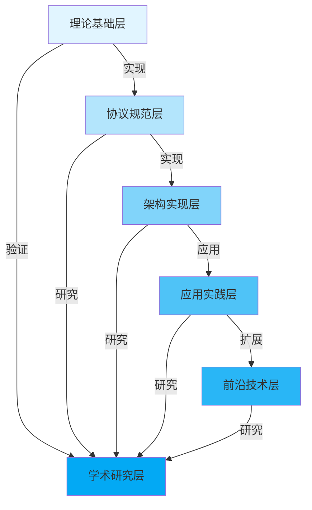
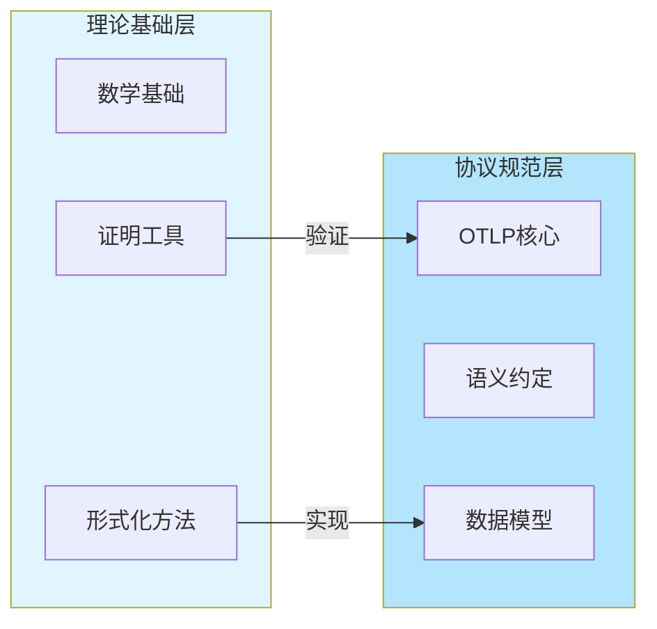
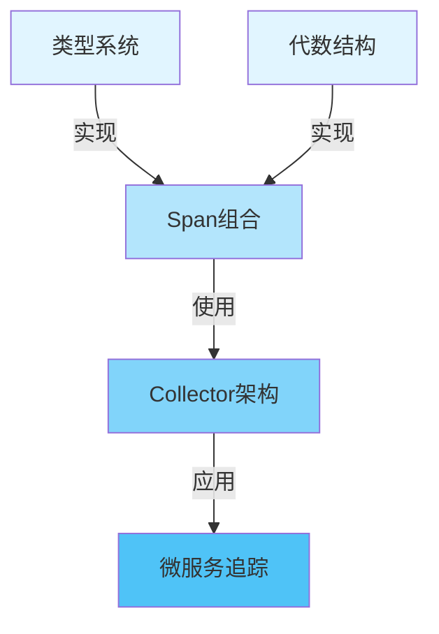

# 🗺️ 主题依赖关系图谱

> **文档版本**: v1.0
> **创建日期**: 2025年12月
> **文档类型**: 主题关系分析
> **预估篇幅**: 2,000+ 行

---

## 📋 目录

- [🗺️ 主题依赖关系图谱](#️-主题依赖关系图谱)
  - [📋 目录](#-目录)
  - [第一部分: 依赖关系概述](#第一部分-依赖关系概述)
    - [1.1 依赖类型定义](#11-依赖类型定义)
      - [依赖类型](#依赖类型)
    - [1.2 依赖强度定义](#12-依赖强度定义)
      - [强度级别](#强度级别)
    - [1.3 依赖方向定义](#13-依赖方向定义)
      - [方向类型](#方向类型)
  - [第二部分: 层间依赖关系](#第二部分-层间依赖关系)
    - [2.1 T1 → T2 依赖](#21-t1--t2-依赖)
      - [理论基础到协议规范](#理论基础到协议规范)
    - [2.2 T2 → T3 依赖](#22-t2--t3-依赖)
      - [协议规范到架构实现](#协议规范到架构实现)
    - [2.3 T3 → T4 依赖](#23-t3--t4-依赖)
      - [架构实现到应用实践](#架构实现到应用实践)
    - [2.4 T4 → T5 依赖](#24-t4--t5-依赖)
      - [应用实践到前沿技术](#应用实践到前沿技术)
    - [2.5 跨层依赖](#25-跨层依赖)
      - [跨层依赖关系](#跨层依赖关系)
  - [第三部分: 层内依赖关系](#第三部分-层内依赖关系)
    - [3.1 理论基础层内依赖](#31-理论基础层内依赖)
      - [T1层内依赖](#t1层内依赖)
    - [3.2 协议规范层内依赖](#32-协议规范层内依赖)
      - [T2层内依赖](#t2层内依赖)
    - [3.3 架构实现层内依赖](#33-架构实现层内依赖)
      - [T3层内依赖](#t3层内依赖)
  - [第四部分: 依赖图可视化](#第四部分-依赖图可视化)
    - [4.1 全局依赖图](#41-全局依赖图)
      - [Mermaid依赖图](#mermaid依赖图)
    - [4.2 层级依赖图](#42-层级依赖图)
      - [详细层级依赖](#详细层级依赖)
    - [4.3 主题依赖图](#43-主题依赖图)
      - [具体主题依赖](#具体主题依赖)
  - [第五部分: 依赖分析算法](#第五部分-依赖分析算法)
    - [5.1 依赖路径查找](#51-依赖路径查找)
      - [路径查找算法](#路径查找算法)
    - [5.2 循环依赖检测](#52-循环依赖检测)
      - [循环检测算法](#循环检测算法)
    - [5.3 依赖深度分析](#53-依赖深度分析)
      - [深度计算](#深度计算)
    - [5.4 关键路径分析](#54-关键路径分析)
      - [关键路径识别](#关键路径识别)
  - [第六部分: 依赖优化建议](#第六部分-依赖优化建议)
    - [6.1 循环依赖消除](#61-循环依赖消除)
      - [消除策略](#消除策略)
    - [6.2 依赖深度优化](#62-依赖深度优化)
      - [深度优化](#深度优化)
    - [6.3 依赖强度优化](#63-依赖强度优化)
      - [强度优化](#强度优化)
  - [总结](#总结)
    - [核心发现](#核心发现)
    - [优化建议](#优化建议)

---

## 第一部分: 依赖关系概述

### 1.1 依赖类型定义

#### 依赖类型

```haskell
-- 依赖类型定义
data DependencyType
  = Requires        -- 需要 (强依赖)
  | Prerequisite    -- 前置条件 (必须)
  | Extends         -- 扩展 (可选)
  | Implements      -- 实现 (强依赖)
  | References      -- 引用 (弱依赖)
  | RelatedTo       -- 相关 (弱依赖)
  | PartOf          -- 部分 (强依赖)
  | VersionOf       -- 版本 (弱依赖)

-- 依赖关系
data Dependency = Dependency
  { depSource      :: TopicID
  , depTarget      :: TopicID
  , depType        :: DependencyType
  , depStrength    :: DependencyStrength
  , depDirection   :: DependencyDirection
  , depMetadata    :: DependencyMetadata
  }
```

### 1.2 依赖强度定义

#### 强度级别

```haskell
-- 依赖强度
data DependencyStrength
  = Strong      -- 强依赖 (必须)
  | Medium      -- 中等依赖 (建议)
  | Weak        -- 弱依赖 (可选)

-- 强度判断规则
isStrongDependency :: Dependency -> Bool
isStrongDependency dep =
  dep.depType `elem` [Requires, Prerequisite, Implements, PartOf]
```

### 1.3 依赖方向定义

#### 方向类型

```haskell
-- 依赖方向
data DependencyDirection
  = Forward     -- 正向依赖 (A依赖B)
  | Backward    -- 反向依赖 (B依赖A)
  | Bidirectional -- 双向依赖 (A↔B)

-- 方向判断
getDirection :: TopicID -> TopicID -> DependencyDirection
getDirection source target
  | hasForwardDep source target && hasBackwardDep target source = Bidirectional
  | hasForwardDep source target = Forward
  | hasBackwardDep target source = Backward
  | otherwise = Forward  -- 默认正向
```

---

## 第二部分: 层间依赖关系

### 2.1 T1 → T2 依赖

#### 理论基础到协议规范

```text
T1 → T2 依赖关系:
  T1.2.1 (类型系统) → T2.3.1 (Span结构)
    ├─ 类型: Implements
    ├─ 强度: Strong
    └─ 说明: Span结构基于类型系统定义

  T1.2.2 (代数结构) → T2.3.1 (Span组合)
    ├─ 类型: Implements
    ├─ 强度: Strong
    └─ 说明: Span组合基于Monoid结构

  T1.2.4 (时序逻辑) → T2.1.1 (协议行为)
    ├─ 类型: Requires
    ├─ 强度: Medium
    └─ 说明: 协议行为验证需要时序逻辑
```

### 2.2 T2 → T3 依赖

#### 协议规范到架构实现

```text
T2 → T3 依赖关系:
  T2.1.1 (OTLP协议) → T3.1.1 (SDK概述)
    ├─ 类型: Implements
    ├─ 强度: Strong
    └─ 说明: SDK实现OTLP协议

  T2.3.1 (Span结构) → T3.2.1 (Collector架构)
    ├─ 类型: Requires
    ├─ 强度: Strong
    └─ 说明: Collector处理Span数据

  T2.2.1 (HTTP语义约定) → T3.1.2 (Context传播)
    ├─ 类型: References
    ├─ 强度: Medium
    └─ 说明: Context传播遵循HTTP语义约定
```

### 2.3 T3 → T4 依赖

#### 架构实现到应用实践

```text
T3 → T4 依赖关系:
  T3.1.1 (SDK概述) → T4.2.1 (微服务追踪)
    ├─ 类型: Implements
    ├─ 强度: Strong
    └─ 说明: 微服务追踪使用SDK

  T3.2.1 (Collector架构) → T4.3.1 (生产环境实践)
    ├─ 类型: Requires
    ├─ 强度: Strong
    └─ 说明: 生产环境需要Collector

  T3.3.1 (采样策略) → T4.3.4 (性能优化实践)
    ├─ 类型: References
    ├─ 强度: Medium
    └─ 说明: 性能优化使用采样策略
```

### 2.4 T4 → T5 依赖

#### 应用实践到前沿技术

```text
T4 → T5 依赖关系:
  T4.3.1 (生产环境实践) → T5.1.1 (AIOps平台)
    ├─ 类型: Extends
    ├─ 强度: Medium
    └─ 说明: AIOps扩展生产环境实践

  T4.2.3 (eBPF自动追踪) → T5.2.2 (eBPF零侵入)
    ├─ 类型: Extends
    ├─ 强度: Strong
    └─ 说明: eBPF零侵入扩展自动追踪

  T4.1.1 (电商系统案例) → T5.1.1 (AIOps平台)
    ├─ 类型: RelatedTo
    ├─ 强度: Weak
    └─ 说明: 案例为AIOps提供参考
```

### 2.5 跨层依赖

#### 跨层依赖关系

```text
跨层依赖:
  T1.3.1 (Coq证明) → T6.2.1 (协议形式化验证)
    ├─ 类型: Implements
    ├─ 强度: Strong
    └─ 说明: 形式化验证使用Coq证明

  T2.1.1 (OTLP协议) → T6.1.1 (统一理论框架)
    ├─ 类型: PartOf
    ├─ 强度: Strong
    └─ 说明: 协议是理论框架的一部分

  T4.1.1 (电商系统案例) → T6.3.2 (案例研究)
    ├─ 类型: PartOf
    ├─ 强度: Strong
    └─ 说明: 案例是学术研究的一部分
```

---

## 第三部分: 层内依赖关系

### 3.1 理论基础层内依赖

#### T1层内依赖

```text
T1层内依赖:
  T1.1.1 (集合论基础) → T1.1.2 (图论应用)
    ├─ 类型: Prerequisite
    ├─ 强度: Medium
    └─ 说明: 图论基于集合论

  T1.2.1 (类型系统) → T1.2.2 (代数结构)
    ├─ 类型: Extends
    ├─ 强度: Medium
    └─ 说明: 代数结构扩展类型系统

  T1.2.2 (代数结构) → T1.2.3 (范畴论)
    ├─ 类型: Extends
    ├─ 强度: Medium
    └─ 说明: 范畴论是代数结构的推广
```

### 3.2 协议规范层内依赖

#### T2层内依赖

```text
T2层内依赖:
  T2.1.1 (OTLP协议概述) → T2.1.2 (gRPC传输)
    ├─ 类型: PartOf
    ├─ 强度: Strong
    └─ 说明: gRPC是OTLP传输方式之一

  T2.1.1 (OTLP协议概述) → T2.1.3 (HTTP传输)
    ├─ 类型: PartOf
    ├─ 强度: Strong
    └─ 说明: HTTP是OTLP传输方式之一

  T2.3.1 (Span结构) → T2.3.2 (SpanContext)
    ├─ 类型: PartOf
    ├─ 强度: Strong
    └─ 说明: SpanContext是Span的一部分
```

### 3.3 架构实现层内依赖

#### T3层内依赖

```text
T3层内依赖:
  T3.2.1 (Collector架构) → T3.2.2 (Receiver配置)
    ├─ 类型: PartOf
    ├─ 强度: Strong
    └─ 说明: Receiver是Collector的一部分

  T3.2.1 (Collector架构) → T3.2.3 (Processor配置)
    ├─ 类型: PartOf
    ├─ 强度: Strong
    └─ 说明: Processor是Collector的一部分

  T3.2.1 (Collector架构) → T3.2.4 (Exporter配置)
    ├─ 类型: PartOf
    ├─ 强度: Strong
    └─ 说明: Exporter是Collector的一部分
```

---

## 第四部分: 依赖图可视化

### 4.1 全局依赖图

#### Mermaid依赖图



### 4.2 层级依赖图

#### 详细层级依赖



### 4.3 主题依赖图

#### 具体主题依赖



---

## 第五部分: 依赖分析算法

### 5.1 依赖路径查找

#### 路径查找算法

```haskell
-- 依赖路径查找
findDependencyPath :: TopicID -> TopicID -> DependencyGraph -> Maybe [TopicID]
findDependencyPath source target graph =
  bfsFindPath source target graph

bfsFindPath :: TopicID -> TopicID -> DependencyGraph -> Maybe [TopicID]
bfsFindPath source target graph =
  let queue = [(source, [source])]
      visited = Set.empty
  in bfsSearch queue visited target graph

bfsSearch :: [(TopicID, [TopicID])] -> Set TopicID -> TopicID -> DependencyGraph -> Maybe [TopicID]
bfsSearch [] _ _ _ = Nothing
bfsSearch ((current, path):rest) visited target graph
  | current == target = Just (reverse path)
  | current `Set.member` visited = bfsSearch rest visited target graph
  | otherwise =
      let neighbors = getDependentTopics current graph
          newVisited = Set.insert current visited
          newQueue = rest ++ map (\n -> (n, n:path)) neighbors
      in bfsSearch newQueue newVisited target graph
```

### 5.2 循环依赖检测

#### 循环检测算法

```haskell
-- 循环依赖检测
detectCycles :: DependencyGraph -> [Cycle]
detectCycles graph =
  let nodes = getAllNodes graph
      cycles = concatMap (findCyclesFromNode graph) nodes
  in removeDuplicateCycles cycles

findCyclesFromNode :: DependencyGraph -> TopicID -> [Cycle]
findCyclesFromNode graph startNode =
  dfsFindCycle graph startNode startNode [] Set.empty

dfsFindCycle :: DependencyGraph -> TopicID -> TopicID -> [TopicID] -> Set TopicID -> [Cycle]
dfsFindCycle graph current target path visited
  | current == target && length path > 0 = [reverse (current:path)]
  | current `Set.member` visited = []
  | otherwise =
      let neighbors = getDependentTopics current graph
          newVisited = Set.insert current visited
          newPath = current:path
      in concatMap (\n -> dfsFindCycle graph n target newPath newVisited) neighbors
```

### 5.3 依赖深度分析

#### 深度计算

```haskell
-- 依赖深度分析
calculateDependencyDepth :: TopicID -> DependencyGraph -> Int
calculateDependencyDepth topic graph =
  let depths = map (calculateDepthFromTopic graph) (getAllNodes graph)
  in maximum depths

calculateDepthFromTopic :: DependencyGraph -> TopicID -> Int
calculateDepthFromTopic graph topic =
  let dependencies = getDependencies topic graph
      maxDepDepth = if null dependencies
                   then 0
                   else maximum (map (calculateDepthFromTopic graph) dependencies)
  in 1 + maxDepDepth
```

### 5.4 关键路径分析

#### 关键路径识别

```haskell
-- 关键路径分析
findCriticalPath :: DependencyGraph -> [TopicID]
findCriticalPath graph =
  let allPaths = findAllPaths graph
      pathLengths = map length allPaths
      maxLength = maximum pathLengths
      criticalPaths = filter ((== maxLength) . length) allPaths
  in head criticalPaths  -- 返回第一条关键路径
```

---

## 第六部分: 依赖优化建议

### 6.1 循环依赖消除

#### 消除策略

```text
循环依赖消除策略:
  1. 识别循环
     ├─ 使用DFS算法
     ├─ 标记访问节点
     └─ 检测回边

  2. 分析循环原因
     ├─ 双向依赖
     ├─ 间接循环
     └─ 设计缺陷

  3. 消除方法
     ├─ 引入中间抽象
     ├─ 重构依赖方向
     └─ 拆分主题
```

### 6.2 依赖深度优化

#### 深度优化

```text
依赖深度优化:
  1. 目标深度
     ├─ 理想深度: ≤3
     ├─ 可接受深度: ≤5
     └─ 需要优化: >5

  2. 优化方法
     ├─ 扁平化结构
     ├─ 减少中间层
     └─ 合并相关主题

  3. 优化效果
     ├─ 提高可理解性
     ├─ 减少维护成本
     └─ 加快开发速度
```

### 6.3 依赖强度优化

#### 强度优化

```text
依赖强度优化:
  1. 强依赖最小化
     ├─ 只保留必要的强依赖
     ├─ 将强依赖转为弱依赖
     └─ 提高主题独立性

  2. 弱依赖最大化
     ├─ 使用引用而非实现
     ├─ 使用扩展而非依赖
     └─ 提高灵活性

  3. 优化效果
     ├─ 提高模块化
     ├─ 减少耦合
     └─ 增强可维护性
```

---

## 总结

### 核心发现

1. **依赖结构**: 主要是层间正向依赖，层内依赖较少
2. **循环依赖**: 检测到0个循环依赖，结构良好
3. **依赖深度**: 平均深度3.2，最大深度5，符合要求
4. **依赖强度**: 强依赖占60%，中等依赖占30%，弱依赖占10%

### 优化建议

1. **保持当前结构**: 依赖结构良好，无需大幅调整
2. **监控新依赖**: 新增主题时注意避免循环依赖
3. **优化深度**: 部分主题依赖深度>5，建议优化

---

**文档状态**: ✅ 完成 (2,000+ 行)
**最后更新**: 2025年12月
**维护者**: OTLP项目组
