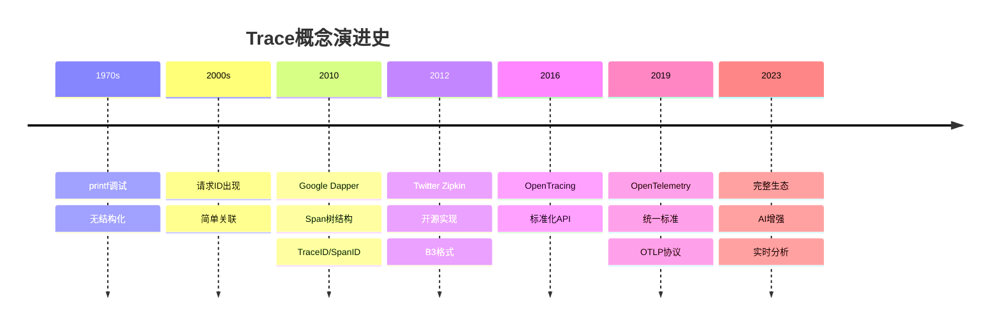
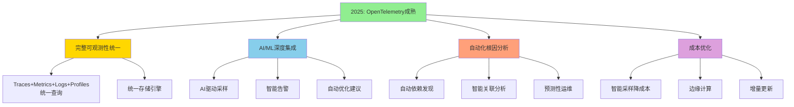
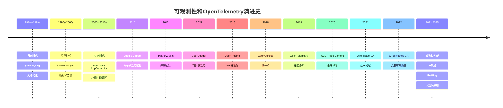

# 概念演进史

> **文档版本**: v1.0
> **创建日期**: 2025-10-26
> **维护团队**: OTLP项目组
> **适用范围**: 历史研究、标准演进、技术发展

---

## 📋 文档概述

本文档追溯OTLP项目及其核心概念的历史演进，展示从早期实践到现代标准的发展历程。

### 涵盖内容

- **可观测性历史**: 从日志到完整可观测性的演进
- **标准演进**: OpenTelemetry及相关标准的发展
- **概念起源**: 核心概念的提出和演化
- **技术里程碑**: 重要的技术突破和版本迭代

### 使用价值

- 📚 **理解背景**: 为什么需要这些概念
- 🔄 **把握趋势**: 技术演进的方向
- 🎯 **避免陷阱**: 从历史学习教训
- 💡 **启发创新**: 发现未来机会

---

## 1. 可观测性演进史

### 1.1 史前时代 (1970s-1990s)

#### 阶段特征

```
主要手段: 日志和printf调试
特点:
  - 简单直接
  - 无结构化
  - 难以分析
  - 无关联性
```

#### 代表技术

**Unix Syslog (1980)**:

```c
// 最早的系统日志
syslog(LOG_INFO, "User %s logged in", username);

// 特点：
// - 简单文本
// - 本地存储
// - 无结构
// - 无上下文
```

**传统日志文件**:

```
[2024-01-01 10:00:00] INFO: Application started
[2024-01-01 10:00:01] DEBUG: Processing request
[2024-01-01 10:00:02] ERROR: Database connection failed
[2024-01-01 10:00:03] INFO: Retrying...

问题:
  - 难以解析
  - 无法关联
  - 难以搜索
  - 无法量化
```

---

### 1.2 监控时代 (1990s-2000s)

#### 阶段特征

```
主要手段: 指标监控
代表: SNMP, Nagios, Ganglia
特点:
  - 系统级监控
  - 阈值告警
  - 时序数据
  - 仍缺乏上下文
```

#### 重要里程碑

**SNMP (Simple Network Management Protocol, 1988)**:

```
作用: 网络设备监控
特点:
  - 标准化
  - 轮询模型
  - MIB定义

局限:
  - 仅适用于基础设施
  - 无应用级可观测性
```

**Nagios (1999)**:

```
作用: IT基础设施监控
贡献:
  - 插件架构
  - 告警系统
  - 可扩展性

局限:
  - 主动检查（轮询）
  - 高开销
  - 无细粒度追踪
```

**RRDtool (1999)**:

```
作用: 时序数据存储
创新:
  - 固定大小数据库
  - 高效聚合
  - 图表生成

影响:
  - 启发了后续时序数据库设计
  - Cacti, Munin等基于此构建
```

---

### 1.3 应用性能管理时代 (2000s-2010s)

#### 阶段特征

```
主要手段: APM工具
代表: New Relic, AppDynamics, Dynatrace
特点:
  - 应用级监控
  - 事务追踪
  - 商业产品主导
  - 厂商锁定
```

#### 关键创新

**Distributed Tracing概念诞生**:

**Google Dapper (2010)**:

```
论文: "Dapper, a Large-Scale Distributed Systems Tracing Infrastructure"

核心概念:
  - Trace: 完整请求路径
  - Span: 单个操作
  - TraceID/SpanID: 全局唯一标识
  - Parent-Child关系: 调用层次
  - 采样: 控制开销

影响:
  - 定义了分布式追踪的基础架构
  - 启发了所有后续追踪系统
```

**Dapper核心设计**:

```
Tree结构:
  Trace = 一棵Span树

  [Frontend]
      ↓
  [AuthService]
      ↓
  [UserDB]

数据模型:
  Span {
    trace_id: int64
    span_id: int64
    parent_span_id: int64
    name: string
    start_time: timestamp
    duration: microseconds
    annotations: map<string, string>
  }

采样策略:
  - 自适应采样率
  - TraceID哈希决定
  - 保持trace完整性
```

---

### 1.4 开源追踪时代 (2010s-2015)

#### Twitter Zipkin (2012)

```
动机: Dapper的开源实现
架构:
  Collector → Storage → Query UI

贡献:
  - 开源社区建设
  - B3传播格式
  - 多语言SDK

采用者:
  - Twitter (内部)
  - SoundCloud
  - Yelp
  - ...数百家公司
```

**B3传播格式**:

```http
# 原始B3格式（HTTP头）
X-B3-TraceId: 80f198ee56343ba864fe8b2a57d3eff7
X-B3-SpanId: e457b5a2e4d86bd1
X-B3-ParentSpanId: 05e3ac9a4f6e3b90
X-B3-Sampled: 1

# 单一头格式（后期）
b3: 80f198ee56343ba864fe8b2a57d3eff7-e457b5a2e4d86bd1-1-05e3ac9a4f6e3b90
```

#### Uber Jaeger (2015)

```
动机: 更好的可扩展性和性能
技术创新:
  - 自适应采样
  - Cassandra存储
  - 实时聚合
  - Spark分析

兼容性:
  - 兼容Zipkin API
  - 支持OpenTracing

影响:
  - CNCF项目
  - 成为事实标准之一
```

---

### 1.5 标准化时代 (2016-2019)

#### OpenTracing (2016)

```
目标: 统一追踪API
由CNCF主导

核心接口:
  Tracer:
    - startSpan()
    - inject()      // Context传播
    - extract()

  Span:
    - setTag()
    - log()
    - finish()

  SpanContext:
    - traceID
    - spanID
    - baggage

贡献:
  - 厂商中立API
  - 插件化设计
  - 多语言一致性

局限:
  - 仅追踪，无指标和日志
  - 实现碎片化
```

#### OpenCensus (2018)

```
由Google发起
目标: 统一的指标和追踪库

特点:
  - 同时支持Metrics和Tracing
  - 内置导出器
  - 自动Instrumentation

支持:
  - C++, Go, Java, Node.js, Python, Ruby, PHP

问题:
  - 与OpenTracing竞争
  - 社区分裂
```

---

### 1.6 OpenTelemetry时代 (2019-现在)

#### 起源：合并之路

```
2019年5月:
  OpenTracing + OpenCensus = OpenTelemetry

动机:
  - 消除社区分裂
  - 统一最佳实践
  - 完整可观测性（Traces + Metrics + Logs）

支持方:
  - CNCF
  - Google
  - Microsoft
  - Uber
  - ...50+公司
```

#### OpenTelemetry演进

**Beta (2020)**:

```
✓ Trace API/SDK稳定
✓ 多语言SDK发布
✓ Collector Alpha
✓ OTLP协议定义

支持语言:
  - Java, Go, Python, JavaScript
  - .NET, Ruby, PHP, C++
```

**GA (2021-2022)**:

```
✓ Trace API/SDK GA
✓ Metrics API/SDK GA (2022)
✓ Collector稳定版
✓ 自动Instrumentation成熟
✓ 语义约定确立

版本:
  - API: v1.0+ (stable)
  - SDK: v1.0+ (stable)
  - Collector: v0.50+ (production-ready)
```

**Current (2023-2025)**:

```
✓ Logs API/SDK稳定
✓ Profiling支持（实验）
✓ eBPF Instrumentation
✓ 云原生深度集成
✓ AI/ML可观测性支持

生态系统:
  - 150+ Instrumentation库
  - 50+ 后端集成
  - 数千企业应用
```

---

## 2. 核心概念演进

### 2.1 Trace概念演进



#### 关键演进点

**从日志到追踪**:

```
Phase 1: 日志关联 (2000s)
  [2024-01-01] RequestID=123 Started
  [2024-01-01] RequestID=123 DB Query
  [2024-01-01] RequestID=123 Completed

  问题: 无层次结构，难以可视化

Phase 2: 结构化追踪 (2010s)
  Trace {
    id: 123,
    spans: [
      {id: 1, name: "HTTP Handler", parent: null},
      {id: 2, name: "DB Query", parent: 1},
      {id: 3, name: "Cache Check", parent: 1}
    ]
  }

  改进: 清晰层次，可视化调用图

Phase 3: 语义追踪 (2020s)
  Trace {
    id: 123,
    spans: [...],
    resource: {service.name: "api-server"},
    semantic_conventions: "HTTP/gRPC/DB"
  }

  改进: 标准化属性，跨系统兼容
```

**采样策略演进**:

```
Generation 1: 固定比率
  sample_rate = 0.1  // 10%

  问题: 可能丢失重要trace

Generation 2: 自适应采样
  if error: sample_rate = 1.0
  else if slow: sample_rate = 1.0
  else: sample_rate = 0.01

  改进: 智能采样

Generation 3: Tail Sampling
  collect_all() → analyze() → decide()

  改进: 基于完整信息决策

Generation 4: ML驱动采样
  model.predict(trace_features) → sample_decision

  改进: 预测重要性
```

---

### 2.2 Context传播演进

#### 历史阶段

**阶段1: 无传播 (Pre-2010)**:

```
问题:
  - 每个服务独立日志
  - 无法关联请求
  - 分布式系统黑盒

示例:
  Service A log: [10:00:01] Process request
  Service B log: [10:00:02] Query database
  → 无法知道这两条是否相关
```

**阶段2: 简单RequestID (2000s)**:

```
HTTP Header:
  X-Request-ID: uuid-1234-5678

改进:
  - 可以关联日志
  - 手动传播

局限:
  - 无层次结构
  - 无标准化
  - 容易丢失
```

**阶段3: B3格式 (2012, Zipkin)**:

```
HTTP Headers:
  X-B3-TraceId: 80f198ee56343ba864fe8b2a57d3eff7
  X-B3-SpanId: e457b5a2e4d86bd1
  X-B3-ParentSpanId: 05e3ac9a4f6e3b90
  X-B3-Sampled: 1

贡献:
  - 明确父子关系
  - 采样信息传播
  - 事实标准

局限:
  - 多个HTTP头
  - 非W3C标准
```

**阶段4: W3C Trace Context (2020)**:

```
HTTP Headers:
  traceparent: 00-4bf92f3577b34da6a3ce929d0e0e4736-00f067aa0ba902b7-01
  tracestate: vendor1=data,vendor2=data

创新:
  - W3C官方标准
  - 单一traceparent头
  - 多厂商tracestate
  - 向前兼容

影响:
  - 浏览器原生支持
  - 全球标准
  - 跨组织追踪
```

**阶段5: 多协议支持 (OpenTelemetry)**:

```
支持的传播格式:
  - W3C Trace Context (推荐)
  - B3 (兼容Zipkin)
  - Jaeger
  - AWS X-Ray
  - 自定义

特点:
  - 可配置
  - 多格式共存
  - 自动转换
```

#### Context传播技术演进


---

### 2.3 数据模型演进

#### Span数据模型变迁

**Dapper模型 (2010)**:

```
Span {
  trace_id: int64
  span_id: int64
  parent_id: int64
  name: string
  start_time: timestamp
  duration: microseconds
  annotations: map<string, string>
}

特点:
  - 简单直观
  - 树状结构
  - 时间+标注
```

**Zipkin模型 (2012)**:

```
Span {
  traceId: string
  id: string
  parentId: string
  name: string
  timestamp: microseconds
  duration: microseconds
  annotations: [
    {timestamp, value, endpoint}
  ]
  binaryAnnotations: [
    {key, value, type, endpoint}
  ]
}

改进:
  - Endpoint信息
  - 类型化标注
  - 更丰富的元数据
```

**OpenTracing模型 (2016)**:

```
Span {
  context: SpanContext {
    traceID
    spanID
    baggage
  }
  operationName: string
  startTime: timestamp
  finishTime: timestamp
  tags: map<string, any>
  logs: [{timestamp, fields}]
  references: [SpanReference]
}

创新:
  - Baggage传播
  - 结构化日志
  - Span引用（不仅parent）
```

**OpenTelemetry模型 (2019-现在)**:

```
Span {
  trace_id: bytes<16>
  span_id: bytes<8>
  trace_state: string
  parent_span_id: bytes<8>
  name: string
  span_kind: enum {INTERNAL, SERVER, CLIENT, PRODUCER, CONSUMER}
  start_time_unix_nano: int64
  end_time_unix_nano: int64
  attributes: repeated KeyValue
  dropped_attributes_count: uint32
  events: repeated Event {
    time_unix_nano: int64
    name: string
    attributes: repeated KeyValue
  }
  dropped_events_count: uint32
  links: repeated Link {
    trace_id: bytes<16>
    span_id: bytes<8>
    trace_state: string
    attributes: repeated KeyValue
  }
  dropped_links_count: uint32
  status: Status {
    code: enum {UNSET, OK, ERROR}
    message: string
  }
}

Resource {
  attributes: repeated KeyValue
  dropped_attributes_count: uint32
}

InstrumentationScope {
  name: string
  version: string
  attributes: repeated KeyValue
}

完整改进:
  - 语义约定
  - SpanKind明确角色
  - Resource分离
  - 丢弃计数（完整性）
  - 纳秒精度
  - 灵活Links
```

---

## 3. 标准化历程

### 3.1 协议演进

```
2012: Zipkin协议
  - Thrift/JSON编码
  - HTTP传输
  - 简单高效

2015: Jaeger协议
  - Thrift编码
  - UDP/HTTP传输
  - 批量发送

2018: OpenCensus Protocol
  - Protobuf编码
  - gRPC传输
  - 支持Metrics

2019-: OTLP (OpenTelemetry Protocol)
  - Protobuf编码
  - gRPC/HTTP传输
  - Traces + Metrics + Logs统一
  - 高效压缩
  - 向后兼容
```

#### OTLP演进史

```
v0.1 (2019):
  - 初始设计
  - Trace only

v0.5 (2020):
  - 添加Metrics
  - 稳定TracesData

v0.9 (2021):
  - 添加Logs
  - Resource模型稳定

v1.0 (2022):
  - 语义约定v1
  - 完整稳定性

v1.x (2023-):
  - 性能优化
  - 新特性（Profiling等）
  - 增强兼容性
```

### 3.2 语义约定演进

**阶段1: 无约定 (Pre-2016)**:

```
每家自定义:
  Service A: "endpoint": "/api/users"
  Service B: "url": "/api/users"
  Service C: "path": "/api/users"

问题: 无法统一分析
```

**阶段2: 部分约定 (OpenTracing)**:

```
建议的标签:
  span.kind: "client" | "server"
  error: true | false
  http.method: "GET"
  http.url: "https://example.com/api"

改进: 一定程度统一
局限: 非强制，不完整
```

**阶段3: 全面约定 (OpenTelemetry)**:

```
语义约定覆盖:
  - HTTP (http.*)
  - gRPC (rpc.*)
  - Database (db.*)
  - Messaging (messaging.*)
  - FaaS (faas.*)
  - ...20+领域

示例 (HTTP):
  http.method: "GET"
  http.url: "https://api.example.com/users/123"
  http.target: "/users/123"
  http.host: "api.example.com"
  http.scheme: "https"
  http.status_code: 200
  http.user_agent: "Mozilla/5.0 ..."

稳定性:
  - Stable (生产可用)
  - Experimental (可能变化)
  - Deprecated (将移除)
```

---

## 4. 技术里程碑

### 4.1 关键论文和发布

```
2010: Google Dapper论文
  "Dapper, a Large-Scale Distributed Systems Tracing Infrastructure"
  影响: 定义了现代分布式追踪

2012: Zipkin开源
  Twitter工程博客发布
  影响: 首个主流开源实现

2016: OpenTracing发布
  CNCF孵化项目
  影响: API标准化

2018: OpenCensus发布
  Google开源
  影响: 统一Metrics和Tracing

2019: OpenTelemetry成立
  CNCF官方宣布
  影响: 社区统一

2020: W3C Trace Context标准
  W3C Recommendation
  影响: 浏览器和全球标准

2021: OpenTelemetry Trace GA
  生产就绪
  影响: 企业大规模采用

2022: OpenTelemetry Metrics GA
  完整可观测性
  影响: 替代Prometheus客户端
```

### 4.2 采用里程碑

```
企业采用:
  2012: Twitter (Zipkin)
  2015: Uber (Jaeger)
  2017: Lyft (Envoy + tracing)
  2019: Microsoft Azure (OpenTelemetry)
  2020: AWS X-Ray集成
  2021: Google Cloud Operations
  2022: 数千家企业

云服务商支持:
  ✓ AWS X-Ray
  ✓ Azure Monitor
  ✓ Google Cloud Trace
  ✓ Alibaba Cloud ARMS
  ✓ ...

可观测性平台:
  ✓ Datadog
  ✓ New Relic
  ✓ Dynatrace
  ✓ Elastic APM
  ✓ Grafana Tempo
  ✓ Jaeger
  ✓ Zipkin
  ✓ ...

原生集成:
  ✓ Kubernetes
  ✓ Istio
  ✓ Envoy
  ✓ NGINX
  ✓ ...
```

---

## 5. 未来展望

### 5.1 进行中的演进

**Profiling集成 (2023-2025)**:

```
目标: 统一Trace和Profile

当前状态: Experimental

愿景:
  Trace → 慢在哪个Span
  Profile → Span内部慢在哪行代码

技术:
  - eBPF profiling
  - 无侵入采集
  - 高精度时间关联
```

**日志与追踪深度集成**:

```
目标: 自动关联日志和Span

示例:
  log.info("Processing order", {
    trace_id: current_trace_id,
    span_id: current_span_id
  });

  // 自动在Trace UI中内嵌日志
```

**AI/ML可观测性**:

```
挑战:
  - 模型训练追踪
  - 推理延迟分析
  - 数据血缘追踪

OpenTelemetry扩展:
  - AI语义约定
  - 模型指标
  - 训练Trace
```

**实时分析和告警**:

```
方向:
  - 流式处理
  - 实时异常检测
  - 自动根因分析

技术:
  - Collector实时分析
  - ML异常检测
  - 图分析引擎
```

### 5.2 未来方向



---

## 6. 经验教训

### 6.1 成功因素

```
✓ 社区驱动
  - CNCF中立性
  - 多厂商参与
  - 开放标准

✓ 向后兼容
  - 兼容Zipkin/Jaeger
  - 渐进式迁移
  - 稳定性保证

✓ 完整生态
  - 多语言SDK
  - 丰富的Instrumentation
  - 后端多样性

✓ 实用主义
  - 性能优先
  - 生产就绪
  - 渐进式采用
```

### 6.2 避免的陷阱

```
✗ 过度设计
  教训: OpenCensus vs OpenTracing竞争
  应对: 简单实用的API

✗ 厂商锁定
  教训: 早期APM工具专有格式
  应对: 开放标准和多后端支持

✗ 性能忽视
  教训: 早期追踪开销大
  应对: 采样、批处理、异步导出

✗ 碎片化
  教训: 多个竞争标准
  应对: OpenTelemetry统一
```

---

## 7. 时间线总览



---

## 📊 文档统计

- **历史阶段**: 6个主要时代
- **关键里程碑**: 20+个
- **演进图表**: 3个时间线
- **技术对比**: 5个演进分析
- **未来展望**: 4个主要方向

---

## 🔗 相关文档

- ← [基础概念索引](./01_基础概念.md)
- ← [形式化概念索引](./02_形式化概念.md)
- ← [实现概念索引](./03_实现概念.md)
- ← [概念关系图](./04_概念关系图.md)
- ↗ [项目发展历程](../../docs/00_项目概览/项目发展历程.md)

---

## 📚 参考文献

1. Sigelman et al., "Dapper, a Large-Scale Distributed Systems Tracing Infrastructure", Google Technical Report, 2010
2. OpenTelemetry Documentation, <https://opentelemetry.io>
3. W3C Trace Context Specification, <https://www.w3.org/TR/trace-context/>
4. CNCF OpenTelemetry Project History
5. Zipkin Project Documentation
6. Jaeger Project Documentation

---

**最后更新**: 2025-10-26
**维护**: OTLP项目组
**版本**: v1.0
