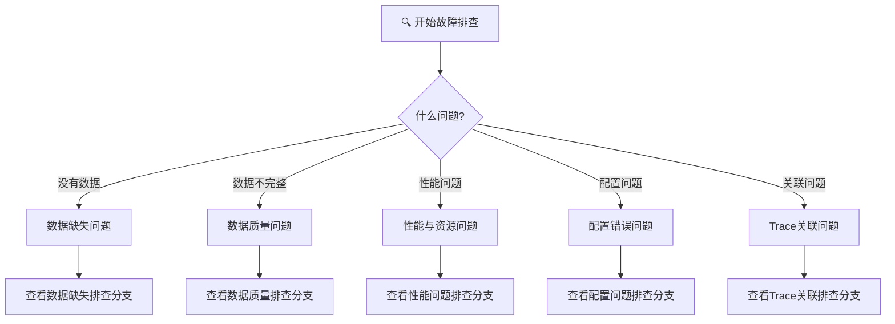
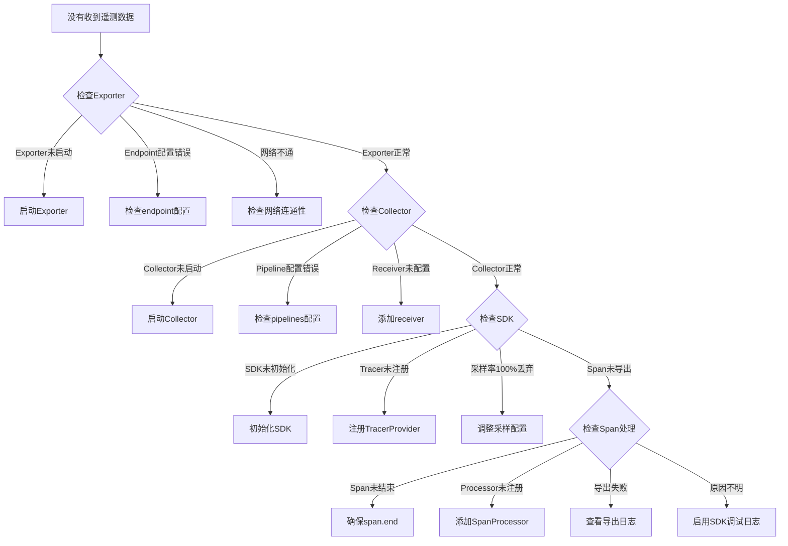
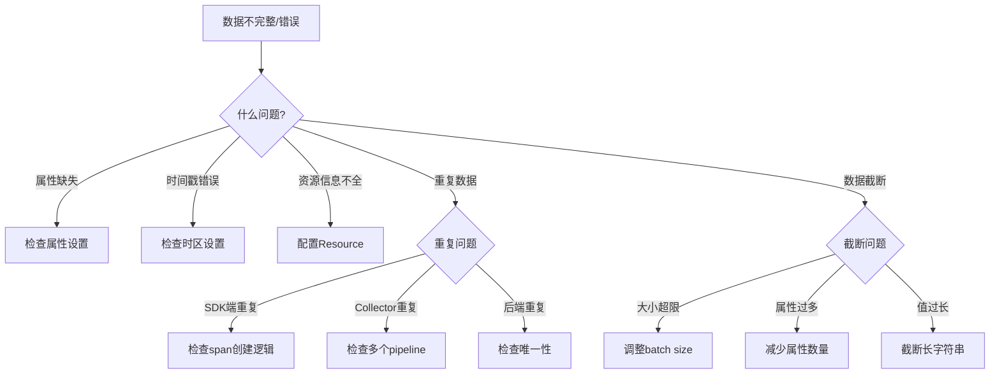
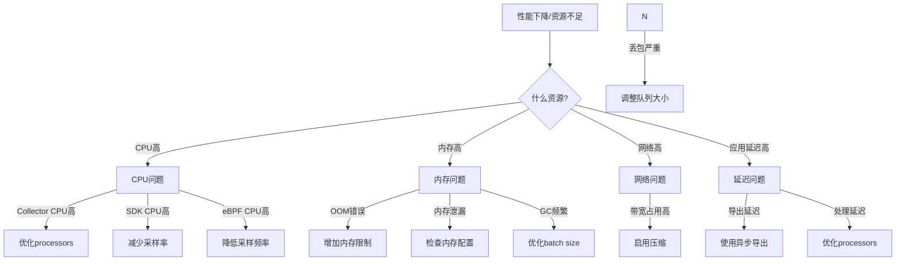
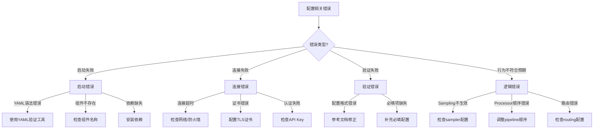
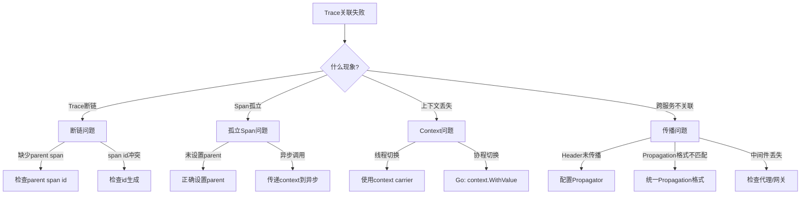

# 故障排查决策树

> **用途**: 系统性诊断OpenTelemetry常见问题
> **适用场景**: 问题诊断、故障排查
> **建议**: 按顺序执行每个步骤

---

## 🌳 顶层决策: 什么问题?



---

## 🔴 分支1: 数据缺失问题



### 数据缺失检查清单

```yaml
步骤1: 验证后端
  - [ ] 后端服务是否运行
  - [ ] 端口是否正确开放
  - [ ] API Token是否有效
  - [ ] 网络是否可达 (curl/wget测试)

步骤2: 验证Collector
  - [ ] Collector是否运行
  - [ ] 配置文件是否正确
  - [ ] Receiver端口是否监听
  - [ ] Exporter配置是否正确
  - [ ] 查看Collector日志

步骤3: 验证SDK
  - [ ] SDK是否正确初始化
  - [ ] TracerProvider是否设置
  - [ ] SpanProcessor是否添加
  - [ ] Exporter是否配置
  - [ ] 采样率是否合适

步骤4: 验证代码
  - [ ] Span是否正确创建
  - [ ] Span是否正确结束
  - [ ] Context是否正确传播
  - [ ] 属性是否正确设置
```

---

## 🟡 分支2: 数据质量问题



### 数据质量检查清单

```yaml
属性问题:
  - [ ] 是否使用语义约定属性名
  - [ ] 属性值类型是否正确
  - [ ] 是否有空值/异常值
  - [ ] 属性数量是否过多 (>50)

资源问题:
  - [ ] service.name是否设置
  - [ ] service.version是否设置
  - [ ] deployment.environment是否设置
  - [ ] host.name是否设置

时间问题:
  - [ ] 时间戳格式是否正确 (纳秒)
  - [ ] 时区是否统一 (UTC)
  - [ ] 时钟是否同步 (NTP)

基数问题:
  - [ ] 属性值是否离散度过高
  - [ ] 是否有动态生成的属性名
  - [ ] 是否控制cardinality (<2000)
```

---

## 🟠 分支3: 性能与资源问题



### 性能问题诊断命令

```bash
# 1. Collector资源使用
kubectl top pod -l app=otel-collector
# 或
docker stats otel-collector

# 2. SDK性能指标
# 查看 /metrics 端点
# otel_sdk_span_processor_queue_count
# otel_sdk_exporter_export_duration

# 3. 网络流量
iftop -i eth0
# 或
nethogs

# 4. 应用延迟影响
# 对比开启/关闭OTel的p99延迟
```

---

## 🔵 分支4: 配置错误问题



### 常见配置错误速查

| 错误信息 | 原因 | 解决方案 |
|:---|:---|:---|
| `unknown receiver type` | Receiver不存在 | 检查拼写/安装contrib |
| `endpoint not found` | 端点配置错误 | 检查host:port |
| `TLS handshake failed` | 证书问题 | 配置正确证书 |
| `authorization failed` | API Key错误 | 检查token |
| `queue full` | 队列溢出 | 增加队列大小或采样率 |
| `memory limit exceeded` | 内存超限 | 增加limit或优化batch |

---

## 🟢 分支5: Trace关联问题



### Trace关联检查清单

```yaml
跨进程传播:
  - [ ] 是否正确注入Propagator
  - [ ] HTTP Header是否正确传递
  - [ ] gRPC Metadata是否正确传递
  - [ ] 消息队列消息属性是否正确传递

进程内传播:
  - [ ] 线程间是否正确传递Context
  - [ ] 异步调用是否传递Context
  - [ ] 回调函数是否恢复Context

验证方法:
  - [ ] 查看trace_id是否一致
  - [ ] 查看parent_span_id是否正确
  - [ ] 使用Jaeger/Tempo查看Trace图
  - [ ] 检查span时间范围是否合理
```

---

## 🛠️ 诊断工具箱

### 1. Collector诊断

```yaml
# 启用调试日志
service:
  telemetry:
    logs:
      level: debug
      output_paths: ["/var/log/otel.log"]

# 使用debug exporter
exporters:
  debug:
    verbosity: detailed
    sampling_initial: 5
    sampling_thereafter: 2000
```

### 2. SDK诊断

```python
# Python SDK调试
import logging
logging.basicConfig(level=logging.DEBUG)

# 或设置环境变量
export OTEL_LOG_LEVEL=debug
```

```java
// Java SDK调试
java -javaagent:opentelemetry-javaagent.jar \
     -Dotel.javaagent.debug=true \
     -jar myapp.jar
```

### 3. 网络诊断

```bash
# 检查连通性
curl -v http://otel-collector:4318/v1/traces

# 检查gRPC
telnet otel-collector 4317

# 抓包分析
tcpdump -i any port 4317 or port 4318
```

---

## 📋 通用排查流程

```text
┌─────────────────────────────────────────────────────────────┐
│                    故障排查标准流程                          │
├─────────────────────────────────────────────────────────────┤
│                                                              │
│  1️⃣  收集信息                                                │
│      ├── 错误日志                                            │
│      ├── 配置文件                                            │
│      ├── 环境信息                                            │
│      └── 复现步骤                                            │
│                                                              │
│  2️⃣  分层定位                                                │
│      ├── 后端层: 数据是否到达?                               │
│      ├── Collector层: 是否正确处理?                          │
│      ├── SDK层: 是否正确导出?                                │
│      └── 应用层: 是否正确创建?                               │
│                                                              │
│  3️⃣  使用决策树                                              │
│      └── 根据问题类型选择对应分支                            │
│                                                              │
│  4️⃣  执行检查清单                                            │
│      └── 按清单逐项检查                                      │
│                                                              │
│  5️⃣  验证修复                                                │
│      └── 确认问题解决                                        │
│                                                              │
└─────────────────────────────────────────────────────────────┘
```

---

**文档版本**: v1.0
**更新日期**: 2026年3月15日
**维护者**: OTLP项目团队
