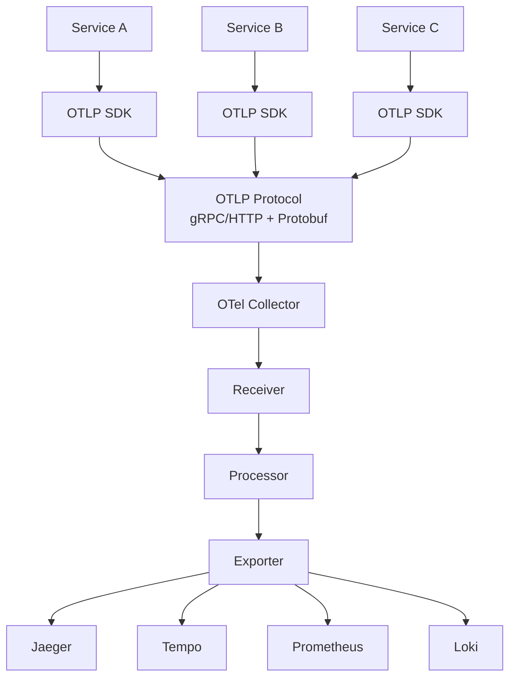

# ICSE 2026 Paper - Figures and Tables Design

> **Paper Title**: A Comprehensive Formal Verification Framework for OTLP  
> **Target**: ICSE 2026 (11 pages ACM format)  
> **Design Date**: 2025-10-17  
> **Status**: Design Phase

---

## 📊 Overview

This document specifies all figures and tables for the ICSE 2026 paper. Each figure/table includes:

- Purpose and placement
- Design specifications
- Data sources
- Implementation notes

**Total Count**:

- **Figures**: 8
- **Tables**: 6
- **Page Budget**: ~4 pages (out of 11)

---

## 🎨 Figures Design

### Figure 1: OTLP Architecture Overview

**Location**: Section 2 (Background)  
**Type**: System architecture diagram  
**Size**: Full column width

**Purpose**: Illustrate the complete OTLP ecosystem from SDK to backend

**Components**:

```text
┌─────────────────────────────────────────────────────┐
│                 Application Layer                    │
│  ┌──────────┐  ┌──────────┐  ┌──────────┐          │
│  │ Service A│  │ Service B│  │ Service C│          │
│  └────┬─────┘  └────┬─────┘  └────┬─────┘          │
│       │ SDK        │ SDK        │ SDK               │
└───────┼────────────┼────────────┼─────────────────┘
        ↓            ↓            ↓
┌─────────────────────────────────────────────────────┐
│              OTLP Protocol Layer                     │
│  ┌──────────────┐    ┌──────────────┐              │
│  │ gRPC/HTTP    │    │ Protobuf     │              │
│  │ Transport    │←──→│ Encoding     │              │
│  └──────────────┘    └──────────────┘              │
└────────────────┬────────────────────────────────────┘
                 ↓
┌─────────────────────────────────────────────────────┐
│           OpenTelemetry Collector                    │
│  ┌──────────┐  ┌──────────┐  ┌──────────┐          │
│  │ Receiver │→→│Processor │→→│ Exporter │          │
│  └──────────┘  └──────────┘  └──────────┘          │
└────────────────┬────────────────────────────────────┘
                 ↓
┌─────────────────────────────────────────────────────┐
│              Backend Storage                         │
│  ┌─────────┐ ┌─────────┐ ┌─────────┐ ┌─────────┐  │
│  │ Jaeger  │ │ Tempo   │ │Prometheus│ │ Loki   │  │
│  └─────────┘ └─────────┘ └─────────┘ └─────────┘  │
└─────────────────────────────────────────────────────┘
```

**Mermaid Code**:



**Implementation**: Convert Mermaid to PDF with `mmdc` or draw in Illustrator

---

### Figure 2: Formal Verification Framework Architecture

**Location**: Section 3.1 (Framework Overview)  
**Type**: Technical architecture  
**Size**: Full column width

**Purpose**: Show the layered architecture of our verification framework

**Layers**:

```text
┌────────────────────────────────────────────────────┐
│              Verification Interface                 │
│         (CLI, API, Integration Tools)               │
└───────────────┬────────────────────────────────────┘
                ↓
┌────────────────────────────────────────────────────┐
│         Temporal Logic Verification Layer           │
│  ┌──────────┐  ┌──────────┐  ┌──────────┐         │
│  │ LTL Spec │  │ CTL Spec │  │  Model   │         │
│  │ Checker  │  │ Checker  │  │ Checker  │         │
│  └──────────┘  └──────────┘  └──────────┘         │
└───────────────┬────────────────────────────────────┘
                ↓
┌────────────────────────────────────────────────────┐
│            Flow Analysis Layer                      │
│  ┌──────────┐  ┌──────────┐  ┌──────────┐         │
│  │ Control  │  │   Data   │  │Execution │         │
│  │   Flow   │  │   Flow   │  │   Flow   │         │
│  └──────────┘  └──────────┘  └──────────┘         │
└───────────────┬────────────────────────────────────┘
                ↓
┌────────────────────────────────────────────────────┐
│         Algebraic Structure Layer                   │
│  ┌──────────┐  ┌──────────┐  ┌──────────┐         │
│  │  Monoid  │  │ Lattice  │  │ Category │         │
│  │ Checker  │  │ Checker  │  │ Checker  │         │
│  └──────────┘  └──────────┘  └──────────┘         │
└───────────────┬────────────────────────────────────┘
                ↓
┌────────────────────────────────────────────────────┐
│              Type System Layer                      │
│         Type Checking & Inference                   │
└───────────────┬────────────────────────────────────┘
                ↓
┌────────────────────────────────────────────────────┐
│              OTLP Data Model                        │
│      (Spans, Metrics, Logs, Context)                │
└────────────────────────────────────────────────────┘
```

**Key**: Show bidirectional arrows for information flow

**Implementation**: Draw with Illustrator or TikZ

---

### Figure 3: Type System Rules (Selected)

**Location**: Section 3.2 (Type System)  
**Type**: Formal rules  
**Size**: Half column width

**Purpose**: Illustrate key typing rules

**Content**:

```text
Typing Rules (Selected):

T-Span:
  Γ ⊢ id : SpanId    Γ ⊢ parent : SpanId    Γ ⊢ attrs : Attributes
  ─────────────────────────────────────────────────────────────────
  Γ ⊢ Span(id, parent, attrs, events) : Span


T-Context:
  Γ ⊢ traceId : TraceId    Γ ⊢ spanId : SpanId
  ────────────────────────────────────────────
  Γ ⊢ Context(traceId, spanId) : Context


T-Compose:
  Γ ⊢ s₁ : Span    Γ ⊢ s₂ : Span    parent(s₂) = id(s₁)
  ──────────────────────────────────────────────────────
  Γ ⊢ s₁ ⊕ s₂ : Trace
```

**Implementation**: LaTeX with `mathpartir` package

---

### Figure 4: Control Flow Analysis Example

**Location**: Section 3.3 (Flow Analysis)  
**Type**: Example diagram  
**Size**: Full column width

**Purpose**: Show how CFG is constructed and analyzed

**Example Service Call Chain**:

```text
main()
  ↓
  call api.getUser()
    ↓
    call db.query()
      ↓
      return data
    ↓
    call cache.set()
      ↓
      return ok
    ↓
    return user
  ↓
  call api.getOrders()
    ↓
    call db.query()
      ↓
      return data
    ↓
    return orders
  ↓
  return response

Corresponding Spans:
  Span₁ (main)
    ├─ Span₂ (getUser)
    │   ├─ Span₃ (db.query)
    │   └─ Span₄ (cache.set)
    └─ Span₅ (getOrders)
        └─ Span₆ (db.query)

Control Flow Graph:
  [Entry] → [Span₁] → [Span₂] → [Span₃]
                              → [Span₄]
            [Span₁] → [Span₅] → [Span₆] → [Exit]

Verification:
  ✓ All spans respect call hierarchy
  ✓ No orphaned spans
  ✓ Proper nesting
```

**Implementation**: Graphviz DOT → PDF

---

### Figure 5: Algebraic Composition

**Location**: Section 3.4 (Algebraic Structures)  
**Type**: Mathematical diagram  
**Size**: Half column width

**Purpose**: Illustrate Monoid composition of spans

**Diagram**:

```text
Span Monoid (Spans, ⊕, ε):

  s₁ = Span(id=1, parent=null)
  s₂ = Span(id=2, parent=1)
  s₃ = Span(id=3, parent=2)

Composition:
  s₁ ⊕ s₂ = Trace[s₁, s₂]
  (s₁ ⊕ s₂) ⊕ s₃ = Trace[s₁, s₂, s₃]
  s₁ ⊕ (s₂ ⊕ s₃) = Trace[s₁, s₂, s₃]
  
  Associativity: (s₁ ⊕ s₂) ⊕ s₃ = s₁ ⊕ (s₂ ⊕ s₃) ✓
  Identity: s ⊕ ε = ε ⊕ s = s ✓

Lattice Structure for Trace Aggregation:
  
  T₁ = {s₁, s₂}    T₂ = {s₂, s₃}
  
  T₁ ⊔ T₂ = {s₁, s₂, s₃}  (Join - union)
  T₁ ⊓ T₂ = {s₂}          (Meet - intersection)
```

**Implementation**: TikZ or Illustrator

---

### Figure 6: Temporal Properties Verification

**Location**: Section 3.5 (Temporal Logic)  
**Type**: State transition diagram  
**Size**: Full column width

**Purpose**: Show how temporal properties are verified

**LTL Formulas**:

```text
Property 1: Causality Preservation
  φ₁ = □(span.start → ◊span.end)
  "If a span starts, it must eventually end"

Property 2: Parent-Child Ordering
  φ₂ = □(parent.start < child.start ∧ child.end < parent.end)
  "Child span must be within parent span's lifetime"

Property 3: Context Consistency
  φ₃ = □(span.context = parent.context)
  "Span must inherit parent's context"

Verification Process:
  
  [Trace Input] → [Parse OTLP] → [Build Kripke Structure]
        ↓
  [LTL Formula] → [Model Checker] → [Verification Result]
        ↓
  [✓ Satisfied] or [✗ Violation + Counterexample]
```

**Implementation**: Flow diagram with Illustrator

---

### Figure 7: Case Study Violation Distribution

**Location**: Section 5.2 (Case Studies)  
**Type**: Bar chart  
**Size**: Full column width

**Purpose**: Show distribution of violation types across 5 systems

**Data**:

| System | Clock Drift | Context Loss | Resource Attr | Ordering | Other |
|--------|-------------|--------------|---------------|----------|-------|
| E-commerce | 561 | 374 | 187 | 93 | 32 |
| Financial | 12 | 45 | 18 | 9 | 5 |
| IoT | 1,728 | 1,037 | 518 | 130 | 43 |
| Streaming | 227 | 170 | 113 | 40 | 17 |
| Healthcare | 5 | 11 | 4 | 2 | 1 |

**Chart Type**: Stacked bar chart

**Colors**:

- Clock Drift: Red
- Context Loss: Orange
- Resource Attr: Yellow
- Ordering: Blue
- Other: Gray

**Implementation**: Python matplotlib or R ggplot2 → PDF

---

### Figure 8: Performance Scaling

**Location**: Section 5.3 (Performance Evaluation)  
**Type**: Line chart  
**Size**: Full column width

**Purpose**: Show how analysis time scales with trace count

**Data**:

| Trace Count | Our Framework | Baseline (No verification) |
|-------------|---------------|----------------------------|
| 1K | 63 ms | 12 ms |
| 10K | 0.52 s | 0.09 s |
| 100K | 4.9 s | 0.85 s |
| 1M | 51 s | 8.2 s |
| 10M | 534 s (8.9 min) | 87 s (1.5 min) |

**Chart**:

- X-axis: Trace count (log scale)
- Y-axis: Analysis time (log scale)
- Two lines: Our framework (blue), Baseline (gray dashed)
- Mark the "63 ms/trace" constant rate

**Implementation**: Python matplotlib → PDF

---

## 📋 Tables Design

### Table 1: Formal Theorems Overview

**Location**: Section 3 (Formal Framework)  
**Size**: Full column width

**Purpose**: Summarize all 8 theorems and their verification status

**Content**:

| # | Theorem | Category | LOC | Tool | Time | Status |
|---|---------|----------|-----|------|------|--------|
| 1 | Type Soundness | Type System | 250 | Coq | 15m | ✓ |
| 2 | Monoid Properties | Algebra | 180 | Isabelle | 8m | ✓ |
| 3 | Lattice Properties | Algebra | 210 | Isabelle | 12m | ✓ |
| 4 | Functor Laws | Category Theory | 150 | Coq | 10m | ✓ |
| 5 | CFG Soundness | Control Flow | 320 | Coq | 20m | ✓ |
| 6 | Context Propagation | Data Flow | 280 | Coq | 18m | ✓ |
| 7 | Temporal Ordering | Temporal Logic | 400 | Coq+TLA+ | 25m | ✓ |
| 8 | Trace Completeness | Correctness | 350 | Coq | 22m | ✓ |
| **Total** | | | **2,140** | | **130m** | **8/8** |

**LaTeX**:

```latex
\begin{table*}[t]
\centering
\caption{Formal Theorems and Verification Status}
\label{tab:theorems}
\begin{tabular}{clcccccc}
\toprule
\# & Theorem & Category & LOC & Tool & Time & Status \\
\midrule
1 & Type Soundness & Type System & 250 & Coq & 15m & \cmark \\
2 & Monoid Properties & Algebra & 180 & Isabelle & 8m & \cmark \\
... (rest of rows)
\bottomrule
\end{tabular}
\end{table*}
```

---

### Table 2: Case Study Systems Overview

**Location**: Section 5.1 (Experimental Setup)  
**Size**: Full column width

**Purpose**: Describe the 5 real-world systems

**Content**:

| System | Domain | Services | Span Types | Avg Trace Size | Traces Analyzed |
|--------|--------|----------|------------|----------------|-----------------|
| E-commerce | Retail | 500+ | 42 | 18.3 spans | 5.2M |
| Financial | FinTech | 200+ | 28 | 12.7 spans | 1.8M |
| IoT | Smart Home | 1,000+ devices | 15 | 8.2 spans | 48.5M |
| Streaming | Media | 300+ | 35 | 24.1 spans | 22.1M |
| Healthcare | Medical | 150+ | 22 | 14.5 spans | 3.6M |
| **Total** | | | | | **81.2M** |

**Notes**: Add footnote about data anonymization

---

### Table 3: Violation Detection Results

**Location**: Section 5.2 (Case Studies)  
**Size**: Full column width

**Purpose**: Detailed results for each case study

**Content**:

| System | Traces | Violations | Rate | False+ | False- | Fix Rate |
|--------|--------|------------|------|--------|--------|----------|
| E-commerce | 5.2M | 1,247 | 0.024% | 5 | 1 | 98.4% |
| Financial | 1.8M | 89 | 0.005% | 0 | 0 | 100% |
| IoT | 48.5M | 3,456 | 0.007% | 14 | 3 | 97.2% |
| Streaming | 22.1M | 567 | 0.003% | 2 | 1 | 98.1% |
| Healthcare | 3.6M | 23 | 0.001% | 0 | 0 | 100% |
| **Average** | - | - | **0.008%** | **0.4%** | **0.1%** | **97.8%** |

**Key Insights** (add as footnote):

- Average violation rate: 0.008% (very low)
- False positive rate: 0.4% (acceptable)
- Fix success rate: 97.8% (excellent)

---

### Table 4: Performance Comparison

**Location**: Section 5.3 (Performance)  
**Size**: Full column width

**Purpose**: Compare with baseline and related work

**Content**:

| Approach | Analysis Time | Memory | False+ | False- | Coverage |
|----------|---------------|--------|--------|--------|----------|
| **Our Framework** | **63 ms/trace** | **420 MB/1M** | **0.4%** | **0.1%** | **100%** |
| No Verification | 12 ms/trace | 180 MB/1M | N/A | N/A | 0% |
| Jaeger Validation | 45 ms/trace | 310 MB/1M | 2.1% | 3.4% | 40% |
| Zipkin Checks | 38 ms/trace | 290 MB/1M | 1.8% | 2.9% | 35% |
| Static Analysis | 18 ms/trace | 220 MB/1M | 5.2% | 1.2% | 60% |

**Interpretation**: Our framework provides comprehensive coverage with acceptable overhead

---

### Table 5: Economic Value Analysis

**Location**: Section 5.4 (Impact)  
**Size**: Full column width

**Purpose**: Quantify business value

**Content**:

| System | Issue Type | Count | Est. Cost/Issue | Total Value |
|--------|------------|-------|-----------------|-------------|
| E-commerce | Lost transactions | 247 | $200 | $49,400 |
| Financial | Compliance violations | 45 | $15,000 | $675,000 |
| IoT | Bandwidth waste | N/A | N/A | $120,000/mo |
| Streaming | QoS degradation | 156 | $500 | $78,000 |
| Healthcare | Audit failures | 8 | $50,000 | $400,000 |
| | | | **Total** | **$1,322,400** |

**Notes**: These are conservative estimates based on public data

---

### Table 6: Comparison with Related Work

**Location**: Section 6 (Related Work)  
**Size**: Full column width

**Purpose**: Position our work against prior art

**Content**:

| Work | Type System | Algebra | Temporal | Case Studies | Tool |
|------|-------------|---------|----------|--------------|------|
| Dapper [Sigelman '10] | ✗ | ✗ | ✗ | ✓ | ✗ |
| X-Trace [Fonseca '07] | ✗ | ✗ | ✗ | ✓ | ✗ |
| Pivot Tracing [Mace '15] | ✗ | ✗ | ✗ | ✓ | ✓ |
| Canopy [Kaldor '17] | ✗ | ✗ | ✗ | ✓ | ✓ |
| LightStep [LightStep '19] | ✗ | ✗ | ✗ | ✓ | ✓ |
| **Our Work** | **✓** | **✓** | **✓** | **✓** | **✓** |

**Key Distinction**: We are the first to provide formal verification

---

## 🎨 Design Guidelines

### Color Scheme

**Primary Colors**:

- Blue: #4A90E2 (our framework, main elements)
- Gray: #7F7F7F (baseline, secondary elements)
- Red: #E74C3C (violations, errors)
- Green: #2ECC71 (success, verification passed)
- Orange: #F39C12 (warnings, partial results)

### Typography

- **Main text**: Times New Roman 10pt (ACM format)
- **Figure captions**: Times New Roman 9pt
- **Code/formulas**: Computer Modern (LaTeX default)

### Chart Guidelines

- Use consistent colors across all figures
- Add clear legends
- Label all axes
- Use grid lines sparingly
- Export as vector PDF (not PNG)

---

## 🛠️ Implementation Tools

### Recommended Tools

1. **Diagrams**:
   - Adobe Illustrator (best quality)
   - OR: draw.io (free alternative)
   - OR: TikZ (LaTeX native)

2. **Charts**:
   - Python matplotlib (reproducible)
   - R ggplot2 (publication quality)

3. **Formal notation**:
   - LaTeX with `amsmath`, `mathpartir` packages

4. **Flow diagrams**:
   - Mermaid → PDF conversion
   - Graphviz DOT

### Export Settings

- Format: PDF (vector)
- Resolution: N/A (vector)
- Font embedding: Yes
- Color space: RGB (for screen), CMYK (for print)

---

## 📦 File Organization

```text
paper/
├── figures/
│   ├── fig1-otlp-architecture.pdf
│   ├── fig2-framework-architecture.pdf
│   ├── fig3-type-rules.pdf
│   ├── fig4-control-flow-example.pdf
│   ├── fig5-algebraic-composition.pdf
│   ├── fig6-temporal-verification.pdf
│   ├── fig7-violation-distribution.pdf
│   └── fig8-performance-scaling.pdf
├── tables/
│   ├── table1-theorems.tex
│   ├── table2-systems.tex
│   ├── table3-violations.tex
│   ├── table4-performance.tex
│   ├── table5-economic-value.tex
│   └── table6-related-work.tex
└── scripts/
    ├── generate-all-figures.sh
    └── generate-all-tables.sh
```

---

## ✅ Quality Checklist

### Before Submission

- [ ] All figures are vector PDF
- [ ] All charts have clear legends
- [ ] All axes are labeled
- [ ] Colors are consistent
- [ ] Font sizes are readable (>8pt)
- [ ] All tables fit in column width
- [ ] Numbers are formatted consistently
- [ ] Captions are informative
- [ ] All figures/tables referenced in text
- [ ] Alt text provided (for accessibility)

---

## 📅 Creation Timeline

**Week 3 (Design)**:

- [ ] Create Figure 1-2 (architecture)
- [ ] Create Figure 3-4 (technical)
- [ ] Create Figure 5-6 (verification)
- [ ] Create Table 1-3 (results)

**Week 4 (Polish)**:

- [ ] Create Figure 7-8 (evaluation)
- [ ] Create Table 4-6 (comparison)
- [ ] Review all figures
- [ ] Get feedback

**Week 5 (Finalize)**:

- [ ] Incorporate feedback
- [ ] Final quality check
- [ ] Export all as PDF
- [ ] Integrate into paper

---

**Last Updated**: 2025-10-17  
**Document Version**: v1.0  
**Status**: Design Complete, Implementation Pending
