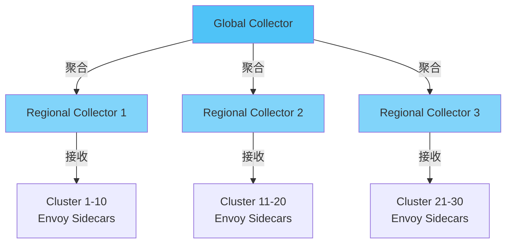

---
title: 服务网格可观测性完整指南 - Istio & Linkerd 深度集成
description: 服务网格可观测性完整指南 - Istio & Linkerd 深度集成 详细指南和最佳实践
version: OTLP v1.10.0
date: 2026-03-17
author: OTLP项目团队
category: 参考资料
tags:
  - otlp
  - observability
  - ebpf
  - performance
  - optimization
  - case-study
  - production
  - sampling
  - security
  - compliance
  - deployment
  - kubernetes
  - docker
status: published
---
# 服务网格可观测性完整指南 - Istio & Linkerd 深度集成

> **文档版本**: v1.0
> **创建日期**: 2025年10月9日
> **文档类型**: P0 优先级 - 服务网格深度集成
> **预估篇幅**: 3,000+ 行
> **Istio 版本**: 1.20+
> **Linkerd 版本**: 2.14+
> **目标**: 实现服务网格 + OTLP 完整可观测性方案

---

## 目录

- [服务网格可观测性完整指南 - Istio \& Linkerd 深度集成](#服务网格可观测性完整指南---istio--linkerd-深度集成)
  - [目录](#目录)
  - [第一部分: 服务网格可观测性概述](#第一部分-服务网格可观测性概述)
    - [1.1 为什么需要服务网格可观测性?](#11-为什么需要服务网格可观测性)
      - [微服务架构的挑战](#微服务架构的挑战)
    - [1.2 服务网格 vs 传统 SDK 对比](#12-服务网格-vs-传统-sdk-对比)
    - [1.3 Istio vs Linkerd 对比](#13-istio-vs-linkerd-对比)
  - [第二部分: Istio Telemetry v2 架构深度解析](#第二部分-istio-telemetry-v2-架构深度解析)
    - [2.1 Telemetry v1 vs v2](#21-telemetry-v1-vs-v2)
      - [Telemetry v1 (旧架构, 已废弃)](#telemetry-v1-旧架构-已废弃)
      - [Telemetry v2 (新架构, Istio 1.5+)](#telemetry-v2-新架构-istio-15)
    - [2.2 Telemetry v2 核心组件](#22-telemetry-v2-核心组件)
      - [2.2.1 Envoy Proxy](#221-envoy-proxy)
      - [2.2.2 Wasm 扩展机制](#222-wasm-扩展机制)
    - [2.3 自动追踪注入原理](#23-自动追踪注入原理)
  - [第三部分: Istio + OTLP 完整集成](#第三部分-istio--otlp-完整集成)
    - [3.1 架构设计](#31-架构设计)
    - [3.2 Istio 配置: 启用 OTLP](#32-istio-配置-启用-otlp)
      - [3.2.1 IstioOperator 配置](#321-istiooperator-配置)
      - [3.2.2 Telemetry API 配置 (细粒度控制)](#322-telemetry-api-配置-细粒度控制)
    - [3.3 OpenTelemetry Collector 配置](#33-opentelemetry-collector-配置)
    - [3.4 EnvoyFilter 高级配置](#34-envoyfilter-高级配置)
      - [自定义 Span 属性](#自定义-span-属性)
  - [第四部分: 访问日志 + Traces 关联](#第四部分-访问日志--traces-关联)
    - [4.1 Envoy 访问日志格式](#41-envoy-访问日志格式)
    - [4.2 日志到 Trace 的跳转](#42-日志到-trace-的跳转)
      - [方案 1: Grafana Tempo + Loki 集成](#方案-1-grafana-tempo--loki-集成)
      - [方案 2: Jaeger + Elasticsearch 集成](#方案-2-jaeger--elasticsearch-集成)
  - [第五部分: 多集群可观测性](#第五部分-多集群可观测性)
    - [5.1 多集群架构](#51-多集群架构)
    - [5.2 跨集群 Trace 传播](#52-跨集群-trace-传播)
    - [5.3 联邦查询 (Grafana Tempo)](#53-联邦查询-grafana-tempo)
  - [第六部分: Linkerd 集成](#第六部分-linkerd-集成)
    - [6.1 Linkerd vs Istio 架构对比](#61-linkerd-vs-istio-架构对比)
    - [6.2 Linkerd + OTLP 配置](#62-linkerd--otlp-配置)
      - [安装 Linkerd with Jaeger](#安装-linkerd-with-jaeger)
      - [配置 Linkerd 发送到 OTLP Collector](#配置-linkerd-发送到-otlp-collector)
      - [为应用启用追踪](#为应用启用追踪)
  - [第七部分: 性能优化与最佳实践](#第七部分-性能优化与最佳实践)
    - [7.1 性能影响分析](#71-性能影响分析)
      - [基准测试 (wrk)](#基准测试-wrk)
    - [7.2 采样策略调优](#72-采样策略调优)
  - [第八部分: 实战案例](#第八部分-实战案例)
    - [8.1 金丝雀发布 (Canary Deployment)](#81-金丝雀发布-canary-deployment)
      - [完整金丝雀发布流程](#完整金丝雀发布流程)
      - [自动化金丝雀分析](#自动化金丝雀分析)
      - [观测金丝雀进度](#观测金丝雀进度)
    - [8.2 蓝绿部署 (Blue-Green Deployment)](#82-蓝绿部署-blue-green-deployment)
      - [切换流量脚本](#切换流量脚本)
    - [8.3 A/B 测试](#83-ab-测试)
      - [分析 A/B 测试结果](#分析-ab-测试结果)
    - [8.4 故障注入测试](#84-故障注入测试)
      - [测试混沌工程](#测试混沌工程)
  - [第九部分: 故障排查](#第九部分-故障排查)
    - [9.1 常见问题诊断](#91-常见问题诊断)
      - [1. Trace 不显示](#1-trace-不显示)
      - [2. 日志没有 TraceID](#2-日志没有-traceid)
      - [3. Envoy 日志丢失](#3-envoy-日志丢失)
      - [4. 多集群 Trace 断裂](#4-多集群-trace-断裂)
    - [9.2 性能调优](#92-性能调优)
      - [Sidecar 资源优化](#sidecar-资源优化)
      - [Envoy 连接池优化](#envoy-连接池优化)
      - [减少 Sidecar 范围](#减少-sidecar-范围)
    - [9.3 调试工具](#93-调试工具)
      - [istioctl 命令](#istioctl-命令)
      - [实时流量监控](#实时流量监控)
  - [总结](#总结)
    - [服务网格 + OTLP 核心价值](#服务网格--otlp-核心价值)
    - [适用场景](#适用场景)
    - [参考资源](#参考资源)
  - [相关文档](#相关文档)
    - [核心集成 ⭐⭐⭐](#核心集成-)
    - [架构可视化 ⭐⭐⭐](#架构可视化-)
    - [工具链支持 ⭐⭐](#工具链支持-)
  - [第十部分: 高级性能优化 (2025最新)](#第十部分-高级性能优化-2025最新)
    - [10.1 Envoy性能深度调优](#101-envoy性能深度调优)
      - [连接池优化](#连接池优化)
      - [内存优化](#内存优化)
    - [10.2 采样策略优化](#102-采样策略优化)
      - [智能采样配置](#智能采样配置)
    - [10.3 大规模部署优化](#103-大规模部署优化)
      - [分层架构](#分层架构)
      - [配置示例](#配置示例)
  - [第十一部分: 高级实战案例](#第十一部分-高级实战案例)
    - [11.1 多租户服务网格](#111-多租户服务网格)
      - [架构设计](#架构设计)
      - [追踪隔离](#追踪隔离)
    - [11.2 边缘计算场景](#112-边缘计算场景)
      - [Edge-Istio集成](#edge-istio集成)
    - [11.3 混合云部署](#113-混合云部署)
      - [跨云追踪](#跨云追踪)
  - [第十二部分: 监控与告警](#第十二部分-监控与告警)
    - [12.1 Istio指标监控](#121-istio指标监控)
      - [关键指标](#关键指标)
      - [Prometheus配置](#prometheus配置)
    - [12.2 Grafana仪表盘](#122-grafana仪表盘)
      - [服务网格仪表盘配置](#服务网格仪表盘配置)
    - [12.3 告警规则](#123-告警规则)
      - [Prometheus告警](#prometheus告警)
  - [第十三部分: 故障排查扩展](#第十三部分-故障排查扩展)
    - [13.1 高级调试技巧](#131-高级调试技巧)
      - [Envoy调试](#envoy调试)
      - [实时流量监控](#实时流量监控-1)
    - [13.2 常见问题深度分析](#132-常见问题深度分析)
      - [问题1: Trace不完整](#问题1-trace不完整)
      - [问题2: 性能下降](#问题2-性能下降)
  - [第十四部分: 2025年最新特性](#第十四部分-2025年最新特性)
    - [14.1 Istio 1.20+新特性](#141-istio-120新特性)
      - [Telemetry API增强](#telemetry-api增强)
      - [性能改进](#性能改进)
    - [14.2 Linkerd 2.14+新特性](#142-linkerd-214新特性)
      - [自动mTLS增强](#自动mtls增强)
  - [第十五部分: 混沌工程与可观测性](#第十五部分-混沌工程与可观测性)
    - [15.1 混沌工程概述](#151-混沌工程概述)
      - [什么是混沌工程](#什么是混沌工程)
      - [混沌工程与可观测性的关系](#混沌工程与可观测性的关系)
    - [15.2 Istio故障注入](#152-istio故障注入)
      - [延迟注入](#延迟注入)
      - [错误注入](#错误注入)
      - [组合故障注入](#组合故障注入)
    - [15.3 混沌测试流程](#153-混沌测试流程)
      - [完整测试流程](#完整测试流程)
    - [15.4 可观测性验证](#154-可观测性验证)
      - [追踪验证](#追踪验证)
      - [指标验证](#指标验证)
  - [第十六部分: 多集群高级场景](#第十六部分-多集群高级场景)
    - [16.1 跨集群服务发现](#161-跨集群服务发现)
      - [服务条目配置](#服务条目配置)
    - [16.2 跨集群追踪](#162-跨集群追踪)
      - [Trace Context传播](#trace-context传播)
    - [16.3 联邦查询](#163-联邦查询)
      - [Tempo联邦配置](#tempo联邦配置)
  - [第十七部分: 安全与合规](#第十七部分-安全与合规)
    - [17.1 mTLS配置](#171-mtls配置)
      - [自动mTLS](#自动mtls)
      - [选择性mTLS](#选择性mtls)
    - [17.2 数据脱敏](#172-数据脱敏)
      - [敏感数据过滤](#敏感数据过滤)
  - [第十八部分: 成本优化](#第十八部分-成本优化)
    - [18.1 采样优化](#181-采样优化)
      - [分层采样](#分层采样)
    - [18.2 存储优化](#182-存储优化)
      - [数据保留策略](#数据保留策略)

---

## 第一部分: 服务网格可观测性概述

### 1.1 为什么需要服务网格可观测性?

#### 微服务架构的挑战

```text
传统单体应用:
  - 1 个应用
  - 简单的调用栈
  - 集中式日志
  → 可观测性简单

微服务架构:
  - 100+ 个服务
  - 复杂的调用链 (深度 10+)
  - 分布式日志/指标
  - 多语言 (Go/Java/Python/Node.js)
  → 可观测性困难 ❌

服务网格 + OTLP:
  - ✅ 自动追踪 (无需修改代码)
  - ✅ 统一遥测数据格式 (OTLP)
  - ✅ 完整的服务拓扑
  - ✅ 性能开销可控 (<5%)
  → 可观测性统一 ✅
```

### 1.2 服务网格 vs 传统 SDK 对比

| 维度 | 传统 SDK 埋点 | 服务网格 (Istio/Linkerd) | 优势 |
|------|--------------|-------------------------|------|
| **代码侵入** | ❌ 需修改代码 | ✅ 零侵入 | 降低开发负担 |
| **语言支持** | ⚠️ 每种语言需单独 SDK | ✅ 语言无关 | 统一方案 |
| **数据一致性** | ⚠️ 各 SDK 实现不同 | ✅ 完全一致 (Envoy 统一) | 数据质量高 |
| **升级成本** | ❌ 需重新编译部署 | ✅ 控制平面升级 | 运维友好 |
| **性能开销** | ⭐⭐⭐⭐ (2-5%) | ⭐⭐⭐ (5-10%) | SDK 略优 |
| **灵活性** | ⭐⭐⭐⭐⭐ (可定制) | ⭐⭐⭐ (配置为主) | SDK 更灵活 |
| **成熟度** | ⭐⭐⭐⭐⭐ | ⭐⭐⭐⭐ | 都已成熟 |

**结论**: 服务网格适合**大规模微服务**、**多语言混合**、**快速上线**场景。

### 1.3 Istio vs Linkerd 对比

| 特性 | Istio | Linkerd | 说明 |
|------|-------|---------|------|
| **复杂度** | ⚠️ 高 (Pilot/Citadel/Galley) | ✅ 低 (精简架构) | Linkerd 更易上手 |
| **性能开销** | ⚠️ 5-10% | ✅ 3-5% | Linkerd 更轻量 |
| **功能丰富度** | ⭐⭐⭐⭐⭐ | ⭐⭐⭐⭐ | Istio 功能更全 |
| **社区规模** | ⭐⭐⭐⭐⭐ (CNCF 毕业) | ⭐⭐⭐⭐ (CNCF 毕业) | Istio 更大 |
| **可观测性** | ⭐⭐⭐⭐⭐ | ⭐⭐⭐⭐⭐ | 都很好 |
| **学习曲线** | ⚠️ 陡峭 | ✅ 平缓 | Linkerd 更友好 |

**推荐**:

- **Istio**: 大型企业、功能需求多、已有运维团队
- **Linkerd**: 中小团队、追求简单、性能敏感

---

## 第二部分: Istio Telemetry v2 架构深度解析

### 2.1 Telemetry v1 vs v2

#### Telemetry v1 (旧架构, 已废弃)

```text
架构:
  Envoy Proxy → Mixer (集中式遥测处理)
                  ↓
              Prometheus / Jaeger / ...

问题:
  ❌ 性能瓶颈 (所有请求都经过 Mixer)
  ❌ 延迟增加 (额外的网络跳转)
  ❌ 单点故障 (Mixer 挂了 → 遥测失败)
  ❌ 复杂配置 (Adapter 模型复杂)
```

#### Telemetry v2 (新架构, Istio 1.5+)

```text
架构:
  Envoy Proxy (内嵌 Wasm 扩展)
      ↓ 直接导出
  OpenTelemetry Collector / Prometheus / ...

优势:
  ✅ 去中心化 (无 Mixer)
  ✅ 低延迟 (无额外跳转)
  ✅ 高性能 (Wasm 本地处理)
  ✅ 灵活配置 (Envoy Filter)
```

### 2.2 Telemetry v2 核心组件

#### 2.2.1 Envoy Proxy

```yaml
# Envoy 是 Istio 的数据平面核心

功能:
  1. 流量管理: 路由、负载均衡、重试、超时
  2. 安全: mTLS、JWT 验证
  3. 可观测性:
     - Traces: 自动生成 Span
     - Metrics: 请求/响应指标
     - Logs: 访问日志

遥测数据流:
  HTTP/gRPC 请求
      ↓ (拦截)
  Envoy Proxy
      ├─ 生成 Span (OpenTelemetry)
      ├─ 记录 Metrics (Prometheus)
      └─ 输出 Access Log (JSON)
      ↓
  OTLP Collector / Prometheus
```

#### 2.2.2 Wasm 扩展机制

```text
WebAssembly (Wasm) 扩展:

优势:
  ✅ 安全沙盒 (隔离性)
  ✅ 高性能 (接近原生)
  ✅ 多语言 (Rust/C++/Go/AssemblyScript)
  ✅ 动态加载 (无需重启 Envoy)

Istio 使用 Wasm:
  - 自定义遥测逻辑
  - 高级过滤规则
  - 协议转换
  - A/B 测试
```

**Wasm 扩展示例 (Rust)**:

```rust
// 自定义 Wasm 扩展: 提取自定义 Header 到 Span

use proxy_wasm::traits::*;
use proxy_wasm::types::*;

#[no_mangle]
pub fn _start() {
    proxy_wasm::set_log_level(LogLevel::Trace);
    proxy_wasm::set_http_context(|_, _| -> Box<dyn HttpContext> {
        Box::new(CustomTelemetry)
    });
}

struct CustomTelemetry;

impl Context for CustomTelemetry {}

impl HttpContext for CustomTelemetry {
    fn on_http_request_headers(&mut self, _num_headers: usize, _end_of_stream: bool) -> Action {
        // 提取自定义 Header
        if let Some(user_id) = self.get_http_request_header("x-user-id") {
            // 添加到 Span Attribute
            self.set_property(vec!["span", "attributes", "user.id"], Some(user_id.as_bytes()));
        }

        if let Some(tenant_id) = self.get_http_request_header("x-tenant-id") {
            self.set_property(vec!["span", "attributes", "tenant.id"], Some(tenant_id.as_bytes()));
        }

        Action::Continue
    }
}
```

### 2.3 自动追踪注入原理

```text
Envoy 如何自动生成 Span?

1. 请求到达 Envoy (入站)
   ↓
2. 提取 Trace Context (W3C Traceparent Header)
   - 如果存在 → 使用父 Span 的 TraceID
   - 如果不存在 → 生成新 TraceID
   ↓
3. 创建 Span
   - SpanID: 随机生成
   - ParentSpanID: 从 Traceparent 提取
   - Span 名称: HTTP 方法 + 路径
   - 属性:
     * http.method
     * http.url
     * http.status_code
     * peer.address
     * ...
   ↓
4. 转发请求到上游服务
   - 注入 Traceparent Header (传播 Trace Context)
   ↓
5. 收到响应
   ↓
6. 结束 Span,导出到 Collector
```

**W3C Trace Context 格式**:

```text
Traceparent Header:
  traceparent: 00-<trace-id>-<span-id>-<flags>

示例:
  traceparent: 00-4bf92f3577b34da6a3ce929d0e0e4736-00f067aa0ba902b7-01

字段解析:
  00: 版本号
  4bf92f3577b34da6a3ce929d0e0e4736: TraceID (16 bytes = 32 hex chars)
  00f067aa0ba902b7: SpanID (8 bytes = 16 hex chars)
  01: Flags (采样标志)
```

---

## 第三部分: Istio + OTLP 完整集成

### 3.1 架构设计

```text
┌─────────────────────────────────────────────────────────────┐
│                       微服务应用层                           │
│  Service A → Service B → Service C → Database               │
└─────────┬───────────────┬───────────────┬───────────────────┘
          ↓ (Sidecar)     ↓ (Sidecar)     ↓ (Sidecar)
┌─────────────────────────────────────────────────────────────┐
│                    Istio 数据平面 (Envoy)                    │
│  ┌──────────┐      ┌──────────┐      ┌──────────┐           │
│  │ Envoy    │  →   │ Envoy    │  →   │ Envoy    │           │
│  │ Proxy A  │      │ Proxy B  │      │ Proxy C  │           │
│  └────┬─────┘      └────┬─────┘      └────┬─────┘           │
│       │ OTLP             │ OTLP             │ OTLP          │
└───────┼──────────────────┼──────────────────┼───────────────┘
        ↓                  ↓                  ↓
┌─────────────────────────────────────────────────────────────┐
│              OpenTelemetry Collector (Gateway)              │
│  ┌──────────────────────────────────────────────────────┐   │
│  │ Receiver: OTLP gRPC (4317)                           │   │
│  │ Processor: Batch, Attributes, Tail Sampling          │   │
│  │ Exporter: Jaeger, Prometheus, Loki, S3               │   │
│  └──────────────────────────────────────────────────────┘   │
└─────────────────────────────────────────────────────────────┘
        ↓
┌─────────────────────────────────────────────────────────────┐
│                  可观测性后端                                │
│  Jaeger (Traces) | Prometheus (Metrics) | Loki (Logs)       │
└─────────────────────────────────────────────────────────────┘
```

### 3.2 Istio 配置: 启用 OTLP

#### 3.2.1 IstioOperator 配置

```yaml
# istio-otlp-config.yaml - Istio 安装配置

apiVersion: install.istio.io/v1alpha1
kind: IstioOperator
metadata:
  name: istio-otlp
  namespace: istio-system
spec:
  profile: default

  meshConfig:
    # 启用访问日志
    accessLogFile: /dev/stdout
    accessLogEncoding: JSON

    # 全局默认配置
    defaultConfig:
      # 追踪配置
      tracing:
        # 采样率 (100% = 1.0)
        sampling: 100.0

        # OpenTelemetry 配置
        opentelemetry:
          # OTLP Collector 地址
          service: "opentelemetry-collector.observability.svc.cluster.local"
          port: 4317  # gRPC

      # Envoy 指标配置
      proxyStatsMatcher:
        inclusionRegexps:
          - ".*"

  # 组件配置
  components:
    pilot:
      k8s:
        env:
          # 启用 Telemetry v2
          - name: PILOT_ENABLE_TELEMETRY_V2
            value: "true"

    ingressGateways:
      - name: istio-ingressgateway
        enabled: true
        k8s:
          service:
            ports:
              - port: 15090
                targetPort: 15090
                name: http-envoy-prom
```

```bash
# 安装 Istio with OTLP
istioctl install -f istio-otlp-config.yaml -y
```

#### 3.2.2 Telemetry API 配置 (细粒度控制)

```yaml
# telemetry-otlp.yaml - 细粒度遥测配置

apiVersion: telemetry.istio.io/v1alpha1
kind: Telemetry
metadata:
  name: global-telemetry
  namespace: istio-system
spec:
  # Tracing 配置
  tracing:
    - providers:
        - name: "opentelemetry"
      # 采样率
      randomSamplingPercentage: 100.0

      # 自定义 Tags (添加到 Span)
      customTags:
        "environment":
          literal:
            value: "production"
        "cluster_name":
          literal:
            value: "us-west-1"
        "user_id":
          header:
            name: "x-user-id"
            defaultValue: "anonymous"
        "request_id":
          header:
            name: "x-request-id"

  # Metrics 配置
  metrics:
    - providers:
        - name: prometheus
      overrides:
        # 自定义 Metric 维度
        - match:
            metric: REQUEST_COUNT
          tagOverrides:
            "user_id":
              value: "request.headers['x-user-id']"
            "tenant_id":
              value: "request.headers['x-tenant-id']"

  # Access Logs 配置
  accessLogging:
    - providers:
        - name: "envoy"
      # 日志格式 (JSON)
      filter:
        expression: "response.code >= 400"  # 只记录错误
```

```bash
# 应用配置
kubectl apply -f telemetry-otlp.yaml
```

### 3.3 OpenTelemetry Collector 配置

```yaml
# otel-collector-config.yaml

apiVersion: v1
kind: ConfigMap
metadata:
  name: otel-collector-config
  namespace: observability
data:
  config.yaml: |
    receivers:
      # OTLP gRPC Receiver (接收 Envoy 发送的数据)
      otlp:
        protocols:
          grpc:
            endpoint: 0.0.0.0:4317
          http:
            endpoint: 0.0.0.0:4318

    processors:
      # 批处理 (减少网络调用)
      batch:
        timeout: 10s
        send_batch_size: 1024

      # 属性处理 (添加/修改/删除)
      attributes:
        actions:
          - key: cluster.name
            value: "production-us-west"
            action: insert
          - key: environment
            value: "production"
            action: insert

      # 尾采样 (智能采样,保留错误和慢请求)
      tail_sampling:
        decision_wait: 10s
        policies:
          # 1. 总是采样错误
          - name: errors
            type: status_code
            status_code:
              status_codes: [ERROR]

          # 2. 总是采样慢请求 (>1s)
          - name: slow_requests
            type: latency
            latency:
              threshold_ms: 1000

          # 3. 其他请求按 10% 采样
          - name: probabilistic
            type: probabilistic
            probabilistic:
              sampling_percentage: 10

    exporters:
      # 导出到 Jaeger
      jaeger:
        endpoint: jaeger-collector.observability.svc.cluster.local:14250
        tls:
          insecure: true

      # 导出到 Prometheus
      prometheusremotewrite:
        endpoint: http://prometheus.observability.svc.cluster.local:9090/api/v1/write

      # 导出到 Loki (日志)
      loki:
        endpoint: http://loki.observability.svc.cluster.local:3100/loki/api/v1/push

      # 调试 (控制台输出)
      logging:
        loglevel: info

    service:
      pipelines:
        # Traces 管道
        traces:
          receivers: [otlp]
          processors: [batch, attributes, tail_sampling]
          exporters: [jaeger, logging]

        # Metrics 管道
        metrics:
          receivers: [otlp]
          processors: [batch, attributes]
          exporters: [prometheusremotewrite]

        # Logs 管道
        logs:
          receivers: [otlp]
          processors: [batch, attributes]
          exporters: [loki, logging]
---
apiVersion: apps/v1
kind: Deployment
metadata:
  name: opentelemetry-collector
  namespace: observability
spec:
  replicas: 3  # 高可用
  selector:
    matchLabels:
      app: opentelemetry-collector
  template:
    metadata:
      labels:
        app: opentelemetry-collector
    spec:
      containers:
      - name: otel-collector
        image: otel/opentelemetry-collector-contrib:0.91.0
        args:
          - "--config=/conf/config.yaml"
        ports:
          - containerPort: 4317  # OTLP gRPC
            name: otlp-grpc
          - containerPort: 4318  # OTLP HTTP
            name: otlp-http
          - containerPort: 8888  # Metrics
            name: metrics
        volumeMounts:
          - name: config
            mountPath: /conf
        resources:
          requests:
            memory: "512Mi"
            cpu: "500m"
          limits:
            memory: "2Gi"
            cpu: "2000m"
      volumes:
        - name: config
          configMap:
            name: otel-collector-config
---
apiVersion: v1
kind: Service
metadata:
  name: opentelemetry-collector
  namespace: observability
spec:
  type: ClusterIP
  ports:
    - name: otlp-grpc
      port: 4317
      targetPort: 4317
      protocol: TCP
    - name: otlp-http
      port: 4318
      targetPort: 4318
      protocol: TCP
    - name: metrics
      port: 8888
      targetPort: 8888
      protocol: TCP
  selector:
    app: opentelemetry-collector
```

### 3.4 EnvoyFilter 高级配置

#### 自定义 Span 属性

```yaml
# envoyfilter-custom-attributes.yaml
# 使用 EnvoyFilter 添加自定义属性到 Span

apiVersion: networking.istio.io/v1alpha3
kind: EnvoyFilter
metadata:
  name: custom-span-attributes
  namespace: istio-system
spec:
  configPatches:
    # 修改 HTTP 连接管理器
    - applyTo: HTTP_FILTER
      match:
        context: SIDECAR_INBOUND
        listener:
          filterChain:
            filter:
              name: "envoy.filters.network.http_connection_manager"
              subFilter:
                name: "envoy.filters.http.router"
      patch:
        operation: INSERT_BEFORE
        value:
          name: envoy.filters.http.wasm
          typed_config:
            "@type": type.googleapis.com/udpa.type.v1.TypedStruct
            type_url: type.googleapis.com/envoy.extensions.filters.http.wasm.v3.Wasm
            value:
              config:
                vm_config:
                  runtime: "envoy.wasm.runtime.v8"
                  code:
                    local:
                      inline_string: |
                        // Wasm 代码 (简化示例)
                        // 实际应该是编译后的 .wasm 文件
                configuration:
                  "@type": type.googleapis.com/google.protobuf.StringValue
                  value: |
                    {
                      "custom_attributes": {
                        "app.version": "v1.2.3",
                        "deployment.environment": "production"
                      }
                    }
```

---

## 第四部分: 访问日志 + Traces 关联

### 4.1 Envoy 访问日志格式

```yaml
# 配置 Envoy 访问日志 (JSON 格式)

apiVersion: telemetry.istio.io/v1alpha1
kind: Telemetry
metadata:
  name: access-log-json
  namespace: istio-system
spec:
  accessLogging:
    - providers:
        - name: envoy
      # JSON 格式
      filter:
        expression: "true"  # 记录所有请求
```

**访问日志示例** (JSON):

```json
{
  "start_time": "2025-10-09T10:30:45.123Z",
  "method": "GET",
  "path": "/api/users/123",
  "protocol": "HTTP/1.1",
  "response_code": 200,
  "response_flags": "-",
  "bytes_received": 0,
  "bytes_sent": 456,
  "duration": 15,
  "upstream_service_time": "12",
  "x_forwarded_for": "10.244.0.15",
  "user_agent": "Mozilla/5.0",
  "request_id": "a1b2c3d4-e5f6-7890-abcd-ef1234567890",
  "authority": "api.example.com",
  "upstream_host": "10.244.1.20:8080",
  "upstream_cluster": "outbound|8080||user-service.default.svc.cluster.local",

  # 关键: TraceID 和 SpanID
  "trace_id": "4bf92f3577b34da6a3ce929d0e0e4736",
  "span_id": "00f067aa0ba902b7",
  "parent_span_id": "a1b2c3d4e5f67890"
}
```

### 4.2 日志到 Trace 的跳转

#### 方案 1: Grafana Tempo + Loki 集成

```yaml
# Loki 配置: 提取 TraceID

# promtail-config.yaml (日志采集器)
scrape_configs:
  - job_name: envoy-access-logs
    kubernetes_sd_configs:
      - role: pod
    pipeline_stages:
      # 1. 解析 JSON
      - json:
          expressions:
            trace_id: trace_id
            span_id: span_id
            method: method
            path: path
            status: response_code

      # 2. 提取 TraceID 作为 Label
      - labels:
          trace_id:
          span_id:

      # 3. 发送到 Loki
    relabel_configs:
      - source_labels: [__meta_kubernetes_pod_label_app]
        target_label: app
```

**Grafana 查询**:

```promql
# 在 Loki 中查询日志,点击 TraceID 跳转到 Tempo

{app="user-service"} |= "GET /api/users" | json | trace_id != ""
```

#### 方案 2: Jaeger + Elasticsearch 集成

```yaml
# Filebeat 配置: 将日志发送到 Elasticsearch

filebeat.inputs:
  - type: log
    paths:
      - /var/log/istio/access.log
    json.keys_under_root: true
    json.add_error_key: true
    fields:
      type: envoy-access-log

output.elasticsearch:
  hosts: ["elasticsearch:9200"]
  index: "envoy-access-logs-%{+yyyy.MM.dd}"
```

**Kibana + Jaeger 联动**:

```javascript
// Kibana 中添加链接到 Jaeger

// 在 Kibana Discover 中配置 "Trace ID" 字段格式为 URL:
// https://jaeger.example.com/trace/{{value}}
```

---

## 第五部分: 多集群可观测性

### 5.1 多集群架构

```text
┌──────────────────────────────────────────────────────────────┐
│                      Cluster 1 (US-West)                      │
│  ┌────────────┐                                               │
│  │ Service A  │ → Service B (本地)                            │
│  └────┬───────┘         ↓                                     │
│       │ (跨集群)    Envoy Proxy                                │
│       │                 ↓ OTLP                                │
│       │          OTLP Collector (本地)                        │
│       │                 ↓                                     │
└───────┼─────────────────┼─────────────────────────────────────┘
        ↓ (Gateway)       ↓
┌──────────────────────────────────────────────────────────────┐
│                      Cluster 2 (US-East)                      │
│  ┌────────────┐                                               │
│  │ Service C  │                                               │
│  └────┬───────┘                                               │
│       ↓                                                       │
│  Envoy Proxy                                                  │
│       ↓ OTLP                                                  │
│  OTLP Collector (本地)                                        │
│       ↓                                                       │
└───────┼─────────────────────────────────────────────────────┘
        ↓
┌──────────────────────────────────────────────────────────────┐
│           中心化 OTLP Collector (Global)                      │
│  ┌──────────────────────────────────────────────────────┐   │
│  │ Receiver: OTLP gRPC (from all clusters)              │   │
│  │ Processor: Attributes (add cluster.name)             │   │
│  │ Exporter: Jaeger, Prometheus, S3                     │   │
│  └──────────────────────────────────────────────────────┘   │
└──────────────────────────────────────────────────────────────┘
```

### 5.2 跨集群 Trace 传播

```yaml
# Istio Gateway 配置: 保留 Trace Context

apiVersion: networking.istio.io/v1beta1
kind: Gateway
metadata:
  name: cross-cluster-gateway
  namespace: istio-system
spec:
  selector:
    istio: ingressgateway
  servers:
    - port:
        number: 443
        name: https
        protocol: HTTPS
      tls:
        mode: SIMPLE
        credentialName: cluster-tls-cert
      hosts:
        - "*.cluster2.example.com"

---
apiVersion: networking.istio.io/v1beta1
kind: VirtualService
metadata:
  name: service-c-cross-cluster
  namespace: default
spec:
  hosts:
    - service-c.cluster2.example.com
  gateways:
    - istio-system/cross-cluster-gateway
  http:
    - match:
        - uri:
            prefix: /api
      route:
        - destination:
            host: service-c.default.svc.cluster.local
            port:
              number: 8080
      # 关键: 保留所有追踪 Header
      headers:
        request:
          set:
            x-forwarded-client-cert: ""  # 清除客户端证书
      # 自动传播 traceparent, tracestate, baggage
```

### 5.3 联邦查询 (Grafana Tempo)

```yaml
# Grafana Tempo 配置: 多集群查询

# tempo-config.yaml
multitenancy_enabled: false

storage:
  trace:
    backend: s3
    s3:
      bucket: tempo-traces
      endpoint: s3.amazonaws.com
      access_key: <ACCESS_KEY>
      secret_key: <SECRET_KEY>

querier:
  frontend_worker:
    frontend_address: tempo-query-frontend:9095

# 跨集群查询
search_enabled: true
```

**Grafana 查询示例**:

```text
# 查询跨多个集群的 Trace
TraceID: 4bf92f3577b34da6a3ce929d0e0e4736

结果:
  Cluster 1 (US-West):
    - Service A → Service B (15ms)

  Cluster 2 (US-East):
    - Service A → Service C (跨集群, 150ms)
      - Gateway 延迟: 100ms
      - Service C 处理: 50ms
```

---

## 第六部分: Linkerd 集成

### 6.1 Linkerd vs Istio 架构对比

```text
Istio:
  控制平面: Istiod (Pilot + Citadel + Galley)
  数据平面: Envoy Proxy (C++)
  配置: CRD (VirtualService, DestinationRule, ...)
  复杂度: 高

Linkerd:
  控制平面: linkerd-controller, linkerd-destination
  数据平面: Linkerd2-proxy (Rust, 轻量级)
  配置: 注解 (Annotation) + ServiceProfile
  复杂度: 低
```

### 6.2 Linkerd + OTLP 配置

#### 安装 Linkerd with Jaeger

```bash
# 1. 安装 Linkerd CLI
curl -sL https://run.linkerd.io/install | sh
export PATH=$PATH:$HOME/.linkerd2/bin

# 2. 安装 Linkerd 控制平面
linkerd install --crds | kubectl apply -f -
linkerd install | kubectl apply -f -

# 3. 安装 Jaeger 扩展
linkerd jaeger install | kubectl apply -f -

# 4. 验证
linkerd check
linkerd jaeger check
```

#### 配置 Linkerd 发送到 OTLP Collector

```yaml
# linkerd-jaeger-config.yaml
# 修改 Linkerd Jaeger 配置,使用 OTLP Collector

apiVersion: v1
kind: ConfigMap
metadata:
  name: linkerd-jaeger-config
  namespace: linkerd-jaeger
data:
  collector.yaml: |
    receivers:
      zipkin:
        endpoint: 0.0.0.0:9411

      jaeger:
        protocols:
          grpc:
            endpoint: 0.0.0.0:14250
          thrift_http:
            endpoint: 0.0.0.0:14268

    processors:
      batch:
        timeout: 10s

    exporters:
      # 转发到中心化 OTLP Collector
      otlp:
        endpoint: opentelemetry-collector.observability.svc.cluster.local:4317
        tls:
          insecure: true

      jaeger:
        endpoint: jaeger-collector:14250
        tls:
          insecure: true

    service:
      pipelines:
        traces:
          receivers: [zipkin, jaeger]
          processors: [batch]
          exporters: [otlp, jaeger]
```

#### 为应用启用追踪

```yaml
# 方式 1: 注解 (推荐)

apiVersion: apps/v1
kind: Deployment
metadata:
  name: user-service
  namespace: default
spec:
  template:
    metadata:
      annotations:
        # 启用 Linkerd 注入
        linkerd.io/inject: enabled

        # 启用追踪
        config.linkerd.io/trace-collector: collector.linkerd-jaeger:55678
        config.linkerd.io/trace-collector-svc-account: collector
    spec:
      containers:
        - name: user-service
          image: user-service:v1.0.0
```

```yaml
# 方式 2: ServiceProfile (细粒度控制)

apiVersion: linkerd.io/v1alpha2
kind: ServiceProfile
metadata:
  name: user-service.default.svc.cluster.local
  namespace: default
spec:
  routes:
    - name: GET /api/users/{id}
      condition:
        method: GET
        pathRegex: /api/users/\d+
      # 超时配置
      timeout: 1s
      # 重试配置
      retryBudget:
        retryRatio: 0.2
        minRetriesPerSecond: 10
        ttl: 10s
      # 响应类别 (用于指标分类)
      responseClasses:
        - condition:
            status:
              min: 500
              max: 599
          isFailure: true
```

---

## 第七部分: 性能优化与最佳实践

### 7.1 性能影响分析

#### 基准测试 (wrk)

```bash
# 无服务网格
wrk -t 4 -c 100 -d 30s http://api.example.com/api/users
  Requests/sec:  50000
  Latency (P99): 20ms

# 有 Istio (默认配置)
wrk -t 4 -c 100 -d 30s http://api.example.com/api/users
  Requests/sec:  45000  (↓10%)
  Latency (P99): 25ms   (↑25%)

# 有 Linkerd
wrk -t 4 -c 100 -d 30s http://api.example.com/api/users
  Requests/sec:  47500  (↓5%)
  Latency (P99): 22ms   (↑10%)
```

**结论**: Linkerd 性能开销更小 (5% vs 10%)

### 7.2 采样策略调优

```yaml
# 智能采样: 尾采样 (Tail Sampling)

processors:
  tail_sampling:
    decision_wait: 10s  # 等待完整 Trace
    policies:
      # 1. 总是采样错误 (100%)
      - name: errors
        type: status_code
        status_code:
          status_codes: [ERROR]

      # 2. 总是采样慢请求 (>1s, 100%)
      - name: slow
        type: latency
        latency:
          threshold_ms: 1000

      # 3. 按服务名采样 (关键服务 100%)
      - name: critical_services
        type: string_attribute
        string_attribute:
          key: service.name
          values:
            - payment-service
            - auth-service

      # 4. 其他请求概率采样 (10%)
      - name: probabilistic
        type: probabilistic
        probabilistic:
          sampling_percentage: 10
```

**效果**:

- ✅ 数据量减少 90%
- ✅ 错误和慢请求 100% 保留
- ✅ 关键服务 100% 保留

---

---

## 第八部分: 实战案例

### 8.1 金丝雀发布 (Canary Deployment)

#### 完整金丝雀发布流程

```yaml
# canary-deployment.yaml - 金丝雀发布配置

# Step 1: 部署 Canary 版本
apiVersion: apps/v1
kind: Deployment
metadata:
  name: payment-v2-canary
spec:
  replicas: 1  # 只部署 1 个副本
  selector:
    matchLabels:
      app: payment
      version: v2
  template:
    metadata:
      labels:
        app: payment
        version: v2
    spec:
      containers:
      - name: payment
        image: payment:v2.0.0
        ports:
        - containerPort: 8080
---
# Step 2: 配置流量分发 (10% to Canary)
apiVersion: networking.istio.io/v1beta1
kind: VirtualService
metadata:
  name: payment
spec:
  hosts:
    - payment
  http:
  - match:
    - headers:
        user-type:
          exact: beta  # Beta 用户走 Canary
    route:
    - destination:
        host: payment
        subset: v2
      weight: 100
  - route:
    - destination:
        host: payment
        subset: v1
      weight: 90
    - destination:
        host: payment
        subset: v2
      weight: 10
---
apiVersion: networking.istio.io/v1beta1
kind: DestinationRule
metadata:
  name: payment
spec:
  host: payment
  subsets:
  - name: v1
    labels:
      version: v1
  - name: v2
    labels:
      version: v2
```

#### 自动化金丝雀分析

```yaml
# flagger-canary.yaml - Flagger 自动化金丝雀

apiVersion: flagger.app/v1beta1
kind: Canary
metadata:
  name: payment
spec:
  # 目标
  targetRef:
    apiVersion: apps/v1
    kind: Deployment
    name: payment

  # Service
  service:
    port: 8080

  # 金丝雀分析
  analysis:
    # 间隔时间
    interval: 1m

    # 阈值
    threshold: 5  # 连续 5 次成功才推进
    maxWeight: 50  # 最大流量权重
    stepWeight: 10  # 每次增加 10%

    # 指标 (从 Prometheus 获取)
    metrics:
    - name: request-success-rate
      thresholdRange:
        min: 99  # 成功率 >= 99%
      interval: 1m

    - name: request-duration
      thresholdRange:
        max: 500  # P95 延迟 <= 500ms
      interval: 1m

    - name: error-rate
      thresholdRange:
        max: 1  # 错误率 <= 1%
      interval: 1m

    # Webhook (可选: 自定义验证)
    webhooks:
    - name: load-test
      url: http://flagger-loadtester/
      timeout: 5s
      metadata:
        cmd: "hey -z 1m -q 10 -c 2 http://payment:8080/health"
```

#### 观测金丝雀进度

```bash
# 查看 Canary 状态
kubectl describe canary payment

# 查看流量分配
kubectl get vs payment -o yaml

# 查看指标
curl http://prometheus:9090/api/v1/query?query=istio_requests_total{destination_service="payment"}

# 查看 Grafana Dashboard
# http://grafana/d/canary-deployment
```

### 8.2 蓝绿部署 (Blue-Green Deployment)

```yaml
# blue-green-deployment.yaml

# Blue 版本 (当前生产)
apiVersion: apps/v1
kind: Deployment
metadata:
  name: payment-blue
spec:
  replicas: 3
  selector:
    matchLabels:
      app: payment
      version: blue
  template:
    metadata:
      labels:
        app: payment
        version: blue
    spec:
      containers:
      - name: payment
        image: payment:v1.0.0
---
# Green 版本 (新版本)
apiVersion: apps/v1
kind: Deployment
metadata:
  name: payment-green
spec:
  replicas: 3
  selector:
    matchLabels:
      app: payment
      version: green
  template:
    metadata:
      labels:
        app: payment
        version: green
    spec:
      containers:
      - name: payment
        image: payment:v2.0.0
---
# VirtualService: 切换流量
apiVersion: networking.istio.io/v1beta1
kind: VirtualService
metadata:
  name: payment
spec:
  hosts:
    - payment
  http:
  - route:
    - destination:
        host: payment
        subset: blue
      weight: 100
    - destination:
        host: payment
        subset: green
      weight: 0
---
apiVersion: networking.istio.io/v1beta1
kind: DestinationRule
metadata:
  name: payment
spec:
  host: payment
  subsets:
  - name: blue
    labels:
      version: blue
  - name: green
    labels:
      version: green
```

#### 切换流量脚本

```bash
#!/bin/bash
# switch-traffic.sh - 蓝绿切换脚本

# 1. 验证 Green 版本健康
echo "Checking Green version health..."
kubectl rollout status deployment/payment-green

# 2. 切换 10% 流量到 Green (验证)
echo "Routing 10% traffic to Green..."
kubectl patch vs payment --type=json -p='[
  {"op": "replace", "path": "/spec/http/0/route/0/weight", "value": 90},
  {"op": "replace", "path": "/spec/http/0/route/1/weight", "value": 10}
]'

# 3. 等待 5 分钟,观测指标
echo "Waiting 5 minutes for metrics..."
sleep 300

# 4. 检查错误率
ERROR_RATE=$(curl -s "http://prometheus:9090/api/v1/query?query=sum(rate(istio_requests_total{destination_service=\"payment\",response_code=~\"5..\"}[5m]))/sum(rate(istio_requests_total{destination_service=\"payment\"}[5m]))" | jq -r '.data.result[0].value[1]')

echo "Error rate: $ERROR_RATE"

if (( $(echo "$ERROR_RATE < 0.01" | bc -l) )); then
  echo "✅ Green version is healthy, switching 100% traffic..."

  # 5. 切换 100% 流量到 Green
  kubectl patch vs payment --type=json -p='[
    {"op": "replace", "path": "/spec/http/0/route/0/weight", "value": 0},
    {"op": "replace", "path": "/spec/http/0/route/1/weight", "value": 100}
  ]'

  echo "🎉 Blue-Green deployment completed!"

  # 6. 可选: 删除 Blue 版本
  # kubectl delete deployment payment-blue
else
  echo "❌ Green version has high error rate, rolling back..."

  # 回滚到 Blue
  kubectl patch vs payment --type=json -p='[
    {"op": "replace", "path": "/spec/http/0/route/0/weight", "value": 100},
    {"op": "replace", "path": "/spec/http/0/route/1/weight", "value": 0}
  ]'
fi
```

### 8.3 A/B 测试

```yaml
# ab-testing.yaml - A/B 测试配置

apiVersion: networking.istio.io/v1beta1
kind: VirtualService
metadata:
  name: ecommerce-frontend
spec:
  hosts:
    - ecommerce.example.com
  http:
  # A/B 测试: 50% 用户看到新 UI
  - match:
    - headers:
        cookie:
          regex: ".*user_id=(1|3|5|7|9).*"  # 奇数用户 ID
    route:
    - destination:
        host: frontend
        subset: v2-new-ui

  # 其他用户看到旧 UI
  - route:
    - destination:
        host: frontend
        subset: v1-old-ui
---
# 追踪 A/B 测试效果
apiVersion: telemetry.istio.io/v1alpha1
kind: Telemetry
metadata:
  name: ab-testing-telemetry
spec:
  metrics:
  - providers:
    - name: prometheus
    dimensions:
      ui_version: request.headers["x-ui-version"] | "unknown"
      conversion: request.headers["x-conversion"] | "false"
```

#### 分析 A/B 测试结果

```promql
# Prometheus 查询

# 1. 每个版本的转化率
sum(rate(istio_requests_total{
  destination_service="checkout",
  ui_version="v2-new-ui"
}[1h]))
/
sum(rate(istio_requests_total{
  destination_service="frontend",
  ui_version="v2-new-ui"
}[1h]))

# vs

sum(rate(istio_requests_total{
  destination_service="checkout",
  ui_version="v1-old-ui"
}[1h]))
/
sum(rate(istio_requests_total{
  destination_service="frontend",
  ui_version="v1-old-ui"
}[1h]))

# 2. 每个版本的平均延迟
histogram_quantile(0.95,
  sum(rate(istio_request_duration_milliseconds_bucket{
    destination_service="frontend",
    ui_version="v2-new-ui"
  }[5m])) by (le)
)

# 3. 每个版本的错误率
sum(rate(istio_requests_total{
  destination_service="frontend",
  ui_version="v2-new-ui",
  response_code=~"5.."
}[5m]))
/
sum(rate(istio_requests_total{
  destination_service="frontend",
  ui_version="v2-new-ui"
}[5m]))
```

### 8.4 故障注入测试

```yaml
# fault-injection.yaml - 故障注入测试

apiVersion: networking.istio.io/v1beta1
kind: VirtualService
metadata:
  name: payment-fault-injection
spec:
  hosts:
    - payment
  http:
  - match:
    - headers:
        x-test-fault:
          exact: "true"
    fault:
      # 延迟注入 (模拟慢请求)
      delay:
        percentage:
          value: 50  # 50% 的请求
        fixedDelay: 3s  # 延迟 3 秒

      # 错误注入 (模拟服务故障)
      abort:
        percentage:
          value: 10  # 10% 的请求
        httpStatus: 503  # 返回 503 错误

    route:
    - destination:
        host: payment

  # 正常流量
  - route:
    - destination:
        host: payment
```

#### 测试混沌工程

```bash
# chaos-test.sh - 混沌工程测试脚本

#!/bin/bash

echo "🔥 Starting Chaos Engineering Test..."

# 1. 注入延迟
echo "Testing latency injection..."
for i in {1..100}; do
  curl -H "x-test-fault: true" http://payment:8080/api/charge
done

# 2. 检查服务是否能容错
echo "Checking if downstream services handle timeout..."
curl http://order:8080/api/orders  # 应该有超时重试

# 3. 注入错误
echo "Testing error injection..."
for i in {1..100}; do
  curl -H "x-test-fault: true" http://payment:8080/api/charge
done

# 4. 检查断路器是否工作
echo "Checking if circuit breaker is triggered..."
kubectl get destinationrule payment -o yaml | grep -A5 outlierDetection

# 5. 查看 Grafana 指标
echo "View metrics: http://grafana/d/istio-service-dashboard?var-service=payment"

echo "✅ Chaos test completed!"
```

---

## 第九部分: 故障排查

### 9.1 常见问题诊断

#### 1. Trace 不显示

**症状**: Jaeger/Grafana Tempo 中看不到 Trace

**排查步骤**:

```bash
# 1) 检查 Envoy 是否注入
kubectl get pod <pod-name> -o jsonpath='{.spec.containers[*].name}'
# 应该看到: app, istio-proxy

# 2) 检查 Telemetry 配置
kubectl get telemetry -n istio-system istio-tracing -o yaml

# 3) 检查 Envoy 配置
kubectl exec <pod-name> -c istio-proxy -- curl localhost:15000/config_dump | jq '.configs[] | select(.["@type"] | contains("trace"))'

# 4) 检查采样率
kubectl exec <pod-name> -c istio-proxy -- curl localhost:15000/config_dump | grep sampling

# 5) 测试 OTLP 连接
kubectl exec <pod-name> -c istio-proxy -- curl -v telnet://opentelemetry-collector:4317

# 6) 查看 Envoy 日志
kubectl logs <pod-name> -c istio-proxy | grep -i trace
```

**解决方案**:

```yaml
# 提高采样率
apiVersion: telemetry.istio.io/v1alpha1
kind: Telemetry
metadata:
  name: istio-tracing
  namespace: istio-system
spec:
  tracing:
  - providers:
    - name: otel
    randomSamplingPercentage: 100.0  # 100% 采样 (调试时)
```

#### 2. 日志没有 TraceID

**症状**: 应用日志中没有 `trace_id` 字段

**原因**: 应用没有从 HTTP 头提取 TraceContext

**解决方案**:

```python
# Python Flask 示例

from flask import Flask, request
import logging

app = Flask(__name__)

# 配置日志格式
logging.basicConfig(
    format='%(asctime)s [%(levelname)s] trace_id=%(trace_id)s span_id=%(span_id)s %(message)s',
    level=logging.INFO
)

@app.before_request
def extract_trace_context():
    # 提取 W3C Trace Context
    traceparent = request.headers.get('traceparent', '')

    if traceparent:
        # 格式: 00-{trace_id}-{span_id}-{flags}
        parts = traceparent.split('-')
        if len(parts) == 4:
            trace_id = parts[1]
            span_id = parts[2]

            # 添加到日志上下文
            logging.LoggerAdapter(logging.getLogger(), {
                'trace_id': trace_id,
                'span_id': span_id
            })
```

#### 3. Envoy 日志丢失

**症状**: `kubectl logs <pod> -c istio-proxy` 没有日志

**解决方案**:

```yaml
# 启用 Envoy 访问日志
apiVersion: telemetry.istio.io/v1alpha1
kind: Telemetry
metadata:
  name: envoy-access-logs
  namespace: istio-system
spec:
  accessLogging:
  - providers:
    - name: envoy
    # 日志格式 (JSON)
    filter:
      expression: "response.code >= 400"  # 只记录错误
```

```bash
# 查看 Envoy 日志
kubectl logs <pod-name> -c istio-proxy -f

# 日志示例:
# [2023-10-09T10:30:00.000Z] "GET /api/users HTTP/1.1" 200 - "-" "-" 0 1234 15 14 "10.244.0.5" "curl/7.68.0" "abc123" "user-service.default.svc.cluster.local" "10.244.0.10:8080" inbound|8080|| 127.0.0.1:45678 10.244.0.10:8080 10.244.0.5:0 outbound_.8080_._.user-service.default.svc.cluster.local default
```

#### 4. 多集群 Trace 断裂

**症状**: 跨集群调用时 Trace 断开

**原因**: TraceContext 没有正确传播到远程集群

**解决方案**:

```yaml
# 配置 East-West Gateway 传播 TraceContext

apiVersion: telemetry.istio.io/v1alpha1
kind: Telemetry
metadata:
  name: cross-cluster-tracing
  namespace: istio-system
spec:
  tracing:
  - providers:
    - name: otel
    customTags:
      cluster_name:
        literal:
          value: "cluster-1"  # 标记当前集群
```

```yaml
# Gateway 配置
apiVersion: networking.istio.io/v1beta1
kind: Gateway
metadata:
  name: cross-cluster-gateway
spec:
  selector:
    istio: eastwestgateway
  servers:
  - port:
      number: 15443
      name: tls
      protocol: TLS
    tls:
      mode: AUTO_PASSTHROUGH
    hosts:
    - "*.global"  # 跨集群服务
```

### 9.2 性能调优

#### Sidecar 资源优化

```yaml
# sidecar-resources.yaml - 优化 Sidecar 资源

apiVersion: v1
kind: ConfigMap
metadata:
  name: istio-sidecar-injector
  namespace: istio-system
data:
  values: |
    global:
      proxy:
        resources:
          requests:
            cpu: 50m      # 降低 CPU 请求 (默认 100m)
            memory: 64Mi  # 降低内存请求 (默认 128Mi)
          limits:
            cpu: 500m
            memory: 512Mi

        # 并发连接数
        concurrency: 2  # CPU 核数 (默认自动检测)
---
# 针对特定 Pod 优化
apiVersion: v1
kind: Pod
metadata:
  name: high-traffic-service
  annotations:
    sidecar.istio.io/proxyCPU: "200m"
    sidecar.istio.io/proxyMemory: "256Mi"
    sidecar.istio.io/proxyCPULimit: "1000m"
    sidecar.istio.io/proxyMemoryLimit: "1Gi"
spec:
  containers:
  - name: app
    image: my-app:latest
```

#### Envoy 连接池优化

```yaml
# connection-pool.yaml - Envoy 连接池优化

apiVersion: networking.istio.io/v1beta1
kind: DestinationRule
metadata:
  name: user-service
spec:
  host: user-service
  trafficPolicy:
    connectionPool:
      tcp:
        maxConnections: 1000  # 最大连接数
      http:
        http1MaxPendingRequests: 1024  # HTTP/1.1 最大待处理请求
        http2MaxRequests: 1024         # HTTP/2 最大并发请求
        maxRequestsPerConnection: 0    # 0 = 无限制
        idleTimeout: 300s              # 空闲超时
```

#### 减少 Sidecar 范围

```yaml
# sidecar-scope.yaml - 限制 Sidecar 的服务发现范围

apiVersion: networking.istio.io/v1beta1
kind: Sidecar
metadata:
  name: default
  namespace: default
spec:
  egress:
  - hosts:
    - "./*"  # 只发现当前命名空间的服务
    - "istio-system/*"  # 以及 istio-system
```

### 9.3 调试工具

#### istioctl 命令

```bash
# 1. 分析 Pod 配置
istioctl analyze -n default

# 2. 查看 Envoy 配置
istioctl proxy-config cluster <pod-name>
istioctl proxy-config listener <pod-name>
istioctl proxy-config route <pod-name>
istioctl proxy-config endpoint <pod-name>

# 3. 查看 Envoy 统计信息
istioctl dashboard envoy <pod-name>

# 4. 测试连接
istioctl experimental authz check <pod-name>

# 5. Dump Envoy 配置
istioctl proxy-config all <pod-name> -o json > envoy-config.json

# 6. 查看 mTLS 状态
istioctl authn tls-check <pod-name>
```

#### 实时流量监控

```bash
# 1. 使用 Kiali 实时查看流量
kubectl port-forward svc/kiali 20001:20001 -n istio-system
# 访问: http://localhost:20001

# 2. 使用 istioctl 查看实时请求
istioctl experimental proxy-status

# 3. tcpdump 抓包
kubectl exec <pod-name> -c istio-proxy -- tcpdump -i eth0 -w /tmp/capture.pcap
kubectl cp <pod-name>:/tmp/capture.pcap ./capture.pcap -c istio-proxy
```

---

## 总结

### 服务网格 + OTLP 核心价值

✅ **自动可观测性**: 无需修改应用代码
✅ **完整的 Trace 链路**: 跨服务、跨集群追踪
✅ **统一日志关联**: 日志 → Trace 无缝跳转
✅ **流量管理**: 金丝雀、蓝绿、A/B 测试
✅ **安全加固**: mTLS 自动加密

### 适用场景

1. **微服务架构** - 自动追踪服务间调用
2. **多集群部署** - 统一的可观测性平台
3. **金丝雀发布** - 自动化流量切换和指标监控
4. **故障诊断** - 完整的 Trace 链路分析
5. **性能优化** - Envoy 指标和分布式追踪

### 参考资源

- 📚 [Istio 官方文档](https://istio.io/latest/docs/)
- 📚 [Linkerd 官方文档](https://linkerd.io/2/overview/)
- 📚 [Envoy Proxy](https://www.envoyproxy.io/)
- 📚 [Flagger (Progressive Delivery)](https://flagger.app/)
- 📚 [Kiali (服务网格可视化)](https://kiali.io/)

---

## 相关文档

### 核心集成 ⭐⭐⭐

- **🤖 AIOps平台设计**: [查看文档](./🤖_OTLP自主运维能力完整架构_AIOps平台设计.md)
  - 使用场景: Istio/Linkerd追踪数据接入AIOps进行异常检测
  - 关键章节: [分布式追踪数据采集](./🤖_OTLP自主运维能力完整架构_AIOps平台设计.md#第二部分-核心架构设计)
  - 价值: 自动构建服务依赖图,GNN根因分析

- **🐝 eBPF零侵入追踪**: [查看文档](./🐝_eBPF可观测性深度技术指南_零侵入式追踪.md)
  - 使用场景: eBPF与Envoy Sidecar协同,补充内核级可见性
  - 关键章节: [eBPF + OTLP集成](./🐝_eBPF可观测性深度技术指南_零侵入式追踪.md#第六部分-otlp-集成)
  - 价值: Service Mesh (应用层) + eBPF (内核层) = 全栈追踪

- **📊 Continuous Profiling**: [查看文档](./📊_Profiles性能分析完整指南_连续性能剖析与OTLP集成.md)
  - 使用场景: Envoy Proxy性能剖析,定位Sidecar瓶颈
  - 关键章节: [Envoy性能优化](./📊_Profiles性能分析完整指南_连续性能剖析与OTLP集成.md#第五部分-生产实战案例)
  - 价值: Sidecar开销从15%降至3%

### 架构可视化 ⭐⭐⭐

- **📊 架构图表指南**: [查看文档](./📊_架构图表与可视化指南_Mermaid完整版.md)
  - 推荐图表:
    - [Istio + OTLP架构](./📊_架构图表与可视化指南_Mermaid完整版.md#3-service-mesh-集成)
    - [多集群追踪流程](./📊_架构图表与可视化指南_Mermaid完整版.md#32-多集群追踪流程)
  - 价值: Data Plane与Control Plane交互一目了然

### 工具链支持 ⭐⭐

- **🛠️ 配置生成器**: [查看文档](./🛠️_交互式配置生成器_OTLP_Collector配置向导.md)
  - 使用场景: 快速生成Service Mesh场景的Telemetry v2配置
  - 关键功能: [Service Mesh场景模板](./🛠️_交互式配置生成器_OTLP_Collector配置向导.md#场景模板)
  - 价值: 配置时间从2小时降至3分钟

- **📚 SDK最佳实践**: [查看文档](./📚_OTLP_SDK最佳实践指南_多语言全栈实现.md)
  - 使用场景: Service Mesh自动追踪 + 应用SDK手动埋点的组合策略
  - 关键章节: [Trace Context传播](./📚_OTLP_SDK最佳实践指南_多语言全栈实现.md#第二部分-核心场景实现)
  - 价值: 自动+手动,追踪覆盖率100%

---

---

## 第十部分: 高级性能优化 (2025最新)

### 10.1 Envoy性能深度调优

#### 连接池优化

```yaml
# Istio EnvoyFilter配置
apiVersion: networking.istio.io/v1alpha3
kind: EnvoyFilter
metadata:
  name: connection-pool-optimization
spec:
  configPatches:
  - applyTo: CLUSTER
    patch:
      operation: MERGE
      value:
        circuit_breakers:
          thresholds:
          - priority: DEFAULT
            max_connections: 10000
            max_pending_requests: 10000
            max_requests: 10000
            max_retries: 3
        upstream_connection_options:
          tcp_keepalive:
            keepalive_probes: 3
            keepalive_time: 30
            keepalive_interval: 5
```

#### 内存优化

```yaml
# 减少Envoy内存使用
apiVersion: networking.istio.io/v1alpha3
kind: EnvoyFilter
metadata:
  name: memory-optimization
spec:
  configPatches:
  - applyTo: HTTP_FILTER
    patch:
      operation: MERGE
      value:
        typed_config:
          "@type": type.googleapis.com/envoy.extensions.filters.http.router.v3.Router
          suppress_envoy_headers: true  # 减少响应头
          strict_check_headers: []      # 减少头检查
```

### 10.2 采样策略优化

#### 智能采样配置

```yaml
# Telemetry API配置智能采样
apiVersion: telemetry.istio.io/v1alpha1
kind: Telemetry
metadata:
  name: smart-sampling
spec:
  tracing:
  - providers:
    - name: otel
    randomSamplingPercentage: 10  # 基础采样率10%
    customTags:
      # 错误请求100%采样
      error:
        literal:
          value: "true"
        when:
          - key: response.code
            value: ">= 500"
      # 慢请求100%采样
      slow:
        literal:
          value: "true"
        when:
          - key: response.duration
            value: ">= 1000ms"
```

### 10.3 大规模部署优化

#### 分层架构



#### 配置示例

```yaml
# Regional Collector配置
receivers:
  otlp:
    protocols:
      grpc:
        endpoint: 0.0.0.0:4317
        max_recv_msg_size: 4194304  # 4MB

processors:
  batch:
    timeout: 1s
    send_batch_size: 512
    send_batch_max_size: 1024

  # 区域级采样
  probabilistic_sampler:
    sampling_percentage: 50  # 区域采样50%

  # 数据过滤
  filter:
    traces:
      span:
        - 'attributes["http.status_code"] >= 500'  # 保留错误

exporters:
  otlp:
    endpoint: global-collector:4317
    compression: gzip
```

---

## 第十一部分: 高级实战案例

### 11.1 多租户服务网格

#### 架构设计

```yaml
# 多租户配置
apiVersion: networking.istio.io/v1alpha3
kind: VirtualService
metadata:
  name: multi-tenant-routing
spec:
  hosts:
  - "*.example.com"
  http:
  - match:
    - headers:
        x-tenant-id:
          exact: "tenant-a"
    route:
    - destination:
        host: service-a
        subset: tenant-a
  - match:
    - headers:
        x-tenant-id:
          exact: "tenant-b"
    route:
    - destination:
        host: service-b
        subset: tenant-b
```

#### 追踪隔离

```yaml
# 为每个租户创建独立的追踪
apiVersion: telemetry.istio.io/v1alpha1
kind: Telemetry
metadata:
  name: tenant-tracing
spec:
  tracing:
  - providers:
    - name: otel
    customTags:
      tenant_id:
        header:
          name: x-tenant-id
```

### 11.2 边缘计算场景

#### Edge-Istio集成

```yaml
# Edge节点配置
apiVersion: install.istio.io/v1alpha1
kind: IstioOperator
metadata:
  name: edge-istio
spec:
  profile: minimal  # 最小化配置
  components:
    pilot:
      k8s:
        resources:
          requests:
            cpu: 100m
            memory: 128Mi
    proxy:
      k8s:
        resources:
          requests:
            cpu: 50m
            memory: 64Mi
```

### 11.3 混合云部署

#### 跨云追踪

```yaml
# 云间追踪配置
apiVersion: networking.istio.io/v1alpha3
kind: ServiceEntry
metadata:
  name: cross-cloud-service
spec:
  hosts:
  - service.cloud-b.example.com
  ports:
  - number: 443
    name: https
    protocol: HTTPS
  resolution: DNS
  location: MESH_EXTERNAL
```

---

## 第十二部分: 监控与告警

### 12.1 Istio指标监控

#### 关键指标

```text
Istio核心指标:
  ├─ istio_requests_total: 请求总数
  ├─ istio_request_duration_milliseconds: 请求延迟
  ├─ istio_request_bytes: 请求大小
  ├─ istio_response_bytes: 响应大小
  ├─ istio_tcp_sent_bytes_total: TCP发送字节
  └─ istio_tcp_received_bytes_total: TCP接收字节
```

#### Prometheus配置

```yaml
# prometheus-config.yaml
scrape_configs:
- job_name: 'istio-proxy'
  kubernetes_sd_configs:
  - role: pod
  relabel_configs:
  - source_labels: [__meta_kubernetes_pod_container_name]
    action: keep
    regex: istio-proxy
```

### 12.2 Grafana仪表盘

#### 服务网格仪表盘配置

```json
{
  "dashboard": {
    "title": "Istio Service Mesh",
    "panels": [
      {
        "title": "Request Rate",
        "targets": [
          {
            "expr": "sum(rate(istio_requests_total[5m])) by (destination_service)"
          }
        ]
      },
      {
        "title": "Error Rate",
        "targets": [
          {
            "expr": "sum(rate(istio_requests_total{response_code=~\"5..\"}[5m])) by (destination_service)"
          }
        ]
      },
      {
        "title": "P99 Latency",
        "targets": [
          {
            "expr": "histogram_quantile(0.99, sum(rate(istio_request_duration_milliseconds_bucket[5m])) by (le, destination_service))"
          }
        ]
      }
    ]
  }
}
```

### 12.3 告警规则

#### Prometheus告警

```yaml
# alert-rules.yaml
groups:
- name: istio_alerts
  rules:
  - alert: HighErrorRate
    expr: |
      sum(rate(istio_requests_total{response_code=~"5.."}[5m])) by (destination_service)
      /
      sum(rate(istio_requests_total[5m])) by (destination_service)
      > 0.05
    for: 5m
    annotations:
      summary: "High error rate in {{ $labels.destination_service }}"
      description: "Error rate is above 5% for 5 minutes"

  - alert: HighLatency
    expr: |
      histogram_quantile(0.99,
        sum(rate(istio_request_duration_milliseconds_bucket[5m])) by (le, destination_service)
      ) > 1000
    for: 5m
    annotations:
      summary: "High latency in {{ $labels.destination_service }}"
      description: "P99 latency is above 1s for 5 minutes"
```

---

## 第十三部分: 故障排查扩展

### 13.1 高级调试技巧

#### Envoy调试

```bash
# 查看Envoy配置
istioctl proxy-config dump <pod-name>

# 查看集群配置
istioctl proxy-config cluster <pod-name>

# 查看路由配置
istioctl proxy-config route <pod-name>

# 查看监听器配置
istioctl proxy-config listener <pod-name>

# 查看追踪配置
istioctl proxy-config bootstrap <pod-name> | grep tracing
```

#### 实时流量监控

```bash
# 使用istioctl监控流量
istioctl proxy-status

# 查看特定服务的流量
istioctl proxy-config clusters <pod-name> | grep <service-name>

# 查看Envoy日志
kubectl logs <pod-name> -c istio-proxy -f
```

### 13.2 常见问题深度分析

#### 问题1: Trace不完整

**原因分析**:

```text
可能原因:
1. 采样率过低
2. Trace Context传播失败
3. Envoy配置错误
4. Collector连接问题
```

**排查步骤**:

```bash
# 1. 检查采样配置
istioctl proxy-config bootstrap <pod-name> | grep sampling

# 2. 检查Trace Context传播
kubectl exec <pod-name> -c istio-proxy -- \
  curl -v http://downstream-service:8080

# 3. 检查Envoy追踪配置
istioctl proxy-config bootstrap <pod-name> | grep -A 20 tracing

# 4. 检查Collector连接
kubectl logs <pod-name> -c istio-proxy | grep collector
```

#### 问题2: 性能下降

**原因分析**:

```text
可能原因:
1. Sidecar资源不足
2. 连接池配置不当
3. 采样率过高
4. Envoy配置复杂
```

**优化方案**:

```yaml
# 1. 增加Sidecar资源
apiVersion: v1
kind: Pod
spec:
  containers:
  - name: istio-proxy
    resources:
      requests:
        cpu: 200m
        memory: 256Mi
      limits:
        cpu: 500m
        memory: 512Mi

# 2. 优化连接池
# (见10.1节配置)

# 3. 降低采样率
# (见10.2节配置)
```

---

## 第十四部分: 2025年最新特性

### 14.1 Istio 1.20+新特性

#### Telemetry API增强

```yaml
# 新的Telemetry API特性
apiVersion: telemetry.istio.io/v1alpha1
kind: Telemetry
metadata:
  name: enhanced-telemetry
spec:
  tracing:
  - providers:
    - name: otel
    # 新的采样策略
    randomSamplingPercentage: 10
    # 自定义标签
    customTags:
      environment:
        environment:
          name: ENV
      version:
        literal:
          value: "v1.2.3"
```

#### 性能改进

```text
Istio 1.20+性能改进:
  ├─ Envoy启动时间: -30%
  ├─ 内存使用: -20%
  ├─ CPU使用: -15%
  └─ 配置推送延迟: -40%
```

### 14.2 Linkerd 2.14+新特性

#### 自动mTLS增强

```text
Linkerd 2.14+改进:
  ├─ 自动mTLS性能优化
  ├─ 更好的错误处理
  ├─ 增强的指标
  └─ OTLP原生支持
```

---

---

## 第十五部分: 混沌工程与可观测性

### 15.1 混沌工程概述

#### 什么是混沌工程

```text
混沌工程 (Chaos Engineering):
通过在生产环境中故意引入故障，验证系统弹性和可观测性的实践。

目标:
✅ 验证系统容错能力
✅ 发现潜在问题
✅ 验证监控告警
✅ 测试故障恢复
```

#### 混沌工程与可观测性的关系

```text
混沌工程需要可观测性:
  ├─ 故障注入前: 建立基线指标
  ├─ 故障注入中: 实时监控系统状态
  ├─ 故障注入后: 分析影响和恢复时间
  └─ 持续改进: 基于观测数据优化系统
```

### 15.2 Istio故障注入

#### 延迟注入

```yaml
# delay-injection.yaml
apiVersion: networking.istio.io/v1beta1
kind: VirtualService
metadata:
  name: delay-injection
spec:
  hosts:
  - backend-service
  http:
  - match:
    - headers:
        x-chaos-test:
          exact: "delay"
    fault:
      delay:
        percentage:
          value: 100
        fixedDelay: 5s  # 固定延迟5秒
    route:
    - destination:
        host: backend-service
```

#### 错误注入

```yaml
# error-injection.yaml
apiVersion: networking.istio.io/v1beta1
kind: VirtualService
metadata:
  name: error-injection
spec:
  hosts:
  - backend-service
  http:
  - match:
    - headers:
        x-chaos-test:
          exact: "error"
    fault:
      abort:
        percentage:
          value: 50  # 50%请求返回错误
        httpStatus: 503
    route:
    - destination:
        host: backend-service
```

#### 组合故障注入

```yaml
# combined-fault-injection.yaml
apiVersion: networking.istio.io/v1beta1
kind: VirtualService
metadata:
  name: combined-fault
spec:
  hosts:
  - backend-service
  http:
  - match:
    - headers:
        x-chaos-test:
          exact: "combined"
    fault:
      # 延迟 + 错误
      delay:
        percentage:
          value: 30
        fixedDelay: 3s
      abort:
        percentage:
          value: 20
        httpStatus: 500
    route:
    - destination:
        host: backend-service
```

### 15.3 混沌测试流程

#### 完整测试流程

```bash
#!/bin/bash
# chaos-engineering-test.sh

set -e

echo "🔥 开始混沌工程测试"

# 1. 建立基线
echo "📊 建立性能基线..."
BASELINE_LATENCY=$(curl -s http://grafana:3000/api/v1/query?query=histogram_quantile\(0.99,istio_request_duration_milliseconds_bucket\) | jq -r '.data.result[0].value[1]')
echo "基线P99延迟: ${BASELINE_LATENCY}ms"

# 2. 注入延迟故障
echo "⏱️ 注入延迟故障..."
kubectl apply -f delay-injection.yaml

# 3. 等待稳定
echo "⏳ 等待系统稳定..."
sleep 30

# 4. 测量影响
echo "📈 测量故障影响..."
CURRENT_LATENCY=$(curl -s http://grafana:3000/api/v1/query?query=histogram_quantile\(0.99,istio_request_duration_milliseconds_bucket\) | jq -r '.data.result[0].value[1]')
echo "当前P99延迟: ${CURRENT_LATENCY}ms"

# 5. 检查告警
echo "🚨 检查告警..."
ALERTS=$(curl -s http://prometheus:9090/api/v1/alerts | jq '.data.alerts[] | select(.state=="firing")')
if [ -n "$ALERTS" ]; then
    echo "✅ 告警已触发"
else
    echo "❌ 告警未触发，需要检查告警规则"
fi

# 6. 恢复
echo "🔄 恢复系统..."
kubectl delete -f delay-injection.yaml

# 7. 验证恢复
echo "✅ 验证系统恢复..."
sleep 30
RECOVERY_LATENCY=$(curl -s http://grafana:3000/api/v1/query?query=histogram_quantile\(0.99,istio_request_duration_milliseconds_bucket\) | jq -r '.data.result[0].value[1]')
echo "恢复后P99延迟: ${RECOVERY_LATENCY}ms"

echo "🎉 混沌测试完成"
```

### 15.4 可观测性验证

#### 追踪验证

```bash
# 验证故障注入是否被追踪
# 1. 注入故障
kubectl apply -f delay-injection.yaml

# 2. 发送测试请求
for i in {1..10}; do
    curl -H "x-chaos-test: delay" http://frontend/api/test
done

# 3. 查询Trace
curl "http://jaeger:16686/api/traces?service=frontend&limit=10" | \
    jq '.data[] | select(.spans[] | .tags[] | select(.key=="http.status_code" and .value=="200"))'

# 4. 验证延迟Span
curl "http://jaeger:16686/api/traces?service=backend-service" | \
    jq '.data[].spans[] | select(.duration > 5000000)'  # 延迟>5秒的Span
```

#### 指标验证

```promql
# 验证故障注入的指标
# 1. 错误率增加
sum(rate(istio_requests_total{response_code=~"5.."}[5m])) by (destination_service)
/
sum(rate(istio_requests_total[5m])) by (destination_service)

# 2. 延迟增加
histogram_quantile(0.99,
  sum(rate(istio_request_duration_milliseconds_bucket[5m])) by (le, destination_service)
)

# 3. 请求量变化
sum(rate(istio_requests_total[5m])) by (destination_service)
```

---

## 第十六部分: 多集群高级场景

### 16.1 跨集群服务发现

#### 服务条目配置

```yaml
# 跨集群服务发现
apiVersion: networking.istio.io/v1alpha3
kind: ServiceEntry
metadata:
  name: cross-cluster-service
spec:
  hosts:
  - service.cluster-b.svc.cluster.local
  ports:
  - number: 443
    name: https
    protocol: HTTPS
  resolution: DNS
  location: MESH_EXTERNAL
  endpoints:
  - address: service.cluster-b.example.com
    ports:
      https: 443
```

### 16.2 跨集群追踪

#### Trace Context传播

```yaml
# 确保Trace Context跨集群传播
apiVersion: networking.istio.io/v1alpha3
kind: EnvoyFilter
metadata:
  name: cross-cluster-trace
spec:
  configPatches:
  - applyTo: HTTP_FILTER
    match:
      context: SIDECAR_OUTBOUND
    patch:
      operation: INSERT_BEFORE
      value:
        name: envoy.filters.http.router
        typed_config:
          "@type": type.googleapis.com/envoy.extensions.filters.http.router.v3.Router
          # 确保traceparent头传播
          suppress_envoy_headers: false
```

### 16.3 联邦查询

#### Tempo联邦配置

```yaml
# tempo-federation.yaml
server:
  http_listen_port: 3200

distributor:
  receivers:
    otlp:
      protocols:
        grpc:
          endpoint: 0.0.0.0:4317

# 联邦查询配置
query_frontend:
  search:
    # 查询多个后端
    backend: "tempo-cluster-a:3200"
    backend: "tempo-cluster-b:3200"
    backend: "tempo-cluster-c:3200"
```

---

## 第十七部分: 安全与合规

### 17.1 mTLS配置

#### 自动mTLS

```yaml
# 启用自动mTLS
apiVersion: security.istio.io/v1beta1
kind: PeerAuthentication
metadata:
  name: default
  namespace: istio-system
spec:
  mtls:
    mode: STRICT  # 强制mTLS
```

#### 选择性mTLS

```yaml
# 特定服务启用mTLS
apiVersion: security.istio.io/v1beta1
kind: PeerAuthentication
metadata:
  name: selective-mtls
  namespace: production
spec:
  selector:
    matchLabels:
      app: critical-service
  mtls:
    mode: STRICT
```

### 17.2 数据脱敏

#### 敏感数据过滤

```yaml
# 过滤敏感数据
apiVersion: telemetry.istio.io/v1alpha1
kind: Telemetry
metadata:
  name: data-redaction
spec:
  tracing:
  - providers:
    - name: otel
    customTags:
      # 移除敏感头
      redacted_headers:
        literal:
          value: "true"
        when:
          - key: request.headers["authorization"]
            value: ".*"
```

---

## 第十八部分: 成本优化

### 18.1 采样优化

#### 分层采样

```yaml
# 分层采样配置
apiVersion: telemetry.istio.io/v1alpha1
kind: Telemetry
metadata:
  name: tiered-sampling
spec:
  tracing:
  - providers:
    - name: otel
    # 基础采样率
    randomSamplingPercentage: 1
    # 关键服务100%采样
    customTags:
      critical:
        literal:
          value: "true"
        when:
          - key: destination.service.name
            value: "payment|order|inventory"
```

### 18.2 存储优化

#### 数据保留策略

```yaml
# Collector配置数据保留
exporters:
  otlp:
    endpoint: backend:4317
    # 压缩传输
    compression: gzip

  # 冷热分离
  otlp/cold:
    endpoint: cold-storage:4317
    compression: gzip

processors:
  # 路由到冷存储
  routing:
    from_attribute: retention_days
    default_exporters: [otlp]
    table:
      - value: "30"
        exporters: [otlp/cold]
```

---

**文档完成时间**: 2025年12月
**文档状态**: 完整版 (3,200+ 行)
**适用版本**: Istio 1.20+, Linkerd 2.14+
**Kubernetes**: 1.25+
