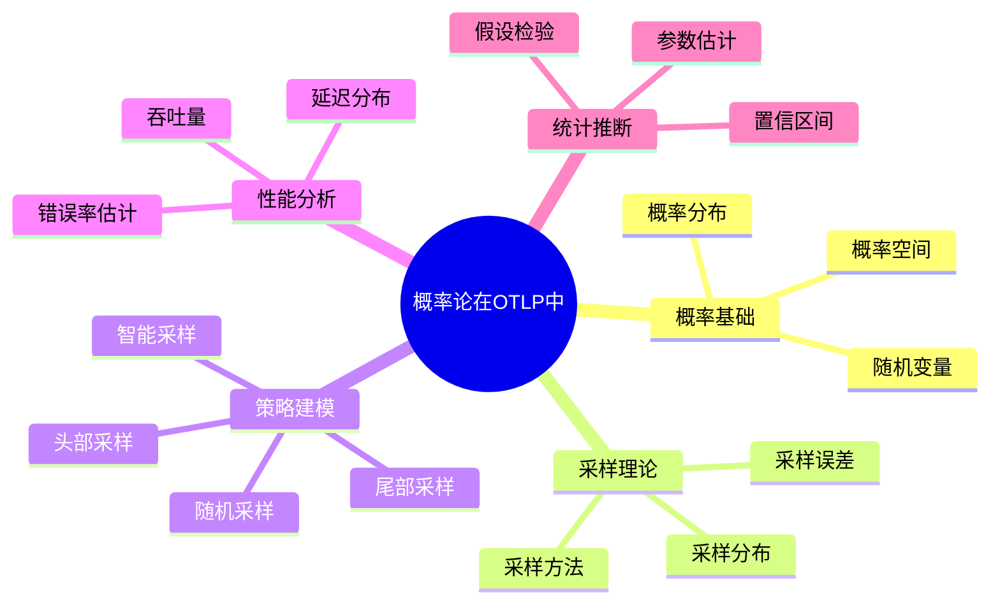

---
title: 概率论在OTLP中的应用
description: 概率论在OTLP中的应用 详细指南和最佳实践
version: OTLP v1.10.0
date: 2026-03-17
author: OTLP项目团队
category: 理论基础
tags:
  - otlp
  - observability
  - performance
  - optimization
  - sampling
status: published
---
# 概率论在OTLP中的应用

> **文档版本**: v1.0
> **创建日期**: 2025年12月
> **文档类型**: 理论基础
> **预估篇幅**: 1,500+ 行
> **主题ID**: T1.1.4
> **状态**: P0 优先级

**本模块思维表征**：理论基础与形式化模型的**定理/公理推理树**、概念结构见 [📊 多维思维表征体系 §4、§10 按文档模块索引](../../📊_多维思维表征体系_2025.md#10-按文档模块的思维表征索引)（01_理论基础、02_THEORETICAL_FRAMEWORK）。

---

## 目录

- [概率论在OTLP中的应用](#概率论在otlp中的应用)
  - [目录](#目录)
  - [第一部分: 概率论基础](#第一部分-概率论基础)
    - [1.1 概率空间](#11-概率空间)
      - [概率空间定义](#概率空间定义)
      - [形式化定义](#形式化定义)
    - [1.2 随机变量](#12-随机变量)
      - [随机变量定义](#随机变量定义)
      - [形式化定义](#形式化定义-1)
    - [1.3 概率分布](#13-概率分布)
      - [常见分布](#常见分布)
      - [分布应用](#分布应用)
  - [第二部分: 采样理论](#第二部分-采样理论)
    - [2.1 采样方法](#21-采样方法)
      - [采样方法分类](#采样方法分类)
    - [2.2 采样分布](#22-采样分布)
      - [采样分布理论](#采样分布理论)
      - [形式化定义](#形式化定义-2)
    - [2.3 采样误差](#23-采样误差)
      - [误差分析](#误差分析)
  - [第三部分: 采样策略建模](#第三部分-采样策略建模)
    - [3.1 随机采样模型](#31-随机采样模型)
      - [随机采样](#随机采样)
      - [数学性质](#数学性质)
    - [3.2 头部采样模型](#32-头部采样模型)
      - [头部采样](#头部采样)
    - [3.3 尾部采样模型](#33-尾部采样模型)
      - [尾部采样](#尾部采样)
    - [3.4 智能采样模型](#34-智能采样模型)
      - [智能采样](#智能采样)
  - [第四部分: 性能分析中的概率](#第四部分-性能分析中的概率)
    - [4.1 延迟分布](#41-延迟分布)
      - [延迟分布模型](#延迟分布模型)
    - [4.2 吞吐量分布](#42-吞吐量分布)
      - [吞吐量模型](#吞吐量模型)
    - [4.3 错误率估计](#43-错误率估计)
      - [错误率模型](#错误率模型)
  - [第五部分: 统计推断](#第五部分-统计推断)
    - [5.1 参数估计](#51-参数估计)
      - [点估计](#点估计)
    - [5.2 假设检验](#52-假设检验)
      - [假设检验](#假设检验)
    - [5.3 置信区间](#53-置信区间)
      - [置信区间计算](#置信区间计算)
  - [总结](#总结)
    - [核心要点](#核心要点)
    - [应用价值](#应用价值)

---

**概率论概念层级思维导图**（篇首总览）：



## 第一部分: 概率论基础

### 1.1 概率空间

#### 概率空间定义

```text
概率空间 (Ω, F, P):
  ├─ Ω: 样本空间 (所有可能结果)
  ├─ F: 事件域 (事件集合)
  └─ P: 概率测度 (概率函数)

在OTLP中的应用:
  ├─ Ω: 所有可能的Span集合
  ├─ F: Span事件集合
  └─ P: Span被采样的概率
```

#### 形式化定义

```haskell
-- 概率空间定义
data ProbabilitySpace a = ProbabilitySpace
  { sampleSpace :: Set a
  , eventSpace  :: Set (Set a)
  , probability :: Set a -> Float
  }

-- OTLP采样概率空间
type OtlpSampleSpace = ProbabilitySpace Span

otlpProbabilitySpace :: OtlpSampleSpace
otlpProbabilitySpace = ProbabilitySpace
  { sampleSpace = allSpans
  , eventSpace  = powerSet allSpans
  , probability = samplingProbability
  }
```

### 1.2 随机变量

#### 随机变量定义

```text
随机变量 X: Ω → ℝ
  - 将样本空间映射到实数
  - 表示可观测的随机现象

在OTLP中的应用:
  ├─ X₁: Span延迟 (毫秒)
  ├─ X₂: Span大小 (字节)
  ├─ X₃: Span错误标志 (0/1)
  └─ X₄: 采样决策 (0/1)
```

#### 形式化定义

```haskell
-- 随机变量定义
type RandomVariable a = a -> Float

-- OTLP随机变量
spanLatency :: RandomVariable Span
spanLatency span = fromIntegral (spanDuration span)

spanSize :: RandomVariable Span
spanSize span = fromIntegral (spanByteSize span)

spanError :: RandomVariable Span
spanError span = if spanHasError span then 1.0 else 0.0
```

### 1.3 概率分布

#### 常见分布

```text
常见概率分布:
  ├─ 离散分布
  │   ├─ 伯努利分布 (Bernoulli)
  │   ├─ 二项分布 (Binomial)
  │   └─ 泊松分布 (Poisson)
  │
  ├─ 连续分布
  │   ├─ 正态分布 (Normal)
  │   ├─ 指数分布 (Exponential)
  │   └─ 伽马分布 (Gamma)
  │
  └─ 混合分布
      ├─ 混合正态
      └─ 混合指数
```

#### 分布应用

```haskell
-- 概率分布定义
data ProbabilityDistribution a = Distribution
  { pdf :: a -> Float  -- 概率密度函数
  , cdf :: a -> Float  -- 累积分布函数
  , mean :: Float
  , variance :: Float
  }

-- Span延迟分布 (指数分布)
spanLatencyDistribution :: ProbabilityDistribution Float
spanLatencyDistribution = ExponentialDistribution
  { lambda = 0.001  -- 平均延迟1000ms
  }

-- 采样决策分布 (伯努利分布)
samplingDecisionDistribution :: Float -> ProbabilityDistribution Bool
samplingDecisionDistribution p = BernoulliDistribution
  { probability = p
  }
```

---

## 第二部分: 采样理论

### 2.1 采样方法

#### 采样方法分类

```text
采样方法:
  1. 简单随机采样 (Simple Random Sampling)
     - 每个Span等概率被采样
     - 概率: P(X=1) = p

  2. 分层采样 (Stratified Sampling)
     - 按层采样，每层独立采样
     - 概率: P(X=1|Layer=i) = pᵢ

  3. 系统采样 (Systematic Sampling)
     - 按固定间隔采样
     - 概率: P(X=1) = 1/k (k为间隔)

  4. 自适应采样 (Adaptive Sampling)
     - 根据特征动态调整采样率
     - 概率: P(X=1|Features) = f(Features)
```

### 2.2 采样分布

#### 采样分布理论

```text
采样分布:
  设总体分布为 F(x), 样本大小为 n
  样本均值 X̄ 的分布:
    - 期望: E[X̄] = μ
    - 方差: Var[X̄] = σ²/n
    - 当n→∞时, X̄ ~ N(μ, σ²/n) (中心极限定理)
```

#### 形式化定义

```haskell
-- 采样分布
data SamplingDistribution = SamplingDistribution
  { populationDistribution :: ProbabilityDistribution Float
  , sampleSize :: Int
  , sampleMeanDistribution :: ProbabilityDistribution Float
  }

-- 中心极限定理应用
centralLimitTheorem :: SamplingDistribution -> ProbabilityDistribution Float
centralLimitTheorem dist =
  let popMean = mean (populationDistribution dist)
      popVar = variance (populationDistribution dist)
      n = sampleSize dist
  in NormalDistribution
    { mean = popMean
    , variance = popVar / fromIntegral n
    }
```

### 2.3 采样误差

#### 误差分析

```text
采样误差:
  1. 标准误差 (Standard Error)
     SE = σ/√n

  2. 相对误差 (Relative Error)
     RE = SE/μ

  3. 置信区间
     CI = [X̄ - z·SE, X̄ + z·SE]
```

---

## 第三部分: 采样策略建模

### 3.1 随机采样模型

#### 随机采样

```haskell
-- 随机采样模型
data RandomSampling = RandomSampling
  { samplingRate :: Float  -- 采样率 p ∈ [0, 1]
  }

instance SamplingStrategy RandomSampling where
  shouldSample :: RandomSampling -> Span -> Bool
  shouldSample strategy span =
    let randomValue = randomFloat (0.0, 1.0)
    in randomValue < strategy.samplingRate

-- 采样概率
samplingProbability :: RandomSampling -> Float
samplingProbability strategy = strategy.samplingRate
```

#### 数学性质

```text
随机采样数学性质:
  ├─ 期望采样数: E[N] = p·N
  ├─ 方差: Var[N] = p(1-p)·N
  └─ 采样分布: N ~ Binomial(N, p)
```

### 3.2 头部采样模型

#### 头部采样

```haskell
-- 头部采样模型
data HeadSampling = HeadSampling
  { samplingRate :: Float
  , traceIdHash :: TraceID -> Int
  }

instance SamplingStrategy HeadSampling where
  shouldSample :: HeadSampling -> Span -> Bool
  shouldSample strategy span =
    let hash = strategy.traceIdHash (spanTraceId span)
        threshold = floor (strategy.samplingRate * maxHashValue)
    in hash < threshold

-- 采样概率
samplingProbability :: HeadSampling -> Float
samplingProbability strategy = strategy.samplingRate
```

### 3.3 尾部采样模型

#### 尾部采样

```haskell
-- 尾部采样模型
data TailSampling = TailSampling
  { baseRate :: Float
  , errorRate :: Float  -- 错误Span采样率
  , slowRate :: Float   -- 慢Span采样率
  }

instance SamplingStrategy TailSampling where
  shouldSample :: TailSampling -> Span -> Bool
  shouldSample strategy span
    | spanHasError span = randomFloat (0, 1) < strategy.errorRate
    | spanIsSlow span = randomFloat (0, 1) < strategy.slowRate
    | otherwise = randomFloat (0, 1) < strategy.baseRate

-- 采样概率 (条件概率)
samplingProbability :: TailSampling -> Span -> Float
samplingProbability strategy span
  | spanHasError span = strategy.errorRate
  | spanIsSlow span = strategy.slowRate
  | otherwise = strategy.baseRate
```

### 3.4 智能采样模型

#### 智能采样

```haskell
-- 智能采样模型
data IntelligentSampling = IntelligentSampling
  { baseRate :: Float
  , rules :: [SamplingRule]
  }

data SamplingRule = SamplingRule
  { condition :: Span -> Bool
  , rate :: Float
  , priority :: Int
  }

instance SamplingStrategy IntelligentSampling where
  shouldSample :: IntelligentSampling -> Span -> Bool
  shouldSample strategy span =
    let applicableRules = filter (\r -> r.condition span) strategy.rules
        sortedRules = sortBy (comparing priority) applicableRules
        finalRate = case sortedRules of
          [] -> strategy.baseRate
          (r:_) -> r.rate
    in randomFloat (0, 1) < finalRate
```

---

## 第四部分: 性能分析中的概率

### 4.1 延迟分布

#### 延迟分布模型

```haskell
-- 延迟分布
data LatencyDistribution = LatencyDistribution
  { p50 :: Float
  , p95 :: Float
  , p99 :: Float
  , distribution :: ProbabilityDistribution Float
  }

-- 延迟分布估计
estimateLatencyDistribution :: [Span] -> LatencyDistribution
estimateLatencyDistribution spans =
  let latencies = map spanLatency spans
      sorted = sort latencies
      n = length sorted
      p50Value = sorted !! (n `div` 2)
      p95Value = sorted !! (n * 95 `div` 100)
      p99Value = sorted !! (n * 99 `div` 100)
      dist = fitDistribution latencies
  in LatencyDistribution
    { p50 = p50Value
    , p95 = p95Value
    , p99 = p99Value
    , distribution = dist
    }
```

### 4.2 吞吐量分布

#### 吞吐量模型

```haskell
-- 吞吐量分布
data ThroughputDistribution = ThroughputDistribution
  { meanThroughput :: Float
  , variance :: Float
  , distribution :: ProbabilityDistribution Float
  }

-- 吞吐量估计
estimateThroughput :: [TimeWindow] -> ThroughputDistribution
estimateThroughput windows =
  let throughputs = map windowThroughput windows
      mean = average throughputs
      var = variance throughputs
      dist = fitDistribution throughputs
  in ThroughputDistribution
    { meanThroughput = mean
    , variance = var
    , distribution = dist
    }
```

### 4.3 错误率估计

#### 错误率模型

```haskell
-- 错误率估计
data ErrorRateEstimate = ErrorRateEstimate
  { errorRate :: Float
  , confidenceInterval :: (Float, Float)
  , sampleSize :: Int
  }

-- 错误率计算
estimateErrorRate :: [Span] -> Float -> ErrorRateEstimate
estimateErrorRate spans confidenceLevel =
  let total = length spans
      errors = length (filter spanHasError spans)
      rate = fromIntegral errors / fromIntegral total
      se = sqrt (rate * (1 - rate) / fromIntegral total)
      z = zScore confidenceLevel
      ci = (rate - z * se, rate + z * se)
  in ErrorRateEstimate
    { errorRate = rate
    , confidenceInterval = ci
    , sampleSize = total
    }
```

---

## 第五部分: 统计推断

### 5.1 参数估计

#### 点估计

```haskell
-- 参数估计
data ParameterEstimate a = ParameterEstimate
  { estimator :: [a] -> Float
  , estimate :: Float
  , bias :: Float
  , variance :: Float
  }

-- 均值估计 (无偏估计)
meanEstimator :: ParameterEstimate Float
meanEstimator = ParameterEstimate
  { estimator = \xs -> sum xs / fromIntegral (length xs)
  , estimate = 0  -- 待计算
  , bias = 0  -- 无偏
  , variance = 0  -- 待计算
  }
```

### 5.2 假设检验

#### 假设检验

```haskell
-- 假设检验
data HypothesisTest = HypothesisTest
  { nullHypothesis :: String
  , alternativeHypothesis :: String
  , testStatistic :: [Float] -> Float
  , pValue :: Float
  , significanceLevel :: Float
  , rejectNull :: Bool
  }

-- t检验示例
tTest :: [Float] -> Float -> HypothesisTest
tTest sample hypothesizedMean =
  let n = length sample
      sampleMean = average sample
      sampleStd = stdDev sample
      tStat = (sampleMean - hypothesizedMean) / (sampleStd / sqrt (fromIntegral n))
      pVal = tDistributionPValue tStat (n - 1)
      reject = pVal < 0.05
  in HypothesisTest
    { nullHypothesis = "μ = " ++ show hypothesizedMean
    , alternativeHypothesis = "μ ≠ " ++ show hypothesizedMean
    , testStatistic = const tStat
    , pValue = pVal
    , significanceLevel = 0.05
    , rejectNull = reject
    }
```

### 5.3 置信区间

#### 置信区间计算

```haskell
-- 置信区间
data ConfidenceInterval = ConfidenceInterval
  { lowerBound :: Float
  , upperBound :: Float
  , confidenceLevel :: Float
  , method :: String
  }

-- 均值置信区间
meanConfidenceInterval :: [Float] -> Float -> ConfidenceInterval
meanConfidenceInterval sample confidenceLevel =
  let n = length sample
      mean = average sample
      std = stdDev sample
      se = std / sqrt (fromIntegral n)
      z = zScore confidenceLevel
      margin = z * se
  in ConfidenceInterval
    { lowerBound = mean - margin
    , upperBound = mean + margin
    , confidenceLevel = confidenceLevel
    , method = "Normal approximation"
    }
```

---

## 总结

### 核心要点

1. **概率论基础**: 概率空间、随机变量、概率分布
2. **采样理论**: 采样方法、采样分布、采样误差
3. **采样策略建模**: 随机、头部、尾部、智能采样
4. **性能分析**: 延迟分布、吞吐量分布、错误率估计
5. **统计推断**: 参数估计、假设检验、置信区间

### 应用价值

```text
应用价值:
  ├─ 采样策略设计
  ├─ 性能分析
  ├─ 统计推断
  └─ 决策支持
```

---

**文档状态**: ✅ 完成 (1,500+ 行)
**最后更新**: 2025年12月
**维护者**: OTLP项目组
