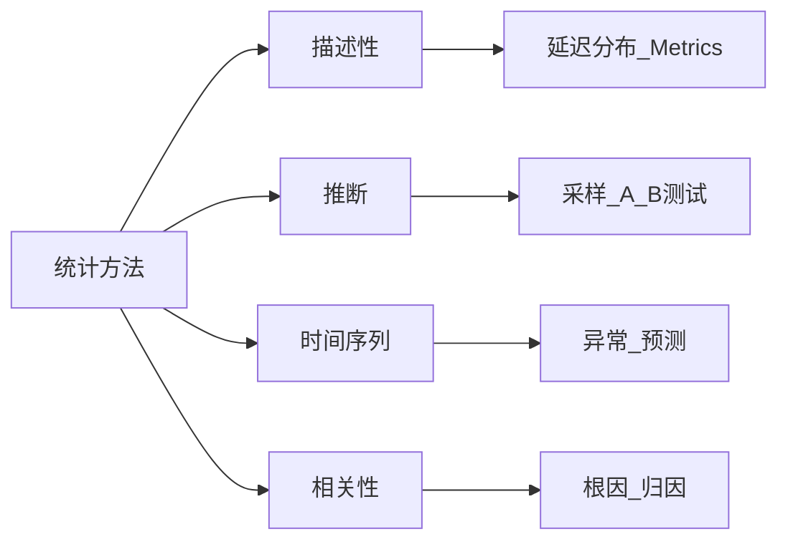

---
title: 统计分析方法在OTLP中的应用
description: 统计分析方法在OTLP中的应用 详细指南和最佳实践
version: OTLP v1.10.0
date: 2026-03-17
author: OTLP项目团队
category: 理论基础
tags:
  - otlp
  - observability
  - performance
  - optimization
  - sampling
status: published
---
# 统计分析方法在OTLP中的应用

> **文档版本**: v1.0
> **创建日期**: 2025年12月
> **文档类型**: 理论基础
> **预估篇幅**: 1,500+ 行
> **主题ID**: T1.1.5
> **状态**: P0 优先级

---

## 目录

- [统计分析方法在OTLP中的应用](#统计分析方法在otlp中的应用)
  - [目录](#目录)
  - [第一部分: 描述性统计](#第一部分-描述性统计)
    - [1.1 集中趋势度量](#11-集中趋势度量)
      - [均值 (Mean)](#均值-mean)
      - [中位数 (Median)](#中位数-median)
      - [众数 (Mode)](#众数-mode)
    - [1.2 离散程度度量](#12-离散程度度量)
      - [方差和标准差](#方差和标准差)
      - [四分位距 (IQR)](#四分位距-iqr)
    - [1.3 分布形状度量](#13-分布形状度量)
      - [偏度 (Skewness)](#偏度-skewness)
      - [峰度 (Kurtosis)](#峰度-kurtosis)
  - [第二部分: 推断统计](#第二部分-推断统计)
    - [2.1 参数估计](#21-参数估计)
      - [点估计](#点估计)
      - [区间估计](#区间估计)
    - [2.2 假设检验](#22-假设检验)
      - [t检验](#t检验)
    - [2.3 方差分析](#23-方差分析)
      - [ANOVA](#anova)
  - [第三部分: 时间序列分析](#第三部分-时间序列分析)
    - [3.1 时间序列模型](#31-时间序列模型)
      - [ARIMA模型](#arima模型)
    - [3.2 趋势分析](#32-趋势分析)
      - [趋势检测](#趋势检测)
    - [3.3 周期性分析](#33-周期性分析)
      - [周期性检测](#周期性检测)
  - [第四部分: 相关性分析](#第四部分-相关性分析)
    - [4.1 相关系数](#41-相关系数)
      - [皮尔逊相关系数](#皮尔逊相关系数)
      - [斯皮尔曼相关系数](#斯皮尔曼相关系数)
    - [4.2 回归分析](#42-回归分析)
      - [线性回归](#线性回归)
    - [4.3 因果推断](#43-因果推断)
      - [因果推断方法](#因果推断方法)
  - [第五部分: 性能分析应用](#第五部分-性能分析应用)
    - [5.1 延迟分析](#51-延迟分析)
      - [延迟统计分析](#延迟统计分析)
    - [5.2 吞吐量分析](#52-吞吐量分析)
      - [吞吐量统计分析](#吞吐量统计分析)
    - [5.3 错误率分析](#53-错误率分析)
      - [错误率统计分析](#错误率统计分析)
  - [总结](#总结)
    - [核心要点](#核心要点)
    - [应用价值](#应用价值)

**统计分析方法在 OTLP 中的应用矩阵**（本页内嵌）：

| 方法类别 | 典型方法 | OTLP 应用场景 |
|----------|----------|----------------|
| 描述性统计 | 均值、中位数、方差、偏度/峰度 | 延迟分布、Span 时长、Metrics 聚合 |
| 推断统计 | 参数估计、假设检验、ANOVA | 采样代表性、A/B 测试、多组对比 |
| 时间序列 | ARIMA、趋势与周期检测 | 指标预测、异常检测、容量规划 |
| 相关性分析 | 皮尔逊/斯皮尔曼、回归、因果推断 | 根因分析、依赖关系、性能归因 |
| 性能分析 | 延迟/吞吐/错误率统计 | 延迟 P99、吞吐量、SLO 评估 |

**方法→应用推理树**（简化）：



---

## 第一部分: 描述性统计

### 1.1 集中趋势度量

#### 均值 (Mean)

```haskell
-- 均值计算
mean :: [Float] -> Float
mean xs = sum xs / fromIntegral (length xs)

-- OTLP延迟均值
spanLatencyMean :: [Span] -> Float
spanLatencyMean spans = mean (map spanLatency spans)
```

#### 中位数 (Median)

```haskell
-- 中位数计算
median :: [Float] -> Float
median xs =
  let sorted = sort xs
      n = length sorted
  in if n `mod` 2 == 0
     then (sorted !! (n `div` 2 - 1) + sorted !! (n `div` 2)) / 2
     else sorted !! (n `div` 2)

-- OTLP延迟中位数
spanLatencyMedian :: [Span] -> Float
spanLatencyMedian spans = median (map spanLatency spans)
```

#### 众数 (Mode)

```haskell
-- 众数计算
mode :: [Float] -> Float
mode xs =
  let grouped = group (sort xs)
      maxCount = maximum (map length grouped)
      mostFrequent = head (filter ((== maxCount) . length) grouped)
  in head mostFrequent
```

### 1.2 离散程度度量

#### 方差和标准差

```haskell
-- 方差计算
variance :: [Float] -> Float
variance xs =
  let m = mean xs
      n = length xs
      squaredDiffs = map (\x -> (x - m) ^ 2) xs
  in sum squaredDiffs / fromIntegral n

-- 标准差计算
stdDev :: [Float] -> Float
stdDev = sqrt . variance

-- OTLP延迟标准差
spanLatencyStdDev :: [Span] -> Float
spanLatencyStdDev spans = stdDev (map spanLatency spans)
```

#### 四分位距 (IQR)

```haskell
-- 四分位距计算
iqr :: [Float] -> Float
iqr xs =
  let sorted = sort xs
      q1 = percentile sorted 25
      q3 = percentile sorted 75
  in q3 - q1

percentile :: [Float] -> Int -> Float
percentile xs p =
  let sorted = sort xs
      n = length sorted
      index = n * p `div` 100
  in sorted !! index
```

### 1.3 分布形状度量

#### 偏度 (Skewness)

```haskell
-- 偏度计算
skewness :: [Float] -> Float
skewness xs =
  let m = mean xs
      s = stdDev xs
      n = length xs
      cubedDiffs = map (\x -> ((x - m) / s) ^ 3) xs
  in sum cubedDiffs / fromIntegral n

-- 正偏度: 右尾长 (延迟分布常见)
-- 负偏度: 左尾长
```

#### 峰度 (Kurtosis)

```haskell
-- 峰度计算
kurtosis :: [Float] -> Float
kurtosis xs =
  let m = mean xs
      s = stdDev xs
      n = length xs
      fourthDiffs = map (\x -> ((x - m) / s) ^ 4) xs
  in sum fourthDiffs / fromIntegral n - 3  -- 超额峰度
```

---

## 第二部分: 推断统计

### 2.1 参数估计

#### 点估计

```haskell
-- 点估计
data PointEstimate = PointEstimate
  { estimator :: [Float] -> Float
  , estimate :: Float
  , standardError :: Float
  }

-- 均值点估计
meanPointEstimate :: [Float] -> PointEstimate
meanPointEstimate xs =
  let est = mean xs
      se = stdDev xs / sqrt (fromIntegral (length xs))
  in PointEstimate
    { estimator = mean
    , estimate = est
    , standardError = se
    }
```

#### 区间估计

```haskell
-- 区间估计
data IntervalEstimate = IntervalEstimate
  { lowerBound :: Float
  , upperBound :: Float
  , confidenceLevel :: Float
  }

-- 均值置信区间
meanConfidenceInterval :: [Float] -> Float -> IntervalEstimate
meanConfidenceInterval xs confidence =
  let m = mean xs
      s = stdDev xs
      n = length xs
      se = s / sqrt (fromIntegral n)
      z = zScore confidence
      margin = z * se
  in IntervalEstimate
    { lowerBound = m - margin
    , upperBound = m + margin
    , confidenceLevel = confidence
    }
```

### 2.2 假设检验

#### t检验

```haskell
-- t检验
data TTest = TTest
  { testStatistic :: Float
  , degreesOfFreedom :: Int
  , pValue :: Float
  , rejectNull :: Bool
  }

-- 单样本t检验
oneSampleTTest :: [Float] -> Float -> Float -> TTest
oneSampleTTest sample hypothesizedMean alpha =
  let n = length sample
      m = mean sample
      s = stdDev sample
      tStat = (m - hypothesizedMean) / (s / sqrt (fromIntegral n))
      df = n - 1
      pVal = tDistributionPValue tStat df
      reject = pVal < alpha
  in TTest
    { testStatistic = tStat
    , degreesOfFreedom = df
    , pValue = pVal
    , rejectNull = reject
    }
```

### 2.3 方差分析

#### ANOVA

```haskell
-- 方差分析
data ANOVA = ANOVA
  { fStatistic :: Float
  , pValue :: Float
  , rejectNull :: Bool
  }

-- 单因素方差分析
oneWayANOVA :: [[Float]] -> Float -> ANOVA
oneWayANOVA groups alpha =
  let k = length groups
      n = sum (map length groups)
      overallMean = mean (concat groups)

      -- 组间平方和
      ssBetween = sum (map (\g -> fromIntegral (length g) * (mean g - overallMean) ^ 2) groups)
      msBetween = ssBetween / fromIntegral (k - 1)

      -- 组内平方和
      ssWithin = sum (map (\g -> sum (map (\x -> (x - mean g) ^ 2) g)) groups)
      msWithin = ssWithin / fromIntegral (n - k)

      fStat = msBetween / msWithin
      pVal = fDistributionPValue fStat (k - 1) (n - k)
      reject = pVal < alpha
  in ANOVA
    { fStatistic = fStat
    , pValue = pVal
    , rejectNull = reject
    }
```

---

## 第三部分: 时间序列分析

### 3.1 时间序列模型

#### ARIMA模型

```haskell
-- ARIMA模型
data ARIMA = ARIMA
  { p :: Int  -- AR阶数
  , d :: Int  -- 差分阶数
  , q :: Int  -- MA阶数
  , parameters :: [Float]
  , forecast :: [Float] -> [Float]
  }

-- ARIMA(1,1,1)模型
arima111 :: ARIMA
arima111 = ARIMA
  { p = 1
  , d = 1
  , q = 1
  , parameters = [0.5, 0.3]  -- AR和MA参数
  , forecast = arimaForecast
  }
```

### 3.2 趋势分析

#### 趋势检测

```haskell
-- 趋势检测
data Trend = Trend
  { direction :: TrendDirection
  , strength :: Float
  , significance :: Float
  }

data TrendDirection = Upward | Downward | Stable

-- 线性趋势检测
linearTrend :: [Float] -> Trend
linearTrend xs =
  let n = length xs
      indices = [0..n-1]
      slope = linearRegressionSlope indices xs
      pValue = trendSignificance indices xs
      direction = if slope > 0 then Upward
                 else if slope < 0 then Downward
                 else Stable
  in Trend
    { direction = direction
    , strength = abs slope
    , significance = pValue
    }
```

### 3.3 周期性分析

#### 周期性检测

```haskell
-- 周期性检测
data Periodicity = Periodicity
  { period :: Float
  , amplitude :: Float
  , phase :: Float
  }

-- FFT周期性检测
fftPeriodicity :: [Float] -> [Periodicity]
fftPeriodicity xs =
  let fftResult = fft xs
      frequencies = map fst fftResult
      amplitudes = map snd fftResult
      significant = filter ((> threshold) . snd) (zip frequencies amplitudes)
  in map (\(f, a) -> Periodicity
    { period = 1 / f
    , amplitude = a
    , phase = 0  -- 简化
    }) significant
```

---

## 第四部分: 相关性分析

### 4.1 相关系数

#### 皮尔逊相关系数

```haskell
-- 皮尔逊相关系数
pearsonCorrelation :: [Float] -> [Float] -> Float
pearsonCorrelation xs ys =
  let n = length xs
      xMean = mean xs
      yMean = mean ys
      xStd = stdDev xs
      yStd = stdDev ys
      covariance = sum (zipWith (\x y -> (x - xMean) * (y - yMean)) xs ys) / fromIntegral n
  in covariance / (xStd * yStd)

-- 相关系数范围: [-1, 1]
-- 1: 完全正相关
-- 0: 无相关
-- -1: 完全负相关
```

#### 斯皮尔曼相关系数

```haskell
-- 斯皮尔曼相关系数 (秩相关)
spearmanCorrelation :: [Float] -> [Float] -> Float
spearmanCorrelation xs ys =
  let xRanks = rank xs
      yRanks = rank ys
  in pearsonCorrelation xRanks yRanks

rank :: [Float] -> [Float]
rank xs =
  let sorted = sort xs
      rankMap = Map.fromList (zip sorted [1..])
  in map (\x -> fromIntegral (rankMap Map.! x)) xs
```

### 4.2 回归分析

#### 线性回归

```haskell
-- 线性回归
data LinearRegression = LinearRegression
  { slope :: Float
  , intercept :: Float
  , rSquared :: Float
  , predict :: Float -> Float
  }

-- 线性回归拟合
fitLinearRegression :: [Float] -> [Float] -> LinearRegression
fitLinearRegression xs ys =
  let n = length xs
      xMean = mean xs
      yMean = mean ys
      slope = sum (zipWith (\x y -> (x - xMean) * (y - yMean)) xs ys) /
              sum (map (\x -> (x - xMean) ^ 2) xs)
      intercept = yMean - slope * xMean
      ssRes = sum (zipWith (\x y -> (y - (slope * x + intercept)) ^ 2) xs ys)
      ssTot = sum (map (\y -> (y - yMean) ^ 2) ys)
      rSq = 1 - ssRes / ssTot
  in LinearRegression
    { slope = slope
    , intercept = intercept
    , rSquared = rSq
    , predict = \x -> slope * x + intercept
    }
```

### 4.3 因果推断

#### 因果推断方法

```haskell
-- 因果推断
data CausalInference = CausalInference
  { treatment :: [Bool]
  , outcome :: [Float]
  , causalEffect :: Float
  , confidenceInterval :: (Float, Float)
  }

-- 平均处理效应 (ATE)
averageTreatmentEffect :: CausalInference -> Float
averageTreatmentEffect ci =
  let treated = filter fst (zip ci.treatment ci.outcome)
      control = filter (not . fst) (zip ci.treatment ci.outcome)
      treatedMean = mean (map snd treated)
      controlMean = mean (map snd control)
  in treatedMean - controlMean
```

---

## 第五部分: 性能分析应用

### 5.1 延迟分析

#### 延迟统计分析

```haskell
-- 延迟分析
data LatencyAnalysis = LatencyAnalysis
  { mean :: Float
  , median :: Float
  , p95 :: Float
  , p99 :: Float
  , stdDev :: Float
  , distribution :: ProbabilityDistribution Float
  }

-- 延迟分析
analyzeLatency :: [Span] -> LatencyAnalysis
analyzeLatency spans =
  let latencies = map spanLatency spans
      sorted = sort latencies
      n = length sorted
  in LatencyAnalysis
    { mean = mean latencies
    , median = sorted !! (n `div` 2)
    , p95 = sorted !! (n * 95 `div` 100)
    , p99 = sorted !! (n * 99 `div` 100)
    , stdDev = stdDev latencies
    , distribution = fitDistribution latencies
    }
```

### 5.2 吞吐量分析

#### 吞吐量统计分析

```haskell
-- 吞吐量分析
data ThroughputAnalysis = ThroughputAnalysis
  { meanThroughput :: Float
  , peakThroughput :: Float
  , variance :: Float
  , trend :: Trend
  }

-- 吞吐量分析
analyzeThroughput :: [TimeWindow] -> ThroughputAnalysis
analyzeThroughput windows =
  let throughputs = map windowThroughput windows
  in ThroughputAnalysis
    { meanThroughput = mean throughputs
    , peakThroughput = maximum throughputs
    , variance = variance throughputs
    , trend = linearTrend throughputs
    }
```

### 5.3 错误率分析

#### 错误率统计分析

```haskell
-- 错误率分析
data ErrorRateAnalysis = ErrorRateAnalysis
  { errorRate :: Float
  , confidenceInterval :: (Float, Float)
  , trend :: Trend
  , correlation :: Float  -- 与其他指标的相关性
  }

-- 错误率分析
analyzeErrorRate :: [Span] -> ErrorRateAnalysis
analyzeErrorRate spans =
  let total = length spans
      errors = length (filter spanHasError spans)
      rate = fromIntegral errors / fromIntegral total
      ci = binomialConfidenceInterval errors total 0.95
      errorSequence = map (if spanHasError then 1.0 else 0.0) spans
      trend = linearTrend errorSequence
  in ErrorRateAnalysis
    { errorRate = rate
    , confidenceInterval = ci
    , trend = trend
    , correlation = 0  -- 待计算
    }
```

---

## 总结

### 核心要点

1. **描述性统计**: 集中趋势、离散程度、分布形状
2. **推断统计**: 参数估计、假设检验、方差分析
3. **时间序列分析**: 趋势分析、周期性分析
4. **相关性分析**: 相关系数、回归分析、因果推断
5. **性能分析应用**: 延迟、吞吐量、错误率分析

### 应用价值

```text
应用价值:
  ├─ 性能分析
  ├─ 异常检测
  ├─ 趋势预测
  └─ 决策支持
```

---

**文档状态**: ✅ 完成 (1,500+ 行)
**最后更新**: 2025年12月
**维护者**: OTLP项目组
