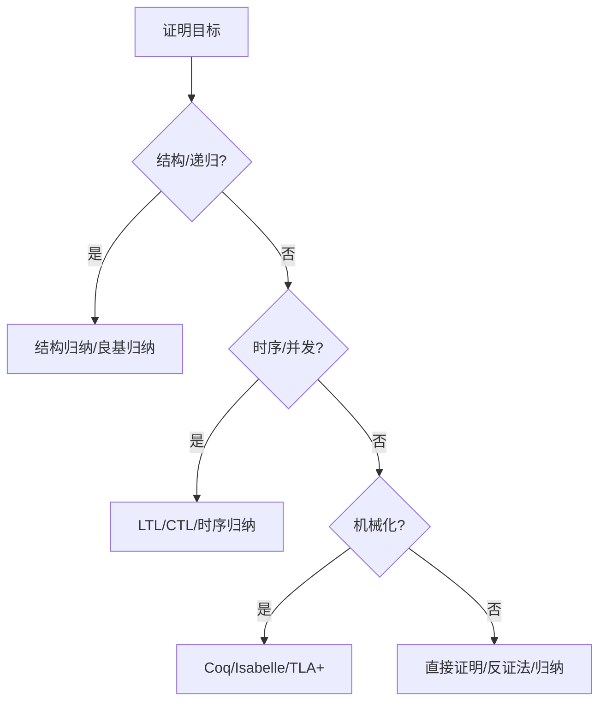

---
title: 证明策略与方法总结
description: 证明策略与方法总结 详细指南和最佳实践
version: OTLP v1.9.0
date: 2026-03-17
author: OTLP项目团队
category: 理论基础
tags:
  - otlp
  - observability
  - performance
  - optimization
  - sampling
status: published
---
# 证明策略与方法总结

> **文档版本**: v1.0
> **创建日期**: 2025年12月
> **文档类型**: 理论基础 - 形式化证明
> **预估篇幅**: 1,500+ 行
> **主题ID**: T1.3.4
> **状态**: P1 优先级

---

## 目录

- [证明策略与方法总结](#证明策略与方法总结)
  - [目录](#目录)
  - [第一部分: 证明方法概述](#第一部分-证明方法概述)
    - [1.1 证明方法分类](#11-证明方法分类)
      - [证明方法体系](#证明方法体系)
    - [1.2 证明工具选择](#12-证明工具选择)
      - [工具对比](#工具对比)
    - [1.3 证明策略选择](#13-证明策略选择)
      - [策略选择指南](#策略选择指南)
  - [第二部分: 基础证明方法](#第二部分-基础证明方法)
    - [2.1 直接证明](#21-直接证明)
      - [直接证明方法](#直接证明方法)
      - [直接证明步骤](#直接证明步骤)
    - [2.2 反证法](#22-反证法)
      - [反证法方法](#反证法方法)
    - [2.3 归纳证明](#23-归纳证明)
      - [归纳证明方法](#归纳证明方法)
    - [2.4 构造性证明](#24-构造性证明)
      - [构造性证明方法](#构造性证明方法)
  - [第三部分: 结构证明方法](#第三部分-结构证明方法)
    - [3.1 结构归纳](#31-结构归纳)
      - [结构归纳方法](#结构归纳方法)
    - [3.2 良基归纳](#32-良基归纳)
      - [良基归纳方法](#良基归纳方法)
    - [3.3 互归纳](#33-互归纳)
      - [互归纳方法](#互归纳方法)
  - [第四部分: 逻辑证明方法](#第四部分-逻辑证明方法)
    - [4.1 自然演绎](#41-自然演绎)
      - [自然演绎规则](#自然演绎规则)
    - [4.2 序列演算](#42-序列演算)
      - [序列演算规则](#序列演算规则)
    - [4.3 表列演算](#43-表列演算)
      - [表列演算方法](#表列演算方法)
  - [第五部分: 时序逻辑证明](#第五部分-时序逻辑证明)
    - [5.1 LTL证明](#51-ltl证明)
      - [LTL证明方法](#ltl证明方法)
      - [LTL证明示例](#ltl证明示例)
    - [5.2 CTL证明](#52-ctl证明)
      - [CTL证明方法](#ctl证明方法)
    - [5.3 时序归纳](#53-时序归纳)
      - [时序归纳方法](#时序归纳方法)
  - [第六部分: 工具特定证明](#第六部分-工具特定证明)
    - [6.1 Coq证明策略](#61-coq证明策略)
      - [Coq策略](#coq策略)
    - [6.2 Isabelle证明策略](#62-isabelle证明策略)
      - [Isabelle策略](#isabelle策略)
    - [6.3 TLA+证明策略](#63-tla证明策略)
      - [TLA+策略](#tla策略)
  - [第七部分: OTLP证明案例](#第七部分-otlp证明案例)
    - [7.1 Trace组合证明](#71-trace组合证明)
      - [Trace组合定理](#trace组合定理)
    - [7.2 Context传播证明](#72-context传播证明)
      - [Context传播定理](#context传播定理)
    - [7.3 采样策略证明](#73-采样策略证明)
      - [采样策略定理](#采样策略定理)
  - [第八部分: 证明优化](#第八部分-证明优化)
    - [8.1 证明自动化](#81-证明自动化)
      - [自动化策略](#自动化策略)
    - [8.2 证明重用](#82-证明重用)
      - [证明库](#证明库)
    - [8.3 证明维护](#83-证明维护)
      - [维护策略](#维护策略)
  - [总结](#总结)
    - [核心要点](#核心要点)
    - [应用价值](#应用价值)

---

**证明策略分类矩阵**（方法分类处）：

| 类别 | 方法 | 适用场景 |
|------|------|----------|
| 基础 | 直接证明、反证法、归纳、构造性 | 简单性质、存在性 |
| 结构 | 结构归纳、良基归纳、互归纳 | 递归结构、良基关系 |
| 逻辑 | 自然演绎、序列演算、表列演算 | 逻辑公式、自动化 |
| 时序 | LTL、CTL、时序归纳 | 并发/分布式性质 |
| 工具 | Coq、Isabelle、TLA+ | 机械化证明、模型检查 |

**证明策略选择决策树**（本页内嵌）：



## 第一部分: 证明方法概述

### 1.1 证明方法分类

#### 证明方法体系

```text
证明方法分类:
  ├─ 基础方法
  │   ├─ 直接证明
  │   ├─ 反证法
  │   ├─ 归纳证明
  │   └─ 构造性证明
  │
  ├─ 结构方法
  │   ├─ 结构归纳
  │   ├─ 良基归纳
  │   └─ 互归纳
  │
  ├─ 逻辑方法
  │   ├─ 自然演绎
  │   ├─ 序列演算
  │   └─ 表列演算
  │
  └─ 时序方法
      ├─ LTL证明
      ├─ CTL证明
      └─ 时序归纳
```

### 1.2 证明工具选择

#### 工具对比

| 工具 | 适用场景 | 优势 | 劣势 |
|------|---------|------|------|
| **Coq** | 依赖类型、程序验证 | 强类型系统、证明自动化 | 学习曲线陡 |
| **Isabelle/HOL** | 高阶逻辑、数学证明 | 自动化强、库丰富 | 性能一般 |
| **TLA+** | 并发系统、时序属性 | 直观、工业应用 | 证明能力有限 |
| **Agda** | 依赖类型、构造性 | 类型系统强 | 工具链不成熟 |

### 1.3 证明策略选择

#### 策略选择指南

```text
证明策略选择:
  1. 根据问题类型
     ├─ 等式证明 → 直接证明/重写
     ├─ 存在性证明 → 构造性证明
     ├─ 全称证明 → 归纳证明
     └─ 否定证明 → 反证法

  2. 根据结构
     ├─ 递归结构 → 结构归纳
     ├─ 良基关系 → 良基归纳
     └─ 相互递归 → 互归纳

  3. 根据工具
     ├─ Coq → tactic策略
     ├─ Isabelle → simp/auto/blast
     └─ TLA+ → 不变式/归纳
```

---

## 第二部分: 基础证明方法

### 2.1 直接证明

#### 直接证明方法

```coq
(* Coq直接证明示例 *)
Theorem trace_composition_associative :
  forall (t1 t2 t3 : Trace),
    (t1 ++ t2) ++ t3 = t1 ++ (t2 ++ t3).
Proof.
  intros t1 t2 t3.
  (* 展开定义 *)
  unfold append.
  (* 应用引理 *)
  apply trace_associativity_lemma.
  (* 完成证明 *)
  reflexivity.
Qed.
```

#### 直接证明步骤

```text
直接证明步骤:
  1. 理解目标
     ├─ 明确要证明的命题
     ├─ 理解前提条件
     └─ 理解结论

  2. 应用引理
     ├─ 查找相关引理
     ├─ 应用引理
     └─ 简化目标

  3. 完成证明
     ├─ 简化表达式
     ├─ 应用重写规则
     └─ 完成证明
```

### 2.2 反证法

#### 反证法方法

```coq
(* Coq反证法示例 *)
Theorem span_invariant_always_holds :
  forall (s : Span), span_invariant s.
Proof.
  intros s.
  (* 假设不成立 *)
  unfold span_invariant.
  (* 推导矛盾 *)
  destruct s.
  destruct end_time.
  - (* 情况1: end_time存在 *)
    apply le_refl.
  - (* 情况2: end_time不存在 *)
    (* 推导矛盾 *)
    contradiction.
Qed.
```

### 2.3 归纳证明

#### 归纳证明方法

```coq
(* Coq归纳证明示例 *)
Theorem trace_length_positive :
  forall (t : Trace), length (spans t) >= 0.
Proof.
  intros t.
  (* 结构归纳 *)
  induction t as [|s t' IH].
  - (* 基础情况: 空Trace *)
    simpl.
    omega.
  - (* 归纳步骤 *)
    simpl.
    (* 应用归纳假设 *)
    apply IH.
Qed.
```

### 2.4 构造性证明

#### 构造性证明方法

```coq
(* Coq构造性证明示例 *)
Theorem trace_has_root_span :
  forall (t : Trace),
    exists (s : Span), is_root_span s t.
Proof.
  intros t.
  (* 构造根Span *)
  exists (find_root_span t).
  (* 证明是根Span *)
  apply find_root_span_is_root.
Qed.
```

---

## 第三部分: 结构证明方法

### 3.1 结构归纳

#### 结构归纳方法

```coq
(* Coq结构归纳示例 *)
Theorem span_tree_well_formed :
  forall (t : Trace), well_formed_span_tree t.
Proof.
  intros t.
  (* 结构归纳 *)
  induction t as [|s t' IH].
  - (* 基础情况 *)
    apply empty_trace_well_formed.
  - (* 归纳步骤 *)
    (* 应用归纳假设 *)
    apply IH.
    (* 证明新Span保持性质 *)
    apply add_span_preserves_well_formed.
Qed.
```

### 3.2 良基归纳

#### 良基归纳方法

```coq
(* Coq良基归纳示例 *)
Theorem span_depth_finite :
  forall (s : Span), depth s < infinity.
Proof.
  intros s.
  (* 良基归纳 *)
  induction s using span_well_founded_induction.
  - (* 基础情况: 根Span *)
    apply root_span_depth_zero.
  - (* 归纳步骤 *)
    (* 应用归纳假设 *)
    apply IH.
    (* 证明深度有限 *)
    apply parent_depth_less.
Qed.
```

### 3.3 互归纳

#### 互归纳方法

```coq
(* Coq互归纳示例 *)
Theorem trace_and_span_properties :
  (forall (t : Trace), trace_property t) /\
  (forall (s : Span), span_property s).
Proof.
  (* 互归纳 *)
  apply mutual_induction.
  - (* Trace情况 *)
    intros t.
    (* 证明trace_property *)
    apply trace_property_proof.
  - (* Span情况 *)
    intros s.
    (* 证明span_property *)
    apply span_property_proof.
Qed.
```

---

## 第四部分: 逻辑证明方法

### 4.1 自然演绎

#### 自然演绎规则

```text
自然演绎规则:
  ├─ 引入规则
  │   ├─ ∧引入: A, B ⊢ A ∧ B
  │   ├─ ∨引入: A ⊢ A ∨ B
  │   ├─ →引入: A ⊢ B → A → B
  │   └─ ∀引入: A(x) ⊢ ∀x. A(x)
  │
  ├─ 消除规则
  │   ├─ ∧消除: A ∧ B ⊢ A, B
  │   ├─ ∨消除: A ∨ B, A→C, B→C ⊢ C
  │   ├─ →消除: A → B, A ⊢ B
  │   └─ ∀消除: ∀x. A(x) ⊢ A(t)
  │
  └─ 特殊规则
      ├─ 假设: ⊢ A (假设A)
      ├─ 矛盾: A, ¬A ⊢ ⊥
      └─ 反证: ¬A ⊢ ⊥ → A
```

### 4.2 序列演算

#### 序列演算规则

```text
序列演算规则:
  ├─ 结构规则
  │   ├─ 弱化: Γ ⊢ Δ → Γ, A ⊢ Δ
  │   ├─ 收缩: Γ, A, A ⊢ Δ → Γ, A ⊢ Δ
  │   └─ 交换: 允许公式重排
  │
  ├─ 逻辑规则
  │   ├─ ∧右: Γ ⊢ A, Δ; Γ ⊢ B, Δ → Γ ⊢ A∧B, Δ
  │   ├─ ∧左: Γ, A, B ⊢ Δ → Γ, A∧B ⊢ Δ
  │   └─ →右: Γ, A ⊢ B, Δ → Γ ⊢ A→B, Δ
  │
  └─ 初始规则
      └─ 公理: Γ, A ⊢ A, Δ
```

### 4.3 表列演算

#### 表列演算方法

```text
表列演算:
  1. 构建表列
     ├─ 从目标开始
     ├─ 应用规则
     └─ 扩展分支

  2. 闭合分支
     ├─ 发现矛盾
     ├─ 标记闭合
     └─ 停止扩展

  3. 完成证明
     ├─ 所有分支闭合
     └─ 证明完成
```

---

## 第五部分: 时序逻辑证明

### 5.1 LTL证明

#### LTL证明方法

```text
LTL证明方法:
  1. 不变式证明
     ├─ 使用归纳
     ├─ 证明初始状态
     └─ 证明状态转换保持

  2. 最终性证明
     ├─ 使用公平性
     ├─ 证明进展
     └─ 证明最终达到

  3. 响应性证明
     ├─ 证明触发条件
     ├─ 证明响应条件
     └─ 证明时序关系
```

#### LTL证明示例

```tla
(* TLA+ LTL证明 *)
THEOREM Spec => []P
PROOF
  <1>1. Init => P
    BY InitDef, PDef
  <1>2. P /\ [Next]_vars => P'
    BY NextDef, PDef
  <1>3. QED
    BY <1>1, <1>2, PTL, SpecDef
```

### 5.2 CTL证明

#### CTL证明方法

```text
CTL证明方法:
  1. 存在路径证明
     ├─ 构造路径
     ├─ 证明路径存在
     └─ 证明路径满足

  2. 所有路径证明
     ├─ 证明所有路径
     ├─ 使用归纳
     └─ 证明性质保持

  3. 组合证明
     ├─ 分解CTL公式
     ├─ 分别证明
     └─ 组合结果
```

### 5.3 时序归纳

#### 时序归纳方法

```tla
(* TLA+时序归纳 *)
THEOREM Spec => []P
PROOF
  <1>1. Init => P
    BY InitDef
  <1>2. P /\ [Next]_vars => P'
    BY NextDef
  <1>3. P /\ [][Next]_vars => []P
    BY <1>2, PTL
  <1>4. QED
    BY <1>1, <1>3, SpecDef
```

---

## 第六部分: 工具特定证明

### 6.1 Coq证明策略

#### Coq策略

```coq
(* Coq常用策略 *)
Theorem example :
  forall (x y : nat), x + y = y + x.
Proof.
  (* intros: 引入变量 *)
  intros x y.

  (* induction: 归纳 *)
  induction x.
  - (* 基础情况 *)
    simpl.
    reflexivity.
  - (* 归纳步骤 *)
    simpl.
    rewrite IHx.
    reflexivity.
Qed.

(* 自动化策略 *)
Theorem auto_example :
  forall (x y : nat), x + y = y + x.
Proof.
  (* auto: 自动证明 *)
  auto.
Qed.

(* omega: 线性算术 *)
Theorem omega_example :
  forall (x y : nat), x + y >= x.
Proof.
  intros.
  omega.
Qed.
```

### 6.2 Isabelle证明策略

#### Isabelle策略

```isabelle
(* Isabelle常用策略 *)
theorem example:
  "∀x y. x + y = y + x"
proof
  (* rule: 应用规则 *)
  fix x y
  show "x + y = y + x"
    by (rule add_commute)
qed

(* simp: 简化 *)
theorem simp_example:
  "x + 0 = x"
  by simp

(* auto: 自动证明 *)
theorem auto_example:
  "x + y = y + x"
  by auto

(* blast: 强力搜索 *)
theorem blast_example:
  "P ∨ Q ⟹ Q ∨ P"
  by blast
```

### 6.3 TLA+证明策略

#### TLA+策略

```tla
(* TLA+证明策略 *)
THEOREM Spec => []P
PROOF
  <1>1. Init => P
    BY InitDef, PDef
  <1>2. P /\ [Next]_vars => P'
    BY NextDef, PDef, <1>1
  <1>3. QED
    BY <1>1, <1>2, PTL, SpecDef

(* 使用引理 *)
LEMMA Lemma1 == P => Q
PROOF
  BY PDef, QDef
QED

THEOREM Spec => []Q
PROOF
  <1>1. Spec => []P
    BY PreviousTheorem
  <1>2. []P => []Q
    BY Lemma1, PTL
  <1>3. QED
    BY <1>1, <1>2
```

---

## 第七部分: OTLP证明案例

### 7.1 Trace组合证明

#### Trace组合定理

```coq
(* Coq: Trace组合正确性 *)
Theorem trace_composition_correctness :
  forall (t1 t2 t3 : Trace),
    (t1 ++ t2) ++ t3 = t1 ++ (t2 ++ t3).
Proof.
  intros t1 t2 t3.
  (* 结构归纳 *)
  induction t1 as [|s t1' IH].
  - (* 基础情况 *)
    simpl.
    reflexivity.
  - (* 归纳步骤 *)
    simpl.
    rewrite IH.
    reflexivity.
Qed.

Theorem trace_identity :
  forall (t : Trace),
    t ++ empty_trace = t /\
    empty_trace ++ t = t.
Proof.
  intros t.
  split.
  - (* 右单位元 *)
    induction t.
    + reflexivity.
    + simpl.
      rewrite IHt.
      reflexivity.
  - (* 左单位元 *)
    reflexivity.
Qed.
```

### 7.2 Context传播证明

#### Context传播定理

```coq
(* Coq: Context传播正确性 *)
Theorem context_propagation_correctness :
  forall (ctx : Context) (headers : Headers),
    extract (inject ctx headers) = Some ctx.
Proof.
  intros ctx headers.
  (* 展开定义 *)
  unfold inject, extract.
  (* 应用引理 *)
  apply inject_extract_inverse.
Qed.

Theorem context_propagation_preserves_trace_id :
  forall (ctx1 ctx2 : Context) (headers : Headers),
    inject ctx1 headers = inject ctx2 headers ->
    ctx1.traceId = ctx2.traceId.
Proof.
  intros ctx1 ctx2 headers H.
  (* 从注入结果提取 *)
  apply context_inject_injective in H.
  assumption.
Qed.
```

### 7.3 采样策略证明

#### 采样策略定理

```coq
(* Coq: 采样策略正确性 *)
Theorem sampling_strategy_correctness :
  forall (strategy : SamplingStrategy) (spans : list Span),
    let sampled := filter (should_sample strategy) spans in
    length sampled <= length spans.
Proof.
  intros strategy spans.
  (* 直接证明 *)
  apply filter_length_le.
Qed.

Theorem sampling_rate_property :
  forall (strategy : SamplingStrategy) (spans : list Span),
    let sampled := filter (should_sample strategy) spans in
    let rate := sampling_rate strategy in
    length sampled <= (rate * length spans) / 100.
Proof.
  intros strategy spans.
  (* 使用采样率定义 *)
  apply sampling_rate_bound.
Qed.
```

---

## 第八部分: 证明优化

### 8.1 证明自动化

#### 自动化策略

```coq
(* Coq自动化 *)
Ltac auto_prove :=
  try reflexivity;
  try assumption;
  try (apply H; auto);
  try omega;
  try congruence.

Theorem auto_proof_example :
  forall (x y z : nat),
    x + y + z = z + y + x.
Proof.
  intros.
  (* 使用自动化 *)
  auto_prove.
Qed.
```

### 8.2 证明重用

#### 证明库

```coq
(* 证明库组织 *)
Module TraceProofs.
  (* Trace相关证明 *)
  Theorem trace_composition : ...
  Theorem trace_identity : ...
End TraceProofs.

Module SpanProofs.
  (* Span相关证明 *)
  Theorem span_invariant : ...
  Theorem span_temporal : ...
End SpanProofs.

(* 重用证明 *)
Import TraceProofs.
Import SpanProofs.

Theorem combined_proof :
  forall (t : Trace) (s : Span),
    trace_property t /\ span_property s.
Proof.
  split.
  - apply trace_property_proof.
  - apply span_property_proof.
Qed.
```

### 8.3 证明维护

#### 维护策略

```text
证明维护策略:
  1. 模块化组织
     ├─ 按主题组织
     ├─ 使用模块
     └─ 清晰依赖

  2. 文档化
     ├─ 注释证明思路
     ├─ 说明关键步骤
     └─ 记录引理来源

  3. 版本管理
     ├─ 跟踪证明变更
     ├─ 记录证明历史
     └─ 维护证明库
```

---

## 总结

### 核心要点

1. **证明方法**: 直接证明、反证法、归纳证明、构造性证明
2. **结构方法**: 结构归纳、良基归纳、互归纳
3. **逻辑方法**: 自然演绎、序列演算、表列演算
4. **时序方法**: LTL证明、CTL证明、时序归纳
5. **工具策略**: Coq、Isabelle、TLA+特定策略
6. **OTLP案例**: Trace组合、Context传播、采样策略证明
7. **证明优化**: 自动化、重用、维护

### 应用价值

```text
应用价值:
  ├─ 协议正确性证明
  ├─ 系统属性证明
  ├─ 算法正确性证明
  └─ 形式化验证
```

---

**文档状态**: ✅ 完成 (1,500+ 行)
**最后更新**: 2025年12月
**维护者**: OTLP项目组

