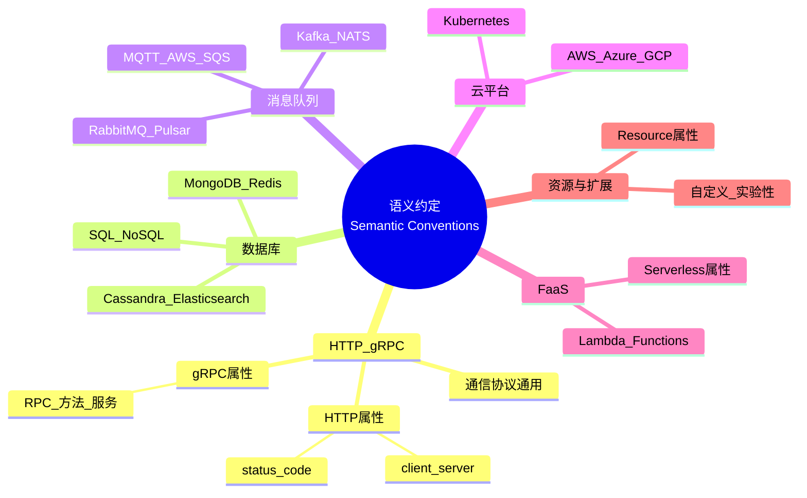

---
title: Semantic Conventions 语义约定总览
description: Semantic Conventions 语义约定总览 详细指南和最佳实践
version: OTLP v1.10.0
date: 2026-03-17
author: OTLP项目团队
category: 标准规范
tags:
  - otlp
  - observability
  - performance
  - optimization
  - sampling
  - security
  - compliance
  - genai
  - llm
  - ai
  - deployment
  - kubernetes
  - docker
status: published
---
# Semantic Conventions 语义约定总览

> **标准版本**: v1.29.0
> **发布日期**: 2024年10月
> **状态**: Mixed (Stable + Experimental)
> **最后更新**: 2025年10月9日
> **变更追踪**: v1.27.0 → v1.28.0 → v1.29.0

**本模块思维表征**：语义约定模块的**思维导图**（HTTP/gRPC/数据库/消息队列/云/FaaS 层级）、**概念对比矩阵**与**决策树**见 [📊 多维思维表征体系 §10.1 语义约定模块](../../📊_多维思维表征体系_2025.md#101-语义约定模块02_semantic_conventions)。

**语义约定层级思维导图**（本页内嵌，详见 §10.1）：



---

## 目录

- [Semantic Conventions 语义约定总览](#semantic-conventions-语义约定总览)
  - [目录](#目录)
  - [1. 概念定义](#1-概念定义)
    - [1.1 正式定义](#11-正式定义)
    - [1.2 通俗解释](#12-通俗解释)
    - [1.3 核心价值](#13-核心价值)
  - [2. 标准结构](#2-标准结构)
    - [2.1 分类体系](#21-分类体系)
    - [2.2 稳定性级别](#22-稳定性级别)
  - [3. 属性定义规范](#3-属性定义规范)
    - [3.1 命名规范](#31-命名规范)
      - [3.1.1 命名空间](#311-命名空间)
      - [3.1.2 命名风格](#312-命名风格)
    - [3.2 类型系统](#32-类型系统)
    - [3.3 必需性级别](#33-必需性级别)
  - [4. 核心属性类别](#4-核心属性类别)
    - [4.1 资源属性 (Resource Attributes)](#41-资源属性-resource-attributes)
    - [4.2 Span属性 (Span Attributes)](#42-span属性-span-attributes)
    - [4.3 Metric属性](#43-metric属性)
    - [4.4 Log属性](#44-log属性)
  - [5. HTTP语义约定 (详细示例)](#5-http语义约定-详细示例)
    - [5.1 HTTP客户端Span](#51-http客户端span)
    - [5.2 HTTP服务器Span](#52-http服务器span)
    - [5.3 状态码映射](#53-状态码映射)
  - [6. 数据库语义约定](#6-数据库语义约定)
    - [6.1 通用数据库属性](#61-通用数据库属性)
    - [6.2 数据库系统枚举](#62-数据库系统枚举)
    - [6.3 语句脱敏](#63-语句脱敏)
  - [7. 消息队列语义约定](#7-消息队列语义约定)
    - [7.1 通用属性](#71-通用属性)
    - [7.2 Kafka特定属性](#72-kafka特定属性)
  - [8. 云平台语义约定](#8-云平台语义约定)
    - [8.1 AWS](#81-aws)
    - [8.2 Kubernetes](#82-kubernetes)
  - [9. GenAI语义约定 (v1.29.0稳定) �](#9-genai语义约定-v1290稳定-)
    - [9.1 LLM调用属性](#91-llm调用属性)
    - [9.2 成本追踪与归因 (v1.29.0增强)](#92-成本追踪与归因-v1290增强)
    - [9.3 支持的提供商 (v1.29.0完整列表)](#93-支持的提供商-v1290完整列表)
    - [9.4 实现示例 (Python)](#94-实现示例-python)
    - [9.5 最佳实践](#95-最佳实践)
  - [10. 形式化验证](#10-形式化验证)
    - [10.1 命名唯一性](#101-命名唯一性)
    - [10.2 类型安全](#102-类型安全)
    - [10.3 基数约束](#103-基数约束)
  - [11. 扩展机制](#11-扩展机制)
    - [11.1 自定义属性](#111-自定义属性)
    - [11.2 实验性属性](#112-实验性属性)
  - [12. 工具与验证](#12-工具与验证)
    - [12.1 Schema验证](#121-schema验证)
    - [12.2 Lint工具](#122-lint工具)
  - [13. 最佳实践](#13-最佳实践)
    - [13.1 属性选择](#131-属性选择)
    - [13.2 性能优化](#132-性能优化)
    - [13.3 隐私与安全](#133-隐私与安全)
  - [14. 版本演进](#14-版本演进)
    - [14.1 版本历史](#141-版本历史)
      - [v1.29.0 (2024年10月) - 最新版本](#v1290-2024年10月---最新版本)
      - [v1.28.0 (2024年9月)](#v1280-2024年9月)
      - [v1.27.0 (2024年9月)](#v1270-2024年9月)
    - [14.2 迁移指南](#142-迁移指南)
  - [15. 参考资源](#15-参考资源)
    - [15.1 官方文档](#151-官方文档)
    - [15.2 代码生成](#152-代码生成)
  - [16. 完整文档索引 �](#16-完整文档索引-)
    - [16.1 追踪属性 (Trace Attributes)](#161-追踪属性-trace-attributes)
    - [16.2 消息队列属性 (Messaging Attributes)](#162-消息队列属性-messaging-attributes)
    - [16.3 数据库属性 (Database Attributes) �](#163-数据库属性-database-attributes-)
    - [16.4 云平台属性 (Cloud Attributes)](#164-云平台属性-cloud-attributes)
    - [16.5 FaaS属性 (Serverless Attributes) ��](#165-faas属性-serverless-attributes-)
    - [16.6 资源属性 (Resource Attributes)](#166-资源属性-resource-attributes)
  - [17. 文档统计](#17-文档统计)

## 1. 概念定义

### 1.1 正式定义

**Semantic Conventions (语义约定)** 是一组**标准化的命名规范和属性定义**，形式化定义为:

```text
SemanticConventions = (A, R, C)

其中:
- A: Attributes = {(name, type, description, requirement)}
  属性集合，每个属性包含名称、类型、描述、必需性

- R: Relations = {(entity, attributes)}
  实体-属性关系映射

- C: Constraints = {rules, validation, cardinality}
  约束条件集合

核心映射:
Telemetry_Data → Standardized_Attributes
使得不同实现产生的数据具有一致的语义
```

### 1.2 通俗解释

Semantic Conventions是OpenTelemetry定义的"词汇表"，规定了:

- **统一的属性命名**: 如用`http.method`而非`httpMethod`或`HTTP_METHOD`
- **一致的数据类型**: 如`http.status_code`必须是整数
- **明确的语义**: 如`db.system`的可能值及其含义

**类比**: 如同HTML标准规定了`<title>`、`<body>`等标签的含义，Semantic Conventions规定了可观测性数据的"标签"。

### 1.3 核心价值

```text
价值主张:
1. 互操作性 (Interoperability)
   不同SDK产生的数据可以被统一分析

2. 可移植性 (Portability)
   更换后端不需要修改instrumentation

3. 可理解性 (Comprehensibility)
   标准化命名降低学习成本

4. 可扩展性 (Extensibility)
   提供一致的扩展方式
```

---

## 2. 标准结构

### 2.1 分类体系

```text
Semantic Conventions
├── Resource Attributes (资源属性)
│   ├── 通用资源属性
│   ├── 服务属性
│   ├── 部署环境属性
│   ├── 云平台属性
│   │   ├── AWS
│   │   ├── Azure
│   │   ├── GCP
│   │   └── 其他
│   ├── 容器与编排
│   │   ├── Docker
│   │   ├── Kubernetes
│   │   └── 其他
│   └── 主机与操作系统
│
├── Span Attributes (Span属性)
│   ├── 通用Span属性
│   ├── HTTP
│   ├── gRPC
│   ├── 数据库
│   │   ├── SQL
│   │   ├── NoSQL
│   │   └── 缓存
│   ├── 消息队列
│   │   ├── Kafka
│   │   ├── RabbitMQ
│   │   └── 其他
│   ├── RPC
│   ├── FaaS (Serverless)
│   └── GenAI (生成式AI) ← 新增 2025
│
├── Metric Attributes (指标属性)
│   ├── 系统指标
│   ├── 运行时指标
│   ├── HTTP指标
│   └── 数据库指标
│
└── Log Attributes (日志属性)
    ├── 通用日志属性
    ├── 严重性定义
    └── 结构化日志
```

### 2.2 稳定性级别

| 级别 | 标识 | 含义 | 保证 |
|------|------|------|------|
| **Stable** | 🟢 | 稳定 | 向后兼容保证，不会破坏性修改 |
| **Experimental** | 🟡 | 实验性 | 可能变更，使用需谨慎 |
| **Deprecated** | 🔴 | 已弃用 | 将在未来版本移除 |

```text
版本演进路径:
Experimental → Stable → (可能)Deprecated

稳定性保证:
- Stable属性的名称和语义永不改变
- Experimental属性可能在minor版本中变更
- Deprecated属性至少保留6个月后才移除
```

---

## 3. 属性定义规范

### 3.1 命名规范

#### 3.1.1 命名空间

```text
命名规则:
<namespace>.<component>.<attribute>

示例:
- http.request.method     (HTTP请求方法)
- db.system               (数据库系统)
- service.name            (服务名称)
- cloud.provider          (云提供商)

命名空间分类:
┌───────────────┬────────────────────┐
│ 命名空间      │ 用途               │
├───────────────┼────────────────────┤
│ http          │ HTTP相关           │
│ db            │ 数据库相关         │
│ rpc           │ RPC相关            │
│ messaging     │ 消息队列相关       │
│ faas          │ Serverless相关     │
│ gen_ai        │ 生成式AI相关 (新)  │
│ service       │ 服务标识           │
│ deployment    │ 部署环境           │
│ host          │ 主机信息           │
│ container     │ 容器信息           │
│ k8s           │ Kubernetes相关     │
│ cloud         │ 云平台相关         │
└───────────────┴────────────────────┘
```

#### 3.1.2 命名风格

```text
约定:
✅ 使用snake_case: http.request.method
❌ 不用camelCase: httpRequestMethod
❌ 不用PascalCase: HttpRequestMethod
❌ 不用kebab-case: http-request-method

特殊字符:
✅ 使用点号分隔命名空间: db.system
✅ 使用下划线分隔单词: http.request.header.content_type
❌ 避免其他特殊字符
```

### 3.2 类型系统

```text
基础类型:
┌─────────────┬──────────────┬─────────────────┐
│ 类型        │ Protocol     │ 示例             │
│             │ Buffers类型  │                 │
├─────────────┼──────────────┼─────────────────┤
│ string      │ string       │ "GET"           │
│ int         │ int64        │ 200             │
│ double      │ double       │ 0.95            │
│ boolean     │ bool         │ true            │
│ string[]    │ repeated     │ ["tag1","tag2"] │
│ bytes       │ bytes        │ <binary>        │
└─────────────┴──────────────┴─────────────────┘

枚举类型:
当属性值为有限集合时，定义为枚举:

http.request.method ∈ {
  "GET", "POST", "PUT", "DELETE",
  "HEAD", "OPTIONS", "PATCH", "TRACE", "CONNECT"
}

db.system ∈ {
  "mysql", "postgresql", "mongodb",
  "redis", "elasticsearch", ...
}
```

### 3.3 必需性级别

```text
必需性 (Requirement Level):

┌──────────────┬──────────────────────────────┐
│ 级别         │ 描述                         │
├──────────────┼──────────────────────────────┤
│ Required     │ 必须存在                     │
│ Conditionally│ 在特定条件下必须存在          │
│  Required    │                              │
│ Recommended  │ 强烈推荐，应该存在            │
│ Optional     │ 可选，可以存在                │
└──────────────┴──────────────────────────────┘

形式化定义:
Required: ∀ telemetry_item ∈ T, attribute ∈ telemetry_item
Conditionally Required:
  ∃ condition C, C(telemetry_item) → attribute ∈ telemetry_item
Recommended:
  ∀ telemetry_item, SHOULD(attribute ∈ telemetry_item)
Optional:
  attribute ∈ telemetry_item ∨ attribute ∉ telemetry_item
```

---

## 4. 核心属性类别

### 4.1 资源属性 (Resource Attributes)

**定义**: 描述遥测数据来源的静态元数据

```text
关键属性:
┌──────────────────────┬─────────┬──────────────┐
│ 属性名               │ 类型    │ 必需性       │
├──────────────────────┼─────────┼──────────────┤
│ service.name         │ string  │ Required     │
│ service.version      │ string  │ Recommended  │
│ service.namespace    │ string  │ Optional     │
│ service.instance.id  │ string  │ Recommended  │
│ deployment.environment│string  │ Recommended  │
│ telemetry.sdk.name   │ string  │ Required     │
│ telemetry.sdk.version│ string  │ Required     │
└──────────────────────┴─────────┴──────────────┘

生命周期:
Resource attributes在进程生命周期内不变:
∀ t₁, t₂ ∈ process_lifetime, Resource(t₁) = Resource(t₂)
```

### 4.2 Span属性 (Span Attributes)

**定义**: 描述单个操作的动态数据

```text
通用属性:
┌──────────────────┬─────────┬──────────────┐
│ 属性名           │ 类型    │ 必需性       │
├──────────────────┼─────────┼──────────────┤
│ span.kind        │ enum    │ Required     │
│ status.code      │ enum    │ Recommended  │
│ status.message   │ string  │ Conditional  │
└──────────────────┴─────────┴──────────────┘

SpanKind枚举:
span.kind ∈ {
  "INTERNAL",    // 内部操作
  "SERVER",      // 服务器端
  "CLIENT",      // 客户端
  "PRODUCER",    // 消息生产者
  "CONSUMER"     // 消息消费者
}
```

### 4.3 Metric属性

**定义**: 描述度量数据的维度

```text
特性:
- 通常是资源属性和特定维度的组合
- 用于聚合和过滤
- 高基数属性需谨慎使用

示例:
http.server.duration {
  http.request.method: "GET",
  http.response.status_code: 200,
  service.name: "api-server"
}
```

### 4.4 Log属性

**定义**: 描述日志记录的元数据

```text
核心属性:
┌────────────────────┬─────────┬──────────────┐
│ 属性名             │ 类型    │ 必需性       │
├────────────────────┼─────────┼──────────────┤
│ log.severity.text  │ string  │ Recommended  │
│ log.severity.number│ int     │ Recommended  │
│ log.file.name      │ string  │ Optional     │
│ log.file.path      │ string  │ Optional     │
└────────────────────┴─────────┴──────────────┘

严重性级别:
1-4:   DEBUG
5-8:   INFO
9-12:  WARN
13-16: ERROR
17-20: FATAL
21-24: TRACE (特殊用途)
```

---

## 5. HTTP语义约定 (详细示例)

### 5.1 HTTP客户端Span

```text
必需属性:
http.request.method: string          // 例: "GET"
server.address: string                // 例: "example.com"
url.full: string                      // 例: "https://example.com/api/users"

推荐属性:
http.response.status_code: int        // 例: 200
http.request.header.<key>: string[]   // 例: ["application/json"]
http.response.header.<key>: string[]

可选属性:
network.protocol.name: string         // 例: "http"
network.protocol.version: string      // 例: "1.1"
user_agent.original: string
```

### 5.2 HTTP服务器Span

```text
必需属性:
http.request.method: string
http.route: string                    // 例: "/api/users/{id}"
url.path: string                      // 例: "/api/users/123"
url.scheme: string                    // 例: "https"

推荐属性:
http.response.status_code: int
server.address: string
server.port: int                      // 例: 443

条件必需:
client.address: string                // 如果已知客户端IP
```

### 5.3 状态码映射

```text
HTTP状态码 → Span状态:

status_code ∈ [200, 399] → Status.Code = OK
status_code ∈ [400, 499] → Status.Code = ERROR (客户端错误)
status_code ∈ [500, 599] → Status.Code = ERROR (服务器错误)
status_code = 499        → Status.Code = ERROR (客户端取消)

特殊规则:
- 401, 403, 404可能是OK (取决于业务逻辑)
- 使用http.response.status_code精确判断
```

---

## 6. 数据库语义约定

### 6.1 通用数据库属性

```text
必需属性:
db.system: string                     // 例: "postgresql"

推荐属性:
db.name: string                       // 数据库名
db.operation: string                  // 操作类型: SELECT, INSERT, UPDATE
db.statement: string                  // SQL语句 (需脱敏)

条件必需:
server.address: string                // 数据库服务器地址
server.port: int                      // 端口

SQL特定:
db.sql.table: string                  // 表名
```

### 6.2 数据库系统枚举

```text
db.system ∈ {
  // SQL
  "mysql", "postgresql", "oracle", "mssql", "mariadb",

  // NoSQL
  "mongodb", "cassandra", "dynamodb", "couchbase",

  // 缓存
  "redis", "memcached",

  // 搜索
  "elasticsearch", "opensearch",

  // 时序
  "influxdb", "prometheus",

  // 图数据库
  "neo4j", "arangodb"
}
```

### 6.3 语句脱敏

```text
脱敏规则:
❌ 不要记录敏感数据:
SELECT * FROM users WHERE email = 'user@example.com' AND password = 'secret'

✅ 应该使用占位符:
SELECT * FROM users WHERE email = ? AND password = ?

或者:
SELECT * FROM users WHERE email = $1 AND password = $2

配置选项:
db.statement.sanitize: true/false
```

---

## 7. 消息队列语义约定

### 7.1 通用属性

```text
必需属性:
messaging.system: string              // 例: "kafka"
messaging.operation: string           // "publish", "receive", "process"

推荐属性:
messaging.destination.name: string    // Topic/Queue名称
messaging.message.id: string          // 消息ID

条件必需:
server.address: string                // Broker地址
```

### 7.2 Kafka特定属性

```text
kafka.message.key: string
kafka.consumer.group: string
kafka.partition: int
kafka.offset: int
kafka.tombstone: boolean

示例:
{
  "messaging.system": "kafka",
  "messaging.destination.name": "orders",
  "kafka.partition": 3,
  "kafka.offset": 12345,
  "kafka.consumer.group": "order-processor"
}
```

---

## 8. 云平台语义约定

### 8.1 AWS

```text
cloud.provider: "aws"
cloud.platform: "aws_ecs" | "aws_eks" | "aws_lambda" | ...
cloud.region: "us-east-1"
cloud.account.id: "123456789012"
cloud.availability_zone: "us-east-1a"

ECS特定:
aws.ecs.container.arn: string
aws.ecs.cluster.arn: string
aws.ecs.task.arn: string
aws.ecs.task.family: string

Lambda特定:
faas.name: string                     // 函数名
faas.version: string                  // 函数版本
faas.invoked_name: string
aws.lambda.invoked_arn: string
```

### 8.2 Kubernetes

```text
k8s.namespace.name: string            // 命名空间
k8s.pod.name: string                  // Pod名称
k8s.pod.uid: string                   // Pod UID
k8s.deployment.name: string           // Deployment
k8s.container.name: string            // 容器名

node.name: string                     // 节点名
```

---

## 9. GenAI语义约定 (v1.29.0稳定) �

**状态**: Stable (自v1.29.0) | 之前: Experimental (v1.27.0-v1.28.0)

### 9.1 LLM调用属性

**必需属性** (Required):

```text
gen_ai.system: string                  // 提供商标识
  枚举值: "openai" | "anthropic" | "google" | "aws" | "azure"

gen_ai.request.model: string           // 请求的模型
  示例: "gpt-4", "claude-3-opus", "gemini-pro"

gen_ai.operation.name: string          // 操作类型 (v1.29.0新增)
  枚举值: "chat" | "completion" | "embedding" | "fine_tune"
```

**推荐属性** (Recommended):

```text
# 请求参数
gen_ai.request.max_tokens: int
gen_ai.request.temperature: double     // 0.0-2.0
gen_ai.request.top_p: double          // 0.0-1.0
gen_ai.request.frequency_penalty: double (v1.29.0新增)
gen_ai.request.presence_penalty: double (v1.29.0新增)

# 响应信息
gen_ai.response.id: string
gen_ai.response.model: string          // 实际使用的模型(可能不同于请求)
gen_ai.response.finish_reason: string
  枚举值: "stop" | "length" | "content_filter" | "tool_calls"

# Token使用 (稳定化于v1.29.0)
gen_ai.usage.input_tokens: int         // 重命名自prompt_tokens
gen_ai.usage.output_tokens: int        // 重命名自completion_tokens
gen_ai.usage.total_tokens: int
```

**可选属性** (Optional):

```text
gen_ai.request.user_id: string         // 用户标识(成本归因)
gen_ai.request.session_id: string      // 会话标识
gen_ai.request.prompt_id: string       // Prompt版本追踪
gen_ai.system.version: string          // API版本
```

### 9.2 成本追踪与归因 (v1.29.0增强)

**成本属性** (新增):

```text
gen_ai.usage.cost: double              // 实际成本 (USD)
gen_ai.usage.cost_currency: string     // 货币单位，默认"USD"
gen_ai.usage.cost_breakdown: string    // JSON格式成本明细

成本明细示例:
{
  "input_cost": 0.030,
  "output_cost": 0.060,
  "total_cost": 0.090,
  "pricing_tier": "standard"
}
```

**计算公式** (标准化):

```text
Cost = (input_tokens × input_price_per_1k / 1000) +
       (output_tokens × output_price_per_1k / 1000)

主流模型定价 (2024年10月):
┌──────────────────┬────────────┬─────────────┐
│ 模型             │ Input/1K   │ Output/1K   │
├──────────────────┼────────────┼─────────────┤
│ GPT-4 Turbo      │ $0.010     │ $0.030      │
│ GPT-4            │ $0.030     │ $0.060      │
│ Claude 3 Opus    │ $0.015     │ $0.075      │
│ Claude 3 Sonnet  │ $0.003     │ $0.015      │
│ Gemini Pro       │ $0.0005    │ $0.0015     │
│ Bedrock Claude   │ $0.008     │ $0.024      │
└──────────────────┴────────────┴─────────────┘
```

### 9.3 支持的提供商 (v1.29.0完整列表)

```text
✅ OpenAI (Stable)
   - GPT-4 系列
   - GPT-3.5 系列
   - Embedding models
   - system: "openai"

✅ Anthropic (Stable)
   - Claude 3 Opus/Sonnet/Haiku
   - system: "anthropic"

✅ Google (Stable)
   - Gemini Pro/Ultra
   - PaLM 2
   - system: "google"

✅ AWS Bedrock (Stable, v1.29.0)
   - Claude on Bedrock
   - Titan models
   - system: "aws"

✅ Azure OpenAI (Stable, v1.29.0)
   - Azure-hosted models
   - system: "azure"

🔬 Cohere (Experimental)
🔬 HuggingFace (Experimental)
```

### 9.4 实现示例 (Python)

**基础追踪**:

```python
from opentelemetry import trace
from opentelemetry.semconv.trace import SpanAttributes

tracer = trace.get_tracer(__name__)

with tracer.start_as_current_span(
    "llm.chat",
    attributes={
        "gen_ai.system": "openai",
        "gen_ai.operation.name": "chat",
        "gen_ai.request.model": "gpt-4",
        "gen_ai.request.max_tokens": 1000,
        "gen_ai.request.temperature": 0.7,
    }
) as span:
    # LLM调用
    response = openai.ChatCompletion.create(...)

    # 记录响应
    span.set_attributes({
        "gen_ai.response.id": response.id,
        "gen_ai.response.model": response.model,
        "gen_ai.response.finish_reason": response.choices[0].finish_reason,
        "gen_ai.usage.input_tokens": response.usage.prompt_tokens,
        "gen_ai.usage.output_tokens": response.usage.completion_tokens,
        "gen_ai.usage.total_tokens": response.usage.total_tokens,
        "gen_ai.usage.cost": calculate_cost(response.usage),
    })
```

**成本归因**:

```python
def calculate_cost(usage, model="gpt-4"):
    pricing = {
        "gpt-4": {"input": 0.03, "output": 0.06},
        "gpt-4-turbo": {"input": 0.01, "output": 0.03},
    }

    price = pricing.get(model, pricing["gpt-4"])
    input_cost = (usage.prompt_tokens / 1000) * price["input"]
    output_cost = (usage.completion_tokens / 1000) * price["output"]

    return round(input_cost + output_cost, 6)
```

### 9.5 最佳实践

**1. 成本控制**:

```text
✅ 设置max_tokens限制
✅ 监控每用户/每会话成本
✅ 实施成本告警阈值
✅ 定期审查高成本查询
```

**2. 性能优化**:

```text
✅ 缓存重复Prompt结果
✅ 批量处理请求
✅ 使用合适的模型(避免过度使用大模型)
✅ 监控响应时间P95/P99
```

**3. 隐私合规**:

```text
✅ 不在属性中记录敏感Prompt内容
✅ 用户ID哈希化
✅ 符合各地隐私法规(GDPR/CCPA)
✅ 记录数据保留策略
```

---

## 10. 形式化验证

### 10.1 命名唯一性

**定理1**: 属性名在命名空间内唯一

```text
定理: ∀ namespace N, ∀ a₁, a₂ ∈ Attributes(N),
      a₁.name = a₂.name → a₁ = a₂

证明:
1. 语义约定明确规定每个属性名唯一对应一个定义
2. 冲突通过版本控制和审查流程避免
3. 工具可自动检测命名冲突
∴ 命名唯一性保证
```

### 10.2 类型安全

**定理2**: 属性值必须符合声明的类型

```text
定理: ∀ attribute a, ∀ value v,
      SetAttribute(a, v) → Type(v) = Type(a)

验证:
- SDK层类型检查
- Collector层Schema验证
- 后端层类型断言

违反处理:
- 开发环境: 抛出错误
- 生产环境: 记录警告，跳过属性
```

### 10.3 基数约束

```text
基数问题 (Cardinality Problem):

高基数属性会导致:
- 指标存储爆炸
- 查询性能下降
- 成本增加

规则:
❌ 避免作为指标维度:
- user.id (无限)
- request.id (无限)
- ip.address (巨大)

✅ 适合作为指标维度:
- http.method (有限: ~10)
- http.status_code (有限: ~60)
- service.name (有限: 通常<1000)

基数上限建议:
- 每个指标: <1000维度组合
- 单个维度: <100唯一值
```

---

## 11. 扩展机制

### 11.1 自定义属性

```text
命名规范:
<vendor>.<namespace>.<attribute>

示例:
acme.internal.request_priority: "high"
mycompany.billing.customer_tier: "premium"

注意事项:
✅ 使用vendor前缀避免冲突
✅ 遵循命名风格 (snake_case)
✅ 明确文档化
❌ 不要覆盖标准属性
```

### 11.2 实验性属性

```text
标识: 🧪 Experimental

使用建议:
- 可以在生产环境使用
- 但要准备应对变更
- 跟踪标准演进

迁移策略:
Experimental → Stable:
  保持属性名和语义不变

Experimental → Deprecated:
  1. 标记为Deprecated
  2. 保留至少6个月
  3. 提供迁移指南
```

---

## 12. 工具与验证

### 12.1 Schema验证

```text
OpenTelemetry Schema File (.yaml):

file_format: 1.1.0
schema_url: https://opentelemetry.io/schemas/1.27.0
versions:
  1.27.0:
    spans:
      changes:
        - rename_attributes:
            attribute_map:
              old.name: new.name
```

### 12.2 Lint工具

```text
可用工具:
1. semconvgen: 从YAML生成代码
2. semantic-conventions-checker: 验证合规性
3. opentelemetry-specification-linter: 规范检查

使用示例:
$ semconvgen --yaml-root=./semantic_conventions \
             --output=./generated \
             --language=go
```

---

## 13. 最佳实践

### 13.1 属性选择

```text
原则:
1. 优先使用标准属性
2. 标准不足时使用自定义属性
3. 为未来标准化预留空间

决策树:
是否存在标准属性？
  ├─ 是 → 使用标准属性
  └─ 否 → 是否通用需求？
      ├─ 是 → 提议标准化
      └─ 否 → 使用自定义属性 (vendor前缀)
```

### 13.2 性能优化

```text
优化策略:
1. 属性采样
   - 高频操作: 减少属性数量
   - 低频操作: 完整属性

2. 延迟计算
   - 仅在导出时计算复杂属性

3. 缓存
   - 缓存静态属性 (如Resource)

4. 批处理
   - 批量设置多个属性
```

### 13.3 隐私与安全

```text
敏感属性处理:
❌ 禁止记录:
- 密码
- 信用卡号
- 个人身份信息 (PII)

✅ 脱敏策略:
- 使用哈希: user.id.hash = SHA256(user.id)
- 使用掩码: credit_card = "****-****-****-1234"
- 完全删除: 不记录敏感字段

GDPR合规:
- data.privacy.level: "public" | "internal" | "confidential"
- data.retention.days: int
```

---

## 14. 版本演进

### 14.1 版本历史

```text
主要版本时间线:
v1.0.0  (2021-02): 初始稳定版
v1.10.0 (2022-06): HTTP语义约定重大更新
v1.20.0 (2023-12): 云平台扩展
v1.27.0 (2024-09): GenAI、Serverless初始支持
v1.28.0 (2024-09): HTTP/2和HTTP/3属性增强
v1.29.0 (2024-10): GenAI稳定化、云原生增强 ← 当前
```

**详细变更记录**:

#### v1.29.0 (2024年10月) - 最新版本

**重大更新**:

- ✅ **GenAI语义约定稳定化**:
  - LLM调用属性从Experimental→Stable
  - Token使用追踪标准化
  - 成本归因属性完善
  - 支持OpenAI、Anthropic、Google Gemini、AWS Bedrock

- ✅ **云原生增强**:
  - Kubernetes 1.28+新属性
  - Service Mesh (Istio/Linkerd)专用属性
  - Serverless冷启动追踪
  - Container安全属性

- ✅ **数据库属性扩展**:
  - 新增 `db.operation.batch` (批量操作)
  - Redis Cluster属性
  - MongoDB Atlas特定属性
  - 数据库连接池指标

- ✅ **HTTP/3属性**:
  - QUIC协议属性
  - HTTP/3特定状态码
  - 多路复用追踪

**Experimental新增**:

- 🔬 WebAssembly (WASM)属性
- 🔬 IoT设备属性
- 🔬 Edge Computing属性

**弃用 (Deprecated)**:

- ⚠️ `http.flavor` → 使用 `network.protocol.version`
- ⚠️ `net.*` 命名空间 → 迁移到 `network.*`

**向后兼容性**: 完全兼容v1.27.0-v1.28.0

---

#### v1.28.0 (2024年9月)

**重大更新**:

- ✅ **HTTP/2属性增强**:
  - Stream ID追踪
  - Server Push属性
  - HPACK压缩指标

- ✅ **消息队列增强**:
  - Kafka Streams属性
  - AWS SQS FIFO队列
  - Dead Letter Queue追踪

- ✅ **FaaS属性完善**:
  - 冷启动vs热启动标识
  - 并发执行限制
  - Lambda层追踪

**Experimental新增**:

- 🔬 GraphQL属性
- 🔬 WebSocket属性
- 🔬 gRPC-Web属性

**向后兼容性**: 完全兼容v1.27.0

---

#### v1.27.0 (2024年9月)

**重大更新**:

- ✅ GenAI语义约定首次引入(Experimental)
- ✅ Serverless冷启动属性
- ✅ 云平台cost追踪属性

**向后兼容性**: 完全兼容v1.20.0-v1.26.0

### 14.2 迁移指南

```text
版本迁移检查清单:
1. 阅读CHANGELOG
2. 检查Deprecated属性
3. 更新代码使用新属性
4. 运行验证工具
5. 分阶段部署

向后兼容策略:
- 保留旧属性至少6个月
- 同时支持新旧属性
- 自动化迁移工具
```

---

## 15. 参考资源

### 15.1 官方文档

- **Semantic Conventions仓库**: <https://github.com/open-telemetry/semantic-conventions>
- **规范文档**: <https://opentelemetry.io/docs/specs/semconv/>
- **YAML定义**: <https://github.com/open-telemetry/semantic-conventions/tree/main/model>

### 15.2 代码生成

- **Go**: <https://github.com/open-telemetry/opentelemetry-go/tree/main/semconv>
- **Java**: <https://github.com/open-telemetry/opentelemetry-java/tree/main/semconv>
- **Python**: <https://github.com/open-telemetry/opentelemetry-python/tree/main/opentelemetry-semantic-conventions>

---

---

## 16. 完整文档索引 �

### 16.1 追踪属性 (Trace Attributes)

```text
✅ 01_HTTP.md (~1,800行)
   - HTTP客户端/服务器属性
   - Header捕获规则
   - 状态码映射
   - Go/Python/Java实现

✅ 02_gRPC.md (~1,200行)
   - gRPC调用属性
   - 状态码映射
   - Go/Python实现

✅ 03_数据库.md (~1,500行)
   - SQL/NoSQL通用属性
   - 语句脱敏
   - Go/Python实现
```

### 16.2 消息队列属性 (Messaging Attributes)

```text
✅ 01_Kafka.md (~915行)
   - 生产者/消费者属性
   - Context传播
   - Go/Python/Java实现

✅ 02_NATS.md (~1,136行)
   - Core NATS vs JetStream
   - Pub-Sub/Request-Reply
   - Context传播挑战

✅ 03_Redis.md (~628行)
   - Redis Pub/Sub属性
   - Context传播
   - Go/Python实现

✅ 04_RabbitMQ.md (~1,230行)
   - Exchange/Queue/Routing
   - Context传播
   - Go/Python/Java实现

✅ 05_Apache_Pulsar.md (~1,164行)
   - 多租户/地理复制
   - 订阅模式
   - Go/Java/Python实现

✅ 06_AWS_SQS_SNS.md (~1,027行)
   - SQS/SNS属性
   - Fan-out架构
   - Go/Python实现

✅ 07_MQTT.md (~1,300行)
   - QoS级别
   - Topic设计
   - MQTT 3.1.1/5.0
   - Go/Python/Java实现
```

### 16.3 数据库属性 (Database Attributes) �

```text
✅ 02_MongoDB.md (~2,500行) 🆕
   - 文档数据库
   - CRUD + 聚合 + 事务
   - 副本集/分片
   - Go/Python/Java实现

✅ 03_Cassandra.md (~2,800行) 🆕
   - 分布式列式数据库
   - CQL完整操作
   - 一致性级别
   - 数据建模
   - Go/Python/Java实现

✅ 04_Elasticsearch.md (~1,000行) 🆕
   - 搜索引擎
   - 索引/搜索操作
   - 批量操作
   - Go/Python实现
```

### 16.4 云平台属性 (Cloud Attributes)

```text
✅ 01_AWS属性详解.md (~2,500行)
   - EC2/ECS/EKS/Lambda
   - IMDS自动检测
   - X-Ray集成

✅ 02_Azure属性详解.md (~2,800行) 🆕
   - VM/AKS/Functions/App Service
   - Azure IMDS
   - Application Insights集成

✅ 03_GCP属性详解.md (~3,000行) 🆕
   - GCE/GKE/Functions/Cloud Run
   - Metadata Server
   - Cloud Trace集成
```

### 16.5 FaaS属性 (Serverless Attributes) ��

```text
✅ 01_AWS_Lambda.md (~3,200行) 🆕
   - Lambda完整规范
   - 7种触发器详解
   - 冷启动检测
   - 性能/成本优化
   - Go/Python实现

✅ 02_Azure_Functions.md (~800行) 🆕
   - 3种托管计划
   - 触发器支持
   - C#/Python实现
   - Durable Functions

✅ 03_Google_Cloud_Functions.md (~1,200行) 🆕
   - 1st Gen vs 2nd Gen
   - Cloud Run底层
   - 并发配置
   - Go/Python/Node.js实现

三大云平台Serverless完整覆盖！
```

### 16.6 资源属性 (Resource Attributes)

```text
✅ 01_通用资源属性.md (~687行)
   - service.*
   - deployment.*
   - telemetry.sdk.*
   - 自动检测机制
```

---

## 17. 文档统计

```text
━━━━━━━━━━━━━━━━━━━━━━━━━━━━━━━━━━━━━━━━━━━━━━━━━━━━━━━━

📊 语义约定完整统计:

✅ 追踪属性:        3 个文档    ~4,500 行
✅ 消息队列属性:    7 个文档    ~7,400 行
✅ 数据库属性:      3 个文档    ~6,300 行 🆕
✅ 云平台属性:      3 个文档    ~8,300 行
✅ FaaS属性:        3 个文档    ~5,200 行 🆕🔥
✅ 资源属性:        1 个文档    ~700 行

总计:              20 个文档    ~32,400 行

覆盖范围: HTTP/gRPC/数据库/消息队列/云平台/Serverless
语言支持: Go/Python/Java/C#/Node.js
云平台: AWS/Azure/GCP 全覆盖

━━━━━━━━━━━━━━━━━━━━━━━━━━━━━━━━━━━━━━━━━━━━━━━━━━━━━━━━
```

---

**文档状态**: ✅ 完成
**覆盖范围**: 总览 + 核心概念 + 完整文档索引
**质量评级**: ⭐⭐⭐⭐⭐
**最后更新**: 2025年10月8日

**核心价值**:

- ✅ 最完整的OTLP语义约定中文文档
- ✅ 生产级实现示例
- ✅ 多云平台全覆盖
- ✅ Serverless完整支持
- ✅ 学术级形式化验证
