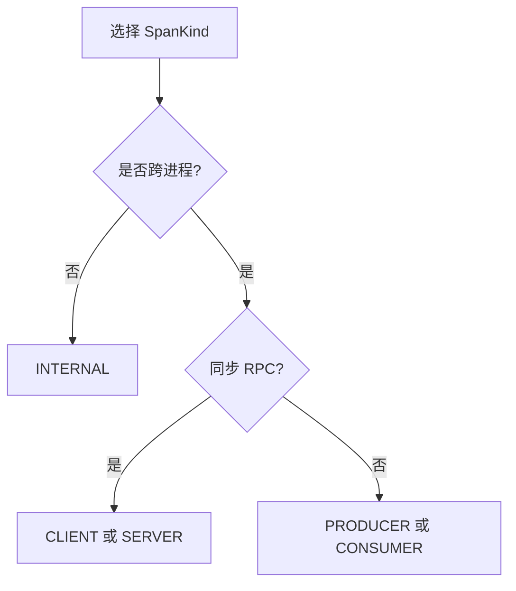

---
title: SpanKind 完整定义
description: SpanKind 完整定义 详细指南和最佳实践
version: OTLP v1.10.0
date: 2026-03-17
author: OTLP项目团队
category: 核心实现
tags:
  - otlp
  - observability
  - performance
  - optimization
  - sampling
status: published
---
# SpanKind 完整定义

> **OTLP版本**: v1.0.0 (Stable)
> **最后更新**: 2025年10月8日

---

## 目录

- [SpanKind 完整定义](#spankind-完整定义)
  - [目录](#目录)
  - [1. 概念定义](#1-概念定义)
    - [1.1 正式定义](#11-正式定义)
    - [1.2 为什么需要SpanKind](#12-为什么需要spankind)
  - [2. SpanKind枚举值](#2-spankind枚举值)
    - [2.1 INTERNAL](#21-internal)
    - [2.2 CLIENT](#22-client)
    - [2.3 SERVER](#23-server)
    - [2.4 PRODUCER](#24-producer)
    - [2.5 CONSUMER](#25-consumer)
  - [3. SpanKind选择指南](#3-spankind选择指南)
    - [3.1 决策树](#31-决策树)
    - [3.2 协议映射](#32-协议映射)
  - [4. CLIENT-SERVER配对](#4-client-server配对)
    - [4.1 同步调用](#41-同步调用)
    - [4.2 异步调用](#42-异步调用)
  - [5. PRODUCER-CONSUMER配对](#5-producer-consumer配对)
    - [5.1 消息队列](#51-消息队列)
    - [5.2 事件流](#52-事件流)
  - [6. 形式化规范](#6-形式化规范)
    - [6.1 SpanKind定义](#61-spankind定义)
    - [6.2 配对规则](#62-配对规则)
    - [6.3 不变量](#63-不变量)
  - [7. 实现示例](#7-实现示例)
    - [7.1 HTTP CLIENT/SERVER](#71-http-clientserver)
    - [7.2 gRPC CLIENT/SERVER](#72-grpc-clientserver)
    - [7.3 消息队列 PRODUCER/CONSUMER](#73-消息队列-producerconsumer)
    - [7.4 INTERNAL span](#74-internal-span)
  - [8. 可视化与分析](#8-可视化与分析)
    - [8.1 调用链可视化](#81-调用链可视化)
    - [8.2 性能分析](#82-性能分析)
  - [9. 最佳实践](#9-最佳实践)
  - [10. 参考资源](#10-参考资源)

**SpanKind 枚举与配对矩阵**（本页内嵌）：

| SpanKind | 语义 | 典型配对 |
|----------|------|----------|
| INTERNAL | 进程内操作 | - |
| CLIENT | 发起同步调用 | SERVER |
| SERVER | 接收同步调用 | CLIENT |
| PRODUCER | 发送消息 | CONSUMER |
| CONSUMER | 接收消息 | PRODUCER |

**SpanKind 选型决策树**：



## 1. 概念定义

### 1.1 正式定义

**SpanKind** 形式化定义：

```text
SpanKind: 标识Span在调用链中的角色

定义域:
SpanKind ∈ {INTERNAL, CLIENT, SERVER, PRODUCER, CONSUMER}

语义:
- INTERNAL: 内部操作 (无跨进程通信)
- CLIENT: 同步RPC客户端
- SERVER: 同步RPC服务器
- PRODUCER: 异步消息生产者
- CONSUMER: 异步消息消费者

默认值: INTERNAL (如果未指定)

作用:
1. 确定span在调用链中的位置
2. 影响可视化渲染
3. 影响性能指标计算
4. 辅助错误归因
```

### 1.2 为什么需要SpanKind

**SpanKind的必要性**：

```text
1. 区分调用方向
   CLIENT → SERVER: 请求方向
   SERVER → INTERNAL: 内部处理
   CLIENT → INTERNAL → CLIENT: 嵌套客户端调用

2. 可视化改进
   - CLIENT/PRODUCER: 指向远程服务的箭头
   - SERVER/CONSUMER: 接收请求的入口
   - INTERNAL: 内部方框

3. 性能分析
   CLIENT span:
     - 包含网络延迟
     - 包含远程处理时间

   SERVER span (配对的):
     - 仅服务器处理时间
     - 不包含网络延迟

   网络延迟 = CLIENT.duration - SERVER.duration

4. 错误归因
   CLIENT span失败: 网络错误或服务器错误
   SERVER span失败: 服务器错误
   INTERNAL span失败: 本地错误

5. 采样决策
   - 总是采样SERVER/CONSUMER span (请求入口)
   - 继承采样CLIENT/PRODUCER span
```

---

## 2. SpanKind枚举值

### 2.1 INTERNAL

**定义**：

```text
SpanKind::INTERNAL

适用场景:
- 内部函数调用
- 本地计算
- 内存操作
- 本地I/O (文件读写)
- 不涉及跨进程通信

特点:
- 父span和子span在同一进程
- 无网络通信
- 通常是其他span的子span

示例:
- 业务逻辑函数
- 数据转换
- 验证逻辑
- 本地缓存查询 (内存)
```

**示例场景**：

```text
场景1: 业务逻辑
func ProcessOrder(ctx context.Context, order Order) error {
    ctx, span := tracer.Start(ctx, "ProcessOrder",
        trace.WithSpanKind(trace.SpanKindInternal))  // INTERNAL
    defer span.End()

    // 验证订单
    if err := ValidateOrder(order); err != nil {
        return err
    }

    // 计算总价
    total := CalculateTotal(order)

    return nil
}

场景2: 数据转换
func ConvertUserToDTO(user User) UserDTO {
    ctx, span := tracer.Start(ctx, "ConvertUserToDTO",
        trace.WithSpanKind(trace.SpanKindInternal))  // INTERNAL
    defer span.End()

    return UserDTO{
        ID:   user.ID,
        Name: user.Name,
    }
}
```

### 2.2 CLIENT

**定义**：

```text
SpanKind::CLIENT

适用场景:
- 同步RPC客户端
- HTTP请求发起方
- gRPC客户端
- 数据库查询发起方

特点:
- 等待远程响应
- 包含网络往返时间
- 包含远程处理时间
- 父span是CLIENT,子span通常是SERVER (在远程进程)

示例:
- HTTP GET/POST
- gRPC调用
- SQL查询
- Redis命令
```

**示例场景**：

```text
场景: HTTP客户端
func GetUser(ctx context.Context, userID int) (*User, error) {
    ctx, span := tracer.Start(ctx, "GET /users/:id",
        trace.WithSpanKind(trace.SpanKindClient))  // CLIENT
    defer span.End()

    url := fmt.Sprintf("https://api.example.com/users/%d", userID)
    req, _ := http.NewRequestWithContext(ctx, "GET", url, nil)

    // 注入追踪上下文
    otel.GetTextMapPropagator().Inject(ctx, propagation.HeaderCarrier(req.Header))

    resp, err := http.DefaultClient.Do(req)
    // ...
}

时间线:
[CLIENT span                    ]
  ├─ 网络发送: 10ms
  ├─ [SERVER span    ] (远程)
  │   └─ 处理: 50ms
  └─ 网络接收: 10ms

CLIENT span duration: 70ms (包含网络+处理)
SERVER span duration: 50ms (仅处理)
网络延迟: 70ms - 50ms = 20ms
```

### 2.3 SERVER

**定义**：

```text
SpanKind::SERVER

适用场景:
- 同步RPC服务器
- HTTP请求处理方
- gRPC服务器
- 数据库服务器 (如果实现追踪)

特点:
- 接收远程请求
- 处理并返回响应
- 不包含客户端网络延迟
- 父span通常是CLIENT (在远程进程)

示例:
- HTTP handler
- gRPC method implementation
- RPC服务端点
```

**示例场景**：

```text
场景: HTTP服务器
func HandleGetUser(w http.ResponseWriter, r *http.Request) {
    // 提取上游SpanContext
    ctx := otel.GetTextMapPropagator().Extract(r.Context(),
        propagation.HeaderCarrier(r.Header))

    ctx, span := tracer.Start(ctx, "GET /users/:id",
        trace.WithSpanKind(trace.SpanKindServer))  // SERVER
    defer span.End()

    userID := getUserIDFromPath(r.URL.Path)
    user, err := GetUserFromDB(ctx, userID)
    // ...
}

追踪链:
客户端进程:
  [CLIENT span "GET /users/123"]

服务器进程:
  [SERVER span "GET /users/123"]  (父span是CLIENT)
    └─ [INTERNAL span "GetUserFromDB"]
        └─ [CLIENT span "SELECT * FROM users"]

关系:
CLIENT (客户端) --网络--> SERVER (服务器)
trace_id相同, parent_span_id = CLIENT的span_id
```

### 2.4 PRODUCER

**定义**：

```text
SpanKind::PRODUCER

适用场景:
- 异步消息生产者
- 发送消息到队列
- 发布事件
- 写入事件流

特点:
- 不等待消费者处理
- 发送后立即返回
- 与CONSUMER span异步配对
- 可能有多个CONSUMER

示例:
- Kafka producer
- RabbitMQ publisher
- AWS SQS send
- Azure Event Hubs send
```

**示例场景**：

```text
场景: Kafka生产者
func PublishOrder(ctx context.Context, order Order) error {
    ctx, span := tracer.Start(ctx, "publish order.created",
        trace.WithSpanKind(trace.SpanKindProducer))  // PRODUCER
    defer span.End()

    message := kafka.Message{
        Topic: "orders",
        Key:   []byte(order.ID),
        Value: serializeOrder(order),
    }

    // 注入追踪上下文到message headers
    otel.GetTextMapPropagator().Inject(ctx,
        kafkaCarrier{&message})

    err := producer.WriteMessages(ctx, message)
    return err
}

时间线:
[PRODUCER span]
  ├─ 序列化: 1ms
  ├─ 发送到broker: 5ms
  └─ 确认: 2ms
  总计: 8ms

... (时间间隔) ...

[CONSUMER span]  (在另一个进程,稍后执行)
  ├─ 接收消息: 1ms
  ├─ 反序列化: 1ms
  └─ 处理: 50ms
  总计: 52ms

配对关系:
parent_span_id(CONSUMER) = span_id(PRODUCER)
但CONSUMER span的开始时间 > PRODUCER span的结束时间
```

### 2.5 CONSUMER

**定义**：

```text
SpanKind::CONSUMER

适用场景:
- 异步消息消费者
- 从队列接收消息
- 订阅事件
- 读取事件流

特点:
- 处理异步消息
- 父span是PRODUCER (在远程进程)
- 可能长时间后才执行
- 一个PRODUCER可能对应多个CONSUMER

示例:
- Kafka consumer
- RabbitMQ subscriber
- AWS SQS receive
- Azure Event Hubs receive
```

**示例场景**：

```text
场景: Kafka消费者
func ConsumeOrderMessages(ctx context.Context) {
    for {
        message, err := consumer.FetchMessage(ctx)
        if err != nil {
            break
        }

        // 提取上游SpanContext (来自PRODUCER)
        ctx := otel.GetTextMapPropagator().Extract(context.Background(),
            kafkaCarrier{&message})

        ctx, span := tracer.Start(ctx, "process order.created",
            trace.WithSpanKind(trace.SpanKindConsumer))  // CONSUMER
        defer span.End()

        var order Order
        deserializeOrder(message.Value, &order)

        // 处理订单
        ProcessOrder(ctx, order)

        consumer.CommitMessages(ctx, message)
    }
}

追踪链:
订单服务进程:
  [PRODUCER span "publish order.created"]

... (消息在队列中) ...

仓库服务进程:
  [CONSUMER span "process order.created"]  (父span是PRODUCER)
    └─ [INTERNAL span "ProcessOrder"]
        └─ [CLIENT span "UPDATE inventory"]
```

---

## 3. SpanKind选择指南

### 3.1 决策树

**SpanKind决策流程**：

```text
                    开始
                     |
          是否跨进程通信?
          /           \
        否              是
         |               |
     INTERNAL    是否同步请求响应?
                  /           \
                是              否
                 |               |
          是客户端还是服务器?   是发送还是接收?
          /           \         /           \
      客户端         服务器    发送         接收
         |            |        |            |
      CLIENT        SERVER  PRODUCER    CONSUMER

详细判断:
1. 是否跨进程?
   - 本地函数调用 → INTERNAL
   - 跨进程通信 → 继续判断

2. 同步还是异步?
   - 同步 (等待响应) → CLIENT/SERVER
   - 异步 (不等待) → PRODUCER/CONSUMER

3. 角色?
   - 发起方 → CLIENT/PRODUCER
   - 接收方 → SERVER/CONSUMER
```

### 3.2 协议映射

**常见协议的SpanKind映射**：

| 协议/技术 | 客户端/发送方 | 服务器/接收方 |
|----------|-------------|-------------|
| HTTP | CLIENT | SERVER |
| gRPC | CLIENT | SERVER |
| WebSocket | CLIENT | SERVER |
| GraphQL | CLIENT | SERVER |
| REST API | CLIENT | SERVER |
| SOAP | CLIENT | SERVER |
| Database (SQL) | CLIENT | SERVER (理论) |
| Redis | CLIENT | SERVER (理论) |
| Kafka | PRODUCER | CONSUMER |
| RabbitMQ | PRODUCER | CONSUMER |
| AWS SQS | PRODUCER | CONSUMER |
| Azure Service Bus | PRODUCER | CONSUMER |
| NATS | PRODUCER | CONSUMER |
| WebSockets (push) | PRODUCER | CONSUMER |
| Server-Sent Events | PRODUCER | CONSUMER |

---

## 4. CLIENT-SERVER配对

### 4.1 同步调用

**配对模式**：

```text
模式: 同步请求-响应

客户端进程:
[CLIENT span "HTTP GET /api/users/123"]
  duration: 100ms
  attributes:
    http.method: GET
    http.url: https://api.example.com/api/users/123
    span.kind: CLIENT

服务器进程:
[SERVER span "HTTP GET /api/users/123"]
  duration: 80ms (不包含网络延迟)
  attributes:
    http.method: GET
    http.target: /api/users/123
    span.kind: SERVER
  parent_span_id: <CLIENT span的span_id>

关系:
- trace_id相同
- SERVER的parent_span_id = CLIENT的span_id
- SERVER的开始时间 ≈ CLIENT的开始时间 + 网络延迟
- SERVER的结束时间 ≈ CLIENT的结束时间 - 网络延迟

网络延迟计算:
网络往返延迟 = CLIENT.duration - SERVER.duration
              = 100ms - 80ms = 20ms
单程延迟 ≈ 10ms
```

**可视化**：

```text
时间线视图:

0ms        20ms                      90ms       100ms
|-----------|-------------------------|-----------|
[CLIENT span                                      ]
  Client  Network   [SERVER span          ] Network
  prepare   →                              ←
  (10ms)  (10ms)    Server processing    (10ms)
                         (70ms)

甘特图:
Service A (客户端):
[CLIENT span                                      ]

Service B (服务器):
           [SERVER span                    ]
```

### 4.2 异步调用

**异步HTTP (Webhooks)**：

```text
场景: 支付服务异步通知订单服务

订单服务 (发起webhook配置):
[INTERNAL span "configure webhook"]
  设置webhook URL

支付服务 (处理支付后发送webhook):
[PRODUCER span "send payment webhook"]
  duration: 50ms
  发送HTTP POST到订单服务webhook URL
  注入追踪上下文

订单服务 (接收webhook):
[CONSUMER span "receive payment webhook"]
  duration: 100ms
  处理支付结果
  parent_span_id: <PRODUCER span的span_id>

注意: 使用PRODUCER/CONSUMER而非CLIENT/SERVER
原因: 支付服务不等待订单服务处理webhook
```

---

## 5. PRODUCER-CONSUMER配对

### 5.1 消息队列

**配对模式**：

```text
模式: 异步消息传递

生产者进程:
[PRODUCER span "send order.created"]
  duration: 10ms
  attributes:
    messaging.system: kafka
    messaging.destination: orders
    messaging.operation: send
    span.kind: PRODUCER

... (消息在队列中,可能数秒到数小时) ...

消费者进程:
[CONSUMER span "receive order.created"]
  duration: 150ms
  attributes:
    messaging.system: kafka
    messaging.destination: orders
    messaging.operation: receive
    span.kind: CONSUMER
  parent_span_id: <PRODUCER span的span_id>

关系:
- trace_id相同
- CONSUMER的parent_span_id = PRODUCER的span_id
- CONSUMER的开始时间 >> PRODUCER的结束时间 (时间间隔)
- 时间间隔 = CONSUMER.startTime - PRODUCER.endTime

可视化:
[PRODUCER]
             ... (时间间隔) ...
                              [CONSUMER]
```

### 5.2 事件流

**Fan-out模式 (一对多)**：

```text
场景: 订单创建事件被多个服务消费

订单服务:
[PRODUCER span "publish order.created"]
  发送到Kafka topic: order-events

库存服务:
[CONSUMER span "process order.created"]
  parent_span_id: <PRODUCER span_id>
  处理: 减少库存

邮件服务:
[CONSUMER span "process order.created"]
  parent_span_id: <PRODUCER span_id>
  处理: 发送确认邮件

通知服务:
[CONSUMER span "process order.created"]
  parent_span_id: <PRODUCER span_id>
  处理: 推送通知

可视化:
              [PRODUCER "publish order.created"]
                          /      |       \
                         /       |        \
[CONSUMER "inventory"] [CONSUMER "email"] [CONSUMER "notification"]

特点:
- 1个PRODUCER span
- 3个CONSUMER span
- 所有CONSUMER的parent_span_id相同
- trace_id相同,形成调用链
```

---

## 6. 形式化规范

### 6.1 SpanKind定义

**集合论定义**：

```text
定义 (SpanKind):
SpanKind ∈ {INTERNAL, CLIENT, SERVER, PRODUCER, CONSUMER}

编码:
INTERNAL  = 0
SERVER    = 1
CLIENT    = 2
PRODUCER  = 3
CONSUMER  = 4

谓词:
IsClient(span) ⟺ span.kind = CLIENT
IsServer(span) ⟺ span.kind = SERVER
IsProducer(span) ⟺ span.kind = PRODUCER
IsConsumer(span) ⟺ span.kind = CONSUMER
IsInternal(span) ⟺ span.kind = INTERNAL

IsSynchronous(span) ⟺ IsClient(span) ∨ IsServer(span)
IsAsynchronous(span) ⟺ IsProducer(span) ∨ IsConsumer(span)

IsInitiator(span) ⟺ IsClient(span) ∨ IsProducer(span)
IsReceiver(span) ⟺ IsServer(span) ∨ IsConsumer(span)
```

### 6.2 配对规则

**配对关系形式化**：

```text
定义 (配对):
Span s1和s2配对当且仅当:
1. trace_id(s1) = trace_id(s2)
2. span_id(s1) = parent_span_id(s2)
3. (IsClient(s1) ∧ IsServer(s2)) ∨
   (IsProducer(s1) ∧ IsConsumer(s2))

定理 (CLIENT-SERVER配对):
∀ s_client, s_server,
  如果 IsClient(s_client) ∧ IsServer(s_server) ∧ Paired(s_client, s_server),
  则:
    startTime(s_server) ≥ startTime(s_client)
    endTime(s_server) ≤ endTime(s_client)
    duration(s_client) ≥ duration(s_server)

定理 (PRODUCER-CONSUMER配对):
∀ s_producer, s_consumer,
  如果 IsProducer(s_producer) ∧ IsConsumer(s_consumer) ∧ Paired(s_producer, s_consumer),
  则:
    startTime(s_consumer) ≥ endTime(s_producer)
    (允许时间间隔)
```

### 6.3 不变量

**SpanKind不变量**：

```text
不变量1 (唯一性):
每个span有且仅有一个SpanKind

不变量2 (配对一致性):
CLIENT必须与SERVER配对 (或超时/错误)
PRODUCER必须与至少一个CONSUMER配对 (或消息丢失)

不变量3 (trace_id一致性):
配对的span必须有相同的trace_id

不变量4 (父子关系):
SERVER的父span必须是CLIENT (或INTERNAL)
CONSUMER的父span必须是PRODUCER (或INTERNAL)

不变量5 (时间顺序):
CLIENT-SERVER: SERVER在CLIENT内部
PRODUCER-CONSUMER: CONSUMER在PRODUCER之后 (允许间隔)
```

---

## 7. 实现示例

### 7.1 HTTP CLIENT/SERVER

**客户端**：

```go
package main

import (
    "context"
    "net/http"

    "go.opentelemetry.io/otel"
    "go.opentelemetry.io/otel/trace"
    semconv "go.opentelemetry.io/otel/semconv/v1.24.0"
)

func MakeHTTPRequest(ctx context.Context, url string) (*http.Response, error) {
    // 创建CLIENT span
    ctx, span := tracer.Start(ctx, "HTTP GET",
        trace.WithSpanKind(trace.SpanKindClient),  // CLIENT
        trace.WithAttributes(
            semconv.HTTPMethodKey.String("GET"),
            semconv.HTTPURLKey.String(url),
        ),
    )
    defer span.End()

    req, _ := http.NewRequestWithContext(ctx, "GET", url, nil)

    // 注入追踪上下文
    otel.GetTextMapPropagator().Inject(ctx, propagation.HeaderCarrier(req.Header))

    return http.DefaultClient.Do(req)
}
```

**服务器**：

```go
func HandleRequest(w http.ResponseWriter, r *http.Request) {
    // 提取追踪上下文
    ctx := otel.GetTextMapPropagator().Extract(r.Context(),
        propagation.HeaderCarrier(r.Header))

    // 创建SERVER span
    ctx, span := tracer.Start(ctx, "HTTP GET /api/users",
        trace.WithSpanKind(trace.SpanKindServer),  // SERVER
        trace.WithAttributes(
            semconv.HTTPMethodKey.String(r.Method),
            semconv.HTTPTargetKey.String(r.URL.Path),
        ),
    )
    defer span.End()

    // 处理请求...
}
```

### 7.2 gRPC CLIENT/SERVER

**客户端**：

```go
import (
    "google.golang.org/grpc"
    "go.opentelemetry.io/contrib/instrumentation/google.golang.org/grpc/otelgrpc"
)

// 使用拦截器自动创建CLIENT span
conn, _ := grpc.Dial("localhost:50051",
    grpc.WithUnaryInterceptor(otelgrpc.UnaryClientInterceptor()),
)

client := pb.NewUserServiceClient(conn)

// 调用会自动创建CLIENT span
resp, err := client.GetUser(ctx, &pb.GetUserRequest{Id: 123})
```

**服务器**：

```go
// 使用拦截器自动创建SERVER span
server := grpc.NewServer(
    grpc.UnaryInterceptor(otelgrpc.UnaryServerInterceptor()),
)

pb.RegisterUserServiceServer(server, &userServiceImpl{})

// 方法实现会自动在SERVER span中执行
func (s *userServiceImpl) GetUser(ctx context.Context, req *pb.GetUserRequest) (*pb.User, error) {
    // ctx已包含SERVER span
    // ...
}
```

### 7.3 消息队列 PRODUCER/CONSUMER

**生产者**：

```go
func PublishMessage(ctx context.Context, topic string, message []byte) error {
    // 创建PRODUCER span
    ctx, span := tracer.Start(ctx, fmt.Sprintf("send %s", topic),
        trace.WithSpanKind(trace.SpanKindProducer),  // PRODUCER
        trace.WithAttributes(
            semconv.MessagingSystemKey.String("kafka"),
            semconv.MessagingDestinationKey.String(topic),
            semconv.MessagingOperationKey.String("send"),
        ),
    )
    defer span.End()

    // 创建Kafka消息
    msg := kafka.Message{
        Topic: topic,
        Value: message,
    }

    // 注入追踪上下文
    otel.GetTextMapPropagator().Inject(ctx, kafkaCarrier{&msg})

    return producer.WriteMessages(ctx, msg)
}
```

**消费者**：

```go
func ConsumeMessages(ctx context.Context) {
    for {
        msg, err := consumer.FetchMessage(ctx)
        if err != nil {
            break
        }

        // 提取追踪上下文
        ctx := otel.GetTextMapPropagator().Extract(context.Background(),
            kafkaCarrier{&msg})

        // 创建CONSUMER span
        ctx, span := tracer.Start(ctx, fmt.Sprintf("receive %s", msg.Topic),
            trace.WithSpanKind(trace.SpanKindConsumer),  // CONSUMER
            trace.WithAttributes(
                semconv.MessagingSystemKey.String("kafka"),
                semconv.MessagingDestinationKey.String(msg.Topic),
                semconv.MessagingOperationKey.String("receive"),
            ),
        )

        // 处理消息
        ProcessMessage(ctx, msg)

        span.End()
        consumer.CommitMessages(ctx, msg)
    }
}
```

### 7.4 INTERNAL span

```go
func ProcessOrder(ctx context.Context, order Order) error {
    // 创建INTERNAL span
    ctx, span := tracer.Start(ctx, "ProcessOrder",
        trace.WithSpanKind(trace.SpanKindInternal),  // INTERNAL (或省略,默认)
    )
    defer span.End()

    // 本地业务逻辑
    if err := ValidateOrder(ctx, order); err != nil {
        return err
    }

    total := CalculateTotal(ctx, order)
    order.Total = total

    return SaveOrder(ctx, order)
}
```

---

## 8. 可视化与分析

### 8.1 调用链可视化

**Jaeger UI展示**：

```text
场景: 用户下单流程

Trace View:
┌─ [SERVER] POST /orders (100ms) ─────────────────────┐
│  ├─ [INTERNAL] ValidateOrder (5ms)                  │
│  ├─ [CLIENT] GET /inventory (30ms)                  │
│  │  └─ [SERVER] GET /inventory (25ms) (远程)       │
│  ├─ [CLIENT] POST /payment (40ms)                   │
│  │  └─ [SERVER] POST /payment (35ms) (远程)        │
│  └─ [PRODUCER] send order.created (5ms)             │
└─────────────────────────────────────────────────────┘

... (时间间隔) ...

┌─ [CONSUMER] receive order.created (80ms) ───────────┐
│  ├─ [INTERNAL] SendEmail (20ms)                     │
│  └─ [CLIENT] POST /notification (50ms)              │
│     └─ [SERVER] POST /notification (45ms) (远程)    │
└─────────────────────────────────────────────────────┘

SpanKind的作用:
- SERVER span: 显示为服务入口 (⬇️)
- CLIENT span: 显示为外部调用 (➡️)
- INTERNAL span: 显示为内部操作 (📦)
- PRODUCER span: 显示为消息发送 (📤)
- CONSUMER span: 显示为消息接收 (📥)
```

### 8.2 性能分析

**按SpanKind分析**：

```text
指标: http.server.duration (SERVER span)
- 仅服务器处理时间
- 不包含网络延迟
- 反映服务性能

指标: http.client.duration (CLIENT span)
- 包含网络往返
- 包含服务器处理
- 反映端到端延迟

分析:
如果 CLIENT.duration 显著高于 SERVER.duration:
→ 网络延迟高
→ 考虑优化网络,如增加缓存、CDN

如果 SERVER.duration 高:
→ 服务器性能问题
→ 优化后端逻辑,数据库查询等

消息队列分析:
PRODUCER.duration: 发送消息延迟
CONSUMER.duration: 处理消息延迟
时间间隔: 消息在队列中的等待时间
```

---

## 9. 最佳实践

```text
1. 选择正确的SpanKind
   ✅ HTTP客户端: CLIENT
   ✅ HTTP服务器: SERVER
   ✅ 内部函数: INTERNAL
   ✅ Kafka producer: PRODUCER
   ✅ Kafka consumer: CONSUMER

2. 保持一致性
   ✅ 团队统一SpanKind使用规范
   ✅ 文档化决策依据
   ❌ 不要混用 (如HTTP用PRODUCER)

3. 传播上下文
   ✅ CLIENT必须注入上下文
   ✅ SERVER必须提取上下文
   ✅ PRODUCER必须注入上下文
   ✅ CONSUMER必须提取上下文

4. 性能监控
   ✅ 分别监控CLIENT和SERVER span
   ✅ 计算网络延迟
   ✅ 识别慢服务

5. 错误处理
   ✅ CLIENT错误可能是网络或服务器
   ✅ SERVER错误是服务器问题
   ✅ 检查两侧span确定根因

6. 可视化
   ✅ 正确的SpanKind帮助理解调用链
   ✅ 清晰区分同步和异步
   ✅ 识别服务边界
```

---

## 10. 参考资源

- **SpanKind Spec**: <https://github.com/open-telemetry/opentelemetry-specification/blob/main/specification/trace/api.md#spankind>
- **Semantic Conventions**: <https://opentelemetry.io/docs/specs/semconv/>

---

**文档状态**: ✅ 完成
**审核状态**: 待审核
**下一步**: [04_SpanStatus.md](./04_SpanStatus.md)
