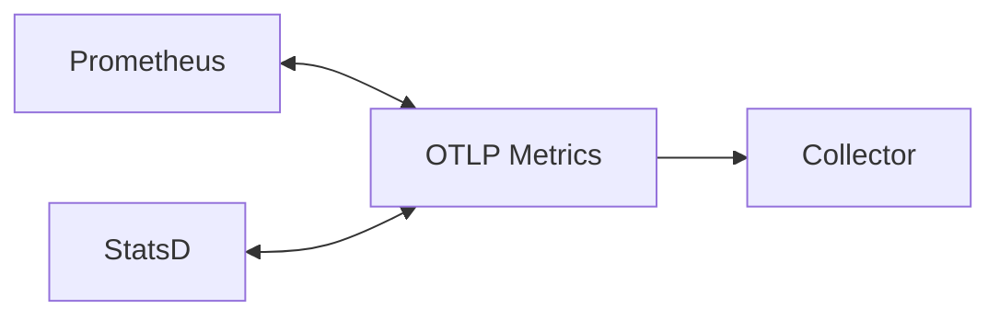

---
title: Pre-aggregation 与 Prometheus/StatsD 双向映射
description: Pre-aggregation 与 Prometheus/StatsD 双向映射 详细指南和最佳实践
version: OTLP v1.9.0
date: 2026-03-17
author: OTLP项目团队
category: 核心实现
tags:
  - otlp
  - observability
  - sampling
  - performance
status: published
---
# Pre-aggregation 与 Prometheus/StatsD 双向映射

> **覆盖范围**: OTLP Metrics Data Model（pre-aggregated 时序、与 Prometheus/StatsD 双向映射）
> **权威参考**: [OpenTelemetry Metrics 规范](https://opentelemetry.io/docs/specs/otel/metrics/)、[Prometheus Remote Write](https://prometheus.io/docs/prometheus/latest/configuration/configuration/#remote_write)、[OTel Collector 文档](https://opentelemetry.io/docs/collector/)
> **最后更新**: 2025-02-10

---

## 目录

- [Pre-aggregation 与 Prometheus/StatsD 双向映射](#pre-aggregation-与-prometheusstatsd-双向映射)
  - [目录](#目录)
  - [1. Pre-aggregated 时序在 OTLP 中的表示](#1-pre-aggregated-时序在-otlp-中的表示)
    - [1.1 概念](#11-概念)
    - [1.2 在 OTLP 中的表示方式](#12-在-otlp-中的表示方式)
    - [1.3 小结表](#13-小结表)
  - [2. 与 Prometheus 的双向映射](#2-与-prometheus-的双向映射)
    - [2.1 权威来源](#21-权威来源)
    - [2.2 类型与语义映射](#22-类型与语义映射)
    - [2.3 Prometheus → OTLP（采集/Remote Read 场景）](#23-prometheus--otlp采集remote-read-场景)
    - [2.4 OTLP → Prometheus（导出/Remote Write 场景）](#24-otlp--prometheus导出remote-write-场景)
    - [2.5 双向映射小结](#25-双向映射小结)
  - [3. 与 StatsD 的双向映射](#3-与-statsd-的双向映射)
    - [3.1 权威来源](#31-权威来源)
    - [3.2 类型与语义映射](#32-类型与语义映射)
    - [3.3 StatsD → OTLP（接收）](#33-statsd--otlp接收)
    - [3.4 OTLP → StatsD（导出）](#34-otlp--statsd导出)
    - [3.5 双向映射小结](#35-双向映射小结)
  - [4. 参考资源](#4-参考资源)

**Pre-aggregation 与生态映射矩阵**（本页内嵌）：

| 方向 | Prometheus | StatsD |
|------|------------|--------|
| → OTLP | Remote Read / 采集 | Receiver 接收 |
| OTLP → | Remote Write / 导出 | Exporter 导出 |
| 聚合临时性 | Cumulative / Delta | 计数器/计时器/ gauge 映射 |

**数据流简图**：

---

## 1. Pre-aggregated 时序在 OTLP 中的表示

### 1.1 概念

**Pre-aggregation** 指在采集端或 Collector 端对原始观测值先做聚合（如按时间窗口、按维度），再以 OTLP 上报的时序数据。OTLP Metrics 数据模型原生支持此类数据，无需“原始事件”即可表达聚合结果。

### 1.2 在 OTLP 中的表示方式

- **DataPoint 与聚合临时性**
  - 每个 [NumberDataPoint](https://github.com/open-telemetry/opentelemetry-proto/blob/main/opentelemetry/proto/metrics/v1/metrics.proto)、[HistogramDataPoint](https://github.com/open-telemetry/opentelemetry-proto/blob/main/opentelemetry/proto/metrics/v1/metrics.proto) 等均表示**已聚合**的一个时间点（或时间区间）的度量值。
  - **aggregation_temporality** 区分语义：
    - **Cumulative**：从固定起点到当前时刻的累积聚合（如 Counter 的单调递增和、Histogram 的累积桶）。
    - **Delta**：上一报告周期内的增量聚合。
  - 因此，OTLP 中的每个 DataPoint 本身就是“预聚合”后的一个数据点；多段 Delta 或单段 Cumulative 均可由 SDK/Collector 在本地或边缘完成聚合后上报。

- **ResourceMetrics / ScopeMetrics / Metric**
  - 预聚合结果仍按 Resource → Scope(InstrumentationScope) → Metric → DataPoint 层级组织；同一 Metric 下的多个 DataPoint（不同 attribute 组合或不同时间戳）即多条时序。

- **与原始事件的边界**
  - OTLP Metrics 不传输“每条原始事件”，只传输聚合后的 DataPoint；若需关联原始事件，可依赖 **Exemplars**（见 [10_Metrics_Exemplars详解](../10_Metrics_Exemplars详解.md)）指向 Trace/Span。

### 1.3 小结表

| 维度 | OTLP 中的表示 |
|------|----------------|
| 聚合结果 | DataPoint（NumberDataPoint / HistogramDataPoint / ExponentialHistogramDataPoint） |
| 聚合语义 | aggregation_temporality：Cumulative / Delta |
| 时间 | DataPoint 的 start_time_unix_nano、time_unix_nano |
| 维度 | DataPoint.attributes（键值对标识时序） |
| 原始事件关联 | Exemplars（可选，含 trace_id/span_id） |

---

## 2. 与 Prometheus 的双向映射

### 2.1 权威来源

- Prometheus 指标类型与 Remote Write：<https://prometheus.io/docs/concepts/metric_types/>、<https://prometheus.io/docs/prometheus/latest/configuration/configuration/#remote_write>
- OTel Collector Prometheus Receiver/Exporter：<https://opentelemetry.io/docs/collector/connectors/prometheusremotewrite/>、<https://opentelemetry.io/docs/collector/exporters/prometheusremotewrite/>

### 2.2 类型与语义映射

| Prometheus 类型 | OTLP Metric 类型 | 说明 |
|-----------------|------------------|------|
| Counter | Counter | 单调递增；OTLP 使用 Cumulative 或 Delta |
| Gauge | Gauge 或 UpDownCounter | 瞬时值；映射为 OTLP Gauge 或 UpDownCounter |
| Histogram | Histogram | 桶与计数；OTLP HistogramDataPoint 的 bucket_counts / explicit_bounds 或 ExponentialHistogram |
| Summary | 不推荐 | Prometheus Summary 为客户端分位数，不可服务端聚合；建议转为 Histogram 再映射到 OTLP |

### 2.3 Prometheus → OTLP（采集/Remote Read 场景）

- **Collector Prometheus Receiver**：拉取 Prometheus 格式的指标，转换为 OTLP 后进入管道。
- **映射要点**：
  - Prometheus 指标名 + labels → OTLP Metric name + DataPoint attributes。
  - Prometheus 时间戳 → OTLP DataPoint time_unix_nano。
  - 聚合临时性：Prometheus Counter/Histogram 通常对应 Cumulative；Collector 文档会说明是否支持 Delta 转换。

### 2.4 OTLP → Prometheus（导出/Remote Write 场景）

- **Collector Prometheus Remote Write Exporter**：将 OTLP 指标转换为 Prometheus 协议并写入支持 Remote Write 的后端（如 Prometheus、Thanos、Cortex）。
- **映射要点**：
  - OTLP Metric name + attributes → Prometheus 指标名 + labels。
  - OTLP Counter（Cumulative）→ Prometheus Counter；OTLP Gauge → Prometheus Gauge；OTLP Histogram → Prometheus Histogram。
  - 命名与标签规范需符合 Prometheus 约定（如 `_total` 后缀、label 命名）；详见 Collector 文档。

### 2.5 双向映射小结

| 方向 | 组件 | 用途 |
|------|------|------|
| Prometheus → OTLP | Collector Prometheus Receiver | 将 Prometheus 指标拉取并转为 OTLP，统一进入 OTLP 管道 |
| OTLP → Prometheus | Collector Prometheus Remote Write Exporter | 将 OTLP 指标写入 Prometheus 兼容存储，实现监控与告警 |

---

## 3. 与 StatsD 的双向映射

### 3.1 权威来源

- StatsD 协议与指标类型：<https://github.com/statsd/statsd/wiki>
- OTel Collector StatsD Receiver/Exporter：<https://opentelemetry.io/docs/collector/connectors/statsdreceiver/>、<https://opentelemetry.io/docs/collector/exporters/statsd/>（以官方文档为准）

### 3.2 类型与语义映射

| StatsD 类型 | OTLP Metric 类型 | 说明 |
|-------------|------------------|------|
| counter | Counter | 只增；OTLP Counter，通常为 Delta 或转为 Cumulative |
| gauge | Gauge | 瞬时值；OTLP Gauge |
| timer / timing | Histogram | 延迟等分布；OTLP Histogram |
| set | 视实现 | 唯一计数；部分实现映射为 Counter 或自定义属性 |

### 3.3 StatsD → OTLP（接收）

- **Collector StatsD Receiver**：接收 StatsD 协议（UDP/TCP）的指标，转换为 OTLP 后进入管道。
- **映射要点**：
  - StatsD 指标名与 tags → OTLP Metric name + DataPoint attributes。
  - 采样与聚合：StatsD 端常做 flush 间隔内聚合；Collector 将收到的聚合结果映射为 OTLP DataPoint。

### 3.4 OTLP → StatsD（导出）

- **Collector StatsD Exporter**：将 OTLP 指标转换为 StatsD 协议并发送到 StatsD 或兼容端点。
- **用途**：对接已有 StatsD 生态（如 Graphite、部分监控后端）。
- **映射要点**：
  - OTLP Counter → StatsD counter；OTLP Gauge → StatsD gauge；OTLP Histogram → StatsD timer/timing（视 exporter 实现）。

### 3.5 双向映射小结

| 方向 | 组件 | 用途 |
|------|------|------|
| StatsD → OTLP | Collector StatsD Receiver | 接收 StatsD 指标并转为 OTLP，统一处理与存储 |
| OTLP → StatsD | Collector StatsD Exporter | 将 OTLP 指标导出到 StatsD 兼容端点 |

---

## 4. 参考资源

- **OpenTelemetry Metrics 规范**: <https://opentelemetry.io/docs/specs/otel/metrics/>
- **OTLP Metrics 数据模型**: [01_Metrics概述](./01_Metrics概述.md)、[02_Metrics子类型详解](./02_Metrics子类型详解.md)
- **聚合临时性**: [01_Metrics概述#5-聚合临时性](./01_Metrics概述.md#5-聚合临时性)
- **Prometheus**: <https://prometheus.io/docs/>；Collector Prometheus Remote Write 文档（见 OTel 官网）
- **StatsD**: <https://github.com/statsd/statsd/wiki>；Collector StatsD 文档（见 OTel 官网）
- **范围-权威对齐矩阵**: [00_范围-权威对齐矩阵](../../🔬_批判性评价与持续改进计划/00_范围-权威对齐矩阵.md)

