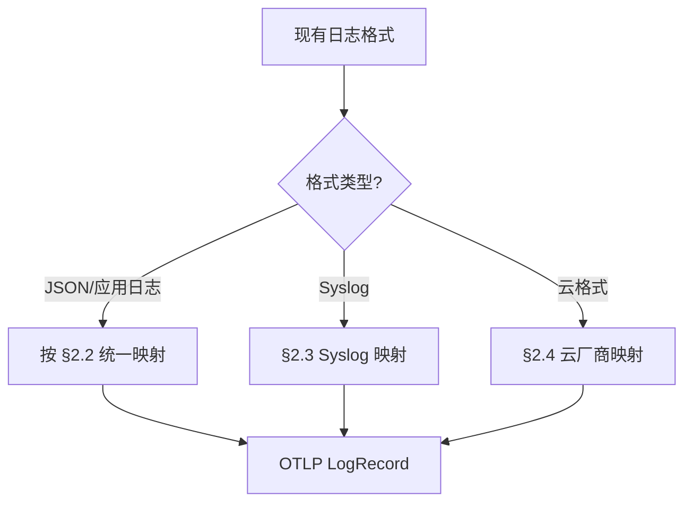

---
title: Logs 统一结构与多格式无歧义映射
description: Logs 统一结构与多格式无歧义映射 详细指南和最佳实践
version: OTLP v1.10.0
date: 2026-03-17
author: OTLP项目团队
category: 核心实现
tags:
  - otlp
  - observability
status: published
---

# Logs 统一结构与多格式无歧义映射

> **覆盖范围**: OTLP Logs Data Model（统一日志结构：Event/属性/资源；多种日志格式到 OTLP LogRecord 的无歧义映射）
> **权威参考**: [OpenTelemetry Logs 规范](https://opentelemetry.io/docs/specs/otel/logs/)
> **最后更新**: 2025-02-10

---

## 目录

- [Logs 统一结构与多格式无歧义映射](#logs-统一结构与多格式无歧义映射)
  - [目录](#目录)
  - [1. 统一日志结构](#1-统一日志结构)
    - [1.1 三层结构](#11-三层结构)
    - [1.2 LogRecord 统一字段（事件级）](#12-logrecord-统一字段事件级)
    - [1.3 属性（Attributes）与资源（Resource）的划分](#13-属性attributes与资源resource的划分)
  - [2. 多格式到 OTLP LogRecord 的无歧义映射](#2-多格式到-otlp-logrecord-的无歧义映射)
    - [2.1 通用映射规则](#21-通用映射规则)
    - [2.2 JSON 日志（常见应用结构化日志）](#22-json-日志常见应用结构化日志)
    - [2.3 Syslog（RFC 5424 风格）](#23-syslogrfc-5424-风格)
    - [2.4 云厂商日志格式（以 AWS CloudWatch Logs 为例）](#24-云厂商日志格式以-aws-cloudwatch-logs-为例)
    - [2.5 简要映射表汇总](#25-简要映射表汇总)
  - [3. 参考资源](#3-参考资源)

**多格式→OTLP 映射决策树**（本页内嵌）：



---

## 1. 统一日志结构

OpenTelemetry Logs 采用**三层统一结构**：单条日志以 **LogRecord**（即一条日志事件 Event）为单位，配合 **属性（Attributes）** 与 **资源（Resource）**，实现与 Traces/Metrics 一致的可观测性模型。

### 1.1 三层结构

| 层级 | 含义 | 典型内容 |
|------|------|----------|
| **Resource** | 产生日志的实体 | service.name、host.name、k8s.deployment.name 等（见 [04_Resource](../04_Resource/01_Resource模型.md)） |
| **Scope** | 日志来源的 instrumentation 范围 | ScopeLogs：logger name、SDK 版本等 |
| **LogRecord（Event）** | 单条日志事件 | 时间戳、严重性、body、attributes、trace_id/span_id |

**说明**：在 OTLP 中，“Event”即一条日志记录，对应一个 **LogRecord**；与 Span 的 events 不同，Logs 信号中的最小单位就是 LogRecord。

### 1.2 LogRecord 统一字段（事件级）

每条日志事件（LogRecord）均包含以下统一字段，便于无歧义解析与存储：

| 字段 | 类型 | 说明 |
|------|------|------|
| time_unix_nano | fixed64 | 事件发生时间（纳秒） |
| observed_time_unix_nano | fixed64 | 观测/采集时间（可选） |
| severity_number | SeverityNumber | 数值严重性（1–24） |
| severity_text | string | 文本严重性（如 INFO、ERROR） |
| body | AnyValue | 日志内容（string / 结构化 map/array） |
| attributes | repeated KeyValue | 事件级键值对属性 |
| trace_id | bytes | 关联的 Trace（可选） |
| span_id | bytes | 关联的 Span（可选） |
| flags | fixed32 | 含 TraceFlags 等 |

### 1.3 属性（Attributes）与资源（Resource）的划分

- **LogRecord.attributes**：仅描述**该条日志事件**本身的属性（如 error.type、user.id、event.name）。
- **Resource.attributes**：描述**产生日志的实体**，对所有该 Resource 下的 LogRecord 共用（如 service.name、host.name）。
- 查询与聚合时：按 Resource 过滤“谁产生的日志”，按 LogRecord.attributes 过滤“什么类型的事件”。

---

## 2. 多格式到 OTLP LogRecord 的无歧义映射

以下给出从常见日志格式到 OTLP LogRecord（及 Resource/Scope）字段的**无歧义映射表**与简要规则，便于实现转换器或 Collector 插件时保持一致语义。

### 2.1 通用映射规则

- **时间**：源格式的时间 → `time_unix_nano`；若无可观测时间，可用接收时间填 `observed_time_unix_nano`。
- **正文**：源格式的“消息/body” → `body`（优先保留为 string；若为结构化对象，可放入 body 的 map 或拆到 attributes）。
- **严重性**：源级别 → `severity_number` + `severity_text`（见 [02_Logs字段与严重性详解](./02_Logs字段与严重性详解.md) 级别映射）。
- **维度/标签**：源格式的键值对 → `LogRecord.attributes` 或部分进入 `Resource.attributes`（见下各格式）。

### 2.2 JSON 日志（常见应用结构化日志）

假设单条 JSON 日志形如：

```json
{
  "timestamp": "2025-02-10T12:00:00.123Z",
  "level": "INFO",
  "message": "Order created",
  "userId": "u-123",
  "orderId": "ORD-456",
  "amount": 99.99
}
```

| 源字段 | OTLP 目标 | 说明 |
|--------|-----------|------|
| timestamp | LogRecord.time_unix_nano | 解析为 Unix 纳秒 |
| level | LogRecord.severity_number + severity_text | INFO→9+"INFO" 等 |
| message | LogRecord.body | 字符串类型 |
| userId, orderId, amount 等 | LogRecord.attributes | 键建议语义化，如 user.id、order.id（见语义约定） |

**无歧义规则**：

- 仅将“消息正文”放入 body；其余一律放入 attributes，避免同一信息既在 body 又在 attributes 导致重复或歧义。
- 若整条 JSON 作为“不解析”的 blob，可把整个 JSON 字符串放入 body，或解析后按上表拆分。

### 2.3 Syslog（RFC 5424 风格）

| 源字段 | OTLP 目标 | 说明 |
|--------|-----------|------|
| TIMESTAMP | LogRecord.time_unix_nano | 解析为 Unix 纳秒 |
| SEVERITY (数字) | LogRecord.severity_number | 与 OTel 严重性映射（见规范） |
| MSG | LogRecord.body | 消息内容 |
| HOSTNAME | Resource.attributes["host.name"] | 产生日志的主机 |
| APP-NAME | Scope 或 Resource.attributes["process.name"] | 视实现选择 |
| PROCID, MSGID 等 | LogRecord.attributes | 如 syslog.procid、syslog.msgid |
| STRUCTURED-DATA | LogRecord.attributes | 解析为键值对放入 attributes |

**无歧义规则**：

- 仅 MSG 放入 body；STRUCTURED-DATA 与其它元数据一律进 attributes 或 Resource，便于查询且不重复。

### 2.4 云厂商日志格式（以 AWS CloudWatch Logs 为例）

CloudWatch 单条事件通常包含：

- `timestamp`（毫秒）
- `message`
- 可选 `logGroup`、`logStream`、自定义 JSON 字段

| 源字段 | OTLP 目标 | 说明 |
|--------|-----------|------|
| timestamp | LogRecord.time_unix_nano | 毫秒转纳秒 |
| message | LogRecord.body | 字符串 |
| logGroup / logStream | Resource.attributes 或 LogRecord.attributes | 如 aws.log.group、aws.log.stream |
| 其它自定义字段 | LogRecord.attributes | 键名可加命名空间（如 aws.*）避免冲突 |

**无歧义规则**：

- 仅 message 作为 body；logGroup/logStream 等元数据进 Resource 或 attributes，便于按日志组/流过滤。

### 2.5 简要映射表汇总

| 源格式 | body 来源 | severity 来源 | 其它 → attributes/Resource |
|--------|-----------|----------------|----------------------------|
| JSON 日志 | message / msg | level / severity | 其余键值对 → attributes |
| Syslog | MSG | SEVERITY | HOSTNAME→Resource；STRUCTURED-DATA→attributes |
| CloudWatch | message | 若有 level 则映射 | logGroup/logStream→Resource 或 attributes |
| 纯文本行 | 整行 | 可选默认 INFO | 可放 source 等进 attributes |

---

## 3. 参考资源

- **OpenTelemetry Logs 规范**: <https://opentelemetry.io/docs/specs/otel/logs/>
- **LogRecord 结构**: [01_Logs概述](./01_Logs概述.md)、[02_Logs字段与严重性详解](./02_Logs字段与严重性详解.md)
- **Resource 模型**: [04_Resource/01_Resource模型](../04_Resource/01_Resource模型.md)
- **范围-权威对齐矩阵**: [00_范围-权威对齐矩阵](../../🔬_批判性评价与持续改进计划/00_范围-权威对齐矩阵.md)
