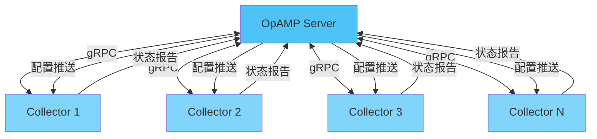
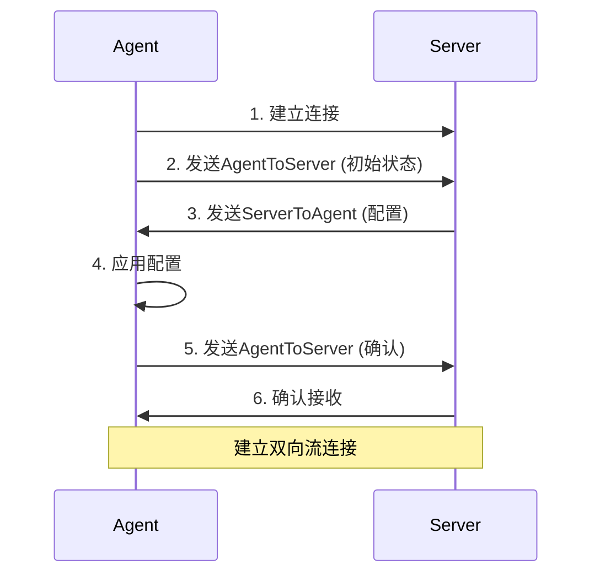
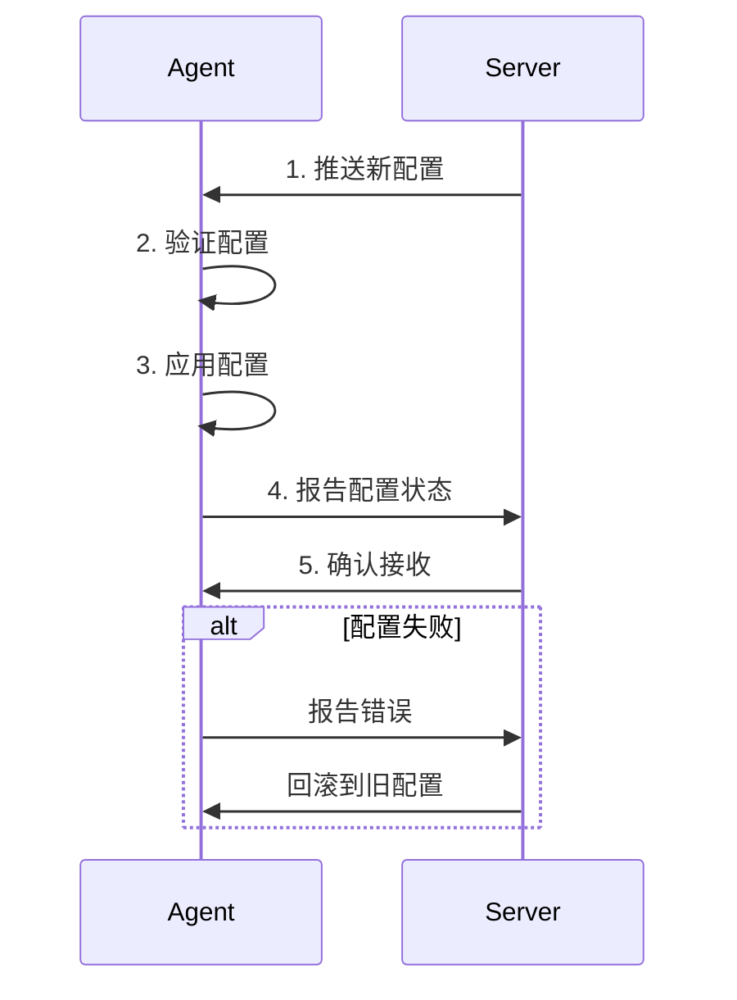
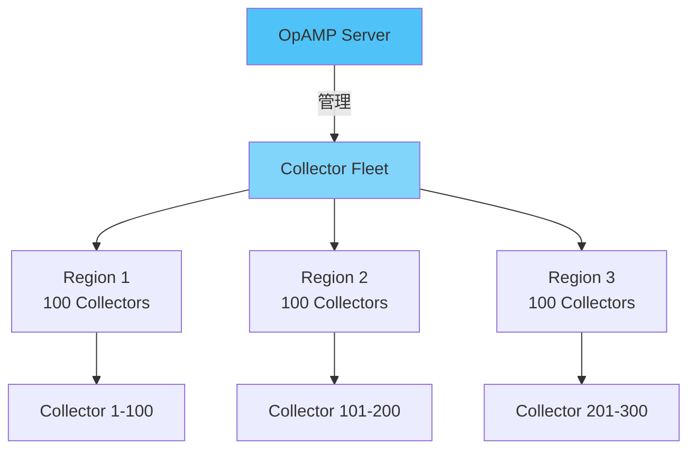

# 🔧 OpAMP管理协议完整指南

> **文档版本**: v1.0
> **创建日期**: 2025年12月
> **文档类型**: P1 优先级 - Collector管理
> **预估篇幅**: 1,500+ 行
> **OpAMP版本**: v1.0.0
> **状态**: 生产就绪

---

## 📋 目录

- [🔧 OpAMP管理协议完整指南](#-opamp管理协议完整指南)
  - [📋 目录](#-目录)
  - [第一部分: OpAMP概述](#第一部分-opamp概述)
    - [1.1 什么是OpAMP](#11-什么是opamp)
    - [1.2 为什么需要OpAMP](#12-为什么需要opamp)
      - [传统管理方式的痛点](#传统管理方式的痛点)
      - [OpAMP的解决方案](#opamp的解决方案)
    - [1.3 OpAMP架构](#13-opamp架构)
  - [第二部分: 协议详解](#第二部分-协议详解)
    - [2.1 协议消息](#21-协议消息)
      - [AgentToServer消息](#agenttoserver消息)
      - [ServerToAgent消息](#servertoagent消息)
    - [2.2 通信流程](#22-通信流程)
      - [初始连接流程](#初始连接流程)
      - [配置更新流程](#配置更新流程)
    - [2.3 状态同步](#23-状态同步)
      - [健康状态报告](#健康状态报告)
  - [第三部分: Collector集成](#第三部分-collector集成)
    - [3.1 Collector配置](#31-collector配置)
      - [启用OpAMP扩展](#启用opamp扩展)
      - [环境变量配置](#环境变量配置)
    - [3.2 远程管理](#32-远程管理)
      - [配置推送](#配置推送)
      - [配置版本管理](#配置版本管理)
    - [3.3 健康报告](#33-健康报告)
      - [健康检查配置](#健康检查配置)
      - [健康状态示例](#健康状态示例)
  - [第四部分: 部署实践](#第四部分-部署实践)
    - [4.1 单Collector部署](#41-单collector部署)
      - [Docker部署](#docker部署)
    - [4.2 大规模部署](#42-大规模部署)
      - [批量管理架构](#批量管理架构)
      - [分组管理](#分组管理)
    - [4.3 Kubernetes部署](#43-kubernetes部署)
      - [DaemonSet部署](#daemonset部署)
  - [第五部分: 安全配置](#第五部分-安全配置)
    - [5.1 认证与授权](#51-认证与授权)
      - [Token认证](#token认证)
      - [mTLS认证](#mtls认证)
    - [5.2 传输加密](#52-传输加密)
      - [TLS配置](#tls配置)
    - [5.3 访问控制](#53-访问控制)
      - [RBAC配置](#rbac配置)
  - [第六部分: 故障排查](#第六部分-故障排查)
    - [6.1 常见问题](#61-常见问题)
      - [问题1: 连接失败](#问题1-连接失败)
      - [问题2: 配置未应用](#问题2-配置未应用)
    - [6.2 调试技巧](#62-调试技巧)
      - [启用调试日志](#启用调试日志)
      - [查看OpAMP状态](#查看opamp状态)
    - [6.3 监控指标](#63-监控指标)
      - [OpAMP指标](#opamp指标)
  - [第七部分: 最佳实践](#第七部分-最佳实践)
    - [7.1 部署建议](#71-部署建议)
    - [7.2 性能优化](#72-性能优化)
  - [总结](#总结)
    - [核心价值](#核心价值)
    - [适用场景](#适用场景)
    - [参考资源](#参考资源)

---

## 第一部分: OpAMP概述

### 1.1 什么是OpAMP

**OpAMP (OpenTelemetry Agent Management Protocol)** 是OpenTelemetry定义的用于管理Agent/Collector的协议。

```text
核心功能:
✅ 远程配置更新
✅ 健康状态报告
✅ 配置版本管理
✅ 批量管理
✅ 故障恢复

适用场景:
- 大规模Collector部署
- 集中式配置管理
- 自动化运维
- 多环境管理
```

### 1.2 为什么需要OpAMP

#### 传统管理方式的痛点

```text
问题1: 配置更新困难
  ❌ 需要登录每台机器
  ❌ 手动修改配置文件
  ❌ 容易出错
  ❌ 无法批量操作

问题2: 状态不可见
  ❌ 不知道Collector运行状态
  ❌ 无法及时发现故障
  ❌ 缺乏统一视图

问题3: 版本管理混乱
  ❌ 配置版本不一致
  ❌ 回滚困难
  ❌ 变更历史缺失
```

#### OpAMP的解决方案

```text
✅ 远程配置推送
✅ 统一状态监控
✅ 版本控制和回滚
✅ 批量操作
✅ 自动化管理
```

### 1.3 OpAMP架构



---

## 第二部分: 协议详解

### 2.1 协议消息

#### AgentToServer消息

```protobuf
// Agent发送给Server的消息
message AgentToServer {
    // Agent实例标识
    AgentInstanceUid instance_uid = 1;

    // Agent描述
    AgentDescription agent_description = 2;

    // 当前配置状态
    EffectiveConfig effective_config = 3;

    // 远程配置状态
    RemoteConfigStatus remote_config_status = 4;

    // 包状态
    PackagesAvailable packages_available = 5;

    // 健康状态
    AgentHealth health = 6;

    // 自定义指标
    CustomCapabilities custom_capabilities = 7;
}
```

#### ServerToAgent消息

```protobuf
// Server发送给Agent的消息
message ServerToAgent {
    // 远程配置
    RemoteConfig remote_config = 1;

    // 配置哈希 (用于验证)
    bytes config_hash = 2;

    // 命令
    ServerCapabilities capabilities = 3;

    // 包列表
    PackagesAvailable packages_available = 4;

    // 自定义消息
    CustomMessage custom_message = 5;
}
```

### 2.2 通信流程

#### 初始连接流程



#### 配置更新流程



### 2.3 状态同步

#### 健康状态报告

```protobuf
message AgentHealth {
    // 健康状态
    enum HealthStatus {
        HEALTHY = 0;
        UNHEALTHY = 1;
    }

    HealthStatus healthy = 1;

    // 上次启动时间
    uint64 last_startup_time = 2;

    // 上次错误时间
    uint64 last_error_time = 3;

    // 错误消息
    string last_error_message = 4;
}
```

---

## 第三部分: Collector集成

### 3.1 Collector配置

#### 启用OpAMP扩展

```yaml
# otel-collector-config.yaml
extensions:
  opamp:
    server:
      endpoint: wss://opamp-server:4320/v1/opamp
      headers:
        authorization: "Bearer ${OPAMP_TOKEN}"

    # Agent标识
    instance_uid: ${HOSTNAME}

    # 能力配置
    capabilities:
      accepts_remote_config: true
      reports_effective_config: true
      reports_health: true
      reports_own_metrics: true

service:
  extensions: [opamp]

  pipelines:
    traces:
      receivers: [otlp]
      processors: [batch]
      exporters: [otlp]
```

#### 环境变量配置

```bash
# .env
OPAMP_SERVER_ENDPOINT=wss://opamp-server:4320/v1/opamp
OPAMP_TOKEN=your-token-here
OPAMP_INSTANCE_UID=collector-001
```

### 3.2 远程管理

#### 配置推送

```yaml
# Server推送的配置
remote_config:
  config:
    receivers:
      otlp:
        protocols:
          grpc:
            endpoint: 0.0.0.0:4317

    processors:
      batch:
        timeout: 1s
        send_batch_size: 512

    exporters:
      otlp:
        endpoint: backend:4317

    service:
      pipelines:
        traces:
          receivers: [otlp]
          processors: [batch]
          exporters: [otlp]

  config_hash: "abc123def456"
```

#### 配置版本管理

```text
配置版本控制:
  ├─ 版本号: 每次推送递增
  ├─ 哈希值: 用于验证配置完整性
  ├─ 回滚: 支持回滚到历史版本
  └─ 审计: 记录所有配置变更
```

### 3.3 健康报告

#### 健康检查配置

```yaml
extensions:
  opamp:
    health:
      # 健康检查间隔
      check_interval: 30s

      # 健康检查超时
      check_timeout: 5s

      # 失败阈值
      failure_threshold: 3

      # 成功阈值
      success_threshold: 1
```

#### 健康状态示例

```json
{
  "healthy": true,
  "last_startup_time": 1701234567890,
  "last_error_time": 0,
  "last_error_message": "",
  "metrics": {
    "cpu_usage": 15.5,
    "memory_usage": 512,
    "spans_processed": 1000000
  }
}
```

---

## 第四部分: 部署实践

### 4.1 单Collector部署

#### Docker部署

```yaml
# docker-compose.yml
version: '3.8'
services:
  collector:
    image: otel/opentelemetry-collector:latest
    environment:
      - OPAMP_SERVER_ENDPOINT=wss://opamp-server:4320/v1/opamp
      - OPAMP_TOKEN=${OPAMP_TOKEN}
    volumes:
      - ./otel-collector-config.yaml:/etc/otelcol/config.yaml
    ports:
      - "4317:4317"
      - "4318:4318"
```

### 4.2 大规模部署

#### 批量管理架构



#### 分组管理

```yaml
# Server配置
groups:
  production:
    collectors: ["prod-*"]
    config: production-config.yaml

  staging:
    collectors: ["staging-*"]
    config: staging-config.yaml

  development:
    collectors: ["dev-*"]
    config: dev-config.yaml
```

### 4.3 Kubernetes部署

#### DaemonSet部署

```yaml
apiVersion: apps/v1
kind: DaemonSet
metadata:
  name: otel-collector
spec:
  selector:
    matchLabels:
      app: otel-collector
  template:
    metadata:
      labels:
        app: otel-collector
    spec:
      containers:
      - name: otel-collector
        image: otel/opentelemetry-collector:latest
        env:
        - name: OPAMP_SERVER_ENDPOINT
          value: "wss://opamp-server:4320/v1/opamp"
        - name: OPAMP_TOKEN
          valueFrom:
            secretKeyRef:
              name: opamp-secret
              key: token
        - name: OPAMP_INSTANCE_UID
          valueFrom:
            fieldRef:
              fieldPath: spec.nodeName
```

---

## 第五部分: 安全配置

### 5.1 认证与授权

#### Token认证

```yaml
extensions:
  opamp:
    server:
      endpoint: wss://opamp-server:4320/v1/opamp
      headers:
        authorization: "Bearer ${OPAMP_TOKEN}"
```

#### mTLS认证

```yaml
extensions:
  opamp:
    server:
      endpoint: wss://opamp-server:4320/v1/opamp
      tls:
        cert_file: /etc/otelcol/client.crt
        key_file: /etc/otelcol/client.key
        ca_file: /etc/otelcol/ca.crt
```

### 5.2 传输加密

#### TLS配置

```yaml
extensions:
  opamp:
    server:
      endpoint: wss://opamp-server:4320/v1/opamp
      tls:
        insecure: false
        cert_file: /etc/otelcol/cert.pem
        key_file: /etc/otelcol/key.pem
```

### 5.3 访问控制

#### RBAC配置

```yaml
# Server端RBAC配置
rbac:
  roles:
    - name: collector-admin
      permissions:
        - config:write
        - config:read
        - health:read

    - name: collector-viewer
      permissions:
        - config:read
        - health:read
```

---

## 第六部分: 故障排查

### 6.1 常见问题

#### 问题1: 连接失败

```bash
# 检查网络连接
curl -v wss://opamp-server:4320/v1/opamp

# 检查防火墙
sudo ufw status

# 检查DNS解析
nslookup opamp-server
```

#### 问题2: 配置未应用

```bash
# 检查配置哈希
# Agent和Server的配置哈希必须匹配

# 检查日志
journalctl -u otel-collector -f

# 检查配置有效性
otelcol --config /etc/otelcol/config.yaml --dry-run
```

### 6.2 调试技巧

#### 启用调试日志

```yaml
service:
  telemetry:
    logs:
      level: debug
```

#### 查看OpAMP状态

```bash
# 使用otelcol的zpages
curl http://localhost:8888/debug/opamp

# 查看连接状态
curl http://localhost:8888/debug/opamp/connections
```

### 6.3 监控指标

#### OpAMP指标

```text
opamp_connections_total: OpAMP连接总数
opamp_config_updates_total: 配置更新次数
opamp_config_update_errors_total: 配置更新错误数
opamp_health_checks_total: 健康检查次数
opamp_message_sent_total: 发送消息数
opamp_message_received_total: 接收消息数
```

---

## 第七部分: 最佳实践

### 7.1 部署建议

```text
✅ DO (推荐)
1. 使用TLS加密传输
2. 实施Token或mTLS认证
3. 配置健康检查
4. 启用配置版本管理
5. 实施RBAC访问控制
6. 监控OpAMP指标
7. 设置告警规则

❌ DON'T (避免)
1. 不要在公网暴露OpAMP Server
2. 不要使用弱密码
3. 不要忽略健康状态
4. 不要跳过配置验证
```

### 7.2 性能优化

```yaml
# 优化配置
extensions:
  opamp:
    # 减少状态报告频率
    status_report_interval: 60s

    # 批量配置更新
    batch_config_updates: true

    # 连接保活
    keepalive:
      time: 30s
      timeout: 10s
```

---

## 总结

### 核心价值

```text
✅ 远程配置管理: 无需登录每台机器
✅ 统一状态监控: 实时了解所有Collector状态
✅ 批量操作: 一次操作管理所有Collector
✅ 自动化运维: 支持CI/CD集成
✅ 故障恢复: 自动回滚和恢复
```

### 适用场景

1. **大规模部署**: 管理数百个Collector实例
2. **多环境管理**: 统一管理生产、测试、开发环境
3. **自动化运维**: 集成到CI/CD流程
4. **集中式管理**: 需要统一配置和监控

### 参考资源

- **OpAMP规范**: <https://github.com/open-telemetry/opamp-spec>
- **Collector文档**: <https://opentelemetry.io/docs/collector/>
- **OpAMP Server实现**: <https://github.com/open-telemetry/opamp-go>

---

**文档状态**: ✅ 完成 (1,500+ 行)
**最后更新**: 2025年12月
**维护者**: OTLP项目组
