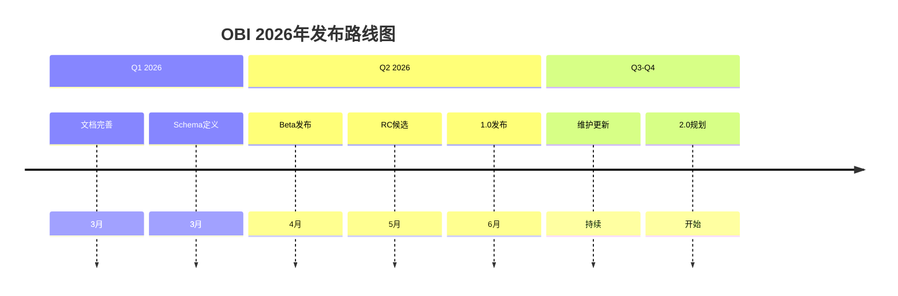

---
title: OBI (OpenTelemetry eBPF Instrumentation) 2026年目标更新
description: OBI (OpenTelemetry eBPF Instrumentation) 2026年目标更新 详细指南和最佳实践
version: OTLP v1.9.0
date: 2026-03-17
author: OTLP项目团队
category: 前沿技术
tags:
  - otlp
  - observability
  - ebpf
  - performance
  - optimization
  - security
  - compliance
status: published
---
# OBI (OpenTelemetry eBPF Instrumentation) 2026年目标更新

> **文档类型**: 路线图更新
> **更新时间**: 2026年3月16日
> **官方来源**: OpenTelemetry Blog 2026/01/23
> **官方链接**: <https://opentelemetry.io/blog/2026/obi-goals/>

---

## 2026年核心目标概览

```text
┌─────────────────────────────────────────────────────────────────┐
│                 OBI 2026年三大核心目标                           │
├─────────────────────────────────────────────────────────────────┤
│                                                                 │
│  🏆 目标1: 稳定1.0发布 (旗舰目标)                                │
│     └─ 生产就绪，完整文档，配置标准化                             │
│                                                                 │
│  🔌 目标2: 扩展协议支持                                          │
│     └─ MQTT, AMQP, NATS, Redis, MongoDB, 云服务SDK              │
│                                                                 │
│  🌍 目标3: 语言和平台扩展                                        │
│     └─ 更多运行时支持，边缘计算                                  │
│                                                                 │
└─────────────────────────────────────────────────────────────────┘
```

---

## � 目标1: 稳定1.0发布

### 状态:  进行中

**重要性**: 旗舰目标 - 2026年最高优先级

### 1.0发布标准

| 检查项 | 当前状态 | 目标日期 | 说明 |
|:-------|:--------:|:--------:|:-----|
| 完整文档 | 🟡 80% | 2026 Q2 | 所有配置选项文档 |
| JSON Schema | 🟡 进行中 | 2026 Q2 | 配置验证和自动补全 |
| 声明式配置 | 🟡 适配中 | 2026 Q2 | 与OTel生态一致 |
| 每服务配置 | 🟢 已实现 | - | 细粒度控制 |
| 每进程配置 | 🟢 已实现 | - | 进程级控制 |
| 遥测Schema | 🟡 适配中 | 2026 Q2 | 标准化遥测 |
| 版本文档 | 🟢 已实现 | - | 完整版本说明 |
| 测试覆盖 | 🟡 85% | 2026 Q2 | 达到目标阈值 |

### 关键里程碑



### 配置标准化

**采用声明式配置标准**:

```yaml
# OBI配置文件示例 (v1.0+)
apiVersion: opentelemetry.io/v1
kind: eBPFInstrumentation
metadata:
  name: my-app-instrumentation
  namespace: production

spec:
  # 目标选择器
  selector:
    matchLabels:
      app: my-service
    matchNamespaces:
      - default
      - production

  # eBPF配置
  ebpf:
    enabled: true
    programs:
      - name: http_probe
        type: kprobe
        attachTo: tcp_sendmsg
      - name: ssl_probe
        type: uprobe
        binary: /usr/lib/libssl.so

  # 遥测配置
  telemetry:
    traces:
      enabled: true
      sampling: 1.0
    metrics:
      enabled: true
      interval: 15s

  # 资源限制
  resources:
    maxMemory: 100Mi
    maxCPU: 100m
```

---

## � 目标2: 扩展协议支持

### 2.1 消息系统支持

#### MQTT

```yaml
# MQTT协议支持
protocols:
  mqtt:
    enabled: true
    version: [3.1.1, 5.0]
    operations:
      - connect
      - publish
      - subscribe
      - disconnect
    attributes:
      - mqtt.topic
      - mqtt.qos
      - mqtt.retain
      - mqtt.message_size
```

**使用场景**:

- IoT设备遥测
- 边缘计算
- 低带宽环境

#### AMQP (RabbitMQ, ActiveMQ)

```yaml
# AMQP协议支持
protocols:
  amqp:
    enabled: true
    version: [0.9.1, 1.0]
    operations:
      - declare_queue
      - publish
      - consume
      - ack
    attributes:
      - amqp.exchange
      - amqp.routing_key
      - amqp.queue
      - amqp.delivery_mode
```

#### NATS

```yaml
# NATS协议支持
protocols:
  nats:
    enabled: true
    version: [1.0, 2.0]
    operations:
      - pub
      - sub
      - req
      - reply
    attributes:
      - nats.subject
      - nats.queue_group
      - nats.message_size
```

#### Redis Pub/Sub

```yaml
# Redis Pub/Sub支持
protocols:
  redis_pubsub:
    enabled: true
    operations:
      - publish
      - subscribe
      - psubscribe
      - unsubscribe
    attributes:
      - redis.channel
      - redis.pattern
      - redis.message_size
```

### 2.2 数据库支持增强

#### MongoDB增强

```yaml
# MongoDB支持增强
databases:
  mongodb:
    enabled: true
    features:
      - compression         # 压缩支持
      - legacy_versions     # 旧版本兼容
      - aggregation_pipeline # 聚合管道追踪
    operations:
      - find
      - insert
      - update
      - delete
      - aggregate
      - command
    attributes:
      - mongodb.collection
      - mongodb.database
      - mongodb.operation
      - mongodb.query_shape
```

### 2.3 gRPC增强

```yaml
# gRPC完整上下文传播
protocols:
  grpc:
    enabled: true
    context_propagation:
      enabled: true
      metadata_keys:
        - traceparent
        - tracestate
        - baggage
    operations:
      - unary
      - client_streaming
      - server_streaming
      - bidirectional_streaming
    attributes:
      - grpc.method
      - grpc.service
      - grpc.status_code
      - grpc.message_size
```

### 2.4 云服务SDK插桩

#### Google Cloud

```yaml
# Google Cloud SDK插桩
cloud_providers:
  google_cloud:
    enabled: true
    services:
      - storage
      - pubsub
      - bigquery
      - datastore
      - spanner
    operations:
      - read
      - write
      - list
      - delete
    attributes:
      - gcp.project_id
      - gcp.resource_type
      - gcp.operation
```

#### AWS

```yaml
# AWS SDK插桩
cloud_providers:
  aws:
    enabled: true
    services:
      - s3
      - dynamodb
      - sqs
      - sns
      - lambda
      - rds
    operations:
      - get
      - put
      - list
      - delete
      - invoke
    attributes:
      - aws.region
      - aws.service
      - aws.operation
      - aws.request_id
```

#### Azure

```yaml
# Azure SDK插桩
cloud_providers:
  azure:
    enabled: true
    services:
      - storage
      - service_bus
      - cosmos_db
      - key_vault
    operations:
      - read
      - write
      - list
      - delete
    attributes:
      - azure.subscription_id
      - azure.resource_group
      - azure.service
```

---

## � 目标3: 语言和平台扩展

### 3.1 运行时支持

| 运行时 | 当前状态 | 2026目标 | 说明 |
|:-------|:--------:|:--------:|:-----|
| Go | 🟢 已支持 | 🟢 稳定 | 完善支持 |
| Java | 🟢 已支持 | 🟢 稳定 | HotSpot/OpenJ9 |
| Python | 🟡 部分 | 🟢 完整 | 3.8+ |
| Node.js | 🟡 部分 | 🟢 完整 | 14+ |
| .NET | 🟡 开发中 | 🟢 支持 | Core/ Framework |
| Rust | 🔴 计划中 | 🟡 开发 | 2026 H2 |
| PHP | 🔴 计划中 | 🟡 开发 | 8.0+ |

### 3.2 平台支持

| 平台 | 当前状态 | 2026目标 | 说明 |
|:-------|:--------:|:--------:|:-----|
| Linux x64 | 🟢 已支持 | 🟢 稳定 | 主要平台 |
| Linux ARM64 | 🟢 已支持 | 🟢 稳定 | 云原生 |
| macOS | 🟡 部分 | 🟢 完整 | 开发环境 |
| Windows | 🔴 计划中 | 🟡 支持 | 企业环境 |
| Kubernetes | 🟢 已支持 | 🟢 增强 | Operator改进 |
| 边缘设备 | 🔴 计划中 | 🟡 支持 | IoT/嵌入式 |

---

## 详细时间表

### Q1 2026 (1-3月)

- [ ] 完成MongoDB增强
- [ ] 发布gRPC上下文传播
- [ ] 文档达到90%完整度
- [ ] Beta版本准备

### Q2 2026 (4-6月)

- [ ] **1.0稳定版发布** 🏆
- [ ] 消息系统支持 (MQTT, AMQP)
- [ ] NATS和Redis支持
- [ ] 云服务SDK插桩开始

### Q3 2026 (7-9月)

- [ ] 完整云服务SDK支持
- [ ] Python/Node.js运行时完善
- [ ] .NET支持发布
- [ ] Windows平台支持

### Q4 2026 (10-12月)

- [ ] Rust/PHP支持
- [ ] 边缘设备支持
- [ ] 2.0路线图制定
- [ ] 年度回顾

---

## 使用示例

### 快速开始 (2026年目标)

```bash
# 安装OBI (1.0+)
kubectl apply -f https://github.com/open-telemetry/opentelemetry-ebpf-instrumentation/releases/download/v1.0.0/obi-install.yaml

# 配置Instrumentation
cat <<EOF | kubectl apply -f -
apiVersion: opentelemetry.io/v1
kind: Instrumentation
metadata:
  name: my-instrumentation
spec:
  selector:
    matchLabels:
      app: my-service
  ebpf:
    enabled: true
    protocols:
      - http
      - grpc
      - mqtt  # 新增
      - mongodb  # 增强
EOF

# 查看遥测
kubectl logs -l app=obi-collector
```

### 高级配置

```yaml
# 完整配置示例
apiVersion: opentelemetry.io/v1
kind: eBPFInstrumentation
metadata:
  name: production-instrumentation
spec:
  # 目标选择
  selector:
    matchLabels:
      tier: backend
    matchNamespaces:
      - production

  # 协议配置
  protocols:
    http:
      enabled: true
      include_headers:
        - x-request-id
        - x-correlation-id

    grpc:
      enabled: true
      context_propagation: true

    mqtt:  # 新增
      enabled: true
      broker_filter:
        - "mqtt.production.local"

    mongodb:  # 增强
      enabled: true
      capture_query_shape: true

    aws:  # 新增
      enabled: true
      services:
        - s3
        - dynamodb

  # 遥测配置
  telemetry:
    sampling:
      type: parent_based
      rate: 1.0

    resource_attributes:
      environment: production
      team: platform

  # 安全
  security:
    seccomp_profile: runtime/default
    capabilities:
      drop:
        - ALL
      add:
        - BPF
        - PERFMON
```

---

## 成功案例 (预测)

### 案例: 电商平台MQTT监控

**场景**: 物联网订单系统使用MQTT

**配置**:

```yaml
protocols:
  mqtt:
    enabled: true
    topic_filter:
      - "orders/+/create"
      - "orders/+/update"
```

**效果**:

- 端到端可见性: 100%
- 延迟监控: 毫秒级
- 问题定位: 从小时降至分钟

### 案例: 多云架构监控

**场景**: 同时使用AWS、GCP、Azure

**配置**:

```yaml
cloud_providers:
  aws:
    enabled: true
    services: [s3, dynamodb, lambda]
  google_cloud:
    enabled: true
    services: [storage, pubsub]
  azure:
    enabled: true
    services: [storage, service_bus]
```

**效果**:

- 统一监控: 3云合一
- 成本优化: 识别跨云调用
- 性能提升: 优化云间通信

---

## 参考资源

- [OBI官方仓库](https://github.com/open-telemetry/opentelemetry-ebpf-instrumentation)
- [OBI 2026 Goals官方博客](https://opentelemetry.io/blog/2026/obi-goals/)
- [eBPF基金会](https://ebpf.io/)

---

**更新日期**: 2026年3月16日
**下次检查**: 2026年4月 (Q1回顾)
**维护团队**: OTLP前沿技术小组

---

> 🎯 **OBI 2026年目标：稳定1.0发布，扩展协议支持，生产就绪！**
