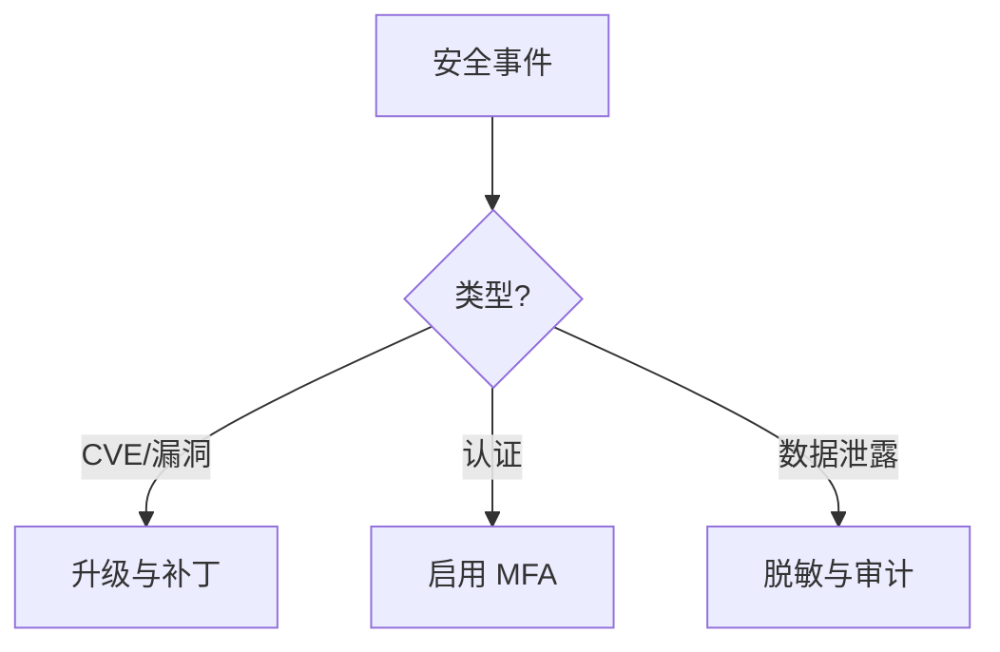

---
title: 2025年最新安全威胁与防护措施
description: 2025年最新安全威胁与防护措施 详细指南和最佳实践
version: OTLP v1.10.0
date: 2026-03-17
author: OTLP项目团队
category: 工具生态
tags:
  - otlp
  - observability
  - security
  - compliance
  - deployment
  - kubernetes
  - docker
status: published
---
# 2025年最新安全威胁与防护措施

> **更新日期**: 2025年10月18日
> **基于**: 2025年10月最新安全公告和行业趋势
> **重要性**: ⭐⭐⭐⭐⭐ 极高
> **紧急程度**: 🔴 需要立即关注

---

## � 执行摘要

**2025年可观测性系统面临的关键安全威胁**:

1. 🔴 **Grafana CVE-2025-6023**: 账户完全接管漏洞
2. 🟡 **强制MFA要求**: 行业新标准
3. 🟠 **供应链攻击**: OpenTelemetry组件风险
4. 🔵 **数据泄露**: PII/PHI通过追踪数据泄露

**立即行动事项**:

- [ ] 检查Grafana版本并升级
- [ ] 启用多因素认证（MFA）
- [ ] 审计追踪数据中的敏感信息
- [ ] 更新安全策略和培训

**威胁–防护矩阵**（本页内嵌）：

| 威胁类型 | 代表案例 | 防护措施 |
|----------|----------|----------|
| 账户接管 | CVE-2025-6023 (Grafana) | 升级、MFA、最小权限 |
| 认证弱化 | 单因素登录 | 强制 MFA、策略 |
| 供应链 | 依赖/组件漏洞 | 依赖审计、SBOM |
| 数据泄露 | PII/PHI 通过 Trace | 脱敏、访问控制、审计 |

**应对决策树**：



---

## � CVE-2025-6023: Grafana严重漏洞

### 漏洞概述

**CVE编号**: CVE-2025-6023
**发现时间**: 2025年10月
**严重程度**: 🔴 **高危（CVSS 8.5）**
**影响**: 账户完全接管（Account Takeover）

### 漏洞详情

**受影响版本**:

```text
Grafana 9.x: 9.0.0 - 9.5.x
Grafana 10.x: 10.0.0 - 10.3.x
Grafana 11.x: 11.0.0 - 11.1.x（早期版本）
```

**漏洞原理**:

```text
1. 不完整的修复（Incomplete Fix）
   - 之前CVE的修复不彻底
   - 绕过机制仍然存在

2. 认证绕过（Authentication Bypass）
   - 攻击者可以伪造身份令牌
   - 无需用户凭据即可登录

3. 权限提升（Privilege Escalation）
   - 普通用户 → 管理员
   - 访问所有仪表板和数据源
```

**攻击场景**:

```text
攻击者 → 构造恶意请求 → Grafana API
                ↓
        绕过认证检查
                ↓
        获取管理员Token
                ↓
    完全控制Grafana实例
        ↓               ↓
  查看所有数据      修改配置/删除数据
```

### 影响评估

**对OTLP系统的影响**:

| 场景 | 风险等级 | 影响 |
|------|----------|------|
| **Grafana可视化OTLP数据** | 🔴 高危 | 追踪数据完全暴露 |
| **Grafana管理Collector** | 🔴 高危 | 配置被篡改 |
| **Grafana访问控制** | 🔴 高危 | 所有用户数据泄露 |
| **不使用Grafana** | 🟢 无风险 | 不受影响 |

**潜在后果**:

```text
1. 数据泄露
   ├─ 所有追踪数据被查看
   ├─ 敏感业务信息暴露
   └─ 系统架构信息泄露

2. 系统破坏
   ├─ 删除历史数据
   ├─ 修改仪表板配置
   └─ 关闭告警规则

3. 合规问题
   ├─ GDPR违规（数据泄露）
   ├─ HIPAA违规（医疗数据）
   └─ PCI-DSS违规（支付数据）

4. 信任损害
   ├─ 客户信任流失
   ├─ 品牌声誉受损
   └─ 可能面临法律诉讼
```

### 修复措施

#### 1. 立即升级（� 最高优先级）

**安全版本**:

```bash
# 检查当前版本
grafana-server -v

# 如果版本低于以下版本，立即升级：
Grafana 9.x → 9.5.18+
Grafana 10.x → 10.3.5+
Grafana 11.x → 11.1.4+
```

**升级步骤**:

```bash
# Ubuntu/Debian
sudo apt-get update
sudo apt-get install grafana

# RHEL/CentOS
sudo yum update grafana

# Docker
docker pull grafana/grafana:11.1.4  # 使用最新安全版本
docker stop grafana
docker run -d \
  --name grafana \
  -p 3000:3000 \
  grafana/grafana:11.1.4

# Helm (Kubernetes)
helm upgrade grafana grafana/grafana \
  --set image.tag=11.1.4 \
  --reuse-values
```

#### 2. 临时缓解措施（如无法立即升级）

**网络隔离**:

```bash
# iptables限制访问
sudo iptables -A INPUT -p tcp --dport 3000 -s TRUSTED_IP -j ACCEPT
sudo iptables -A INPUT -p tcp --dport 3000 -j DROP

# 或使用nginx反向代理 + IP白名单
```

**Nginx配置示例**:

```nginx
upstream grafana {
    server localhost:3000;
}

server {
    listen 443 ssl;
    server_name grafana.company.com;

    # IP白名单
    allow 10.0.0.0/8;      # 内网
    allow 52.1.2.3;        # 特定公网IP
    deny all;

    # 额外的安全headers
    add_header X-Frame-Options "SAMEORIGIN" always;
    add_header X-Content-Type-Options "nosniff" always;
    add_header X-XSS-Protection "1; mode=block" always;

    location / {
        proxy_pass http://grafana;
        proxy_set_header Host $host;
        proxy_set_header X-Real-IP $remote_addr;
    }
}
```

#### 3. 启用多因素认证（MFA）

**配置Grafana MFA**:

```ini
# /etc/grafana/grafana.ini

[auth]
# 禁用匿名访问
disable_login_form = false

[auth.anonymous]
enabled = false

[auth.generic_oauth]
# 使用OAuth提供商的MFA
enabled = true
client_id = YOUR_CLIENT_ID
client_secret = YOUR_CLIENT_SECRET
scopes = openid profile email
auth_url = https://auth.company.com/authorize
token_url = https://auth.company.com/token

[security]
# 强制所有用户使用MFA
admin_user = admin
admin_password = <strong-password>
# 禁用密码登录，强制OAuth+MFA
disable_initial_admin_creation = false
```

#### 4. 审计和监控

**启用审计日志**:

```ini
[log]
mode = console file
level = info

[log.file]
level = info
format = json
log_rotate = true
max_days = 30

[auditing]
enabled = true
log_dashboard_load = true
log_dashboard_save = true
```

**监控异常登录**:

```bash
# 查找可疑登录
grep "Failed login" /var/log/grafana/grafana.log | tail -50

# 查找权限提升
grep "role changed" /var/log/grafana/grafana.log

# 查找异常API调用
grep "401\|403" /var/log/grafana/grafana.log | wc -l
```

### 检测是否已被攻击

**检查清单**:

```bash
# 1. 检查用户列表（是否有异常用户）
curl -u admin:password http://localhost:3000/api/users

# 2. 检查最近登录记录
grep "Successful login" /var/log/grafana/grafana.log | tail -100

# 3. 检查仪表板修改历史
curl -u admin:password http://localhost:3000/api/dashboards/db/DASHBOARD_UID/versions

# 4. 检查数据源配置（是否被篡改）
curl -u admin:password http://localhost:3000/api/datasources

# 5. 检查告警规则（是否被禁用）
curl -u admin:password http://localhost:3000/api/alert-notifications
```

**异常行为指标**:

- ⚠️  非工作时间的管理员登录
- ⚠️  未知IP地址的访问
- ⚠️  大量的API调用（数据导出）
- ⚠️  仪表板/数据源被删除
- ⚠️  用户权限被修改

---

## � 多因素认证（MFA）：2025年行业新标准

### 为什么MFA成为强制要求

**行业趋势**:

```text
2024年：MFA推荐但可选
2025年：MFA成为强制要求

主要推动力：
├─ Microsoft（强制合作伙伴启用MFA）
├─ AWS（IAM MFA强制）
├─ Google Cloud（组织策略MFA）
└─ 各国监管要求（GDPR、CCPA等）
```

**统计数据**:

```text
- 99.9%的账户入侵可被MFA阻止（Microsoft）
- 密码泄露导致81%的数据泄露（Verizon DBIR）
- MFA可减少账户接管（ATO）风险99.9%
```

### OTLP系统的MFA实施

#### 1. OpenTelemetry Collector认证

**基于OAuth2 + MFA的Collector配置**:

```yaml
# otel-collector-config-auth.yaml
extensions:
  oauth2:
    client_id: "otel-collector"
    client_secret: ${OAUTH2_CLIENT_SECRET}
    token_url: "https://auth.company.com/token"
    scopes: ["opentelemetry.write"]
    # MFA由OAuth服务器强制执行

receivers:
  otlp:
    protocols:
      grpc:
        endpoint: 0.0.0.0:4317
        auth:
          authenticator: oauth2  # 使用OAuth2认证
      http:
        endpoint: 0.0.0.0:4318
        auth:
          authenticator: oauth2

service:
  extensions: [oauth2]
  pipelines:
    traces:
      receivers: [otlp]
      processors: [batch]
      exporters: [jaeger]
```

#### 2. 应用SDK认证

**Go SDK with OAuth2 + MFA**:

```go
package main

import (
    "context"
    "golang.org/x/oauth2/clientcredentials"

    "go.opentelemetry.io/otel/exporters/otlp/otlptrace/otlptracegrpc"
    "google.golang.org/grpc"
    "google.golang.org/grpc/credentials/oauth"
)

func main() {
    ctx := context.Background()

    // OAuth2客户端凭据（需要MFA预授权）
    config := &clientcredentials.Config{
        ClientID:     "app-client-id",
        ClientSecret: "app-client-secret",
        TokenURL:     "https://auth.company.com/token",
        Scopes:       []string{"opentelemetry.write"},
    }

    // 创建带认证的gRPC连接
    conn, err := grpc.Dial(
        "collector:4317",
        grpc.WithPerRPCCredentials(
            oauth.NewOauthAccess(config.TokenSource(ctx)),
        ),
    )
    if err != nil {
        panic(err)
    }
    defer conn.Close()

    // 创建OTLP导出器
    exporter, err := otlptracegrpc.New(ctx,
        otlptracegrpc.WithGRPCConn(conn),
    )
    // ...
}
```

#### 3. 管理界面MFA

**Jaeger UI + MFA（使用OAuth2 Proxy）**:

```yaml
# docker-compose-jaeger-mfa.yml
version: '3.8'

services:
  oauth2-proxy:
    image: quay.io/oauth2-proxy/oauth2-proxy:latest
    command:
      - --provider=google
      - --email-domain=company.com
      - --upstream=http://jaeger-query:16686
      - --http-address=0.0.0.0:4180
      - --cookie-secret=YOUR_COOKIE_SECRET
      - --client-id=YOUR_CLIENT_ID
      - --client-secret=YOUR_CLIENT_SECRET
    ports:
      - "4180:4180"
    environment:
      - OAUTH2_PROXY_SKIP_PROVIDER_BUTTON=true

  jaeger-query:
    image: jaegertracing/jaeger-query:latest
    environment:
      - SPAN_STORAGE_TYPE=elasticsearch
    # 不直接暴露端口，只通过oauth2-proxy访问
```

### MFA实施最佳实践

#### 选择MFA方法

| 方法 | 安全性 | 用户体验 | 成本 | 推荐度 |
|------|--------|---------|------|--------|
| **SMS** | ⭐⭐ | ⭐⭐⭐⭐ | 低 | ❌ 不推荐（SIM劫持） |
| **TOTP（Authenticator App）** | ⭐⭐⭐⭐ | ⭐⭐⭐ | 免费 | ✅ 推荐 |
| **硬件令牌（YubiKey）** | ⭐⭐⭐⭐⭐ | ⭐⭐ | 中高 | ✅ 强烈推荐 |
| **生物识别** | ⭐⭐⭐⭐ | ⭐⭐⭐⭐⭐ | 高 | ✅ 推荐（移动端） |
| **Push通知** | ⭐⭐⭐⭐ | ⭐⭐⭐⭐⭐ | 中 | ✅ 推荐 |

#### 部署策略

**阶段性部署**:

```text
Phase 1（Week 1-2）: 管理员强制MFA
├─ 所有管理员账户
├─ DevOps团队
└─ 安全团队

Phase 2（Week 3-4）: 开发者启用MFA
├─ 有生产环境访问权限的开发者
└─ 提供培训和支持

Phase 3（Week 5-6）: 全员强制MFA
├─ 所有员工账户
└─ 禁用非MFA登录

Phase 4（Week 7+）: 审计和优化
├─ 监控MFA使用率
├─ 处理异常和bypass请求
└─ 持续改进
```

#### 应急访问（Break-Glass）

**紧急情况处理**:

```bash
# 创建应急账户（仅在MFA服务故障时使用）
# 1. 生成强密码
openssl rand -base64 32

# 2. 创建应急账户（受严格审计）
# 3. 密码存储在物理保险箱
# 4. 每次使用后必须重置密码
```

**应急访问流程**:

```text
1. 事件发生
   ↓
2. 安全团队批准
   ↓
3. 两人同时在场（双人控制）
   ↓
4. 使用应急账户
   ↓
5. 记录所有操作
   ↓
6. 事后审计和密码重置
```

---

## � 其他安全最佳实践

### 1. 敏感数据脱敏

**在Span中自动脱敏PII**:

```go
package main

import (
    "go.opentelemetry.io/otel/attribute"
    sdktrace "go.opentelemetry.io/otel/sdk/trace"
)

// PII脱敏处理器
type PIISanitizer struct{}

func (s *PIISanitizer) OnStart(parent context.Context, span sdktrace.ReadWriteSpan) {
    // 在span开始时脱敏
}

func (s *PIISanitizer) OnEnd(span sdktrace.ReadOnlySpan) {
    // 检查并脱敏PII字段
    attrs := span.Attributes()
    for _, attr := range attrs {
        key := string(attr.Key)

        // 敏感字段列表
        if containsSensitiveField(key) {
            // 替换为脱敏值
            span.SetAttributes(attribute.String(key, "***REDACTED***"))
        }

        // 检测信用卡号
        if isCreditCard(attr.Value.AsString()) {
            span.SetAttributes(attribute.String(key, maskCreditCard(attr.Value.AsString())))
        }
    }
}

func (s *PIISanitizer) Shutdown(ctx context.Context) error {
    return nil
}

// 注册处理器
tp := sdktrace.NewTracerProvider(
    sdktrace.WithSpanProcessor(&PIISanitizer{}),
    // ...
)
```

### 2. 网络加密

**TLS配置**:

```yaml
# otel-collector强制TLS
receivers:
  otlp:
    protocols:
      grpc:
        endpoint: 0.0.0.0:4317
        tls:
          cert_file: /certs/server.crt
          key_file: /certs/server.key
          client_ca_file: /certs/ca.crt
          # 强制客户端证书（mTLS）
          client_auth_type: RequireAndVerifyClientCert

exporters:
  otlp:
    endpoint: backend:4317
    tls:
      insecure: false
      cert_file: /certs/client.crt
      key_file: /certs/client.key
```

### 3. 最小权限原则

**RBAC配置示例**:

```yaml
# Kubernetes RBAC for Collector
apiVersion: rbac.authorization.k8s.io/v1
kind:ClusterRole
metadata:
  name: otel-collector
rules:
  # 只读权限
  - apiGroups: [""]
    resources: ["pods", "nodes"]
    verbs: ["get", "list", "watch"]

  # 禁止写入权限
  # - apiGroups: [""]
  #   resources: ["pods"]
  #   verbs: ["create", "delete", "update"]
```

---

## 安全检查清单

### 立即行动（本周）

- [ ] **检查Grafana版本**
  - 运行 `grafana-server -v`
  - 如果 < 安全版本，立即升级

- [ ] **启用Grafana MFA**
  - 配置OAuth2提供商
  - 强制所有用户使用MFA

- [ ] **审计追踪数据**
  - 检查是否包含PII/PHI
  - 实施自动脱敏

### 短期行动（本月）

- [ ] **实施全系统MFA**
  - Collector认证
  - 管理界面访问
  - API访问

- [ ] **启用TLS/mTLS**
  - Collector ↔ Backend
  - SDK ↔ Collector

- [ ] **网络隔离**
  - 限制Collector访问
  - 防火墙规则
  - VPN/专线

### 长期行动（持续）

- [ ] **安全培训**
  - 开发者安全编码
  - 运维团队安全操作

- [ ] **定期审计**
  - 每月安全审计
  - 渗透测试（每季度）

- [ ] **事件响应计划**
  - 制定应急预案
  - 定期演练

---

## 参考资源

### 安全公告

- [Grafana CVE-2025-6023详情](https://chinese.opswat.com/blog/grafana-cve-2025-6023)
- [Microsoft MFA要求](https://learn.microsoft.com/zh-cn/partner-center/announcements/2025-october)
- [OWASP Top 10 2025](https://owasp.org/www-project-top-ten/)

### 最佳实践指南

- [NIST MFA指南](https://www.nist.gov/itl/applied-cybersecurity/tig/back-basics-multi-factor-authentication)
- [CIS Benchmark](https://www.cisecurity.org/cis-benchmarks/)

---

**文档版本**: v1.0
**最后更新**: 2025-10-18
**下次更新**: 每月更新，或有重大安全事件时立即更新
**紧急联系**: <security@company.com>

**⚠️  安全是持续的过程，不是一次性任务！**
